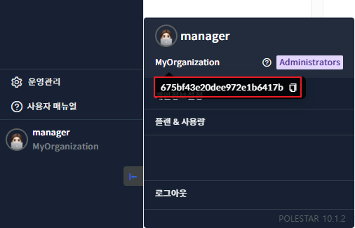

APM Java Agent 설치

Java 애플리케이션 관제를 위해서는 APM Java Agent를 다운 받고 관제 대상인 Java 애플리케이션의 설정 파일에 옵션을 설정하여 설치합니다.

설치 전 사전 준비 사항 확인 및 준비하여 설치 절차로 수행하면 APM Java Agent를 설치 할 수 있습니다.

사전 준비 사항

APM java Agent를 설치 전에 미리 준비 할 내용을 확인하고 준비를 해야 합니다.

> 사전 준비 항목

| 전송주소  | APM Java Agent가 데이터 수신할 Polestar10에 전송할 URL 주소      |
| ----- | --------------------------------------------------- |
| 조직아이디 | APM Java Agent의 추가할 조직의 아이디                         |
| 접근권한  | APM Java Agent가 설치할 디렉토리에 대한 애플리케이션에서 읽기 권한이 있는지 확인 |

> 조직 아이디 확인 절차

1.  Polestar10 로그인 한다.

2.  \[계정\]\>조직명 마우스 호버 한다.

3.  툴팁에 표시되는 조직 아이디를 복사

APM Java Agent 설치

사전 준비 사항을 확인 하셨다면 아래의 절차대로 수행하여 APM java Agent를 설치 할 수 있습니다.

> 설치 디렉토리 생성 및 업로드

1.  APM Java Agent 설치 할 디렉토리 생성합니다.

2.  APM 에이전트 설차 파일을 생성한 디렉토리에 업로드합니다.

> Java Agent 구성 설정

1.  APM 에이전트 설정 파일(agentsetting.conf)의 아래 내용을 수정합니다.

2.  에이전트 설정 파일의 “Connect & Config” 옵션 부분을 찾아 otel.exporter.otlp.endpoint에 Polestar EMS 수집주소를 추가합니다.

3.  otel.service.name에 \<에이전트 이름\>을 설정합니다.

4.  otel.resource.attributes의 lucida.organizationId에는 \<조직ID\>를 설정하고 lucida.groupId에는 \<서비스명\>(애플리케이션 서비스 그룹명)을 설정합니다.

5.  “Defaut export”항목과 “Metric Setting”은 특별한 설치 가이드가 없을 경우 수정하지 않고 초기값을 사용합니다.

6.  “Enable manual instrumentation” 항목들은 애플리케이션이 사용하고 있는 프레임웍 또는 라이브러리에 따라 수집 설정을 변경할 수 있습니다.

7.  OTEL\_JAVAAGENT\_CONFIGURATION\_FILE 환경변수에 APM 에이전트 환경 설정파일(agentsetting.conf)파일의 절대경로를 입력합니다.

8.  javaagent 옵션에 APM 에이전트 파일의 절대 경로를 입력 합니다.

9.  생성한 디렉토리에 애플리케이션이 접근 할 수 있도록 읽기 권한 부여 합니다.

> APM 에이전트 수집 환경 설정 파일

APM 에이전트 수집 환경 설정파일은 OS와 상관없이 동일합니다.

<table>
<tbody>
<tr class="odd">
<td>
# Connect &amp; Config

otel.exporter.otlp.endpoint=&lt;Polestar EMSAP수집주소&gt;

otel.service.name=&lt;에이전트 이름&gt;

otel.resource.attributes=lucida.organizationId=&lt;조직아이디&gt;,lucida.groupId=&lt;서비스 이름&gt;

# Default export

otel.exporter.otlp.protocol=grpc

otel.traces.exporter=otlp

otel.metrics.exporter=otlp

otel.logs.exporter=otlp

# Metric Setting

otel.instrumentation.runtime.metrics.enabled=true

otel.metric.export.interval=10000

# Enable manual instrumentation

otel.instrumentation.common.default-enabled=false

otel.instrumentation.methods.enabled=true

otel.instrumentation.external-annotations.enabled=true

otel.instrumentation.activej-http.enabled=true

otel.instrumentation.avaje-jex.enabled=true

otel.instrumentation.akka-actor.enabled=true

otel.instrumentation.akka-http.enabled=true

otel.instrumentation.alibaba-druid.enabled=true

otel.instrumentation.axis2.enabled=true

otel.instrumentation.camel.enabled=true

otel.instrumentation.cassandra.enabled=true

otel.instrumentation.cxf.enabled=true

otel.instrumentation.apache-dbcp.enabled=true

otel.instrumentation.apache-dubbo.enabled=true

otel.instrumentation.geode.enabled=true

otel.instrumentation.apache-httpasyncclient.enabled=true

otel.instrumentation.apache-httpclient.enabled=true

otel.instrumentation.kafka.enabled=true

otel.instrumentation.jsf-myfaces.enabled=true

otel.instrumentation.pekko-actor.enabled=true

otel.instrumentation.pekko-http.enabled=true

otel.instrumentation.pulsar.enabled=true

otel.instrumentation.rocketmq-client.enabled=true

otel.instrumentation.apache-shenyu.enabled=true

otel.instrumentation.struts.enabled=true

otel.instrumentation.tapestry.enabled=true

otel.instrumentation.tomcat.enabled=true

otel.instrumentation.wicket.enabled=true

otel.instrumentation.armeria.enabled=true

otel.instrumentation.async-http-client.enabled=true

otel.instrumentation.aws-lambda.enabled=true

otel.instrumentation.aws-sdk.enabled=true

otel.instrumentation.azure-core.enabled=true

otel.instrumentation.clickhouse.enabled=true

otel.instrumentation.couchbase.enabled=true

otel.instrumentation.c3p0.enabled=true

otel.instrumentation.dropwizard-views.enabled=true

otel.instrumentation.dropwizard-metrics.enabled=true

otel.instrumentation.grizzly.enabled=true

otel.instrumentation.jersey.enabled=true

otel.instrumentation.jetty.enabled=true

otel.instrumentation.jetty-httpclient.enabled=true

otel.instrumentation.metro.enabled=true

otel.instrumentation.jsf-mojarra.enabled=true

otel.instrumentation.vertx-http-client.enabled=true

otel.instrumentation.vertx-kafka-client.enabled=true

otel.instrumentation.vertx-redis-client.enabled=true

otel.instrumentation.vertx-rx-java.enabled=true

otel.instrumentation.vertx-sql-client.enabled=true

otel.instrumentation.vertx-web.enabled=true

otel.instrumentation.elasticsearch-api-client.enabled=true

otel.instrumentation.elasticsearch-transport.enabled=true

otel.instrumentation.elasticsearch-rest.enabled=true

otel.instrumentation.finagle-http.enabled=true

otel.instrumentation.guava.enabled=true

otel.instrumentation.google-http-client.enabled=true

otel.instrumentation.gwt.enabled=true

otel.instrumentation.grails.enabled=true

otel.instrumentation.graphql-java.enabled=true

otel.instrumentation.grpc.enabled=true

#otel.instrumentation.hibernate.enabled=true

#otel.instrumentation.hibernate-reactive.enabled=true

otel.instrumentation.hikaricp.enabled=true

otel.instrumentation.influxdb.enabled=true

otel.instrumentation.java-http-client.enabled=true

otel.instrumentation.java-http-server.enabled=true

otel.instrumentation.http-url-connection.enabled=true

otel.instrumentation.jdbc.enabled=true

otel.instrumentation.jdbc-datasource.enabled=true

otel.instrumentation.rmi.enabled=true

otel.instrumentation.runtime-telemetry.enabled=true

otel.instrumentation.servlet.enabled=true

otel.instrumentation.executors.enabled=true

otel.instrumentation.java-util-logging.enabled=true

otel.instrumentation.javalin.enabled=true

otel.instrumentation.jaxrs-client.enabled=true

otel.instrumentation.jaxrs.enabled=true

otel.instrumentation.jaxws.enabled=true

otel.instrumentation.jboss-logmanager-appender.enabled=true

otel.instrumentation.jboss-logmanager-mdc.enabled=true

otel.instrumentation.jms.enabled=true

otel.instrumentation.jodd-http.enabled=true

otel.instrumentation.jsp.enabled=true

otel.instrumentation.kubernetes-client.enabled=true

otel.instrumentation.ktor.enabled=true

otel.instrumentation.kotlinx-coroutines.enabled=true

otel.instrumentation.log4j-appender.enabled=true

otel.instrumentation.log4j-mdc.enabled=true

otel.instrumentation.log4j-context-data.enabled=true

otel.instrumentation.logback-appender.enabled=true

otel.instrumentation.logback-mdc.enabled=true

otel.instrumentation.micrometer.enabled=true

otel.instrumentation.mongo.enabled=true

otel.instrumentation.mybatis.enabled=true

otel.instrumentation.hystrix.enabled=true

otel.instrumentation.netty.enabled=true

otel.instrumentation.okhttp.enabled=true

otel.instrumentation.liberty.enabled=true

otel.instrumentation.openai.enabled=true

otel.instrumentation.opensearch-rest.enabled=true

otel.instrumentation.opentelemetry-extension-annotations.enabled=true

otel.instrumentation.opentelemetry-instrumentation-annotations.enabled=true

otel.instrumentation.opentelemetry-api.enabled=true

otel.instrumentation.oracle-ucp.enabled=true

otel.instrumentation.oshi.enabled=true

otel.instrumentation.payara.enabled=true

otel.instrumentation.play.enabled=true

otel.instrumentation.play-ws.enabled=true

otel.instrumentation.powerjob.enabled=true

otel.instrumentation.quarkus.enabled=true

otel.instrumentation.quartz.enabled=true

otel.instrumentation.r2dbc.enabled=true

otel.instrumentation.rabbitmq.enabled=true

otel.instrumentation.ratpack.enabled=true

otel.instrumentation.rxjava.enabled=true

otel.instrumentation.reactor.enabled=true

otel.instrumentation.reactor-kafka.enabled=true

otel.instrumentation.reactor-netty.enabled=true

otel.instrumentation.jedis.enabled=true

otel.instrumentation.lettuce.enabled=true

otel.instrumentation.rediscala.enabled=true

otel.instrumentation.redisson.enabled=true

otel.instrumentation.restlet.enabled=true

otel.instrumentation.scala-fork-join.enabled=true

otel.instrumentation.spark.enabled=true

otel.instrumentation.spring-batch.enabled=true

otel.instrumentation.spring-boot-actuator-autoconfigure.enabled=true

otel.instrumentation.spring-cloud-aws.enabled=true

otel.instrumentation.spring-cloud-gateway.enabled=true

otel.instrumentation.spring-core.enabled=true

otel.instrumentation.spring-data.enabled=true

otel.instrumentation.spring-jms.enabled=true

otel.instrumentation.spring-integration.enabled=true

otel.instrumentation.spring-kafka.enabled=true

otel.instrumentation.spring-pulsar.enabled=true

otel.instrumentation.spring-rabbit.enabled=true

otel.instrumentation.spring-rmi.enabled=true

otel.instrumentation.spring-scheduling.enabled=true

otel.instrumentation.spring-security-config.enabled=true

otel.instrumentation.spring-web.enabled=true

otel.instrumentation.spring-webflux.enabled=true

otel.instrumentation.spring-webmvc.enabled=true

otel.instrumentation.spring-ws.enabled=true

otel.instrumentation.spymemcached.enabled=true

otel.instrumentation.tomcat-jdbc.enabled=true

otel.instrumentation.twilio.enabled=true

otel.instrumentation.finatra.enabled=true

otel.instrumentation.undertow.enabled=true

otel.instrumentation.vaadin.enabled=true

otel.instrumentation.vibur-dbcp.enabled=true

otel.instrumentation.xxl-job.enabled=true

otel.instrumentation.zio.enabled=true
</td>
</tr>
</tbody>
</table>

> Java Agent 실행 및 적용 확인

1.  Java 애플리케이션 재시작을 한다.

2.  애플리케이션 로그에 io.opentelemetry.javaagent.tooling.VersionLogger - opentelemetry-javaagent - version: 내용이 표시 된다.

ㄱ

OS별 Java Agent 구성 설정 템플릿

Java Agent 설치 시 OS별 구성 템플릿을 복사 후 환경에 맞게 변경하여 사용 할 수 있습니다.

<table>
<tbody>
<tr class="odd">
<td>
노트

APM 에이전트 수집 환경 설정파일에 대한 자세한 내용은 Java Agent수집 설정 항목을 참고 하세요.
</td>
</tr>
</tbody>
</table>

> Linux 환경

<table>
<tbody>
<tr class="odd">
<td>
export OTEL_JAVAAGENT_CONFIGURATION_FILE=&lt;에이전트 환경 설정 파일&gt;

JAVA_OPTS="$JAVA_OPTS$ -javaagent:&lt;에이전트 설치 파일&gt;"
</td>
</tr>
</tbody>
</table>

> Window 환경

<table>
<tbody>
<tr class="odd">
<td>
set OTEL_JAVAAGENT_CONFIGURATION_FILE=&lt;에이전트 환경 설정 파일&gt;

set JAVA_OPTS=%JAVA_OPTS% -javaagent:&lt;에이전트 설치 파일&gt;
</td>
</tr>
</tbody>
</table>

설치 예 : Tomcat (on Linux)

1.  에이전트 수집 환경 설정 파일에 수집서버IP(Polestar EMS IP와 포트)와 APM 수집포트 조직ID, 에이전트 이름, 서비스 이름은 설치환경에 맞게 수정해주세요.

2.  파일명 : $(TOMCAT\_HOME)/bin/catalina.sh

> Tomcat디렉토리/bin의 catalina.sh 파일을 vi와 같은 편집기로 열어 옵션을 설정합니다.

3.  샘플 예시

<!-- end list -->

  - 에이전트 파일 위치 : /app/apmagent/

  - 조직ID : 675bf43e20dee972e1b6417b

  - 에이전트 이름 : tomat8\_test

  - 서비스 이름 : nkia\_groupware

<!-- end list -->

4.  환경 설정 파일 예시

<table>
<tbody>
<tr class="odd">
<td>
# Connect &amp; Config

otel.exporter.otlp.endpoint=http://192.168.10.123:6565

otel.service.name=tomat8_test

otel.resource.attributes=lucida.organizationId=675bf43e20dee972e1b6417b,lucida.groupId= nkia_groupware

# Default export

otel.exporter.otlp.protocol=grpc

otel.traces.exporter=otlp

otel.metrics.exporter=otlp

otel.logs.exporter=otlp

# Metric Setting

otel.instrumentation.runtime.metrics.enabled=true

otel.metric.export.interval=10000

# Enable manual instrumentation

otel.instrumentation.common.default-enabled=false

otel.instrumentation.methods.enabled=true

otel.instrumentation.external-annotations.enabled=true

otel.instrumentation.activej-http.enabled=true

otel.instrumentation.avaje-jex.enabled=true

otel.instrumentation.akka-actor.enabled=true

otel.instrumentation.akka-http.enabled=true

… 중략 …
</td>
</tr>
</tbody>
</table>

5.  Tomcat의 catalina.sh 파일 예시

<table>
<tbody>
<tr class="odd">
<td>
#!/bin/sh

# Licensed to the Apache Software Foundation (ASF) under one or more

# contributor license agreements. See the NOTICE file distributed with

# this work for additional information regarding copyright ownership.

…. 중략 ….

# use nohup so that the Tomcat process will ignore any hangup

# signals. Default is "false" unless running on HP-UX in which

# case the default is "true"

# -----------------------------------------------------------------------------

# OS specific support. $var _must_ be set to either true or false.

# Polestar 10 APM Configuration

# ------------------------------------------------------------------------

export OTEL_JAVAAGENT_CONFIGURATION_FILE=/app/apmagent/agentsetting.conf

JAVA_OPTS="$JAVA_OPTS$ -javaagent:/app/apmagent/opentelemetry-agent.jar"

# ------------------------------------------------------------------------
</td>
</tr>
</tbody>
</table>

Java Agent 수집 설정 항목

Java Agent에 구성 항목에 대한 상세 내용을 확인 할 수 있습니다.

<table>
<tbody>
<tr class="odd">
<td>
노트

otel.resource.attribute 설정은 key=value 문법으로 정의 합니다. 여러 개의 설정은 “,”로 설정하여 key1=value,key2=value2 문법으로 입력 하면 됩니다 내부적으로 정의된 key 값으로 정의 할 경우고 덮어쓰기 형태가 되고 새로운 key 와 값을 정의 할 수 있고 이 정의 된 값은 수신부에서 사용 할 수 있습니다.

예) otel.resource.attribute=lucida.organizationId=661f6ff6c3352163887be149 
예) otel.resource.attribute=lucida.organizationId=661f6ff6c3352163887be149, lucida. groupId=groupware
</td>
</tr>
</tbody>
</table>

<table>
<thead>
<tr class="header">
<th>Polestar EMS AP 주소</th>
<th>
에이전트에서 수집한 데이터를 수신 받을 폴스타URL 주소를 입력 합니다.

기본 포맷 : http://URL:port
</th>
</tr>
</thead>
<tbody>
<tr class="odd">
<td>에이전트 이름</td>
<td>
애플리케이션에 등록할 에이전트 이름을 입력 합니다.

otel.service.name=&lt;에이전트 이름&gt;
</td>
</tr>
<tr class="even">
<td>조직 ID</td>
<td>
등록할 조직 아이디 입력합니다.

otel.resource.attribute=lucida.organizationId=&lt;조직아이디&gt;
</td>
</tr>
<tr class="odd">
<td>서비스 이름</td>
<td>
에이전트가 속해있는 서비스 이름을 입력합니다.

otel.resource.attribute=lucida.organizationId=&lt;조직아이디&gt;,

lucida.groupId=&lt;서비스 이름&gt;
</td>
</tr>
<tr class="even">
<td>전송 프로토콜</td>
<td>
데이터 전송 시 사용하는 프로토콜 유형 
기본 값 : grpc

otel.exporter.otlp.endpoint=grpc
</td>
</tr>
<tr class="odd">
<td>
항목별

전송 프로토콜
</td>
<td>
트레이스와 성능, 로그 수집 시 사용하는 프로토콜을 설정

형식 : otel.&lt;항목&gt;.exporter

기본 값 : otlp

otel.traces.exporter=otlp

otel.metrics.exporter=otlp

otel.logs.exporter=otlp
</td>
</tr>
<tr class="even">
<td>
런타임

성능 수집여부
</td>
<td>
Cpu, 메모리등과 같은 런타임 메트릭 성능 데이터 수집 여부를 설정할 수 있습니다.

기본 값 : true

otel.instrumentation.runtime.metrics.enabled=true
</td>
</tr>
<tr class="odd">
<td>성능수집주기</td>
<td>
성능 데이터 수집 주기를 설정한다 기본 값은 10초마다 수집한다.

성능 값이 수집되지 않으면 애플리케션에 관제 대상으로 등록 되지 않는다.

기본값 : 10000

설정 단위 : miliseconds

otel.metric.export.interval=10000
</td>
</tr>
</tbody>
</table>

<table>
<tbody>
<tr class="odd">
<td>
노트

otel.instrumentation.common.default-enable 옵션을 false로 설정한 경우에는 아래에 라이브러리/프레임워크에 대해 true로 설정된 항목에 대해서만 수집이 됩니다. otel.instrumentation.common.default-enable 옵션을 false로 설정한 경우 아래의 각 라이브러리/프레임워크에 대해 수집 여부를 설정해주어야합니다. 수집 옵션은 otel.instrumentation.[name].enabled에 true에 설정을 통해 사용합니다. 예를 들어 otel.instrumentation.common.default-enable=false로 설정되어 있는 상태에서 Servlet 수행 내역을 수집하려면 otel.instrumentation.servlet.enabled=true로 설정합니다.
</td>
</tr>
</tbody>
</table>

> 라이브러리/프레임워크 별 수집 설정을 위한 name목록

| 라이브러리/프레임워크                                      | 라이브러리/프레임워크 설정 시 name                     |
| ------------------------------------------------ | ----------------------------------------- |
| Additional methods tracing                       | methods                                   |
| Additional tracing annotations                   | external-annotations                      |
| Activej HTTP                                     | activej-http                              |
| Avaje Jex                                        | avaje-jex                                 |
| Akka Actor                                       | akka-actor                                |
| Akka HTTP                                        | akka-http                                 |
| Alibaba Druid                                    | alibaba-druid                             |
| Apache Axis2                                     | axis2                                     |
| Apache Camel                                     | camel                                     |
| Apache Cassandra                                 | cassandra                                 |
| Apache CXF                                       | cxf                                       |
| Apache DBCP                                      | apache-dbcp                               |
| Apache Dubbo                                     | apache-dubbo                              |
| Apache Geode                                     | geode                                     |
| Apache HttpAsyncClient                           | apache-httpasyncclient                    |
| Apache HttpClient                                | apache-httpclient                         |
| Apache Kafka                                     | kafka                                     |
| Apache MyFaces                                   | jsf-myfaces                               |
| Apache Pekko Actor                               | pekko-actor                               |
| Apache Pekko HTTP                                | pekko-http                                |
| Apache Pulsar                                    | pulsar                                    |
| Apache RocketMQ                                  | rocketmq-client                           |
| Apache Shenyu                                    | apache-shenyu                             |
| Apache Struts 2                                  | struts                                    |
| Apache Tapestry                                  | tapestry                                  |
| Apache Tomcat                                    | tomcat                                    |
| Apache Wicket                                    | wicket                                    |
| Armeria                                          | armeria                                   |
| AsyncHttpClient (AHC)                            | async-http-client                         |
| AWS Lambda                                       | aws-lambda                                |
| AWS SDK                                          | aws-sdk                                   |
| Azure SDK                                        | azure-core                                |
| Clickhouse Client                                | clickhouse                                |
| Couchbase                                        | couchbase                                 |
| C3P0                                             | c3p0                                      |
| Dropwizard Views                                 | dropwizard-views                          |
| Dropwizard Metrics                               | dropwizard-metrics                        |
| Eclipse Grizzly                                  | grizzly                                   |
| Eclipse Jersey                                   | jersey                                    |
| Eclipse Jetty                                    | jetty                                     |
| Eclipse Jetty HTTP Client                        | jetty-httpclient                          |
| Eclipse Metro                                    | metro                                     |
| Eclipse Mojarra                                  | jsf-mojarra                               |
| Eclipse Vert.x HttpClient                        | vertx-http-client                         |
| Eclipse Vert.x Kafka Client                      | vertx-kafka-client                        |
| Eclipse Vert.x Redis Client                      | vertx-redis-client                        |
| Eclipse Vert.x RxJava                            | vertx-rx-java                             |
| Eclipse Vert.x SQL Client                        | vertx-sql-client                          |
| Eclipse Vert.x Web                               | vertx-web                                 |
| Elasticsearch API client                         | elasticsearch-api-client                  |
| Elasticsearch client                             | elasticsearch-transport                   |
| Elasticsearch REST client                        | elasticsearch-rest                        |
| Finagle                                          | finagle-http                              |
| Google Guava                                     | guava                                     |
| Google HTTP client                               | google-http-client                        |
| Google Web Toolkit                               | gwt                                       |
| Grails                                           | grails                                    |
| GraphQL Java                                     | graphql-java                              |
| GRPC                                             | grpc                                      |
| Hibernate                                        | hibernate                                 |
| Hibernate Reactive                               | hibernate-reactive                        |
| HikariCP                                         | hikaricp                                  |
| InfluxDB                                         | influxdb                                  |
| Java HTTP Client                                 | java-http-client                          |
| Java HTTP Server                                 | java-http-server                          |
| Java HttpURLConnection                           | http-url-connection                       |
| Java JDBC                                        | jdbc                                      |
| Java JDBC DataSource                             | jdbc-datasource                           |
| Java RMI                                         | rmi                                       |
| Java Runtime                                     | runtime-telemetry                         |
| Java Servlet                                     | servlet                                   |
| java.util.concurrent                             | executors                                 |
| java.util.logging                                | java-util-logging                         |
| Javalin                                          | javalin                                   |
| JAX-RS (Client)                                  | jaxrs-client                              |
| JAX-RS (Server)                                  | jaxrs                                     |
| JAX-WS                                           | jaxws                                     |
| JBoss Logging Appender                           | jboss-logmanager-appender                 |
| JBoss Logging MDC                                | jboss-logmanager-mdc                      |
| JMS                                              | jms                                       |
| Jodd HTTP                                        | jodd-http                                 |
| JSP                                              | jsp                                       |
| K8s Client                                       | kubernetes-client                         |
| Ktor                                             | ktor                                      |
| kotlinx.coroutines                               | kotlinx-coroutines                        |
| Log4j Appender                                   | log4j-appender                            |
| Log4j MDC (1.x)                                  | log4j-mdc                                 |
| Log4j Context Data (2.x)                         | log4j-context-data                        |
| Logback Appender                                 | logback-appender                          |
| Logback MDC                                      | logback-mdc                               |
| Micrometer                                       | micrometer                                |
| MongoDB                                          | mongo                                     |
| MyBatis                                          | mybatis                                   |
| Netflix Hystrix                                  | hystrix                                   |
| Netty                                            | netty                                     |
| OkHttp                                           | okhttp                                    |
| OpenLiberty                                      | liberty                                   |
| OpenAI                                           | openai                                    |
| OpenSearch REST                                  | opensearch-rest                           |
| OpenTelemetry Extension Annotations              | opentelemetry-extension-annotations       |
| OpenTelemetry Instrumentation Annotations        | opentelemetry-instrumentation-annotations |
| OpenTelemetry API                                | opentelemetry-api                         |
| Oracle UCP                                       | oracle-ucp                                |
| OSHI (Operating System and Hardware Information) | oshi                                      |
| Payara                                           | payara                                    |
| Play Framework                                   | play                                      |
| Play WS HTTP Client                              | play-ws                                   |
| Powerjob                                         | powerjob                                  |
| Quarkus                                          | quarkus                                   |
| Quartz                                           | quartz                                    |
| R2DBC                                            | r2dbc                                     |
| RabbitMQ Client                                  | rabbitmq                                  |
| Ratpack                                          | ratpack                                   |
| ReactiveX RxJava                                 | rxjava                                    |
| Reactor                                          | reactor                                   |
| Reactor Kafka                                    | reactor-kafka                             |
| Reactor Netty                                    | reactor-netty                             |
| Redis Jedis                                      | jedis                                     |
| Redis Lettuce                                    | lettuce                                   |
| Rediscala                                        | rediscala                                 |
| Redisson                                         | redisson                                  |
| Restlet                                          | restlet                                   |
| Scala ForkJoinPool                               | scala-fork-join                           |
| Spark Web Framework                              | spark                                     |
| Spring Batch                                     | spring-batch                              |
| Spring Boot Actuator Autoconfigure               | spring-boot-actuator-autoconfigure        |
| Spring Cloud AWS                                 | spring-cloud-aws                          |
| Spring Cloud Gateway                             | spring-cloud-gateway                      |
| Spring Core                                      | spring-core                               |
| Spring Data                                      | spring-data                               |
| Spring JMS                                       | spring-jms                                |
| Spring Integration                               | spring-integration                        |
| Spring Kafka                                     | spring-kafka                              |
| Spring Pulsar                                    | spring-pulsar                             |
| Spring RabbitMQ                                  | spring-rabbit                             |
| Spring RMI                                       | spring-rmi                                |
| Spring Scheduling                                | spring-scheduling                         |
| Spring Security Config                           | spring-security-config                    |
| Spring Web                                       | spring-web                                |
| Spring WebFlux                                   | spring-webflux                            |
| Spring Web MVC                                   | spring-webmvc                             |
| Spring Web Services                              | spring-ws                                 |
| Spymemcached                                     | spymemcached                              |
| Tomcat JDBC                                      | tomcat-jdbc                               |
| Twilio SDK                                       | twilio                                    |
| Twitter Finatra                                  | finatra                                   |
| Undertow                                         | undertow                                  |
| Vaadin                                           | vaadin                                    |
| Vibur DBCP                                       | vibur-dbcp                                |
| XXL-JOB                                          | xxl-job                                   |
| ZIO                                              | zio                                       |

