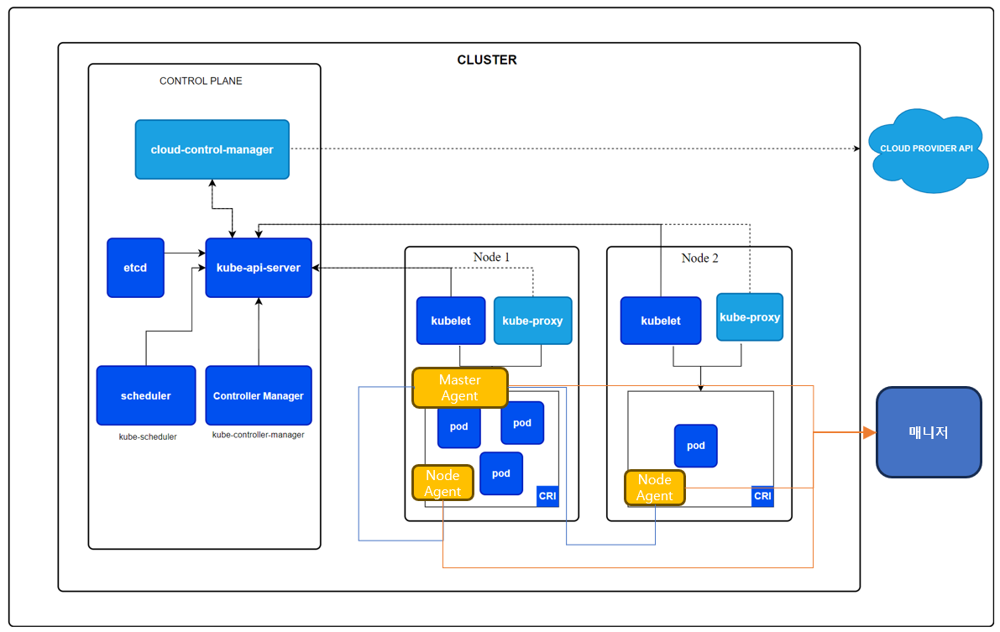

KCM Agent 설치

KCM 에이전트 구성

KCM에이전트는 쿠버네티스 클러스터 에 마스터 에이전트 와 노드 에이전트로 리소스가 구성됩니다. 마스터 에이전트는 디플로이먼트(Deployment)로 설치되며, 노드 에이전트는 데몬셋(DaemonSet)으로 설치되어집니다.

<table>
<tbody>
<tr class="odd">
<td>
노트

여러 개의 노드로 생성되어 있는 환경에서 마스터노드에는 에이전트가 설치되지 않을 수 있습니다. 워크로드(애플리케이션파드)가 설치 가능하도록 설정이 되어 있는 마스터노드로 설치되어 있을 경우 마스터노드에도 노드에이전트가 설치됩니다. 워크로드가 설치되지 않도록 설정되어 있는 <strong>마스터노드에는 에이전트가 설치되지 않습니다. 에이전트 파드가 설치되지 않을 경우 파드 관련 성능 지표가 수집되지 않습니다.</strong> 클러스터 내 워크노드 중 하나의 노드에만 마스터에이전트가 실행되며 각 노드에는 노드 에이전트가 하나씩 수행됩니다.
</td>
</tr>
</tbody>
</table>

> ▶ \[그림1\] 클러스터 구조 및 마스터에이전트와 노드에이전트 구성

조직 아이디 확인 절차

1.  Polestar10 로그인 한다.

2.  \[계정\]\>조직명 마우스 호버 한다.

3.  툴팁에 표시되는 조직 아이디를 복사

▶ \[그림2\] 조직 아이디 확인 절차

KCM 에이전트 설치 (online 설치)

Kcm-agent는 설치 스크립트를 통하여 설치가 가능합니다. Kcm-agent 설치는 아래 필수옵션 3개가 모두 준비된 이후 설치를 진행합니다

<table>
<thead>
<tr class="header">
<th>스크립트 실행</th>
<th>설명</th>
</tr>
</thead>
<tbody>
<tr class="odd">
<td>#./kcm-aio-install-online.sh --install -c &lt;clusterName&gt; -a &lt;kcm.addr&gt; -o &lt;kcm.orgId&gt;</td>
<td>
[파일위치]

/usr/nkia/kcmagent
</td>
</tr>
</tbody>
</table>

Note: kcm-agent offline 설치 또한 online 설치 방법과 동일합니다.

KCM Agent 설치 옵션

<table>
<thead>
<tr class="header">
<th>옵션</th>
<th>설명</th>
</tr>
</thead>
<tbody>
<tr class="odd">
<td>--install</td>
<td>
kcm agent 설치를 위한 최초 command

생략가능

예시) --install
</td>
</tr>
<tr class="even">
<td>-c(필수)</td>
<td>
-c &lt;clusterName&gt;

kcm agent 를 설치하는 kubernetes cluster name

예시) -c kube-single-213-142
</td>
</tr>
<tr class="odd">
<td>-a(필수)</td>
<td>
-a &lt;kcm.addr&gt;

에이전트와 통신하는 Back-end의IP와 PORT 정보

예시) -a 192.168.200.56:7575
</td>
</tr>
<tr class="even">
<td>-o(필수)</td>
<td>
-o &lt;kcm.orgId&gt;

조직ID를 기술

조직ID 는 “[그림2] 조직 아이디 확인 절차” 를 참조함.

예시) -e 660fa8ab62bf697daccad756
</td>
</tr>
</tbody>
</table>

Agent 설치 예시

<table>
<thead>
<tr class="header">
<th>스크립트 실행</th>
<th>설명</th>
</tr>
</thead>
<tbody>
<tr class="odd">
<td># ./kcm-aio-install-online.sh --install -c kube-single-213-142 -a 192.168.200.56:7575 -o 67c8035be719e34cec5aa9fb</td>
<td>
--install 사용하여 kcm-agent 설치

-c:clusterName = kube-single-213-142

-a: kcm.addr = 192.168.200.56:7575

-o:kcm.orgId = c8035be719e34cec5aa9fb
</td>
</tr>
<tr class="even">
<td># ./kcm-aio-install-online.sh -c kube-single-213-142 -a 192.168.200.56:7575 -o 67c8035be719e34cec5aa9fb</td>
<td>
--install 없이 kcm-agent 설치

-c:clusterName = kube-single-213-142

-a: kcm.addr = 192.168.200.56:7575

-o:kcm.orgId = c8035be719e34cec5aa9fb
</td>
</tr>
</tbody>
</table>

kcm 에이전트 설치를 완료하면 아래의 values.yaml이 설치 디랙토리에 자동생성 됩니다. 붉은 색으로 표기된 부분은 kcm-agent설치시 사용된 필수 파라미터 입니다. 클러스터명은 Back-End 화면에 클러스터이름으로 표시되는 이름입니다. 조직ID, 수집서버 주소/포트 정보가 설치 환경과 일치하는지 확인합니다.

<table>
<thead>
<tr class="header">
<th>values.yaml</th>
</tr>
</thead>
<tbody>
<tr class="odd">
<td>
clusterName: "클러스터명"

image: "에이전트이미지"

pullPolicy: "Always"

kcm:

orgId: "조직ID"

addr: "수집서버주소:7575"

token: ""

insecure: true

master:

name: "kcm-master-agent"

insecure: true

port: 4222

healthCheckPort: 8080

resources:

limits:

cpu: "250m"

memory: "512Mi"

requests:

cpu: "50m"

memory: "50Mi"

node:

name: "kcm-node-agent"

healthCheckPort: 8080

resources:

limits:

cpu: "100m"

memory: "128Mi"

requests:

cpu: "10m"

memory: "32Mi"
</td>
</tr>
</tbody>
</table>

values.yaml의 내용과 예제는 아래의 “kcm-agent 의 values.yaml 내용” 및 “values.yaml” 를 참고 합니다.

Kcm-agent 의 values.yaml 내용

<table>
<thead>
<tr class="header">
<th>키</th>
<th>설명</th>
</tr>
</thead>
<tbody>
<tr class="odd">
<td>clusterName</td>
<td>
쿠버네티스 클러스터명

쿠버네티스 등록 시 클러스터명으로 표현됩니다.
</td>
</tr>
<tr class="even">
<td>Image</td>
<td>설치할 kcm에이전트 이미지 주소</td>
</tr>
<tr class="odd">
<td>pullPolicy</td>
<td>
디폴트 설정값 : “Always”

에이전트 설치 시 이미지 주소로부터 항상 다운받는 설정
</td>
</tr>
<tr class="even">
<td>kcm. orgId</td>
<td>쿠버네티스가 등록될 조직 ID</td>
</tr>
<tr class="odd">
<td>kcm.addr</td>
<td>kcm 에이전트가 연결된 매니저 주소</td>
</tr>
<tr class="even">
<td>kcm.token</td>
<td>
kcm 에이전트가 매니저와 연결 시 사용할 토큰

현재 버전에서는 토큰값을 설정하지 않는다.
</td>
</tr>
<tr class="odd">
<td>kcm. Insecure</td>
<td>
에이전트와 매니저 연결 시 보안 설정 관련 옵션

현재 버전에서는 true로 설정한다.
</td>
</tr>
<tr class="even">
<td>master.name</td>
<td>kcm 에이전트의 마스터 에이전트 이름</td>
</tr>
<tr class="odd">
<td>master.port</td>
<td>
kcm 마스터 에이전트가 사용하는 포트

디폴트 설정값 : 4222
</td>
</tr>
<tr class="even">
<td>master.insecure</td>
<td>
kcm 마스터 에이전트의 보안 설정 관련 옵션

현재 버전에서는 true로 설정한다.
</td>
</tr>
<tr class="odd">
<td>master. healthCheckPort</td>
<td>
kcm 마스터 에이전트의 healthCheckPort

디폴트 설정값 : 8080
</td>
</tr>
<tr class="even">
<td>master.resources. limits.cpu</td>
<td>
kcm 마스터 에이전트의 cpu 사용량 제한 값

디폴트 설정값 : 250m
</td>
</tr>
<tr class="odd">
<td>master.resources. limits.memory</td>
<td>
kcm 마스터 에이전트의 memory 사용량 제한 값

디폴트 설정값 : 512Mi
</td>
</tr>
<tr class="even">
<td>master.resources. requests.cpu</td>
<td>
kcm 마스터 에이전트의 cpu 사용량 요청 값

디폴트 설정값 : 50m
</td>
</tr>
<tr class="odd">
<td>master.resources. requests.memory</td>
<td>
kcm 마스터 에이전트의 memory 사용량 요청값

디폴트 설정값 : 50Mi
</td>
</tr>
<tr class="even">
<td>node.name</td>
<td>파드 목록에서 표시되는 kcm 노드 에이전트 이름</td>
</tr>
<tr class="odd">
<td>node. healthCheckPort</td>
<td>
kcm 노드 에이전트 healthCheckPort

디폴트 설정값 : 8080
</td>
</tr>
<tr class="even">
<td>node.resources. limits.cpu</td>
<td>
kcm 노드 에이전트의 cpu 사용량 제한 값

디폴트 설정값 : 100m
</td>
</tr>
<tr class="odd">
<td>node.resources. limits.memory</td>
<td>
kcm 노드 에이전트의 memory 사용량 제한 값

디폴트 설정값 : 128Mi
</td>
</tr>
<tr class="even">
<td>node.resources. requests.cpu</td>
<td>
kcm 노드 에이전트의 cpu 사용량 요청 값

디폴트 설정값 : 10m
</td>
</tr>
<tr class="odd">
<td>node.resources. requests.memory</td>
<td>
kcm 노드 에이전트의 memory 사용량 요청값

디폴트 설정값 : 32Mi
</td>
</tr>
</tbody>
</table>

values.yaml

<table>
<tbody>
<tr class="odd">
<td>
clusterName: "multi-cluster-213-160"

image: polestar10/kcm-agent:release-10.1.2

pullPolicy: "Always"

kcm:

orgId: "675bf43e20dee972e1b6417b"

addr: "221.141.145.157:7575"

token: ""

insecure: true

master:

name: "kcm-master-agent"

insecure: true

port: 4222

healthCheckPort: 8080

resources:

limits:

cpu: "250m"

memory: "512Mi"

requests:

cpu: "50m"

memory: "50Mi"

node:

name: "kcm-node-agent"

healthCheckPort: 8080

resources:

limits:

cpu: "100m"

memory: "128Mi"

requests:

cpu: "10m"

memory: "32Mi"
</td>
</tr>
</tbody>
</table>

