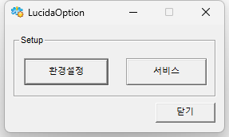
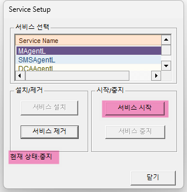
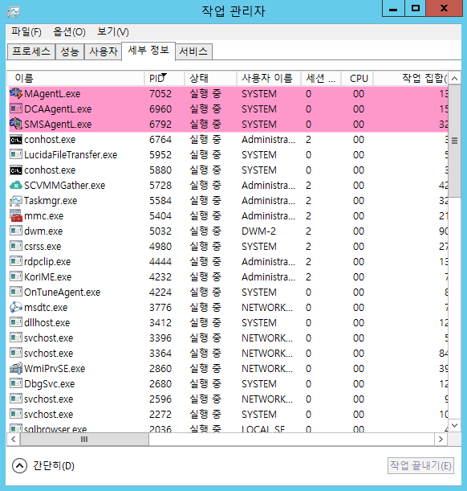

SMS Agent 기동

Unix/Linux Agent 기동

Unix/Linux 환경에서는 명령어 방식으로 기동합니다.

<table>
<thead>
<tr class="header">
<th>1. 에이전트 기동 명령 실행</th>
<th></th>
<th></th>
</tr>
</thead>
<tbody>
<tr class="odd">
<td></td>
<td>
Agent 설치 디렉토리로 이동 후 “agentstart.sh” 커맨드를 사용하여 기동합니다.

[기동 예시]

#&gt;cd /usr/nkia/sms/NNPAgent

#&gt;./agentstart.sh
</td>
<td></td>
</tr>
<tr class="even">
<td>2. 기동확인</td>
<td></td>
<td></td>
</tr>
<tr class="odd">
<td></td>
<td>
기동확인 방법은 아래와 같습니다.

ps 명령어(ps–ef| grep AGENTL)를 이용하여 MAGENTL, SMSAGENTL, DCAAGENTL 프로세스를 확인합니다.
</td>
<td></td>
</tr>
</tbody>
</table>

Windows Agent 기동

Windows Agent는 윈도우서비스 방식으로 기동이 가능합니다.

시작 \> 제어판 \> 관리도구 \> 서비스 에서도 기동이 가능하며 Agent에서 제공하는

LucidaOption에서도 서비스 기동이 가능합니다.

<table>
<thead>
<tr class="header">
<th>1. LucidaOption실행</th>
<th></th>
</tr>
</thead>
<tbody>
<tr class="odd">
<td></td>
<td>
윈도우 탐색기를 실행하여 아래의 경로 이동합니다.

C:\Program Files\NKIA\Polestar10\NNPAgent\utils\LucidaOption 경로 이동 후

LucidaOption.exe을 관리자 권한 으로 실행합니다.
</td>
</tr>
<tr class="even">
<td>2. 에이전트 기동</td>
<td></td>
</tr>
<tr class="odd">
<td></td>
<td>
LucidaOption 화면에서 <strong>[서비스]</strong>를 클릭합니다

아래의 서비스 설정에서 “현재 상태: 중지”를 확인 후 서비스 목록에서 MAgentL을 선택하고 [서비스 시작] 버튼을 클릭합니다<strong>.</strong>

</td>
</tr>
<tr class="even">
<td>3.기동확인</td>
<td></td>
</tr>
<tr class="odd">
<td></td>
<td>
작업관리자에서 MAgentL.exe, SMSAgentL.exe, DCAAgentL.exe 3개의 프로세스를 확인합니다

</td>
</tr>
</tbody>
</table>

