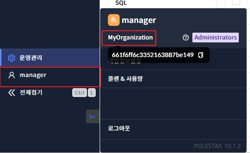
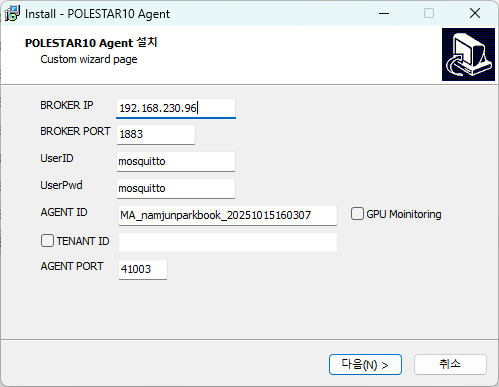
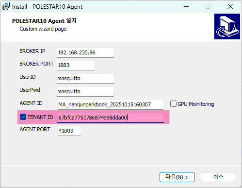
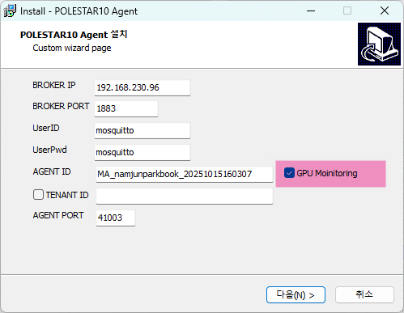
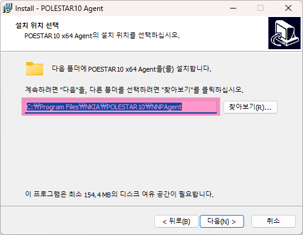
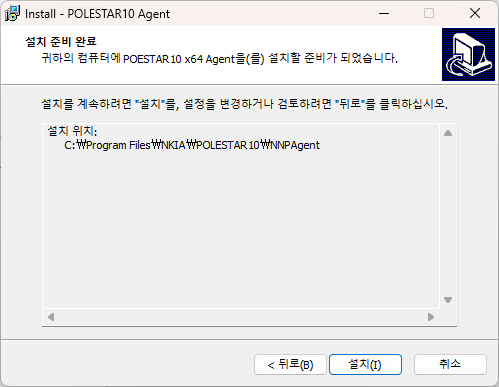
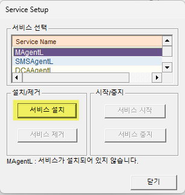
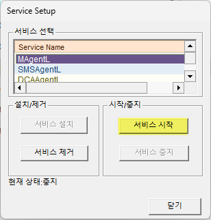

SMS Agent 설치

Agent 기본 설치 경로는 아래와 같습니다.

Unix/Linux 계열의 경우 **/usr/nkia/sms** 에 설치 됩니다.

Windows는 **C:\\Program Files\\NKIA\\Polestar10\\NNPAgent**에 설치됩니다.

<table>
<tbody>
<tr class="odd">
<td>
노트

사용자 설정에 따라 기본 설치 경로는 변경될 수 있습니다
</td>
</tr>
</tbody>
</table>

조직 아이디 확인 절차

조직 아이디가 여러 개 존재하는 고객사이트의 경우 조직 아이디 확인이 필요합니다.

1.  Polestar10 로그인 한다.

2.  \[계정\]\>조직명에 마우스포인터를 마우스 오버 한다.

3.  툴팁에 표시되는 조직 아이디를 복사

Unix/Linux Agent 설치

Unix/Linux에 설치되는 Agent는 설치 스크립트를 통하여 설치가 가능합니다.

<table>
<thead>
<tr class="header">
<th>스크립트 실행</th>
<th>설명</th>
</tr>
</thead>
<tbody>
<tr class="odd">
<td>#.AgentInstall.sh m Broker IP:Port -c Broker id:password –a AgentIP –i AgentID -p AgentPort -e TENANT_ID</td>
<td>
[파일위치]

/usr/nkia/sms
</td>
</tr>
</tbody>
</table>

Unix/Linux Agent 설치 옵션

<table>
<thead>
<tr class="header">
<th>옵션</th>
<th>설명</th>
</tr>
</thead>
<tbody>
<tr class="odd">
<td>-m(필수)</td>
<td>
에이전트와 통신하는 Broker의 IP와 PORT 정보

예시) -m 192.168.200.79:1883
</td>
</tr>
<tr class="even">
<td>-c</td>
<td>
UserID:UserPwd 입력

입력하지 않을 경우 “mosquitto:mosquito”로 설정

예시) -c mosquitto:mosquito
</td>
</tr>
<tr class="odd">
<td>-a</td>
<td>
에이전트가 설치된 서버의 아이피 지정

예시) -a 192.168.100.100
</td>
</tr>
<tr class="even">
<td>-i</td>
<td>
Agent ID로 입력하지 않을경우 자동 생성되며 입력할 경우 입력된 Agent ID로 설정

예시) -i servece_was_1
</td>
</tr>
<tr class="odd">
<td>-p</td>
<td>
Agent 서비스포트로 지정하지 않을 경우 기본포트인 41003으로 설정됨

예시) -p 41003
</td>
</tr>
<tr class="even">
<td>-e</td>
<td>
조직ID가 여러 개 존재하는 고객사이트의 경우 해당TENANT ID 입력

예시) -e 660fa8ab62bf697daccad756

조직ID가 1개인 경우 옵션 생략가능

조직ID가 2개이상인 환경에서 Agent 설치/재설치 할 경우 기존 관리되고 있는 조직ID 입력해야 서버 가용성 문제 미발생
</td>
</tr>
</tbody>
</table>

Unix/Linux Agent 설치 예시

<table>
<thead>
<tr class="header">
<th>스크립트 실행</th>
<th>설명</th>
</tr>
</thead>
<tbody>
<tr class="odd">
<td>#./AgentInstall.sh -m 1.1.1.1</td>
<td>
Broker IP를 1.1.1.1로 설정

(최소 옵션)

Broker 접속포트는 기본값(1883)으로 지정하여 에이전트 설치
</td>
</tr>
<tr class="even">
<td>#./AgentInstall.sh -m 1.1.1.1:1885</td>
<td>Broker 접속포트가 기본값(1883) 이 아닌경우 포트 지정</td>
</tr>
<tr class="odd">
<td>#./AgentInstall.sh -m 1.1.1.1 -c polestar:polestar</td>
<td>
Broker IP를 1.1.1.1로 설정

Broker 접속 아이디, 패스워드는 polestar:polestar로 에이전트 설치
</td>
</tr>
<tr class="even">
<td>#./AgentInstall.sh -m 1.1.1.1 -i MA_2.2.2.2 -e 645df60d8270700eee1e4a0d</td>
<td>
Broker IP를 1.1.1.1로 설정

에이전트 아이디를 MA_2.2.2.2 로 설정

TENANT ID를 645df60d8270700eee1e4a0d로 지정하여

에이전트 설치
</td>
</tr>
</tbody>
</table>

Windows Agent 설치

Windows Agent는 설치 마법사를 통하여 설치하거나 SILENT모드(백그라운드) 설치가 가능합니다.

Windows Agent 설치 마법사를 통한 설치

Windows Agent는 설치 마법사를 통하여 설치하며, 설치 옵션은 설치 위저드 화면

또는 LucidaOption을 통하여 변경할 수 있습니다.

polestar10\_SMS\_XXX\_Agent\_Win\_XXX.exe 설치파일을 준비한 후 설치파일을 관리자 권한 으로 실행하면

설치 마법사가 실행됩니다.

각 단계별 내용은 아래와 같습니다.

<table>
<thead>
<tr class="header">
<th>1. 설치옵션 입력</th>
<th></th>
<th></th>
</tr>
</thead>
<tbody>
<tr class="odd">
<td></td>
<td>

연결 접속정보 상세는 아래와 같습니다.

<table>
<thead>
<tr class="header">
<th>항목</th>
<th>설명</th>
</tr>
</thead>
<tbody>
<tr class="odd">
<td>BROKER IP</td>
<td>BROKER 접속 IP</td>
</tr>
<tr class="even">
<td>BROKER PORT</td>
<td>BROKER 접속포트(기본값 1883)</td>
</tr>
<tr class="odd">
<td>UserID</td>
<td>BROKER 사용자 ID(기본값: mosquitto)</td>
</tr>
<tr class="even">
<td>UserPwd</td>
<td>
BROKER사용자 패스워드

(기본값: mosquitto)
</td>
</tr>
</tbody>
</table>

AGENT ID, TENANT ID, AGENT PORT 상세는 아래와 같습니다.

<table>
<thead>
<tr class="header">
<th>항목</th>
<th>설명</th>
</tr>
</thead>
<tbody>
<tr class="odd">
<td>AGENT ID</td>
<td>
신규설치일 경우 Agent ID가 자동생성

명명규칙은 “MA_[HOSTNAME]_[YYYYMMDDhhmmss]”

재 설치 일 경우 기 등록된 AGENT ID를 입력
</td>
</tr>
<tr class="even">
<td>TENANT ID</td>
<td>
조직ID가 여러 개 존재하는 고객사이트의 경우 해당TENANT ID 입력

예시: 660fa8ab62bf697daccad756

조직ID가 1개인 경우 옵션 생략가능

조직ID가 2개이상인 환경에서 Agent 설치/재설치 할 경우 기존 관리되고 있는 조직ID 입력해야 서버 가용성 문제 미발생
</td>
</tr>
<tr class="odd">
<td>AGENT PORT</td>
<td>AGENT LISTEN PORT(기본값 : 41003)</td>
</tr>
<tr class="even">
<td>GPU Monitoring</td>
<td>GPU모니터링을 하고자 할 경우 체크</td>
</tr>
</tbody>
</table>

조직ID가 여러 개 존재하는 고객사이트의 경우 해당TENANT ID 입력하기 위해

아래와 같이 “TENANT ID” 체크박스에 체크 후 조직ID를 입력합니다.

“TENANT ID” 체크박스 해제 시 조직ID값이 초기화 됩니다.

서버에 NVIDIA GPU카드가 장착 되어있고 GPU모니터링이 필요할 경우 아래 그림과 같이 “GPU Monitoring” 체크박스에 체크합니다

</td>
<td></td>
</tr>
<tr class="even">
<td>2. 설치위치 입력</td>
<td></td>
<td></td>
</tr>
<tr class="odd">
<td></td>
<td>
[다음] 버튼을 클릭하여 설치위치를 입력합니다

기본설치 위치는 C:\Program Files\NKIA\Polestar10\NNPAgent 입니다

</td>
<td></td>
</tr>
<tr class="even">
<td>3. 설치</td>
<td></td>
<td></td>
</tr>
<tr class="odd">
<td></td>
<td>
[설치] 버튼을 클릭하여 설치를 시작합니다

</td>
<td></td>
</tr>
</tbody>
</table>

Windows Agent 백그라운드 설치

백그라운드 설치는 Wizard를 통한 설치에서 설정 단계 없이 스위치옵션 입력만으로 Agent설치

에서 윈도우 서비스 설치 및 Agent기동까지 백그라운드로 진행할 수 있습니다

| 1\. 설치바이너리 경로이동 |                                                                                |  |
| --------------- | ------------------------------------------------------------------------------ |  |
|                 | 시작 \> 실행 \> CMD를 관리자 권한으로 실행하고 설치 바이너리 경로로 이동합니다.                              |  |
| 2\. 실행          |                                                                                |  |
|                 | polestar10\_SMS\_XXX\_Agent\_Win\_XXX.exe /VERYSILENT /BI=XXX.XXX.XXX.XXX:XXXX |  |

Windows Agent 백그라운드 설치 옵션

백그라운드 설치는 Wizard를 통한 설치에서 설정 단계 없이 스위치옵션 입력만으로 Agent설치

에서 윈도우 서비스 설치 및 Agent기동까지 백그라운드로 진행할 수 있습니다

<table>
<thead>
<tr class="header">
<th>옵션</th>
<th>설명</th>
<th>비고</th>
</tr>
</thead>
<tbody>
<tr class="odd">
<td>/VERYSILENT</td>
<td>SILENT모드 설치 옵션</td>
<td></td>
</tr>
<tr class="even">
<td>
/BI

(필수)
</td>
<td>
BROKER IP:PORT정보입력

예시) /BI=192.168.200.79:1883
</td>
<td></td>
</tr>
<tr class="odd">
<td>/UI</td>
<td>
UserID:UserPwd 입력

입력하지 않을 경우 “mosquitto:mosquito”로 설정

예시) mosquitto:mosquito
</td>
<td></td>
</tr>
<tr class="even">
<td>/MAKEY</td>
<td>Agent ID로 입력하지 않을경우 자동 생성되며 입력할 경우 입력된 Agent ID로 설정</td>
<td></td>
</tr>
<tr class="odd">
<td>/TI</td>
<td>
조직ID가 여러 개 존재하는 고객사이트의 경우 해당TENANT ID 입력

예시: 660fa8ab62bf697daccad756

조직ID가 1개인 경우 옵션 생략가능

조직ID가 2개이상인 환경에서 Agent 설치/재설치 할 경우 기존 관리되고 있는 조직ID 입력해야 서버 가용성 문제 미발생
</td>
<td></td>
</tr>
<tr class="even">
<td>/AP</td>
<td>
Agent 서비스포트로 지정하지 않을 경우 기본포트인 41003으로 설정됨

Ex) /AP=41003
</td>
<td></td>
</tr>
<tr class="odd">
<td>/GPU</td>
<td>
GPU 모니터링 활성화 여부

0: 비활성화

1: 활성화

Ex) /GPU=1
</td>
<td></td>
</tr>
</tbody>
</table>

Windows Agent 백그라운드 설치 예시

<table>
<thead>
<tr class="header">
<th>스크립트 실행</th>
<th>설명</th>
</tr>
</thead>
<tbody>
<tr class="odd">
<td>C:\&gt; polestar10_SMS_XXX_Agent_Win_XXX.exe /VERYSILENT /BI=192.168.200.80:8883</td>
<td>“Broker IP:PORT” 로 최소옵션만 입력하여 설치</td>
</tr>
<tr class="even">
<td>C:\&gt; polestar10_SMS_XXX_Agent_Win_XXX.exe /VERYSILENT /BI=192.168.200.79:8883 /MAKEY=MA_namjunpark_20170717164452</td>
<td>AGENT재설치 후 기 등록한 AGENT KEY를 지정하여 설치</td>
</tr>
<tr class="odd">
<td>C:\&gt; polestar10_SMS_XXX_Agent_Win_XXX.exe /VERYSILENT /BI=192.168.200.80:8883 /TI=645df60d8270700eee1e4a0d /AP=51003</td>
<td>AGENT PORT를 “51003”으로 지정하여 설치</td>
</tr>
<tr class="even">
<td>C:\&gt;polestar10_SMS_Agent_Win_10.XXX.exe /VERYSILENT /BI=192.168.213.107:1883 /GPU=1</td>
<td>“/GPU=1”로 GPU모니터링 설정하여 설치</td>
</tr>
<tr class="odd">
<td>
C:\&gt; polestar10_SMS_XXX_Agent_Win_XXX.exe /VERYSILENT /BI=192.168.200.80:8883

/TI=660fa8ab62bf697daccad756
</td>
<td>조직ID가 여러 개 존재하는 경우 해당 조직ID를 입력하여 설치</td>
</tr>
</tbody>
</table>

Windows Agent 수동설치

Agent 설치 시 디폴트로 MagentL 서비스, SMSAgentL, DCAAgentL 서비스가 자동으로 설치되며

수동으로 설치하는 방법은 다음과 같습니다.

<table>
<thead>
<tr class="header">
<th>1. LucidaOption.exe 실행</th>
<th></th>
<th></th>
</tr>
</thead>
<tbody>
<tr class="odd">
<td></td>
<td>
윈도우탐색기를 실행 후C:\Program Files\NKIA\Polestar10\

NNPAgent\utils\LucidaOption 경로까지 탐색

LucidaOption.exe을 관리자 권한으로 실행
</td>
<td></td>
</tr>
<tr class="even">
<td>2. Agent 서비스 설치</td>
<td></td>
<td></td>
</tr>
<tr class="odd">
<td></td>
<td>
LucidaOption 화면에서 [서비스]를 선택하고 MAgentL, SMSAgentL, 에 대한

[서비스 설치]를 선택할 경우 서비스가 설치됩니다

서비스 설치는 MAgentL-&gt;SMSAgentL-&gt;DCAAgentL 순으로 진행합니다.

</td>
<td></td>
</tr>
<tr class="even">
<td>3. Agent 서비스 기동</td>
<td></td>
<td></td>
</tr>
<tr class="odd">
<td></td>
<td>
설치가 완료되면 [서비스 시작]을 선택하여 서비스를 기동할 수 있습니다. 이후 MAgentL은 OS 재부팅시에 자동으로 시작되며, MAgentL 서비스가 SMSAgentL, DCAAgentL을 자동으로 기동합니다.

</td>
<td></td>
</tr>
</tbody>
</table>

