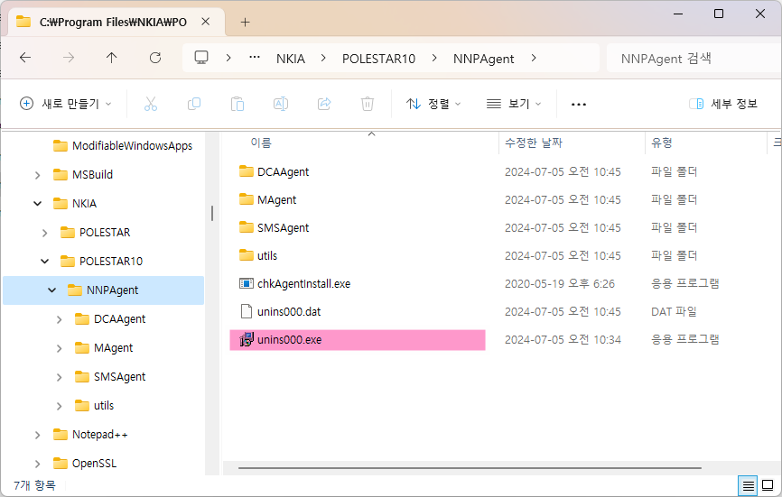

SMS Agent 제거

Unix/Linux Agent 제거

<table>
<thead>
<tr class="header">
<th>1. Agent 제거 명령 실행</th>
<th></th>
</tr>
</thead>
<tbody>
<tr class="odd">
<td></td>
<td>
Agent 설치 디렉토리(예: /usr/nkia/sms/NNPAgent) 상위 디렉토리로 이동합니다.

“AgentInstall.sh” 이라는 제거 명령어를 이용하여 Agent를 제거합니다.

[제거 예시]

#&gt;cd /usr/nkia/sms

#&gt;./AgentInstall.sh –uninstall
</td>
</tr>
<tr class="even">
<td>2. 제거확인</td>
<td></td>
</tr>
<tr class="odd">
<td></td>
<td>
제거확인 방법은 아래와 같습니다.

1) ls -al /usr/nkia/sms 실행합니다.

2) 하위 디렉토리인 NNPAgent 디렉토리가 삭제되었는지 확인합니다.
</td>
</tr>
</tbody>
</table>

Windows Agent 제거

<table>
<thead>
<tr class="header">
<th>1. Agent 제거 명령 실행</th>
<th></th>
</tr>
</thead>
<tbody>
<tr class="odd">
<td></td>
<td>
윈도우 탐색기를 실행하여 Agent 설치경로

C:\Program Files\NKIA\Polestar10\NNPAgent경로로 이동합니다.

하위의 unins000.exe파일을 관리자 권한으로 실행합니다.

</td>
</tr>
<tr class="even">
<td>2. 제거확인</td>
<td></td>
</tr>
<tr class="odd">
<td></td>
<td>
제거확인 방법은 아래와 같습니다.

윈도우 탐색기를 실행하여 Agent 설치경로 C:\Program Files\NKIA로 이동합니다.

2) 하위 디렉토리인 Polestar10 디렉토리가 삭제되었는지 확인합니다.
</td>
</tr>
</tbody>
</table>

