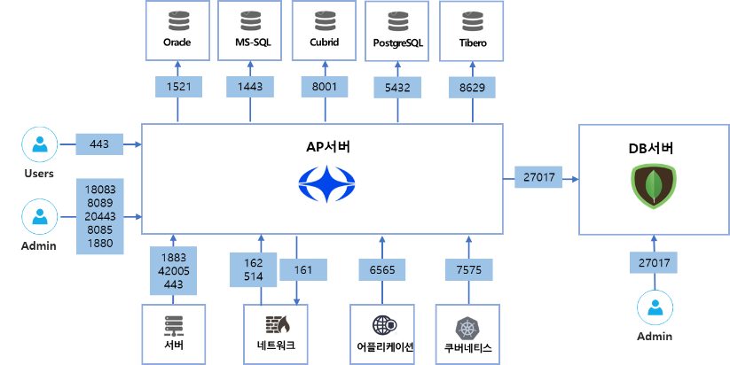

부록

Polestar 10 포트 사용

Polestar 10 설치시 방화벽 오픈을 위한 포트 사용 현황과 사용 목록입니다.

포트 사용 현황

포트 사용 목록

<table>
<thead>
<tr class="header">
<th>Source</th>
<th>Destination</th>
<th>Protocol</th>
<th>제품</th>
<th>설명</th>
<th></th>
</tr>
</thead>
<tbody>
<tr class="odd">
<td>서버</td>
<td>서버</td>
<td>Port</td>
<td></td>
<td></td>
<td></td>
</tr>
<tr class="even">
<td>SMS 관제 서버</td>
<td>AP 서버</td>
<td>1883</td>
<td>TCP</td>
<td>SMS</td>
<td>SMS Agent가 AP 서버와 통신하는 포트 
통신프로토콜(방식) : MQTT(SSL)</td>
</tr>
<tr class="odd">
<td>SMS 관제 서버</td>
<td>AP 서버</td>
<td>42005</td>
<td>TCP</td>
<td>SMS</td>
<td>SMS Agent가 AP 서버와 파일전송하는 포트 
Agent 패치 파일전송 등</td>
</tr>
<tr class="even">
<td>SMS 관제 서버</td>
<td>AP 서버</td>
<td>443</td>
<td>TCP</td>
<td>SMS</td>
<td>SMS Agent가 AP서버로 패치파일 요청포트(에이전트 패치)</td>
</tr>
<tr class="odd">
<td>AP 서버</td>
<td>SMS 관제 서버</td>
<td>-</td>
<td>ICMP</td>
<td>SMS</td>
<td>AP 서버에서 서버 ping 체크</td>
</tr>
<tr class="even">
<td>APM 관제 서버</td>
<td>AP 서버</td>
<td>6565</td>
<td>TCP</td>
<td>APM</td>
<td>APM Agent가 AP 서버와 통신하는 포트</td>
</tr>
<tr class="odd">
<td>KCM 관제 서버 
(워커노드)</td>
<td>AP 서버</td>
<td>7575</td>
<td>TCP</td>
<td>KCM</td>
<td>KCM Agent가 AP 서버와 통신하는 포트</td>
</tr>
<tr class="even">
<td>AP 서버</td>
<td>NMS 관제 서버</td>
<td>161</td>
<td>UDP</td>
<td>NMS</td>
<td>네트워크 장비 SNMP 수집을 위한 포트 
통신프로토콜 : SNMP</td>
</tr>
<tr class="odd">
<td>네트워크 장비</td>
<td>AP 서버</td>
<td>162</td>
<td>UDP</td>
<td>NMS</td>
<td>네트워크 장비 Syslog 수신을 위한 포트 
통신프로토콜 : UDP</td>
</tr>
<tr class="even">
<td>네트워크 장비</td>
<td>AP 서버</td>
<td>514</td>
<td>UDP</td>
<td>NMS</td>
<td>네트워크 장비 Trap 수신을 위한 포트 
통신프로토콜 : .SNMP</td>
</tr>
<tr class="odd">
<td>AP 서버</td>
<td>DPM 관제 서버</td>
<td>1521</td>
<td>TCP</td>
<td>DPM</td>
<td>AP서버에서 오라클 서버와 JDBC 통신하는 포트 
통신프로토콜 : JDBC</td>
</tr>
<tr class="even">
<td>AP 서버</td>
<td>DPM 관제 서버</td>
<td>1443</td>
<td>TCP</td>
<td>DPM</td>
<td>AP서버에서 MS-SQL 서버와 JDBC 통신하는 포트 
통신프로토콜 : JDBC</td>
</tr>
<tr class="odd">
<td>AP 서버</td>
<td>DPM 관제 서버</td>
<td>8001</td>
<td>TCP</td>
<td>DPM</td>
<td>AP 서버에서 CUBRID 매니저 서버와 REST 통신하는 포트 
통신프로토콜: REST</td>
</tr>
<tr class="even">
<td>AP 서버</td>
<td>DPM 관제 서버</td>
<td>5432</td>
<td>TCP</td>
<td>DPM</td>
<td>AP 서버에서 PostgreSQL 매니저 서버와 REST 통신하는 포트 통신프로토콜: JDBC</td>
</tr>
<tr class="odd">
<td>AP 서버</td>
<td>DPM 관제 서버</td>
<td>8629</td>
<td>TCP</td>
<td>DPM</td>
<td>AP 서버에서 Tibero 매니저 서버와 REST 통신하는 포트 
통신프로토콜: JDBC</td>
</tr>
<tr class="even">
<td>AP 서버</td>
<td>VMware vCenter 서버</td>
<td>443</td>
<td>TCP</td>
<td>VMM</td>
<td>AP 서버에서 VMware vCenter 서버와 REST 통신하는 포트 
vCenter에서 제공하는 vSphere Client 포트(Rest or SOAP)</td>
</tr>
<tr class="odd">
<td>관리자</td>
<td>AP 서버</td>
<td>18083</td>
<td>TCP</td>
<td>-</td>
<td>Polestar EMQX 시스템에 접속하는 포트 
EMQX 접속 : http://{domain-ip}:18083 
EMQX : SMS Agent에서 들어오는 데이터 브로커 시스템</td>
</tr>
<tr class="even">
<td>관리자</td>
<td>DB 서버</td>
<td>27107</td>
<td>TCP</td>
<td>-</td>
<td>Polestar DB 시스템에 접속하는 포트(도커용) 
MongoDB 접속: http://{domain-ip}:27017 
MongoDB : Polestar 10 모든 데이터 저장소</td>
</tr>
<tr class="odd">
<td>관리자</td>
<td>DB 서버</td>
<td>31007</td>
<td>TCP</td>
<td>-</td>
<td>Polestar DB 시스템에 접속하는 포트(쿠베용) 
MongoDB 접속: http://{domain-ip}:31017 
MongoDB : Polestar 10 모든 데이터 저장소</td>
</tr>
<tr class="even">
<td>관리자</td>
<td>룰체인</td>
<td>1880</td>
<td>TCP</td>
<td>-</td>
<td>룰체인 접속포트(vCenter 등록)</td>
</tr>
<tr class="odd">
<td>관리자</td>
<td>AP 서버</td>
<td>8089</td>
<td>TCP</td>
<td>-</td>
<td>Polestar AKHQ 시스템에 접속하는 포트 
AKHQ 접속: http://{domain-ip}:8089 
AKHQ : 카프카 데이터 분석을 위한 시스템</td>
</tr>
<tr class="even">
<td>관리자</td>
<td>AP 서버</td>
<td>8085</td>
<td>TCP</td>
<td>-</td>
<td>컨테이너 이미지 레지스트리(넥서스) 관리 화면 접속 포트 
http://{domain-ip}:8085</td>
</tr>
<tr class="odd">
<td>사용자</td>
<td>AP 서버</td>
<td>443</td>
<td>TCP</td>
<td>-</td>
<td>사용자(웹브라우저)가 Polestar 웹서버에 접속하는 포트 
통신프로토콜 : HTTPS (SSL)</td>
</tr>
</tbody>
</table>

