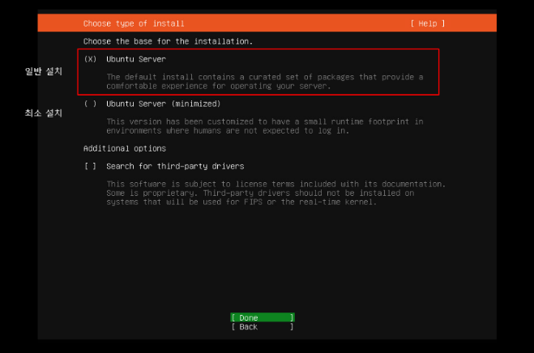
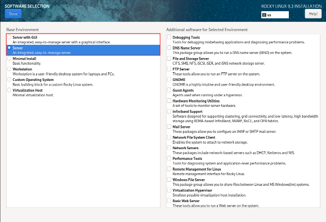

사전 설치 환경 조사

Polestar 10 설치전 사전에 필요한 환경정보를 조사합니다.

아래 스크립트를 실행해서 자동으로 점검후, \[fail\] 항목에 대해서는 사전 설치 스크립트로 자동으로 설치를 진행할 수 있습니다.

<table>
<thead>
<tr class="header">
<th>점검 스크립트 실행</th>
<th>비고</th>
</tr>
</thead>
<tbody>
<tr class="odd">
<td>
# ./pre-install-check.sh

[+] os [ok]

- version : Rocky Linux 9.3

[-] docker [fail]

- version : [installation of version 26 required]

[-] docker compose [fail]

- version : [installation of version 2.26 required]

[-] disk free [recommended]

- free : 19 GB [At least 500GB is recommended]

[-] os parameter [fail]

- vm.swappiness = 30 [1 recommended]

- vm.max_map_count = 65530 [262144 recommended]

[-] utility [recommended]

- pv : not installed

[-] java [fail]

- version : 1.8.0_392 [Java 17 or higher recommended]

- keytool : installed

[+] openssl [ok]

- version : OpenSSL 3.0.7 1 Nov
</td>
<td>
[파일 위치]

pre-installer/pre-install-check.sh

[결과 표시]

[ok] : 정상

[fail] : 필수 항목(Polestar10 설치 진행불가)

[recommended] : 필수는 아님(권장사항), 설치 진행 가능

[점검 절차]

1. 자동점검스크립트 실행

- [fail] 항목이 있을 경우 2번 사전설치 진행

- [fail] 없을 경우 완료

2. 자동설치스크립트(pre-install.sh)를 통해서 설치진행

3. 설치후 자동점검스크립트 재실행하여 [fail]이 없는지 다시 확인
</td>
</tr>
</tbody>
</table>

O/S 지원버전

O/S 지원버전과 리눅스 설치모드 지원범위에 따라 O/S를 사전에 준비하시면 됩니다.

O/S를 제외하고 모든 필요한 설치항목은 설치파일에 포함되어 있습니다.

<table>
<thead>
<tr class="header">
<th>항목</th>
<th>CentOS</th>
<th>
CentOS

Stream
</th>
<th>RHEL</th>
<th>Rocky</th>
<th>Ubuntu</th>
<th>Oracle Linux</th>
<th></th>
<th></th>
<th></th>
<th></th>
<th></th>
<th></th>
<th></th>
<th></th>
<th></th>
<th></th>
</tr>
</thead>
<tbody>
<tr class="odd">
<td></td>
<td>7</td>
<td>8</td>
<td>8</td>
<td>9</td>
<td>7</td>
<td>8</td>
<td>9</td>
<td>8</td>
<td>9</td>
<td>18</td>
<td>20</td>
<td>22</td>
<td>7</td>
<td>8</td>
<td>9</td>
<td></td>
</tr>
<tr class="even">
<td>EOS</td>
<td>일반</td>
<td>O</td>
<td>O</td>
<td>O</td>
<td></td>
<td>O</td>
<td></td>
<td></td>
<td></td>
<td></td>
<td>O</td>
<td></td>
<td></td>
<td>O</td>
<td></td>
<td></td>
</tr>
<tr class="odd">
<td></td>
<td>보안</td>
<td>O</td>
<td>O</td>
<td>O</td>
<td></td>
<td></td>
<td></td>
<td></td>
<td></td>
<td></td>
<td></td>
<td></td>
<td></td>
<td></td>
<td></td>
<td></td>
</tr>
<tr class="even">
<td>Polestar 10</td>
<td>1.0</td>
<td></td>
<td></td>
<td></td>
<td>O</td>
<td></td>
<td></td>
<td></td>
<td></td>
<td>O</td>
<td></td>
<td>O</td>
<td>O</td>
<td></td>
<td></td>
<td></td>
</tr>
<tr class="odd">
<td></td>
<td>1.1</td>
<td></td>
<td></td>
<td></td>
<td>O</td>
<td></td>
<td>O</td>
<td>O</td>
<td>O</td>
<td>O</td>
<td></td>
<td>O</td>
<td>O</td>
<td></td>
<td></td>
<td></td>
</tr>
<tr class="even">
<td></td>
<td>1.2</td>
<td></td>
<td></td>
<td></td>
<td>O</td>
<td></td>
<td>O</td>
<td>O</td>
<td>O</td>
<td>O</td>
<td></td>
<td>O</td>
<td>O</td>
<td></td>
<td>O</td>
<td>O</td>
</tr>
</tbody>
</table>

> 리눅스 설치모드 지원 범위

<table>
<thead>
<tr class="header">
<th>Ubuntu</th>
<th>Rocky &amp; CentOS Stream</th>
</tr>
</thead>
<tbody>
<tr class="odd">
<td></td>
<td></td>
</tr>
<tr class="even">
<td>
Unbuntu Server (지원)

Unbuntu Server(minimized) (미지원)
</td>
<td>
Sever with GUI (지원)

Server (지원)

Minimal Install (미지원)

Workstation (미지원)

Custom Operating System (미지원)

Virtualization Host (미지원)
</td>
</tr>
</tbody>
</table>

도커 지원버전

Polestar 10은 MSA(Micro Serivce Architecture) 아키텍처로 컨테이너기반의 어플리케이션으로 도커와 도커컴포즈가 필수이며 모두 설치가 되어야 합니다.

도커(Docker)와 도커 컴포즈(Docker Compose)는 컨테이너 기반의 애플리케이션을 개발, 배포, 실행하기 위해 사용되는 도구들입니다.

<table>
<tbody>
<tr class="odd">
<td>
노트

도커 : 애플리케이션을 패키징하여 운영체제 수준에서 격리된 환경에서 실행하는 도구입니다.

도커컴포즈 : 여러 개의 컨테이너로 구성된 애플리케이션을 정의하고 실행하는 도구입니다.

참고문서 : https://docs.docker.com/guides
</td>
</tr>
</tbody>
</table>

자동설치스크립트(pre-install.sh)로 설치시 아래 권장버전으로 모두 자동 설치됩니다.

<table>
<thead>
<tr class="header">
<th>최소 버전</th>
<th>권장 버전(최신 버전)</th>
</tr>
</thead>
<tbody>
<tr class="odd">
<td>
Docker version 20.x 이상

Docker Compose version 2.x 이상
</td>
<td>
Docker version 26.0.0 이상

Docer Compose version 2.26.0 이상
</td>
</tr>
</tbody>
</table>

SSL 인증서 생성을 위한 Tool 설치

Polestar 10 설치후 HTTPS 접속을 위해서 인증서를 생성해야 합니다.

고객사에서 인증서를 생성하기 위한 기본 툴에 대한 정보입니다.

<table>
<thead>
<tr class="header">
<th>설치항목</th>
<th>비고</th>
</tr>
</thead>
<tbody>
<tr class="odd">
<td>Keytool</td>
<td>
Java 패키지에 포함되어 있음

JRE 에는 미포함되어 있으므로, JDK 설치 필수

보안을 위해서 Java 17 이상 권장함

자동설치스크립트(pre-install.sh)로 설치시 open-jdk 17 버전이 자동설치됨
</td>
</tr>
<tr class="even">
<td>OpenSSL</td>
<td>
리눅스 O/S 기본 패키지에 포함되어 있음

보안을 위해서 OpenSSL 최신버전을 권장함.

- 최소버전 : 3.0 이상

- 권장버전 : 최신버전(3.3 이상)

자동설치스크립트(pre-install.sh)에서 OpenSSL은 설치버전 제공하지 않으므로 O/S설치후 OpenSSL은 최신버전으로 업그레이드를 권장함.
</td>
</tr>
</tbody>
</table>

O/S 환경 설정

Polestar 10가 설치되는 O/S 환경에서 설정해야 하는 파라미터와 디스크 여유량정보입니다.

<table>
<thead>
<tr class="header">
<th>설치항목</th>
<th>비고</th>
</tr>
</thead>
<tbody>
<tr class="odd">
<td>O/S 파라미터</td>
<td>
MongoDB에서 권장하는 설정임

1. 스왑사용을 권장하지 않지만 OOM을 피하고 최소한으로 사용하기 위해서 1로 설정함. (swappiness = 1 권장)

/etc/sysctl.conf 파일에 설정

2. vm.max_map_count=262144 설정 권장함

실제 위 설정은 몽고디비 컨테이너의 O/S에 적용이 필요하지만 컨테이너에 직접 설정을 할수 없으며, 도커가 기동되는 O/S에 설정하면 도커 컨테이너는 자동으로 동일한 설정으로 적용됨.

[설정예시]

# cat /etc/sysctl.conf

vm.max_map_count = 262144

vm.swappiness=1
</td>
</tr>
<tr class="even">
<td>디스크 여유량</td>
<td>
최소 용량 : 500GB 이상

관제대상 수량에 따라 용량산정후 가이드 예정

몽고디비를 포함한 모든 데이터는 도커볼륨에 쌓이므로 디스크 용량은 도커 루트 디렉토리가 사용가능한 용량 기준임

자동점검스크립트(pre-install-check.sh)에서도 도커루트 디렉토리 기준으로 용량 확인함

[참고] 도커 루트 디렉토리 확인

# docker info | grep "Docker Root Dir"

Docker Root Dir: /var/lib/docker
</td>
</tr>
</tbody>
</table>

모듈별 지원 대상 및 버전

SMS 지원 O/S 및 버전

<table>
<thead>
<tr class="header">
<th>OS 종류</th>
<th>OS 버전</th>
</tr>
</thead>
<tbody>
<tr class="odd">
<td>AIX</td>
<td>AIX 5.3 이상</td>
</tr>
<tr class="even">
<td>SunOS(Solaris)</td>
<td>SunOS 5.10 이상</td>
</tr>
<tr class="odd">
<td>HPUX</td>
<td>HPUX 11.23 이상</td>
</tr>
<tr class="even">
<td>LINUX</td>
<td>
SUSE 계열, CentOS 계열, Red Hat 계열, Ubuntu 계열, Fedora계열

(Kernel 2.4이상)
</td>
</tr>
<tr class="odd">
<td>Windows</td>
<td>
Windows 2008, Windows 2012, Windows 2016, Windows 2019, Windows 2022

(Microsoft Visual C++ 2008 SP1 이상 런타임 패키지 설치)
</td>
</tr>
</tbody>
</table>

NMS 지원 프로토콜 및 버전

| 지원 프로토콜 | 버전          |
| ------- | ----------- |
| SNMP    | v1, v2c, v3 |

DPM 지원 버전

| OS 종류      | OS 버전                              |
| ---------- | ---------------------------------- |
| 오라클        | 10g, 11g, 12c, 18c, 19c, 21c, 23c  |
| MSSQL      | 2012, 2014, 2016, 2017, 2019, 2022 |
| Cubrid     | 10.2, 11.1, 11.2, 11.3             |
| postgreSQL | 10\~18(최신버전)                       |
| Tibero     | Tibero6, Tibero7                   |

APM 에이전트 지원 JVM/OS, WAS, Library 버전

| JVM                          | JVM Versions | OS 버전                          |
| ---------------------------- | ------------ | ------------------------------ |
| OpenJDK (Eclipse Temurin)    | 8, 11, 17    | Ubuntu 18, Windows Server 2019 |
| OpenJ9 (IBM Semeru Runtimes) | 8, 11, 17    | Ubuntu 18, Windows Server 2019 |

Opentelemetry 공식 테스트 완료 애플리케이션 서버 정보

| 애플리케이션 서버                                                                       | Versions                    | JVM               |
| ------------------------------------------------------------------------------- | --------------------------- | ----------------- |
| Jetty                                                                           | 9.4.x, 10.0.x, 11.0.x       | OpenJDK 8, 11, 17 |
| [Payara](https://www.payara.fish/)                                              | 5.0.x, 5.1.x                | OpenJDK 8, 11     |
| [Tomcat](http://tomcat.apache.org/)                                             | 7.0.x, 8.5.x, 9.0.x, 10.0.x | OpenJDK 8, 11, 17 |
| [TomEE](https://tomee.apache.org/)                                              | 7.x, 8.x                    | OpenJDK 8, 11, 17 |
| [Websphere Liberty Profile](https://www.ibm.com/cloud/websphere-liberty)        | 20.x, 21.x                  | OpenJDK 8         |
| [Websphere Traditional](https://www.ibm.com/cloud/websphere-application-server) | 8.5.5.x, 9.0.x              | IBM JDK 8         |
| [WildFly](https://www.wildfly.org/)                                             | 13.x                        | OpenJDK 8         |
| [WildFly](https://www.wildfly.org/)                                             | 17.x, 21.x, 25.x            | OpenJDK 8, 11, 17 |

에이전트 지원 쿠버네티스 버전

| 쿠버네티스 버전 | 1.25+ |
| -------- | ----- |
| Helm     | v3    |

