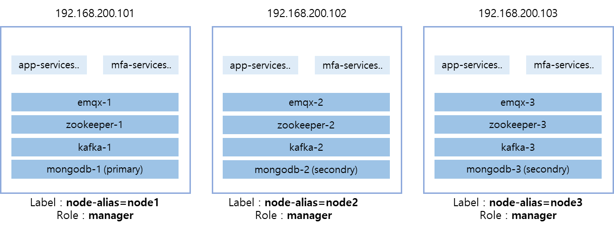

클러스터 구성

Polestar 10 클러스터 구성을 위한 도커스웜 구축 가이드입니다.

사전 설치를 통한 기본적인 도커설치가 완료되어 있어야 합니다.

도커 스웜은 도커설치에 포함되어 있으므로 별도 설치가 필요하지 않습니다

<table>
<tbody>
<tr class="odd">
<td>
노트

1. 도커 스웜(Docker Swarm) 이란 ?

도커의 네이티브 클러스터링 및 오케스트레이션 도구로, 여러 도커 호스트를 하나의 클러스터로 관리하여 컨테이너화된 애플리케이션의 배포, 관리, 확장을 용이하게 합니다.

2. 도커 스웜 vs 쿠버네티스

<table>
<thead>
<tr class="header">
<th>특징</th>
<th>도커 스웜 (Docker Swarm)</th>
<th>쿠버네티스 (Kubernetes)</th>
</tr>
</thead>
<tbody>
<tr class="odd">
<td>설치 및 설정</td>
<td><strong>간단하며 도커에 내장되어 있음</strong></td>
<td>복잡하고 별도의 설치가 필요함</td>
</tr>
<tr class="even">
<td>기능 및 확장성</td>
<td><strong>간단한 클러스터 관리, 소규모에서 중규모에 적합</strong></td>
<td>복잡한 애플리케이션 지원, 대규모에 최적화</td>
</tr>
<tr class="odd">
<td>커뮤니티 및 생태계</td>
<td><strong>도커 생태계 내에서 제한적</strong></td>
<td>활발한 오픈 소스 커뮤니티와 방대한 생태계</td>
</tr>
<tr class="even">
<td>학습 곡선</td>
<td><strong>도커 사용자에게 친숙하고 배우기 쉬움</strong></td>
<td>기능이 많아 학습 곡선이 가파름</td>
</tr>
<tr class="odd">
<td>유연성</td>
<td><strong>기본적인 오케스트레이션 기능 제공</strong></td>
<td>고급 오케스트레이션 기능과 다양한 확장 가능성</td>
</tr>
<tr class="even">
<td>통합성</td>
<td><strong>도커와의 높은 통합성</strong></td>
<td>다양한 도구 및 서비스와의 높은 통합성</td>
</tr>
</tbody>
</table></td>
</tr>
</tbody>
</table>

<table>
<tbody>
<tr class="odd">
<td>
클러스터 구성도 (3대일 경우)

클러스터 노드가 3대일 경우 위 구성도와 같이 설치가 되어야 합니다.

[필수조건]

1. 클러스터 노드 모두 Label이 아래값으로 필수 할당되어 있어야 합니다.

- node-alias=node1 ~ node3

- 아래 스크립트로 추가시 자동 할당됩니다.(2 : Jon node 참조)

- 레이블이 없을 경우 설정은 [5 : Change node label] 메뉴 참조하세요.

- 해당 레이블이 없을 경우 몽고디비, 카프카, 주키퍼, EMQX가 해당 노드에 기동이 안됩니다.

2. 클러스터 노드 모두 manager 역할을 가지고 있어야 합니다.

- 3대일 경우 3대 모두 manager 역할 필요

- 3대중 worker 노드가 있을 경우, 평소에는 정상적으로 운영이 가능하지만 장애시 데이터가 보장되지 않습니다.

[참고사항]

플랫폼 서비스는 클러스터모드에서 기동시 아래와 같이 클러스터 모드로 자동 설정됩니다.

1. 몽고디비 : 리플리카셋(PSS) 구성

2. 카프카/주키퍼/EMQX : 클러스터로 자동 구성

서버 1대 장애시에는 서비스가 정상적으로 유지되되지만, 2대 이상 장애시는 보장되지 않습니다.

서버 1대 장애시에는 데이터 누락이 일부 발생할수 있습니다.
</td>
</tr>
</tbody>
</table>

아래 스크립트는 클러스터 구성 및 관리시 필요한 기능들을 포함하고 있습니다.

<table>
<thead>
<tr class="header">
<th>스크립트 실행</th>
<th>설명</th>
</tr>
</thead>
<tbody>
<tr class="odd">
<td>
# ./swarm-installer.sh

----------------------------------------------

1 : Init swarm

2 : Join node

3 : Remove node

4 : Change node role

5 : Change node availability

6 : Change node label

7 : ls node

8 : Redistribution services

9 : Install swarm visualizer

0 : Exit

----------------------------------------------

Select an option (0-9): ■
</td>
<td>
[파일 위치]

pre-installer/swarm-installer.sh

[항목 설명]

1. 스웜모드 초기화하기

2. 노드 추가하기 : 매니저 노드, 워커 노드

3. 노드 삭제하기

4. 노드 유형 변경하기

- 매니저 노드 &lt;&gt; 워커 노드

5. 노드 상태 변경하기

- Active, Drain, Pause

6. 서비스 재분배하기

7. 노드 목록 조회하기

- 현재 스윔 노드의 목록과 전체 상태 조회

8. 스웜모드 비주얼라이저(오픈소스) 설치

- 스웜모드 상태를 웹브라우저로 모니터링 제공
</td>
</tr>
</tbody>
</table>

스웜모드 초기화하기

클러스터를 구성하기 위해서 초기화 작업이며, 도커스웜 모드를 활성화합니다.

이 작업을 실행한 노드는 매니저노드로 자동으로 추가가 됩니다.

<table>
<thead>
<tr class="header">
<th>스크립트 실행</th>
<th>설명</th>
</tr>
</thead>
<tbody>
<tr class="odd">
<td>
# ./swarm-installer.sh

----------------------------------------------

1 : Init swarm

2 : Join node

3 : Remove node

4 : Change node role

5 : Change node availability

6 : Change node label

7 : ls node

8 : Redistribution services

9 : Install swarm visualizer

0 : Exit

----------------------------------------------

Select an option (0-9): 1

Enter this node IP : 192.168.213.136

Initializing Docker Swarm with IP address: 192.168.213.136

Swarm initialized: current node (z0lcs84boaeo9g8a3jm4zu3cx) is now a manager.

To add a worker to this swarm, run the following command:

docker swarm join --token SWMTKN-1-1u9rq0vy1de0va21cy9vzu0gm67t7ost0o53m8q4tx8eh2lxlk-1o7tkeicohx2mzi00v2a72lwe 192.168.213.136:2377

To add a manager to this swarm, run 'docker swarm join-token manager' and follow the instructions.

Swarm initialized with IP 192.168.213.136. [ok]
</td>
<td>
[실행 절차]

1. 현재 서버 노드 IP 입력

- Enter this node IP : 192.168.213.136

- 현재 서버 IP중 한개가 자동으로 입력되므로 필요시 수정후 입력

- 클러스터 구성 노드간 통신을 위한 IP를 입력(내 부 통신 IP 입력권장)

2. 초기화 작업을 하면 현재 서버는 매니저 노드로 기본적으로 조인이 됨.

3. [7 : ls node] 메뉴로 확인하면 현재 노드가 매니저 노드(Leader)로 추가된 것을 확인할 수 있음.

4. 실행 명령어 : docker swarm init
</td>
</tr>
</tbody>
</table>

노드 추가하기

스웜모드에 노드를 추가합니다. 노드는 아래 2가지 유형이 있습니다.

매니저 노드는 워커노드의 역할을 동시에 수행합니다.

매니저 노드 (Manager Nodes)

클러스터 관리 및 오케스트레이션: 서비스 배포, 스케줄링, 클러스터 상태 유지 등을 담당합니다.

리더 선출 및 노드 관리: 리더 매니저를 선출하고 워커 노드 및 다른 매니저 노드를 관리합니다.

워커 노드 (Worker Nodes)

컨테이너 실행 및 서비스: 매니저 노드로부터 할당받은 작업을 실행하고 실제 서비스를 운영합니다.

자원 제공 및 상태 보고: CPU, 메모리 등의 자원을 제공하며, 클러스터 상태를 매니저 노드에 보고합니다.

\[주의\] 쿼럼(Quorum) 유지, 고가용성 보장, 리더 선출 안정성, 그리고 데이터 일관성을 보장하기 위한 조건

\- 클러스터 노드가 3대 : 매니저 노드 최소 3대 이상 유지(3대 모두 매니저 노드가 되어야 함)

\- 클러스터 노드가 4대 : 매니저 노드 최소 3대 이상 유지

\- 클러스터 노두가 5대 : 매니저 노드 최소 3대 이상 유지

<table>
<thead>
<tr class="header">
<th>스크립트 실행</th>
<th>설명</th>
</tr>
</thead>
<tbody>
<tr class="odd">
<td>
# ./swarm-installer.sh

----------------------------------------------

1 : Init swarm

2 : Join node

3 : Remove node

4 : Change node role

5 : Change node availability

6 : Change node label

7 : ls node

8 : Redistribution services

9 : Install swarm visualizer

0 : Exit

----------------------------------------------

Select an option (0-9): 2

1 : manager node

2 : worker node

Select (1-2): 1

Enter node IP: 192.168.213.137

SSH username: root

root@192.168.213.137's password: *****

This node joined a swarm as a manager.

Manager node (192.168.213.137) added. [ok]
</td>
<td>
[실행 절차]

1. 추가할 노드의 유형선택

- Manager node : 매니저노드를 추가

- Worker node : 워커노드를 추가

[참고] 각 노드 유형의 역할은 위 설명 참조

2. 추가할 노드의 ssh username/password 입력

- SSH로 접속하여 아래 명령어 실행됨.

- 내부 실행 명령어 : docker swarm join --token 6cqv5gpnty6uzzq3o69djoduy 192.168.213.136:2377
</td>
</tr>
</tbody>
</table>

노드 삭제하기

도커스웜 노드중에 특정노드를 삭제합니다.

노드를 삭제하면 그 노드에 올라가 있는 서비스들은 모두 다운되고 다른 노드로 이동합니다.

노드가 신규로 추가될 때 까지 쿼럼이 깨진 상태에서 데이터가 유실될 가능성이 많기 때문에 매우 주의가 필요합니다.

서비스가 정상화될 때 까지 시간이 오래 걸릴 수 있기 때문에 불가피할 경우에만 사용해야 합니다.

<table>
<thead>
<tr class="header">
<th>스크립트 실행</th>
<th>설명</th>
</tr>
</thead>
<tbody>
<tr class="odd">
<td>
# ./swarm-installer.sh

1 : Init swarm

2 : Join node

3 : Remove node

4 : Change node role

5 : Change node availability

6 : Change node label

7 : ls node

8 : Redistribution services

9 : Install swarm visualizer

0 : Exit

----------------------------------------------

Select an option (0-9): 3

Available nodes:

1 : ubuntu2204-213-136

2 : ubuntu2204-213-137

3 : ubuntu2204-213-138

Select a node by number (1-3): 3

3 tasks (services) will be moved to other nodes.

Remove this node? (Y/n): y

SSH username (ubuntu2204-213-138): root

root@192.168.213.138's password: ****

Executing 'docker swarm leave --force' on node (ubuntu2204-213-138)...

ssh root@192.168.213.138 'docker swarm leave --force'

Node left the swarm.

Node (ubuntu2204-213-138) has left the swarm.

Draining node (ubuntu2204-213-138)...

docker node update --availability drain "ubuntu2204-213-138"

ubuntu2204-213-138

Removing node (ubuntu2204-213-138) from swarm...

docker node rm --force "ght6tdgiz1rros894zr92hhbf"

ght6tdgiz1rros894zr92hhbf

Node (ubuntu2204-213-138) removed from swarm. [ok]
</td>
<td>
[실행 절차]

1. 노드 목록중 삭제할 노드 선택

Available nodes:

1 : ubuntu2204-213-136

2 : ubuntu2204-213-137

3 : ubuntu2204-213-138

Select a node by number (1-3):

2. 삭제는 해당서버에서 실행할 명령어가 있기 때문에 SSH로 접속합니다.

SSH 접속정보를 입력합니다.

SSH username (ubuntu2204-213-138): root

root@192.168.213.138's password: ****

3. 노드는 아래 순서로 삭제합니다.

3-1) docker swarm leave –force

3-2) docker node update --availability drain

3-3) docker node rm --force

[주의]

노드삭제는 다양한 조건에서 실패할 가능성이 많고 중간과정에서 실패할 경우 비정상적인 상태가 될수 있기 때문에 위 메뉴에서 실패시 3번설명을 참조하여 해당서버에 접속후 수동으로 진행하기를 권장합니다.

해당 서버가 다운된 상태일 경우에도 강제로 삭제가 가능하지만 해당 서버는 Swarm:pending 상태가 되므로 해당 서버를 다시 추가할려면 수동으로 3-1) 을 실행해야 정상적인 추가가 가능합니다.
</td>
</tr>
<tr class="even">
<td></td>
<td></td>
</tr>
</tbody>
</table>

노드유형 변경하기

노드의 유형을 변경합니다. 유형은 매니저노드와 워커노드 2가지가 존재합니다.

클러스터 노드의 현재 수량대비 최소한의 정적수(쿼롬)를 유지하기 위한 조건을 확인해야 합니다.

<table>
<thead>
<tr class="header">
<th>스크립트 실행</th>
<th>설명</th>
</tr>
</thead>
<tbody>
<tr class="odd">
<td>
# ./swarm-installer.sh

----------------------------------------------

1 : Init swarm

2 : Join node

3 : Remove node

4 : Change node role

5 : Change node availability

6 : Change node label

7 : ls node

8 : Redistribution services

9 : Install swarm visualizer

0 : Exit

----------------------------------------------

Select an option (0-9): 4

1 : worker node -&gt; manager node

2 : manager node -&gt; worker node

0 : Back to main menu

Select (0-2): 2

Available nodes:

1 : ubuntu2204-213-136

2 : ubuntu2204-213-137

3 : ubuntu2204-213-138

Select a node by number (1-3): 3

Demoting node (ubuntu2204-213-138) to worker.

docker node demote "ubuntu2204-213-138"

Manager ubuntu2204-213-138 demoted in the swarm.

Node (ubuntu2204-213-138) demoted to worker. [ok]
</td>
<td>
[실행 절차]

1. 하위메뉴 2가지중에 선택

- worker node -&gt;manager node : 워커노드에서 매니저 노드로 승격이 필요할 경우

- manager node -&gt; worker node : 매니저 노드에서 워커노드로 강등이 필요할 경우

2. 현재 노드 목록표시후 사용자 선택

Available nodes:

1 : ubuntu2204-213-136

2 : ubuntu2204-213-137

3 : ubuntu2204-213-138

Select a node by number (1-3):

3. 실행 명령어

- worker node -&gt; manager node :

docker node promote "ubuntu2204-213-137"

- worker node -&gt; manager node :

docker node demote "ubuntu2204-213-137"
</td>
</tr>
</tbody>
</table>

노드상태 변경하기

노드의 상태를 변경합니다. 상태는 아래 3가지가 존재합니다.

**Active**: 노드가 정상적으로 서비스 작업을 수락하고 실행할 수 있는 상태입니다.

**Drain**: 노드에서 새로운 서비스 작업 할당을 중지하고, 현재 실행 중인 서비스 작업을 다른 노드로 이동시키는 상태입니다.

**Pause**: 노드가 일시적으로 서비스 작업 할당을 중지하지만, 기존에 실행 중인 서비스 작업은 계속 유지되는 상태입니다.

Down : 노드가 다운되어 접속이 안되는 상태입니다.

노드 상태 변경은 임시적으로 사용하며 상태를 변경하면 서비스에 영향이 있을수 있으므로 주의가 필요합니다.

<table>
<thead>
<tr class="header">
<th>스크립트 실행</th>
<th>설명</th>
</tr>
</thead>
<tbody>
<tr class="odd">
<td>
# ./swarm-installer.sh

----------------------------------------------

1 : Init swarm

2 : Join node

3 : Remove node

4 : Change node role

5 : Change node availability

6 : Change node label

7 : ls node

8 : Redistribution services

9 : Install swarm visualizer

0 : Exit

----------------------------------------------

Select an option (0-9): 5

1 : active

2 : drain

3 : pause

0 : Back to main menu

Select (0-3): 2

Available nodes:

1 : ubuntu2204-213-136

2 : ubuntu2204-213-137

3 : ubuntu2204-213-138

Select a node by number (1-3): 3

Setting availability of node (ubuntu2204-213-138) to drain.

docker node update --availability drain "ght6tdgiz1rros894zr92hhbf"

ght6tdgiz1rros894zr92hhbf

Node (ubuntu2204-213-138) availability change complete. [ok]
</td>
<td>
[실행 절차]

1. 하위 메뉴중 선택

- drain, active, pause

2. 현재 노드 목록표시후 사용자 선택

Available nodes:

1 : ubuntu2204-213-136

2 : ubuntu2204-213-137

3 : ubuntu2204-213-138

Select a node by number (1-3):

3. 내부 실행 명령어

- drain : docker node update --availability drain "0v6ssxw6gz2sug02xupwr3b4d"

- active : docker node update --availability active "0v6ssxw6gz2sug02xupwr3b4d"

- pause : docker node update --availability pause "0v6ssxw6gz2sug02xupwr3b4d"
</td>
</tr>
</tbody>
</table>

노드레이블 변경하기

노드의 레이블을 변경합니다.

노드 레이블중 아래 키값은 내부 플랫폼에서 사용하므로 변경시 주의해야 합니다.

\[필수할당 규칙\]

노드가 3대 일 경우 : node-alias=node1, node-alias=node2, node-alias=node3

노드별로 몽고디비, 카프카, 주키퍼, EMQX 클러스터가 배분되기 위한 명명규칙입니다.

node-alias 값을 위 규칙에 위배되어 변경하게 되면 그 노드에 올라가 있는 플랫폼서비스가 다운됩니다.

클러스터 모드이기 때문에 서비스에 영향은 적을수 있지만 일시적으로 데이터 수집이 안되는 경우가 발생합니다.

node-alias 키가 아닌 다른 레이블은 상관없습니다.

<table>
<thead>
<tr class="header">
<th>스크립트 실행</th>
<th>설명</th>
</tr>
</thead>
<tbody>
<tr class="odd">
<td>
# ./swarm-installer.sh

----------------------------------------------

1 : Init swarm

2 : Join node

3 : Remove node

4 : Change node role

5 : Change node availability

6 : Change node label

7 : ls node

8 : Redistribution services

9 : Install swarm visualizer

0 : Exit

----------------------------------------------

Select an option (0-9): 6

Available nodes:

1 : ubuntu2204-213-136

2 : ubuntu2204-213-137

3 : ubuntu2204-213-138

Select a node by number (1-3): 3

Enter label key: node-alias

Enter label value : node3

docker node update --label-add "node-alias=node3" "hxityyjan7heowhfaf7al8aqg"

hxityyjan7heowhfaf7al8aqg

Label 'node-alias=node3' added/updated on node (ubuntu2204-213-138). [ok]
</td>
<td>
[실행 절차]

1. 현재 노드 목록표시후 사용자 선택

Available nodes:

1 : ubuntu2204-213-136

2 : ubuntu2204-213-137

3 : ubuntu2204-213-138

Select a node by number (1-3):

2. 레이블 키와 값 사용자 입력

<strong>- Enter label key: node-alias</strong>

<strong>- Enter label value : node3</strong>

- node-alias외 다른 키값도 설정가능합니다.

3. 내부 실행 명령어

- <strong>docker node update --label-add "node-alias=node3" " ubuntu2204-213-138"</strong>
</td>
</tr>
</tbody>
</table>

노드목록 조회하기

현재 스웜노드의 목록과 노드별 상태정보를 확인할 수 있습니다.

<table>
<thead>
<tr class="header">
<th>스크립트 실행</th>
<th>설명</th>
</tr>
</thead>
<tbody>
<tr class="odd">
<td>
# ./swarm-installer.sh

----------------------------------------------

1 : Init swarm

2 : Join node

3 : Remove node

4 : Change node role

5 : Change node availability

6 : Change node label

7 : ls node

8 : Redistribution services

9 : Install swarm visualizer

0 : Exit

----------------------------------------------

Select an option (0-9): 7

docker node ls

ID HOSTNAME STATUS AVAILABILITY MANAGER STATUS ENGINE VERSION

z0lcs84boaeo9g8a3jm4zu3cx * ubuntu2204-213-136 Ready Active Leader 26.0.2

0v6ssxw6gz2sug02xupwr3b4d ubuntu2204-213-137 Ready Active Reachable 24.0.5

o25ix0safltw1x4i5ls5qzazj ubuntu2204-213-138 Ready Pause Reachable 26.0.0
</td>
<td>
[실행 절차]

1. 실행 명령어

- docker node ls

2. 현재 클러스트 노드의 목록 상태/가용성/노드유형/도커엔진버전/레이블을 표시함

- STATUS : Ready, Down

- AVAILABILITY : active, drain, pause

- MANAGER STATUS : 매니저노드(Leader/Reachable/Unreachable), 워커노드(비어있음)

- ENGINE VERSION : 도커엔진버전 표시

- LABELS : 사용자 레이블 표시(카프카, 몽고디비 등 클러스터 모드를 위해서 레이블을 설정함. node1, .node2, node3 형식으로 추가됨)

[주의]

LABELS가 node1, node2, node3으로 설정되어 있지 않을 경우 카프카, 주키퍼, 몽고디비가 기동이 안되므로 레이블설정이 중요함.

1: init swarm, 2 : Join node 메뉴에서 자동으로 추가를 하지만 설정이 잘못되어 있을 경우 수동으로 추가가 필요함.

docker node update --label-add node-alias=node3
</td>
</tr>
</tbody>
</table>

서비스 재분배하기

도커스웜은 노드가 추가/삭제시 올라가 있는 서비스들이 자동으로 분배되지 않습니다.

그래서 서비스 재분배가 필요할 경우 해당 기능을 활용하여 현재 노드에 균등하게 재분배를 할 수 있습니다.

재분배는 안정성을 위해서 플랫폼서비스는 제외하고 실행됩니다.

플랫폼서비스나 특정서비스를 분배하기 위해서는 아래 명령어로 수동으로 실행해 주시면 됩니다.

\# docker service update --force "$SERVICE"

\--force : 이 옵션을 주면 서비스 업데이트 여부와 상관없이 무조건 컨테이너가 재기동됩니다.

\[주의\] 서비스 재분배는 서비스별로 업데이트를 하므로 서비스가 많을 경우 오래 걸릴 수 있습니다.

<table>
<thead>
<tr class="header">
<th>스크립트 실행</th>
<th>설명</th>
</tr>
</thead>
<tbody>
<tr class="odd">
<td>
# ./swarm-installer.sh

----------------------------------------------

1 : Init swarm

2 : Join node

3 : Remove node

4 : Change node role

5 : Change node availability

6 : Change node label

7 : ls node

8 : Redistribution services

9 : Install swarm visualizer

0 : Exit

----------------------------------------------

Select an option (0-9): 8

[1/48] Service 'polestar_app-adminportal' updated.

[2/48] Service 'polestar_app-aiops' updated.

[3/48] Failed to update service 'polestar_app-aiops-ai-predict'. [fail]

[4/48] Service 'polestar_app-alarm' updated.

[5/48] Service 'polestar_app-apm' updated.

…

[+] Service redistribution completed. [ok]
</td>
<td>
[실행 절차]

1. 플랫폼서비스를 제외한 서비스를 한 개씩 실행

2. 서비스 업데이트는 해당서비스 컨테이너를 중지후 실행하기 때문에 일시적으로 다운이 발생하므로 주의가 필요함.

3. 서비스 이미지가 없는 경우나 서비스 상태가 정상적이지 않는 경우 실패할수 있음.(무시해도 됨)

4. 서비스 업데이트 중에 멈추고 싶을 경우 Ctr-C(스크립트 중단)로 할수 있음.
</td>
</tr>
</tbody>
</table>

스웜모드 비주얼라이저 설치하기

스웜노드의 목록과 상태정보, 노드에 배포된 서비스들을 웹브라우저에서 모니터링하는 오픈소스를 설치합니다.

현재 노드에 설치후 현재노드 IP로 접속합니다. 다른 노드 IP로 접속할려면 그 노드에서도 설치를 해야 합니다.

<table>
<thead>
<tr class="header">
<th>스크립트 실행</th>
<th>설명</th>
</tr>
</thead>
<tbody>
<tr class="odd">
<td>
# ./swarm-installer.sh

----------------------------------------------

1 : Init swarm

2 : Join node

3 : Remove node

4 : Change node role

5 : Change node availability

6 : Change node label

7 : ls node

8 : Redistribution services

9 : Install swarm visualizer

0 : Exit

----------------------------------------------

Select an option (0-9): 9

docker load -i visualizer_latest.tar

docker service create --name=swarm_visualizer --publish=9001:8080 --constraint=node.role==manager --mount=type=bind,src=/var/run/docker.sock,dst=/var/run/docker.sock dockersamples/visualizer

Swarm Visualizer installed. [ok]

Access the Swarm Visualizer at: http://192.168.213.136:9001
</td>
<td>
[실행 절차]

1. 해당 이미지 로컬에 로딩함

- 이미지 파일위치 : polestar/install/visualizer_latest.tar

2. 서비스 배포(기본포트:9001)

- docker service create --name=swarm_visualizer --publish=9001:8080

3. 접속 URL이 출력됨

- (예시) <a href="http://192.168.213.136:9001">http://192.168.213.136:9001</a>
</td>
</tr>
</tbody>
</table>

