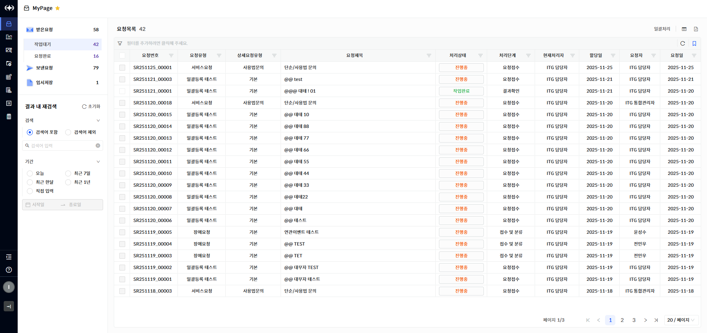
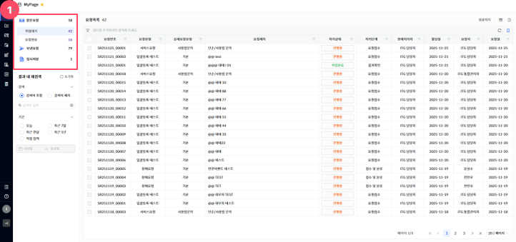
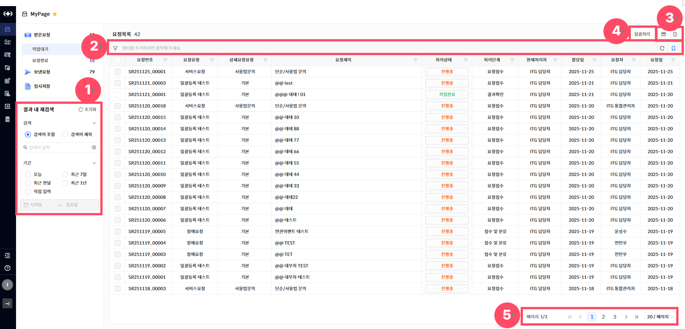

MyPage

메뉴에서 \[MyPage\]를 선택하면 로그인한 유저가 받은요청과 보낸요청 그리고 임시저장 처리된 요청들을 조회할 수 있는 화면으로 이동되며, ITSM 요청들을 조회 및 진행이 가능합니다.

<table>
<tbody>
<tr class="odd">
<td>
노트

MyPage는 로그인한 사용자가 직접 생성한 요청과, 요청 처리 담당자로 지정된 요청을 함께 확인 할 수 있는 메뉴입니다.

MyPage 최초 진입 시, 아이콘( [그림1].“1” ) [작업대기]의 해당되는 화면 지표 및 데이터를 조회할 수 있으며 [요청완료], [보낸요청], [임시저장] 클릭 시, 각각 해당되는 화면 지표 및 데이터를 조회할 수 있습니다.
</td>
</tr>
</tbody>
</table>

> ▶ \[그림1\] MyPage 목록
> 
> 화면 지표

| 요청번호   | 각 요청 건에 부여된 고유 식별 번호입니다. 요청을 조회하거나 추적할 때 사용됩니다. |
| ------ | ----------------------------------------------- |
| 요청유형   | 요청의 전체적인 분류를 나타냅니다.                             |
| 상세요청유형 | 요청유형 내에서 보다 구체적인 요청 항목을 의미합니다.                  |
| 요청제목   | 사용자가 입력한 요청 건의 제목입니다. 요청의 주요 내용을 간략히 나타냅니다.     |
| 처리상태   | 해당 요청의 현재 처리 상태를 나타냅니다.                         |
| 처리단계   | 요청이 현재 어떤 단계에 있는지를 나타냅니다.                       |
| 현재처리자  | 현재 요청을 처리하고 있는 담당자 이름 또는 부서를 나타냅니다.             |
| 할당일    | 요청이 현재처리자에게 할당(배정)된 날짜입니다.                      |
| 요청자    | 해당 요청을 최초로 작성하여 등록한 사용자입니다.                     |
| 요청일    | 요청자가 지정한 요청이 생성된 날짜입니다.                         |
| 종료일    | 요청 처리가 완료된 날짜입니다.                               |

> ▶ \[그림2\] MyPage 목록 상세 기능
> 
> 상세 정보

<table>
<thead>
<tr class="header">
<th>1. 받은요청</th>
<th>[2. 작업대기], [3. 요청완료]에 해당하는 요청들을 모아서 확인할 수 있습니다.</th>
</tr>
</thead>
<tbody>
<tr class="odd">
<td>2. 작업대기</td>
<td>나에게 할당된 요청들과 내가 속해 있는 담당자 그룹으로 할당된 요청들을 확인할 수 있습니다.</td>
</tr>
<tr class="even">
<td>3. 요청완료</td>
<td>
내가 등록한 요청 중에서 처리가 끝난 요청들을 확인할 수 있습니다.

( 상태 : [정상 종료] 혹은 [반려 종료] )
</td>
</tr>
<tr class="odd">
<td>4. 보낸요청</td>
<td>내가 등록했거나 처리 과정에 참여한 요청들을 확인할 수 있습니다.</td>
</tr>
<tr class="even">
<td>5. 임시저장</td>
<td>내가 등록했지만, 다음 단계로 이관시키지 않고 임시로 저장해 둔 요청들을 확인할 수 있습니다.</td>
</tr>
</tbody>
</table>

> ▶ \[그림3\] MyPage 목록 상세 기능
> 
> 상세 정보

| 1\. 결과 내 재검색       | 기능은 현재 그리드에 출력된 결과를 기준으로 추가 필터링하여 원하는 데이터를 더 정밀하게 검색할 수 있도록 도와주는 기능입니다.                        |
| ------------------ | ---------------------------------------------------------------------------------------------- |
| 2\. 그리드 필터         | 그리드 필터는 상단 행(필터 행)을 통해 각 컬럼 단위로 상세한 조건 검색이 가능한 기능입니다.                                          |
| 3\. 컬럼수정 & 엑셀저장 버튼 | 표시할 컬럼을 선택하거나 숨길 수 있는 설정 기능을 제공하는 컬럼수정 버튼과, 현재 화면에 표시된 데이터를 엑셀파일로 다운로드 하는 기능을 제공하는 엑셀저장 버튼입니다. |
| 4\. 일괄처리           | 여러 데이터를 일괄로 처리할 수 있는 버튼입니다.                                                                    |
| 5\. 페이징            | 목록 데이터를 구간별로 나누어 페이지 단위로 조회할 수 있도록 도와주는 기능입니다.                                                 |

