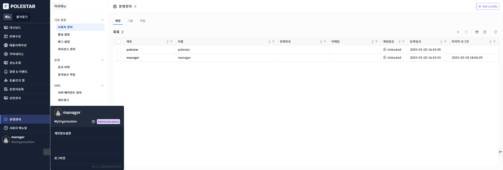
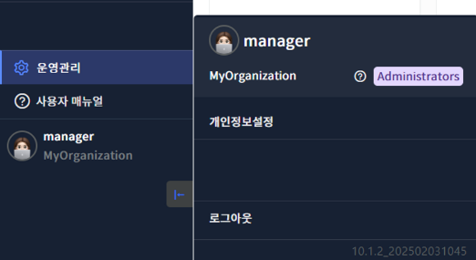

계정

사용자 ID 선택 시 왼쪽 하단에 팝업을 확인할 수 있습니다.

▶ \[그림1\] 전체 화면

▶ \[그림2\] 계정 팝업 창

화면 지표

<table>
<thead>
<tr class="header">
<th>ID</th>
<th>
사용자 계정명(ID)이 표시됩니다.

 : 사용자 표시
</th>
</tr>
</thead>
<tbody>
<tr class="odd">
<td>조직</td>
<td>사용자 계정명(ID) 하단에 사용자의 조직이 표시됩니다.</td>
</tr>
<tr class="even">
<td>관리자 매뉴얼</td>
<td>
클릭 시 관리자 매뉴얼 페이지를 새창에서 표시합니다.

 : 관리자 매뉴얼 페이지로 이동
</td>
</tr>
<tr class="odd">
<td>역할</td>
<td>
사용자의 역할이 표시됩니다.

 : 사용자 역할 표시
</td>
</tr>
<tr class="even">
<td>개인정보설정</td>
<td>개인 정보를 변경할 수 있는 설정 메뉴로 화면이 전환됩니다.</td>
</tr>
<tr class="odd">
<td>로그아웃</td>
<td>POLESTAR에서 로그아웃 할 수 있는 기능이 제공됩니다.</td>
</tr>
<tr class="even">
<td>버전 정보</td>
<td>현재 제품의 버전 정보가 표시됩니다.</td>
</tr>
</tbody>
</table>

