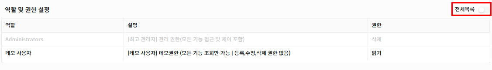
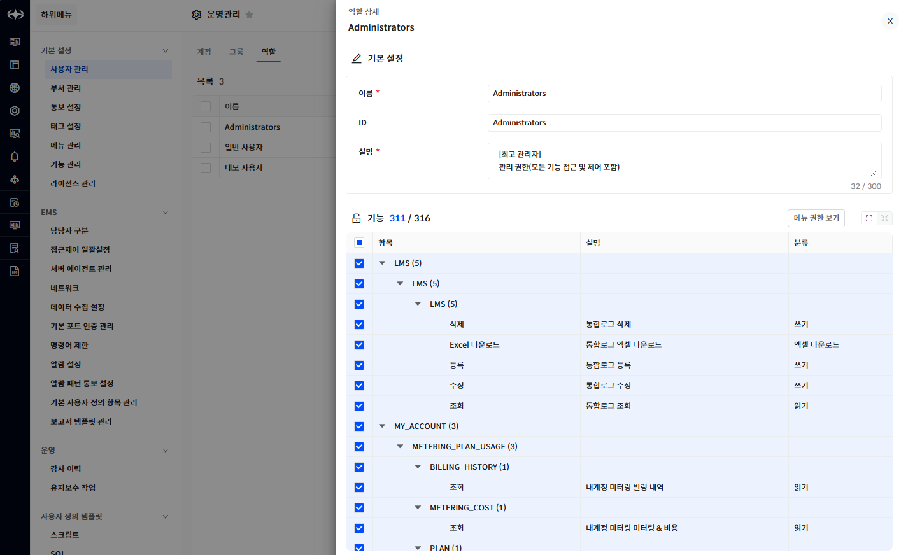

권한

Polestar10에서는 객체에 대한 접근 권한과 개별 기능에 대한 권한으로 사용자별 제어가 가능합니다. 여기서 말하는 객체란 관리대상 (서버, 네트워크, DBMS 등)을 포함하며 그 외 사용자 정의항목, 공통 알람 정책 등 사용자 접근에 대해 제어가 필요한 항목에 적용되어 있습니다.

또한 각각의 기능들에 대해 조회, 수정, 삭제 등 세분화된 권한 부여가 가능합니다.

객체 권한

관리 대상 장비와 사용자 정의 항목, 그 외 객체에 대한 권한 부여가 필요한 항목들에 대해 객체 권한을 부여할 수 있습니다. 관리 대상 추가 시 기본적으로 Administrator 역할에 대해 권한이 부여됩니다.

Polestar10 에서 현재 객체 권한으로 관리되는 항목은 아래와 같습니다.

객체 권한 대상

<table>
<thead>
<tr class="header">
<th>관리대상</th>
<th>서버, 네트워크, 오라클, MSSQL, CUBRID, 클러스터, 애플리케이션</th>
</tr>
</thead>
<tbody>
<tr class="odd">
<td>개별 항목</td>
<td>
위젯대시보드, 빌더대시보드, 공통알람정책, 복합알람정책

성능이상감지 정책, 보고서, 토폴로지맵, 데이터 수집 정책
</td>
</tr>
</tbody>
</table>

<table>
<tbody>
<tr class="odd">
<td>
노트

개별 항목들에 대한 객체 권한에 따른 제어 방식은 상이할 수 있습니다. 각 기능별 매뉴얼을 참조해주세요.
</td>
</tr>
</tbody>
</table>

객체 권한 설정 절차 (예시 대상 : 서버)

1.  전체 구성에서 특정 서버 클릭

2.  죄측 메뉴에서 설정 정보 클릭

3.  역할 및 권한 설정 카테고리에서 권한 변경

4.  새로운 역할에 권한 부여 시 전체 목록 토글 클릭 후 권한 부여 가능

5.  화면 우측 사단의 \[저장\] 버튼 클릭

▶ \[그림1\] 서버 역할 및 권한 설정 화면

<table>
<tbody>
<tr class="odd">
<td>
노트

관리 대상 장비의 대한 접근 제어 설정을 일괄도도 가능합니다. 해당 부분은 접근 제어 일괄 설정 부분에서 확인하세요.
</td>
</tr>
</tbody>
</table>

기능 권한

Polestar10에서 제공하는 다양한 기능에 대해 개별적인 권한 설정이 가능합니다. 모든 기능 권한은 역할에 부여할 수 있으며 사용자는 해당 역할을 부여 받음으로서 기능에 대한 권한이 적용됩니다.

기능 권한 설정 절차

1.  운영관리 – 사용자 관리 - 역할 탭 클릭

2.  기능 권한을 추가하거나 변경할 역할 선택

3.  역할 상세화면에서 기능 권한 추가 / 변경

4.  화면 우측 사단의 \[저장\] 버튼 클릭

▶ \[그림2\] 역할에 기능 권한 설정 화면

<table>
<tbody>
<tr class="odd">
<td>
노트

기능 권한은 기능별로 제어 방식이 다를 수 있습니다. 기능 권한에 따른 사용 방법은 각 기능별 매뉴얼을 참조해주세요..
</td>
</tr>
</tbody>
</table>

