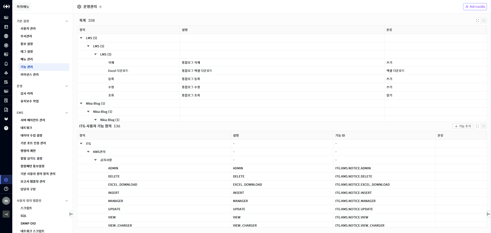
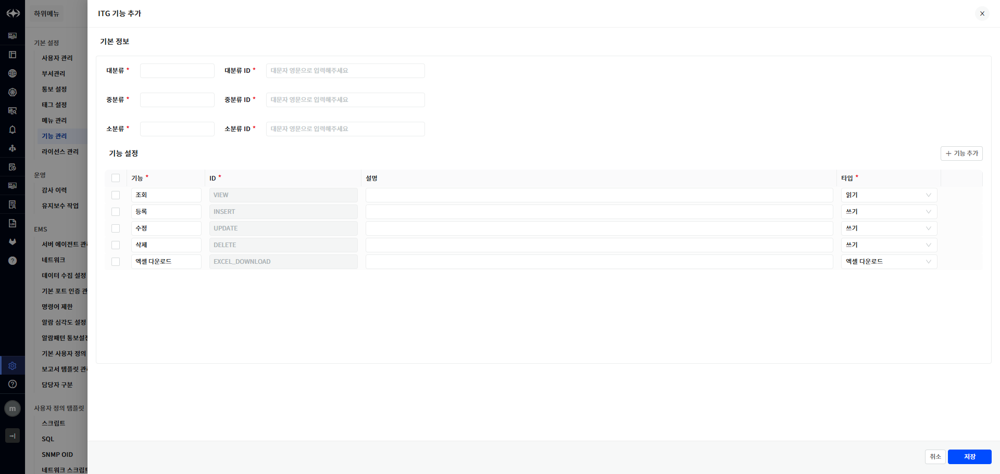
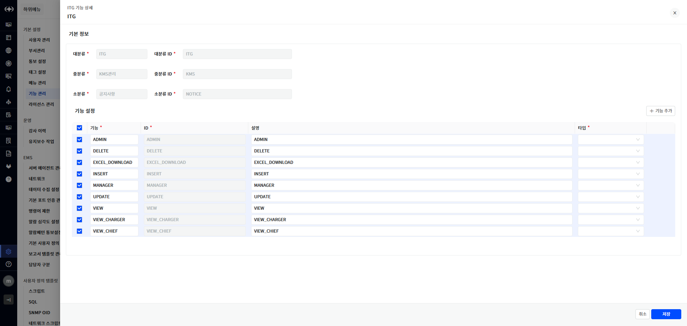

기능 관리

시스템이 제공하는 기능을 조회하는 기능입니다. 시스템이 제공하는 기능 목록은 시스템 구축 시 자동으로 등록됩니다. 사용자가 메뉴 추가 기능을 사용하여 메뉴 타입을 URL로 신규 메뉴를 등록하면 해당 메뉴에 접근할 수 있는 기능이 자동으로 생성됩니다.

▶ \[그림1\] 기능 관리

화면 지표

<table>
<thead>
<tr class="header">
<th>항목</th>
<th>기능의 분류 체계 및 이름입니다.</th>
</tr>
</thead>
<tbody>
<tr class="odd">
<td>설명</td>
<td>기능에 대한 설명입니다.</td>
</tr>
<tr class="even">
<td>분류</td>
<td>
기능의 분류입니다.

<ul>
<li>
읽기/실행/쓰기/엑셀 다운로드
</li>
</ul></td>
</tr>
</tbody>
</table>

ITG 사용자 기능 정의

ITG 운영에 필요한 기능을 관리합니다. ITG에서 제공하는 기능은 No-Coding 기능을 이용해서 동적으로 생성되는 화면(기능)이 많기 때문에 고정으로 정의되지 않습니다. 따라서, 생성된 화면에 대한 접근 제어를 위해 기능을 수동으로 관리하는 기능이 제공됩니다. ITG 제품 라이선스가 제공되면 ITG에서 미리 생성된 기능이 추가되어 화면에 표시됩니다.

기능을 수동으로 등록하는 경우는 ITG제품에서 제공하는 No-Coding 기능을 이용한 화면을 메뉴로 등록하는 경우에 필요합니다. 메뉴 타입이 No-Coding 인 경우는 메뉴와 관련된 기능이 자동으로 생성되지 않으므로 기능을 먼저 등록하고 메뉴 등록 시 해당 기능과 매핑을 해야 합니다.

<table>
<tbody>
<tr class="odd">
<td>
노트

메뉴 추가 시 타입이 URL 인 경우는 기능이 자동으로 생성되지만 No-Coding 인 경우는 그렇지 않습니다. No-Coding 메뉴를 추가하려는 경우는 기능을 먼저 등록하고 메뉴 등록 화면에서 기능을 선택합니다. No-Coding 메뉴의 경우 기능을 선택하지 않으면 권한 할당이 불가능하여 화면에서 해당 메뉴를 사용할 수 없습니다.
</td>
</tr>
</tbody>
</table>

화면 지표

<table>
<thead>
<tr class="header">
<th>항목</th>
<th>기능의 분류 체계 및 이름입니다.</th>
</tr>
</thead>
<tbody>
<tr class="odd">
<td>설명</td>
<td>기능에 대한 설명입니다.</td>
</tr>
<tr class="even">
<td>기능 ID</td>
<td>
기능 ID입니다.

ITG 제품의 No-Coding 기능으로 화면을 제작하는 경우 권한 설정을 위해 해당 정보를 사용합니다.
</td>
</tr>
<tr class="odd">
<td>분류</td>
<td>
기능의 분류입니다.

<ul>
<li>
읽기/실행/쓰기/엑셀 다운로드
</li>
</ul></td>
</tr>
</tbody>
</table>

기능 추가

사용자는 ITG No-Coding으로 제작한 화면의 접근 제어를 위해 필요한 기능을 추가할 수 있습니다. 대분류, 중분류, 소분류 하위에 세부 기능을 정의합니다. 사용자는 기능 추가 화면에서 세부 기능을 일괄로 정의하고 등록할 수 있습니다.

▶ \[그림2\] 기능 추가

기능 추가 절차

1.  기능 추가 버튼을 클릭합니다.

2.  대분류, 대분류 ID를 입력합니다.

3.  중분류, 중분류 ID를 입력합니다.

4.  소분류, 소분류 ID를 입력합니다.

5.  세부 기능 정보를 입력하고 등록할 기능을 체크합니다.

6.  \[기능 추가\] 버튼을 클릭하여 신규 기능을 추가할 수 있습니다.

7.  \[저장\] 버튼을 선택하여 저장합니다.

기능 수정

사용자는 ITG 사용자 정의 기능을 수정할 수 있습니다. 기능 이름을 클릭하면 수정화면이 표시되어 수정할 수 있습니다. 분류에 대한 이름과 ID는 수정할 수 없습니다.

▶ \[그림3\] 기능 수정

기능 수정 절차

1.  기능이름을 클릭합니다.

2.  세부 기능 정보를 수정합니다.

3.  \[기능 추가\] 버튼을 클릭하여 신규 기능을 추가할 수 있습니다.

4.  \[저장\] 버튼을 선택하여 저장합니다.

