기본 사용자 정의 항목 관리

서버 등록 시 자동으로 등록되는 사용자 정의 항목을 관리합니다. 로그, 윈도우 이벤트 로그, 프로세스, 파일, 윈도우 서비스를 지원하며, OS별로 등록할 사용자 정의 항목을 설정합니다.

로그

\[로그\] 탭을 선택하여 서버 등록 시 자동으로 등록되는 기본 로그 정의를 관리할 수 있습니다.

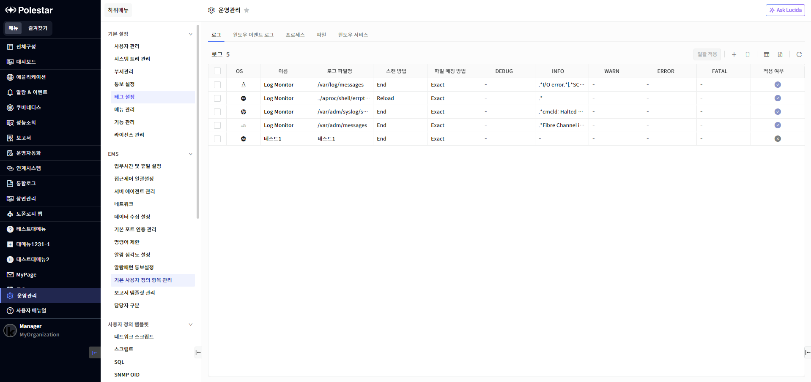

▶ \[그림1\] 로그 목록

화면 지표

<table>
<thead>
<tr class="header">
<th>OS</th>
<th>로그가 적용될 서버의 OS 종류를 표시합니다.</th>
</tr>
</thead>
<tbody>
<tr class="odd">
<td>이름</td>
<td>로그 정의 이름을 표시합니다.</td>
</tr>
<tr class="even">
<td>로그 파일 이름</td>
<td>로그 파일의 경로를 포함한 이름(패턴)을 표시합니다.</td>
</tr>
<tr class="odd">
<td>스캔 방법</td>
<td>
스캔 방법을 표시합니다.

(End: 등록 이후 마지막 라인부터 읽음,

Reload: 항상 파일 전체를 새로 읽음)
</td>
</tr>
<tr class="even">
<td>파일 매칭 방법</td>
<td>
파일 매칭 방법을 표시합니다.

(Exact: 날짜 패턴 입력시 현재 시간을 기준으로 파일을 찾음,

Recent: 날짜 패턴에 맞는 파일 중 가장 최근의 파일을 찾음)
</td>
</tr>
<tr class="odd">
<td>DEBUG</td>
<td>‘DEBUG’ 등급의 이벤트로 매칭할 패턴을 입력합니다.</td>
</tr>
<tr class="even">
<td>INFO</td>
<td>‘INFO’ 등급의 이벤트로 매칭할 패턴을 입력합니다.</td>
</tr>
<tr class="odd">
<td>WARN</td>
<td>‘WARN’ 등급의 이벤트로 매칭할 패턴을 입력합니다.</td>
</tr>
<tr class="even">
<td>ERROR</td>
<td>‘ERROR’ 등급의 이벤트로 매칭할 패턴을 입력합니다.</td>
</tr>
<tr class="odd">
<td>FATAL</td>
<td>‘FATAL’ 등급의 이벤트로 매칭할 패턴을 입력합니다.</td>
</tr>
<tr class="even">
<td>적용 여부</td>
<td>서버 적용 여부를 표시합니다.</td>
</tr>
</tbody>
</table>

로그 추가

서버에서 기본적으로 관리하는 로그 정의를 등록합니다. 로그 정의 추가 시 설정하는 정보는 서버에서 사용자 정의 항목 중 로그를 등록할 때와 동일하며, ‘설정 정보 적용 여부’ 항목으로 기본 로그 적용 여부를 설정할 수 있습니다. ‘설정 정보 적용 여부’가 체크되어 있는 로그 정의는 지정한 OS에 해당하는 서버가 등록될 때 자동으로 등록되며, 등록 직후부터 모니터링을 진행합니다.

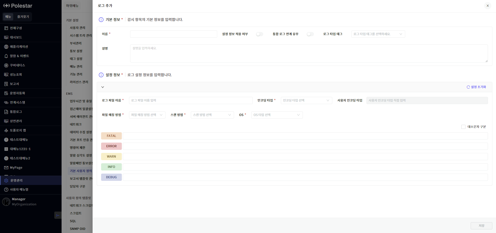

▶ \[그림2\] 로그 추가

기본 정보

<table>
<thead>
<tr class="header">
<th>이름</th>
<th>등록할 로그 정의 이름을 입력합니다.</th>
</tr>
</thead>
<tbody>
<tr class="odd">
<td>설명</td>
<td>등록할 로그에 대한 설명을 입력합니다.</td>
</tr>
<tr class="even">
<td>설정 정보 적용 여부</td>
<td>등록할 로그의 서버 적용 여부를 설정합니다.</td>
</tr>
<tr class="odd">
<td>통합 로그 연계 유무</td>
<td>
(※ [통합 로그] 라이선스가 활성화된 경우에만 표시됩니다.)

등록할 로그의 통합 로그 연계 유무를 설정합니다.
</td>
</tr>
<tr class="even">
<td>로그 타입 태그</td>
<td>
(※ [통합 로그] 라이선스가 활성화된 경우에만 표시됩니다.)

등록할 로그의 로그 타입 태그를 설정합니다.
</td>
</tr>
</tbody>
</table>

설정 정보

<table>
<thead>
<tr class="header">
<th>로그 파일 이름</th>
<th>로그 파일의 경로를 포함한 이름(패턴)을 입력합니다.</th>
</tr>
</thead>
<tbody>
<tr class="odd">
<td>인코딩 타입</td>
<td>로그 파일의 한글 인코딩을 위한 캐릭터셋을 지정합니다.</td>
</tr>
<tr class="even">
<td>사용자 인코딩 타입</td>
<td>인코딩 타입이 ‘CUSTOM’인 경우, 캐릭터셋을 직접 설정합니다.</td>
</tr>
<tr class="odd">
<td>파일 매칭 방법</td>
<td>
파일 매칭 방법을 선택합니다.

(Exact: 날짜 패턴 입력시 현재 시간을 기준으로 파일을 찾음,

Recent: 날짜 패턴에 맞는 파일 중 가장 최근의 파일을 찾음)
</td>
</tr>
<tr class="even">
<td>스캔 방법</td>
<td>
스캔 방법을 선택합니다.

(End: 등록 이후 마지막 라인부터 읽음,

Reload: 항상 파일 전체를 새로 읽음)
</td>
</tr>
<tr class="odd">
<td>OS</td>
<td>서버 OS종류를 설정합니다.</td>
</tr>
<tr class="even">
<td>대소문자 구분</td>
<td>메시지 패턴의 대소문자 구분 여부를 설정합니다. (체크시 대소문자 구별)</td>
</tr>
<tr class="odd">
<td>FATAL</td>
<td>‘FATAL’ 등급의 이벤트로 매칭할 패턴을 입력합니다.</td>
</tr>
<tr class="even">
<td>ERROR</td>
<td>‘ERROR’ 등급의 이벤트로 매칭할 패턴을 입력합니다.</td>
</tr>
<tr class="odd">
<td>WARN</td>
<td>‘WARN’ 등급의 이벤트로 매칭할 패턴을 입력합니다.</td>
</tr>
<tr class="even">
<td>INFO</td>
<td>‘INFO’ 등급의 이벤트로 매칭할 패턴을 입력합니다.</td>
</tr>
<tr class="odd">
<td>DEBUG</td>
<td>‘DEBUG’ 등급의 이벤트로 매칭할 패턴을 입력합니다.</td>
</tr>
</tbody>
</table>

로그 추가 절차

 

1.  로그 목록 우측 상단의 \[추가\] 버튼 클릭

2.  추가할 로그 정보를 입력하고 \[저장\] 버튼 클릭

로그 수정

로그 목록에서 ‘이름’ 필드를 클릭하여 등록된 로그 정의를 수정할 수 있습니다. 수정된 로그 정의는 ‘설정 정보적용 여부’가 활성화되어 있으면 ‘일괄적용’ 기능을 통해 서버에 등록되어 있는 로그에 적용됩니다. 신규 추가하는 서버에는 수정된 로그 정보가 적용됩니다.

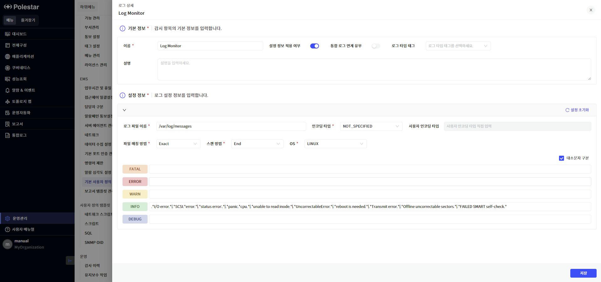

▶ \[그림3\] 로그 상세

로그 수정 절차

 

1.  로그 목록에서 수정할 로그 정보의 ‘이름’ 필드 클릭

2.  로그 정보를 수정하고 \[저장\] 버튼 클릭

로그 삭제

로그 목록에서 특정 로그 정의를 삭제할 수 있습니다. 로그 정의를 삭제하더라도 서버에 등록된 로그에는 영향을 미치지 않습니다.

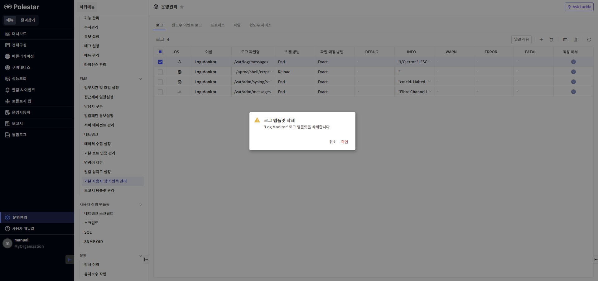

▶ \[그림4\] 로그 삭제

로그 삭제 절차

 

1.  로그 목록에서 삭제할 로그 정의 선택 (다수 선택 가능)

2.  로그 목록 우측 상단의 \[삭제\] 버튼 클릭

로그 일괄적용

‘일괄적용’ 기능을 통해 선택한 로그 정의를 등록된 서버에 반영할 수 있습니다. 일괄적용 기능은 백그라운드 작업으로 진행되므로 기능 실행 후 다른 메뉴 화면으로 이동하더라도 정상적으로 적용됩니다.

일괄적용 기능은 선택한 로그 정의가 서버에 등록되어 있지 않으면 신규 로그로 등록합니다. 서버에 로그가 이미 등록되어 있고, 기본 사용자 정의 항목 관리의 로그 정의 설정이 업데이트 된 경우에는 등록되어 있는 로그가 기본 사용자 정의 항목 관리 설정으로 업데이트 됩니다. 단, 기본 사용자 정의 항목 관리의 로그 정의 설정이 업데이트 된 이후에 사용자가 서버에 등록된 로그를 직접 업데이트한 경우에는 사용자의 설정 내용이 우선시되며, 기본 사용자 정의 항목 관리의 로그 정의 설정이 적용되지 않습니다.

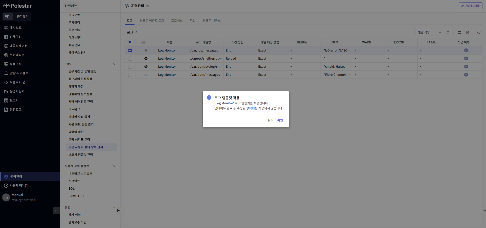

▶ \[그림5\] 로그 일괄적용

로그 일괄적용 절차

 

1.  로그 목록에서 일괄적용할 로그 정의 선택 (다중 선택 가능)

2.  로그 목록 우측 상단의 \[일괄 적용\] 버튼 클릭

3.  일괄적용 팝업창 내용 확인 후 \[확인\] 버튼 클릭

4.  일괄적용 시작 안내 팝업창 확인

윈도우 이벤트 로그

\[윈도우 이벤트 로그\] 탭을 선택하여 서버 등록 시 자동으로 등록되는 기본 윈도우 이벤트 로그 정의를 관리할 수 있습니다.

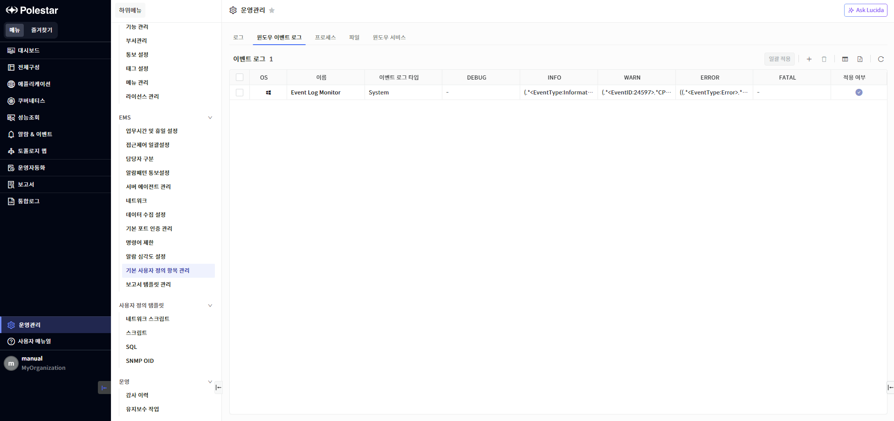

▶ \[그림6\] 윈도우 이벤트 로그 목록

화면 지표

<table>
<thead>
<tr class="header">
<th>OS</th>
<th>윈도우 이벤트 로그가 적용될 서버의 OS 종류를 표시합니다.</th>
</tr>
</thead>
<tbody>
<tr class="odd">
<td>이름</td>
<td>윈도우 이벤트 로그 정의 이름을 표시합니다.</td>
</tr>
<tr class="even">
<td>이벤트 로그 타입</td>
<td>
윈도우 이벤트 로그타입을 표시합니다.

(Application, Security, System, TaskScheduler)
</td>
</tr>
<tr class="odd">
<td>DEBUG</td>
<td>‘DEBUG’ 등급의 이벤트로 매칭할 패턴을 입력합니다.</td>
</tr>
<tr class="even">
<td>INFO</td>
<td>‘INFO’ 등급의 이벤트로 매칭할 패턴을 입력합니다.</td>
</tr>
<tr class="odd">
<td>WARN</td>
<td>‘WARN’ 등급의 이벤트로 매칭할 패턴을 입력합니다.</td>
</tr>
<tr class="even">
<td>ERROR</td>
<td>‘ERROR’ 등급의 이벤트로 매칭할 패턴을 입력합니다.</td>
</tr>
<tr class="odd">
<td>FATAL</td>
<td>‘FATAL’ 등급의 이벤트로 매칭할 패턴을 입력합니다.</td>
</tr>
<tr class="even">
<td>적용 여부</td>
<td>서버 적용 여부를 표시합니다.</td>
</tr>
</tbody>
</table>

윈도우 이벤트 로그 추가

서버에서 기본적으로 관리하는 윈도우 이벤트 로그 정의를 등록합니다. 윈도우 이벤트 로그 정의 추가 시 설정하는 정보는 서버에서 사용자 정의 항목 중 윈도우 이벤트 로그를 등록할 때와 동일하며, ‘설정 정보 적용 여부’ 항목으로 기본 윈도우 이벤트 로그 적용 여부를 설정할 수 있습니다. ‘설정 정보 적용 여부’가 체크되어 있는 윈도우 이벤트 로그 정의는 윈도우 OS 서버가 등록될 때 자동으로 등록되며, 등록 직후부터 모니터링을 진행합니다.

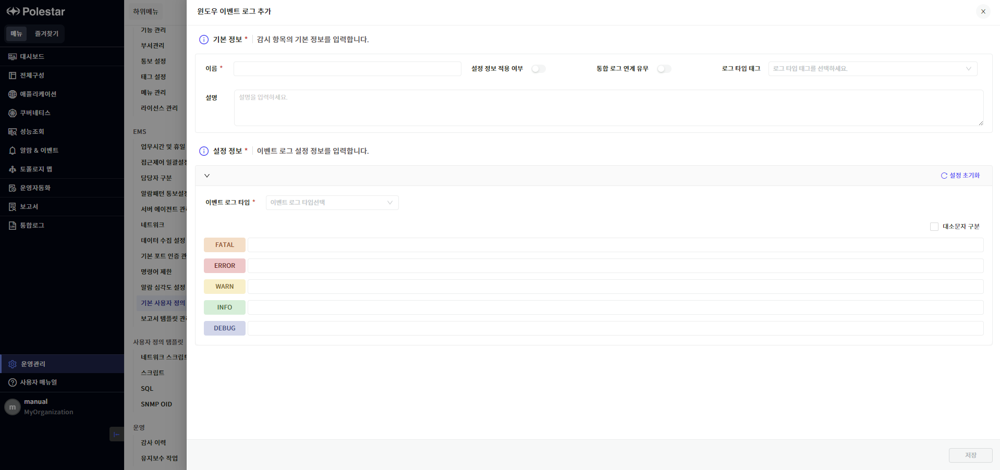

▶ \[그림7\] 윈도우 이벤트 로그 추가

기본 정보

<table>
<thead>
<tr class="header">
<th>이름</th>
<th>등록할 윈도우 이벤트 로그 정의 이름을 입력합니다.</th>
</tr>
</thead>
<tbody>
<tr class="odd">
<td>설명</td>
<td>등록할 윈도우 이벤트 로그에 대한 설명을 입력합니다.</td>
</tr>
<tr class="even">
<td>설정 정보 적용 여부</td>
<td>등록할 윈도우 이벤트 로그의 서버 적용 여부를 설정합니다.</td>
</tr>
<tr class="odd">
<td>통합 로그 연계 유무</td>
<td>
(※ [통합 로그] 라이선스가 활성화된 경우에만 표시됩니다.)

등록할 윈도우 이벤트 로그의 통합 로그 연계 유무를 설정합니다.
</td>
</tr>
<tr class="even">
<td>로그 타입 태그</td>
<td>
(※ [통합 로그] 라이선스가 활성화된 경우에만 표시됩니다.)

등록할 윈도우 이벤트 로그의 로그 타입 태그를 설정합니다.
</td>
</tr>
</tbody>
</table>

설정 정보

<table>
<thead>
<tr class="header">
<th>이벤트 로그 타입</th>
<th>
윈도우 이벤트 로그타입을 선택합니다.

(Application, Security, System, TaskScheduler)
</th>
</tr>
</thead>
<tbody>
<tr class="odd">
<td>대소문자 구분</td>
<td>메시지 패턴의 대소문자 구분 여부를 설정합니다. (체크시 대소문자 구별)</td>
</tr>
<tr class="even">
<td>FATAL</td>
<td>‘FATAL’ 등급의 이벤트로 매칭할 패턴을 입력합니다.</td>
</tr>
<tr class="odd">
<td>ERROR</td>
<td>‘ERROR’ 등급의 이벤트로 매칭할 패턴을 입력합니다.</td>
</tr>
<tr class="even">
<td>WARN</td>
<td>‘WARN’ 등급의 이벤트로 매칭할 패턴을 입력합니다.</td>
</tr>
<tr class="odd">
<td>INFO</td>
<td>‘INFO’ 등급의 이벤트로 매칭할 패턴을 입력합니다.</td>
</tr>
<tr class="even">
<td>DEBUG</td>
<td>‘DEBUG’ 등급의 이벤트로 매칭할 패턴을 입력합니다.</td>
</tr>
</tbody>
</table>

윈도우 이벤트 로그 추가 절차

 

1.  윈도우 이벤트 로그 목록 우측 상단의 \[추가\] 버튼 클릭

2.  추가할 윈도우 이벤트 로그 정보를 입력하고 \[저장\] 버튼 클릭

윈도우 이벤트 로그 수정

윈도우 이벤트 로그 목록에서 ‘이름’ 필드를 클릭하여 등록된 윈도우 이벤트 로그 정의를 수정할 수 있습니다. 수정된 윈도우 이벤트 로그 정의는 ‘설정 정보 적용 여부’가 활성화되어 있으면 ‘일괄적용’ 기능을 통해 서버에 등록되어 있는 윈도우 이벤트 로그에 적용됩니다. 신규 추가하는 서버에는 수정된 윈도우 이벤트 로그 정보가 적용됩니다.

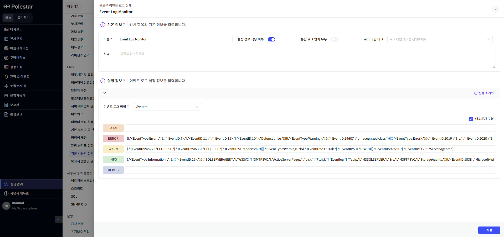

▶ \[그림8\] 윈도우 이벤트 로그 상세

윈도우 이벤트 로그 수정 절차

 

1.  윈도우 이벤트 로그 목록에서 수정할 윈도우 이벤트 로그 정보의 ‘이름’ 필드 클릭

2.  윈도우 이벤트 로그 정보를 수정하고 \[저장\] 버튼 클릭

윈도우 이벤트 로그 삭제

윈도우 이벤트 로그 목록에서 특정 윈도우 이벤트 로그 정의를 삭제할 수 있습니다. 윈도우 이벤트 로그 정의를 삭제하더라도 서버에 등록된 윈도우 이벤트 로그에는 영향을 미치지 않습니다.

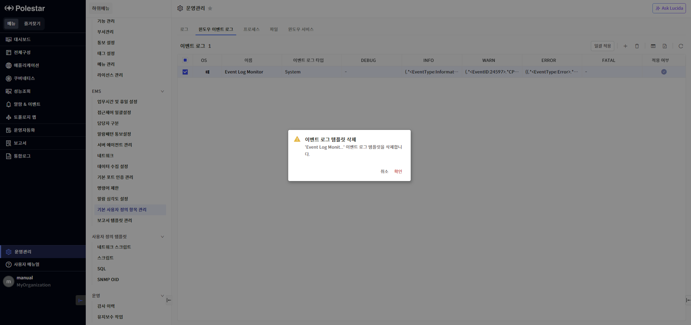

▶ \[그림9\] 윈도우 이벤트 로그 삭제

윈도우 이벤트 로그 삭제 절차

 

1.  윈도우 이벤트 로그 목록에서 삭제할 윈도우 이벤트 로그 정의 선택 (다수 선택 가능)

2.  윈도우 이벤트 로그 목록 우측 상단의 \[삭제\] 버튼 클릭

윈도우 이벤트 로그 일괄적용

‘일괄적용’ 기능을 통해 선택한 윈도우 이벤트 로그 정의를 등록된 서버에 반영할 수 있습니다. 일괄적용 기능은 백그라운드 작업으로 진행되므로 기능 실행 후 다른 메뉴 화면으로 이동하더라도 정상적으로 적용됩니다.

일괄적용 기능은 선택한 윈도우 이벤트 로그 정의가 서버에 등록되어 있지 않으면 신규 윈도우 이벤트 로그로 등록합니다. 서버에 윈도우 이벤트 로그가 이미 등록되어 있고, 기본 사용자 정의 항목 관리의 윈도우 이벤트 로그 정의 설정이 업데이트 된 경우에는 등록되어 있는 윈도우 이벤트 로그가 기본 사용자 정의 항목 관리 설정으로 업데이트 됩니다. 단, 기본 사용자 정의 항목 관리의 윈도우 이벤트 로그 정의 설정이 업데이트 된 이후에 사용자가 서버에 등록된 윈도우 이벤트 로그를 직접 업데이트한 경우에는 사용자의 설정 내용이 우선시되며, 기본 사용자 정의 항목 관리의 윈도우 이벤트 로그 정의 설정이 적용되지 않습니다.

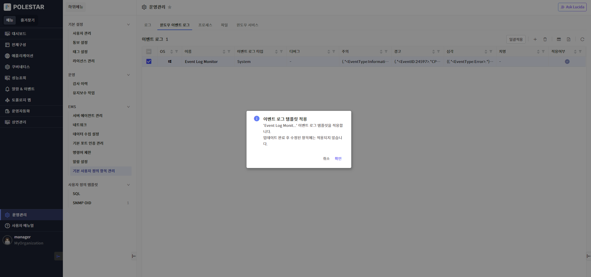

▶ \[그림10\] 윈도우 이벤트 로그 일괄적용

윈도우 이벤트 로그 일괄적용 절차

 

1.  윈도우 이벤트 로그 목록에서 일괄적용할 윈도우 이벤트 로그 정의 선택 (다중 선택 가능)

2.  윈도우 이벤트 로그 목록 우측 상단의 \[일괄 적용\] 버튼 클릭

3.  일괄적용 팝업창 내용 확인 후 \[확인\] 버튼 클릭

4.  일괄적용 시작 안내 팝업창 확인

프로세스

\[프로세스\] 탭을 선택하여 서버 등록 시 자동으로 등록되는 기본 프로세스 정의를 관리할 수 있습니다.

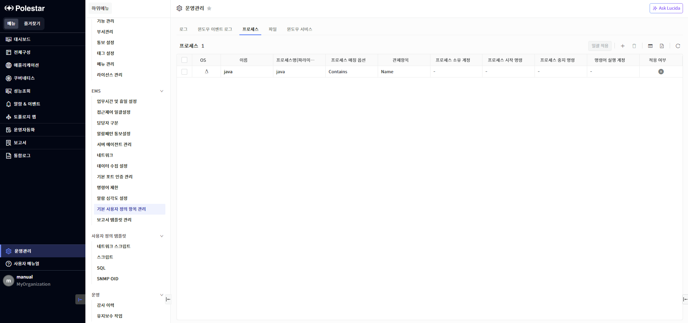

▶ \[그림11\] 프로세스 목록

화면 지표

<table>
<thead>
<tr class="header">
<th>OS</th>
<th>프로세스가 적용될 서버의 OS 종류를 표시합니다.</th>
</tr>
</thead>
<tbody>
<tr class="odd">
<td>이름</td>
<td>프로세스 정의 이름을 표시합니다.</td>
</tr>
<tr class="even">
<td>프로세스명(파라미터)</td>
<td>모니터링할 프로세스 이름 또는 파라미터를 표시합니다.</td>
</tr>
<tr class="odd">
<td>프로세스 매칭 옵션</td>
<td>
프로세스 매칭 옵션을 표시합니다.

(Contains: 포함, Exact: 일치, Regex: 정규식)
</td>
</tr>
<tr class="even">
<td>관제항목</td>
<td>
관제 대상 항목을 표시합니다.

(Name: 프로세스 이름, Parameter: 파라미터)
</td>
</tr>
<tr class="odd">
<td>프로세스 소유 계정</td>
<td>프로세스 소유 계정을 표시합니다.</td>
</tr>
<tr class="even">
<td>프로세스 시작 명령</td>
<td>프로세스 시작 오퍼레이션에 사용되는 명령어를 표시합니다.</td>
</tr>
<tr class="odd">
<td>프로세스 중지 명령</td>
<td>프로세스 중지 오퍼레이션에 사용되는 명령어를 표시합니다.</td>
</tr>
<tr class="even">
<td>명령어 실행 계정</td>
<td>프로세스 시작/중지 명령어를 실행할 계정을 표시합니다.</td>
</tr>
<tr class="odd">
<td>적용 여부</td>
<td>서버 적용 여부를 표시합니다.</td>
</tr>
</tbody>
</table>

프로세스 추가

서버에서 기본적으로 관리하는 프로세스 정의를 등록합니다. 프로세스 정의 추가 시 설정하는 정보는 서버에서 사용자 정의 항목 중 프로세스를 등록할 때와 동일하며, ‘설정 정보 적용 여부’ 항목으로 기본 프로세스 적용 여부를 설정할 수 있습니다. ‘설정 정보 적용 여부’가 체크되어 있는 프로세스는 지정한 OS에 해당하는 서버가 등록될 때 자동으로 등록되며, 등록 직후부터 모니터링을 진행합니다.

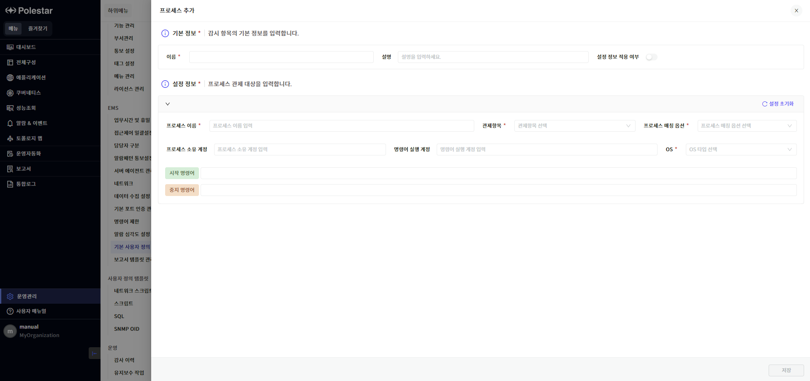

▶ \[그림12\] 프로세스 추가

기본 정보

| 이름          | 등록할 프로세스 정의 이름을 입력합니다.     |
| ----------- | -------------------------- |
| 설명          | 등록할 프로세스에 대한 설명을 입력합니다.    |
| 설정 정보 적용 여부 | 등록할 프로세스의 서버 적용 여부를 설정합니다. |

설정 정보

<table>
<thead>
<tr class="header">
<th>프로세스 이름</th>
<th>모니터링할 프로세스 이름 또는 파라미터를 설정합니다.</th>
</tr>
</thead>
<tbody>
<tr class="odd">
<td>관제항목</td>
<td>
‘프로세스 이름’ 필드에서 설정한 정보의 대상 항목을 설정합니다.

(Name: 프로세스 이름, Parameter: 파라미터)
</td>
</tr>
<tr class="even">
<td>프로세스 매칭 옵션</td>
<td>
프로세스 매칭 옵션을 설정합니다.

(Contains: ‘프로세스명’ 필드값을 포함하는 프로세스,

Exact: ‘프로세스명’ 필드값과 일치하는 프로세스,

Regex: ‘프로세스명’ 필드값 정규식과 일치하는 프로세스)
</td>
</tr>
<tr class="odd">
<td>프로세스 소유 계정</td>
<td>특정 소유 계정의 프로세스만을 대상으로 하고자 할 경우 사용합니다.</td>
</tr>
<tr class="even">
<td>명령어 실행 계정</td>
<td>프로세스 시작/중지 명령어를 실행할 계정을 설정합니다.</td>
</tr>
<tr class="odd">
<td>OS</td>
<td>프로세스가 적용될 서버의 OS 종류를 설정합니다.</td>
</tr>
<tr class="even">
<td>시작 명령어</td>
<td>프로세스 시작 오퍼레이션에 사용되는 명령어를 설정합니다.</td>
</tr>
<tr class="odd">
<td>중지 명령어</td>
<td>프로세스 중지 오퍼레이션에 사용되는 명령어를 설정합니다.</td>
</tr>
</tbody>
</table>

프로세스 추가 절차

 

1.  프로세스 목록 우측 상단의 \[추가\] 버튼 클릭

2.  추가할 프로세스 정보를 입력하고 \[저장\] 버튼 클릭

프로세스 수정

프로세스 목록에서 ‘이름’ 필드를 클릭하여 등록된 프로세스 정의를 수정할 수 있습니다. 수정된 프로세스 정의는 ‘설정 정보 적용 여부’가 활성화되어 있으면 ‘일괄적용’ 기능을 통해 서버에 등록되어 있는 프로세스에 적용됩니다. 신규 추가하는 서버에는 수정된 프로세스 정보가 적용됩니다.

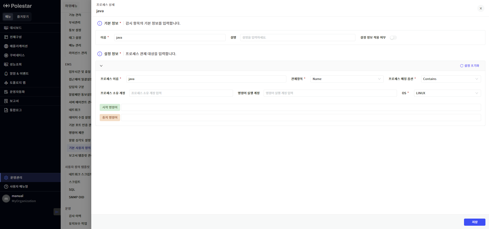

▶ \[그림13\] 프로세스 상세

프로세스 수정 절차

 

1.  프로세스 목록에서 수정할 프로세스 정보의 ‘이름’ 필드 클릭

2.  프로세스 정보를 수정하고 \[저장\] 버튼 클릭

프로세스 삭제

프로세스 목록에서 특정 프로세스 정의를 삭제할 수 있습니다. 프로세스 정의를 삭제하더라도 서버에 등록된 프로세스에는 영향을 미치지 않습니다.

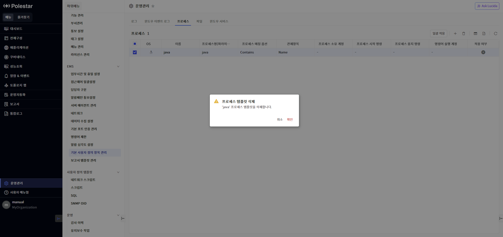

▶ \[그림14\] 프로세스 삭제

프로세스 삭제 절차

 

1.  프로세스 목록에서 삭제할 프로세스 정의 선택 (다수 선택 가능)

2.  프로세스 목록 우측 상단의 \[삭제\] 버튼 클릭

프로세스 일괄적용

‘일괄적용’ 기능을 통해 선택한 프로세스 정의를 등록된 서버에 반영할 수 있습니다. 일괄적용 기능은 백그라운드 작업으로 진행되므로 기능 실행 후 다른 메뉴 화면으로 이동하더라도 정상적으로 적용됩니다.

일괄적용 기능은 선택한 프로세스 정의가 서버에 등록되어 있지 않으면 신규 프로세스로 등록합니다. 서버에 프로세스가 이미 등록되어 있고, 기본 사용자 정의 항목 관리의 프로세스 정의 설정이 업데이트 된 경우에는 등록되어 있는 프로세스가 기본 사용자 정의 항목 관리 설정으로 업데이트 됩니다. 단, 기본 사용자 정의 항목 관리의 프로세스 정의 설정이 업데이트 된 이후에 사용자가 서버에 등록된 프로세스를 직접 업데이트한 경우에는 사용자의 설정 내용이 우선시되며, 기본 사용자 정의 항목 관리의 프로세스 정의 설정이 적용되지 않습니다.

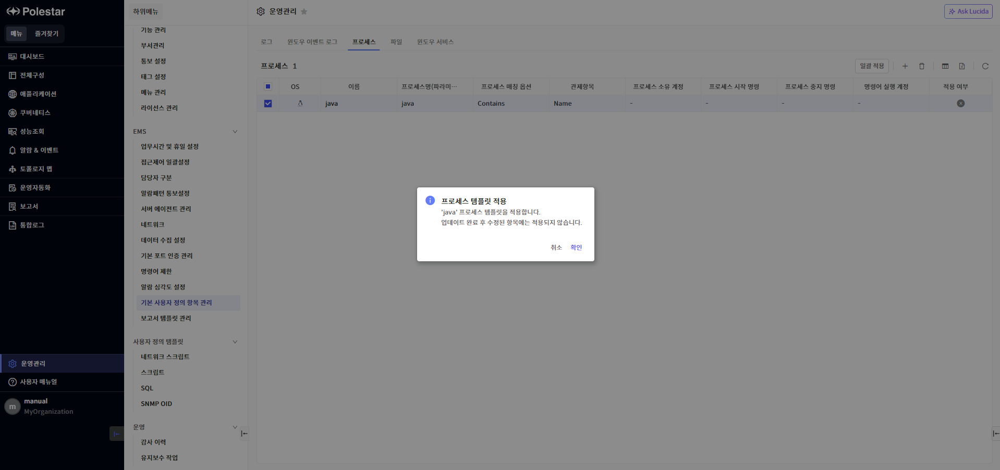

▶ \[그림15\] 프로세스 일괄적용

프로세스 일괄적용 절차

 

1.  프로세스 목록에서 일괄적용할 프로세스 정의 선택 (다중 선택 가능)

2.  프로세스 목록 우측 상단의 \[일괄 적용\] 버튼 클릭

3.  일괄적용 팝업창 내용 확인 후 \[확인\] 버튼 클릭

4.  일괄적용 시작 안내 팝업창 확인

파일

\[파일\] 탭을 선택하여 서버 등록 시 자동으로 등록되는 기본 파일 정의를 관리할 수 있습니다.

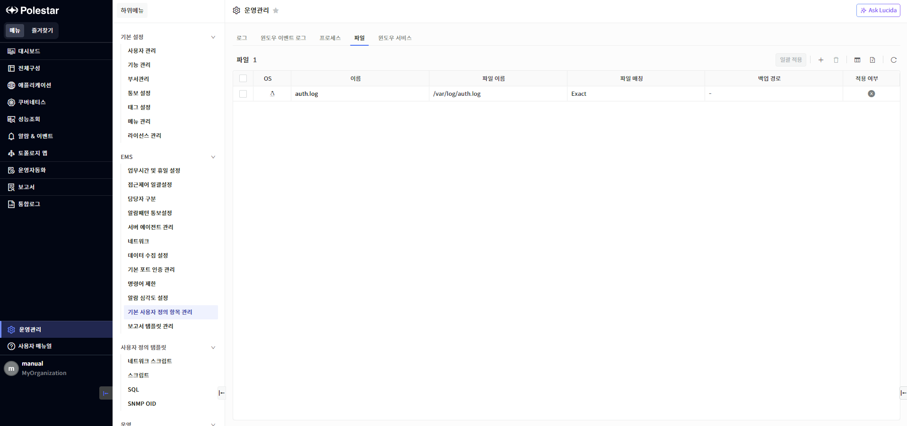

▶ \[그림16\] 파일 목록

화면 지표

<table>
<thead>
<tr class="header">
<th>OS</th>
<th>파일이 적용될 서버의 OS 종류를 표시합니다.</th>
</tr>
</thead>
<tbody>
<tr class="odd">
<td>이름</td>
<td>파일 정의 이름을 표시합니다.</td>
</tr>
<tr class="even">
<td>파일 이름</td>
<td>모니터링할 파일의 전체 경로 및 이름을 표시합니다.</td>
</tr>
<tr class="odd">
<td>파일 매칭</td>
<td>
파일 매칭 방법을 표시합니다.

(Exact: 날짜 패턴 입력시 현재 시간을 기준으로 파일을 찾음,

Recent: 날짜 패턴에 맞는 파일 중 가장 최근의 파일을 찾음)
</td>
</tr>
<tr class="even">
<td>백업 경로</td>
<td>파일의 백업 경로를 표시합니다.</td>
</tr>
<tr class="odd">
<td>적용 여부</td>
<td>서버 적용 여부를 표시합니다.</td>
</tr>
</tbody>
</table>

파일 추가

서버에서 기본적으로 관리하는 파일 정의를 등록합니다. 파일 정의 추가 시 설정하는 정보는 서버에서 사용자 정의 항목 중 파일을 등록할 때와 동일하며, ‘설정 정보 적용 여부’ 항목으로 기본 파일 적용 여부를 설정할 수 있습니다. ‘설정 정보 적용 여부’가 체크되어 있는 파일은 지정한 OS에 해당하는 서버가 등록될 때 자동으로 등록되며, 등록 직후부터 모니터링을 진행합니다.

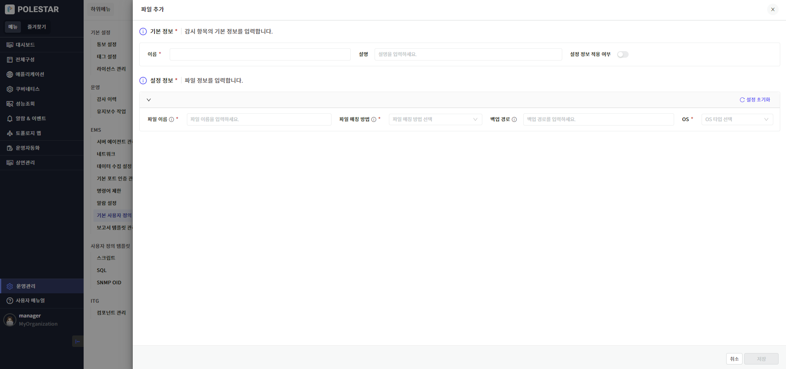

▶ \[그림17\] 파일 추가

기본 정보

| 이름          | 등록할 파일 정의 이름을 입력합니다.     |
| ----------- | ------------------------ |
| 설명          | 등록할 파일에 대한 설명을 입력합니다.    |
| 설정 정보 적용 여부 | 등록할 파일의 서버 적용 여부를 설정합니다. |

설정 정보

<table>
<thead>
<tr class="header">
<th>파일 이름</th>
<th>모니터링할 파일의 전체 경로 및 이름을 설정합니다.</th>
</tr>
</thead>
<tbody>
<tr class="odd">
<td>파일 매칭 방법</td>
<td>
파일 매칭 방법을 설정합니다.

(Exact: 날짜 패턴 입력시 현재 시간을 기준으로 파일을 찾음,

Recent: 날짜 패턴에 맞는 파일 중 가장 최근의 파일을 찾음)
</td>
</tr>
<tr class="even">
<td>백업 경로</td>
<td>파일의 백업 경로를 설정합니다.</td>
</tr>
<tr class="odd">
<td>OS</td>
<td>파일이 적용될 서버의 OS 종류를 설정합니다.</td>
</tr>
</tbody>
</table>

파일 추가 절차

 

1.  파일 목록 우측 상단의 \[추가\] 버튼 클릭

2.  추가할 파일 정보를 입력하고 \[저장\] 버튼 클릭

파일 수정

파일 목록에서 ‘이름’ 필드를 클릭하여 등록된 파일 정의를 수정할 수 있습니다. 수정된 파일 정의는 ‘설정 정보 적용 여부’가 활성화되어 있으면 ‘일괄적용’ 기능을 통해 서버에 등록되어 있는 파일에 적용됩니다. 신규 추가하는 서버에는 수정된 파일 정보가 적용됩니다.

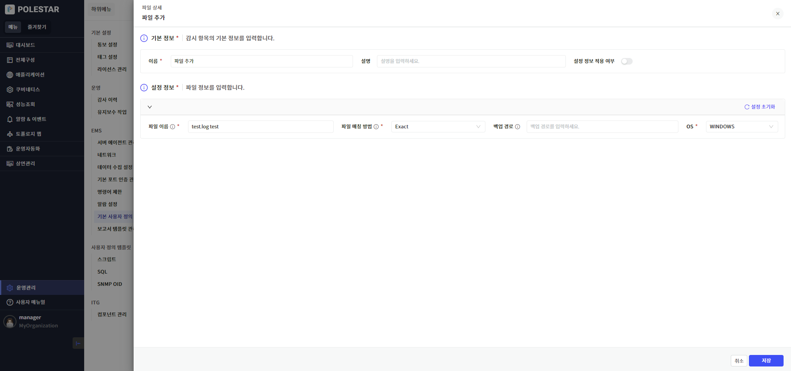

▶ \[그림18\] 파일 상세

파일 수정 절차

 

1.  파일 목록에서 수정할 파일 정보의 ‘이름’ 필드 클릭

2.  파일 정보를 수정하고 \[저장\] 버튼 클릭

파일 삭제

파일 목록에서 특정 파일 정의를 삭제할 수 있습니다. 파일 정의를 삭제하더라도 서버에 등록된 파일에는 영향을 미치지 않습니다.

▶ \[그림19\] 파일 삭제

파일 삭제 절차

 

1.  파일 목록에서 삭제할 파일 정의 선택 (다수 선택 가능)

2.  파일 목록 우측 상단의 \[삭제\] 버튼 클릭

파일 일괄적용

‘일괄적용’ 기능을 통해 선택한 파일 정의를 등록된 서버에 반영할 수 있습니다. 일괄적용 기능은 백그라운드 작업으로 진행되므로 기능 실행 후 다른 메뉴 화면으로 이동하더라도 정상적으로 적용됩니다.

일괄적용 기능은 선택한 파일 정의가 서버에 등록되어 있지 않으면 신규 파일로 등록합니다. 서버에 파일이 이미 등록되어 있고, 기본 사용자 정의 항목 관리의 파일 정의 설정이 업데이트 된 경우에는 등록되어 있는 파일이 기본 사용자 정의 항목 관리 설정으로 업데이트 됩니다. 단, 기본 사용자 정의 항목 관리의 파일 정의 설정이 업데이트 된 이후에 사용자가 서버에 등록된 파일을 직접 업데이트한 경우에는 사용자의 설정 내용이 우선시되며, 기본 사용자 정의 항목 관리의 파일 정의 설정이 적용되지 않습니다.

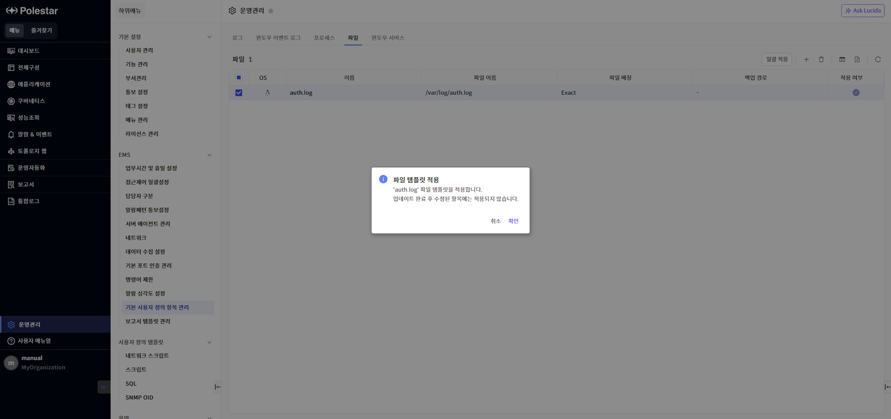

▶ \[그림20\] 파일 일괄적용

파일 일괄적용 절차

 

1.  파일 목록에서 일괄적용할 파일 정의 선택 (다중 선택 가능)

2.  파일 목록 우측 상단의 \[일괄 적용\] 버튼 클릭

3.  일괄적용 팝업창 내용 확인 후 \[확인\] 버튼 클릭

4.  일괄적용 시작 안내 팝업창 확인

윈도우 서비스

\[윈도우 서비스\] 탭을 선택하여 서버 등록 시 자동으로 등록되는 기본 윈도우 서비스 정의를 관리할 수 있습니다.

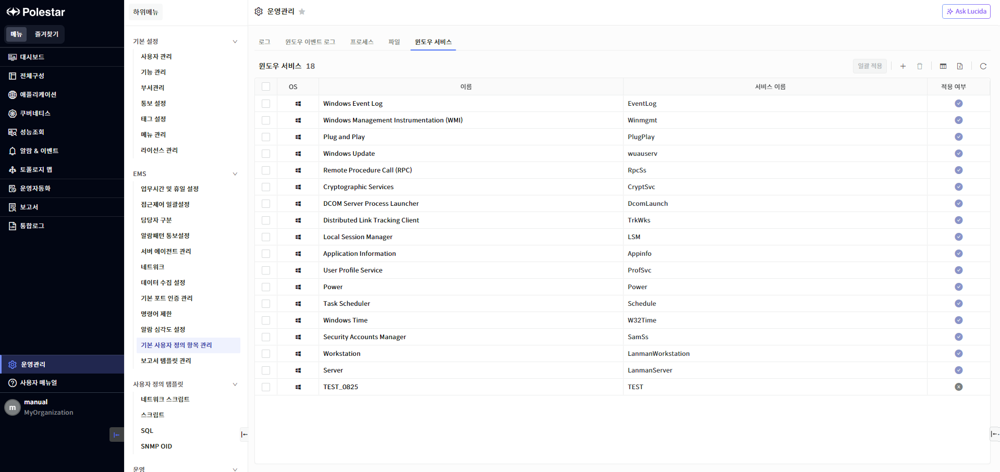

▶ \[그림21\] 윈도우 서비스 목록

화면 지표

| OS     | 윈도우 서비스가 적용될 서버의 OS 종류를 표시합니다. |
| ------ | ------------------------------ |
| 이름     | 윈도우 서비스 정의 이름을 표시합니다.          |
| 서비스 이름 | 모니터링할 윈도우 서비스의 이름을 표시합니다.      |
| 적용 여부  | 서버 적용 여부를 표시합니다.               |

윈도우 서비스 추가

서버에서 기본적으로 관리하는 윈도우 서비스 정의를 등록합니다. 윈도우 서비스 정의 추가 시 설정하는 정보는 서버에서 사용자 정의 항목 중 윈도우 서비스를 등록할 때와 동일하며, ‘설정 정보 적용 여부’ 항목으로 기본 윈도우 서비스 적용 여부를 설정할 수 있습니다. ‘설정 정보 적용 여부’가 체크되어 있는 윈도우 서비스는 윈도우 OS 서버가 등록될 때 자동으로 등록되며, 등록 직후부터 모니터링을 진행합니다.

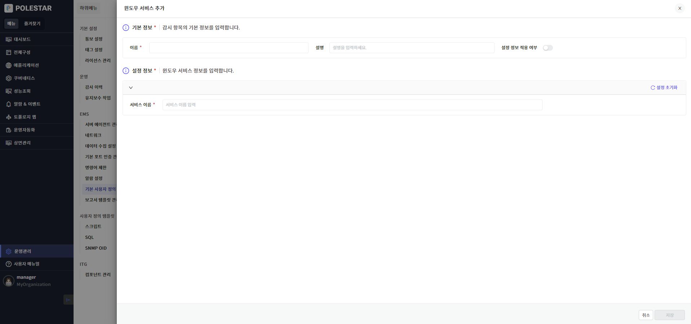

▶ \[그림22\] 윈도우 서비스 추가

기본 정보

| 이름          | 등록할 윈도우 서비스 정의 이름을 입력합니다.     |
| ----------- | ----------------------------- |
| 설명          | 등록할 윈도우 서비스에 대한 설명을 입력합니다.    |
| 설정 정보 적용 여부 | 등록할 윈도우 서비스의 서버 적용 여부를 설정합니다. |

설정 정보

|        |                          |
| ------ | ------------------------ |
| 서비스 이름 | 모니터링할 윈도우 서비스 이름을 설정합니다. |

윈도우 서비스 추가 절차

 

1.  윈도우 서비스 목록 우측 상단의 \[추가\] 버튼 클릭

2.  추가할 윈도우 서비스 정보를 입력하고 \[저장\] 버튼 클릭

윈도우 서비스 수정

윈도우 서비스 목록에서 ‘이름’ 필드를 클릭하여 등록된 윈도우 서비스 정의를 수정할 수 있습니다. 수정된 윈도우 서비스 정의는 ‘설정 정보 적용 여부’가 활성화되어 있으면 ‘일괄적용’ 기능을 통해 서버에 등록되어 있는 윈도우 서비스에 적용됩니다. 신규 추가하는 서버에는 수정된 윈도우 서비스 정보가 적용됩니다.

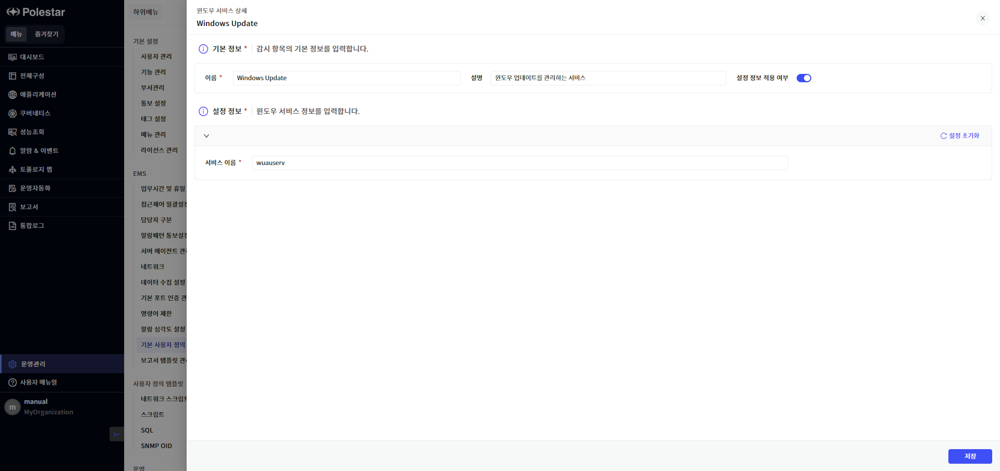

▶ \[그림23\] 윈도우 서비스 상세

윈도우 서비스 수정 절차

 

1.  윈도우 서비스 목록에서 수정할 윈도우 서비스 정보의 ‘이름’ 필드 클릭

2.  윈도우 서비스 정보를 수정하고 \[저장\] 버튼 클릭

윈도우 서비스 삭제

윈도우 서비스 목록에서 특정 윈도우 서비스 정의를 삭제할 수 있습니다. 윈도우 서비스 정의를 삭제하더라도 서버에 등록된 윈도우 서비스에는 영향을 미치지 않습니다.

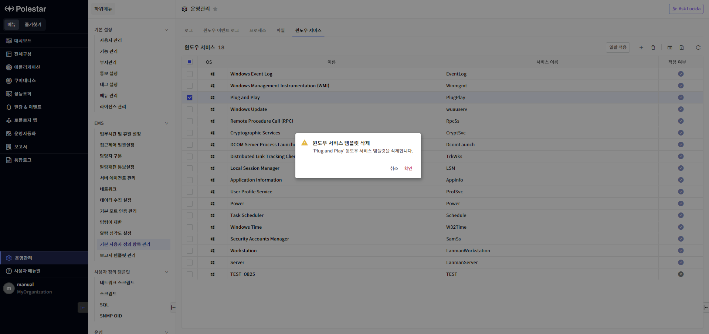

▶ \[그림24\] 윈도우 서비스 삭제

윈도우 서비스 삭제 절차

 

1.  윈도우 서비스 목록에서 삭제할 윈도우 서비스 정의 선택 (다수 선택 가능)

2.  윈도우 서비스 목록 우측 상단의 \[삭제\] 버튼 클릭

윈도우 서비스 일괄적용

‘일괄적용’ 기능을 통해 선택한 윈도우 서비스 정의를 등록된 서버에 반영할 수 있습니다. 일괄적용 기능은 백그라운드 작업으로 진행되므로 기능 실행 후 다른 메뉴 화면으로 이동하더라도 정상적으로 적용됩니다.

일괄적용 기능은 선택한 윈도우 서비스 정의가 서버에 등록되어 있지 않으면 신규 윈도우 서비스로 등록합니다. 서버에 윈도우 서비스가 이미 등록되어 있고, 기본 사용자 정의 항목 관리의 윈도우 서비스 정의 설정이 업데이트 된 경우에는 등록되어 있는 윈도우 서비스가 기본 사용자 정의 항목 관리 설정으로 업데이트 됩니다. 단, 기본 사용자 정의 항목 관리의 윈도우 서비스 정의 설정이 업데이트 된 이후에 사용자가 서버에 등록된 윈도우 서비스를 직접 업데이트한 경우에는 사용자의 설정 내용이 우선시되며, 기본 사용자 정의 항목 관리의 윈도우 서비스 정의 설정이 적용되지 않습니다.

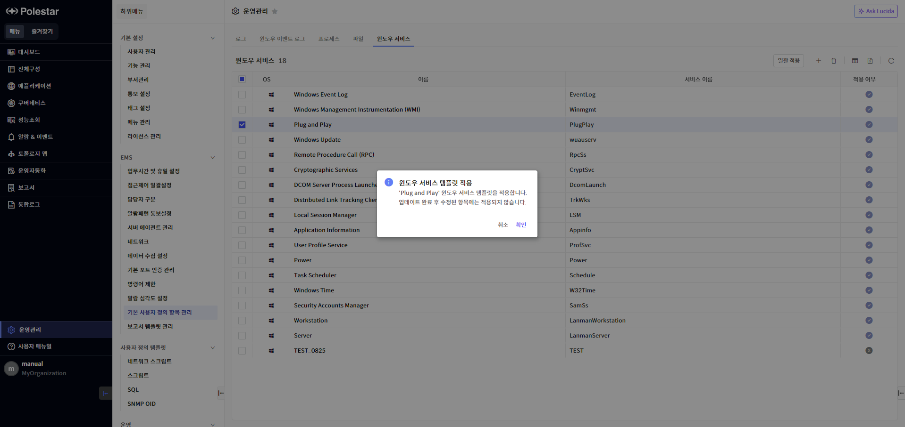

▶ \[그림25\] 윈도우 서비스 일괄적용

윈도우 서비스 일괄적용 절차

 

1.  윈도우 서비스 목록에서 일괄적용할 윈도우 서비스 정의 선택 (다중 선택 가능)

2.  윈도우 서비스 목록 우측 상단의 \[일괄 적용\] 버튼 클릭

3.  일괄적용 팝업창 내용 확인 후 \[확인\] 버튼 클릭

4.  일괄적용 시작 안내 팝업창 확인

