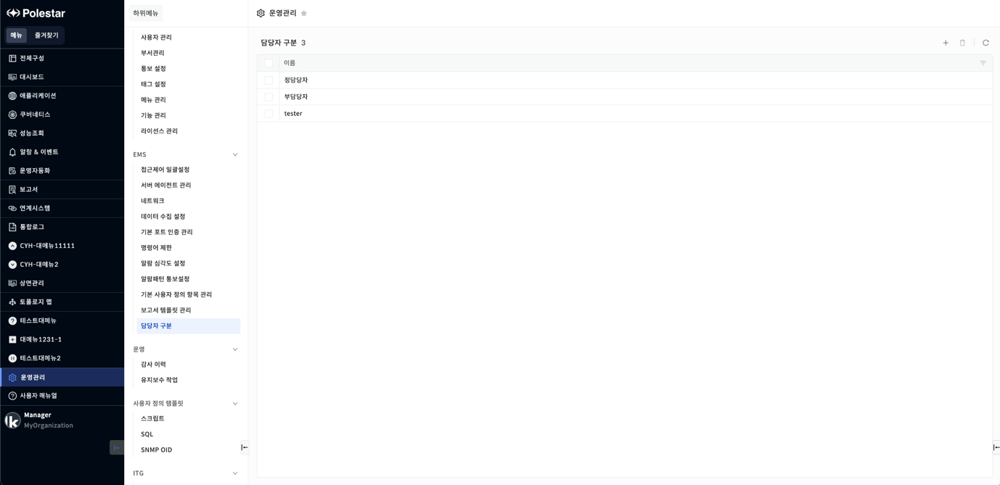
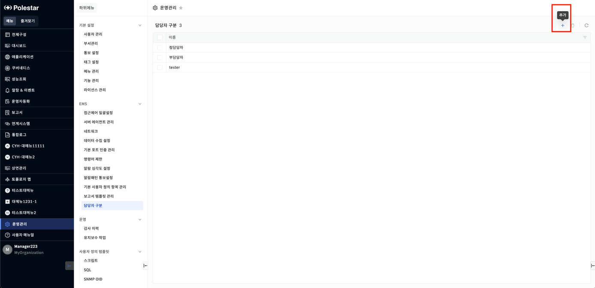
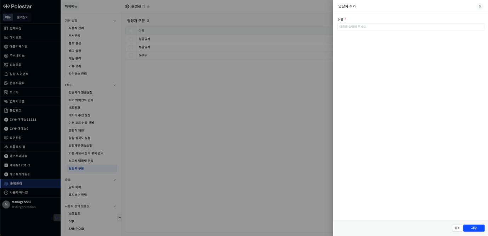
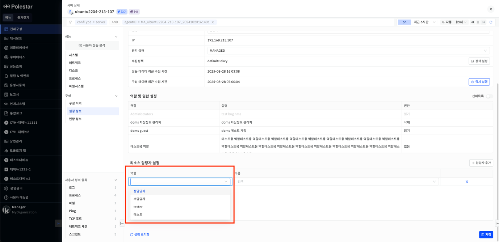
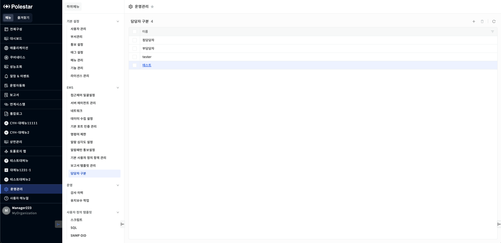
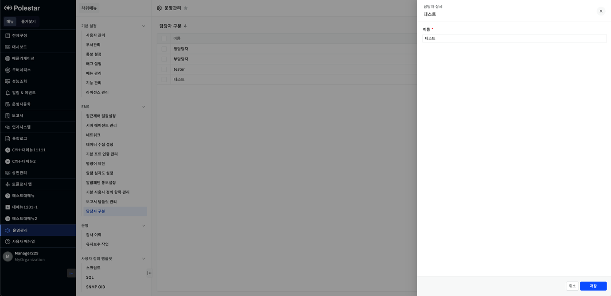
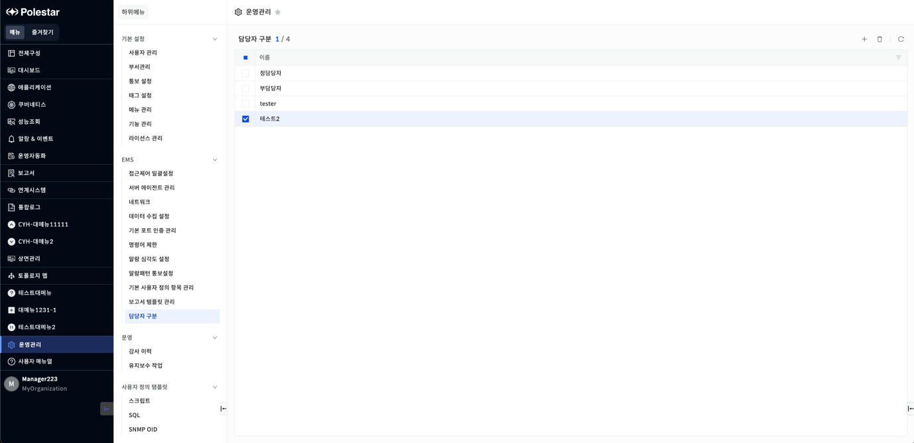
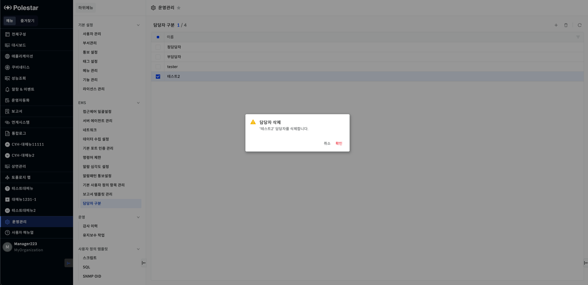

담당자 구분

\[운영관리\] \> \[EMS\] \> \[담당자 구분\]을 선택하면 담당자 타입에 대해 추가, 수정, 삭제할 수 있는 화면을 확인할 수 있습니다.

▶ \[그림1\] 담당자 구분

화면 지표

|    |                |
| -- | -------------- |
| 이름 | 담당자 이름을 확인합니다. |

담당자 추가

담당자 목록 우측 상단 \[+\] 버튼을 통해 담당자를 추가할 수 있습니다.

▶ \[그림2\] 담당자 추가 버튼

추가 화면에서 \[이름\] 항목을 입력하고 \[저장\] 버튼을 눌러 담당자를 추가할 수 있습니다.

▶ \[그림3\] 담당자 추가 화면

화면 지표

|    |                |
| -- | -------------- |
| 이름 | 담당자 이름을 설정합니다. |

추가한 담당자는 \[서버 상세\] \> \[구성\] \> \[설정 정보\] \> \[리소스 담당자 설정\] 에서 확인할 수 있습니다. \[담당자 추가\] 버튼을 클릭한 뒤, \[역할\] 항목에서 확인할 수 있습니다.

▶ \[그림4\] 담당자 추가 화면

담당자 수정

담당자 목록에서 \[이름\] 을 클릭하면 상세 화면이 열립니다. 해당 화면에서 이름을 수정할 수 있습니다.

▶ \[그림5\] 이름 항목 클릭

▶ \[그림6\] 담당자 수정 화면

담당자 삭제

담당자 목록에서 데이터를 삭제할 수 있습니다. 삭제할 데이터를 체크하고 목록 우측 상단의 \[삭제\] 버튼을 통해 삭제가 가능합니다.

▶ \[그림7\] 담당자 목록 삭제

▶ \[그림8\] 담당자 삭제 확인 창

