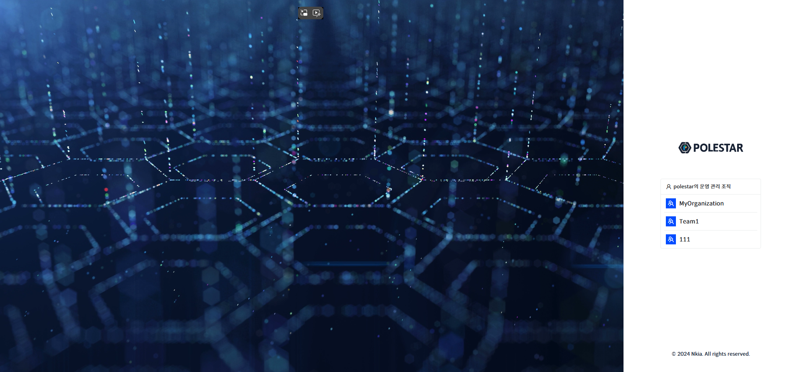
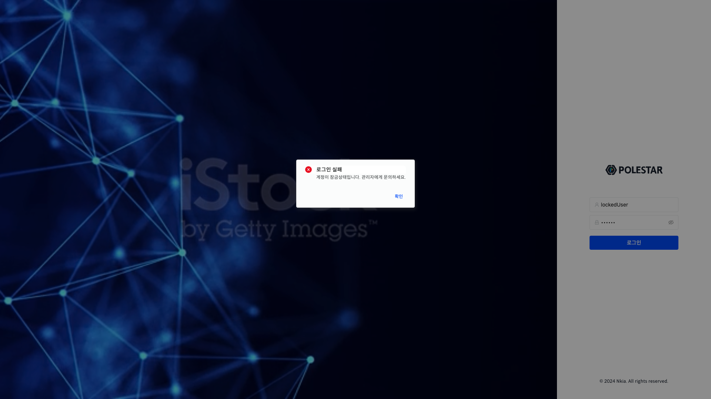
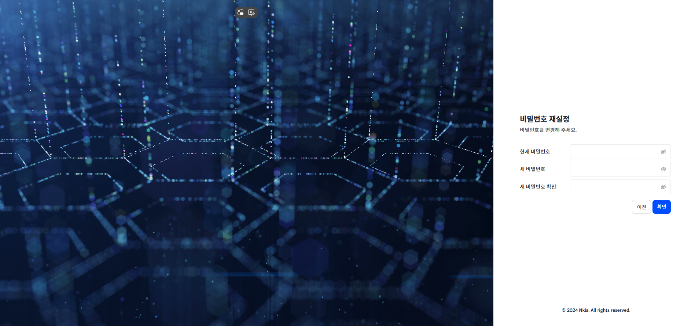

로그인

최초 페이지 진입 시 로그인을 진행합니다.

<table>
<tbody>
<tr class="odd">
<td>
노트

계정은 운영관리 메뉴의 사용자 관리 탭에서 추가를 할 수 있습니다.
</td>
</tr>
</tbody>
</table>

▶ \[그림1\] 로그인

조직 선택

정상적으로 로그인을 한 후에는 조직을 선택하여 로그인을 마칠 수 있습니다.

소속된 조직이 1개일 경우, 조직을 선택하지 않아도 자동으로 조직이 선택되어 로그인이 완료됩니다.

▶ \[그림2\] 조직 선택

로그인 실패 (계정 잠김)

잠겨 있는 계정에 로그인을 시도하면 에러가 발생합니다. 관리자에게 잠금 해제를 요청하세요.

<table>
<tbody>
<tr class="odd">
<td>
노트

계정 잠김 해제는 운영관리 메뉴의 사용자 관리 탭에서 요청한 계정의 상세 정보 드로어에서 설정이 가능합니다.
</td>
</tr>
</tbody>
</table>

▶ \[그림3\] 잠긴 계정 로그인 시도

로그인 시 비밀번호 변경

로그인시 암호 변경 설정이 되어있는 계정은 로그인을 시도하게 되면 사용할 비밀번호를 재설정하여 다시 로그인을 시도해야 합니다.

<table>
<tbody>
<tr class="odd">
<td>
노트

사용자 생성 후 첫 로그인 시도에는 비밀번호를 재설정하여야 합니다. 로그인 시 암호 변경 상태는 운영관리 메뉴 - 사용자 관리 - 계정 탭의 계정 상세정보 드로어에서 설정이 가능합니다.
</td>
</tr>
</tbody>
</table>

▶ \[그림4\] 로그인 시 비밀번호 변경

화면 지표

| 현재 비밀번호   | 로그인을 시도한 현재 비밀번호를 입력합니다.            |
| --------- | ----------------------------------- |
| 새 비밀번호    | 사용할 새로운 비밀번호를 입력합니다.                |
| 새 비밀번호 확인 | 새 비밀번호의 잘못된 입력을 방지하기 위해 한번 더 입력합니다. |

