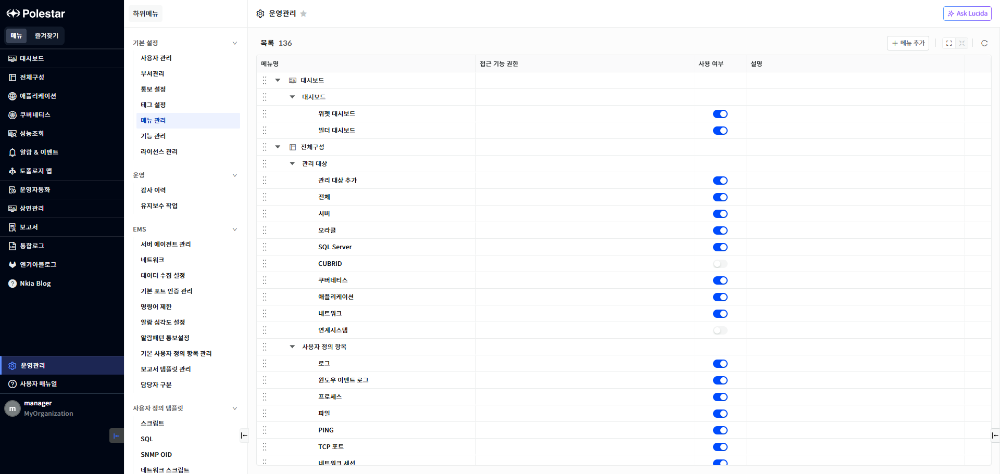
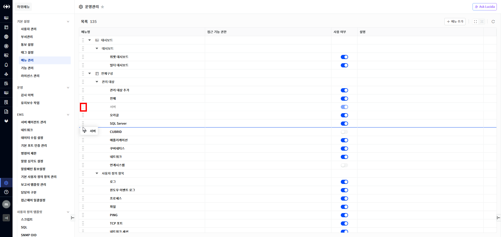
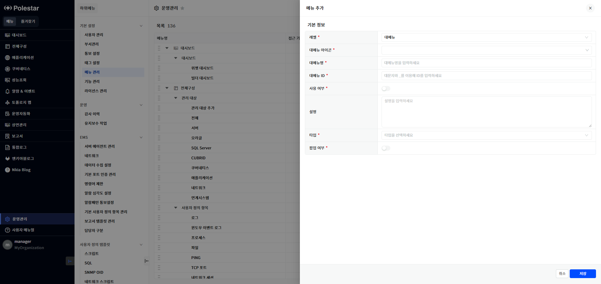
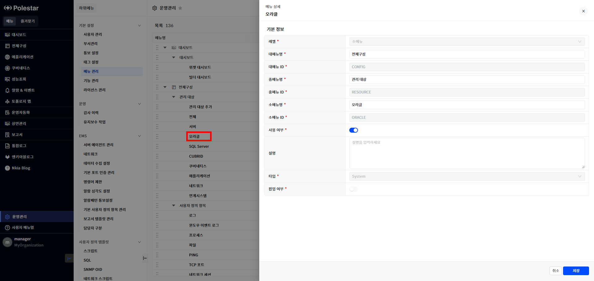
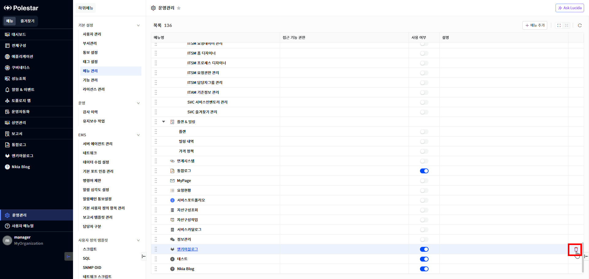

메뉴 관리

메뉴를 관리하는 기능입니다. 메뉴는 3 레벨로 관리됩니다. 레벨은 대메뉴, 중메뉴, 소메뉴로 구분되며 대메뉴는 화면 왼쪽에 나타나는 메뉴입니다. 중메뉴와 소메뉴는 대메뉴 선택 시에 나타나는 하위 메뉴입니다. 시스템이 제공하는 메뉴는 시스템 구축 시 자동으로 등록됩니다. 사용자는 메뉴명을 변경하거나 화면에 표시되는 메뉴의 순서를 변경할 수 있습니다. 메뉴 추가 기능을 사용하여 외부 URL을 신규 메뉴로 등록할 수 있습니다.

<table>
<tbody>
<tr class="odd">
<td>
노트

메뉴를 추가하면 즉시 화면에 표시되지 않고 메뉴와 관련된 기능 권한을 할당 받아야 사용자 화면에 메뉴가 표시됩니다. No-Coding 메뉴를 추가하려는 경우는 기능을 먼저 등록하고 메뉴 등록 화면에서 기능을 선택해야 합니다. 기능을 선택하지 않으면 권한 할당이 불가능하여 화면에서 해당 메뉴를 사용할 수 없습니다. 타입이 URL 인 경우는 메뉴와 관련된 기능이 자동으로 등록됩니다.
</td>
</tr>
</tbody>
</table>

▶ \[그림1\] 메뉴 관리

화면 지표

| 메뉴명      | 메뉴 이름입니다.                                    |
| -------- | -------------------------------------------- |
| 접근 기능 권한 | 메뉴를 접근하기 위해 필요한 권한 정보입니다.                    |
| 사용 여부    | 메뉴 사용 여부입니다.                                 |
| 설명       | 메뉴 설명입니다.                                    |
|          | 사용자가 수동으로 등록한 메뉴인 경우 마우스를 오버하면 삭제 버튼이 표시됩니다. |

메뉴 순서 변경

사용자는 드래그 앤 드랍으로 메뉴 순서를 변경할 수 있습니다. 메뉴명 앞 부분을 마우스로 클릭한 상태에서 위 또는 아래로 이동하면 해당 위치에 라인 색상이 변경되면서 이동할 위치를 표시합니다. 클릭을 해제하면 해당 위치로 메뉴가 이동합니다. 메뉴 이동은 같은 그룹의 같은 레벨에서 가능합니다.

▶ \[그림2\] 메뉴 순서 변경

메뉴 순서 변경 절차

1.  라인 앞을 마우스로 클릭한 상태로 유지하면서 이동할 위치로 드래그합니다.

2.  마우스 클릭한 상태를 해제하면 해당 위치로 메뉴가 이동합니다.

메뉴 추가

사용자는 메뉴에서 바로 접근할 수 없는 시스템 내의 화면으로 이동하거나 외부 URL을 오픈할 수 있는 기능을 메뉴로 추가할 수 있습니다. 현재 있는 메뉴의 하위 메뉴를 추가할 수 있고 대메뉴부터 신규로 추가할 수도 있습니다. 메뉴를 추가하는 방식은 2가지입니다. 첫번째는 대메뉴 및 중메뉴의 메뉴명에 마우스가 오버되면 \[+\] 버튼이 표시되며 선택하여 하위 메뉴를 추가할 수 있습니다. 두번째는 상단의 \[메뉴 추가\] 버튼을 클릭하여 메뉴를 추가할 수 있습니다.

▶ \[그림3\] 메뉴 추가

<table>
<tbody>
<tr class="odd">
<td>
노트

메뉴명 옆에 있는 + 버튼을 클릭하여 하위 메뉴 추가를 선택했더라도 메뉴 레벨을 변경하여 하위 메뉴 추가가 아니라 대메뉴부터 변경하여 등록할 수도 있습니다.
</td>
</tr>
</tbody>
</table>

메뉴 추가 절차

1.  상단의 메뉴 추가 버튼을 선택하거나 메뉴 목록에서 하위 메뉴 추가 버튼을 선택합니다.

2.  메뉴 정보를 입력합니다.

3.  \[저장\] 버튼을 선택하여 저장합니다.

메뉴 수정

사용자는 메뉴 이름, 설명, 사용여부를 수정할 수 있습니다.

▶ \[그림4\] 메뉴 수정

메뉴 수정 절차

1.  수정하고자 하는 메뉴의 이름을 선택합니다.

2.  메뉴 이름, 설명, 사용 여부를 수정합니다.

3.  \[저장\] 버튼을 선택하여 저장합니다

메뉴 삭제

사용자는 사용자에 의해 추가된 메뉴를 삭제할 수 있습니다. 시스템이 자동으로 생성한 메뉴는 삭제할 수 없습니다.

▶ \[그림5\] 메뉴 삭제

메뉴 삭제 절차

1.  삭제하고자 하는 메뉴의 오른쪽 컬럼에 마우스를 오버하여 삭제 버튼이 표시되게합니다.

2.  삭제 버튼을 클릭하여 삭제합니다.

