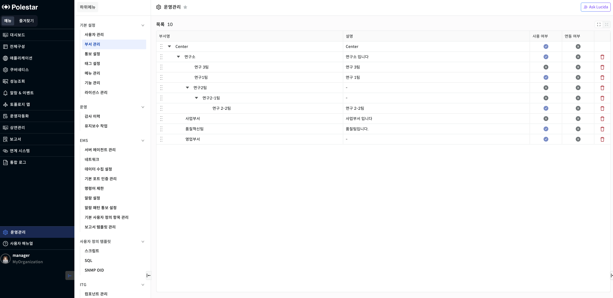
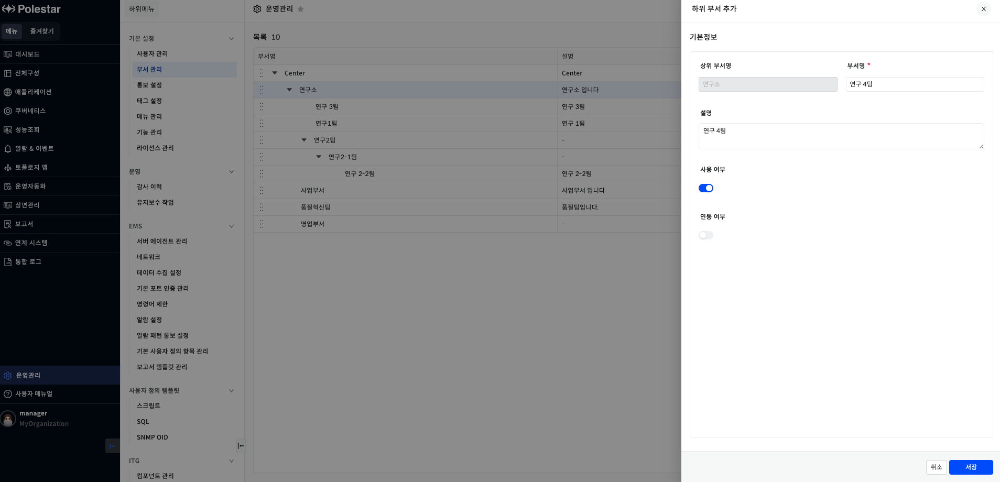
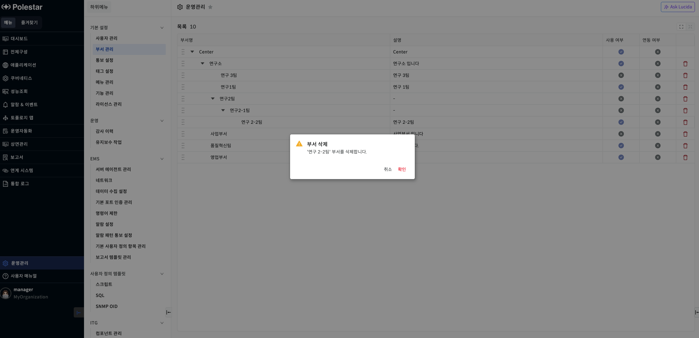
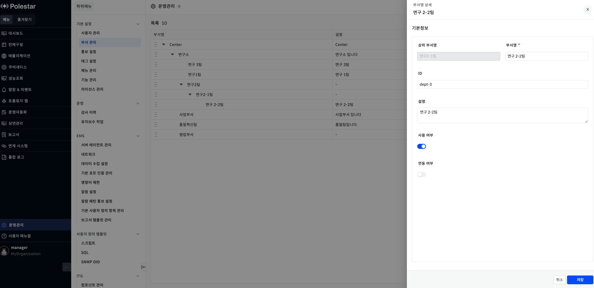
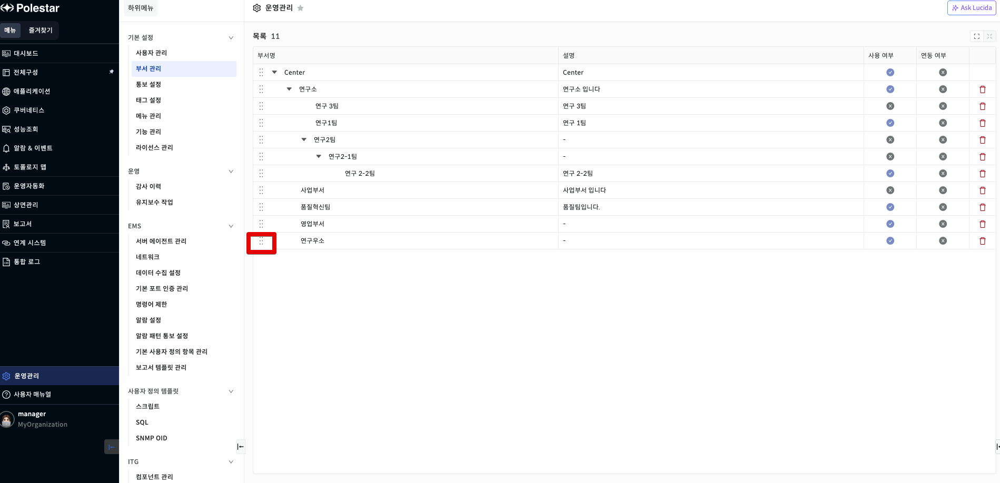

부서 관리

**부서 추가 / 수정 / 삭제할 수 있는 기능 (부서는 Hierarchy 구조 지원 함)**

▶ \[그림1\] 부서 관리 목록

화면 지표

| 부서명   | 부서의 이름을 표시합니다.                     |
| ----- | ---------------------------------- |
| 설명    | 부서의 설명을 표시합니다.                     |
| 사용 여부 | 부서의 사용여부를 표시합니다.                   |
| 연동 여부 | 외부와 부서를 연동여부를 표시합니다.               |
| 통보 대상 | 통보 대상입니다. 통보 대상 타입에 따라서 선택한 정보입니다. |

부서 관리 등록

등록하고자 하는 부서 상위의 마우스를 호버하여 추가 버튼을 눌러 부서를 등록합니다.

▶ \[그림2\] 부서 관리 등록

화면 지표

<table>
<thead>
<tr class="header">
<th>상위 부서명</th>
<th>상위 부서를 표시합니다.</th>
</tr>
</thead>
<tbody>
<tr class="odd">
<td>부서명</td>
<td>사용할 부서명을 입력할 수 있습니다.</td>
</tr>
<tr class="even">
<td>설명</td>
<td>부서의 설명을 작성할 수 있습니다.</td>
</tr>
<tr class="odd">
<td>사용 여부</td>
<td>
사용 여부입니다.

부서의 사용여부를 체크합니다.
</td>
</tr>
<tr class="even">
<td>연동 여부</td>
<td>
부서를 외부와 연동하고 있는 여부입니다.

사용자가 수정할 수 없습니다.
</td>
</tr>
</tbody>
</table>

부서 관리 부서 등록 절차

1.  부서를 등록하고자 하는 상위부서에 마우스를 호버합니다.

2.  하위 부서 추가라는 툴팁과 함께 나오는 추가버튼을 클릭합니다.

3.  부서정보를 입력하고 저장 버튼을 클릭합니다.

부서 관리 수정

부서 정보를 수정할 수 있습니다.

▶ \[그림3\] 부서 관리 수정

부서 관리 수정 절차

1.  수정하고자 하는 부서명을 클릭합니다.

2.  우측 드로워에서 부서 정보를 수정하고 저장버튼을 클릭합니다.

부서 관리 삭제

부서를 삭제할 수 있습니다.

▶ \[그림4\] 부서 관리 삭제

부서 관리 삭제 절차

1.  삭제하고자 하는 부서의 삭제 버튼을 클릭합니다.

2.  확인창에서 삭제하고자 하는 부서가 맞는지 확인 후 확인 클릭

부서관리 상세 보기

부서의 상세 정보를 확인할 수 있습니다.

▶ \[그림5\] 부서 상세 화면

화면 지표

<table>
<thead>
<tr class="header">
<th>상위 부서명</th>
<th>상위 부서를 표시합니다.</th>
</tr>
</thead>
<tbody>
<tr class="odd">
<td>부서명</td>
<td>사용할 부서명을 입력할 수 있습니다.</td>
</tr>
<tr class="even">
<td>ID</td>
<td>외부와 연동할 부서 ID입니다.</td>
</tr>
<tr class="odd">
<td>설명</td>
<td>부서의 설명을 작성할 수 있습니다.</td>
</tr>
<tr class="even">
<td>사용 여부</td>
<td>
사용 여부입니다.

부서의 사용여부를 체크합니다.
</td>
</tr>
<tr class="odd">
<td>연동 여부</td>
<td>
부서를 외부와 연동하고 있는 여부입니다.

사용자가 수정할 수 없습니다.
</td>
</tr>
</tbody>
</table>

부서 관리 부서 순서 변경

부서를 이동할 수 있습니다.

<table>
<tbody>
<tr class="odd">
<td>
노트

부서 순서 이동은 같은 상위 부서내에서 가능합니다.

드래그앤 드롭으로 순서를 이동하고자하는 곳으로 부서를 이동할 수 있습니다.
</td>
</tr>
</tbody>
</table>

▶ \[그림6\] 부서 목록

