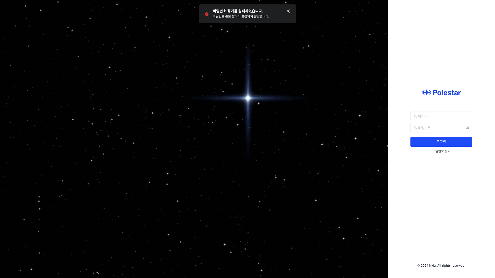
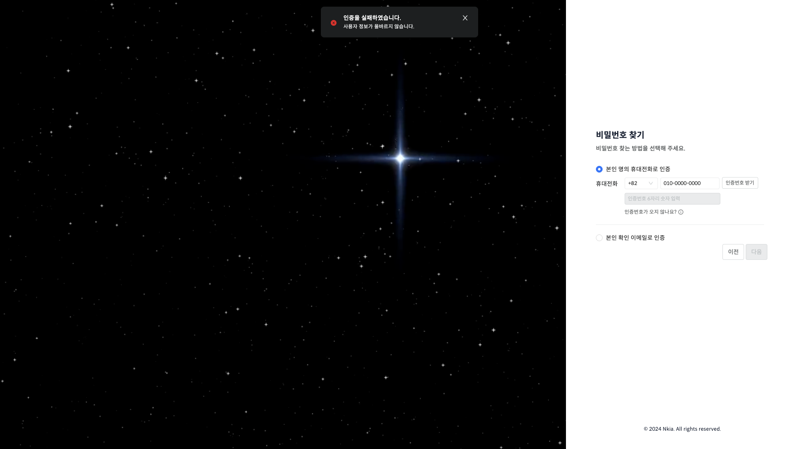
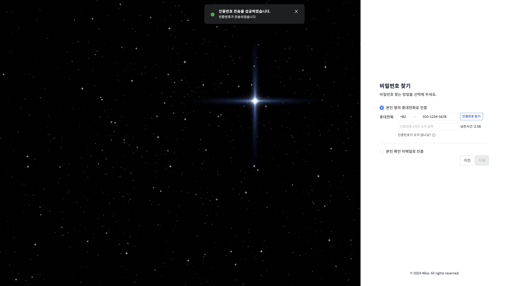
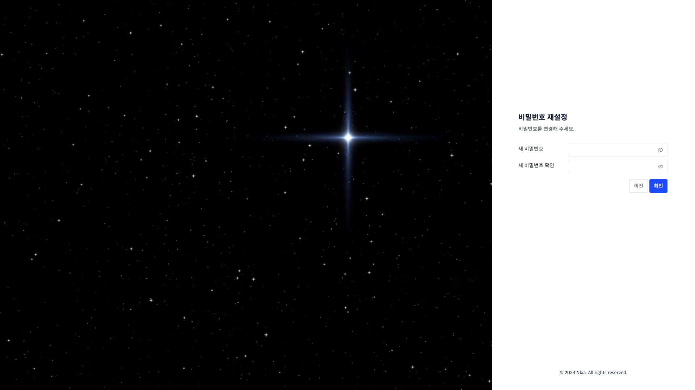
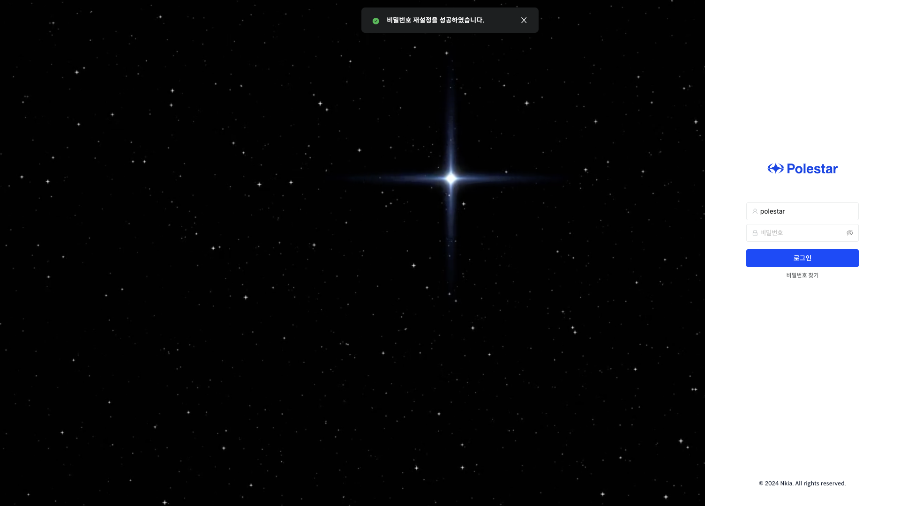

비밀번호찾기

로그인 버튼 하단의 비밀번호 찾기 버튼을 눌러 비밀번호를 찾을 수 있습니다.

그림 1 비밀번호찾기

<table>
<tbody>
<tr class="odd">
<td>
노트

비밀번호 찾기는 SMS, EMAIL를 통한 방법이 있습니다.

먼저 관리자 계정으로 로그인하여 메일 서버 혹은 SMS통보 설정을 진행해야 비밀번호 찾기가 가능합니다.
</td>
</tr>
</tbody>
</table>

그림 2 비밀번호 찾기 실패

비밀번호 찾기 실패

SMS 통보 설정과 메일서버 설정이 되어 있지 않으면 비밀번호 찾기 버튼을 눌렀을 때, 에러 메시지가 표시되며 비밀번호 찾기를 실패합니다.

그림 3 비밀번호 찾기-아이디 입력

비밀번호 찾기-아이디 입력

비밀번호를 찾을 아이디를 입력하고 다음 버튼을 클릭합니다.

그림 4 비밀번호 찾기-인증 페이지

비밀번호 찾기-인증 페이지

활성화되어있는 방식을 선택 후 인증합니다.

<table>
<tbody>
<tr class="odd">
<td>
노트

이전에 입력한 아이디에 등록되어 있는 회원 정보를 입력하여야 인증받을 수 있습니다.

회원 정보에 등록되지 않은 정보를 입력 시에, 에러 메시지가 표시됩니다.
</td>
</tr>
</tbody>
</table>

그림 5 비밀번호 찾기-인증 실패

비밀번호 찾기-인증 실패

회원 정보에 등록되지 않은 정보로 인증 시도 시, 실패하게 됩니다.

그림 6 비밀번호 찾기-인증 성공

비밀번호 찾기-인증 성공

회원 정보에 등록된 번호로 인증 시도 시, 인증번호가 전송되고, 제한시간 내에 인증번호를 입력해야 합니다.

그림 7 비밀번호 찾기-비밀번호 재설정

비밀번호 찾기-비밀번호 재설정

인증이 완료되면, 새로운 비밀번호를 설정할 수 있습니다.

그림 8 비밀번호 찾기-비밀번호 재설정 완료

비밀번호 찾기-비밀번호 재설정 완료

비밀번호를 재설정한 후엔 다시 로그인 페이지로 이동하며 새로운 비밀번호로 로그인을 시도할 수 있습니다.

