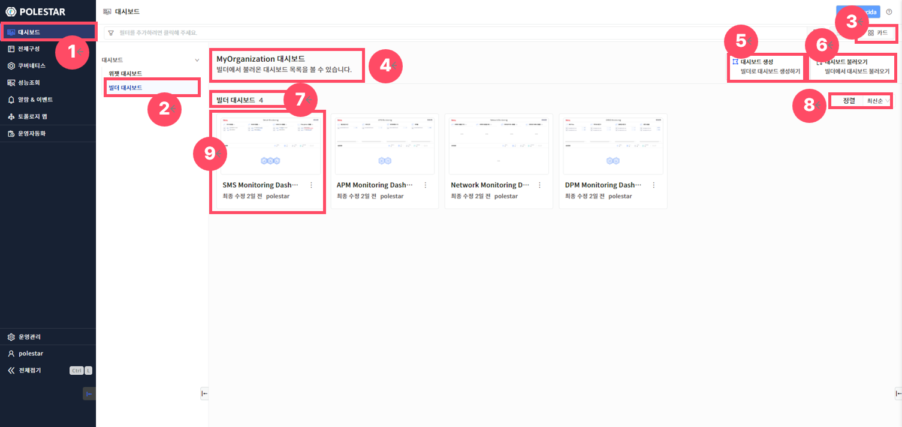
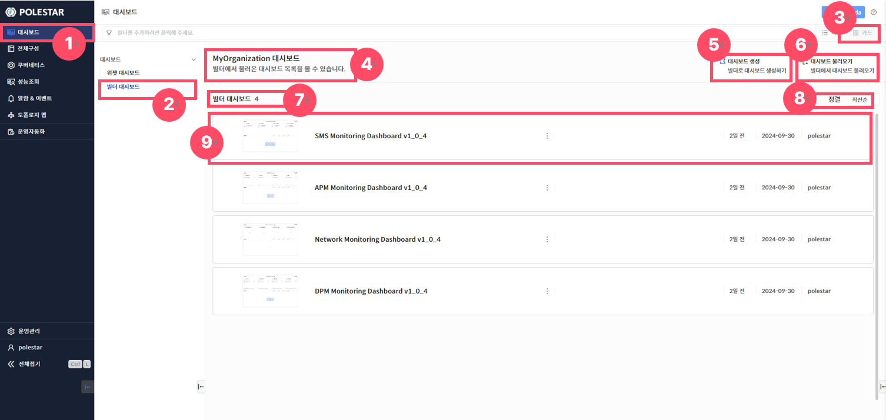
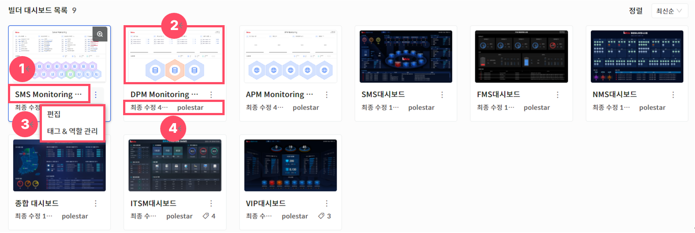
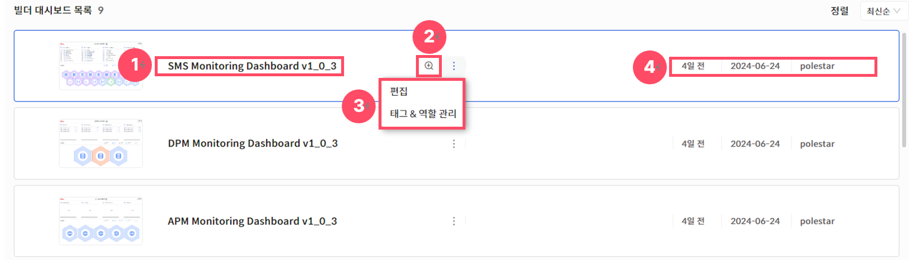

빌더 대시보드 목록

메인 메뉴의 대시보드 선택 후 빌더 대시보드를 선택하면 “대시보드 빌더”를 통해 제작된 대시보드 목록을 확인할 수 있습니다.

대시보드 목록은 썸네일 형을 기본으로 제공하며 목록형을 선택할 수 있으며 각 대시보드 화면 클릭 시 선택된 대시보드 화면이 팝업으로 생성됩니다.

SMS, NMS, DPM 등 POLESTAR 도입 모듈에 따라 기본적으로 탑재된 대시보드를 제공하며 추가 대시보드 라이선스에 도입에 따라 제작된 대시보드도 목록에 포함하여 모니터링할 수 있습니다.

<table>
<tbody>
<tr class="odd">
<td>
노트

사전에 제작된 대시보드를 “대시보드 불러오기”를 통해 활성화 체크를 해야만 빌더 대시보드 목록에 출력됩니다.
</td>
</tr>
</tbody>
</table>

> ▶ \[그림1\] 대시보드 불러오기 (썸네일 형)

> ▶ \[그림2\] 대시보드 불러오기 (목록형)
> 
> 상세 정보

<table>
<thead>
<tr class="header">
<th>1. 메인 메뉴 선택</th>
<th>메인 메뉴에서 대시보드를 선택하면 서브메뉴를 선택할 수 있습니다.</th>
</tr>
</thead>
<tbody>
<tr class="odd">
<td>2. 서브메뉴 선택</td>
<td>세부메뉴에서 “빌더 대시보드”를 선택하면 대시보드 목록을 확인할 수 있습니다.</td>
</tr>
<tr class="even">
<td>3. 목록보기 선택</td>
<td>
대시보드 목록을 목록형 또는 썸네일 형 중 선택하여 불러올 수 있습니다.

<table>
<thead>
<tr class="header">
<th>: 목록형</th>
</tr>
</thead>
<tbody>
<tr class="odd">
<td>: 썸네일 형</td>
</tr>
</tbody>
</table></td>
</tr>
<tr class="odd">
<td>4. 조직정보</td>
<td>로그인 시 선택한 사용자의 조직명을 제공합니다. (로그인 시 소속된 조직이 1개일 경우, 조직을 선택하지 않아도 자동으로 조직이 선택되어 해당 조직명을 제공합니다.)</td>
</tr>
<tr class="even">
<td>5. 대시보드 생성</td>
<td>
대시보드를 생성(제작)할 수 있는 대시보드 빌더가 새창으로 제공됩니다. (대시보드 별도 라이선스 도입 시 제공됩니다.)

* 계정에 부여된 권한에 따라 해당 “대시보드 생성” 버튼이 화면에서 미 출력 될 수 있습니다.
</td>
</tr>
<tr class="odd">
<td>6. 대시보드 불러오기</td>
<td>
대시보드 빌더에서 제작된 모든 대시보드를 설정을 통해 불러올 수 있습니다.

* 계정에 부여된 권한에 따라 해당 “대시보드 불러오기” 버튼이 화면에서 미 출력 될 수 있습니다.
</td>
</tr>
<tr class="even">
<td>7. 대시보드 목록</td>
<td>현재 불러온 대시보드 목록 수를 제공합니다.</td>
</tr>
<tr class="odd">
<td>8. 정렬</td>
<td>
대시보드 목록을 최신순, 과거순, 이름순으로 정렬합니다.

최신순 : 대시보드 배포일을 기준으로 최신 배포기준으로 정렬

과거순 : 대시보드 배포일을 기준으로 과거 배포기준으로 정렬

이름순 : 대시보드명 알파벳(A-Z), 한글 명(ㄱ-ㅎ) 순으로 정렬
</td>
</tr>
<tr class="even">
<td>9. 대시보드 세부정보</td>
<td>각 대시보드의 대시보드명, 배포시간, 등록자에 대한 정보를 제공합니다.</td>
</tr>
</tbody>
</table>

대시보드 모니터링 및 상세 목록

각 대시보드 목록 상세정보를 참조하여 모니터링 할 대시보드를 클릭해서 대시보드를 실행할 수 있습니다.

> ▶ \[그림3\] 대시보드 목록 상세정보 (썸네일 형)

> ▶ \[그림4\] 대시보드 목록 상세정보 (목록형)
> 
> 상세 정보

<table>
<thead>
<tr class="header">
<th>1. 대시보드명</th>
<th>대시보드명을 확인할 수 있습니다.</th>
</tr>
</thead>
<tbody>
<tr class="odd">
<td>2. 미리보기</td>
<td>마우스 호버시 돋보기 아이콘이 제공되며 선택된 대시보드의 썸네일 화면을 확대하여 볼 수 있습니다.</td>
</tr>
<tr class="even">
<td>3. 편집/태그관리</td>
<td>
마우스 호버시 편집 및 태그관리 화면 바로가기 기능을 제공합니다

편집 : 대시보드 편집화면(빌더)으로 이동

태그관리 : 대시보드 태그&amp;역할관리 화면 드로우 생성

* 계정에 부여된 권한에 따라 해당 “편집”, “태그&amp;역할관리” 버튼이 화면에서 미 출력 될 수 있습니다.
</td>
</tr>
<tr class="odd">
<td>4. 대시보드 세부정보</td>
<td>해당 대시보드의 배포일, 등록일자, 등록자에 대한 정보를 제공합니다.</td>
</tr>
</tbody>
</table>

<table>
<tbody>
<tr class="odd">
<td>
주의

주의 : 도입 모듈에 따라 기본으로 제공되는 탑재 대시보드는 커스터마이징이 불가능합니다.
</td>
</tr>
</tbody>
</table>

