사용자 관리

운영관리를 선택하면 사용자 관리 화면을 확인할 수 있습니다.

사용자 관리 화면은 \[계정\], \[그룹\], \[역할\] 총 3개의 탭으로 구성되어 있습니다.

계정

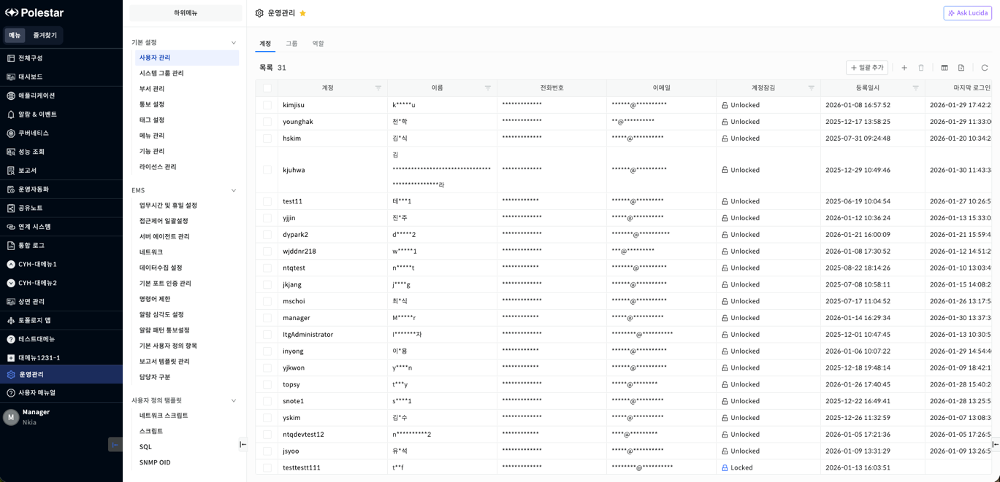

▶ \[그림1\] 계정 목록

화면 지표

<table>
<thead>
<tr class="header">
<th>계정</th>
<th>사용자의 계정을 표시합니다.</th>
</tr>
</thead>
<tbody>
<tr class="odd">
<td>이름</td>
<td>사용자의 이름을 표시합니다.</td>
</tr>
<tr class="even">
<td>전화번호</td>
<td>사용자의 전화번호를 표시합니다.</td>
</tr>
<tr class="odd">
<td>이메일</td>
<td>사용자의 이메일을 표시합니다.</td>
</tr>
<tr class="even">
<td>계정잠김</td>
<td>
사용자의 계정잠김 여부를 아이콘으로 표시합니다. 
계정이 잠긴 상태면 로그인이 불가합니다.

<table>
<thead>
<tr class="header">
<th></th>
<th>: 계정이 잠기지 않은 상태 표시 (Unlocked)</th>
</tr>
</thead>
<tbody>
<tr class="odd">
<td></td>
<td>: 계정이 잠긴 상태 표시 (Locked)</td>
</tr>
</tbody>
</table></td>
</tr>
<tr class="odd">
<td>등록일시</td>
<td>사용자의 계정이 생성된 일시를 표시합니다.</td>
</tr>
<tr class="even">
<td>마지막 로그인</td>
<td>사용자가 마지막 로그인한 일시를 표시합니다.</td>
</tr>
</tbody>
</table>

계정 등록

사용자의 계정을 등록할 수 있습니다.

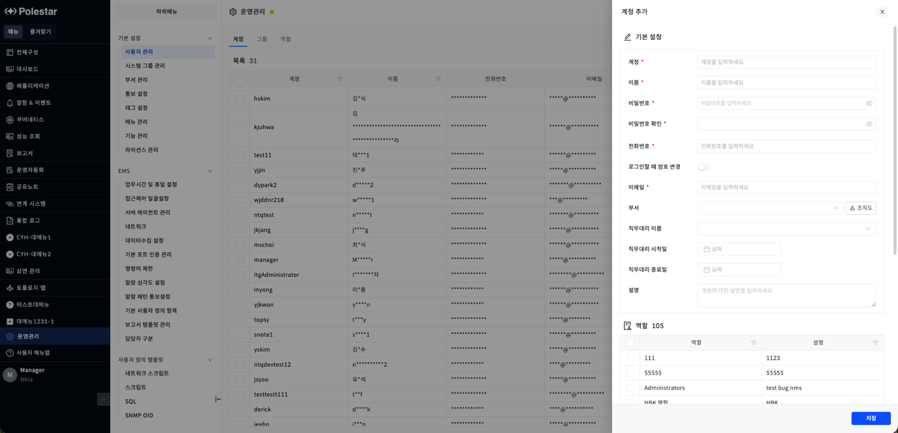

▶ \[그림3\] 계정 등록

화면 지표

<table>
<thead>
<tr class="header">
<th>계정</th>
<th>
계정을 입력합니다.

이미 사용중인 계정은 등록되지 않기 때문에 새로운 사용자의 계정을 입력합니다.
</th>
</tr>
</thead>
<tbody>
<tr class="odd">
<td>이름</td>
<td>사용자의 이름을 입력합니다.</td>
</tr>
<tr class="even">
<td>비밀번호</td>
<td>
비밀번호를 입력합니다.

작성규칙 : 8 ~ 20자리의 영문, 대소문자, 숫자, 특수문자만 입력
</td>
</tr>
<tr class="odd">
<td>비밀번호 확인</td>
<td>입력한 비밀번호와 동일한 비밀번호를 입력합니다.</td>
</tr>
<tr class="even">
<td>전화번호</td>
<td>사용자의 전화번호를 입력합니다.</td>
</tr>
<tr class="odd">
<td>로그인할 때 암호 변경</td>
<td>로그인할 때 암호 변경 여부를 선택합니다.</td>
</tr>
<tr class="even">
<td>이메일</td>
<td>사용자의 이메일을 입력합니다.</td>
</tr>
<tr class="odd">
<td>부서</td>
<td>
사용자의 부서 정보를 선택합니다. 
부서 목록에서 사용여부가 참인 부서만 선택 가능합니다.

<table>
<tbody>
<tr class="odd">
<td>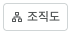</td>
<td>: 해당 버튼을 통해 부서를 선택 가능합니다.</td>
</tr>
</tbody>
</table></td>
</tr>
<tr class="even">
<td>직무대리 이름</td>
<td>직무대리를 설정할 사용자를 선택합니다.</td>
</tr>
<tr class="odd">
<td>직무대리 시작일</td>
<td>직무대리 시작일을 지정합니다.</td>
</tr>
<tr class="even">
<td>직무대리 종료일</td>
<td>직무대리 종료일을 지정합니다.</td>
</tr>
<tr class="odd">
<td>설명</td>
<td>계정에 대한 설명을 입력합니다.</td>
</tr>
<tr class="even">
<td>역할</td>
<td>
사용자의 역할을 선택합니다.

역할은 최소 한 개를 선택해야 합니다.
</td>
</tr>
<tr class="odd">
<td>그룹</td>
<td>사용자의 그룹을 선택합니다.</td>
</tr>
</tbody>
</table>

계정 등록 절차

1.  테이블 우측 상단의 (+) 아이콘 클릭

2.  기본 설정 항목 입력

3.  역할/그룹 선택 (역할 최소 한 개 이상 선택)

4.  \[저장\] 버튼 클릭

계정 수정

사용자의 계정을 수정할 수 있습니다.

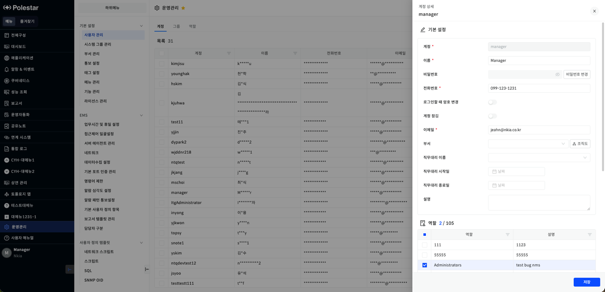

▶ \[그림4\] 계정 수정

화면 지표

<table>
<thead>
<tr class="header">
<th>계정</th>
<th>
목록에서 선택한 사용자의 계정이 표시됩니다.

수정 시에는 비활성화 되어 표시됩니다.
</th>
</tr>
</thead>
<tbody>
<tr class="odd">
<td>이름</td>
<td>
선택한 사용자의 이름이 표시됩니다.

수정할 사용자의 이름을 입력할 수 있습니다.
</td>
</tr>
<tr class="even">
<td>비밀번호</td>
<td>
새로운 비밀번호로 변경할 수 있습니다.

작성규칙 : 8 ~ 20자리의 영문, 대소문자, 숫자, 특수문자만 입력
</td>
</tr>
<tr class="odd">
<td>전화번호</td>
<td>사용자의 전화번호를 입력합니다.</td>
</tr>
<tr class="even">
<td>로그인할 때 암호 변경</td>
<td>로그인할 때 암호 변경 여부를 선택합니다.</td>
</tr>
<tr class="odd">
<td>계정 잠김</td>
<td>
계정 잠김 여부를 선택합니다.

계정 잠김을 설정하면 로그인이 불가합니다. (관리자(admin) 계정만 설정 가능)
</td>
</tr>
<tr class="even">
<td>이메일</td>
<td>수정할 사용자의 이메일을 입력합니다.</td>
</tr>
<tr class="odd">
<td>부서</td>
<td>수정할 사용자의 부서 정보를 선택합니다.</td>
</tr>
<tr class="even">
<td>직무대리 이름</td>
<td>직무대리를 설정할 사용자를 선택합니다.</td>
</tr>
<tr class="odd">
<td>직무대리 시작일</td>
<td>직무대리 시작일을 지정합니다.</td>
</tr>
<tr class="even">
<td>직무대리 종료일</td>
<td>직무대리 종료일을 지정합니다.</td>
</tr>
<tr class="odd">
<td>설명</td>
<td>계정의 설명을 입력합니다.</td>
</tr>
</tbody>
</table>

계정 수정 절차

1.  테이블에서 수정할 계정 클릭

2.  기본 설정 항목 입력

3.  \[비밀번호 변경\] 버튼을 클릭해 신규 비밀번호를 입력

4.  \[비밀번호 변경\] 버튼을 클릭해 비밀번호 변경

5.  역할/그룹 선택

6.  \[저장\] 버튼 클릭

계정 삭제

사용자의 계정을 삭제할 수 있습니다.

<table>
<tbody>
<tr class="odd">
<td>
주의

관리자나 현재 로그인한 사용자는 삭제가 불가능 합니다.
</td>
</tr>
</tbody>
</table>

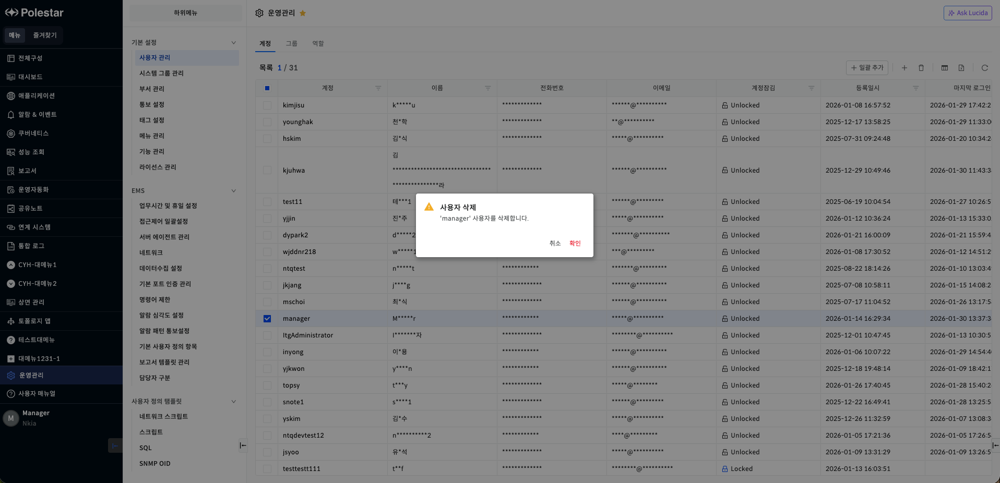

▶ \[그림5\] 계정 삭제

계정 삭제 절차

1.  삭제하고자 하는 계정 선택 (다중 선택 가능)

2.  테이블 우측 상단의 \[삭제\] 아이콘 클릭

3.  메시지창에서 \[확인\] 클릭

계정 일괄 등록

사용자의 계정을 일괄 등록할 수 있습니다.

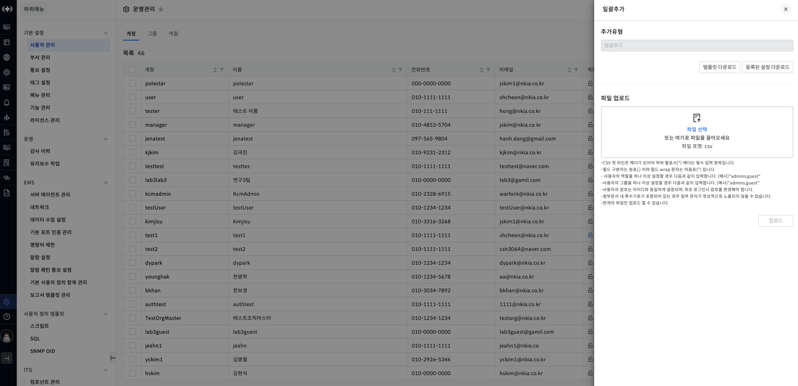

▶ 사용자 일괄 등록

화면 지표

| 템플릿 다운로드    | 일괄 등록 템플릿을 다운로드합니다.        |
| ----------- | -------------------------- |
| 등록된 설정 다운로드 | 등록된 데이터를 다운로드합니다.          |
| 파일 업로드      | 일괄 등록하기 위한 csv 파일을 업로드합니다. |

사용자 일괄 등록 절차

1.  파일 업로드

2.  업로드 설정 목록에서 결함 확인

3.  결함이 없으면 저장 버튼 클릭

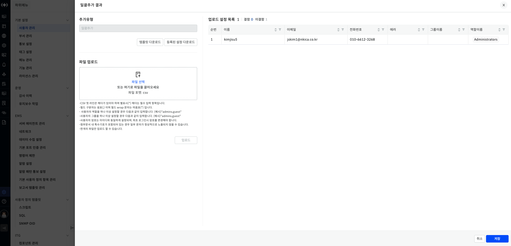

▶ 사용자 일괄 등록

그룹

선택된 계정을 지정된 이름으로 그룹화할 수 있습니다.

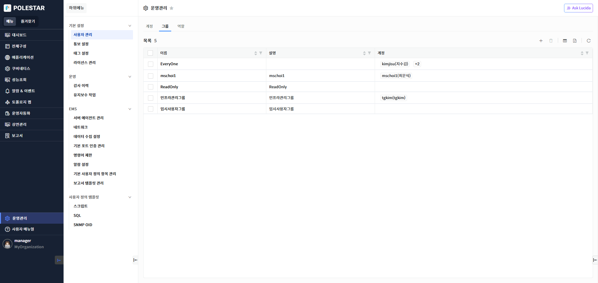

▶ \[그림6\] 그룹 목록

화면 지표

<table>
<thead>
<tr class="header">
<th>이름</th>
<th>그룹의 이름을 표시합니다.</th>
</tr>
</thead>
<tbody>
<tr class="odd">
<td>설명</td>
<td>그룹에 대한 설명을 표시합니다.</td>
</tr>
<tr class="even">
<td>계정</td>
<td>
그룹에 포함된 계정을 표시합니다.

계정 태그 중 [숫자 태그]를 누르면 전체 계정을 확인하거나, 계정을 검색할 수 있는 팝업창이 나타납니다.
</td>
</tr>
</tbody>
</table>

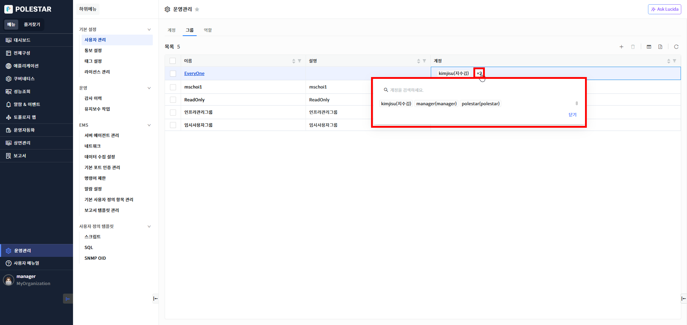

▶ \[그림7\] 계정 검색 팝업 창

그룹 추가

그룹을 추가할 수 있습니다.

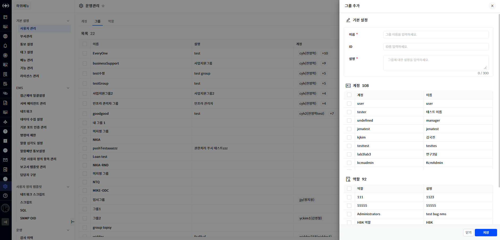

▶ \[그림8\] 그룹 추가

화면 지표

<table>
<thead>
<tr class="header">
<th>이름</th>
<th>
추가할 그룹의 이름을 입력합니다.

이미 사용중인 이름은 추가되지 않기 때문에 새로운 이름을 입력합니다.

작성규칙 : 1 ~ 10자리의 문자, 숫자, 특수문자만 입력
</th>
</tr>
</thead>
<tbody>
<tr class="odd">
<td>ID</td>
<td>그룹 ID를 입력합니다.</td>
</tr>
<tr class="even">
<td>설명</td>
<td>
그룹에 대한 설명을 입력합니다.

작성규칙 : 최대 300자
</td>
</tr>
<tr class="odd">
<td>계정</td>
<td>그룹에 포함할 계정을 선택합니다.</td>
</tr>
<tr class="even">
<td>역할</td>
<td>그룹에 포함할 계정의 역할을 선택합니다.</td>
</tr>
</tbody>
</table>

그룹 추가 절차

1.  테이블 우측 상단의 (+) 아이콘 클릭

2.  기본 설정 항목 입력

3.  계정/역할 선택

4.  \[저장\] 버튼 클릭

그룹 수정

그룹을 수정할 수 있습니다.

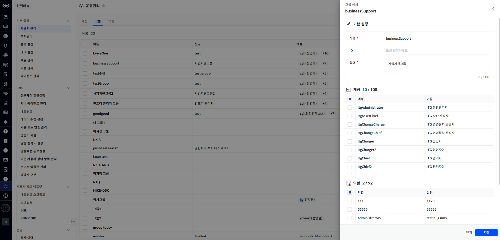

▶ \[그림9\] 그룹 수정

화면 지표

<table>
<thead>
<tr class="header">
<th>이름</th>
<th>
수정할 그룹의 이름을 입력합니다.

작성규칙 : 1 ~ 10자리의 문자, 숫자, 특수문자만 입력
</th>
</tr>
</thead>
<tbody>
<tr class="odd">
<td>ID</td>
<td>수정할 그룹 ID를 입력합니다.</td>
</tr>
<tr class="even">
<td>설명</td>
<td>
그룹에 대한 설명을 입력합니다.

작성규칙 : 최대 300자
</td>
</tr>
<tr class="odd">
<td>계정</td>
<td>그룹에 포함할 계정을 선택합니다.</td>
</tr>
<tr class="even">
<td>역할</td>
<td>그룹에 포함할 계정의 역할을 선택합니다.</td>
</tr>
</tbody>
</table>

그룹 수정 절차

1.  테이블에서 수정할 그룹의 이름 클릭

2.  기본 설정 항목 입력

3.  계정/역할 선택

4.  \[저장\] 버튼 클릭

그룹 삭제

그룹을 삭제할 수 있습니다.

<table>
<tbody>
<tr class="odd">
<td>
주의

삭제하려는 그룹에 연결된 계정들이 존재한다면 삭제가 불가능 합니다. 계정들을 제거한 후 삭제해야 합니다.
</td>
</tr>
</tbody>
</table>

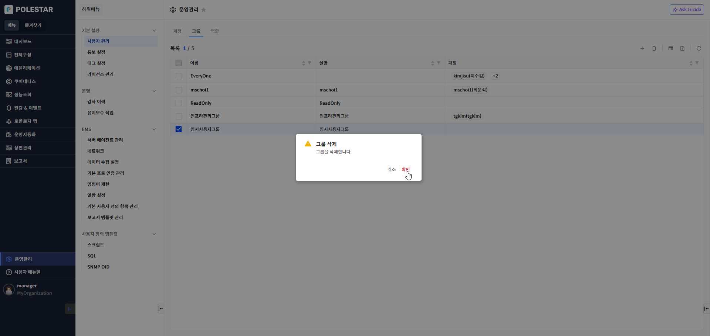

▶ \[그림10\] 그룹 삭제

그룹 삭제 절차

1.  삭제하고자 하는 그룹 선택 (다중 선택 가능)

2.  테이블 우측 상단의 \[삭제\] 아이콘 클릭

3.  메시지창에서 \[확인\] 클릭

그룹 일괄 추가

그룹을 일괄 등록할 수 있습니다.

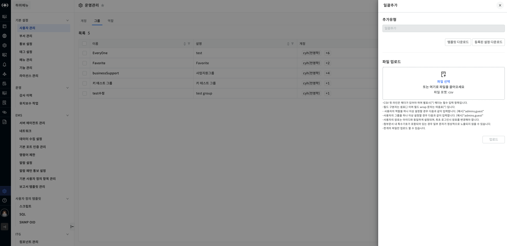

▶ \[그림\] 그룹 일괄 추가

화면 지표

| 템플릿 다운로드    | 일괄 등록 템플릿을 다운로드합니다.        |
| ----------- | -------------------------- |
| 등록된 설정 다운로드 | 등록된 데이터를 다운로드합니다.          |
| 파일 업로드      | 일괄 등록하기 위한 csv 파일을 업로드합니다. |

그룹 일괄 등록 절차

1.  파일 업로드

2.  업로드 설정 목록에서 결함 확인

3.  결함이 없으면 저장 버튼 클릭

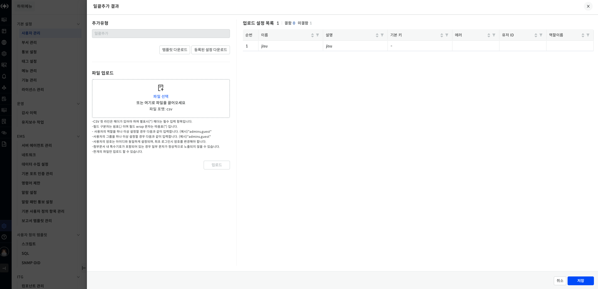

▶ \[그림\] 그룹 일괄 등록

역할

사용자나 장비(리소스)에 할당될 역할을 정의할 수 있습니다.

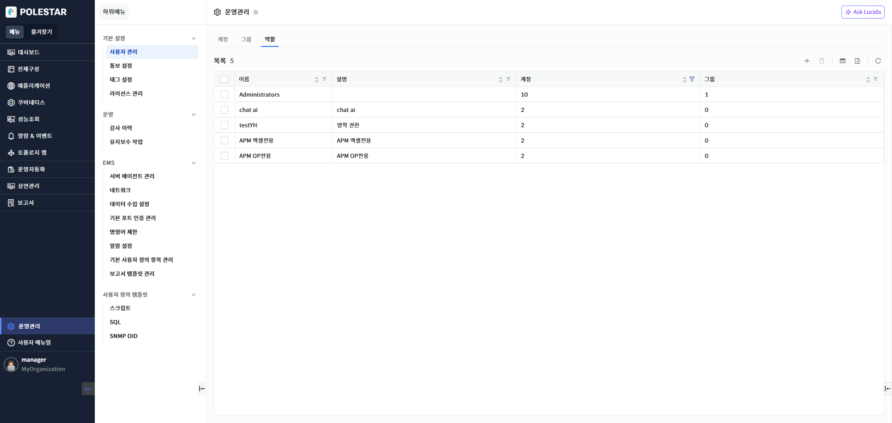

▶ \[그림11\] 역할 목록

화면 지표

| 이름 | 역할의 이름을 표시합니다.           |
| -- | ------------------------ |
| 설명 | 역할에 대한 설명을 표시합니다.        |
| 계정 | 역할에 할당된 계정 수를 표시합니다.     |
| 그룹 | 역할에 할당된 사용자 그룹 수를 표시합니다. |

역할 등록

역할을 등록할 수 있습니다.

▶ \[그림12\] 역할 등록

화면 지표

<table>
<thead>
<tr class="header">
<th>이름</th>
<th>
등록할 역할의 이름을 입력합니다.

이미 사용중인 이름은 등록되지 않기 때문에 새로운 이름을 입력합니다.

작성규칙 : 1 ~ 20자리의 문자, 숫자만 입력, 역할 이름에 Admins 는 사용 불가
</th>
</tr>
</thead>
<tbody>
<tr class="odd">
<td>ID</td>
<td>역할 ID를 입력합니다.</td>
</tr>
<tr class="even">
<td>설명</td>
<td>
역할에 대한 설명을 입력합니다.

작성규칙 : 최대 300자
</td>
</tr>
<tr class="odd">
<td>기능</td>
<td>
체크된 기능을 역할에 적용할 수 있습니다.

분류 필드로 필터링하여 권한에 맞는 기능을 할당할 수 있습니다.

항목: 도메인별 기능 정보를 표시합니다.

설명: 기능에 대한 설명입니다.

분류: 기능에 대한 분류 정보입니다. (읽기/쓰기/실행/엑셀다운로드)
</td>
</tr>
<tr class="even">
<td>계정</td>
<td>역할에 포함할 계정을 선택합니다.</td>
</tr>
<tr class="odd">
<td>그룹</td>
<td>역할에 포함할 그룹을 선택합니다.</td>
</tr>
</tbody>
</table>

역할 등록 절차

1.  테이블 우측 상단의 (+) 아이콘 클릭

2.  기본 설정 항목 입력

3.  기능 선택

4.  계정/그룹 선택

5.  \[저장\] 버튼 클릭

역할 수정

역할을 수정할 수 있습니다.

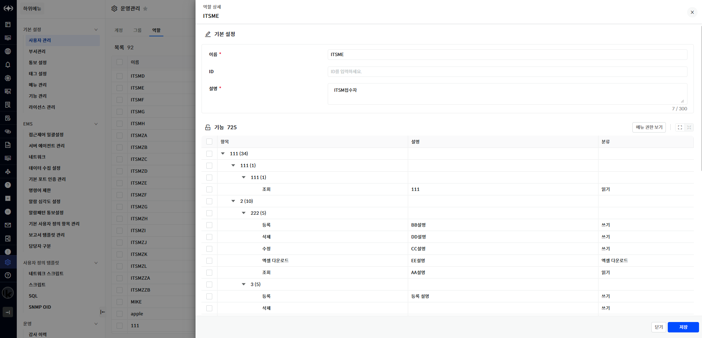

▶ \[그림13\] 역할 수정

화면 지표

<table>
<thead>
<tr class="header">
<th>이름</th>
<th>
수정할 역할의 이름을 입력합니다.

작성규칙 : 1 ~ 20자리의 문자, 숫자만 입력, 역할 이름에 Admins 는 사용 불가
</th>
</tr>
</thead>
<tbody>
<tr class="odd">
<td>ID</td>
<td>수정할 역할 ID를 입력합니다.</td>
</tr>
<tr class="even">
<td>설명</td>
<td>
역할에 대한 설명을 입력합니다.

작성규칙 : 최대 300자
</td>
</tr>
<tr class="odd">
<td>기능</td>
<td>체크된 기능을 역할에 적용할 수 있습니다.</td>
</tr>
<tr class="even">
<td>계정</td>
<td>역할에 포함할 계정을 선택합니다.</td>
</tr>
</tbody>
</table>

역할 수정 절차

1.  테이블에서 수정할 역할의 이름 클릭

2.  기본 설정 항목 입력

3.  기능 선택

4.  계정/그룹 선택

5.  \[저장\] 버튼 클릭

역할 삭제

역할을 삭제할 수 있습니다.

<table>
<tbody>
<tr class="odd">
<td>
주의

삭제하려는 역할에 연결된 계정들이 존재한다면 삭제가 불가능 합니다. 계정들을 제거한 후 삭제해야 합니다. 또한 Admin 역할은 삭제할 수 없습니다.
</td>
</tr>
</tbody>
</table>

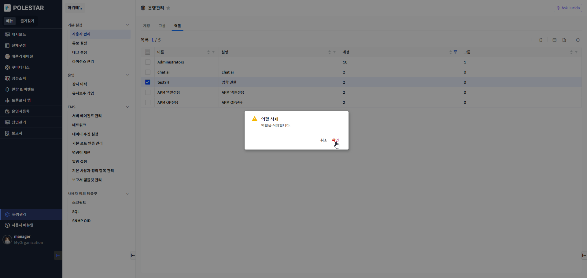

▶ \[그림14\] 역할 삭제

역할 삭제 절차

1.  삭제하고자 하는 그룹 선택 (다중 선택 가능)

2.  테이블 우측 상단의 \[삭제\] 아이콘 클릭

3.  메시지창에서 \[확인\] 클릭

