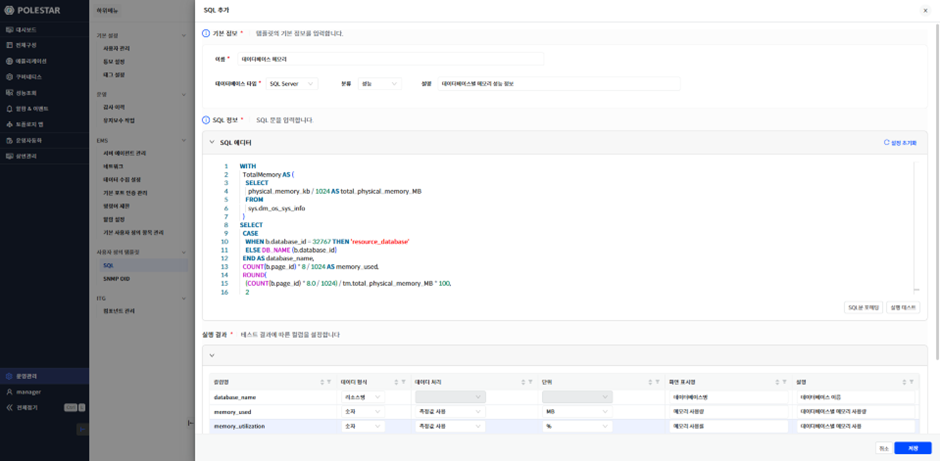
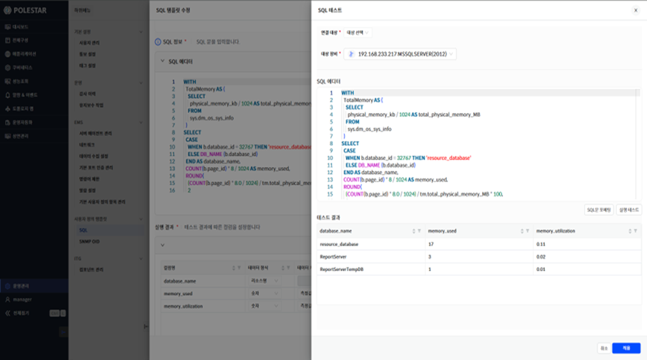
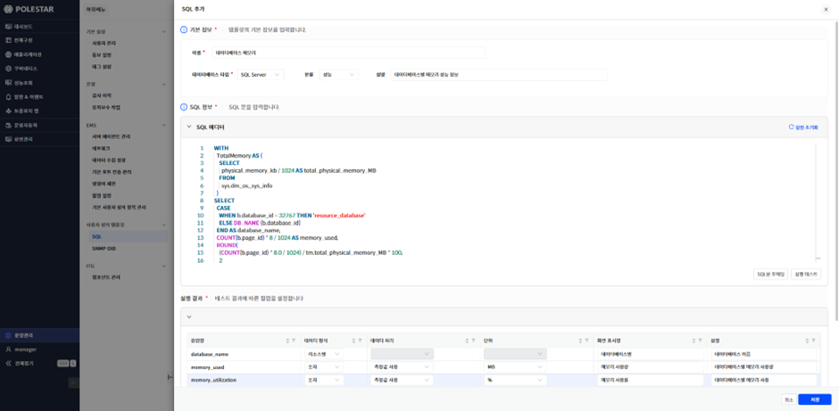
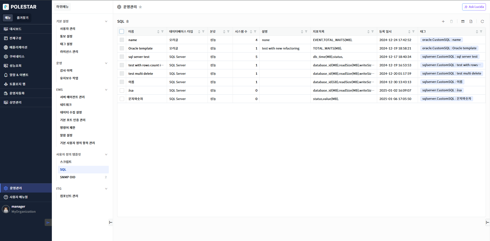
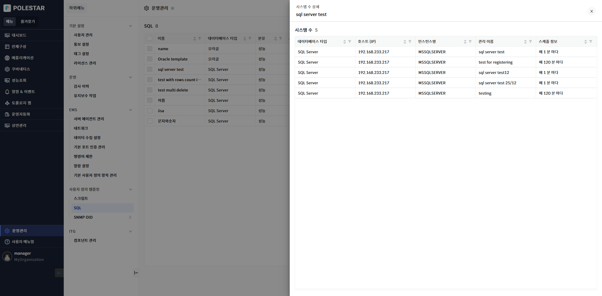
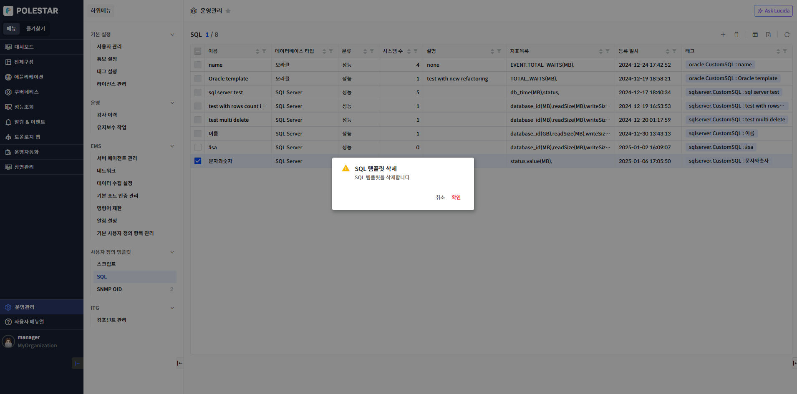

사용자 정의 SQL 템플릿

사용자 정의 SQL 기능을 이용하여 사용자가 특정 데이터베이스에 SQL을 조회하여 나온 결과로 새로운 지표를 생성하고 이에 대한 성능 조회를 할 수 있습니다. 이를 위해 우선 사용자가 SQL을 이용하여 지표를 정의하고 이를 템플릿화 하는 작업이 필요합니다.

사용자 정의 SQL 템플릿 추가

사용자 정의 SQL에 대한 템플릿을 생성하기 위해서는 운영관리\> 사용자 정의 템플릿\> SQL메뉴를 선택하면 표시되는 목록의 우측 상단에 ‘+’ 아이콘을 클릭하여 나오는 드로어를 통해 가능합니다. 다음은 자세한 추가 절차에 대한 그림과 설명입니다.

▶ \[그림1\] 사용자 정의 SQL 템플릿 목록

▶ \[그림2\] 사용자 정의 SQL 템플릿 추가 드로어(실행테스트)

▶ \[그림3\] 사용자 정의 SQL 템플릿 추가 드로어\> 실행테스트 드로어

▶ \[그림4\] 사용자 정의 SQL 템플릿 추가 드로어(지표 설정)

> 사용자 정의 SQL 템플릿 추가 절차

1.  운영관리\>사용자 정의 템플릿 \> SQL 메뉴 선택

2.  SQL 목록 우측 상단에 ‘+’ 버튼 클릭하면 사용자 정의 SQL 템플릿 추가 드로어가 표시됨

3.  사용자 정의 SQL 템플릿 추가 드로어에서 기본 정보 입력

4.  SQL 에디터에서 SQL 입력(필요시 SQL 포메팅 버튼 사용)

5.  실행 테스트 버튼을 클릭하면 SQL 실행 테스트 드로어가 표시됨

6.  SQL 실행 테스트 드로어에서 테스트할 장비를 선택

7.  실행 테스트 버튼을 클릭하면 선택한 장비에 대한 테스트 결과가 표시됨

8.  저장 버튼을 클릭하면 드로어가 닫히고 SQL 템플릿 추가 드로어 하단에 테스트 결과를 이용한 지표 설정 그리드가 표시됨

9.  테스트 결과에 대한 지표 설정을 합니다. (각 컬럼 상세 내용은 \[컬럼 설정 목록\] 설명 내용 참조)

10. 저장 버튼을 클릭하면 사용자 정의 SQL 템플릿이 추가됨

<table>
<tbody>
<tr class="odd">
<td>
주의

실행 테스트할 SQL문 마지막 문자에 ‘;’(세미콜론) 문자가 있으면 해당 SQL문이 실행되지 않습니다. 해당 SQL문에서 ‘;’(세미콜론) 문자를 빼고 테스트하세요.
</td>
</tr>
</tbody>
</table>

<table>
<tbody>
<tr class="odd">
<td>
노트

사용자 정의 SQL 템플릿 추가 드로어에 있는 SQL 포메팅 버튼을 통해 SQL Text를 보다 보기 좋게 포메팅 할 수 있습니다.
</td>
</tr>
</tbody>
</table>

<table>
<tbody>
<tr class="odd">
<td>
노트

사용자 정의 SQL 템플릿은 전체구성 &gt; 관리대상 추가 &gt; 사용자 정의 항목 &gt; SQL 메뉴에서 사용자 정의 SQL을 추가할 때 사용됩니다. 템플릿을 통해 여러 대상 데이터베이스에 동일한 쿼리를 실행하여 나온 결과를 지표로 생성할 수 있습니다.
</td>
</tr>
</tbody>
</table>

> 실행 결과(컬럼 설정) 목록

<table>
<thead>
<tr class="header">
<th>컬럼명</th>
<th>SQL 문 쿼리 결과에서 나온 컬럼 명입니다. 해당 컬럼명은 편집이 불가합니다. 해당 컬럼명을 변경하고 싶다면 SQL 쿼리문을 수정하여야 합니다.</th>
</tr>
</thead>
<tbody>
<tr class="odd">
<td>데이터 형식</td>
<td>
해당 컬럼의 데이터 형식을 선택합니다.

데이터 형식 목록

리소스명: 지표를 리소스명 단위로 구분하여 수집하고자 할 경우 설정합니다. 리소스 컬럼은 문자 형이고 첫번째 컬럼일때만 선택이 활성화됩니다.

문자: 문자형 지표를 생성할 때 선택합니다. 쿼리 테스트 결과가 문자형 일 때만 선택이 활성화됩니다.

<strong>숫자</strong>: 숫자형 지표를 생성할 때 선택합니다. 숫자 형인 경우 데이터 처리와 단위 컬럼이 활성화됩니다. 쿼리 테스트 결과가 숫자형 일 때만 선택이 활성화됩니다.
</td>
</tr>
<tr class="even">
<td>데이터 처리</td>
<td>
숫자형 타입인 경우 활성화됩니다.

데이터 처리 목록

측정값 사용: 현재 수집된 값을 그대로 사용할 때 사용

상향 변화량: 수집된 값이 누적해서 증가하는 값을 때 수집 주기내 변화량을 구하기 위해 사용

하향 변화량: 수집된 값이 누적해서 감소하는 값을 때 수집 주기내 변화량을 구하기 위해 사용
</td>
</tr>
<tr class="odd">
<td>단위</td>
<td>숫자형 타입인 경우 활성화됩니다. 지원 가능한 단위가 모두 표시됩니다.</td>
</tr>
<tr class="even">
<td>화면 표시명</td>
<td>성능 지표 조회 등의 화면에서 표시된 이름을 입력합니다.</td>
</tr>
<tr class="odd">
<td>설명</td>
<td>해당 지표에 대한 상세 설명을 입력합니다</td>
</tr>
</tbody>
</table>

<table>
<tbody>
<tr class="odd">
<td>
주의

데이터 형식 중 리소스명은 0개 또는 1개만 선택 가능하며 첫번째 컬럼에만 설정 가능합니다. 따라서 SQL문에 리소스명으로 선택할 컬럼이 있다면 SQL문에서 첫번째 컬럼이 되어야 합니다.
</td>
</tr>
</tbody>
</table>

사용자 정의 SQL 템플릿 목록

사용자 정의 SQL에 대한 탬플릿 목록을 통해 현재까지 등록된 모든 사용자 정의 SQL 탬플릿을 조회할 수 있습니다. 또한 탬플릿에 적용된 시스템 수와 해당 시스템에 대한 상세 정보를 조회할 수 있으며 SQL 탬플릿을 삭제할 수 있는 기능을 제공합니다.

▶ \[그림5\] 사용자 정의 SQL 템플릿 목록

> 사용자 정의 SQL 템플릿 목록

<table>
<thead>
<tr class="header">
<th>이름</th>
<th>사용자 정의 SQL 탬플릿 이름입니다. 이름을 클릭하면 해당 탬플릿에 대한 상세 정보를 확인할 수 있는 드로어가 표시됩니다.</th>
</tr>
</thead>
<tbody>
<tr class="odd">
<td>데이터베이스 타입</td>
<td>
데이터베이스 타입을 표시합니다.

타입 목록: 오라클, SQL Server
</td>
</tr>
<tr class="even">
<td>분류</td>
<td>사용자 정의 SQL의 용도를 표시합니다. 현재 성능 값만 선택 가능합니다.</td>
</tr>
<tr class="odd">
<td>시스템 수</td>
<td>사용자 정의 SQL 템플릿이 적용된 대상 시스템 수입니다. 해당 숫자를 클릭하면 적용된 시스템 목록을 표시하는 드로어가 표시됩니다.</td>
</tr>
<tr class="even">
<td>설명</td>
<td>사용자 정의 SQL 템플릿에 대한 설명입니다.</td>
</tr>
<tr class="odd">
<td>지표목록</td>
<td>사용자 정의 SQL 템플릿에 정의된 지표 목록을 표시합니다.</td>
</tr>
<tr class="even">
<td>등록 일시</td>
<td>사용자 정의 SQL 템플릿이 등록된 일시입니다.</td>
</tr>
<tr class="odd">
<td>태그</td>
<td>사용자 정의 SQL 템플릿에 대한 태그 값입니다.</td>
</tr>
</tbody>
</table>

<table>
<tbody>
<tr class="odd">
<td>
노트

사용자 정의 SQL 템플릿 목록의 이름을 선택하면 해당 템플릿에 대한 상세 정보를 볼 수 있는 드로어가 표시됩니다.
</td>
</tr>
</tbody>
</table>

시스템 수 상세 드로어

사용자 정의 SQL 템플릿 목록에서 시스템 수를 클릭하면 해당 템플릿에 적용된 시스템에 대한 상세 목록을 표시하는 드로어가 표시됩니다.

▶ \[그림6\] 시스템 수 상세 드로어

> 시스템 수 상세 드로어 목록

<table>
<thead>
<tr class="header">
<th>데이터베이스 타입</th>
<th>
데이터베이스 타입을 표시합니다.

타입 목록 : 오라클, SQL Server
</th>
</tr>
</thead>
<tbody>
<tr class="odd">
<td>호스트(IP)</td>
<td>데이터베이스의 호스트 또는 IP 정보가 표시됩니다.</td>
</tr>
<tr class="even">
<td>인스턴스명</td>
<td>데이터베이스의 인스턴스명이 표시됩니다.</td>
</tr>
<tr class="odd">
<td>관리 이름</td>
<td>사용자 정의 SQL 추가(배포) 이름이 표시됩니다.</td>
</tr>
<tr class="even">
<td>스케줄 정보</td>
<td>사용자 정의 SQL 추가 시 설정한 스케줄 정보가 표시됩니다.</td>
</tr>
</tbody>
</table>

사용자 정의 SQL 템플릿 삭제

삭제할 사용자 정의 SQL 템플릿을 선택하고 \[삭제\] 버튼을 선택하여 SQL 템플릿을 삭제할 수 있습니다. 이때 시스템수가 1개 이상인 경우는 체크박스에 선택할 수 없습니다. 이에 대한 상세한 설명은 노트를 참고하세요.

▶ \[그림7\] 사용자 정의 SQL 템플릿 삭제

> 사용자 정의 SQL 템플릿 삭제 절차

1.  삭제하고자 하는 사용자 정의SQL 템플릿 선택 (다중 선택 가능)

2.  테이블 우측 상단의 삭제 아이콘 클릭

3.  메시지창에서 확인 클릭

<table>
<tbody>
<tr class="odd">
<td>
노트

사용자 정의 SQL 템플릿을 삭제하려면 적용된 시스템이 하나도 없어야 합니다. 따라서 목록에서 시스템수가 1개 이상인 경우는 체크박스에서 선택이 되지 않습니다. 시스템수가 1개 이상인 템플릿을 삭제하려면 전체구성&gt;사용자 정의 SQL 목록에서 해당 템플릿을 사용하는 사용자 정의 SQL을 모두 삭제해야 합니다.
</td>
</tr>
</tbody>
</table>

엑셀 저장

사용자 정의 SQL 템플릿 목록의 우측 상단 \[엑셀 저장\] 버튼을 통해 SQL 템플릿 목록을 엑셀로 저장할 수 있습니다. 그리드 컬럼 검색 기능 등을 통해 엑셀에 보여줄 컬럼과 내용을 원하는 조건에 맞게 필터링하여 저장할 수 있습니다.

▶ \[그림8\] 사용자 정의 SQL 템플릿 목록 엑셀 저장

> 사용자 정의 SQL 템플릿 목록 엑셀 저장 및 조회 절차

1.  사용자 정의 SQL 템플릿 목록에서 우측 상단 엑셀 저장 아이콘 클릭

2.  브라우저 우측 상단 창에 저장된 엑셀 파일명이 표시됨

3.  해당 파일명을 클릭하여 엑셀 파일 확인

