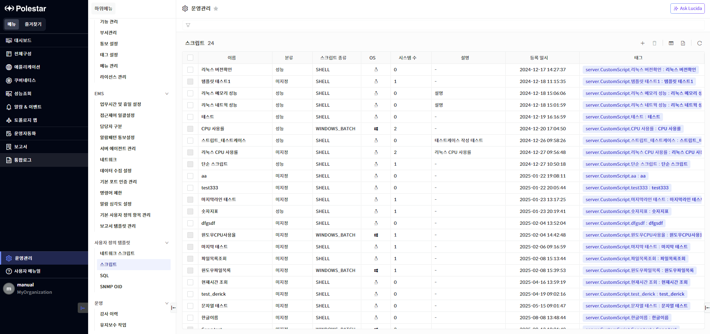
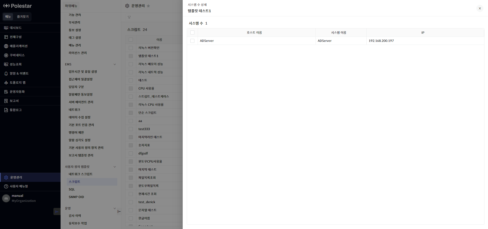
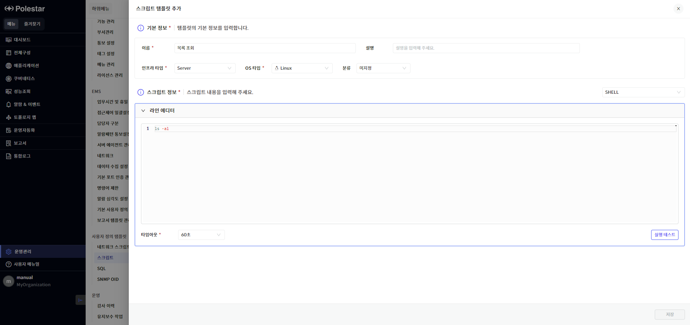
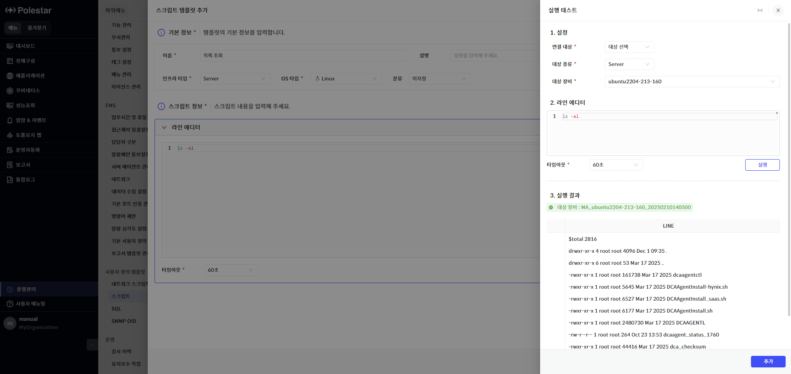
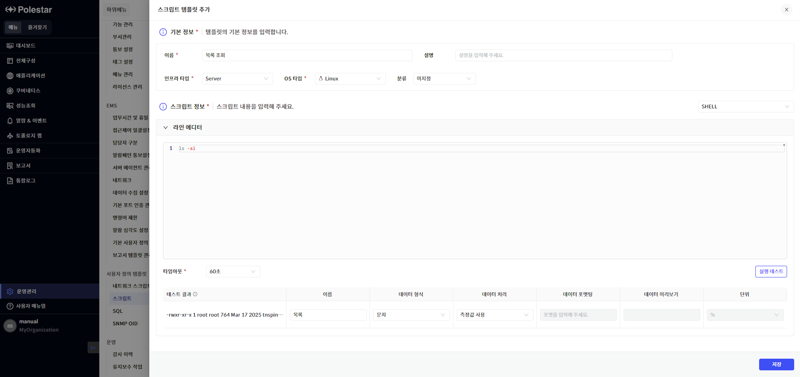
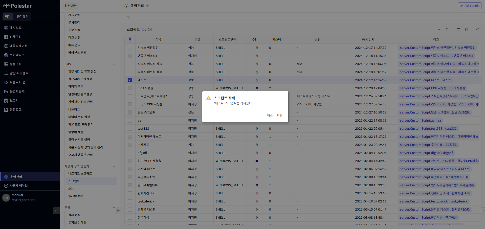
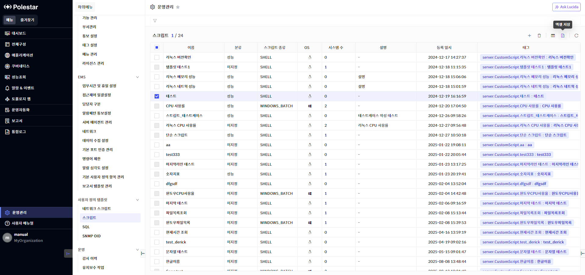

사용자 정의 스크립트 템플릿

사용자 정의 스크립트는 사용자가 직접 입력한 스크립트로 생성한 성능 지표를 특정 장비에 적용하여 주기적으로 성능 모니터링을 하는 기능입니다. 사용자 정의 스크립트 템플릿에서 지표화할 스크립트를 테스트하고 지표화할 수 있습니다.

▶ \[그림1\] 사용자 정의 스크립트 템플릿

> 사용자 정의 스크립트 템플릿 목록

| 이름      | 사용자 정의 스크립트 템플릿 이름입니다. 이름을 클릭하면 해당 템플릿에 대한 상세 정보를 확인할 수 있는 드로어가 표시됩니다.     |
| ------- | -------------------------------------------------------------------------- |
| 분류      | 사용자 정의 스크립트의 용도를 표시합니다.                                                    |
| 스크립트 종류 | 사용자 정의 스크립트 종류를 표시합니다.                                                     |
| OS      | 사용자 정의 스크립트를 실행할 서버의 OS를 표시합니다.                                            |
| 시스템 수   | 사용자 정의 스크립트 템플릿이 적용된 대상 시스템 수입니다. 해당 숫자를 클릭하면 적용된 시스템 목록을 표시하는 드로어가 표시됩니다. |
| 설명      | 사용자 정의 스크립트 템플릿에 대한 설명입니다.                                                 |
| 등록 일시   | 사용자 정의 스크립트 템플릿이 등록된 일시입니다.                                                |
| 태그      | 사용자 정의 스크립트 템플릿의 태그 정보를 표시합니다.                                             |

<table>
<tbody>
<tr class="odd">
<td>
노트

사용자 정의 스크립트 템플릿 목록의 이름을 선택하면 해당 템플릿의 상세 정보를 볼 수 있는 드로어가 표시됩니다.
</td>
</tr>
</tbody>
</table>

시스템 수 상세

사용자 정의 스크립트 템플릿 목록에서 ‘시스템 수’ 컬럼을 클릭하면 해당 템플릿에 적용된 시스템의 상세 목록을 표시하는 드로우가 표시됩니다.

▶ \[그림2\] 시스템 수 상세

시스템 수 상세

| 호스트 이름 | 서버의 호스트 이름을 표시합니다. |
| ------ | ------------------ |
| 시스템 이름 | 서버의 시스템 이름을 표시합니다. |
| IP     | 서버의 IP 정보를 표시합니다.  |

사용자 정의 스크립트 템플릿 추가

사용자 정의 스크립트 템플릿을 생성하기 위해서는 운영관리 \> 사용자 정의 템플릿 \> 스크립트 메뉴에서 화면 오른쪽 상단의 \[+\] 버튼을 클릭합니다. 다음은 자세한 추가 절차에 대한 그림과 설명입니다.

테스트하고 지표화할 수 있습니다.

▶ \[그림3\] 사용자 정의 스크립트 템플릿 추가

▶ \[그림4\] 사용자 정의 스크립트 템플릿 추가 - 실행테스트

▶ \[그림5\] 사용자 정의 스크립트 템플릿 추가 – 지표 설정

> 스크립트 템플릿 추가 절차

1.  운영관리 \> 사용자 정의 템플릿 \> 스크립트 메뉴 선택

2.  스크립트 목록 우측 상단의 \[+\] 버튼 클릭

3.  스크립트 템플릿 추가 드로어에서 \[기본 정보\] 입력

4.  \[스크립트 정보\]에서 실행할 스크립트 종류 선택 후 \[라인 에디터\]에서 스크립트 입력

5.  \[실행 테스트\] 버튼 클릭 후 \[대상 장비\]를 선택하고 \[실행\] 버튼 클릭

6.  \[실행 결과\]를 확인하고 \[추가\] 버튼 클릭

7.  지표 설정 그리드에서 실행한 스크립트 결과 확인

8.  지표 세부 설정 (각 설정 항목은 \[실행 결과 컬럼\] 설명 참조)

9.  \[저장\] 버튼 클릭하여 사용자 정의 스크립트 템플릿 추가

> 실행 결과 컬럼

<table>
<thead>
<tr class="header">
<th>테스트 결과</th>
<th>[실행 테스트]의 결과를 보여줍니다. 해당 컬럼은 임의로 수정할 수 없고 오로지 [실행 테스트]의 결과만을 표시합니다.</th>
</tr>
</thead>
<tbody>
<tr class="odd">
<td>이름</td>
<td>사용자가 입력하는 지표 이름입니다.</td>
</tr>
<tr class="even">
<td>데이터 형식</td>
<td>
문자, 숫자 두가지 형태가 존재합니다.

<strong>문자</strong>: 문자형 지표를 생성할 때 선택합니다. 실행 테스트 결과가 <strong>숫자형</strong>이 아닐 때 선택이 활성화 됩니다.

<strong>숫자</strong>: 숫자형 지표를 생성할 때 선택합니다. 숫자형인 단위 컬럼이 활성화 됩니다. 실행 테스트 결과가 숫자형일 때만 선택이 활성화 됩니다.
</td>
</tr>
<tr class="odd">
<td>데이터 처리</td>
<td>
데이터 형식이 문자형인 경우 [측정값 사용], [정규식 변환]을 선택할 수 있고 숫자형인 경우 [측정값 사용], [상향 변화량], [하향 변화량]을 선택할 수 있습니다.

측정값 사용: 현재 수집된 값을 그대로 사용

정규식 변환: 정규식을 이용해 현재 테스트 결과값 커스텀

상향 변화량: 수집된 값이 누적해서 증가하는 값인 경우, 수집 주기내 변화량 산출

하향 변화량: 수집된 값이 누적해서 감소하는 값인 경우, 수집 주기내 변화량 산출
</td>
</tr>
<tr class="even">
<td>데이터 포맷팅</td>
<td>데이터 처리에서 [정규식 변환] 선택시 활성화됩니다. 해당 컬럼에는 적용할 정규식을 입력합니다.</td>
</tr>
<tr class="odd">
<td>데이터 미리보기</td>
<td>데이터 포맷팅에서 입력한 정규식의 결과값을 표시합니다.</td>
</tr>
<tr class="even">
<td>단위</td>
<td>숫자형 타입인 경우 활성화 됩니다. 지원 가능한 단위가 모두 표시됩니다.</td>
</tr>
</tbody>
</table>

<table>
<tbody>
<tr class="odd">
<td>
노트

사용자 정의 스크립트 템플릿 실행 테스트 결과의 마지막 라인만 지표화 (데이터화) 합니다.
</td>
</tr>
</tbody>
</table>

사용자 정의 스크립트 템플릿 삭제

삭제할 사용자 정의 스크립트 템플릿을 선택하고 \[삭제\] 버튼을 클릭하여 스크립트 템플릿을 삭제할 수 있습니다. 이때 시스템 수가 1개 이상인 경우는 체크박스에서 선택할 수 없습니다.

▶ \[그림6\] 사용자 정의 스크립트 템플릿 삭제

> 사용자 정의 스크립트 템플릿 삭제 절차

1.  삭제하고자 하는 사용자 정의 스크립트 템플릿 선택 (다중 선택 가능)

2.  테이블 우측 상단의 삭제 아이콘 클릭

3.  메시지창에서 확인 클릭

<table>
<tbody>
<tr class="odd">
<td>
노트

사용자 정의 스크립트 템플릿을 삭제하려면 해당 스크립트가 적용된 시스템이 하나도 없어야 합니다. 목록에서 시스템 수가 1개 이상인 경우는 체크박스에서 선택이 되지 않습니다. 시스템 수가 1개 이상인 템플릿을 삭제하려면 전체구성 &gt; 사용자 정의 스크립트 목록에서 해당 템플릿을 사용하는 사용자 정의 스크립트를 모두 삭제해야 합니다.
</td>
</tr>
</tbody>
</table>

엑셀 저장

사용자 정의 스크립트 템플릿 목록의 우측 상단 \[엑셀 저장\] 버튼을 통해 스크립트 템플릿 목록을 엑셀로 저장할 수 있습니다. 그리드 컬럼 검색 기능 등을 통해 엑셀에 보여줄 컬럼과 내용을 원하는 조건에 맞게 필터링하여 저장할 수 있습니다.

▶ \[그림7\] 사용자 정의 스크립트 템플릿 목록 엑셀 저장

> 사용자 정의 스크립트 템플릿 목록 엑셀 저장 및 조회 절차

1.  사용자 정의 스크립트 템플릿 목록에서 우측 상단 엑셀 저장 아이콘 클릭

2.  브라우저 우측 상단 창에 저장된 엑셀 파일명이 표시됨

3.  해당 파일명을 클릭하여 엑셀 파일 확인

