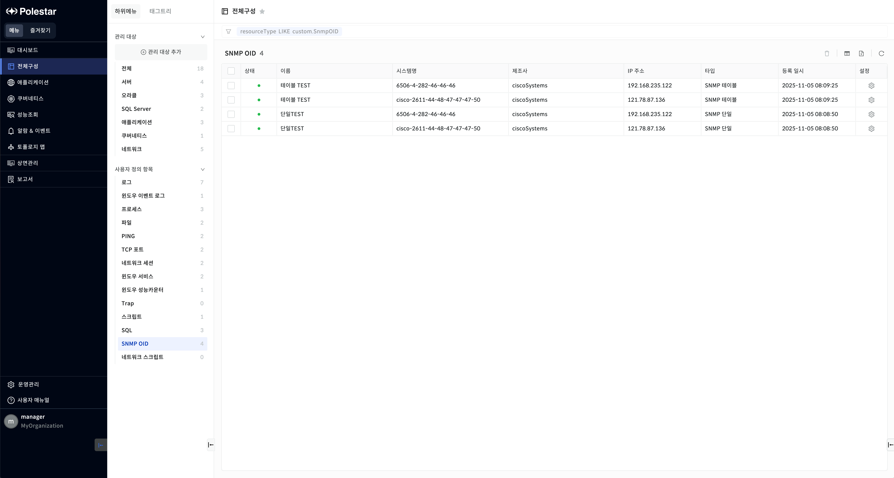
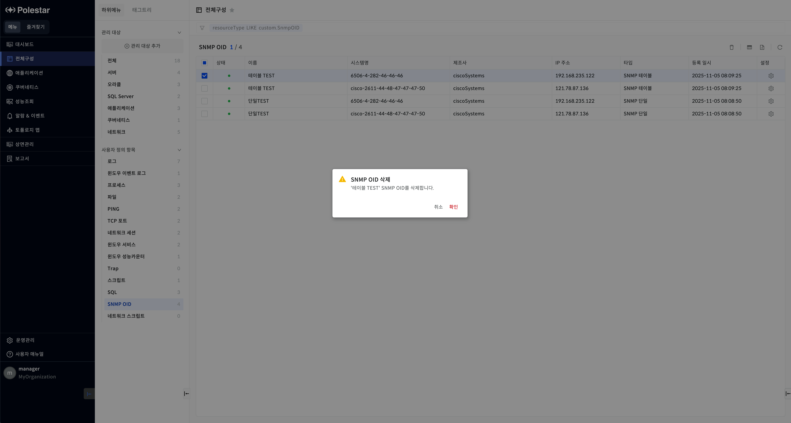
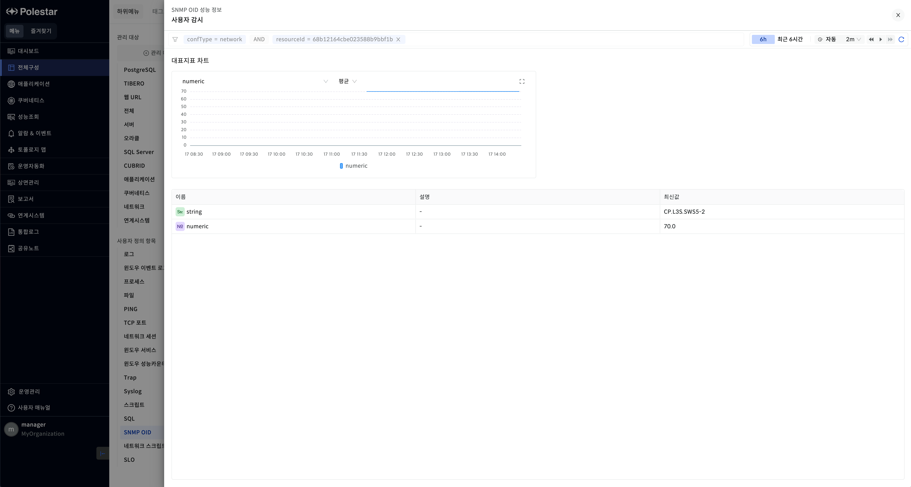

SNMP OID

사용자 정의 SNMP OID 목록

전체구성 \> 사용자 정의 항목에서 \[SNMP OID\]를 선택하면 전체 SNMP OID 목록을 확인할 수 있습니다. SNMP OID 목록을 통해 현재 등록되어 있는 SNMP OID 기본 정보를 확인할 수 있으며 해당 화면에서 SNMP OID 을 삭제할 수 있습니다.

<table>
<tbody>
<tr class="odd">
<td>
노트

[운영 관리] &gt; [사용자 정의 템플릿] &gt; [SNMP OID] 메뉴에서 템플릿을 먼저 등록해야 SNMP OID 등록이 가능합니다. SNMP OID 목록에는 로그인 사용자에게 읽기 권한이 할당된 SNMP OID만 표시됩니다.
</td>
</tr>
</tbody>
</table>

> ▶ \[그림1\] 사용자 정의 SNMP OID 목록
> 
> 사용자 정의 SNMP OID 목록

<table>
<thead>
<tr class="header">
<th>상태</th>
<th><table>
<tbody>
<tr class="odd">
<td>SNMP OID의 상태 정보를 표시합니다.</td>
</tr>
</tbody>
</table></th>
</tr>
</thead>
<tbody>
<tr class="odd">
<td>시스템명</td>
<td>SNMP OID를 등록한 네트워크 장비의 시스템 이름이 표시됩니다.</td>
</tr>
<tr class="even">
<td>제조사</td>
<td>SNMP OID를 등록한 네트워크에서 수집된 제조사 정보가 표시됩니다.</td>
</tr>
<tr class="odd">
<td>IP 주소</td>
<td>SNMP OID를 등록한 네트워크 등록 시 입력했던 호스트명 또는 IP가 표시됩니다.</td>
</tr>
<tr class="even">
<td>타입</td>
<td>SNMP OID의 타입이 표시됩니다.</td>
</tr>
<tr class="odd">
<td>등록일시</td>
<td>SNMP OID를 등록한 등록일시가 표시됩니다.</td>
</tr>
<tr class="even">
<td>설정</td>
<td>아이콘 클릭시 SNMP OID 상세 화면이 드로우 됩니다.</td>
</tr>
</tbody>
</table>

사용자 정의 SNMP OID 삭제

삭제할 SNMP OID를 선택하고 \[삭제\] 버튼을 선택하여 SNMP OID 템플릿을 삭제할 수 있습니다.

▶ \[그림2\] SNMP OID 삭제

> SNMP OID 삭제 절차

1.  삭제하고자 하는 사용자 정의 SNMP OID 선택 (다중 선택 가능)

2.  테이블 우측 상단의 삭제 아이콘 클릭

3.  메시지창에서 확인 클릭

엑셀 저장

SNMP OID 목록의 우측 상단 \[엑셀 저장\] 버튼을 통해 SNMP OID 목록을 엑셀로 저장할 수 있습니다. 그리드 컬럼의 검색 기능 등을 통해 엑셀에 보여줄 컬럼과 내용을 원하는 조건에 맞게 필터링하여 저장할 수 있습니다.

> SNMP OID 목록 엑셀 저장 및 조회 절차

1.  SNMP OID 목록에서 우측 상단 엑셀 저장 아이콘 클릭

2.  브라우저 우측 상단 창에 저장된 엑셀 파일명이 표시됨

3.  해당 파일명을 클릭하여 엑셀 파일 확인

사용자 정의 SNMP OID 성능 정보 드로어

사용자 정의 SNMP OID 목록에서 각 SNMP OID의 이름을 클릭하면 SNMP OID 결과에 대한 성능 정보 드로어가 화면에 표시됩니다. 대표지표 차트에서는 수치 데이터에 대한 데이터를 차트 형태로 확인할 수 있으며 하단 테이블에서는 정의되어 있는 OID에 대해 마지막 수집 데이터를 확인할 수 있습니다. 문자열 형식의 데이터()는 이름을 클릭하면 SNMP OID 문자 데이터 이력 드로어가 화면에 표시되어 데이터 변경 이력을 확인할 수 있습니다.

> ▶ \[그림4\] 사용자 정의 SNMP OID 성능 정보 드로어

> ▶ \[그림5\] 사용자 정의 SNMP OID 문자 데이터 이력

