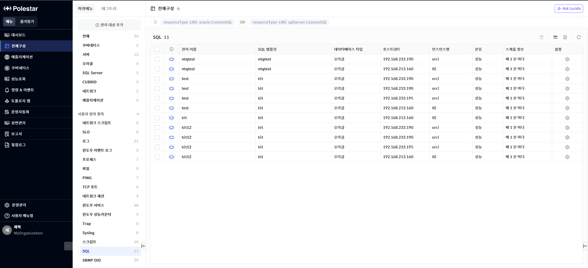
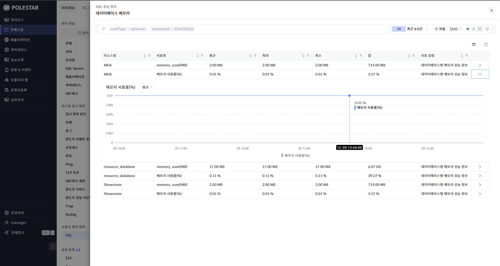
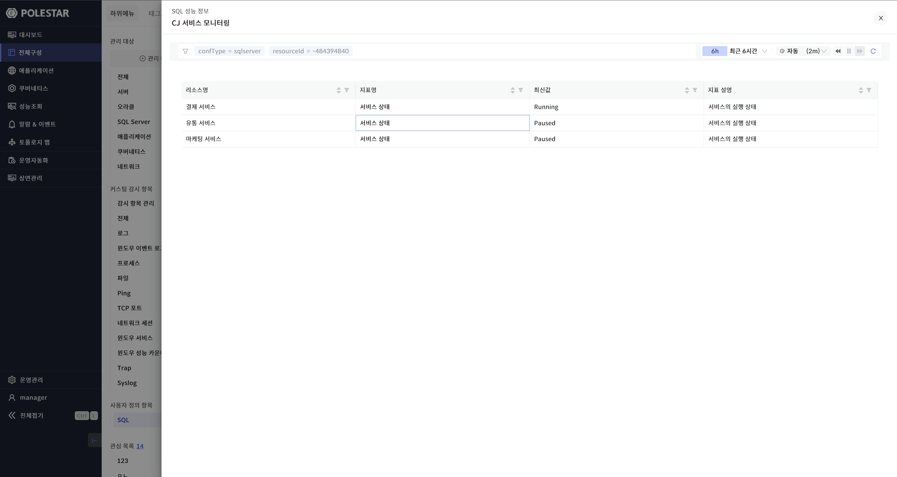
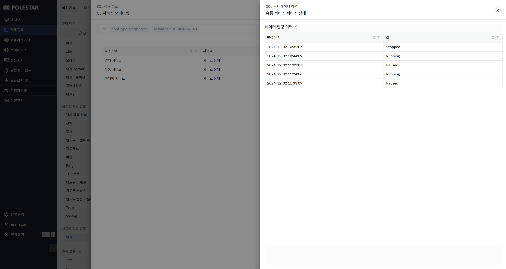
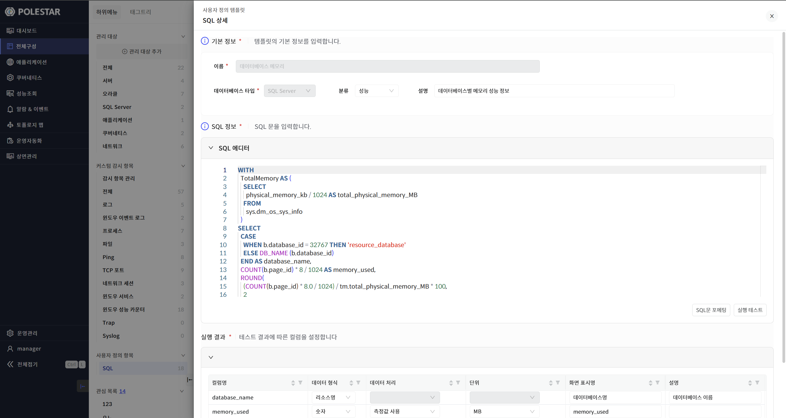
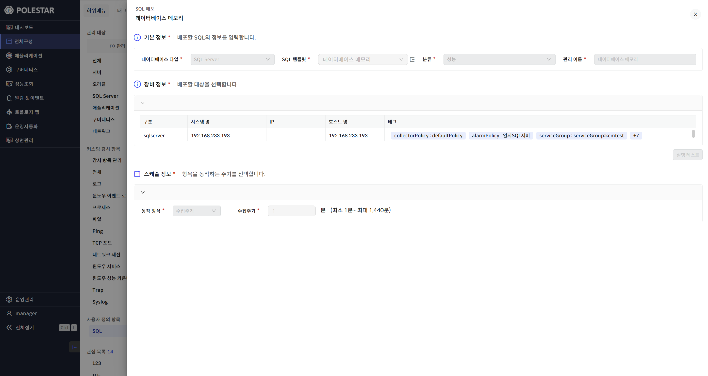
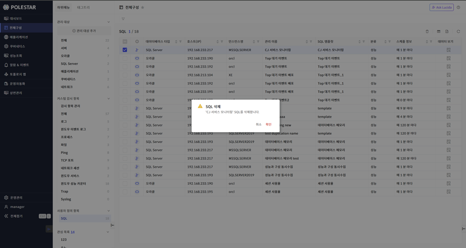
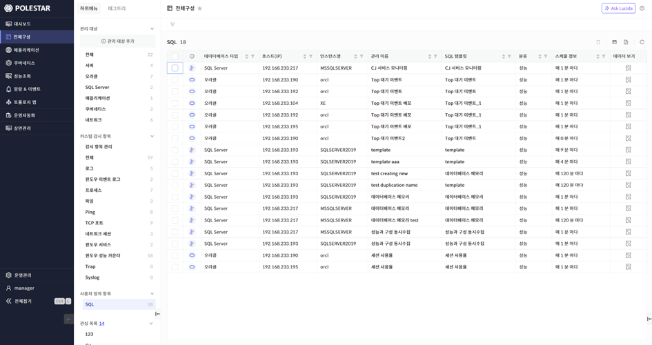

사용자 정의 SQL 목록

사용자 정의 SQL 목록을 통해 배포된 사용자 정의 SQL에 대한 전체 목록을 확인할 수 있습니다. 또한 각 사용자 정의 SQL 대상별 성능을 조회하거나 배포된 사용자 정의 SQL의 상세 정보 또는 SQL 템플릿 정보를 조회해 볼 수 있고 사용자 정의 SQL을 삭제할 수 있습니다.

▶ \[그림1\] 사용자 정의 SQL 목록

> 사용자 정의 SQL 목록

<table>
<thead>
<tr class="header">
<th>가용성 아이콘</th>
<th>
해당 사용자 정의 SQL이 현재 정상 수집되고 있는지 여부를 표시합니다.

<table>
<thead>
<tr class="header">
<th>: SQL Server 사용자 정의 SQL 정상 수집(Up)</th>
</tr>
</thead>
<tbody>
<tr class="odd">
<td>: SQL Server 사용자 정의 SQL 비정상 수집(Down)</td>
</tr>
</tbody>
</table></th>
</tr>
</thead>
<tbody>
<tr class="odd">
<td>관리 이름</td>
<td>사용자 정의 SQL 추가(배포) 이름이 표시됩니다. 해당 이름을 클릭하면 해당 데이터베이스의 사용자 정의 SQL 성능 지표를 상세히 볼 수 있는 드로어가 표시됩니다. 해당 드로어에 대한 상세한 내용은 [데이터 보기 드로어] 부분을 참조하세요.</td>
</tr>
<tr class="even">
<td>SQL 템플릿</td>
<td>해당 데이터베이스에 적용된 사용자 정의 SQL 템플릿 명입니다. 해당 이름을 클릭하면 그에 대한 사용자 정의 SQL 템플릿 상세 드로어가 표시됩니다.</td>
</tr>
<tr class="odd">
<td>데이터베이스 타입</td>
<td>
데이터베이스 타입을 표시합니다.

타입 목록: 오라클, SQL Server
</td>
</tr>
<tr class="even">
<td>호스트(IP)</td>
<td>데이터베이스의 호스트 또는 IP 정보가 표시됩니다.</td>
</tr>
<tr class="odd">
<td>인스턴스명</td>
<td>데이터베이스의 인스턴스명이 표시됩니다.</td>
</tr>
<tr class="even">
<td>분류</td>
<td>사용자 정의 SQL의 분류명입니다..</td>
</tr>
<tr class="odd">
<td>스케줄 정보</td>
<td>사용자 정의 SQL 추가 시 설정한 스케줄 정보가 표시됩니다.</td>
</tr>
<tr class="even">
<td>설정</td>
<td>설정 아이콘을 선택하면 해당 관리 이름에 대한 사용자 정의 SQL 상세 드로어가 표시됩니다.</td>
</tr>
</tbody>
</table>

<table>
<tbody>
<tr class="odd">
<td>
노트

사용자 정의 SQL 목록의 SQL 템플릿 컬럼의 이름을 선택하면 해당 템플릿에 대한 상세 정보를 볼 수 있는 드로어가 표시됩니다. 또한 관리 이름을 선택하면 해당 데이터베이스의 사용자 정의 SQL 성능 지표를 상세히 볼 수 있는 드로어가 표시됩니다.
</td>
</tr>
</tbody>
</table>

데이터 보기 드로어

사용자 정의 SQL 목록에서 관리 이름을 클릭하면 해당 사용자 정의 SQL의 성능 정보를 볼 수 있는 드로어가 표시됩니다. 해당 드로어에서는 지표가 숫자형일 경우는 타임셀렉터에 해당하는 기간 동안의 평균, 최대, 최소, 합을 보여주는 그리드가 표시됩니다. 이때 리소스별로 수집된 경우는 리소스별로 표시됩니다. 숫자형 그리드에서는 가장 오른쪽 ‘\>’ 아이콘을 클릭하여 해당 지표에 대한 상세 차트를 볼 수 있습니다. 그리고 지표가 문자형일 경우는 해당 문자 지표의 가장 최근 값을 보여주는 그리드가 표시되며 지표명을 클릭하면 해당 지표에 대한 이력 정보를 확인 할 수 있는 드로어가 표시됩니다.

▶ \[그림2\] 사용자 정의 SQL 데이터 보기 드로어(숫자 지표)

▶ \[그림3\] 사용자 정의 SQL 데이터 보기 드로어(문자 지표)

▶ \[그림4\] 문자 지표 이력 드로어

사용자 정의 SQL 템플릿 상세 드로어

사용자 정의 SQL 목록에서 SQL템플릿 컬럼의 이름을 클릭하면 그 이름에 해당하는 사용자 정의 SQL 템플릿 상세 드로어가 표시됩니다. 해당 드로어에서는 SQL 템플릿에 대한 상세 정보를 확인할 수 있습니다.

▶ \[그림5\] 사용자 정의 SQL 템플릿 상세 드로어

사용자 정의 SQL 상세 드로어

사용자 정의 SQL 목록에서 설정 컬럼의 아이콘을 클릭하면 그 이름에 해당하는 사용자 정의 SQL 상세 드로어가 표시됩니다. 해당 드로어에서는 SQL 배포(추가)에 대한 상세 정보를 확인할 수 있습니다.

▶ \[그림6\] 사용자 정의 SQL 상세 드로어

사용자 정의 SQL 삭제

삭제할 사용자 정의 SQL을 선택하고 \[삭제\] 버튼을 선택하여 사용자 정의 SQL을 삭제할 수 있습니다.

▶ \[그림7\] 사용자 정의 SQL 삭제

> 사용자 정의 SQL 삭제 절차

1.  삭제하고자 하는 사용자 정의SQL 선택 (다중 선택 가능)

2.  테이블 우측 상단의 삭제 아이콘 클릭

3.  메시지창에서 확인 클릭

엑셀 저장

사용자 정의 SQL 목록의 우측 상단 \[엑셀 저장\] 버튼을 통해 사용자 정의 SQL 목록을 엑셀로 저장할 수 있습니다. 그리드 컬럼 검색 기능 등을 통해 엑셀에 보여줄 컬럼과 내용을 원하는 조건에 맞게 필터링하여 저장할 수 있습니다.

▶ \[그림8\] 사용자 정의 SQL 목록 엑셀 저장

> 사용자 정의 SQL 목록 엑셀 저장 및 조회 절차

1.  사용자 정의 SQL 목록에서 우측 상단 엑셀 저장 아이콘 클릭

2.  브라우저 우측 상단 창에 저장된 엑셀 파일명이 표시됨

3.  해당 파일명을 클릭하여 엑셀 파일 확인

