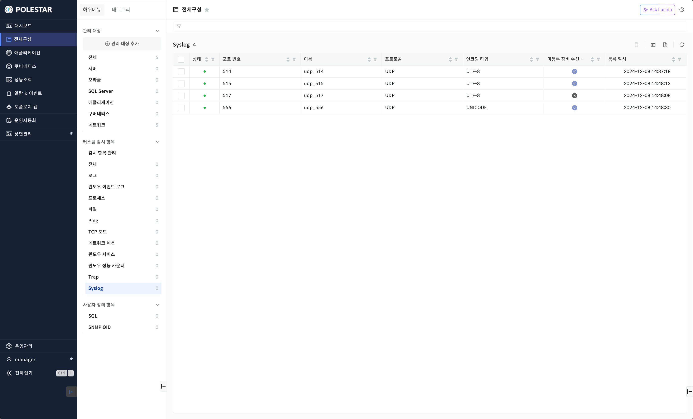
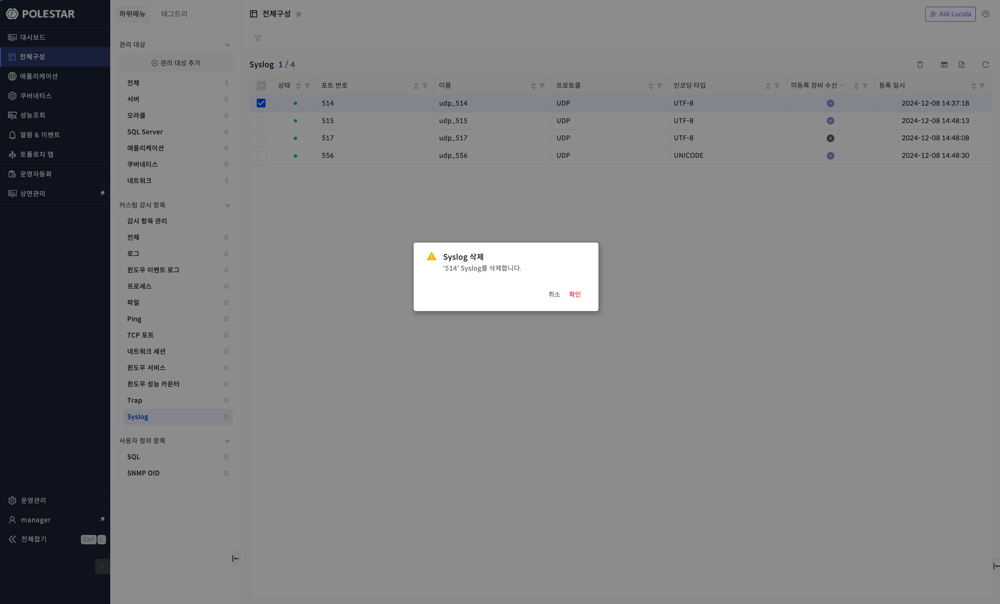
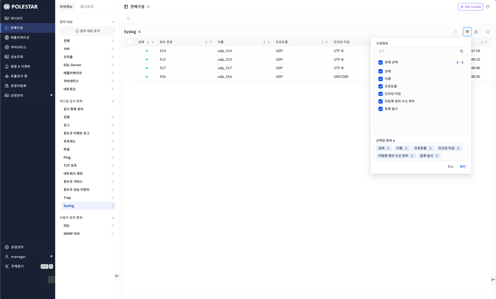
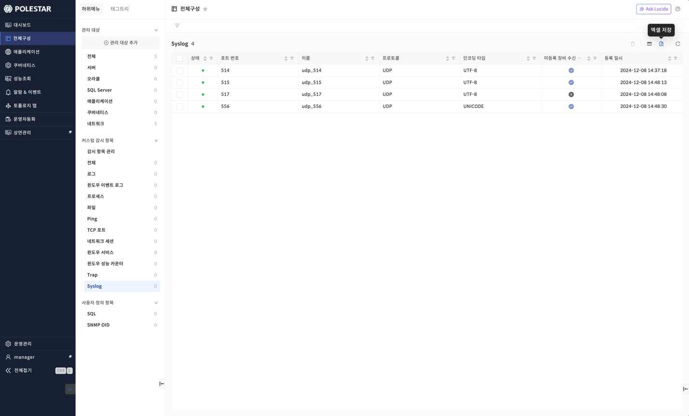

Syslog 목록

전체 구성에서 \[Syslog\]을 선택하면 등록되어 있는 전체 Syslog포트 목록을 확인할 수 있습니다. Syslog포트는 대상 네트워크 장비로부터 Syslog 이벤트를 수신하기 위해 사용되는 포트입니다. Syslog는 요청과 응답 방식을 사용하는 대신 대상 리소스로 등록된 장비에 이벤트가 발생할 경우 지정된 Syslog 포트를 통해 수신 시스템으로 바로 전달해주는 방식입니다.

Syslog목록을 통해 Syslog이벤트 수신을 위한 포트 번호, 상태, 이름, 프로토콜, 인코딩 타입, 미등록 장비 수신 여부, 등록 일시를 확인할 수 있습니다. 또한 해당 화면에서 등록된 Syslog 포트를 삭제할 수 있습니다.

<table>
<tbody>
<tr class="odd">
<td>
노트

전체 구성에서 관리되는Syslog은 [전체구성] 메뉴의 [관리 대상 추가]에서Syslog [관리 대상 등록]을 통해 등록되어야 합니다. 그리고Syslog목록의 대상 리소스는 로그인 사용자에게 읽기 권한이 할당된 계정 내 장비만 표시됩니다.
</td>
</tr>
</tbody>
</table>

> ▶ \[그림1\] Syslog 목록
> 
> Syslog 목록

<table>
<thead>
<tr class="header">
<th>상태</th>
<th>
포트 상태 가용성을 색상 아이콘으로 표시합니다.

<table>
<thead>
<tr class="header">
<th><strong>:</strong> <strong>Syslog 포트 정상 상태 표시(Up)</strong></th>
</tr>
</thead>
<tbody>
<tr class="odd">
<td>
<strong>: Syslog 포트 다운 상태 표시(Down)</strong>

<strong>: Syslog 포트 알 수 없음 상태 표시(Unknown)</strong>
</td>
</tr>
</tbody>
</table></th>
</tr>
</thead>
<tbody>
<tr class="odd">
<td>포트 번호</td>
<td>Syslog 포트 등록 시 입력했던 포트 번호가 표시됩니다. (Syslog는 기본적으로 514번을 사용합니다.)</td>
</tr>
<tr class="even">
<td>이름</td>
<td>Syslog포트 등록 시 입력했던 이름이 표시됩니다. 등록 시 입력하지 않은 경우 프로토콜과 포트 번호를 조합한 이름이 자동으로 설정됩니다. 예를 들어, 514 포트 번호에 UDP 프로토콜을 사용하면서 이름을 설정하지 않은 경우 자동으로 udp_514라는 이름이 설정됩니다.</td>
</tr>
<tr class="odd">
<td>프로토콜</td>
<td>Syslog포트 등록 시 입력했던 프로토콜 정보(ex. TCP 또는 UDP)가 표시됩니다. 대부분 UDP 프로토콜을 사용합니다.</td>
</tr>
<tr class="even">
<td>인코딩 타입</td>
<td>Syslog포트 등록 시 입력했던 인코딩 타입이 표시됩니다. 이 정보는 Syslog이벤트 수신 시 메시지 인코딩에 사용됩니다. 등록 시 사용자 지정 인코딩 타입을 설정한 경우, CUSTOM이라는 인코딩 타입 대신 사용자 지정 인코딩 타입이 그대로 표시됩니다.</td>
</tr>
<tr class="odd">
<td>미등록 장비 수신 여부</td>
<td>Syslog 포트 등록 시 설정했던 미등록 장비 수신 여부가 표시됩니다. 이 정보는 시스템에 등록되지 않은 장비에서 발생한 Syslog 이벤트를 수신할지 여부를 나타냅니다. 수신 비활성화 시 시스템에 등록된 장비의 Syslog 이벤트만 수신합니다.</td>
</tr>
<tr class="even">
<td>등록 일시</td>
<td>Syslog포트 등록 일시가 표시됩니다.</td>
</tr>
</tbody>
</table>

<table>
<tbody>
<tr class="odd">
<td>
노트

Syslog는 장비에서 이벤트 발생 시, AP 서버를 향해 Syslog이벤트를 전송하도록 설정되어 있어야 합니다. 수신된 모든Syslog이벤트는 대메뉴의 [알람 &amp; 이벤트]의 [이벤트 현황]에서 확인할 수 있습니다.
</td>
</tr>
</tbody>
</table>

Syslog 삭제

삭제할 Syslog 포트를 선택하고 우측 상단의 \[삭제\] 버튼을 선택하여 등록된 Syslog포트를 삭제할 수 있습니다. Syslog포트 삭제 시 해당 포트를 사용한 Syslog이벤트 수신 뿐 아니라 해당 Syslog포트를 사용하는 다른 계정의Syslog이벤트 수신 또한 중지됩니다.

▶ \[그림2\] Syslog삭제

> Syslog 삭제 절차

1.  삭제하고자 하는 Syslog선택 (다중 선택 가능)

2.  테이블 우측 상단의 삭제 아이콘 클릭

3.  메시지창에서 확인 클릭

컬럼 수정

Syslog목록의 우측 상단 \[컬럼 수정\] 버튼을 통해 Syslog목록에 원하는 컬럼만을 표시하거나 제외할 수 있습니다. 엑셀 저장시에도 컬럼 수정을 통해 표시된 컬럼만 저장됩니다. 컬럼 수정 팝업창에서는 컬럼 검색 기능을 제공하며 선택된 항목을 하단에 표시하고 표시된 컬럼을 제외할 수 있는 기능을 제공합니다.

▶ \[그림3\] Syslog목록 컬럼 수정

> Syslog컬럼 수정 절차

1.  Syslog목록에서 우측 상단 컬럼 수정 아이콘 클릭

2.  컬럼 수정 팝업창에서 화면에 표시하고자 하는 컬럼을 체크박스에서 선택

3.  저장 버튼 클릭

엑셀 저장

Syslog목록의 우측 상단 \[엑셀 저장\] 버튼을 통해 Syslog목록을 엑셀로 저장할 수 있습니다. 컬럼 수정 기능, 상단 태그 검색 기능, 그리드 컬럼 검색 기능 등을 통해 엑셀에 보여줄 컬럼과 내용을 원하는 조건에 맞게 필터링하여 저장할 수 있습니다.

▶ \[그림4\] Syslog목록 엑셀 저장

> Syslog 목록 엑셀 저장 및 조회 절차

1.  Syslog목록에서 우측 상단 엑셀 저장 아이콘 클릭

2.  브라우저 우측 상단 창에 저장된 엑셀 파일명이 표시됨

3.  해당 파일명을 클릭하여 엑셀 파일 확인

