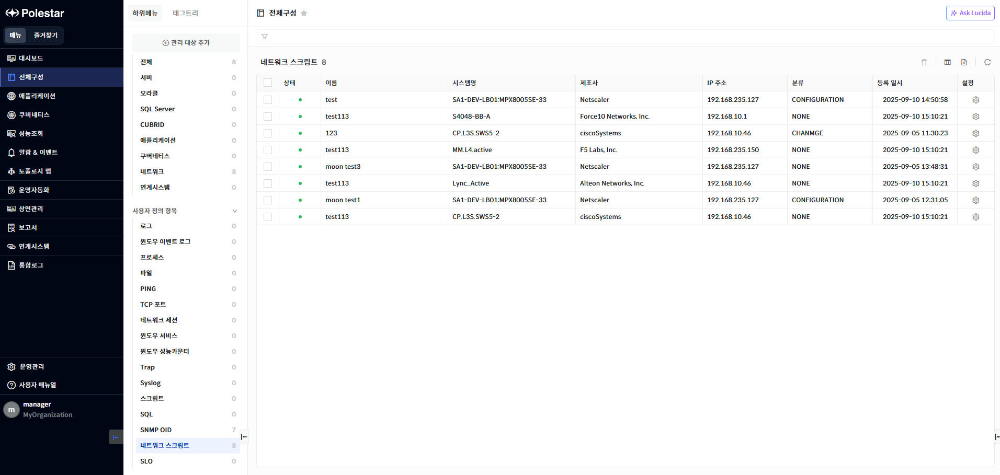
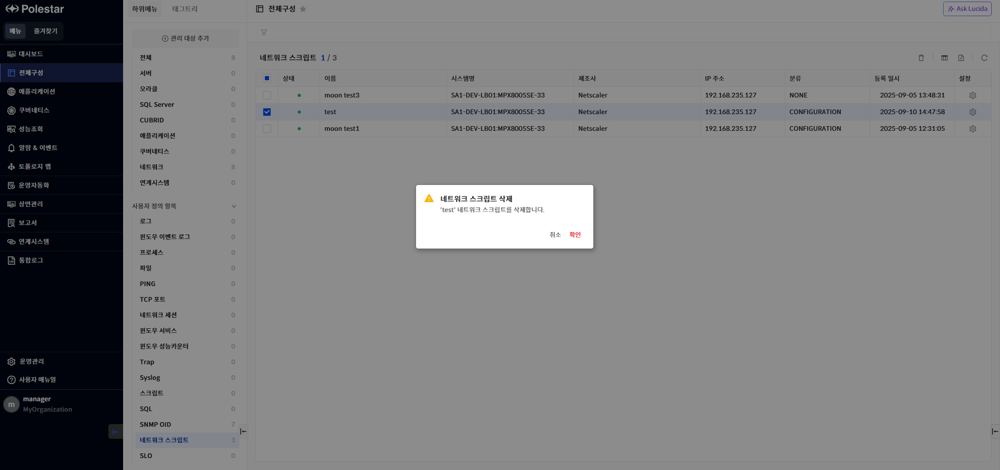
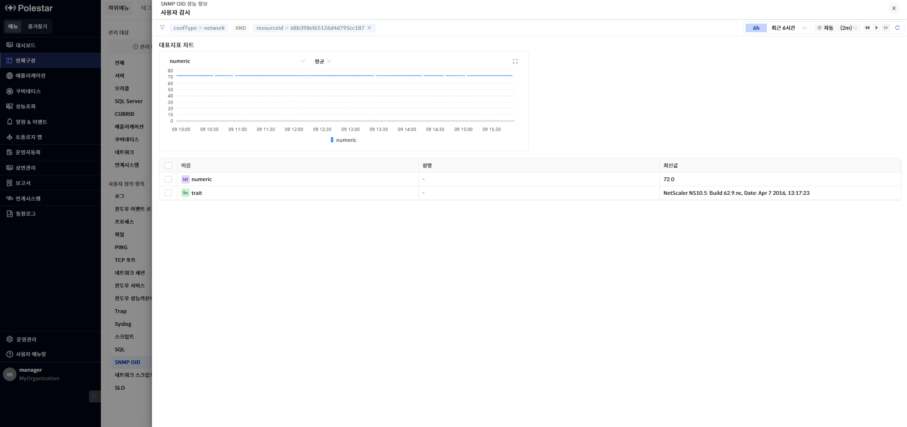
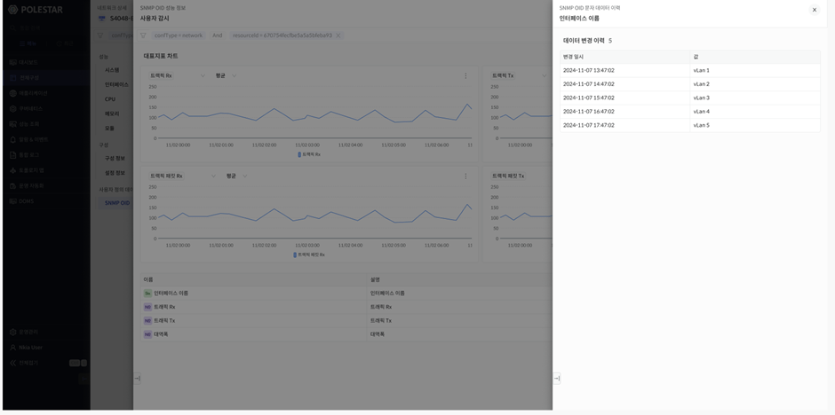

네트워크 스크립트

네트워크 스크립트 목록

전체구성 \> 사용자 정의 항목에서 \[네트워크 스크립트\]를 선택하면 전체 네트워크 스크립트 목록을 확인할 수 있습니다. 네트워크 스크립트 목록을 통해 현재 등록되어 있는 네트워크 스크립트 기본 정보를 확인할 수 있으며 해당 화면에서 네트워크 스크립트를 삭제할 수 있습니다.

<table>
<tbody>
<tr class="odd">
<td>
노트

[운영 관리] &gt; [사용자 정의 템플릿] &gt; [네트워크 스크립트] 메뉴에서 템플릿이 등록되어 있어야 등록이 가능합니다. 그리고 [네트워크 스크립트] 목록에는 로그인 사용자에게 읽기 권한이 할당된 네트워크 스크립트 가 표시됩니다.
</td>
</tr>
</tbody>
</table>

> ▶ \[그림1\] 네트워크 스크립트 목록
> 
> 네트워크 스크립트 목록

<table>
<thead>
<tr class="header">
<th>상태</th>
<th><table>
<thead>
<tr class="header">
<th>
네트워크 스크립트 의 상태 정보를 표시합니다.

: 네트워크 스크립트 정상 상태 표시(Up)
</th>
</tr>
</thead>
<tbody>
<tr class="odd">
<td>: 네트워크 스크립트 다운 상태 표시(Down)</td>
</tr>
</tbody>
</table></th>
</tr>
</thead>
<tbody>
<tr class="odd">
<td>이름</td>
<td>네트워크 스크립트의 이름이 표시됩니다.</td>
</tr>
<tr class="even">
<td>시스템명</td>
<td>네트워크 스크립트를 등록한 네트워크 장비의 시스템 명이 표시됩니다.</td>
</tr>
<tr class="odd">
<td>제조사</td>
<td>네트워크 스크립트를 등록한 네트워크에서 수집된 제조사 정보가 표시됩니다.</td>
</tr>
<tr class="even">
<td>IP 주소</td>
<td>네트워크 스크립트를 등록한 네트워크 등록 시 입력했던 호스트명 또는 IP가 표시됩니다.</td>
</tr>
<tr class="odd">
<td>분류</td>
<td>네트워크 스크립트 의 분류가 표시됩니다.</td>
</tr>
<tr class="even">
<td>등록일시</td>
<td>네트워크 스크립트를 등록한 등록일시가 표시됩니다.</td>
</tr>
<tr class="odd">
<td>설정</td>
<td>아이콘 클릭 시 네트워크 스크립트의 설정정보 화면이 드로우 됩니다.</td>
</tr>
</tbody>
</table>

네트워크 스크립트 삭제

삭제할 네트워크 스크립트를 선택하고 \[삭제\] 버튼을 선택하여 네트워크 스크립트를 삭제할 수 있습니다.

▶ \[그림2\] 네트워크 스크립트 삭제

> 네트워크 스크립트 삭제 절차

1.  삭제하고자 하는 네트워크 스크립트 선택 (다중 선택 가능)

2.  테이블 우측 상단의 삭제 아이콘 클릭

3.  메시지창에서 확인 클릭

엑셀 저장

네트워크 스크립트 템플릿 목록의 우측 상단 \[엑셀 저장\] 버튼을 통해 네트워크 스크립트 템플릿 목록을 엑셀로 저장할 수 있습니다. 그리드 컬럼 검색 기능 등을 통해 엑셀에 보여줄 컬럼과 내용을 원하는 조건에 맞게 필터링하여 저장할 수 있습니다.

▶ \[그림3\] 네트워크 스크립트 목록 엑셀 저장

> 네트워크 스크립트 목록 엑셀 저장 및 조회 절차

1.  네트워크 스크립트 목록에서 우측 상단 엑셀 저장 아이콘 클릭

2.  브라우저 우측 상단 창에 저장된 엑셀 파일명이 표시됨

3.  해당 파일명을 클릭하여 엑셀 파일 확인

네트워크 스크립트 성능 정보

네트워크 스크립트 목록에서 이름을 선택하면 스크립트 결과에 대한 성능정보를 확인할 수 있습니다. 대표지표차트 를 통해서는 수치 데이터에 대한 데이터를 차트 형태로 확인이 가능하며 테이블은 정의되어 있는 지표들에 대한 마지막 수집 데이터를 확인할 수 있습니다.

> ▶ \[그림4\] 네트워크 스크립트 성능 정보

테이블에서 문자데이터()는 변경이력을 확인할 수 있습니다.

> ▶ \[그림5\] 네트워크 스크립트 문자 변경 이력

