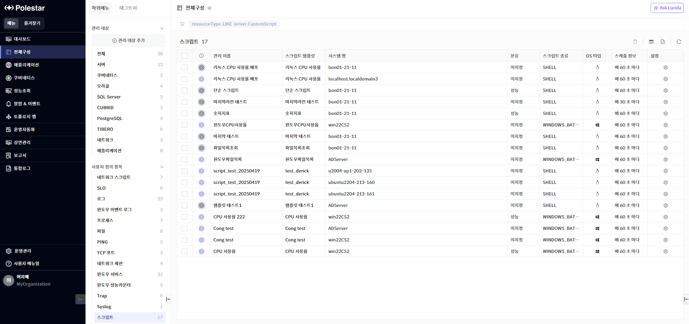
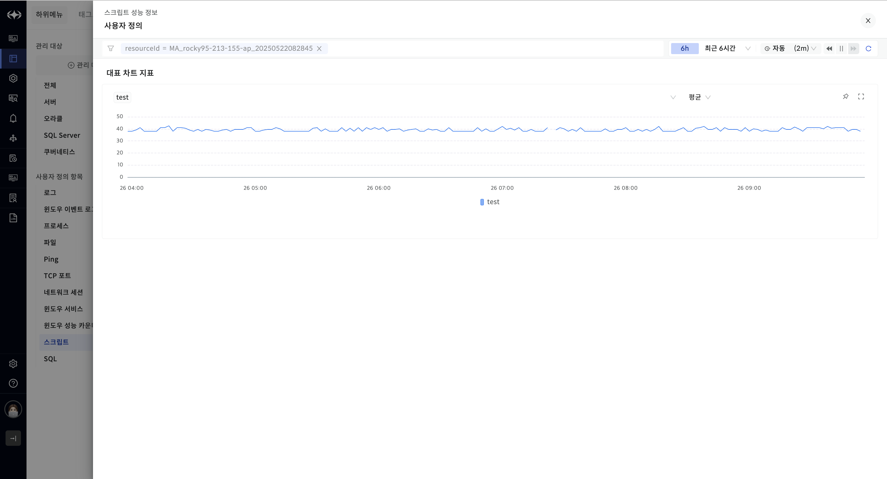
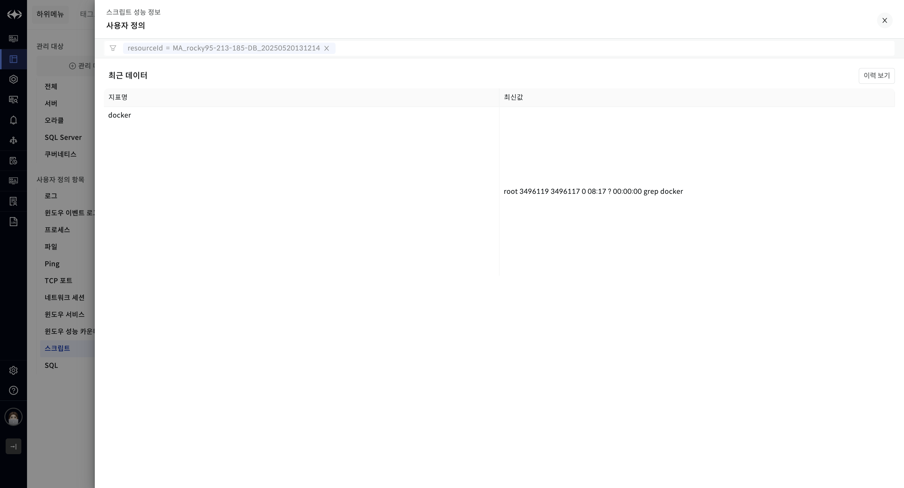
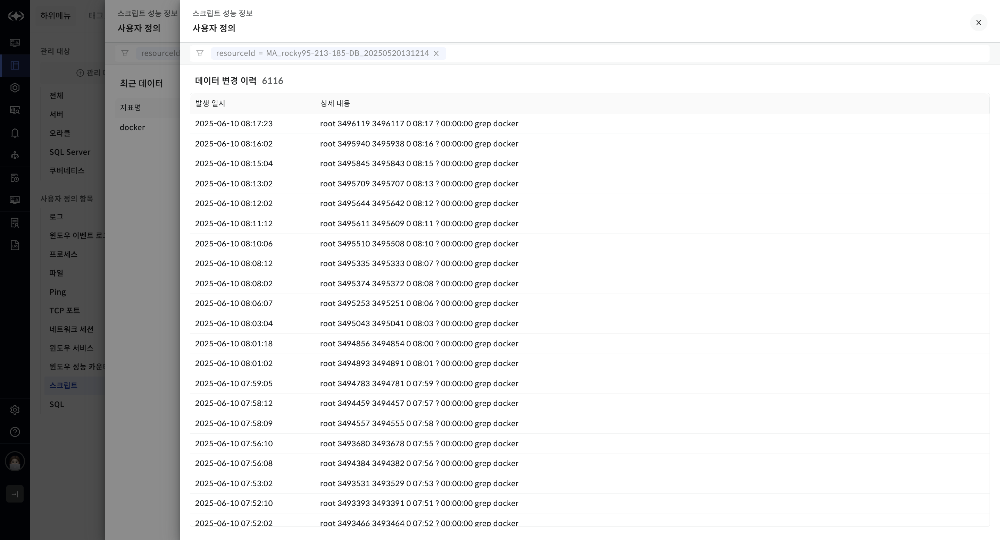
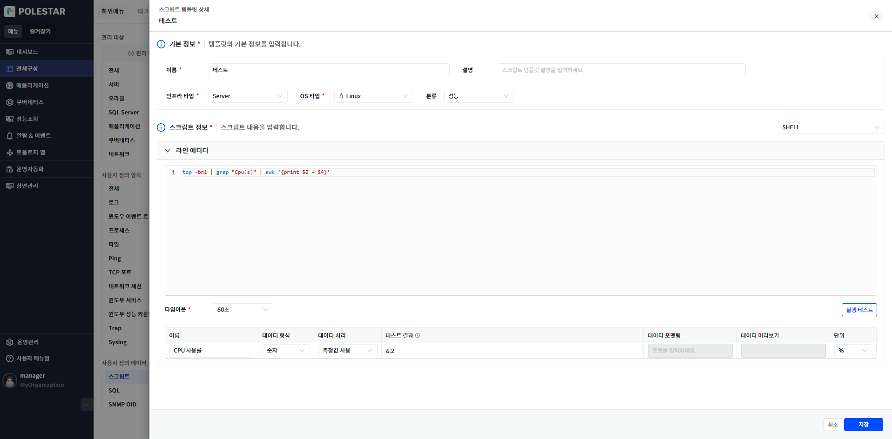
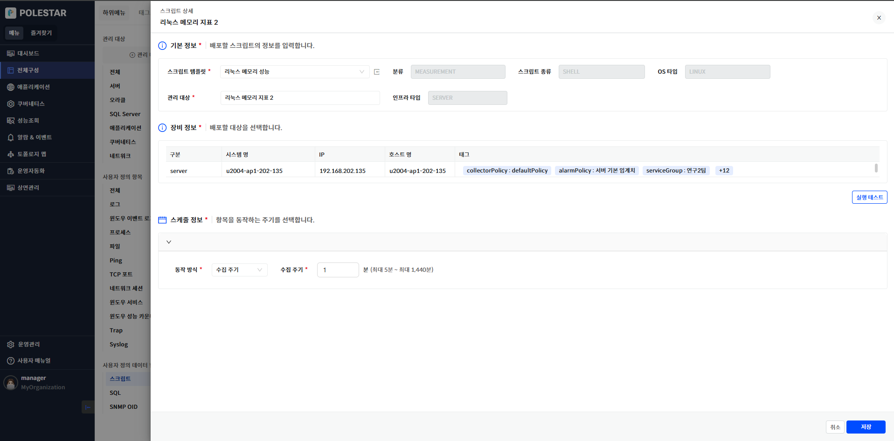
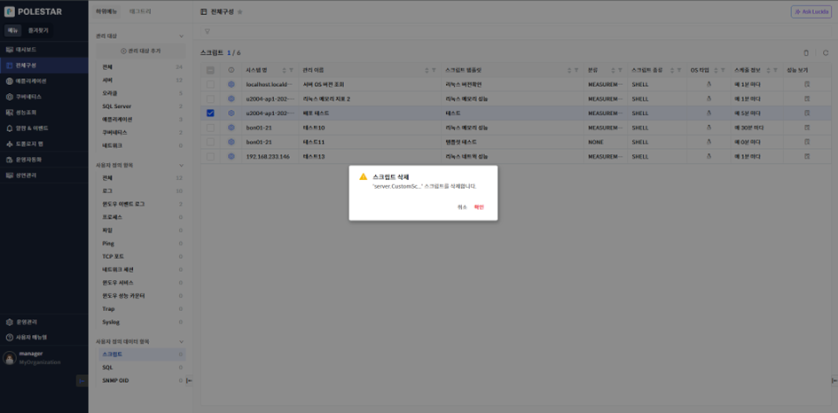
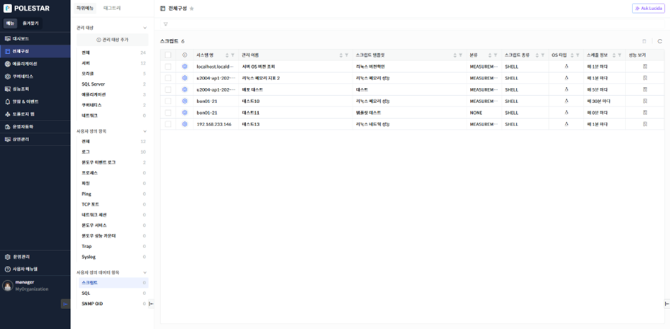

사용자 정의 스크립트 목록

사용자 정의 스크립트 목록을 통해 배포된 사용자 정의 스크립트에 대한 전체 목록을 확인할 수 있습니다. 또한 각 사용자 정의 스크립트 대상별 성능을 조회하거나 배포된 사용자 정의 스크립트의 상세 정보 또는 스크립트 템플릿 정보를 조회해 볼 수 있고 사용자 정의 스크립트를 삭제할 수 있는 기능을 제공합니다.

▶ \[그림1\] 사용자 정의 스크립트 목록

> 사용자 정의 스크립트 목록

<table>
<thead>
<tr class="header">
<th>가용성 아이콘</th>
<th>
해당 사용자 정의 스크립트가 현재 정상 수집되고 있는지 여부를 표시합니다.

<table>
<thead>
<tr class="header">
<th>: 사용자 정의 스크립트 정상 수집 (UP)</th>
</tr>
</thead>
<tbody>
<tr class="odd">
<td>: 사용자 정의 스크립트 비정상 수집 (DOWN)</td>
</tr>
</tbody>
</table></th>
</tr>
</thead>
<tbody>
<tr class="odd">
<td>관리 이름</td>
<td>사용자 정의 SQL 스크립트 등록 시 정의한 이름이 표시됩니다. 관리 이름을 클릭하면 사용자 정의 스크립트 성능 정보를 확인할 수 있는 드로어가 표시됩니다. 해당 드로어에 대한 상세한 내용은 [사용자 정의 스크립트 성능 정보 드로어] 부분을 참조하세요.</td>
</tr>
<tr class="even">
<td>스크립트 템플릿</td>
<td>해당 시스템에 적용된 사용자 정의 스크립트 템플릿 명입니다. 해당 이름을 클릭하면 그에 대한 사용자 정의 스크립트 템플릿 상세 드로어가 표시됩니다.</td>
</tr>
<tr class="odd">
<td>시스템 명</td>
<td>사용자 정의 스크립트 대상 시스템 명을 표시합니다.</td>
</tr>
<tr class="even">
<td>분류</td>
<td>
사용자 정의 스크립트의 분류명입니다. 해당 스크립트의 용도를 표시합니다.

분류 목록: 구성, 성능, 변경, 점검, 동작
</td>
</tr>
<tr class="odd">
<td>스크립트 종류</td>
<td>스크립트 종류를 표시합니다. 스크립트 종류는 OS에 따라 구분됩니다. Unix/Linux 계열은 SHELL, Windows의 경우는 Windows Batch, VB Script, Power Shell중 템플릿 등록 시 선택한 1개가 표시됩니다.</td>
</tr>
<tr class="even">
<td>OS 타입</td>
<td>
사용자 정의 템플릿 선택 시 선택한 OS 타입명이 표시됩니다.

OS 타입 목록: Linux, AIX, HPUX, SUNOS, Windows
</td>
</tr>
<tr class="odd">
<td>스케줄 정보</td>
<td>사용자 정의 스크립트 추가 시 설정한 스케줄 정보가 표시됩니다.</td>
</tr>
<tr class="even">
<td>설정</td>
<td>사용자 정의 스크립트 설정을 확인할 수 있는 사용자 정의 스크립트 상세 드로어가 표시됩니다.</td>
</tr>
</tbody>
</table>

사용자 정의 스크립트 성능 정보 드로어

사용자 정의 스크립트 목록에서 관리 이름 컬럼의 이름을 클릭하면 해당 사용자 정의 스크립트의 성능 정보를 확인할 수 있는 드로어가 표시됩니다. 해당 드로어에서는 지표가 숫자형 일 경우는 타임 셀렉터에 해당하는 기간의 차트가 표시됩니다. 그리고 지표가 문자형 일 경우는 해당 문자 지표의 가장 최근 값을 보여주는 그리드가 표시되며 그리드 우측 상단 이력보기 버튼을 클릭하면 해당 지표에 대한 이력 정보를 확인할 수 있는 드로어가 표시됩니다.

▶ \[그림2\] 사용자 정의 스크립트 성능 정보 드로어 (숫자 지표)

▶ \[그림3\] 사용자 정의 스크립트 성능 정보 드로어 (문자 지표)

▶ \[그림4\] 문자 지표 이력 드로어

사용자 정의 스크립트 템플릿 상세 드로어

사용자 정의 스크립트 목록에서 스크립트 템플릿 컬럼의 이름을 클릭하면 그 이름에 해당하는 사용자 정의 스크립트 템플릿 상세 드로어가 표시됩니다. 해당 드로어에서는 스크립트 템플릿에 대한 상세 정보를 확인할 수 있습니다.

▶ \[그림5\] 사용자 정의 스크립트 템플릿 상세 드로어

사용자 정의 스크립트 상세 드로어

사용자 정의 스크립트 목록에서 설정 컬럼의 아이콘을 클릭하면 스크립트 상세 드로어가 표시됩니다. 해당 드로어에서는 스크립트 배포(추가)에 대한 상세 정보를 확인할 수 있습니다.

▶ \[그림6\] 사용자 정의 스크립트 상세 드로어

사용자 정의 스크립트 삭제

삭제할 사용자 정의 스크립트를 선택하고 \[삭제\] 버튼을 선택하여 사용자 정의 스크립트를 삭제할 수 있습니다.

▶ \[그림7\] 사용자 정의 스크립트 삭제

> 사용자 정의 스크립트 삭제 절차

1.  삭제하고자 하는 사용자 정의 스크립트 선택 (다중 선택 가능)

2.  테이블 우측 상단의 삭제 아이콘 클릭

3.  메시지창에서 확인 클릭

엑셀 저장

사용자 정의 스크립트 목록의 우측 상단 \[엑셀 저장\] 버튼을 통해 사용자 정의 스크립트 목록을 엑셀로 저장할 수 있습니다. 그리드 컬럼 검색 기능 등을 통해 엑셀에 보여줄 컬럼과 내용을 원하는 조건에 맞게 필터링하여 저장할 수 있습니다.

▶ \[그림8\] 사용자 정의 스크립트 목록 엑셀 저장

> 사용자 정의 스크립트 목록 엑셀 저장 및 조회 절차

1.  사용자 정의 스크립트 목록에서 우측 상단 엑셀 저장 아이콘 클릭

2.  브라우저 우측 상단 창에 저장된 엑셀 파일명이 표시됨

3.  해당 파일명을 클릭하여 엑셀 파일 확인

