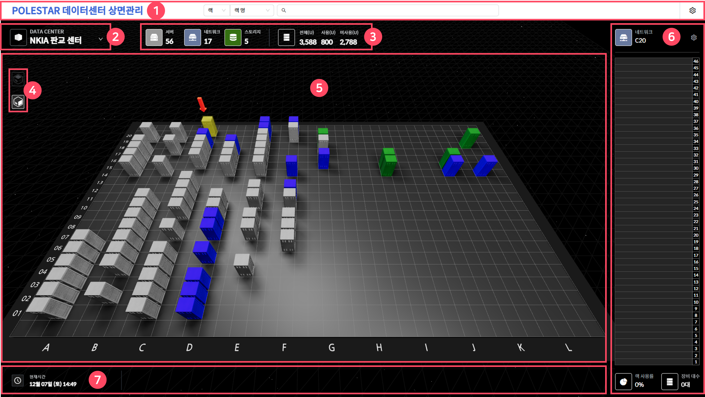
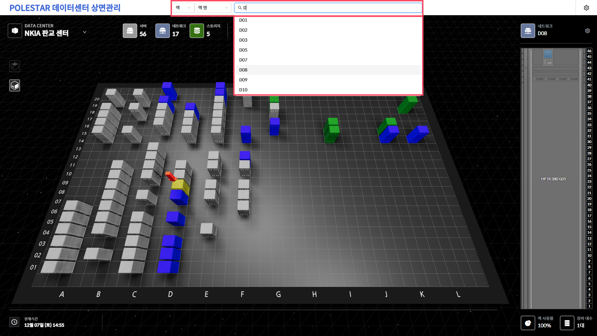
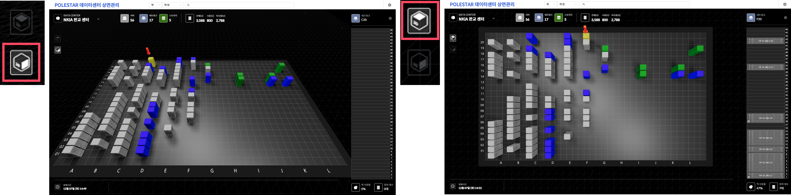
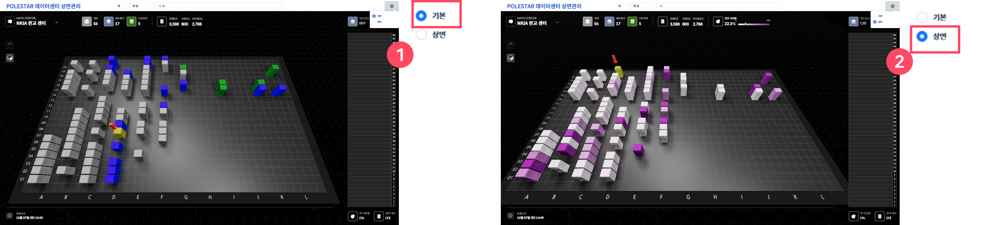
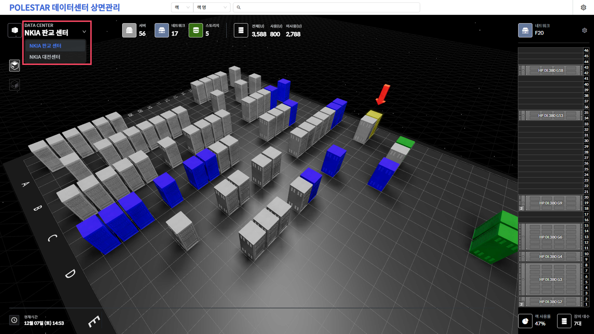
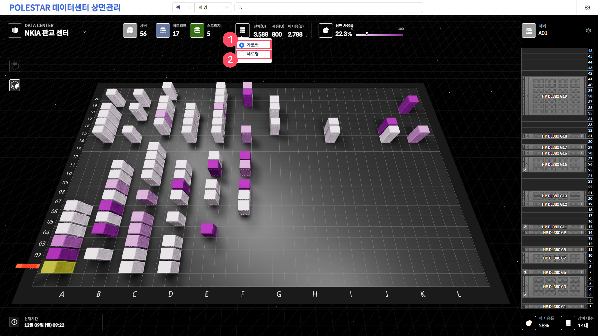
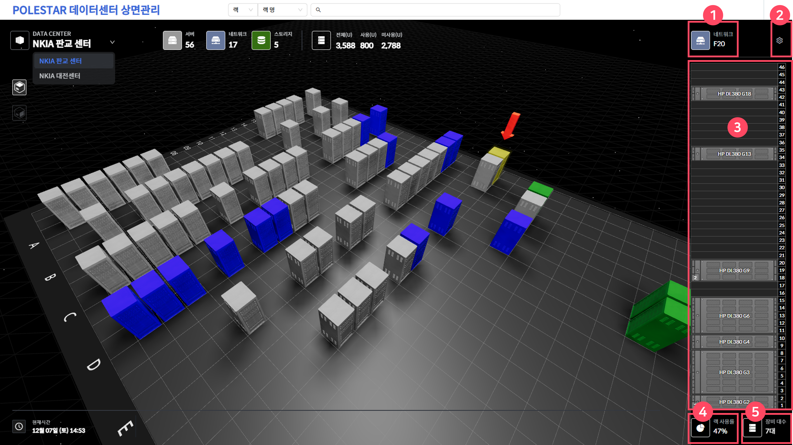
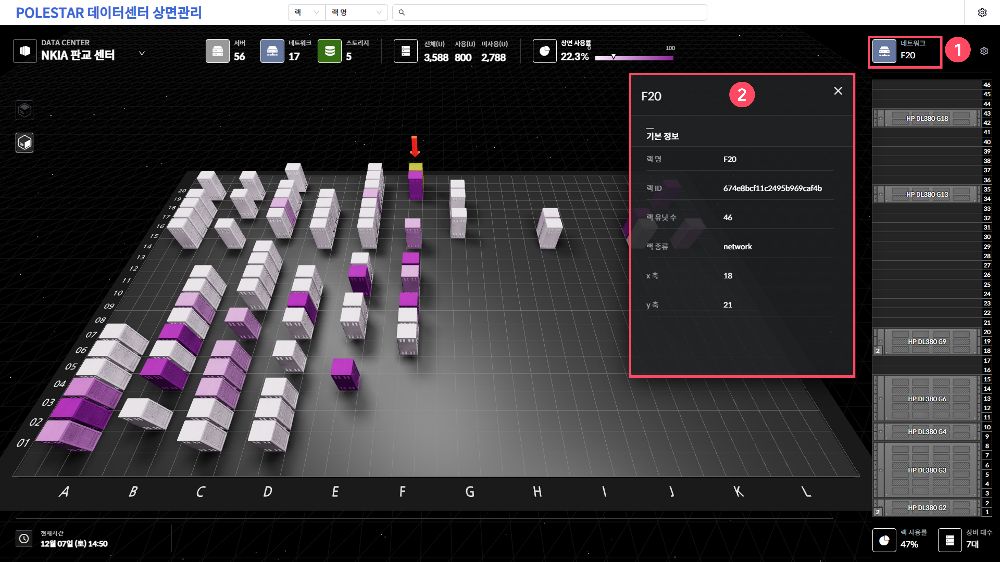
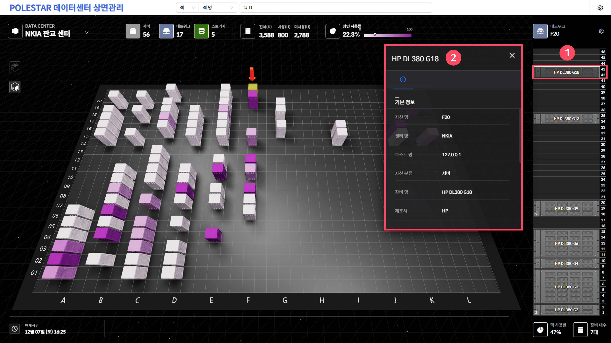
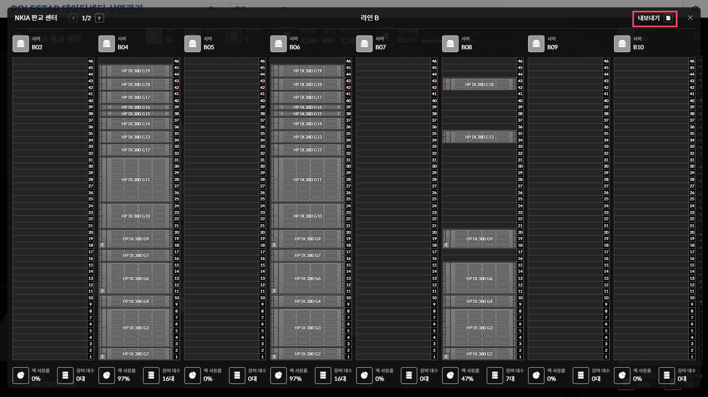

상면관리(뷰)

상면관리(DOMS)는 사용자가 화면을 마우스로 직접 컨트롤 할 수 있는 WebGL 기반의 3D 상면관리 및 모니터링이 가능합니다.

<table>
<tbody>
<tr class="odd">
<td>
노트

상면관리 모니터링은 1920*1080(FHD) 해상도에 최적화되어 있습니다
</td>
</tr>
</tbody>
</table>

주요 화면 구성

상면관리 모니터링을 위한 화면 레이아웃은 다음과 같습니다.

▶ \[그림1\] 상면관리 모니터링 화면 레이아웃

> 상세 정보

| 1\. 상단 바      | 상면 명, 검색 창, 모니터링 모드 변경할 수 있는 기능을 제공합니다.         |
| ------------- | ----------------------------------------------- |
| 2\. 상면 선택 메뉴  | 다수의 상면을 구성했을 경우 개별 상면으로 이동이 가능합니다.              |
| 3\. 상면현황 정보   | 상면구성현황 및 모드에 따른 수량정보를 제공합니다.                    |
| 4\. 카메라 뷰 체인저 | Top View / Optimum View 2가지 모니터링 뷰를 제공합니다.      |
| 5\. 메인 상면 뷰   | 상면현황이 출력되는 메인 화면이며 마우스로 자유롭게 이동 및 확대/축소가 가능합니다. |
| 6\. 사이드 랙     | 선택된 랙의 상세 현황을 보여주는 영역입니다.                       |
| 7\. 현재시간/날짜   | 현재 서버 시간 및 날짜를 제공합니다.                           |

검색기능

다양한 검색조건을 통해 검색기능을 제공하며 랙기준, 장비기준으로 선택하여 검색할 수 있습니다.

<table>
<tbody>
<tr class="odd">
<td>
노트

자동검색기능을 제공하며 검색 조건은 자산정보관리에서 정의한 해당 컬럼 검색여부와 연동됩니다.
</td>
</tr>
</tbody>
</table>

> ▶ \[그림2\] 검색기능

카메라 뷰 변경

두가지의 카메라 뷰를 제공하며, 카메라 뷰 체인저를 이용하여 손쉽게 변경할 수 있습니다.

화면 좌측의 카메라 뷰 체인저를 클릭하여 Top View 또는 Optimum View 로 변경합니다. 최초 접속 시 Default 카메라 뷰는 Optimum View입니다.

> ▶ \[그림3\] 카메라 뷰 체인저

모니터링 모드 변경

모니터링 용도에 따라 모드 변경이 가능하며 범례 및 임계치에 따라 색상을 다르게 표시할 수 있습니다.

우측 상단부의 모드 변경 버튼을 클릭하여 모드를 변경할 수 있습니다.

<table>
<tbody>
<tr class="odd">
<td>
노트

Default 모드는 ‘기본’ 모드입니다.
</td>
</tr>
</tbody>
</table>

> ▶ \[그림4\] 모니터링 모드 변경
> 
> 상세 정보

| 1\. 기본 | 랙 타입별 구성현황 표시, 랙 타입별 색상으로 구분할 수 있습니다                                 |
| ------ | -------------------------------------------------------------------- |
| 2\. 상면 | 랙 상면율 기준으로 전체 유닛, 사용/미사용 유닛 카운트, 사용률 표시, 사용률 범례에 따른 색상으로 구분할 수 있습니다. |

상면(데이터센터) 변경

복수 개의 데이터 센터 상면을 모니터링 할 수 있으며, 센터 간의 이동을 손쉽게 할 수 있습니다.

이동할 수 있는 데이터 센터의 리스트를 확인할 수 있고 클릭하여 해당 센터의 상면으로 이동할 수 있습니다.

> ▶ \[그림5\] 상면(데이터센터) 변경하기

전체 랙 현황 다운로드

전체 랙 현황을 엑셀파일로 다운로드 받을 수 있습니다.

<table>
<tbody>
<tr class="odd">
<td>
노트

랙 사용현황 아이콘 마우스 호버 시 전체 랙 현황을 가로 및 세로 기준으로 다운로드 받을 것인지를 선택하고 다시 랙 사용현황 아이콘을 클릭하면 선택한 기준의 전체 랙 현황을 엑셀파일로 다운로드 받을 수 있습니다.
</td>
</tr>
</tbody>
</table>

> ▶ \[그림6\] 전체 랙 현황 다운로드
> 
> 상세 정보

| 1\. 가로형 | 엑셀 다운로드 시 Y축 기준으로 하단 그룹 탭이 생성됩니다. |
| ------- | --------------------------------- |
| 2\. 세로형 | 엑셀 다운로드 시 X축 기준으로 하단 그룹 탭이 생성됩니다. |

랙 현황(사이드 랙)

개별 랙을 클릭하면 툴팁을 통해 해당 랙의 이름을 확인할 수 있으며 우측 사이드랙에서는 해당 랙의 상세 현황을 확인할 수 있습니다.

> ▶ \[그림7\] 모니터링 모드 변경
> 
> 상세 정보

<table>
<thead>
<tr class="header">
<th>1. 랙 요약정보</th>
<th>랙 타입 및 랙 이름을 제공합니다. 랙 아이콘 선택 시 해당 랙의 상세 속성정보가 팝업창으로 표시됩니다.</th>
</tr>
</thead>
<tbody>
<tr class="odd">
<td>2. 랙표시 설정버튼</td>
<td>우측 설정 버튼(톱니바퀴) 클릭 시 화면에 디스플레이 되는 장비 옵션(텍스트/이미지)을 On/Off로 설정할 수 있습니다.</td>
</tr>
<tr class="even">
<td>3. 랙 실장도</td>
<td>실제 랙의 홀에 장비가 탑재되어 있는 현황 그대로를 출력하며 해당 장비 클릭 시 해당 장비의 정보 팝업 창 표시됩니다.</td>
</tr>
<tr class="odd">
<td>4. 랙 사용률</td>
<td>
현재 해당 랙의 상면율을 제공합니다.

* 랙 사용률 아이콘 선택 시 해당 랙의 탑재된 장비현황을 엑셀파일로 다운로드 받을 수 있습니다.
</td>
</tr>
<tr class="even">
<td>5. 장비 대수</td>
<td>현재 해당 랙에 탑재되어 있는 장비수량을 제공합니다.</td>
</tr>
</tbody>
</table>

랙 속성정보

선택된 랙의 속성정보를 제공합니다. 랙 속성정보는 사전에 자산정보관리 컬럼정의에서 확정된 정보를 기준으로 합니다.

> ▶ \[그림8\] 랙 속성정보
> 
> 상세 정보

| 1\. 랙 요약정보 | 랙 타입 및 랙 이름을 제공합니다. 랙 아이콘 선택 시 해당 랙의 상세 속성정보가 팝업창으로 표시됩니다. |
| ---------- | ---------------------------------------------------------- |
| 2\. 랙 속성정보 | 랙명과 랙의 속성(기본)정보를 제공합니다.                                    |

장비 속성정보

선택된 장비의 속성정보를 제공합니다. 장비 속성정보는 사전에 자산정보관리 컬럼정의에서 확정된 정보를 기준으로 합니다.

> ▶ \[그림9\] 장비 속성정보
> 
> 상세 정보

| 1\. 장비 요약정보 | 랙 타입 및 랙 이름을 제공합니다. 랙 아이콘 선택 시 해당 랙의 상세 속성정보가 팝업창으로 표시됩니다. |
| ----------- | ---------------------------------------------------------- |
| 2\. 장비 속성정보 | 장비명과 장비의 속성(기본)정보를 제공합니다.                                  |

2D행/열 상면현황

상면 바닥의 행/열 라인번호를 선택하면 선택된 행/열의 전체 상면현황을 2D화면으로 제공합니다.

<table>
<tbody>
<tr class="odd">
<td>
노트

우측 상단 내보내기 버튼 선택 시 화면에 보이는 2D 상면현황과 동일한 엑셀파일을 다운로드할 수 있습니다.
</td>
</tr>
</tbody>
</table>

> ▶ \[그림10\] 2D 행/열 상면현황

