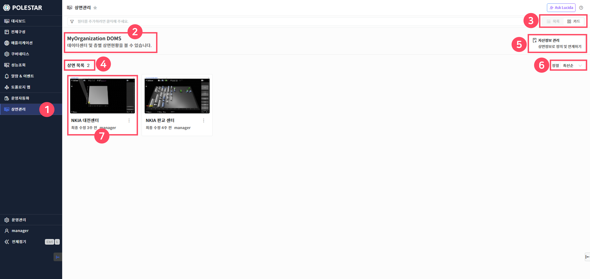
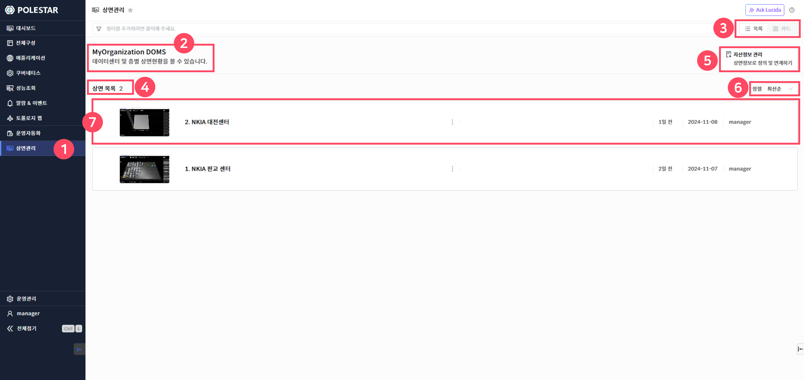
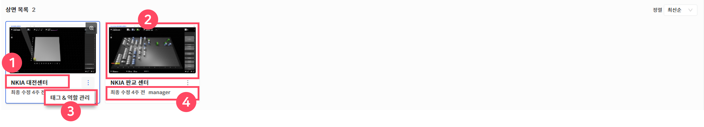
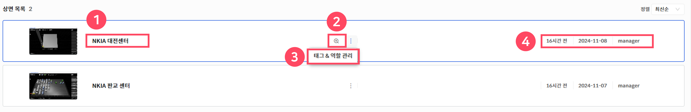

상면 목록

메인 메뉴의 상면관리를 선택하면 상면 목록을 확인할 수 있습니다.

상면 목록은 목록형을 기본으로 제공하며 카드형을 선택할 수 있으며 각 상면목록 클릭 시 선택된 상면이 팝업으로 생성됩니다.

POLESTAR DOMS(상면) 도입 시 고객사 데이터센터(전산실)에 최적화된 상면관리를 개발하여 개발이 완료되면 상면목록에 추가됩니다.

<table>
<tbody>
<tr class="odd">
<td>
노트

사전에 제작된 상면을 목록에 추가해야만 상면 목록에 출력됩니다.
</td>
</tr>
</tbody>
</table>

> ▶ \[그림1\] 상면목록 (카드형)

> ▶ \[그림2\] 상면목록 (목록형)
> 
> 상세 정보

<table>
<thead>
<tr class="header">
<th>1. 상면관리 메뉴</th>
<th>메인 메뉴에서 상면관리를 선택하면 상면 목록을 확인할 수 있습니다.</th>
</tr>
</thead>
<tbody>
<tr class="odd">
<td>2. 조직정보</td>
<td>로그인 시 선택한 사용자의 조직명을 제공합니다. (로그인 시 소속된 조직이 1개일 경우, 조직을 선택하지 않아도 자동으로 조직이 선택되어 해당 조직명을 제공합니다.)</td>
</tr>
<tr class="even">
<td>3. 목록보기 선택</td>
<td>상면 목록을 목록형 또는 카드형 중 선택하여 불러올 수 있습니다.</td>
</tr>
<tr class="odd">
<td>4. 상면 목록</td>
<td>현재 불러온 상면 목록 수를 제공합니다.</td>
</tr>
<tr class="even">
<td>5. 자산정보 관리</td>
<td>
상면 모니터링을 위해 상면정보를 정의하고 연계된 자산데이터를 관리하는 화면입니다.

* 해당 기능은 manager 권한이 부여된 사용자에게만 활성화됩니다.
</td>
</tr>
<tr class="odd">
<td>6. 정렬</td>
<td>
상면 목록을 최신순, 과거순, 이름순으로 정렬합니다.

최신순 : 상면 배포일을 기준으로 최신 배포기준으로 정렬

과거순 : 상면 배포일을 기준으로 과거 배포기준으로 정렬

이름순 : 상면 명 알파벳(A-Z), 한글 명(ㄱ-ㅎ) 순으로 정렬
</td>
</tr>
<tr class="even">
<td>7. 상면 세부정보</td>
<td>각 상면 명(데이터센터명), 배포시간, 등록자에 대한 정보를 제공합니다.</td>
</tr>
</tbody>
</table>

상면 상세 목록

각 상면 목록 상세정보를 참조하여 모니터링 할 상면을 클릭해서 실행할 수 있습니다.

> ▶ \[그림3\] 상면 목록 상세정보 (카드형)

> ▶ \[그림4\] 상면 목록 상세정보 (목록형)
> 
> 상세 정보

<table>
<thead>
<tr class="header">
<th>1. 상면 명</th>
<th>상면 명(데이터센터명)을 확인할 수 있습니다.</th>
</tr>
</thead>
<tbody>
<tr class="odd">
<td>2. 미리보기</td>
<td>마우스 호버시 돋보기 아이콘이 제공되며 선택된 상면의 썸네일 화면을 확대하여 볼 수 있습니다.</td>
</tr>
<tr class="even">
<td>3. 편집/역할관리</td>
<td>
마우스 호버시 태그&amp;역할관리 화면 바로가기 기능을 제공합니다

태그&amp;역할관리 : 상면 태그&amp;역할관리 화면 드로우 생성

* 계정에 부여된 권한에 따라 해당 “태그&amp;역할관리” 버튼이 화면에서 미 출력 될 수 있습니다.
</td>
</tr>
<tr class="odd">
<td>4. 상면 세부정보</td>
<td>해당 상면의 배포일, 등록일자, 등록자에 대한 정보를 제공합니다.</td>
</tr>
</tbody>
</table>

<table>
<tbody>
<tr class="odd">
<td>
주의

고객사 데이터센터(전산실)에 맞는 상면관리를 위해 사전에 협의를 통해 상면을 구축하게 되고 개발이 완료되면 상면목록에 출력됩니다.
</td>
</tr>
</tbody>
</table>

