서비스수준관리 – 서비스수준목표

메뉴에서 \[서비스수준관리\] 선택 후 \[서비스수준목표\] 탭을 선택하면, 서비스수준목표를 조회할 수 있는 화면으로 이동되며 목록 조회, 상세 조회 및 신규 등록이 가능합니다.

<table>
<tbody>
<tr class="odd">
<td>
노트

서비스수준목표 탭은 사용 권한이 있는 경우에만 표시되는 탭입니다.

서비스수준목표 최초 진입 시, 화면 지표 및 데이터를 조회할 수 있습니다.
</td>
</tr>
</tbody>
</table>

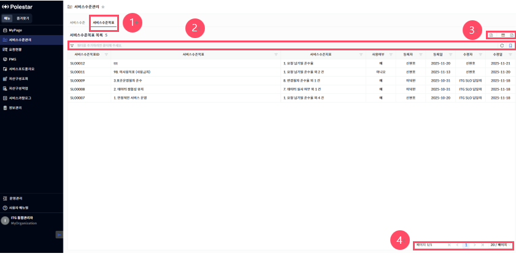

> ▶ \[그림1\] 서비스수준목표 목록
> 
> 화면 지표

<table>
<thead>
<tr class="header">
<th>서비스수준목표ID</th>
<th>서비스수준목표의 고유식별을 위한 ID 값입니다.</th>
</tr>
</thead>
<tbody>
<tr class="odd">
<td>서비스수준목표</td>
<td>서비스수준목표를 식별할 수 있는 명칭입니다.</td>
</tr>
<tr class="even">
<td>서비스수준지표</td>
<td>서비스수준목표에 설정된 서비스수준지표를 표시합니다.</td>
</tr>
<tr class="odd">
<td>사용여부</td>
<td>
서비스수준목표의 사용여부를 표시합니다.

- 예: 서비스카탈로그의 서비스수준목표 등록에 사용합니다.

- 아니오: 서비스카탈로그의 서비스수준목표 등록에 사용하지 않습니다.
</td>
</tr>
<tr class="even">
<td>등록자/등록일</td>
<td>서비스수준목표를 최초로 등록한 등록자와 일자 정보입니다.</td>
</tr>
<tr class="odd">
<td>수정자/수정일</td>
<td>서비스수준목표를 마지막으로 수정한 등록자와 일자 정보입니다.</td>
</tr>
</tbody>
</table>

> 상세 정보

<table>
<thead>
<tr class="header">
<th>[그림1].”1” 
서비스수준목표 탭</th>
<th>서비스수준목표 목록 화면을 조회할 수 있는 탭입니다.</th>
</tr>
</thead>
<tbody>
<tr class="odd">
<td>[그림1].”2” 
그리드 필터</td>
<td>그리드 필터는 상단 행(필터 행)을 통해 각 컬럼 단위로 상세한 조건 검색이 가능한 기능입니다.</td>
</tr>
<tr class="even">
<td>[그림1].”3” 
신규등록 &amp; 컬럼수정 &amp; 엑셀저장 버튼</td>
<td>
서비스수준목표를 신규등록 할 수 있는 버튼,

표시할 컬럼을 선택하거나 숨길 수 있는 설정 기능을 제공하는 컬럼수정 버튼과, 현재 화면에 표시된 데이터를 엑셀파일로 다운로드 하는 기능을 제공하는 엑셀저장 버튼입니다.
</td>
</tr>
<tr class="odd">
<td>[그림1].”4” 
페이징</td>
<td>목록 데이터를 구간별로 나누어 페이지 단위로 조회할 수 있도록 도와주는 기능입니다.</td>
</tr>
</tbody>
</table>

서비스수준목표 상세

서비스수준목표 목록에서 서비스수준목표(서비스수준목표ID, 서비스수준목표)를 클릭하면, 상세화면(드로어)이 열립니다.

서비스수준목표에 사용될 서비스수준지표의 추가/제거 및 세부 설정을 하는 메뉴입니다.

<table>
<tbody>
<tr class="odd">
<td>
노트

서비스수준목표의 적용여부가 예인 경우에는 서비스수준지표의 세부 설정이 불가하고 조회만 가능합니다.
</td>
</tr>
</tbody>
</table>

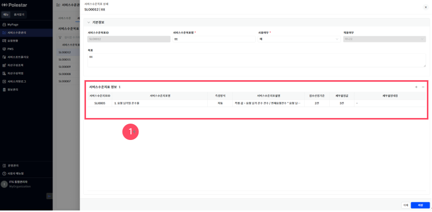

▶ \[그림2\] 서비스수준목표 상세 화면(드로어)

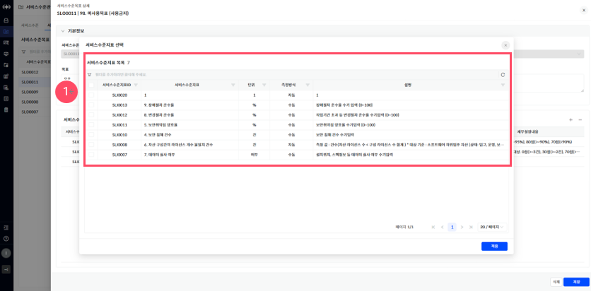

▶ \[그림3\] 서비스수준목표의 상세화면에서 서비스수준지표의 추가 시 화면

> 화면 지표(기본정보)

서비스수준목표에 등록된 기본정보 항목들의 필드가 표시됩니다.

<table>
<thead>
<tr class="header">
<th>서비스수준목표ID</th>
<th>서비스수준목표의 고유식별을 위한 ID 값입니다. 최초 저장 시 자동으로 채번됩니다.</th>
</tr>
</thead>
<tbody>
<tr class="odd">
<td>서비스수준목표명</td>
<td>서비스수준목표를 식별할 수 있는 명칭입니다.</td>
</tr>
<tr class="even">
<td>사용여부</td>
<td>
서비스수준목표의 사용여부를 표시합니다.

- 예: 서비스카탈로그의 서비스수준목표 등록에 사용합니다.

- 아니오: 서비스카탈로그의 서비스수준목표 등록에 사용하지 않습니다.
</td>
</tr>
<tr class="odd">
<td>적용여부</td>
<td>
서비스카탈로그에서 서비스수준목표의 적용여부를 표시합니다.

- 예: 서비스카탈로그에 적용되어 사용 중인 상태입니다.

- 아니오: 적용된 서비스카탈로그가 없는 상태입니다.
</td>
</tr>
<tr class="even">
<td>목표</td>
<td>서비스수준목표의 목표를 정의하고 표시합니다.</td>
</tr>
</tbody>
</table>

> 화면 지표(서비스수준지표정보)

서비스수준목표에 사용될 서비스수준지표의 추가/제거가 가능하며 서비스수준지표의 상세 설정 화면이 표시됩니다.

<table>
<thead>
<tr class="header">
<th>서비스수준지표ID</th>
<th>서비스수준지표의 고유식별을 위한 ID 값입니다.</th>
</tr>
</thead>
<tbody>
<tr class="odd">
<td>서비스수준지표명</td>
<td>서비스수준지표를 식별할 수 있는 명칭입니다.</td>
</tr>
<tr class="even">
<td>측정방식</td>
<td>
서비스수준지표의 측정방식을 표시합니다.

- 자동: 평가주기에 맞춰 측정값이 자동으로 입력되는 지표입니다.

- 수동: 평가주기마다 측정값을 직접 입력하는 지표입니다.
</td>
</tr>
<tr class="odd">
<td>서비스수준지표설명</td>
<td>서비스수준지표의 상세 설명을 표시합니다.</td>
</tr>
<tr class="even">
<td>점수산정기준</td>
<td>서비스수준지표의 점수를 산정하기 위한 기준을 표시합니다.</td>
</tr>
<tr class="odd">
<td>세부설정 값</td>
<td>서비스수준지표의 세부 설정 값의 정보를 표시합니다.</td>
</tr>
<tr class="even">
<td>세부설정내용</td>
<td>서비스수준지표의 세부설정내용에 대한 정보를 표시합니다.</td>
</tr>
</tbody>
</table>

> 상세 정보

<table>
<thead>
<tr class="header">
<th>[그림2].”1” 
서비스수준지표정보</th>
<th>서비스수준목표에 적용될 서비스수준지표의 추가/제거가 가능하며 서비스수준지표의 세부설정 등을 하는 기능을 제공합니다.</th>
</tr>
</thead>
<tbody>
<tr class="odd">
<td>[그림3].”1” 
서비스수준지표정보</td>
<td>서비스수준목표에 추가 가능한 서비스수준지표 목록을 표시합니다. 추가할 서비스수준지표를 선택하고 적용버튼을 클릭하여 추가합니다.</td>
</tr>
</tbody>
</table>

> 서비스수준목표 등록 절차

1.  서비스수준목표 목록에서 \[신규 등록\] 버튼을 클릭합니다.

2.  서비스수준목표 등록화면의 기본정보에서 필수 항목 (\[  \]모양의 표식이 되어있는 항목)을 입력합니다.

3.  서비스수준지표 정보의 \[추가\]버튼을 클릭하여 서비스수준지표 선택 팝업창에서 추가할 서비스수준지표를 선택 후 \[적용\]버튼을 클릭합니다.

4.  서비스수준목표 등록화면 우측 하단의 \[저장\]버튼을 클릭합니다.

서비스수준관리 – 서비스수준

메뉴에서 \[서비스수준관리\] 선택 후 \[서비스수준\] 탭을 선택하면, 서비스수준을 조회할 수 있는 화면으로 이동됩니다.

서비스수준의 신규 등록, 상세 조회 및 수정, 목록 조회가 가능하며 서비스수준의 평가/평가에 대한 결과 조회, 종합현황 보기 등의 기능을 제공합니다.

<table>
<tbody>
<tr class="odd">
<td>
노트

서비스수준의 상태가 기획인 경우에는 조회/평가가 불가하며 종료인 경우에는 조회만 가능합니다.

서비스수준의 권한에 따라 서비스수준목록에 목록리스트가 상이하게 표시되며 평가와 조회 또한 권한에 따라 상이합니다.
</td>
</tr>
</tbody>
</table>

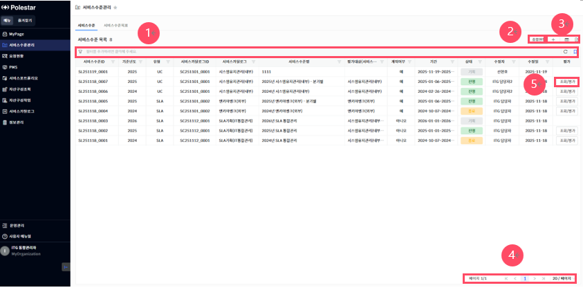

> ▶ \[그림4\] 서비스수준 목록
> 
> 화면 지표

<table>
<thead>
<tr class="header">
<th>서비스수준ID</th>
<th>서비스수준의 고유식별을 위한 ID 값입니다.</th>
</tr>
</thead>
<tbody>
<tr class="odd">
<td>기준년도</td>
<td>서비스수준의 시작일을 기준으로, 기준년도를 표시합니다.</td>
</tr>
<tr class="even">
<td>유형</td>
<td>
서비스수준의 유형정보를 표시합니다.

- SLA: 서비스 제공자와 고객 간의 계약입니다.

- OLA: SLA를 달성하기 위한 내부 부서 간의 약속입니다.

- UC: SLA보장하기 위한 외부 공급업체와의 계약입니다.
</td>
</tr>
<tr class="odd">
<td>서비스카탈로그ID</td>
<td>서비스수준의 서비스카탈로그ID의 고유식별을 위한 ID 값입니다.</td>
</tr>
<tr class="even">
<td>서비스카탈로그</td>
<td>서비스수준의 서비스카탈로그를 식별할 수 있는 명칭입니다.</td>
</tr>
<tr class="odd">
<td>서비스수준명</td>
<td>서비스수준을 식별할 수 있는 명칭입니다.</td>
</tr>
<tr class="even">
<td>
평가대상

(서비스카탈로그)
</td>
<td>서비스수준에 설정된 평가대상의 서비스카탈로그 정보를 표시합니다.</td>
</tr>
<tr class="odd">
<td>계약여부</td>
<td>
서비스수준의 계약여부 정보를 표시합니다.

- 예: 서비스수준 정보가 공식적인 계약에 포함됩니다.

- 아니오: 서비스 개선이나 내부 관리용으로, 공식 계약에 포함되지 않습니다.
</td>
</tr>
<tr class="even">
<td>기간</td>
<td>서비스수준의 기간 정보를 표시합니다.</td>
</tr>
<tr class="odd">
<td>상태</td>
<td>
서비스수준의 상태를 표시합니다.

- 기획: 서비스수준을 최초로 등록한 초기 상태입니다. 서비스수준을 정의하고, 목표를 설정하는 준비 단계에 해당합니다.

- 진행: 서비스수준이 실제 운영에 적용된 상태입니다. 설정된 서비스수준에 따라 지표측정 및 평가를 수행하는 실행 단계에 해당합니다.

- 종료: 서비스수준의 최종 평가가 종료된 상태입니다.
</td>
</tr>
<tr class="even">
<td>수정자/수정일</td>
<td>서비스수준을 마지막으로 수정한 사용자와 일자 정보입니다.</td>
</tr>
<tr class="odd">
<td>평가</td>
<td>서비스수준을 조회/평가하는 메뉴로 이동하는 버튼입니다.</td>
</tr>
</tbody>
</table>

> 상세 정보

<table>
<thead>
<tr class="header">
<th>[그림4].”1” 
그리드 필터</th>
<th>그리드 필터는 상단 행(필터 행)을 통해 각 컬럼 단위로 상세한 조건 검색이 가능한 기능입니다.</th>
</tr>
</thead>
<tbody>
<tr class="odd">
<td>[그림4].”2” 
종합현황 버튼</td>
<td>서비스수준의 종합현황 및 차트를 표시하는 메뉴로 이동하는 버튼입니다.</td>
</tr>
<tr class="even">
<td>[그림4].”3” 
신규등록 &amp; 컬럼수정 &amp; 엑셀저장 버튼</td>
<td>
서비스수준을 신규등록 할 수 있는 버튼,

표시할 컬럼을 선택하거나 숨길 수 있는 설정 기능을 제공하는 컬럼수정 버튼과 현재 화면에 표시된 데이터를 엑셀파일로 다운로드 하는 기능을 제공하는 엑셀저장 버튼입니다.
</td>
</tr>
<tr class="odd">
<td>[그림4].”4” 
페이징</td>
<td>목록 데이터를 구간별로 나누어 페이지 단위로 조회할 수 있도록 도와주는 기능입니다.</td>
</tr>
<tr class="even">
<td>[그림4].”5” 
조회/평가 버튼</td>
<td>서비스수준의 측정 주기별로 조회 및 평가할 수 있는 메뉴로 이동합니다.</td>
</tr>
</tbody>
</table>

서비스수준 상세

서비스수준 목록에서 서비스수준(서비스수준ID, 서비스수준명)을 클릭하면, 상세화면(드로어)이 열립니다. 서비스수준의 상세정보 조회 및 세부설정을 하는 메뉴입니다.

<table>
<tbody>
<tr class="odd">
<td>
노트

서비스수준을 신규등록 하게 되면 상태는 최초 “기획” 단계로 고정이며, 전체 정보에 대해 수정이 가능합니다.

서비스수준의 상태가 “진행”인 경우에는 수정할 수 있는 정보가 제한적이며, “종료”인 경우에는 조회만 가능합니다.

[평가대상설정 유지여부]는 [평가대상]이 여러 개인 경우, 값이 “아니오”로 고정됩니다.
</td>
</tr>
</tbody>
</table>

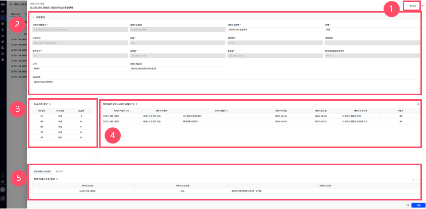

▶ \[그림5\] 서비스수준 상세 화면(드로어)

> 화면 지표(기본정보)

서비스수준에 등록된 기본정보 항목들의 필드가 표시됩니다.

<table>
<thead>
<tr class="header">
<th>서비스카탈로그</th>
<th>서비스수준의 서비스카탈로그를 선택하고 표시합니다.</th>
</tr>
</thead>
<tbody>
<tr class="odd">
<td>서비스수준ID</td>
<td>서비스수준의 고유식별을 위한 ID 값입니다. 최초 저장 시 자동으로 채번됩니다.</td>
</tr>
<tr class="even">
<td>서비스수준명</td>
<td>서비스수준을 식별할 수 있는 명칭입니다.</td>
</tr>
<tr class="odd">
<td>상태</td>
<td>
서비스수준의 상태(기획, 진행, 종료)를 선택하고 표시합니다.

- 기획: 서비스수준을 최초로 등록한 초기 상태입니다. 서비스수준을 정의하고, 목표를 설정하는 준비 단계에 해당합니다.

- 진행: 서비스수준이 실제 운영에 적용된 상태입니다. 설정된 서비스수준에 따라 지표측정 및 평가를 수행하는 실행 단계에 해당합니다.

- 종료: 서비스수준의 최종 평가가 종료된 상태입니다.
</td>
</tr>
<tr class="even">
<td>담당부서</td>
<td>
서비스수준의 담당부서를 표시합니다.

서비스수준을 등록하는 담당자의 담당부서로 고정됩니다.
</td>
</tr>
<tr class="odd">
<td>유형</td>
<td>
서비스수준의 유형정보(SLA, OLA, UC)를 선택하고 표시합니다.

- SLA: 서비스 제공자와 고객 간의 계약입니다.

- OLA: SLA를 달성하기 위한 내부 부서 간의 약속입니다.

- UC: SLA보장하기 위한 외부 공급업체와의 계약입니다.
</td>
</tr>
<tr class="even">
<td>계약여부</td>
<td>서비스수준의 계약여부를 선택하고 표시합니다.</td>
</tr>
<tr class="odd">
<td>계약정보</td>
<td>서비스수준의 계약정보를 선택하고 표시합니다.</td>
</tr>
<tr class="even">
<td>평가주기</td>
<td>서비스수준의 평가주기를 선택하고 표시합니다.</td>
</tr>
<tr class="odd">
<td>시작일/종료일</td>
<td>
서비스수준의 시작일과 종료일을 입력하고 표시합니다.

평가대상 카탈로그의 서비스시작일과 종료일의 범위내에서만 설정이 가능합니다.
</td>
</tr>
<tr class="even">
<td>
평가대상설정

유지여부
</td>
<td>
서비스수준의 평가대상정보의 설정정보의 유지여부를 선택하고 표시합니다.

- 예: 서비스수준의 등급기준정보를 서비스카탈로그의 등급기준정보와 동일하게 유지하고, 평가대상설정 정보를 서비스카탈로그의 서비스수준목표 설정 정보와 동일하게 유지합니다.

- 아니오: 서비스수준의 등급기준정보나 평가대상설정 정보를 서비스카탈로그와 동일하게 유지하지 않습니다.
</td>
</tr>
<tr class="odd">
<td>
고객/서비스제공자

/공급업체/수요부서

/제공부서
</td>
<td>
서비스수준의 유형에 따라 서비스수준 대상자를 표시합니다.

- SLA: 고객, 서비스제공자

- OLA: 수요부서, 제공부서

- UC: 서비스제공자, 공급업체
</td>
</tr>
<tr class="even">
<td>SLA내용</td>
<td>서비스수준협약의 내용에 대해서 입력하고 표시합니다.</td>
</tr>
</tbody>
</table>

> 화면 지표(등급기준정보)

서비스수준의 등급기준 정보를 설정하고 표시합니다. 서비스수준 상태가 기획인 경우에만 설정이 가능하고 진행, 종료인 경우에는 설정이 불가합니다.

<table>
<thead>
<tr class="header">
<th>기준점수</th>
<th>
서비스수준의 평가 결과에 대한 기준점수를 입력하고 표시합니다.

최하점수의 기준점수와 최하점수 바로 위 단계의 기준점수는 동일해야 합니다.
</th>
</tr>
</thead>
<tbody>
<tr class="odd">
<td>비교유형</td>
<td>서비스수준의 비교유형을 표시하며 최하 기준점수의 비교유형은 미만, 그 외의 기준점수는 이상으로 표시합니다.</td>
</tr>
<tr class="even">
<td>등급명</td>
<td>기준점수와 비교유형을 고려하여 등급명을 입력하고 표시합니다.</td>
</tr>
</tbody>
</table>

> 화면 지표(평가대상정보)

서비스수준을 평가할 대상의 서비스카탈로그 목록을 표시합니다. 서비스수준의 상태가 기획인 경우에만 설정이 가능하고 진행, 종료인 경우에는 조회만 가능합니다.

| 서비스카탈로그ID   | 평가 대상 서비스카탈로그의 고유식별을 위한 ID 값입니다.   |
| ----------- | ---------------------------------- |
| 서비스도메인      | 평가 대상 서비스카탈로그의 서비스도메인을 표시합니다.      |
| 서비스카탈로그     | 평가 대상 서비스카탈로그를 표시합니다.              |
| 서비스 시작일/종료일 | 평가대상 서비스카탈로그의 서비스 시작일과 종료일을 표시합니다. |
| 서비스수준목표     | 평가대상 서비스카탈로그의 서비스수준목표 정보를 표시합니다.   |
| 가중치         | 평가대상 서비스카탈로그의 가중치 정보를 표시합니다.       |

> 화면 지표(추가정보(탭))

추가정보(탭)을 표시합니다.

| 연관서비스수준정보 | 서비스수준과 연관되어 있는 서비스수준정보를 표시합니다.                 |
| --------- | ---------------------------------------------- |
| 첨부파일      | 서비스수준 협약서, 체결서, 계약서 등의 서비스수준과 관련된 첨부파일을 표시합니다. |

> 상세 정보

<table>
<thead>
<tr class="header">
<th>[그림5].”1” 
댓글 버튼</th>
<th>버튼 클릭을 통해 서비스수준정보에 대한 댓글을 조회하거나 작성할 수 있습니다.</th>
</tr>
</thead>
<tbody>
<tr class="odd">
<td>
[그림5].”2”

기본정보
</td>
<td>서비스수준 기본정보가 표시되며 기본정보를 입력 및 수정할 수 있습니다.</td>
</tr>
<tr class="even">
<td>
[그림5].”3”

등급기준정보
</td>
<td>서비스수준 등급기준정보를 표시하며 추가/삭제 수정할 수 있습니다.</td>
</tr>
<tr class="odd">
<td>
[그림5].”4” 
평가대상정보

(서비스카탈로그)
</td>
<td>
서비스수준 평가대상의 서비스카탈로그 정보를 표시하며 추가/삭제 및 상세 설정을 할 수 있습니다.

: 평가대상정보를 설정할 수 있는 드로어가 열립니다.
</td>
</tr>
<tr class="even">
<td>[그림5].”5” 
추가정보</td>
<td>추가정보(탭)을 표시합니다. 탭을 클릭하여, 각 추가정보 조회, 입력, 수정이 가능합니다.</td>
</tr>
</tbody>
</table>

평가대상 설정

서비스수준 상세화면 및 신규등록화면에서 평가대상설정 아이콘 클릭하면 평가대상설정(드로어)이 열립니다. 서비스수준 평가대상에 대하여 상세 설정하는 화면입니다.

<table>
<tbody>
<tr class="odd">
<td>
노트

평가대상 설정은 서비스수준의 상태가 기획인 단계에서만 설정이 가능하며 상태가 진행, 종료 단계에서는 조회만 가능합니다.

[가중치]나 [환산식]을 설정하려면, 다음과 같이 선행되는 정보를 먼저 선택하여야 합니다.

- 서비스카탈로그 정보의 행을 선택하여, 서비스수준목표 설정 진행 가능합니다.

- 서비스수준목표 정보의 행을 선택하여, 서비스수준지표 설정 진행 가능합니다.

[환산식]에 입력 가능한 값은 다음과 같으며, 필요하지 않은 경우 생략 가능합니다.

- 측정값(“VALUE”로 표현되며, 환산식 사용 시 필수로 입력하여야 합니다.)

- 숫자, 공백, 사칙연산자(“+”(더하기), “-“(빼기), “*”(곱하기), “/”(나누기))

- 수학함수(“round”, “max”, “min”), 특수문자(“.”, “(“, “)”)
</td>
</tr>
</tbody>
</table>

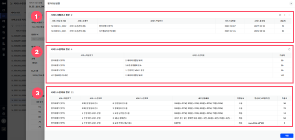

▶ \[그림6\] 서비스수준 평가대상설정 화면(드로어)

> 화면 지표(서비스카탈로그 정보)

서비스수준의 평가대상인 서비스카탈로그 정보를 표시합니다.

<table>
<thead>
<tr class="header">
<th>서비스카탈로그ID</th>
<th>평가 대상 서비스카탈로그의 고유식별을 위한 ID 값입니다.</th>
</tr>
</thead>
<tbody>
<tr class="odd">
<td>서비스도메인</td>
<td>평가 대상 서비스카탈로그의 서비스도메인을 표시합니다.</td>
</tr>
<tr class="even">
<td>서비스카탈로그</td>
<td>평가 대상 서비스카탈로그를 표시합니다.</td>
</tr>
<tr class="odd">
<td>서비스시작일/종료일</td>
<td>평가대상 서비스카탈로그의 서비스 시작일과 종료일을 표시합니다.</td>
</tr>
<tr class="even">
<td>가중치</td>
<td>
평가대상 서비스카탈로그의 가중치를 설정하고 표시합니다.

평가대상 서비스카탈로그들의 가중치 합은 100이 되도록 설정하여야 합니다.
</td>
</tr>
</tbody>
</table>

> 화면 지표(서비스수준목표 정보)

서비스카탈로그에 설정된 서비스수준목표 정보를 표시합니다.

<table>
<thead>
<tr class="header">
<th>서비스카탈로그</th>
<th>서비스수준목표가 적용된 서비스카탈로그를 표시합니다.</th>
</tr>
</thead>
<tbody>
<tr class="odd">
<td>서비스수준목표</td>
<td>서비스수준목표를 식별할 수 있는 명칭입니다.</td>
</tr>
<tr class="even">
<td>가중치</td>
<td>
서비스수준목표의 가중치를 설정하고 표시합니다.

서비스카탈로그에 적용된 서비스수준목표들의 가중치 합은 100이 되도록 설정하여야 합니다.
</td>
</tr>
</tbody>
</table>

> 화면 지표(서비스수준지표 정보)

서비스수준목표에 설정된 서비스수준지표 정보를 표시합니다.

<table>
<thead>
<tr class="header">
<th>서비스카탈로그</th>
<th>서비스수준지표가 적용된 서비스카탈로그를 표시합니다.</th>
</tr>
</thead>
<tbody>
<tr class="odd">
<td>서비스수준목표</td>
<td>서비스수준지표가 적용된 서비스수준목표 정보를 표시합니다.</td>
</tr>
<tr class="even">
<td>서비스수준지표</td>
<td>서비스수준지표를 식별할 수 있는 명칭입니다.</td>
</tr>
<tr class="odd">
<td>세부설정내용</td>
<td>서비스수준지표의 세부설정내용에 대한 정보를 표시합니다.</td>
</tr>
<tr class="even">
<td>측정방식</td>
<td>
서비스수준지표의 측정방식을 표시합니다.

- 자동: 평가주기에 맞춰 측정값을 자동으로 입력합니다.

- 수동: 평가주기마다 측정값을 직접 입력합니다.
</td>
</tr>
<tr class="odd">
<td>환산식</td>
<td>
서비스수준지표의 환산식 정보를 설정하고 표시합니다.

환산식은 서비스수준지표의 점수기준을100점으로 환산 시 사용됩니다.
</td>
</tr>
<tr class="even">
<td>가중치</td>
<td>
서비스수준지표의 가중치를 설정하고 표시합니다.

서비스수준목표에 적용된 서비스수준지표들의 가중치 합은 100이 되도록 설정하여야 합니다.
</td>
</tr>
</tbody>
</table>

> 상세 정보

<table>
<thead>
<tr class="header">
<th>[그림6].”1” 
서비스카탈로그 정보</th>
<th>평가대상의 서비스카탈로그 정보가 표시되며 서비스카탈로그의 추가/삭제가 가능합니다.</th>
</tr>
</thead>
<tbody>
<tr class="odd">
<td>[그림6].”2” 
서비스수준목표 정보</td>
<td>평가대상 서비스카탈로그에 적용된 서비스수준목표 정보를 표시합니다.</td>
</tr>
<tr class="even">
<td>[그림6].”3” 
서비스수준지표 정보</td>
<td>서비스수준목표에 적용된 서비스수준지표 정보를 표시합니다.</td>
</tr>
</tbody>
</table>

> 서비스수준 등록 절차

1.  서비스수준 목록에서 신규 등록 버튼을 클릭합니다.

2.  서비스수준 등록화면의 기본정보에서 필수 항목 (\[  \]모양의 표식이 되어있는 항목)을 입력합니다.

3.  평가대상 정보(서비스카탈로그)의 \[평가대상설정\]버튼을 클릭합니다.

4.  평가대상설정 화면에서 서비스카탈로그 정보의 \[추가\]버튼을 클릭하여 평가 대상을 추가합니다.

5.  평가대상설정 화면에서 추가된 서비스카탈로그의 서비스수준목표정보의 가중치를 입력합니다.

6.  서비스수준목표에 설정된 서비스수준지표정보의 환산식과 가중치를 입력 후 \[적용\] 버튼을 클릭합니다.

7.  서비스수준 등록화면의 등급기준정보에서 \[추가\]버튼을 클릭하여 기준점수와, 등급명을 입력합니다.

8.  서비스수준 등록화면 우측 하단의 \[저장\]버튼을 클릭합니다.

서비스수준 댓글&히스토리

댓글기능을 통하여 서비스수준의 댓글&히스토리 내역을 확인할 수 있습니다.

<table>
<tbody>
<tr class="odd">
<td>
노트

사용자가 등록한 댓글은 대 댓글, 수정, 삭제가 가능합니다.

히스토리 댓글은 대 댓글, 이력상세보기가 가능합니다.

[저장]단계 이후 댓글 입력 및 확인할 수 있습니다.

[댓글] 기능 사용법은 [서비스 포트폴리오 &gt; 그림 8 &gt; 댓글 &amp; 히스토리] 매뉴얼을 참조하시기 바랍니다.
</td>
</tr>
</tbody>
</table>

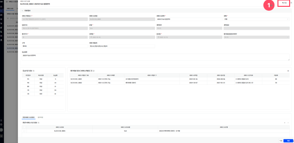

> ▶ \[그림7\] 서비스수준 상세화면(드로어)

서비스수준관리 – 조회 및 평가

서비스수준관리 메뉴에서 서비스수준목록의 조회/평가 버튼을 클릭하면, 서비스수준 평가/조회 상세(드로어)가 열립니다.

<table>
<tbody>
<tr class="odd">
<td>
노트

서비스수준의 주기별 평가는 평가회차의 [상태]가 “신규”, “진행”인 경우에만 가능하고, [상태]가 “확정”인 경우에는 조회만 가능합니다.

[상태]가 “예정”인 경우에는 평가와 조회가 불가합니다.
</td>
</tr>
</tbody>
</table>

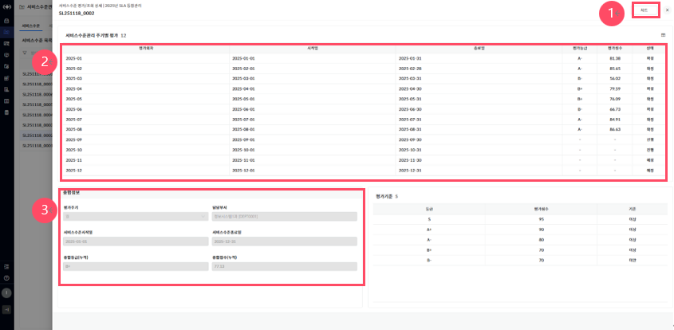

▶ \[그림8\] 서비스수준 평가/조회 상세 화면(드로어)

> 화면 지표(서비스수준관리 주기별 평가)

<table>
<thead>
<tr class="header">
<th>평가회차</th>
<th>서비스수준에서 설정된 평가회차 주기 정보에 따라 평가회차 정보를 표시합니다.</th>
</tr>
</thead>
<tbody>
<tr class="odd">
<td>시작일/종료일</td>
<td>평가회차의 평가 시작일과 종료일 정보를 표시합니다.</td>
</tr>
<tr class="even">
<td>평가등급</td>
<td>평가회차의 평가등급 정보를 표시합니다.</td>
</tr>
<tr class="odd">
<td>평가점수</td>
<td>평가회차의 평가점수를 표시합니다.</td>
</tr>
<tr class="even">
<td>상태</td>
<td>
평가회차의 상태(예정, 신규, 진행, 확정)를 표시합니다.

- 예정: 평가회차의 평가시기가 도래하지 않은 상태입니다.

- 신규: 평가회차의 평가시기가 도래하였으나 평가를 시작하지 않은 상태입니다.

- 진행: 평가회차의 평가가 진행중에 있는 상태입니다.

- 확정: 평가회차의 평가가 최종적으로 확정되어 데이터 수정이 불가 한 상태입니다.
</td>
</tr>
</tbody>
</table>

> 화면 지표(종합정보)

| 평가주기     | 서비스수준에서 설정된 평가주기정보를 표시합니다.                     |
| -------- | ---------------------------------------------- |
| 담당부서     | 서비스수준을 담당하는 부서정보를 표시합니다.                       |
| 서비스수준시작일 | 서비스수준에서 설정된 서비스수준 시작일을 표시합니다.                  |
| 서비스수준종료일 | 서비스수준에서 설정된 서비스수준 종료일을 표시합니다.                  |
| 종합등급(누적) | 서비스수준주기별 평가에서 상태가 확정된 회차 평가등급의 평균등급 정보를 표시합니다. |
| 종합점수(누적) | 서비스수준주기별 평가에서 상태가 확정된 회차 평가점수의 평균점수 정보를 표시합니다. |

> 화면 지표(평가기준)

서비스수준 상세설정에서 설정된 평가기준을 표시합니다.

> 상세 정보

<table>
<thead>
<tr class="header">
<th>[그림8].”1” 
차트 버튼</th>
<th>서비스수준과 평가대상 카탈로그의 주기별 평가 현황과 차트를 표시하는 화면으로 이동합니다.</th>
</tr>
</thead>
<tbody>
<tr class="odd">
<td>[그림8].”2” 
주기별 평가</td>
<td>서비스수준의 주기별 평가 정보를 표시하며, 회차 평가를 하기위한 화면으로 이동합니다.</td>
</tr>
<tr class="even">
<td>[그림8].”3” 
종합정보</td>
<td>서비스수준의 종합정보를 표시합니다.</td>
</tr>
</tbody>
</table>

회차 평가 정보

서비스수준 평가/조회 상세에서 서비스수준관리 주기별 평가(평가회차, 시작일, 종료일)를 클릭하면, 회차 평가 정보 상세화면(드로어)이 열립니다.

<table>
<tbody>
<tr class="odd">
<td>
노트

평가가 확정된 회차는 조회만 가능하며 신규, 진행 중인 회차에 대해서만 평가 또는 초기화가 가능합니다.

“평가 및 저장” 진행 시, 서비스수준지표 정보 중 [측정방식]이 “수동”인 지표의 [측정값]을 하나라도 입력하지 않은 경우, 서비스카탈로그 정보와 서비스수준목표 정보의 기초점수, 최종점수는 모두 0점으로 처리됩니다.
</td>
</tr>
</tbody>
</table>

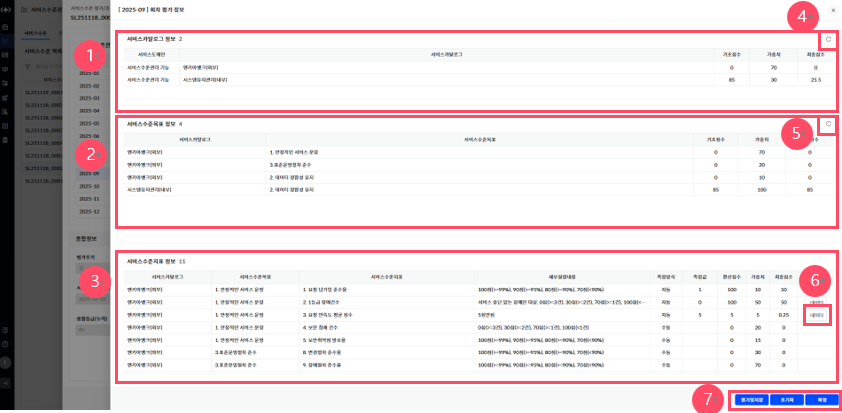

▶ \[그림9\] 회차 평가 정보 화면(드로어)

> 화면 지표(서비스카탈로그 정보)

<table>
<thead>
<tr class="header">
<th>서비스도메인</th>
<th>평가 대상 서비스카탈로그의 서비스도메인을 표시합니다.</th>
</tr>
</thead>
<tbody>
<tr class="odd">
<td>서비스카탈로그</td>
<td>평가 대상 서비스카탈로그를 식별할 수 있는 명칭입니다.</td>
</tr>
<tr class="even">
<td>기초점수</td>
<td>
평가 대상 서비스카탈로그의 기초점수를 표시합니다.

기초점수는 서비스카탈로그에 적용된 서비스수준목표 최종점수의 합입니다.
</td>
</tr>
<tr class="odd">
<td>가중치</td>
<td>평가 대상 서비스카탈로그의 가중치 정보를 표시합니다.</td>
</tr>
<tr class="even">
<td>최종점수</td>
<td>기초점수에 가중치를 반영한 점수를 표시합니다.</td>
</tr>
</tbody>
</table>

> 화면 지표(서비스수준목표 정보)

<table>
<thead>
<tr class="header">
<th>서비스카탈로그</th>
<th>서비스수준목표가 적용된 서비스카탈로그를 표시합니다.</th>
</tr>
</thead>
<tbody>
<tr class="odd">
<td>서비스수준목표</td>
<td>서비스수준목표를 식별할 수 있는 명칭입니다.</td>
</tr>
<tr class="even">
<td>기초점수</td>
<td>
서비스수준목표의 기초점수를 표시합니다.

기초점수는 서비스수준목표에 적용된 서비스수준지표 최종점수의 합입니다.
</td>
</tr>
<tr class="odd">
<td>가중치</td>
<td>서비스수준목표의 가중치 정보를 표시합니다.</td>
</tr>
<tr class="even">
<td>최종점수</td>
<td>기초점수에 가중치를 반영한 점수를 표시합니다.</td>
</tr>
</tbody>
</table>

> 화면 지표(서비스수준지표 정보)

<table>
<thead>
<tr class="header">
<th>서비스카탈로그</th>
<th>서비스수준지표가 적용된 서비스카탈로그를 표시합니다.</th>
</tr>
</thead>
<tbody>
<tr class="odd">
<td>서비스수준목표</td>
<td>서비스수준지표가 적용된 서비스수준목표를 표시합니다.</td>
</tr>
<tr class="even">
<td>서비스수준지표</td>
<td>서비스수준지표를 식별할 수 있는 명칭입니다.</td>
</tr>
<tr class="odd">
<td>세부설정내용</td>
<td>서비스수준지표의 세부설정내용에 대한 정보를 표시합니다.</td>
</tr>
<tr class="even">
<td>측정방식</td>
<td>
서비스수준지표의 측정방식을 표시합니다.

- 자동: 평가주기에 맞춰 측정값을 자동으로 입력합니다.

- 수동: 평가주기마다 측정값을 직접 입력합니다.
</td>
</tr>
<tr class="odd">
<td>측정값</td>
<td>서비스수준지표의 측정값을 표시합니다.</td>
</tr>
<tr class="even">
<td>환산점수</td>
<td>서비스수준지표의 환산식이 적용된 환산점수를 표시합니다.</td>
</tr>
<tr class="odd">
<td>가중치</td>
<td>서비스수준지표의 가중치 정보를 표시합니다.</td>
</tr>
<tr class="even">
<td>최종점수</td>
<td>환산점수에 가중치를 반영한 점수를 표시합니다.</td>
</tr>
<tr class="odd">
<td>데이터확인</td>
<td>
서비스수준지표의 측정값에 대한 기초데이터를 볼 수 있는 화면을 표시합니다.

측정방식이 자동인 경우에만 가능합니다.
</td>
</tr>
</tbody>
</table>

> 상세 정보

<table>
<thead>
<tr class="header">
<th>[그림9].”1” 
서비스카탈로그 정보</th>
<th>평가회차의 서비스카탈로그 정보와 점수 등을 표시합니다.</th>
</tr>
</thead>
<tbody>
<tr class="odd">
<td>[그림9].”2” 
서비스수준목표 정보</td>
<td>평가회차의 서비스수준목표 정보와 점수 등을 표시합니다.</td>
</tr>
<tr class="even">
<td>[그림9].”3” 
서비스수준지표 정보</td>
<td>
평가회차의 서비스수준지표 정보와 점수 등을 표시합니다.

측정방식이 수동인 지표는 수기로 측정값을 입력합니다.
</td>
</tr>
<tr class="odd">
<td>[그림9].”4” 
서비스카탈로그 정보 초기화 버튼</td>
<td>전체 서비스카탈로그에 적용된 서비스수준목표와, 서비스수준지표 정보를 표시하는 기능입니다.</td>
</tr>
<tr class="even">
<td>[그림9].”5” 
서비스수준목표 정보 초기화 버튼</td>
<td>전체 서비스수준목표에 적용된 서비스수준지표 정보를 표시하는 기능입니다.</td>
</tr>
<tr class="odd">
<td>[그림9].”6” 
데이터 버튼</td>
<td>측정방식이 자동인 서비스수준지표의 측정값에 대한 기초데이터를 볼 수 있는 기능입니다.</td>
</tr>
<tr class="even">
<td>[그림9].”7” 
평가 및 저장 &amp; 초기화 &amp; 확정 버튼</td>
<td>
측정방식이 자동인 서비스수준지표에 대해 측정과 평가를 하는 버튼과 측정과 평가한 데이터를 초기화 하는 버튼, 평가 데이터에 대해 최종 확정을 하는 버튼입니다.

확정을 하게 되면 평가 및 저장과 초기화 버튼은 사용이 불가합니다.
</td>
</tr>
</tbody>
</table>

> 서비스수준 평가 절차

1.  서비스수준 목록에서 평가할 서비스수준의 \[조회/평가\]버튼을 클릭합니다.

2.  서비스수준 평가/조회 상세화면의 서비스수준관리 주기별 평가에서 평가할 회차를 클릭합니다.

3.  회차 평가 정보 화면에서 자동지표는 \[평가 및 저장\]버튼을 클릭하여 측정하고, 수동지표는 수기로 입력 후에 \[평가 및 저장\]버튼을 클릭합니다.

4.  측정값, 환산점수, 기초점수, 최종점수 등을 확인하고 이상이 없으면 \[확정\]버튼을 클릭하여 해당 회차의 평가를 종료합니다.

서비스수준관리 – 종합현황

서비스수준관리 메뉴의 서비스수준목록 탭에서 종합현황 버튼을 클릭하면, 서비스수준 종합차트 (드로어)가 열립니다.

<table>
<tbody>
<tr class="odd">
<td>
노트

서비스수준 상태가 진행중인 전체 대상을 기준으로 차트 및 현황이 기본으로 표시됩니다.
</td>
</tr>
</tbody>
</table>

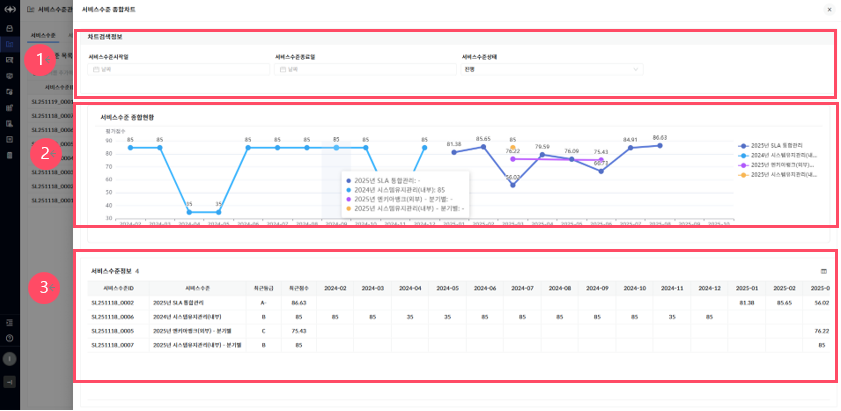

▶ \[그림10\] 서비스수준 종합차트 화면(드로어)

> 화면 지표(서비스수준정보)

<table>
<thead>
<tr class="header">
<th>서비스수준ID</th>
<th>서비스수준의 고유식별을 위한 ID 값입니다</th>
</tr>
</thead>
<tbody>
<tr class="odd">
<td>서비스수준</td>
<td>서비스수준을 식별할 수 있는 명칭입니다.</td>
</tr>
<tr class="even">
<td>최근등급</td>
<td>서비스수준의 가장 최근에 평가가 확정된 등급을 표시합니다.</td>
</tr>
<tr class="odd">
<td>최근점수</td>
<td>서비스수준의 가장 최근에 평가가 확정된 점수를 표시합니다.</td>
</tr>
<tr class="even">
<td>
월별

평가점수
</td>
<td>서비스수준의 평가가 확정된 월의 점수 현황을 표시합니다.</td>
</tr>
</tbody>
</table>

> 상세 정보

<table>
<thead>
<tr class="header">
<th>[그림10].”1” 
차트검색 정보</th>
<th>
서비스수준시작일/종료일의 조건을 설정하여 검색 가능합니다.

서비스수준의 상태가 진행, 종료 대상으로 선택하여 검색 가능합니다.
</th>
</tr>
</thead>
<tbody>
<tr class="odd">
<td>[그림10].”2” 
서비스수준 종합현황 정보</td>
<td>
기본화면은 진행중인 전체 서비스수준에 대한 차트를 표시하며, 차트검색정보의 조건에 따라 차트를 표시합니다.

범례에서 특정서비스 수준을 선택하면 해당 차트만 표시합니다.
</td>
</tr>
<tr class="even">
<td>[그림10].”3” 
서비스수준 정보</td>
<td>기본화면은 진행중인 전체 서비스수준에 대한 현황을 표시하며, 차트검색정보의 조건에 따라 차트를 표시합니다.</td>
</tr>
</tbody>
</table>

개별 서비스수준 현황

종협현황에서 서비스수준(서비스수준ID, 서비스수준)을 클릭하거나, 서비스수준 평가/조회 상세 화면에서 차트 버튼을 클릭하면, 개별서비스수준의 평가 상세 종합차트(드로어)가 열립니다.

종합차트와 카탈로그차트가 탭으로 구성되어 있습니다.

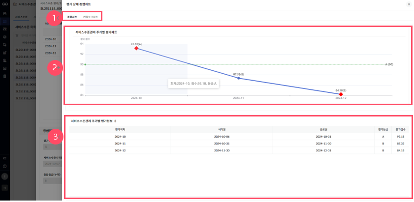

▶ \[그림11\] 서비스수준 종합차트 화면(드로어)

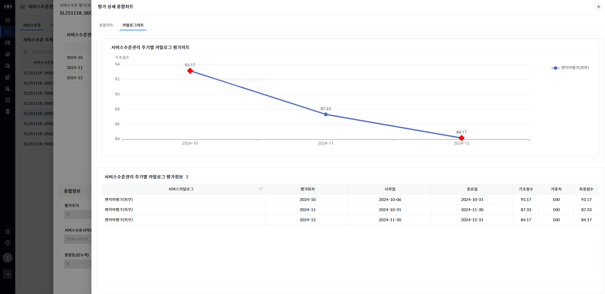

▶ \[그림12\] 카탈로그차트 화면(드로어)

> 상세 정보

<table>
<thead>
<tr class="header">
<th>[그림11].”1” 
종합차트/카탈로그차트</th>
<th>개별 서비스수준과 카탈로그별 차트와 현황을 볼 수 있는 탭으로 선택하여 조회 가능합니다.</th>
</tr>
</thead>
<tbody>
<tr class="odd">
<td>[그림11].”2” 
서비스수준관리 주기별 (카탈로그) 평가차트</td>
<td>
서비스수준과 카탈로그별로 차트를 표시합니다.

주기별 평가가 확정된 주기의 차트만 표시합니다.
</td>
</tr>
<tr class="even">
<td>[그림11].”3” 
서비스수준관리 주기별(카탈로그) 평가차트</td>
<td>
서비스수준과 카탈로그별로 현황을 표시합니다.

주기별 평가가 확정된 주기의 현황만 표시합니다.
</td>
</tr>
</tbody>
</table>

