포탈 서비스 종합 현황

ITSM 포탈 메인 화면은 공지사항, 자주 찾는 서비스, 서비스카탈로그를 직관적으로 조회할 수 있는 통합 서비스 페이지로, 추천 검색어 기능을 통해 사용자가 필요한 업무를 빠르게 찾고 요청할 수 있도록 구성되어 있습니다.

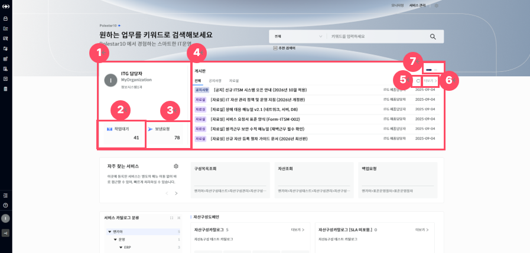

> ▶ \[그림1\] ITSM 서비스 종합 현황 – 배너
> 
> 프로필

<table>
<thead>
<tr class="header">
<th>
[그림1].“1”

프로필
</th>
<th>로그인한 사용자의 계정, 조직을 표시합니다.</th>
</tr>
</thead>
<tbody>
<tr class="odd">
<td>
[그림1].“2”

작업대기
</td>
<td>[My Page] &gt; [작업대기] 페이지로 이동합니다.</td>
</tr>
<tr class="even">
<td>
[그림1].“3”

보낸 요청
</td>
<td>[My Page] &gt; [보낸 요청] 페이지로 이동합니다.</td>
</tr>
</tbody>
</table>

> 공지사항

<table>
<thead>
<tr class="header">
<th>
[그림1].“4”

게시판
</th>
<th>시스템 및 서비스 관련 공지사항을 리스트 형태로 최신등록일 순으로 최대 6개까지 제공하며, “제목” 클릭 시 공지사항 상세화면(드로어)이 열립니다.</th>
</tr>
</thead>
<tbody>
<tr class="odd">
<td>
[그림1].“5”

새로 고침
</td>
<td>해당 게시판의 최신 상태를 불러오는 새로 고침 기능을 제공합니다.</td>
</tr>
<tr class="even">
<td>
[그림1].“6”

더 보기
</td>
<td>‘전체’ 탭에서는 더 보기 기능이 제공되지 않으며, 게시판 또는 자료실 탭에서 ‘더 보기’ 버튼을 클릭하면 해당 탭의 전체 목록을 확인할 수 있는 상세 화면(드로어)이 열립니다.</td>
</tr>
<tr class="odd">
<td>
[그림1].“7”

토글 스위치
</td>
<td>토글 스위치 클릭 시 화면이 일정 목록을 확인할 수 있는 화면으로 전환됩니다.</td>
</tr>
</tbody>
</table>

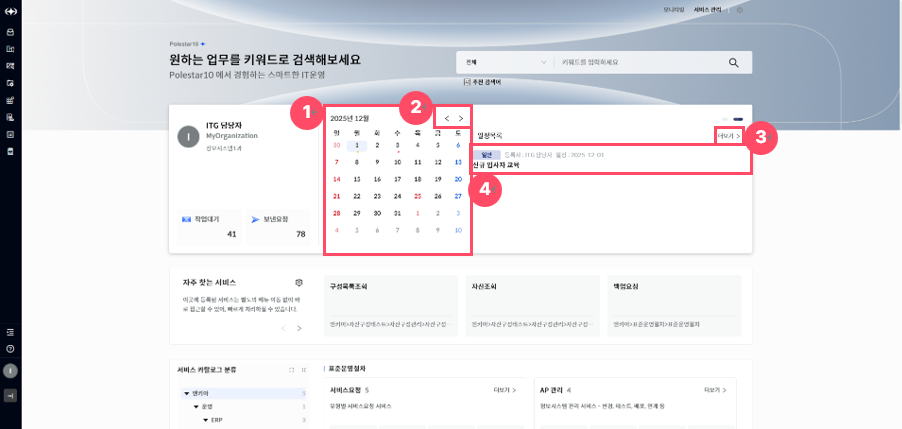

> ▶ \[그림2\] ITSM 서비스 종합 현황 – 배너
> 
> 일정관리

<table>
<thead>
<tr class="header">
<th>
[그림2].“1”

달력
</th>
<th>선택한 날짜는 하늘색으로 강조되며, 날짜 아래의 뱃지는 해당 날짜에 일정이 있다는 것을 의미합니다.</th>
</tr>
</thead>
<tbody>
<tr class="odd">
<td>
[그림2].“2”

달 이동 버튼
</td>
<td>좌우 화살표 버튼을 통해 이전달 또는 다음달로 이동할 수 있습니다.</td>
</tr>
<tr class="even">
<td>
[그림2].“3”

더 보기
</td>
<td>더 보기 버튼 클릭 시 일정관리 전체화면(드로어)이 열립니다.</td>
</tr>
<tr class="odd">
<td>
[그림2].“4”

일정목록
</td>
<td>선택한 날짜에 등록된 일정목록이 표시됩니다.</td>
</tr>
</tbody>
</table>

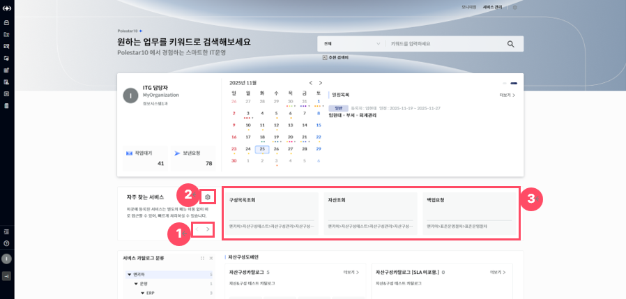

> ▶ \[그림3\] ITSM 서비스 종합 현황 – 자주 찾는 서비스
> 
> 자주 찾는 서비스

<table>
<thead>
<tr class="header">
<th>[그림3].“1” 
서비스 이동 버튼</th>
<th>좌우 이동 버튼을 사용하여 등록된 자주 찾는 서비스를 순서대로 확인 할 수 있습니다.</th>
</tr>
</thead>
<tbody>
<tr class="odd">
<td>[그림<strong>3</strong>].“1” 
설정</td>
<td>설정 버튼 클릭 시 자주 찾는 서비스 상세 화면(드로어)이 열리며, 해당 화면에서 서비스 정렬 및 삭제를 할 수 있습니다.</td>
</tr>
<tr class="even">
<td>[그림<strong>3</strong>].“1” 
자주 찾는 서비스</td>
<td>등록된 자주 찾는 서비스를 메뉴 이동 없이 바로 접근할 수 있도록 제공하며, 서비스명, 서비스 설명, 서비스 경로를 함께 표시합니다.</td>
</tr>
</tbody>
</table>

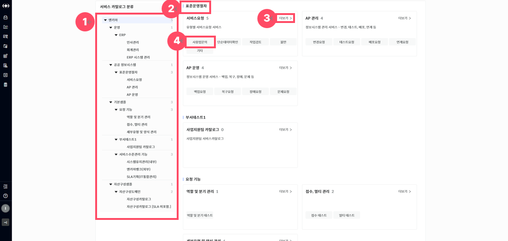

> ▶ \[그림4\] ITSM 서비스 종합 현황 – 서비스카탈로그
> 
> 서비스 카탈로그 분류 트리

<table>
<tbody>
<tr class="odd">
<td>[그림4].“1” 
서비스 카탈로그 분류 트리</td>
<td>좌측 트리 영역에서 서비스 분류별로 등록된 서비스카탈로그를 확인할 수 있으며, 특정 노드를 선택하면 우측 카드 목록이 해당 분류에 속한 서비스카탈로그로 자동 갱신됩니다. 또한, 트리에서 서비스카탈로그를 클릭하면 해당 카드에 하이라이트가 표시됩니다.</td>
</tr>
</tbody>
</table>

> 서비스 카탈로그

<table>
<thead>
<tr class="header">
<th>[그림4].“2” 
서비스도메인명</th>
<th>서비스도메인명이 표시됩니다.</th>
</tr>
</thead>
<tbody>
<tr class="odd">
<td>[그림4].“3” 
서비스카탈로그 상세</td>
<td>서비스카탈로그명, 서비스카탈로그 설명, 서비스명이 표시됩니다. 
서비스카탈로그 카드 또는 더 보기 버튼 클릭 시 서비스카탈로그 상세화면(드로어)가 열립니다.</td>
</tr>
<tr class="even">
<td>[그림4].“4” 
서비스</td>
<td>
서비스카탈로그 카드 하단에 버튼 클릭하면, 연결된 서비스의 종류와 설정에 따라 드로어 오픈 또는 페이지 전환 방식으로 실행됩니다.

- 요청관리 : 요청등록화면(드로어)이 열려, 사용자가 직접 요청서를 작성하고 등록할 수 있습니다.

- ITAM관리 : ITAM자산 서비스 화면으로 메뉴이동이 이루어지며, 해당 서비스를 바로 이용할 수 있습니다.
</td>
</tr>
</tbody>
</table>

포탈 서비스 통합 검색

ITSM 포탈 메인 화면에서 검색창을 통해 통합 검색을 할 수 있습니다.

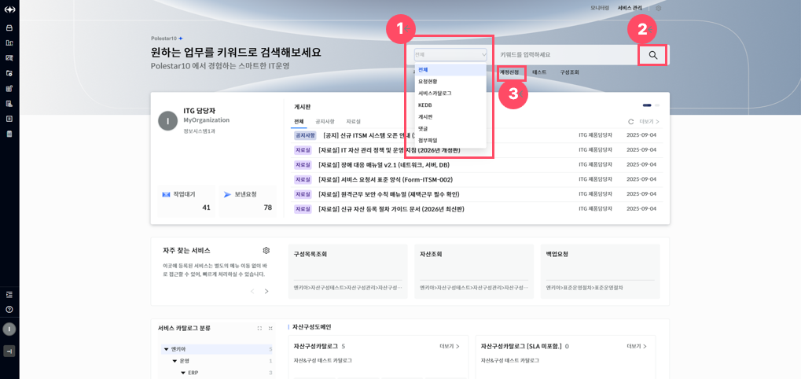

> ▶ \[그림5\] ITSM 서비스 종합 현황 검색 분류
> 
> 화면 지표

<table>
<thead>
<tr class="header">
<th>[그림5].“1” 
분류</th>
<th>요청현황 / 서비스카탈로그 / KEDB / 게시판 / 댓글 / 첨부파일을 기준으로 사용자가 입력한 키워드가 포함된 데이터를 조회할 수 있습니다.</th>
</tr>
</thead>
<tbody>
<tr class="odd">
<td>[그림5].“2” 
검색</td>
<td>검색버튼 또는 Enter키 입력 시, 사용자가 입력한 키워드로 데이터를 조회할 수 있습니다.</td>
</tr>
<tr class="even">
<td>[그림5].“3” 
추천 검색어</td>
<td>추천 검색어 클릭 시, 분류는 ‘전체’로 설정되어 빠른 검색이 가능합니다.</td>
</tr>
</tbody>
</table>

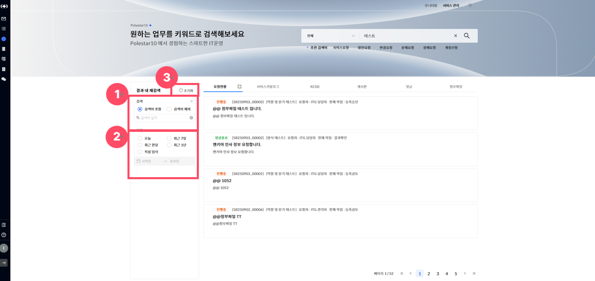

> ▶ \[그림6\] ITSM 서비스 통합 검색 결과 화면

<table>
<tbody>
<tr class="odd">
<td>
노트

상단 배너에는 검색어가 입력된 [검색 창]이 존재하고, 검색 화면 좌측에는 [결과 내 재 검색] 이 있고, 우측에는 [카테고리 별 검색 결과]가 있습니다.

카테고리는 [요청현황], [서비스카탈로그], [KEDB], [게시판], [댓글], [첨부파일] 로 이루어져 있습니다.
</td>
</tr>
</tbody>
</table>

> 결과 내 재 검색

<table>
<thead>
<tr class="header">
<th>[그림6].“1” 
검색</th>
<th>
검색 결과 내에서 조건을 추가하여 검색할 수 있는 기능입니다. 
기본값은 [검색어 포함]이며, 검색어는 최대 2개까지 입력할 수 있습니다.

검색 방식 선택 : [검색어 포함] 또는 [검색어 제외] 중 하나를 선택합니다.

검색어 입력 및 적용 : 입력 창에 검색어를 입력한 후 Enter 키를 누르면, 입력한 검색어가 하단에 태그 형태로 표시되며 검색 조건에 적용됩니다.

<blockquote>

- [검색어 포함] : 입력한 단어가 포함된 결과만 조회됩니다. 
- [검색어 제외] : 입력한 단어가 포함되지 않은 결과만 조회됩니다.

</blockquote></th>
</tr>
</thead>
<tbody>
<tr class="odd">
<td>[그림6].“2” 
기간</td>
<td>검색 기간을 선택하는 기능입니다 
[직접 입력] 선택 시 날짜 선택창이 뜨고, 원하는 기간을 선택할 수 있습니다.</td>
</tr>
<tr class="even">
<td>[그림6].“3” 
초기화</td>
<td>설정한 조건을 초기화할 수 있는 기능입니다.</td>
</tr>
</tbody>
</table>

\[요청현황\] 카테고리

사용자가 입력한 키워드를 포함한 요청 항목들이 카드 형태로 검색 결과에 표시됩니다.

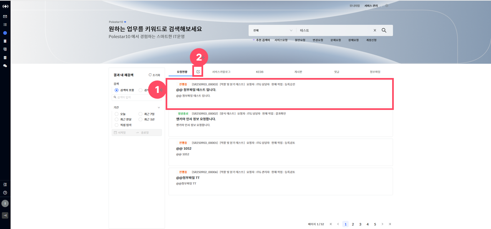

> ▶ \[그림7\] 요청현황 검색결과
> 
> 상세 정보

<table>
<thead>
<tr class="header">
<th>[그림7].”1” 
요청현황</th>
<th>요청 상태, 요청번호, 요청유형, 요청자, 현재 작업상태, 요청 제목 및 내용이 표시되며, “요청제목” 클릭 시 요청 상세화면(드로어)이 열립니다.</th>
</tr>
</thead>
<tbody>
<tr class="odd">
<td>[그림7].”2” 
더 보기</td>
<td>더 보기 버튼 클릭 시 “종합요청현황” 메뉴가 새 탭으로 열립니다.</td>
</tr>
</tbody>
</table>

\[서비스카탈로그\] 카테고리

사용자가 입력한 키워드를 포함한 서비스 카탈로그 항목들이 카드 형태로 검색 결과에 표시됩니다.

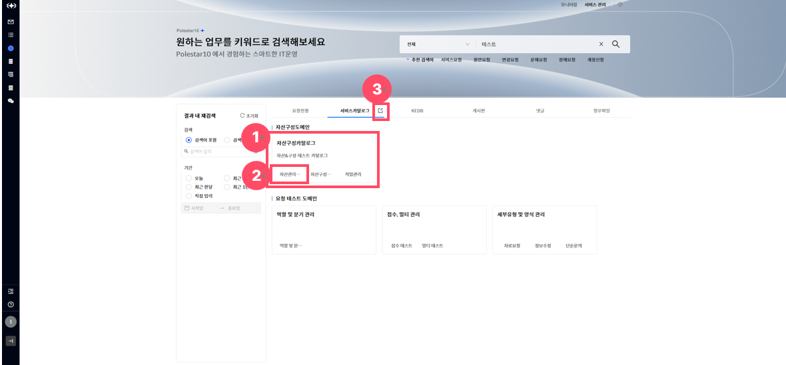

> ▶ \[그림8\] 서비스카탈로그 검색결과
> 
> 상세 정보

<table>
<thead>
<tr class="header">
<th>[그림8].”1” 
서비스카탈로그 상세</th>
<th>서비스카탈로그명, 서비스카탈로그 설명, 서비스명이 표시됩니다. 
서비스카탈로그 카드 클릭 시 서비스카탈로그 상세화면(드로어)가 열립니다.</th>
</tr>
</thead>
<tbody>
<tr class="odd">
<td>[그림8].”2” 
서비스</td>
<td>
연결된 서비스의 종류에 따라 아래 두가지 동작 중 하나가 실행됩니다.

- 요청관리 : 요청등록화면(드로어)이 열려, 사용자가 직접 요청서를 작성하고 등록할 수 있습니다.

- ITAM관리 : ITAM자산 서비스 화면으로 메뉴이동이 이루어지며, 해당 서비스를 바로 이용할 수 있습니다.
</td>
</tr>
<tr class="even">
<td>[그림8].”3” 
더 보기</td>
<td>더 보기 버튼 클릭 시 “서비스카탈로그” 메뉴가 새 탭으로 열립니다.</td>
</tr>
</tbody>
</table>

\[KEDB\] 카테고리

사용자가 입력한 키워드를 포함한 KEDB항목들이 카드 리스트 형태로 검색 결과에 표시됩니다.

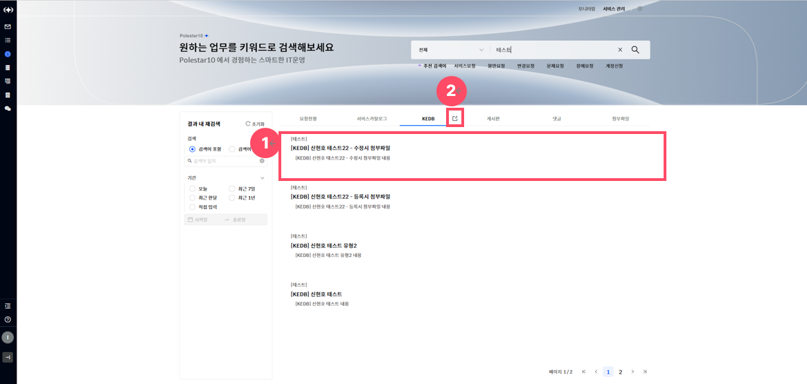

> ▶ \[그림9\] KEDB 검색결과
> 
> 상세 정보

<table>
<thead>
<tr class="header">
<th>[그림9].”1” 
KEDB</th>
<th>장애/문제유형, KEDB제목 및 내용이 표시되며, “KEDB제목” 클릭 시 요청 상세화면(드로어)이 열립니다.</th>
</tr>
</thead>
<tbody>
<tr class="odd">
<td>[그림9].”2” 
더 보기</td>
<td>더 보기 버튼 클릭 시 “KEDB” 메뉴가 새 탭으로 열립니다.</td>
</tr>
</tbody>
</table>

\[게시판\] 카테고리

사용자가 입력한 키워드를 포함한 게시판 항목들이 카드 형태로 검색 결과에 표시됩니다.

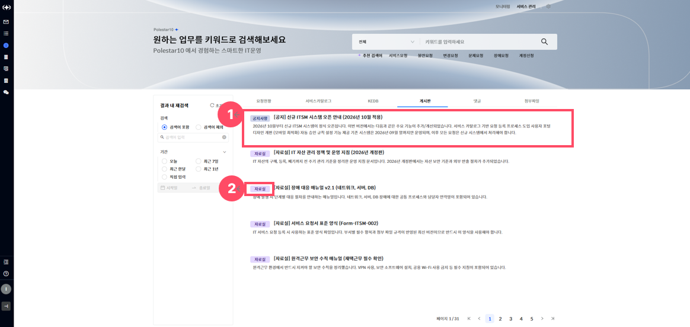

> ▶ \[그림10\] 게시판 검색결과
> 
> 상세 정보

<table>
<thead>
<tr class="header">
<th>[그림10].”1” 
게시판</th>
<th>게시판 유형, 제목, 내용이 표시되며, “제목” 클릭 시 요청 상세화면(드로어)이 열립니다.</th>
</tr>
</thead>
<tbody>
<tr class="odd">
<td>[그림10].”2” 
게시판 유형</td>
<td>게시판 유형 클릭 시 해당 유형의 메뉴가 새 탭으로 열립니다.</td>
</tr>
</tbody>
</table>

\[댓글\] 카테고리

사용자가 입력한 키워드를 포함한 댓글 항목들이 카드 형태로 검색 결과에 표시됩니다.

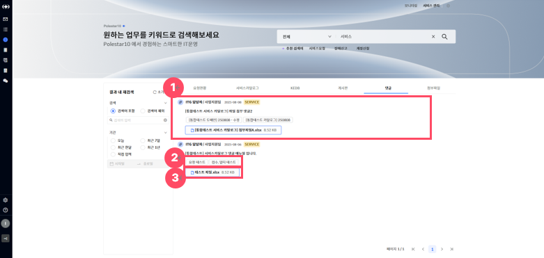

> ▶ \[그림11\] 댓글 검색결과
> 
> 상세 정보

<table>
<thead>
<tr class="header">
<th>[그림11].”1” 
댓글</th>
<th>통합 댓글 검색 결과 화면으로, 모든 댓글을 조회할 수 있으며 작성자, 작성자 부서, 작성 시간, 시스템 태그, 댓글 내용, 댓글 위치, 이력 보기 항목이 표시됩니다.</th>
</tr>
</thead>
<tbody>
<tr class="odd">
<td>[그림11].”2” 
댓글 출처</td>
<td>댓글의 출처를 확인할 수 있으며, 출처 버튼 클릭 시 상세정보를 확인할 수 있습니다. (출처별 유형에 따라 메뉴이동, 새 탭, 드로어 등을 통하여 확인할 수 있습니다.)</td>
</tr>
<tr class="even">
<td>[그림11].”3” 
첨부파일</td>
<td>댓글 내 포함된 첨부파일 목록을 확인할 수 있습니다. 첨부파일 버튼 클릭 시 다운로드 받을 수 있습니다.</td>
</tr>
</tbody>
</table>

\[첨부파일\] 카테고리

사용자가 입력한 키워드를 포함한 첨부파일 항목들이 카드 형태로 검색 결과에 표시됩니다.

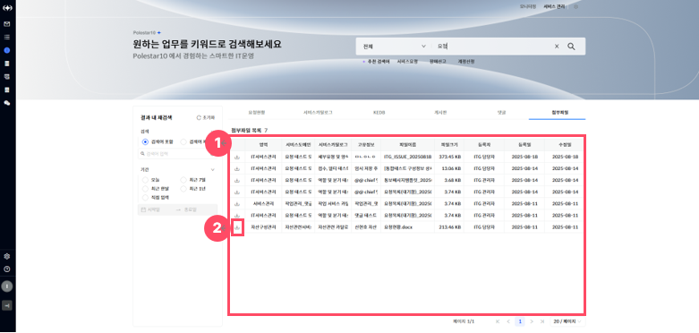

> ▶ \[그림12\] 첨부파일 검색결과
> 
> 상세 정보

<table>
<thead>
<tr class="header">
<th>[그림12].”1” 
첨부파일 목록</th>
<th>통합 첨부파일 검색 결과 화면으로, 모든 첨부파일을 조회할 수 있습니다.</th>
</tr>
</thead>
<tbody>
<tr class="odd">
<td>[그림12].”2” 
다운로드</td>
<td>첨부파일을 다운로드 할 수 있습니다.</td>
</tr>
</tbody>
</table>

