서비스카탈로그

메뉴에서 \[서비스카탈로그\]를 선택하면, 서비스도메인, 서비스카탈로그, 서비스 정보에 대한 조회가 가능하며,

해당 서비스카탈로그 기반으로 하는 서비스 이용이 가능합니다.

<table>
<tbody>
<tr class="odd">
<td>
노트

서비스카탈로그 정보는 카탈로그 담당부서 및 사용권한이 있는 경우에만 조회가 가능합니다.

서비스카탈로그 카드 표출 조건은 상태가 "운영"이면서 현재 일자 기준으로 서비스 시작일과 종료일에 포함되어야 합니다.

서비스카탈로그에 등록된 서비스가 3개를 초과할 경우, 카드 화면에서는 상위 순서 3개 서비스만 표시되며, 나머지 서비스는 서비스카탈로그 상세 화면에서 확인할 수 있습니다.
</td>
</tr>
</tbody>
</table>

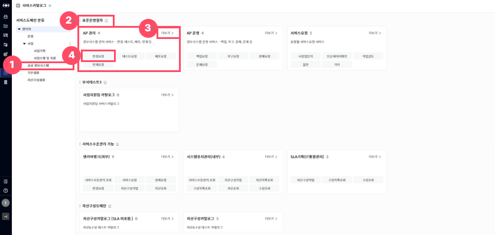

> ▶ \[그림1\] 서비스카탈로그 목록
> 
> 상세 정보

<table>
<thead>
<tr class="header">
<th>[그림1].“1” 
서비스도메인 분류 트리</th>
<th>화면 좌측에 서비스도메인 분류 트리를 클릭 시 해당 분류만 조회 할 수 있습니다.</th>
</tr>
</thead>
<tbody>
<tr class="odd">
<td>[그림1].“2” 
서비스도메인</td>
<td>서비스도메인명이 표시됩니다. 
 : 클릭 시 서비스도메인 상세화면(드로어)가 열립니다.</td>
</tr>
<tr class="even">
<td>[그림1].“3” 
서비스카탈로그</td>
<td>서비스카탈로그명, 서비스카탈로그 설명, 서비스명이 표시됩니다. 
서비스카탈로그 카드 또는 더보기 버튼 클릭 시 서비스카탈로그 상세화면(드로어)가 열립니다.</td>
</tr>
<tr class="odd">
<td>[그림1].“4” 
서비스</td>
<td>
서비스카탈로그 카드 하단에 버튼 클릭하면, 연결된 서비스의 종류와 설정에 따라 드로어 오픈 또는 페이지 전환 방식으로 실행됩니다.

- 요청관리 : 요청등록화면(드로어)이 열려, 사용자가 직접 요청서를 작성하고 등록할 수 있습니다.

- ITAM관리 : ITAM자산 서비스 화면으로 메뉴이동이 이루어지며, 해당 서비스를 바로 이용할 수 있습니다.
</td>
</tr>
</tbody>
</table>

서비스도메인 상세 조회

드로어 열기 버튼(\[그림1\].“2”)을 클릭하면 서비스도메인 상세화면(드로어)가 열립니다.

서비스도메인의 정보와 서비스도메인에 연결된 서비스카탈로그, 자산정보, 구성정보, 요청정보를 조회할 수 있습니다. 단, 자산정보, 구성정보, 요청정보는 지정된 권한이 있는 사용자만 조회 가능합니다.

또한, 서비스카탈로그 카드 하단의 버튼 클릭 시 연결된 서비스의 종류와 설정에 따라 드로어 오픈 또는 페이지 전환 방식으로 실행됩니다.

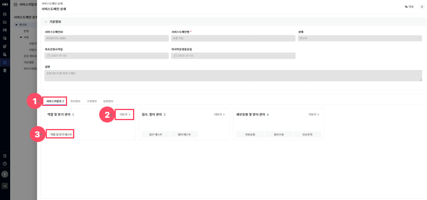

> ▶ \[그림2\] 서비스도메인 상세화면 - 서비스카탈로그 탭
> 
> 화면 지표(기본정보)

<table>
<thead>
<tr class="header">
<th>서비스도메인ID</th>
<th>서비스도메인의 고유식별을 위한 ID 값입니다.</th>
</tr>
</thead>
<tbody>
<tr class="odd">
<td>서비스도메인명</td>
<td>서비스도메인을 식별할 수 있는 명칭입니다.</td>
</tr>
<tr class="even">
<td>상태</td>
<td>
서비스도메인의 상태를 표시합니다.

- 도입 : 서비스 도메인을 최초로 등록한 초기 단계입니다. 아직 운영 중이지 않으며, 준비 단계에 해당합니다.

- 활성화 : 실제 운영 중인 상태입니다. 사용자 또는 시스템에서 서비스가 정상적으로 사용되고 있습니다.

- 정지 : 일시적으로 운영을 중단한 상태입니다. 서비스카탈로그의 운영을 통해 다시 활성화될 수 있습니다.

- 유휴 : 연결된 서비스카탈로그의 운영이 종료되어, 현재 서비스가 제공되지 않는 상태입니다.

- 폐기 : 서비스 도메인 자체가 완전히 폐기된 상태입니다. 모든 기능이 비활성화 되며, 조회만 가능합니다.
</td>
</tr>
<tr class="odd">
<td>담당부서</td>
<td>해당 서비스도메인의 운영/관리를 담당하는 부서입니다.</td>
</tr>
<tr class="even">
<td>최초운영시작일</td>
<td>서비스 운영이 시작된 날짜입니다.</td>
</tr>
<tr class="odd">
<td>마지막운영종료일</td>
<td>서비스 운영이 종료된 날짜입니다.</td>
</tr>
<tr class="even">
<td>설명</td>
<td>서비스도메인의 구체적인 용도 및 설명입니다.</td>
</tr>
</tbody>
</table>

> 상세 정보(서비스카탈로그 탭)

<table>
<thead>
<tr class="header">
<th>[그림2].”1” 
서비스카탈로그 탭</th>
<th>해당 서비스도메인에 연결된 서비스카탈로그를 조회할 수 있습니다.</th>
</tr>
</thead>
<tbody>
<tr class="odd">
<td>[그림2].”2” 
서비스카탈로그</td>
<td>서비스카탈로그명, 서비스카탈로그 설명, 서비스명이 표시됩니다. 
서비스카탈로그 카드 또는 더보기버튼 클릭 시 서비스카탈로그 상세화면(드로어)가 열립니다.</td>
</tr>
<tr class="even">
<td>[그림2].”3” 
서비스</td>
<td>
서비스카탈로그 카드 하단에 버튼 클릭하면, 연결된 서비스의 종류와 설정에 따라 드로어 오픈 또는 페이지 전환 방식으로 실행됩니다.

- 요청관리 : 요청등록화면(드로어)이 열려, 사용자가 직접 요청서를 작성하고 등록할 수 있습니다.

- ITAM관리 : ITAM자산 서비스 화면으로 메뉴이동이 이루어지며, 해당 서비스를 바로 이용할 수 있습니다.
</td>
</tr>
</tbody>
</table>

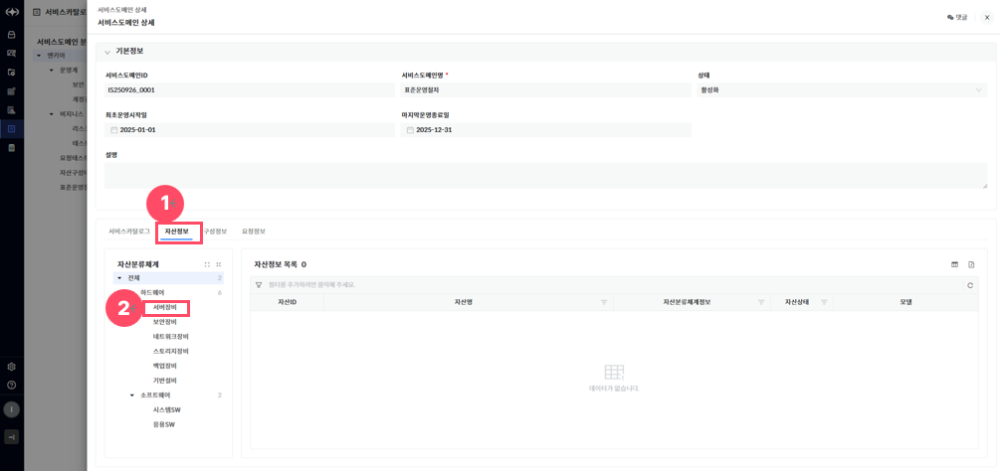

> ▶ \[그림3\] 서비스도메인 상세화면 – 자산정보 탭
> 
> 화면 지표(자산정보 목록)

<table>
<thead>
<tr class="header">
<th>자산ID</th>
<th>자산의 고유식별을 위한 ID 값입니다.</th>
</tr>
</thead>
<tbody>
<tr class="odd">
<td>자산명</td>
<td>자산을 식별할 수 있는 명칭입니다.</td>
</tr>
<tr class="even">
<td>자산분류체계정보</td>
<td>자산의 분류 체계이며 다단계 계층구조로 정의되어 있습니다.</td>
</tr>
<tr class="odd">
<td>자산상태</td>
<td>
자산의 상태정보입니다.

- 입고 : 자산이 설치되어 운영되기전 들여온 상태입니다.

- 운영 : 자산이 설치되어 운영중인 상태입니다.

- 보류 : 자산이 운영되지 않고 정지 중인 상태입니다.

- 폐기 : 자산이 폐기처리 된 상태입니다.
</td>
</tr>
<tr class="even">
<td>모델</td>
<td>자산 제품정보입니다.</td>
</tr>
</tbody>
</table>

> 상세 정보(자산정보 탭)

<table>
<thead>
<tr class="header">
<th>[그림3].”1” 
자산정보 탭</th>
<th>해당 서비스도메인에 연결된 자산정보를 조회할 수 있습니다.</th>
</tr>
</thead>
<tbody>
<tr class="odd">
<td>[그림3].”2” 
자산분류체계 트리</td>
<td>화면 좌측에 자산분류체계 트리 클릭 시 해당 분류만 조회할 수 있습니다.</td>
</tr>
</tbody>
</table>

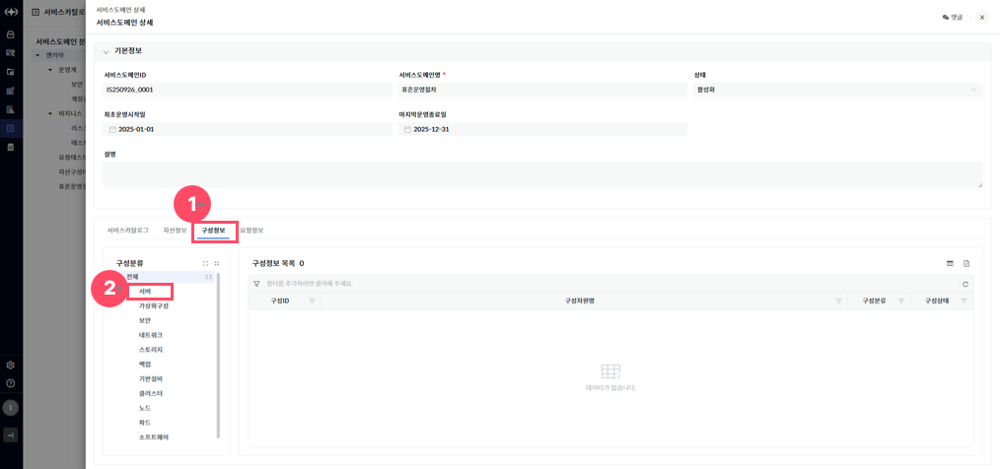

> ▶ \[그림4\] 서비스도메인 상세화면 – 구성정보 탭
> 
> 화면 지표(구성정보 목록)

<table>
<thead>
<tr class="header">
<th>구성ID</th>
<th>구성의 고유식별을 위한 ID 값입니다.</th>
</tr>
</thead>
<tbody>
<tr class="odd">
<td>구성자원명</td>
<td>구성을 식별할 수 있는 명칭입니다.</td>
</tr>
<tr class="even">
<td>구성분류</td>
<td>구성의 분류 체계입니다.</td>
</tr>
<tr class="odd">
<td>구성상태</td>
<td>
구성의 관리 상태 정보입니다.

- 사용 : 작업관리 등록 가능한 상태입니다.

- 정지 : 작업관리 등록 불가, 기존에 등록된 구성 조회용도로만 사용되는 상태입니다.
</td>
</tr>
</tbody>
</table>

> 상세 정보(구성정보 탭)

<table>
<thead>
<tr class="header">
<th>[그림4].”1” 
구성정보 탭</th>
<th>해당 서비스도메인에 연결된 구성정보를 조회할 수 있습니다.</th>
</tr>
</thead>
<tbody>
<tr class="odd">
<td>[그림4].”2” 
구성분류 트리</td>
<td>화면 좌측에 구성분류 트리 클릭 시 해당 분류만 조회할 수 있습니다.</td>
</tr>
</tbody>
</table>

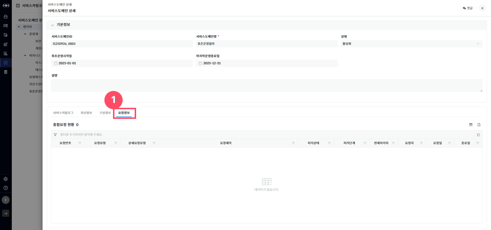

> ▶ \[그림5\] 서비스도메인 상세화면 – 요청정보 탭
> 
> 화면 지표(요청정보 목록)

| 요청번호   | 각 요청 건에 부여된 고유 식별 번호입니다. 요청을 조회하거나 추적할 때 사용됩니다. |
| ------ | ----------------------------------------------- |
| 요청유형   | 요청의 전체적인 분류를 나타냅니다.                             |
| 상세요청유형 | 요청유형 내에서 보다 구체적인 요청 항목을 의미합니다.                  |
| 요청제목   | 사용자가 입력한 요청 건의 제목입니다. 요청의 주요 내용을 간략히 나타냅니다.     |
| 처리상태   | 해당 요청의 현재 처리 상태를 나타냅니다.                         |
| 처리단계   | 요청이 현재 어떤 단계에 있는지를 나타냅니다.                       |
| 현재처리자  | 현재 요청을 처리하고 있는 담당자 이름 또는 부서를 나타냅니다.             |
| 요청자    | 해당 요청을 최초로 작성하여 등록한 사용자입니다.                     |
| 요청일    | 요청자가 지정한 요청이 생성된 날짜입니다.                         |
| 종료일    | 요청 처리가 완료된 날짜입니다.                               |

> 상세 정보(요청정보 탭)

<table>
<tbody>
<tr class="odd">
<td>[그림 5].“1” 
요청정보 탭</td>
<td>해당 서비스도메인에 연결된 요청정보를 조회할 수 있습니다.</td>
</tr>
</tbody>
</table>

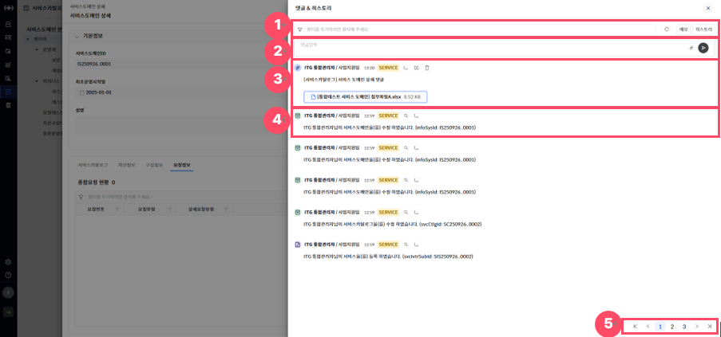

> ▶ \[그림6\] 서비스도메인 상세화면(드로어) – 댓글&히스토리(드로어)
> 
> 상세 정보(댓글 & 히스토리)

<table>
<tbody>
<tr class="odd">
<td>
노트

댓글 상세 기능 사용법은 [서비스포트폴리오[그림 8] &gt; 상세정보 &gt; 댓글 &amp; 히스토리] 메뉴얼을 참조하시기 바랍니다.
</td>
</tr>
</tbody>
</table>

<table>
<thead>
<tr class="header">
<th>[그림 6].“1” 
필터</th>
<th>
필터는 각 댓글의 데이터 단위로 상세한 조건 검색이 가능한 기능입니다.

- 메모 : 작성한 댓글만 조회할 수 있습니다.

- 히스토리 : 히스토리 댓글만 조회할 수 있습니다.
</th>
</tr>
</thead>
<tbody>
<tr class="odd">
<td>[그림 6].“2” 
댓글입력</td>
<td>
화면 상단 입력란에 내용을 작성하여 의견을 등록할 수 있습니다.

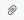 : 파일 첨부 버튼을 통해 관련 문서나 이미지 파일을 함께 첨부할 수 있습니다.

 : 등록 버튼을 클릭하면 댓글이 등록됩니다.
</td>
</tr>
<tr class="even">
<td>[그림 6].“3” 
댓글</td>
<td>
등록된 댓글은 작성자 정보, 부서, 작성일, 시스템 태그, 관련 서비스 링크, 첨부파일과 함께 최신순으로 표시됩니다.

 : 해당 댓글의 대 댓글을 등록할 수 있습니다.

: 해당 댓글을 수정할 수 있습니다.

: 해당 댓글을 삭제할 수 있습니다.
</td>
</tr>
<tr class="odd">
<td>[그림 6].“4” 
히스토리</td>
<td>
히스토리 댓글은 시스템에 의해 자동으로 생성된 처리 이력 정보이며, 사용자정보, 사용자부서, 처리일, 시스템 태그와 함께 최신순으로 표시됩니다.

 : 이력상세보기가 가능합니다.

 : 해당 댓글의 대 댓글을 등록할 수 있습니다.
</td>
</tr>
<tr class="even">
<td>[그림 6].“5” 
페이징</td>
<td>목록 데이터를 구간별로 나누어 페이지 단위로 조회할 수 있도록 도와주는 기능입니다.</td>
</tr>
</tbody>
</table>

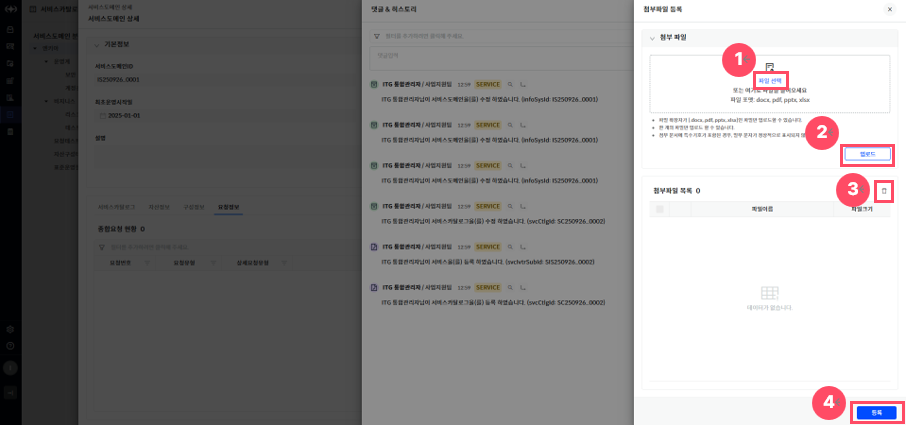

> ▶ \[그림7\] 서비스도메인 상세화면(드로어) – 댓글&히스토리(드로어) – 첨부파일 등록(드로어)

<table>
<tbody>
<tr class="odd">
<td>
노트

동일한 파일명을 가진 파일도 중복 등록이 가능합니다.

첨부파일 등록 후에는 댓글&amp;히스토리에서 파일을 다운로드 할 수 있습니다.
</td>
</tr>
</tbody>
</table>

> 상세 정보(댓글 & 히스토리)

<table>
<thead>
<tr class="header">
<th>[그림7].”1” 
파일선택</th>
<th>
화면 상단의 박스에 드래그 앤 드롭(Drag &amp; Drop)하거나, 클릭하여 로컬에서 파일을 선택할 수 있습니다.

* 지원되는 확장자는 .docx, .pdf, .pptx, .xlsx 등이며, 최대 용량 및 개수는 시스템 정책에 따라 제한됩니다.
</th>
</tr>
</thead>
<tbody>
<tr class="odd">
<td>[그림7].”2” 
업로드</td>
<td>파일 선택 후 업로드 버튼을 클릭하면, 선택된 파일이 첨부파일 목록에 등록됩니다. 
업로드 후 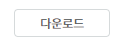 버튼 생성되어 파일을 다운로드 할 수 있습니다.</td>
</tr>
<tr class="even">
<td>[그림7].”3” 
파일삭제</td>
<td>첨부파일 목록에 등록된 파일들을 삭제할 수 있습니다.</td>
</tr>
<tr class="odd">
<td>[그림7].”4” 
파일등록</td>
<td>첨부파일 선택 및 업로드를 완료한 뒤, 하단의 등록 버튼을 클릭하면 해당 첨부파일이 최종 저장됩니다.</td>
</tr>
</tbody>
</table>

서비스카탈로그 상세 조회

서비스카탈로그 카드를 클릭하면 서비스카탈로그 상세화면(드로어)가 열립니다.

서비스카탈로그의 정보와 서비스카탈로그에 연결된 서비스목록, 자산정보, 구성정보, 요청정보를 조회할 수 있으며, 서비스 목록의 링크버튼을 클릭 시 연결된 서비스의 종류와 설정에 따라 드로어 오픈 또는 페이지 전환 방식으로 실행됩니다.

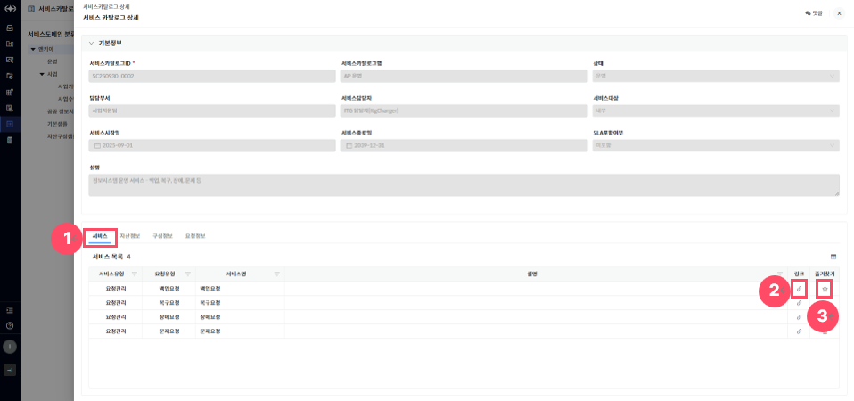

> ▶ \[그림8\] 서비스카탈로그 상세화면 - 서비스 탭
> 
> 화면 지표(기본정보)

<table>
<thead>
<tr class="header">
<th>서비스카탈로그ID</th>
<th>서비스카탈로그 고유식별을 위한 ID 값입니다.</th>
</tr>
</thead>
<tbody>
<tr class="odd">
<td>서비스카탈로그명</td>
<td>서비스카탈로그를 식별할 수 있는 명칭입니다.</td>
</tr>
<tr class="even">
<td>상태</td>
<td>
서비스카탈로그의 상태를 표시합니다.

- 기획 : 서비스가 아직 운영되지 않고, 작성 또는 검토 중인 단계입니다. 등록은 되었지만 서비스 제공되거나 활성화된 상태는 아닙니다.

- 운영 : 서비스시작일 ~ 서비스종료일 범위내에서 서비스가 제공되고 있는 상태입니다.

- 일시정지 : 서비스 제공이 일시 정지된 상태입니다.

- 종료 : 서비스 운영이 종료된 상태입니다.
</td>
</tr>
<tr class="odd">
<td>담당부서</td>
<td>해당 서비스카탈로그의 운영/관리 책임 부서입니다.</td>
</tr>
<tr class="even">
<td>서비스담당자</td>
<td>서비스카탈로그 관리하는 담당자입니다.</td>
</tr>
<tr class="odd">
<td>서비스대상</td>
<td>
서비스카탈로그가 제공되는 서비스 대상 구분입니다.

- 내부 : 내부에서 사용하는 서비스

- 외부 : 외부에서 사용하는 서비스
</td>
</tr>
<tr class="even">
<td>서비스시작일</td>
<td>서비스카탈로그의 서비스 시작일입니다.</td>
</tr>
<tr class="odd">
<td>서비스종료일</td>
<td>서비스카탈로그의 서비스 종료일입니다.</td>
</tr>
<tr class="even">
<td>SLA포함여부</td>
<td>
SLA 적용여부를 나타냅니다.

- 포함 : SLA 지표 및 이행 기준이 적용됩니다.

- 미포함 : SLA 지표 및 이행 기준이 적용되지 않습니다.
</td>
</tr>
<tr class="odd">
<td>설명</td>
<td>서비스카탈로그의 구체적인 용도 및 설명입니다.</td>
</tr>
</tbody>
</table>

> 상세 정보(서비스 탭)

<table>
<thead>
<tr class="header">
<th>[그림8].”1” 
서비스 탭</th>
<th>해당 서비스카탈로그에 연결된 서비스 정보를 조회할 수 있습니다.</th>
</tr>
</thead>
<tbody>
<tr class="odd">
<td>[그림8].”2” 
링크</td>
<td>
링크를 클릭하면, 연결된 서비스의 종류와 설정에 따라 드로어 오픈 또는 페이지 전환 방식으로 실행됩니다.

- 요청관리 : 요청등록화면(드로어)이 열려, 사용자가 직접 요청서를 작성하고 등록할 수 있습니다.

- ITAM관리 : ITAM자산 서비스 화면으로 메뉴이동이 이루어지며, 해당 서비스를 바로 이용할 수 있습니다.
</td>
</tr>
<tr class="even">
<td>[그림8].”3” 
즐겨찾기</td>
<td>즐겨 찾기를 클릭하면, 포탈의 “자주 찾는 서비스”에 해당 서비스가 등록되며, 다시 클릭하면 “자주 찾는 서비스”에 해당 서비스가 삭제됩니다.</td>
</tr>
</tbody>
</table>

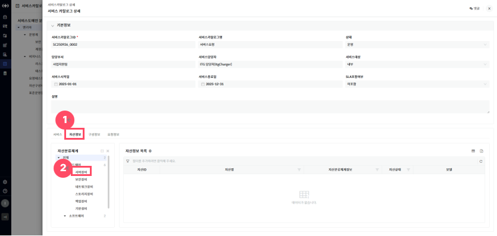

> ▶ \[그림9\] 서비스카탈로그 상세화면 - 자산정보 탭
> 
> 화면 지표(자산정보 목록)

<table>
<thead>
<tr class="header">
<th>자산ID</th>
<th>자산의 고유식별을 위한 ID 값입니다.</th>
</tr>
</thead>
<tbody>
<tr class="odd">
<td>자산명</td>
<td>자산을 식별할 수 있는 명칭입니다.</td>
</tr>
<tr class="even">
<td>자산분류체계정보</td>
<td>자산의 분류 체계이며 다단계 계층구조로 정의되어 있습니다.</td>
</tr>
<tr class="odd">
<td>자산상태</td>
<td>
자산의 상태 정보입니다.

- 입고 : 자산이 설치되어 운영되기전 들여온 상태입니다.

- 운영 : 자산이 설치되어 운영중인 상태입니다.

- 보류 : 자산이 운영되지 않고 정지 중인 상태입니다.

- 폐기 : 자산이 폐기처리 된 상태입니다.
</td>
</tr>
<tr class="even">
<td>모델</td>
<td>자산 제품 정보입니다.</td>
</tr>
</tbody>
</table>

> 상세 정보(자산정보 탭)

<table>
<thead>
<tr class="header">
<th>[그림9].”1” 
자산정보 탭</th>
<th>해당 서비스카탈로그에 연결된 자산정보를 조회할 수 있습니다.</th>
</tr>
</thead>
<tbody>
<tr class="odd">
<td>[그림9].”2” 
자산분류체계 트리</td>
<td>화면 좌측에 자산분류체계 트리 클릭 시 해당 분류만 조회할 수 있습니다.</td>
</tr>
</tbody>
</table>

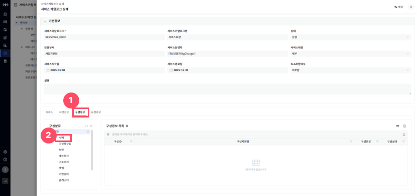

> ▶ \[그림10\] 서비스카탈로그 상세화면 – 구성정보 탭
> 
> 화면 지표(구성정보 목록)

<table>
<thead>
<tr class="header">
<th>구성ID</th>
<th>구성의 고유식별을 위한 ID 값입니다.</th>
</tr>
</thead>
<tbody>
<tr class="odd">
<td>구성자원명</td>
<td>구성을 식별할 수 있는 명칭입니다.</td>
</tr>
<tr class="even">
<td>구성분류</td>
<td>구성의 분류체계입니다.</td>
</tr>
<tr class="odd">
<td>구성상태</td>
<td>
구성의 관리 상태 정보입니다.

- 사용 : 작업관리 등록 가능한 상태입니다.

- 정지 : 작업관리 등록 불가, 기존에 등록된 구성 조회용도로만 사용되는 상태입니다.
</td>
</tr>
</tbody>
</table>

> 상세 정보(구성정보 탭)

<table>
<thead>
<tr class="header">
<th>[그림10].”1” 
구성정보 탭</th>
<th>해당 서비스도메인에 연결된 구성정보를 조회할 수 있습니다.</th>
</tr>
</thead>
<tbody>
<tr class="odd">
<td>[그림10].”2” 
구성분류 트리</td>
<td>화면 좌측에 구성분류 트리 클릭 시 해당 분류만 조회할 수 있습니다.</td>
</tr>
</tbody>
</table>

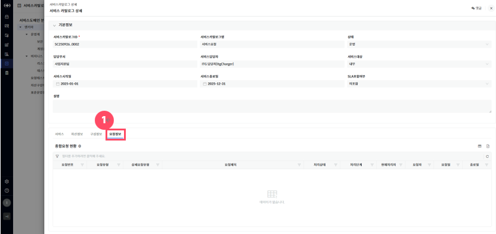

> ▶ \[그림11\] 서비스카탈로그 상세화면 – 요청정보 탭
> 
> 화면 지표(요청정보 목록)

| 요청번호   | 각 요청 건에 부여된 고유 식별 번호입니다. 요청을 조회하거나 추적할 때 사용됩니다. |
| ------ | ----------------------------------------------- |
| 요청유형   | 요청의 전체적인 분류를 나타냅니다.                             |
| 상세요청유형 | 요청유형 내에서 보다 구체적인 요청 항목을 의미합니다.                  |
| 요청제목   | 사용자가 입력한 요청 건의 제목입니다. 요청의 주요 내용을 간략히 나타냅니다.     |
| 처리상태   | 해당 요청의 현재 처리 상태를 나타냅니다.                         |
| 처리단계   | 요청이 현재 어떤 단계에 있는지를 나타냅니다.                       |
| 현재처리자  | 현재 요청을 처리하고 있는 담당자 이름 또는 부서를 나타냅니다.             |
| 요청자    | 해당 요청을 최초로 작성하여 등록한 사용자입니다.                     |
| 요청일    | 요청자가 지정한 요청이 생성된 날짜입니다.                         |
| 종료일    | 요청 처리가 완료된 날짜입니다.                               |

> 상세 정보(요청정보 탭)

<table>
<tbody>
<tr class="odd">
<td>[그림 11].“1” 
요청정보 탭</td>
<td>해당 서비스도메인에 연결된 요청정보를 조회할 수 있습니다.</td>
</tr>
</tbody>
</table>

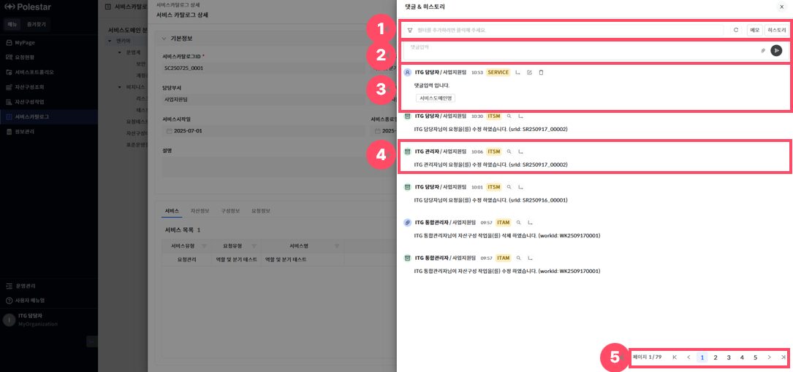

> ▶ \[그림12\] 서비스카탈로그 상세화면 – 댓글&히스토리(드로어)
> 
> 상세 정보(댓글 & 히스토리)

<table>
<tbody>
<tr class="odd">
<td>
노트

댓글 상세 기능 사용법은 [서비스포트폴리오[그림 8] &gt; 상세정보 &gt; 댓글 &amp; 히스토리] 메뉴얼을 참조하시기 바랍니다.
</td>
</tr>
</tbody>
</table>

<table>
<thead>
<tr class="header">
<th>[그림 12].“1” 
필터</th>
<th>
필터는 각 댓글의 데이터 단위로 상세한 조건 검색이 가능한 기능입니다.

- 메모 : 작성한 댓글만 조회할 수 있습니다.

- 히스토리 : 히스토리 댓글만 조회할 수 있습니다.
</th>
</tr>
</thead>
<tbody>
<tr class="odd">
<td>[그림 12].“2” 
댓글입력</td>
<td>
화면 상단 입력란에 내용을 작성하여 의견을 등록할 수 있습니다.

 : 파일 첨부 버튼을 통해 관련 문서나 이미지 파일을 함께 첨부할 수 있습니다.

 : 등록 버튼을 클릭하면 댓글이 등록됩니다.
</td>
</tr>
<tr class="even">
<td>[그림 12].“3” 
댓글</td>
<td>
등록된 댓글은 작성자 정보, 부서, 작성일, 시스템 태그, 관련 서비스 링크, 첨부파일과 함께 최신순으로 표시됩니다.

 : 해당 댓글의 대 댓글을 등록할 수 있습니다.

: 해당 댓글을 수정할 수 있습니다.

: 해당 댓글을 삭제할 수 있습니다.
</td>
</tr>
<tr class="odd">
<td>[그림 12].“4” 
히스토리</td>
<td>
히스토리 댓글은 시스템에 의해 자동으로 생성된 처리 이력 정보이며, 사용자정보, 사용자부서, 처리일, 시스템 태그와 함께 최신순으로 표시됩니다.

 : 이력상세보기가 가능합니다.

 : 해당 댓글의 대 댓글을 등록할 수 있습니다.
</td>
</tr>
<tr class="even">
<td>[그림 12].“5” 
페이징</td>
<td>목록 데이터를 구간별로 나누어 페이지 단위로 조회할 수 있도록 도와주는 기능입니다.</td>
</tr>
</tbody>
</table>

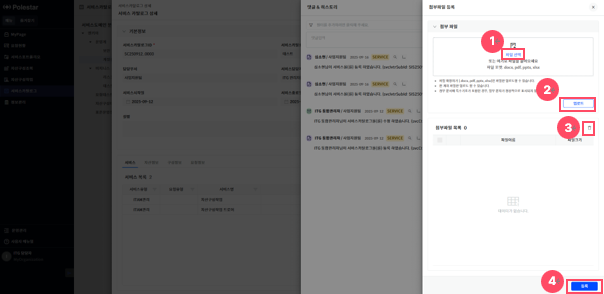

> ▶ \[그림13\] 서비스카탈로그 상세화면(드로어) – 댓글&히스토리(드로어) – 첨부파일 등록(드로어)

<table>
<tbody>
<tr class="odd">
<td>
노트

동일한 파일명을 가진 파일도 중복 등록이 가능합니다.

첨부파일 등록 후에는 댓글&amp;히스토리에서 파일을 다운로드 할 수 있습니다.
</td>
</tr>
</tbody>
</table>

> 상세 정보(댓글 & 히스토리)

<table>
<thead>
<tr class="header">
<th>[그림13].”1” 
파일선택</th>
<th>
화면 상단의 박스에 드래그 앤 드롭(Drag &amp; Drop)하거나, 클릭하여 로컬에서 파일을 선택할 수 있습니다.

* 지원되는 확장자는 .docx, .pdf, .pptx, .xlsx 등이며, 최대 용량 및 개수는 시스템 정책에 따라 제한됩니다.
</th>
</tr>
</thead>
<tbody>
<tr class="odd">
<td>[그림13].”2” 
업로드</td>
<td>파일 선택 후 업로드 버튼을 클릭하면, 선택된 파일이 첨부파일 목록에 등록됩니다. 
업로드 후  버튼 생성되어 파일을 다운로드 할 수 있습니다.</td>
</tr>
<tr class="even">
<td>[그림13].”3” 
파일삭제</td>
<td>첨부파일 목록에 등록된 파일들을 삭제할 수 있습니다.</td>
</tr>
<tr class="odd">
<td>[그림13].”4” 
파일등록</td>
<td>첨부파일 선택 및 업로드를 완료한 뒤, 하단의 등록 버튼을 클릭하면 해당 첨부파일이 최종 저장됩니다.</td>
</tr>
</tbody>
</table>

