서비스포트폴리오 – 서비스도메인 관리

메뉴에서 \[서비스포트폴리오\]를 선택하면, 서비스도메인 목록 및 신규 등록 또는 정보 수정을 할 수 있습니다. 또한 해당 도메인서비스를 기반으로 하는 서비스 카탈로그도 관리가 가능합니다.

<table>
<tbody>
<tr class="odd">
<td>
노트

서비스도메인 정보 수정은 권한이 부여된 사용자만 가능합니다.
</td>
</tr>
</tbody>
</table>

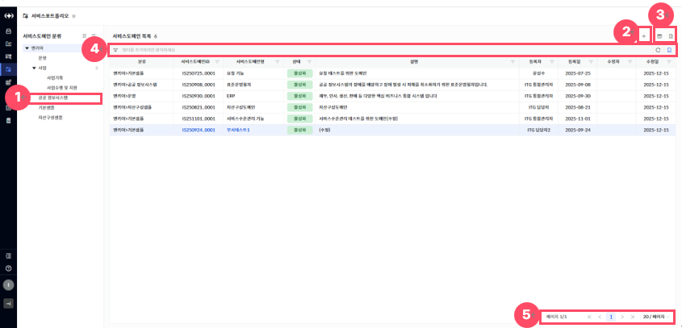

> ▶ \[그림1\] 포트폴리오 목록
> 
> 화면 지표(서비스도메인 목록)

<table>
<thead>
<tr class="header">
<th>분류</th>
<th>서비스도메인의 분류이며 다단계 계층 구조로 정의되어 있습니다.</th>
</tr>
</thead>
<tbody>
<tr class="odd">
<td>서비스도메인ID</td>
<td>서비스도메인 고유식별을 위한 ID 값입니다.</td>
</tr>
<tr class="even">
<td>서비스도메인명</td>
<td>서비스도메인을 식별할 수 있는 명칭입니다.</td>
</tr>
<tr class="odd">
<td>상태</td>
<td>
서비스도메인의 상태를 표시합니다.

- 도입 : 서비스 도메인을 최초로 등록한 초기 단계입니다. 아직 운영 중이지 않으며, 준비 단계에 해당합니다.

- 활성화 : 실제 운영 중인 상태입니다. 사용자 또는 시스템에서 서비스가 정상적으로 사용되고 있습니다.

- 정지 : 일시적으로 운영을 중단한 상태입니다. 서비스카탈로그의 운영을 통해 다시 활성화될 수 있습니다.

- 유휴 : 연결된 서비스카탈로그의 운영이 종료되어, 현재 서비스가 제공되지 않는 상태입니다.

- 폐기 : 서비스 도메인 자체가 완전히 폐기된 상태입니다. 모든 기능이 비활성화 되며, 조회만 가능합니다.
</td>
</tr>
<tr class="even">
<td>설명</td>
<td>서비스도메인의 구체적인 용도 및 설명입니다.</td>
</tr>
<tr class="odd">
<td>등록자/등록일</td>
<td>서비스도메인을 최초로 등록한 사용자와 그 일자 정보입니다.</td>
</tr>
<tr class="even">
<td>수정자/수정일</td>
<td>서비스도메인을 마지막으로 수정한 사용자와 그 일자 정보입니다.</td>
</tr>
</tbody>
</table>

> 상세 정보

<table>
<thead>
<tr class="header">
<th>[그림1].”1” 
서비스도메인 분류</th>
<th>화면 좌측에 서비스도메인 분류 트리를 클릭 시 해당 분류만 조회할 수 있습니다.</th>
</tr>
</thead>
<tbody>
<tr class="odd">
<td>[그림1].”2” 
등록</td>
<td>좌측 [서비스도메인 분류] 트리에서 최하위 노드를 먼저 선택하고, 등록 버튼을 클릭하면 서비스도메인 등록 화면(드로어)이 열립니다.</td>
</tr>
<tr class="even">
<td>[그림1].”3” 
컬럼수정 &amp; 엑셀저장</td>
<td>표시할 컬럼을 선택하거나 숨길 수 있는 설정 기능을 제공하는 컬럼수정 버튼과, 현재 화면에 표시된 데이터를 엑셀파일로 다운로드 하는 기능을 제공하는 엑셀저장 버튼입니다.</td>
</tr>
<tr class="odd">
<td>[그림1].”4” 
그리드 필터</td>
<td>그리드 필터는 상단 행(필터 행)을 통해 각 컬럼 단위로 상세한 조건 검색이 가능하며, 자주 사용하는 필터 조건을 즐겨 찾기로 저장하여 빠르게 적용할 수 있습니다.</td>
</tr>
<tr class="even">
<td>[그림1].”5” 
페이징</td>
<td>목록 데이터를 구간별로 나누어 페이지 단위로 조회할 수 있도록 도와주는 기능입니다.</td>
</tr>
</tbody>
</table>

서비스도메인 등록

서비스 도메인 등록 및 수정은 권한이 부여된 사용자만 가능합니다. 일반 사용자는 조회 기능만 이용할 수 있습니다.  
신규 등록을 진행하려면, 좌측 \[서비스도메인 분류\] 트리에서 최하위 노드를 선택한 후 \[등록\] 버튼(\[그림1\]-2) 을 클릭하면 등록 화면(드로어)이 열립니다.신규 등록을 위해서는 좌측 \[서비스도메인 분류\] 트리에서 최하위 노드를 먼저 선택하고, 등록 버튼 (\[그림1\].”2”)을 클릭하면 등록화면(드로어)가 열립니다.

<table>
<tbody>
<tr class="odd">
<td>
노트

서비스포트폴리오 등록 시, ‘서비스도메인ID’는 자동으로 채번되며, 상태는 ‘도입’으로 고정됩니다. 
또한 ‘최초운영시작일’과 ‘마지막운영종료일’은 서비스카탈로그를 통해서만 설정할 수 있으며, 서비스포트폴리오 등록 화면에서는 직접 수정이 불가능합니다.

아울러, 서비스카탈로그는 해당 등록 화면에서 신규로 추가할 수 없습니다.
</td>
</tr>
</tbody>
</table>

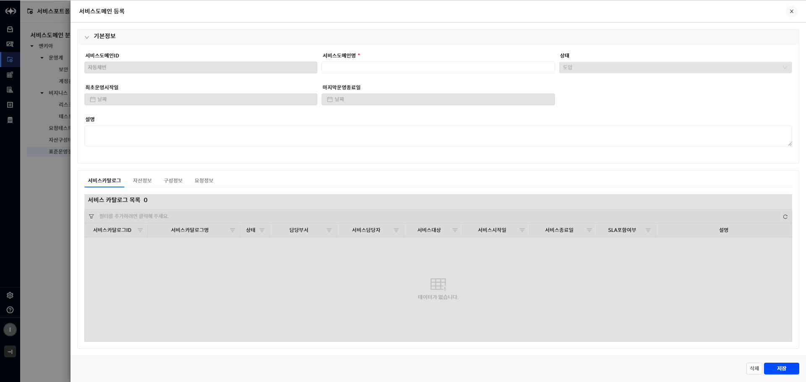

> ▶ \[그림2\] 서비스도메인 등록 화면(드로어)
> 
> 화면 지표(기본정보)

<table>
<thead>
<tr class="header">
<th>서비스도메인ID</th>
<th>서비스도메인의 고유식별을 위한 ID 값입니다.</th>
</tr>
</thead>
<tbody>
<tr class="odd">
<td>서비스도메인명</td>
<td>서비스도메인을 식별할 수 있는 명칭입니다.</td>
</tr>
<tr class="even">
<td>상태</td>
<td>
서비스도메인의 상태를 표시합니다.

- 도입 : 서비스 도메인을 최초로 등록한 초기 단계입니다. 아직 운영 중이지 않으며, 준비 단계에 해당합니다.

- 활성화 : 실제 운영 중인 상태입니다. 사용자 또는 시스템에서 서비스가 정상적으로 사용되고 있습니다.

- 정지 : 일시적으로 운영을 중단한 상태입니다. 서비스카탈로그의 운영을 통해 다시 활성화될 수 있습니다.

- 유휴 : 연결된 서비스카탈로그의 운영이 종료되어, 현재 서비스가 제공되지 않는 상태입니다.

- 폐기 : 서비스 도메인 자체가 완전히 폐기된 상태입니다. 모든 기능이 비활성화 되며, 조회만 가능합니다.
</td>
</tr>
<tr class="odd">
<td>최초운영시작일</td>
<td>연결된 서비스카탈로그 중, 서비스 운영이 가장 먼저 시작된 날짜입니다.</td>
</tr>
<tr class="even">
<td>마지막운영종료일</td>
<td>연결된 서비스카탈로그 중, 서비스 운영이 가장 늦게 종료된 날짜입니다.</td>
</tr>
<tr class="odd">
<td>설명</td>
<td>서비스도메인의 구체적인 용도 및 설명입니다.</td>
</tr>
</tbody>
</table>

> 서비스도메인 등록 절차

1.  서비스도메인 목록 우측 상단의 등록 버튼(\[그림1\].”2”)을 클릭합니다.

2.  화면(\[그림2\])의 필수 항목(\[ \* \] 모양의 표식이 되어있는 항목)을 입력합니다.

3.  화면 우측 하단의 \[저장\]버튼 클릭합니다.

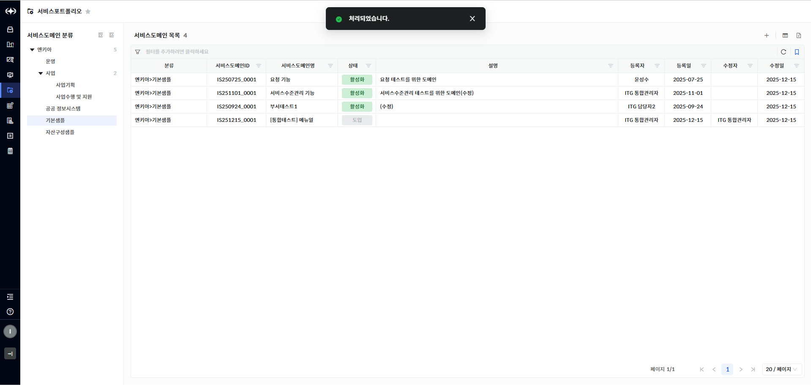

> ▶ \[그림3\] 서비스도메인 등록 – 등록 완료

서비스도메인 수정

서비스도메인 목록에서 “서비스도메인ID” 또는 “서비스도메인명”을 클릭하면 수정이 가능한 상세화면(드로어)가 열립니다.

서비스도메인의 정보와 연결된 서비스카탈로그, 자산정보, 구성정보, 요청정보, 댓글&히스토리 조회가 가능합니다. 단, 자산정보, 구성정보, 요청정보는 지정된 권한이 있는 사용자만 조회 가능합니다.

<table>
<tbody>
<tr class="odd">
<td>
노트

지정된 권한이 있는 사용자만 서비스 도메인을 수정할 수 있습니다.

또한, 서비스도메인의 상태가 ‘도입’이고, 연결된 서비스카탈로그가 하나도 없는 경우에만 삭제가 가능합니다.
</td>
</tr>
</tbody>
</table>

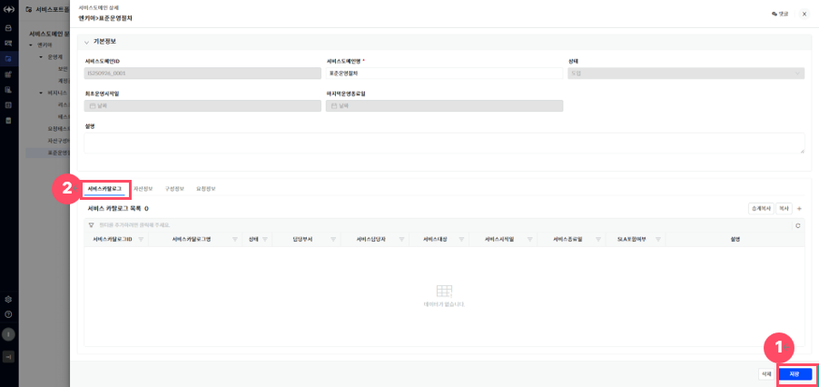

> ▶ \[그림4\] 서비스도메인 상세 화면(드로어) – 서비스카탈로그(탭)
> 
> 상세 정보

<table>
<thead>
<tr class="header">
<th>[그림 4].“1” 
저장</th>
<th>저장 버튼 클릭을 통해 서비스도메인을 저장할 수 있습니다.</th>
</tr>
</thead>
<tbody>
<tr class="odd">
<td>[그림 4].“2” 
서비스카탈로그 탭</td>
<td>해당 서비스도메인에 연결된 서비스카탈로그 중 같은 부서의 서비스카탈로그 목록을 조회할 수 있습니다.</td>
</tr>
</tbody>
</table>

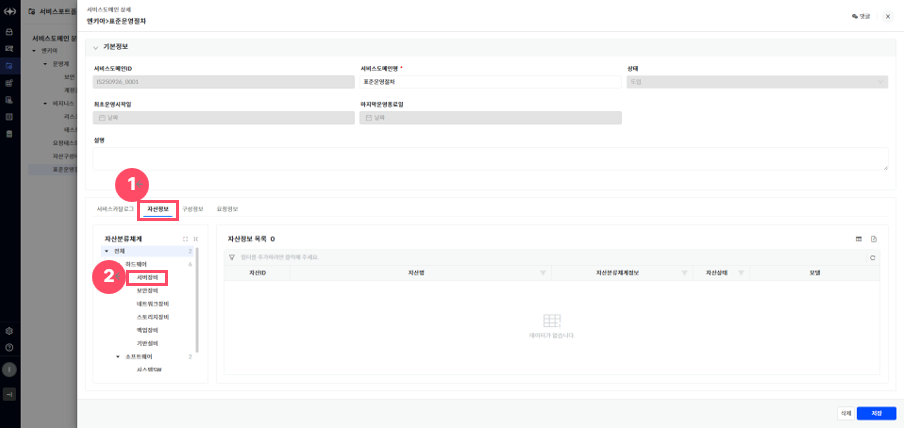

> ▶ \[그림5\] 서비스도메인 상세화면(드로어) – 자산정보(탭)
> 
> 화면 지표(자산정보 목록)

<table>
<thead>
<tr class="header">
<th>자산ID</th>
<th>자산의 고유식별을 위한 ID 값입니다.</th>
</tr>
</thead>
<tbody>
<tr class="odd">
<td>자산명</td>
<td>자산을 식별할 수 있는 명칭입니다.</td>
</tr>
<tr class="even">
<td>자산분류체계정보</td>
<td>자산의 분류 체계이며 다단계 계층구조로 정의되어 있습니다.</td>
</tr>
<tr class="odd">
<td>자산상태</td>
<td>
자산의 상태정보입니다.

- 입고 : 자산이 설치되어 운영되기전 들여온 상태입니다.

- 운영 : 자산이 설치되어 운영중인 상태입니다.

- 보류 : 자산이 운영되지 않고 정지 중 인 상태입니다.

- 폐기 : 자산이 폐기처리 된 상태입니다.
</td>
</tr>
<tr class="even">
<td>모델</td>
<td>자산 제품정보 입니다.</td>
</tr>
</tbody>
</table>

> 상세 정보(자산정보 탭)

<table>
<thead>
<tr class="header">
<th>[그림 5].“1” 
자산정보 탭</th>
<th>해당 서비스도메인에 연결된 자산정보를 조회할 수 있습니다.</th>
</tr>
</thead>
<tbody>
<tr class="odd">
<td>[그림 5].“2” 
자산분류체계 트리</td>
<td>화면 좌측에 자산분류체계 트리 클릭 시 해당 분류만 조회할 수 있습니다.</td>
</tr>
</tbody>
</table>

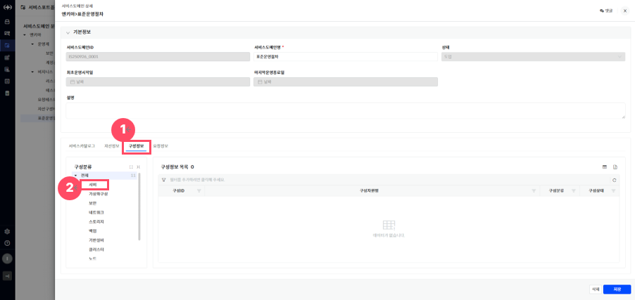

> ▶ \[그림6\] 서비스도메인 상세화면(드로어) – 구성정보(탭)
> 
> 화면 지표(구성정보 목록)

<table>
<thead>
<tr class="header">
<th>구성ID</th>
<th>구성의 고유식별을 위한 ID 값입니다.</th>
</tr>
</thead>
<tbody>
<tr class="odd">
<td>구성자원명</td>
<td>구성을 식별할 수 있는 명칭입니다.</td>
</tr>
<tr class="even">
<td>구성분류</td>
<td>구성의 분류체계입니다.</td>
</tr>
<tr class="odd">
<td>구성상태</td>
<td>
구성의 관리 상태 정보입니다.

- 사용 : 작업관리 등록 가능한 상태입니다.

- 정지 : 작업관리 등록 불가, 기존에 등록된 구성 조회용도로만 사용되는 상태입니다.
</td>
</tr>
</tbody>
</table>

> 상세 정보(구성정보 탭)

<table>
<thead>
<tr class="header">
<th>[그림 6].“1” 
구성정보 탭</th>
<th>해당 서비스도메인에 연결된 구성정보를 조회할 수 있습니다.</th>
</tr>
</thead>
<tbody>
<tr class="odd">
<td>[그림 6].“2” 
구성분류 트리</td>
<td>화면 좌측에 구성분류 트리 클릭 시 해당 분류만 조회할 수 있습니다.</td>
</tr>
</tbody>
</table>

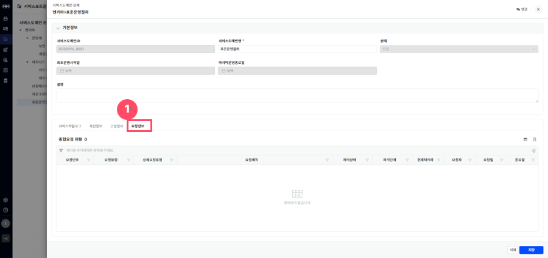

> ▶ \[그림7\] 서비스도메인 상세화면(드로어) – 요청정보(탭)
> 
> 화면 지표(요청정보 목록)

| 요청번호   | 각 요청 건에 부여된 고유 식별 번호입니다. 요청을 조회하거나 추적할 때 사용됩니다. |
| ------ | ----------------------------------------------- |
| 요청유형   | 요청의 전체적인 분류를 나타냅니다.                             |
| 상세요청유형 | 요청유형 내에서 보다 구체적인 요청 항목을 의미합니다.                  |
| 요청제목   | 사용자가 입력한 요청 건의 제목입니다. 요청의 주요 내용을 간략히 나타냅니다.     |
| 처리상태   | 해당 요청의 현재 처리 상태를 나타냅니다.                         |
| 처리단계   | 요청이 현재 어떤 단계에 있는지를 나타냅니다.                       |
| 현재처리자  | 현재 요청을 처리하고 있는 담당자 이름 또는 부서를 나타냅니다.             |
| 요청자    | 해당 요청을 최초로 작성하여 등록한 사용자입니다.                     |
| 요청일    | 요청자가 지정한 요청이 생성된 날짜입니다.                         |
| 종료일    | 요청 처리가 완료된 날짜입니다.                               |

> 상세 정보(요청정보 탭)

<table>
<tbody>
<tr class="odd">
<td>[그림 7].“1” 
요청정보 탭</td>
<td>해당 서비스도메인에 연결된 요청정보를 조회할 수 있습니다.</td>
</tr>
</tbody>
</table>

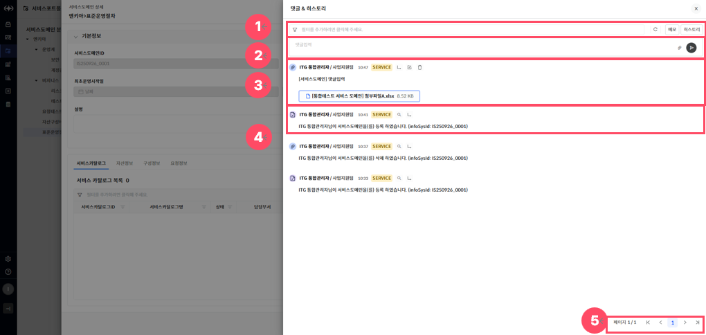

> ▶ \[그림8\] 서비스도메인 상세화면(드로어) – 댓글&히스토리(드로어)

<table>
<tbody>
<tr class="odd">
<td>
노트

사용자가 등록한 댓글은 대 댓글, 수정, 삭제가 가능합니다.

히스토리 댓글은 대 댓글, 이력상세보기가 가능합니다.
</td>
</tr>
</tbody>
</table>

> 상세 정보(댓글 & 히스토리)

<table>
<thead>
<tr class="header">
<th>[그림 8].“1” 
필터</th>
<th>
필터는 각 댓글의 데이터 단위로 상세한 조건 검색이 가능한 기능입니다.

- 메모 : 작성한 댓글만 조회할 수 있습니다.

- 히스토리 : 히스토리 댓글만 조회할 수 있습니다.
</th>
</tr>
</thead>
<tbody>
<tr class="odd">
<td>[그림 8].“2” 
댓글입력</td>
<td>
화면 상단 입력란에 내용을 작성하여 의견을 등록할 수 있습니다.

 : 파일 첨부 버튼을 통해 관련 문서나 이미지 파일을 함께 첨부할 수 있습니다.

 : 등록 버튼을 클릭하면 댓글이 등록됩니다.
</td>
</tr>
<tr class="even">
<td>[그림 8].“3” 
댓글</td>
<td>
등록된 댓글은 작성자 정보, 부서, 작성일, 시스템 태그, 관련 서비스 링크, 첨부파일과 함께 최신순으로 표시됩니다.

 : 해당 댓글의 대 댓글을 등록할 수 있습니다.

: 해당 댓글을 수정할 수 있습니다.

: 해당 댓글을 삭제할 수 있습니다.
</td>
</tr>
<tr class="odd">
<td>[그림 8].“4” 
히스토리</td>
<td>
히스토리 댓글은 시스템에 의해 자동으로 생성된 처리 이력 정보이며, 사용자정보, 사용자부서, 처리일, 시스템 태그와 함께 최신순으로 표시됩니다.

 : 이력상세보기가 가능합니다.

 : 해당 댓글의 대 댓글을 등록할 수 있습니다.
</td>
</tr>
<tr class="even">
<td>[그림 8].“5” 
페이징</td>
<td>목록 데이터를 구간별로 나누어 페이지 단위로 조회할 수 있도록 도와주는 기능입니다.</td>
</tr>
</tbody>
</table>

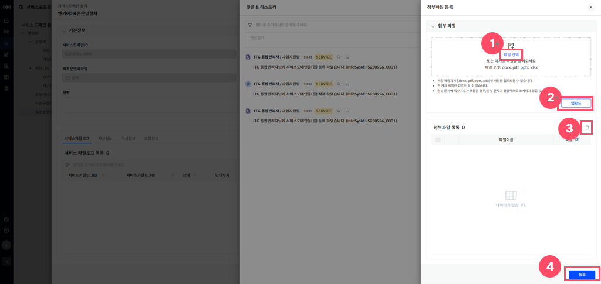

> ▶ \[그림9\] 서비스도메인 상세화면(드로어) – 댓글&히스토리(드로어) – 첨부파일 등록(드로어)

<table>
<tbody>
<tr class="odd">
<td>
노트

동일한 파일명을 가진 파일도 중복 등록이 가능합니다.

첨부파일 등록 후에는 댓글&amp;히스토리에서 파일을 다운로드 할 수 있습니다.
</td>
</tr>
</tbody>
</table>

> 상세 정보(댓글 & 히스토리)

<table>
<thead>
<tr class="header">
<th>[그림 9].“1” 
파일선택</th>
<th>
화면 상단의 박스에 드래그 앤 드롭(Drag &amp; Drop)하거나, 클릭하여 로컬에서 파일을 선택할 수 있습니다.

* 지원되는 확장자는 docx, pdf, pptx, xlsx등이며, 최대 용량 및 개수는 시스템 정책에 따라 제한됩니다.
</th>
</tr>
</thead>
<tbody>
<tr class="odd">
<td>[그림 9].“2” 
업로드</td>
<td>파일 선택 후 업로드 버튼을 클릭하면, 선택된 파일이 첨부파일 목록에 등록됩니다. 
업로드 후  버튼 생성되어 파일을 다운로드 할 수 있습니다.</td>
</tr>
<tr class="even">
<td>[그림 9].“3” 
파일삭제</td>
<td>첨부파일 목록에 등록된 파일들을 삭제할 수 있습니다.</td>
</tr>
<tr class="odd">
<td>[그림 9].“4” 
파일등록</td>
<td>첨부파일 선택 및 업로드를 완료한 뒤, 하단의 등록 버튼을 클릭하면 해당 첨부파일이 최종 저장됩니다.</td>
</tr>
</tbody>
</table>

서비스도메인 삭제

서비스도메인 상세화면(드로어)에서 \[삭제\] 버튼을 클릭하여 서비스도메인을 삭제할 수 있습니다.

<table>
<tbody>
<tr class="odd">
<td>
노트

지정된 권한이 있는 사용자만 서비스 도메인을 삭제할 수 있습니다.

서비스도메인의 상태가 ‘도입’이고, 연결된 서비스카탈로그가 하나도 없는 경우에만 삭제가 가능합니다.
</td>
</tr>
</tbody>
</table>

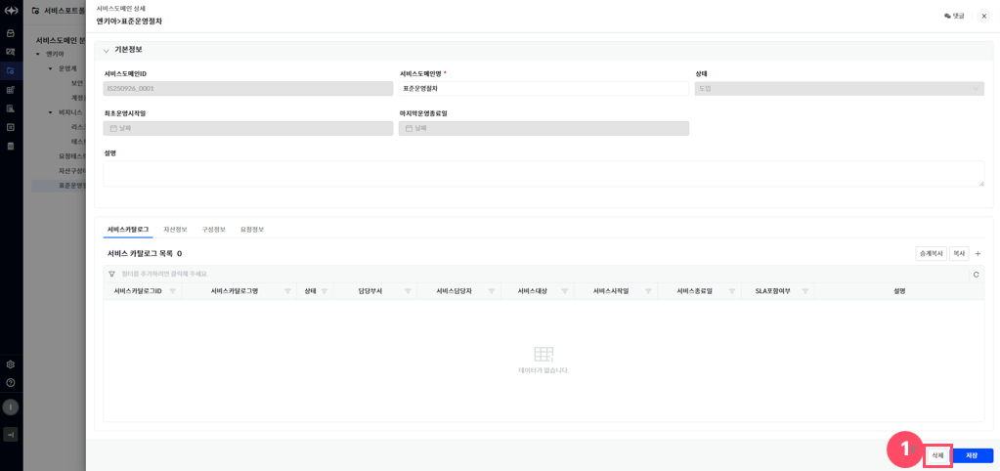

> ▶ \[그림10\] 서비스도메인 상세 화면(드로어)
> 
> 상세 정보

<table>
<tbody>
<tr class="odd">
<td>[그림 10].“1” 
삭제</td>
<td>삭제 버튼 클릭을 통해 서비스도메인을 삭제할 수 있습니다.</td>
</tr>
</tbody>
</table>

서비스포트폴리오 – 서비스카탈로그 관리

서비스도메인 상세화면(드로어)에서 \[서비스카탈로그 탭\]을 선택하면, 해당 서비스도메인에 연결된 서비스 카탈로그 중 같은 부서의 서비스카탈로그 목록을 조회할 수 있습니다.

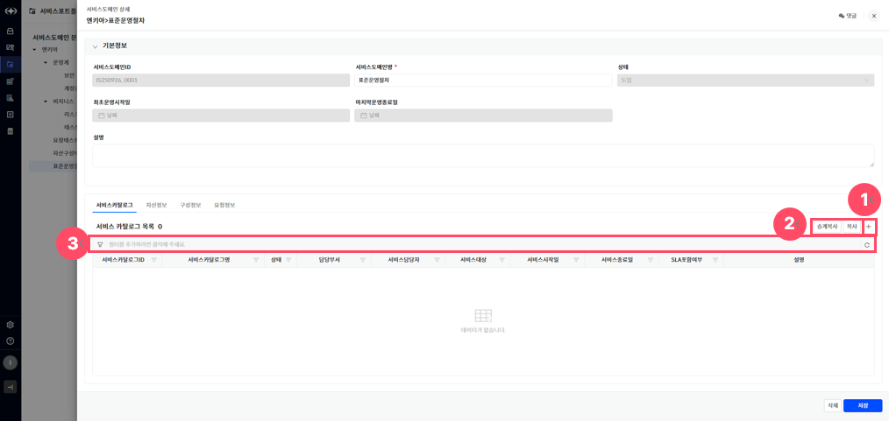

> ▶ \[그림11\] 서비스도메인 상세화면(드로어) – 서비스카탈로그(탭)
> 
> 화면 지표(서비스 카탈로그 목록)

<table>
<thead>
<tr class="header">
<th>서비스카탈로그ID</th>
<th>서비스카탈로그 고유식별을 위한 ID 값입니다.</th>
</tr>
</thead>
<tbody>
<tr class="odd">
<td>서비스카탈로그명</td>
<td>서비스카탈로그를 식별할 수 있는 명칭입니다.</td>
</tr>
<tr class="even">
<td>상태</td>
<td>
서비스카탈로그의 상태를 표시합니다.

- 기획 : 서비스가 아직 운영되지 않고, 작성 또는 검토 중인 단계입니다. 등록은 되었지만 서비스 제공되거나 활성화된 상태는 아닙니다.

- 운영 : 서비스시작일 ~ 서비스종료일 범위내에서 서비스가 제공되고 있는 상태입니다.

- 일시정지 : 서비스 제공이 일시 정지된 상태입니다.

- 종료 : 서비스 운영이 종료된 상태입니다.
</td>
</tr>
<tr class="odd">
<td>담당부서</td>
<td>해당 서비스카탈로그의 운영/관리 책임 부서입니다.</td>
</tr>
<tr class="even">
<td>서비스담당자</td>
<td>서비스카탈로그 관리하는 담당자입니다.</td>
</tr>
<tr class="odd">
<td>서비스대상</td>
<td>
서비스카탈로그가 제공되는 서비스 대상 구분입니다.

- 내부 : 내부에서 사용하는 서비스

- 외부 : 외부에서 사용하는 서비스
</td>
</tr>
<tr class="even">
<td>서비스시작일</td>
<td>서비스카탈로그의 서비스 시작일입니다.</td>
</tr>
<tr class="odd">
<td>서비스종료일</td>
<td>서비스카탈로그의 서비스 종료일입니다.</td>
</tr>
<tr class="even">
<td>SLA포함여부</td>
<td>
SLA 적용여부를 나타냅니다.

- 포함 : SLA 지표 및 이행 기준이 적용됩니다.

- 미포함 : SLA 지표 및 이행 기준이 적용되지 않습니다.
</td>
</tr>
<tr class="odd">
<td>설명</td>
<td>서비스카탈로그의 구체적인 용도 및 설명입니다.</td>
</tr>
</tbody>
</table>

> 상세 정보

<table>
<thead>
<tr class="header">
<th>[그림 11].“1” 
등록</th>
<th>등록버튼을 클릭하면 등록화면(드로어)가 열립니다.</th>
</tr>
</thead>
<tbody>
<tr class="odd">
<td>[그림 11].“2” 
승계복사 &amp; 복사</td>
<td>
[승계복사]

- 계약 등과 관련하여 동일한 카탈로그가 매년 갱신되는 경우 사용하는 기능

- 동일한 정보를 복사

- 일정정보 연계 순증

- 연관관계 포함(최상위, 상위) : 하위 카탈로그 권한만 있어도, 최상위 이하 모든 카탈로그의 사용권한 획득함.

[복사]

- 동일한 정보를 단순히 복사 (연관 관계없고, 사용권한 승계도 없음)
</td>
</tr>
<tr class="even">
<td>[그림 11].“3” 
그리드 필터</td>
<td>그리드 필터는 상단 행(필터 행)을 통해 각 컬럼 단위로 상세한 조건 검색이 가능한 기능입니다.</td>
</tr>
</tbody>
</table>

서비스카탈로그 등록

서비스카탈로그를 신규 등록하기 위해서는, 서비스도메인 상세화면(드로어)에서 \[서비스카탈로그 탭\]을 선택한 뒤, 우측 상단의 등록버튼(\[그림 10\].“1”)을 클릭합니다.

등록버튼 클릭 시 서비스카탈로그 등록화면(드로어)이 열리며, 관련 정보를 입력 후 저장하면 서비스카탈로그가 목록에 추가됩니다.

<table>
<tbody>
<tr class="odd">
<td>
노트

서비스카탈로그 등록 시, ‘서비스카탈로그ID’는 자동으로 채번되며, 상태는 ‘기획’으로 고정됩니다. 
또한 ‘담당부서’는 서비스카탈로그를 등록하는 사용자의 부서 정보가 자동으로 설정되며, 해당 등록 화면에서 서비스를 등록할 수 없습니다.
</td>
</tr>
</tbody>
</table>

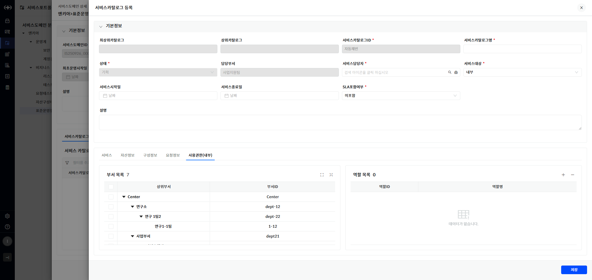

> ▶ \[그림12\] 서비스카탈로그 등록화면(드로어)
> 
> 화면 지표(기본정보)

<table>
<thead>
<tr class="header">
<th>최상위 카탈로그</th>
<th>상위에 연결된 루트 카탈로그가 있을 경우 자동 표시됩니다.</th>
</tr>
</thead>
<tbody>
<tr class="odd">
<td>상위 카탈로그</td>
<td>직접 연결된 상위 카탈로그의 명칭을 표시합니다.</td>
</tr>
<tr class="even">
<td>서비스카탈로그ID</td>
<td>서비스카탈로그 고유식별을 위한 ID 값입니다.</td>
</tr>
<tr class="odd">
<td>서비스카탈로그명</td>
<td>서비스카탈로그를 식별할 수 있는 명칭입니다.</td>
</tr>
<tr class="even">
<td>상태</td>
<td>
서비스카탈로그의 상태를 표시합니다.

- 기획 : 서비스가 아직 운영되지 않고, 작성 또는 검토 중인 단계입니다. 등록은 되었지만 서비스 제공되거나 활성화된 상태는 아닙니다.

- 운영 : 서비스시작일 ~ 서비스종료일 범위내에서 서비스가 제공되고 있는 상태입니다.

- 일시정지 : 서비스 제공이 일시 정지된 상태입니다.

- 종료 : 서비스 운영이 종료된 상태입니다.
</td>
</tr>
<tr class="odd">
<td>담당부서</td>
<td>서비스카탈로그의 운영 및 관리를 담당하는 책임 부서입니다.</td>
</tr>
<tr class="even">
<td>서비스담당자</td>
<td>
서비스카탈로그 관리하는 담당자입니다. 
 : 서비스담당자 팝업 호출

 : 선택된 서비스담당자를 삭제
</td>
</tr>
<tr class="odd">
<td>서비스대상</td>
<td>
서비스카탈로그가 제공되는 서비스 대상 구분입니다.

- 내부 : 내부에서 사용하는 서비스

- 외부 : 외부에서 사용하는 서비스
</td>
</tr>
<tr class="even">
<td>서비스시작일</td>
<td>서비스카탈로그의 서비스 시작일입니다.</td>
</tr>
<tr class="odd">
<td>서비스종료일</td>
<td>서비스카탈로그의 서비스 종료일입니다.</td>
</tr>
<tr class="even">
<td>SLA포함여부</td>
<td>
SLA 적용여부를 나타냅니다.

- 포함 : SLA 지표 및 이행 기준이 적용됩니다.

- 미포함 : SLA 지표 및 이행 기준이 적용되지 않습니다.
</td>
</tr>
<tr class="odd">
<td>설명</td>
<td>서비스카탈로그의 구체적인 용도 및 설명입니다.</td>
</tr>
</tbody>
</table>

> 서비스카탈로그 등록 절차

1.  서비스카탈로그 목록 우측 상단의 등록버튼(\[그림 10\].“1”)을 클릭합니다.

2.  화면(\[그림12\])의 필수 항목(\[ \* \] 모양의 표식이 되어있는 항목)을 입력합니다.

3.  화면 우측 하단의 \[저장\]버튼 클릭

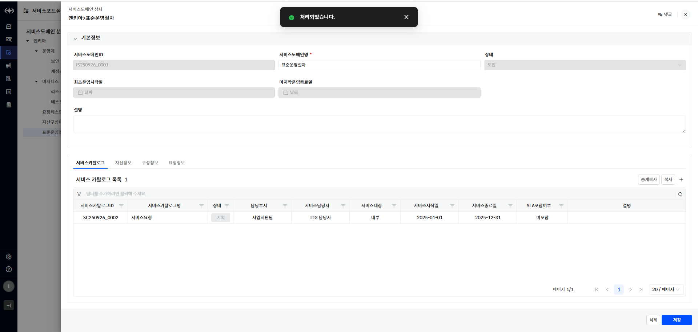

> ▶ \[그림13\] 서비스카탈로그 등록 – 등록 완료

서비스카탈로그 수정

서비스카탈로그 목록에서 서비스카탈로그ID 또는 서비스카탈로그명을 클릭하면 수정이 가능한 상세화면(드로어)가 열립니다.

서비스카탈로그의 정보와 연결된 서비스, 자산정보, 구성정보, 댓글&히스토리 조회가 가능합니다.

<table>
<tbody>
<tr class="odd">
<td>
노트

해당 서비스카탈로그를 최초 등록한 사용자이거나, 동일 부서에 소속된 사용자만 수정할 수 있습니다.
</td>
</tr>
</tbody>
</table>

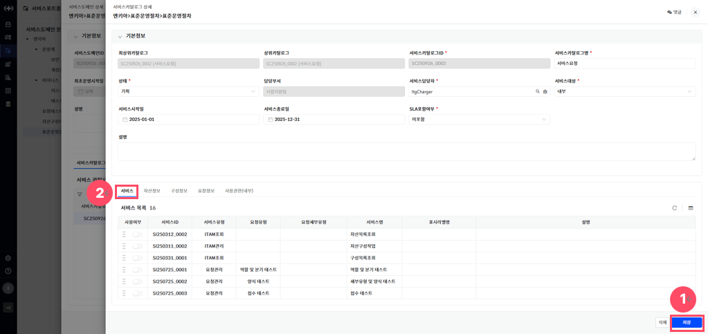

> ▶ \[그림14\] 서비스카탈로그 상세화면(드로어) – 서비스(탭)
> 
> 상세 정보

<table>
<thead>
<tr class="header">
<th>[그림 14].“1” 
저장</th>
<th>버튼 클릭을 통해 서비스카탈로그를 저장하거나 삭제할 수 있습니다.</th>
</tr>
</thead>
<tbody>
<tr class="odd">
<td>[그림 14].“2” 
서비스 탭</td>
<td>해당 서비스카탈로그에 연결된 서비스 목록을 조회할 수 있습니다.</td>
</tr>
</tbody>
</table>

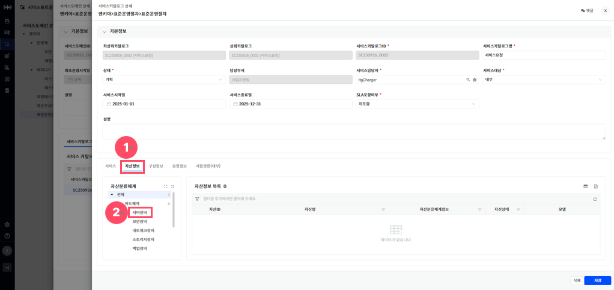

> ▶ \[그림15\] 서비스카탈로그 상세화면(드로어) – 자산정보(탭)
> 
> 화면 지표(자산정보 목록)

<table>
<thead>
<tr class="header">
<th>자산ID</th>
<th>자산의 고유식별을 위한 ID 값입니다.</th>
</tr>
</thead>
<tbody>
<tr class="odd">
<td>자산명</td>
<td>자산을 식별할 수 있는 명칭입니다.</td>
</tr>
<tr class="even">
<td>자산분류체계정보</td>
<td>자산의 분류 체계이며 다단계 계층구조로 정의되어 있습니다.</td>
</tr>
<tr class="odd">
<td>자산상태</td>
<td>
자산의 상태정보입니다.

- 입고 : 자산이 설치되어 운영되기전 들여온 상태입니다.

- 운영 : 자산이 설치되어 운영중인 상태입니다.

- 보류 : 자산이 운영되지 않고 정지중인 상태입니다.

- 폐기 : 자산이 폐기처리 된 상태입니다.
</td>
</tr>
<tr class="even">
<td>모델</td>
<td>자산 제품 정보입니다.</td>
</tr>
</tbody>
</table>

> 상세 정보(자산정보 탭)

<table>
<thead>
<tr class="header">
<th>[그림 15].“1” 
자산정보 탭</th>
<th>해당 서비스카탈로그에 연결된 자산정보를 조회할 수 있습니다.</th>
</tr>
</thead>
<tbody>
<tr class="odd">
<td>[그림 15].“2” 
자산분류체계 트리</td>
<td>화면 좌측에 자산분류체계 트리 클릭 시 해당 분류만 조회할 수 있습니다.</td>
</tr>
</tbody>
</table>

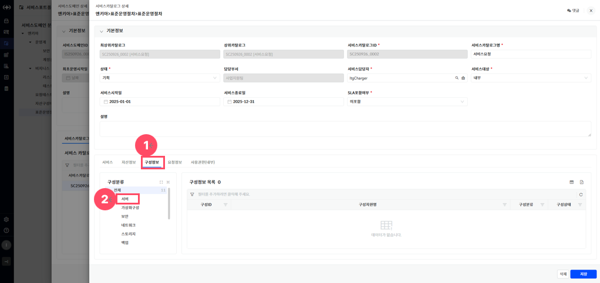

> ▶ \[그림16\] 서비스카탈로그 상세화면 – 구성정보 탭
> 
> 화면 지표(구성정보 목록)

<table>
<thead>
<tr class="header">
<th>구성ID</th>
<th>구성의 고유식별을 위한 ID 값입니다.</th>
</tr>
</thead>
<tbody>
<tr class="odd">
<td>구성자원명</td>
<td>구성을 식별할 수 있는 명칭입니다.</td>
</tr>
<tr class="even">
<td>구성분류</td>
<td>구성의 분류체계입니다.</td>
</tr>
<tr class="odd">
<td>구성상태</td>
<td>
구성의 관리 상태 정보입니다.

- 사용 : 작업관리 등록 가능한 상태입니다.

- 정지 : 작업관리 등록 불가, 기존에 등록된 구성 조회용도로만 사용되는 상태입니다.
</td>
</tr>
</tbody>
</table>

> 상세 정보(구성정보 탭)

<table>
<thead>
<tr class="header">
<th>[그림 16].“1” 
구성정보 탭</th>
<th>해당 서비스카탈로그에 연결된 구성정보를 조회할 수 있습니다.</th>
</tr>
</thead>
<tbody>
<tr class="odd">
<td>[그림 16].“2” 
구성분류 트리</td>
<td>화면 좌측에 구성분류 트리 클릭 시 해당 분류만 조회할 수 있습니다.</td>
</tr>
</tbody>
</table>

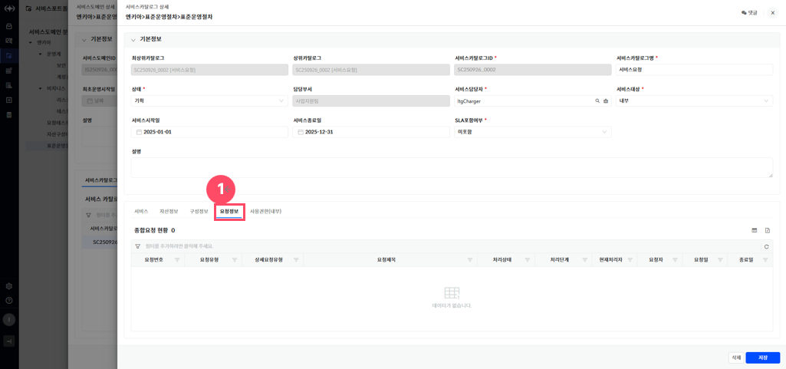

> ▶ \[그림17\] 서비스카탈로그 상세화면 – 요청정보(탭)
> 
> 화면 지표(요청정보 목록)

| 요청번호   | 각 요청 건에 부여된 고유 식별 번호입니다. 요청을 조회하거나 추적할 때 사용됩니다. |
| ------ | ----------------------------------------------- |
| 요청유형   | 요청의 전체적인 분류를 나타냅니다.                             |
| 상세요청유형 | 요청유형 내에서 보다 구체적인 요청 항목을 의미합니다.                  |
| 요청제목   | 사용자가 입력한 요청 건의 제목입니다. 요청의 주요 내용을 간략히 나타냅니다.     |
| 처리상태   | 해당 요청의 현재 처리 상태를 나타냅니다.                         |
| 처리단계   | 요청이 현재 어떤 단계에 있는지를 나타냅니다.                       |
| 현재처리자  | 현재 요청을 처리하고 있는 담당자 이름 또는 부서를 나타냅니다.             |
| 요청자    | 해당 요청을 최초로 작성하여 등록한 사용자입니다.                     |
| 요청일    | 요청자가 지정한 요청이 생성된 날짜입니다.                         |
| 종료일    | 요청 처리가 완료된 날짜입니다.                               |

> 상세 정보(요청정보 탭)

<table>
<tbody>
<tr class="odd">
<td>[그림 17].“1” 
요청정보 탭</td>
<td>해당 서비스카탈로그에 연결된 요청정보를 조회할 수 있습니다.</td>
</tr>
</tbody>
</table>

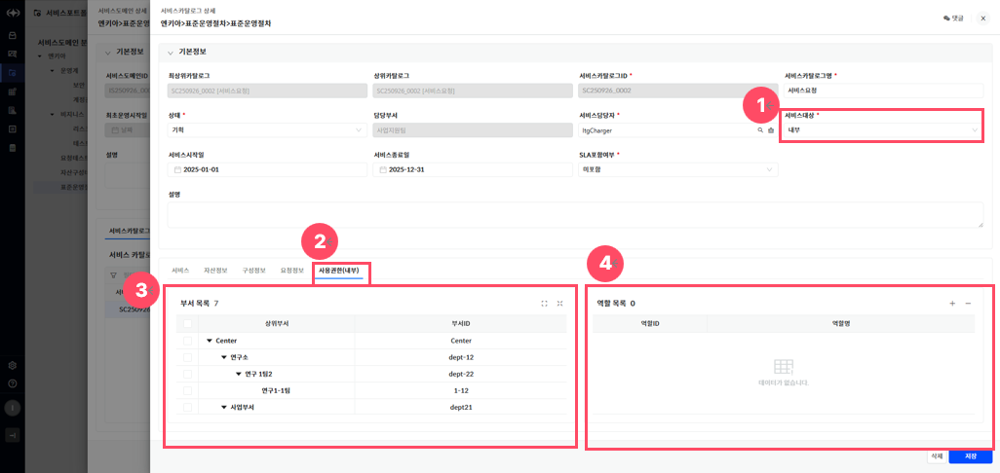

> ▶ \[그림18\] 서비스카탈로그 상세화면 – 사용권한(내부/외부) (탭)
> 
> 상세 정보(사용권한 탭)

<table>
<thead>
<tr class="header">
<th>[그림 18].“1” 
서비스대상</th>
<th>서비스대상이 ‘내부’인 경우에는 ‘사용권한(내부)’ 탭이, ‘외부’인 경우에는 ‘사용권한(외부)’ 탭이 표시됩니다.</th>
</tr>
</thead>
<tbody>
<tr class="odd">
<td>[그림 18].“2” 
사용권한 탭</td>
<td>해당 서비스카탈로그의 사용권한을 조회 및 수정할 수 있습니다.</td>
</tr>
<tr class="even">
<td>[그림 18].“3” 
부서권한</td>
<td>부서권한은 부서목록 그리드 내 체크박스를 통하여 해당 부서에 속한 사용자만 서비스에 접근할 수 있도록 설정합니다.</td>
</tr>
<tr class="odd">
<td>[그림 18].“4” 
역할권한</td>
<td>역할권한은 역할목록 그리드 내 우측 상단 버튼들을 통해 역할 ID및 역할명을 입력하여 해당 역할을 가진 사용자만 서비스에 접근할 수 있도록 설정합니다.</td>
</tr>
</tbody>
</table>

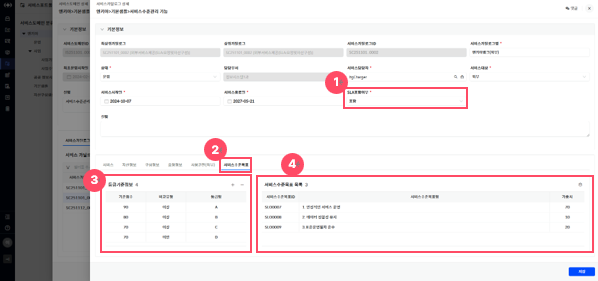

> ▶ \[그림19\] 서비스카탈로그 상세화면 – 서비스수준목표(탭)

<table>
<tbody>
<tr class="odd">
<td>
노트

서비스수준목표 목록의 설정버튼을 통하여 상세화면에 진입하여 서비스수준목표를 설정할 수 있습니다.
</td>
</tr>
</tbody>
</table>

> 화면 지표(등급기준정보)

| 기준점수 | 등급의 기준이 되는 점수 값입니다.  |
| ---- | -------------------- |
| 비교유형 | 기준점수의 비교유형입니다.       |
| 등급명  | 기준점수에 따라 표기될 등급명입니다. |

> 화면 지표(서비스수준목표목록)

| 서비스수준목표ID | 서비스수준목표ID값입니다.      |
| --------- | ------------------- |
| 서비스수준목표명  | 서비스수준목표명입니다.        |
| 가중치       | 서비스수준목표에 따른 가중치입니다. |

> 상세 정보(서비스수준목표)

<table>
<thead>
<tr class="header">
<th>[그림 19].“1” 
SLA포함여부</th>
<th>
SLA포함여부가 ‘포함’인 경우 ‘서비스수준목표’ 탭이 표시되며, ‘미포함’

인 경우 표시되지 않습니다.
</th>
</tr>
</thead>
<tbody>
<tr class="odd">
<td>[그림 19].“2” 
서비스수준목표 탭</td>
<td>등급기준정보와 서비스수준목표를 설정할 수 있습니다.</td>
</tr>
<tr class="even">
<td>[그림 19].“3” 
등급기준정보</td>
<td>서비스수준의 기준점수와 등급명을 설정할 수 있습니다</td>
</tr>
<tr class="odd">
<td>[그림 19].“4” 
서비스수준목표목록</td>
<td>
카탈로그의 서비스수준 목표 및 가중치를 설정할 수 있습니다.

: 서비스수준 목표를 설정할 수 있는 드로어가 열립니다.
</td>
</tr>
</tbody>
</table>

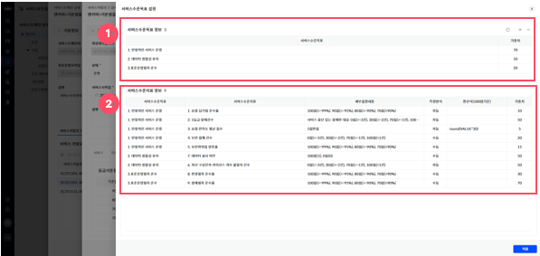

> ▶ \[그림20\] 서비스카탈로그 상세화면 – 서비스수준목표(탭) – 서비스수준목표 설정화면

<table>
<tbody>
<tr class="odd">
<td>
노트

[가중치]나 [환산식]을 설정하려면, 다음과 같이 선행되는 정보를 먼저 선택하여야 합니다.

- 서비스수준목표 정보의 행을 선택하여, 서비스수준지표 설정 진행 가능합니다.

[환산식]에 입력 가능한 값은 다음과 같으며, 필요하지 않은 경우 생략 가능합니다.

- 측정값(“VALUE”로 표현되며, 환산식 사용 시 필수로 입력하여야 합니다.)

- 숫자, 공백, 사칙연산자(“+”(더하기), “-“(빼기), “*”(곱하기), “/”(나누기))

- 수학함수(“round”, “max”, “min”), 특수문자(“.”, “(“, “)”)
</td>
</tr>
</tbody>
</table>

> 화면 지표(서비스수준목표 정보)

| 서비스수준목표명 | 서비스수준목표명입니다.        |
| -------- | ------------------- |
| 가중치      | 서비스수준목표에 따른 가중치입니다. |

> 화면 지표(서비스수준지표 정보)

<table>
<thead>
<tr class="header">
<th>서비스수준목표</th>
<th>서비스수준목표명입니다.</th>
</tr>
</thead>
<tbody>
<tr class="odd">
<td>서비스수준지표</td>
<td>서비스수준지표명입니다.</td>
</tr>
<tr class="even">
<td>세부설정내용</td>
<td>기준에 따른 점수 계산 내용입니다.</td>
</tr>
<tr class="odd">
<td>측정방식</td>
<td>
지표의 측정방식입니다.

- 자동 : 측정값을 평가/조회 진행 시 내부기능으로 자동 계산합니다.

- 수동 : 측정값을 평가/조회 진행 시 직접 입력하는 방식입니다.
</td>
</tr>
<tr class="even">
<td>환산식(100점기준)</td>
<td>100점 기준으로 함수를 입력하여 사용할 수 있습니다.</td>
</tr>
<tr class="odd">
<td>가중치</td>
<td>가중치를 입력합니다.</td>
</tr>
</tbody>
</table>

> 상세 정보(서비스수준목표)

<table>
<thead>
<tr class="header">
<th>[그림 20].“1” 
서비스수준목표정보</th>
<th>
카탈로그에 적용될 서비스수준목표를 설정할 수 있습니다.

가중치를 설정할 수 있습니다.
</th>
</tr>
</thead>
<tbody>
<tr class="odd">
<td>[그림 20].“2” 
서비스수준지표정보</td>
<td>
서비스수준목표의 정보에 포함된 서비스수준지표를 표기합니다.

가중치와 환산식(100점)기준을 설정할 수 있습니다.
</td>
</tr>
</tbody>
</table>

> 서비스수준목표 등록 절차

1.  서비스수준목표 목록의 “서비스수준목표 설정”(\[그림 19\])을 클릭합니다.

2.  서비스수준목표 설정화면(\[그림20\].”1”)의 신규 버튼을 클릭하여 서비스수준목표정보를 추가합니다.

3.  서비스수준목표 설정화면(\[그림20\].”1”)에서 추가된 서비스수준목표정보의 가중치를 입력합니다.

4.  서비스수준목표정보를 선택 후 하단의 서비스수준지표 정보(\[그림20\].”2”)의 가중치를 입력합니다.

5.  서비스수준목표 설정화면(\[그림20\]) 우측 하단의 \[적용\]버튼 클릭합니다.

6.  화면\[그림19\] 우측 하단의 \[저장\]버튼을 클릭합니다.

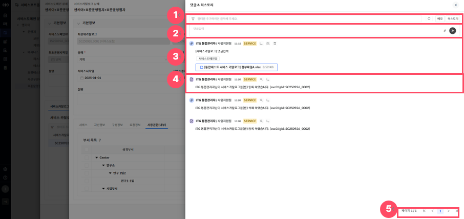

> ▶ \[그림21\] 서비스카탈로그 상세화면(드로어) – 댓글&히스토리(드로어)

<table>
<tbody>
<tr class="odd">
<td>
노트

사용자가 등록한 댓글은 대 댓글, 수정, 삭제가 가능합니다.

히스토리 댓글은 대 댓글, 이력상세보기가 가능합니다.
</td>
</tr>
</tbody>
</table>

> 상세 정보(댓글 & 히스토리)

<table>
<thead>
<tr class="header">
<th>[그림 21].“1” 
필터</th>
<th>
필터는 각 댓글의 데이터 단위로 상세한 조건 검색이 가능한 기능입니다.

- 메모 : 작성한 댓글만 조회할 수 있습니다.

- 히스토리 : 히스토리 댓글만 조회할 수 있습니다.
</th>
</tr>
</thead>
<tbody>
<tr class="odd">
<td>[그림 21].“2” 
댓글입력</td>
<td>
화면 상단 입력란에 내용을 작성하여 의견을 등록할 수 있습니다.

 : 파일 첨부 버튼을 통해 관련 문서나 이미지 파일을 함께 첨부할 수 있습니다.

 : 등록 버튼을 클릭하면 댓글이 등록됩니다.
</td>
</tr>
<tr class="even">
<td>[그림 21].“3” 
댓글</td>
<td>
등록된 댓글은 작성자 정보, 부서, 작성일, 시스템 태그, 관련 서비스 링크, 첨부파일과 함께 최신순으로 표시됩니다.

 : 해당 댓글의 대 댓글을 등록할 수 있습니다.

: 해당 댓글을 수정할 수 있습니다.

: 해당 댓글을 삭제할 수 있습니다.
</td>
</tr>
<tr class="odd">
<td>[그림 21].“4” 
히스토리</td>
<td>
히스토리 댓글은 시스템에 의해 자동으로 생성된 처리 이력 정보이며, 사용자정보, 사용자부서, 처리일, 시스템 태그와 함께 최신순으로 표시됩니다.

 : 이력상세보기가 가능합니다.

 : 해당 댓글의 대 댓글을 등록할 수 있습니다.
</td>
</tr>
<tr class="even">
<td>[그림 21].“5” 
페이징</td>
<td>목록 데이터를 구간별로 나누어 페이지 단위로 조회할 수 있도록 도와주는 기능입니다.</td>
</tr>
</tbody>
</table>

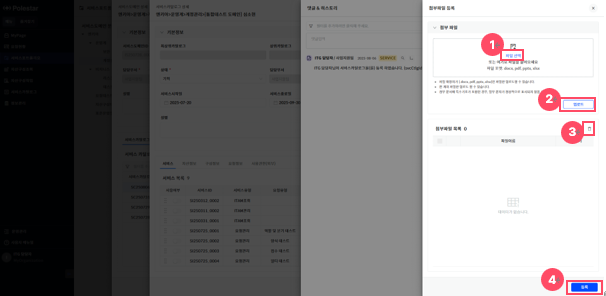

> ▶ \[그림22\] 서비스카탈로그 상세화면(드로어) – 댓글&히스토리(드로어) – 첨부파일 등록(드로어)

<table>
<tbody>
<tr class="odd">
<td>
노트

동일한 파일명을 가진 파일도 중복 등록이 가능합니다.

첨부파일 등록 후에는 댓글&amp;히스토리에서 파일을 다운로드 할 수 있습니다.
</td>
</tr>
</tbody>
</table>

> 상세 정보(댓글 & 히스토리)

<table>
<thead>
<tr class="header">
<th>[그림 22].“1” 
파일선택</th>
<th>
화면 상단의 박스에 드래그 앤 드롭(Drag &amp; Drop)하거나, 클릭하여 로컬에서 파일을 선택할 수 있습니다.

* 지원되는 확장자는 docx, pdf, pptx, xlsx등이며, 최대 용량 및 개수는 시스템 정책에 따라 제한됩니다.
</th>
</tr>
</thead>
<tbody>
<tr class="odd">
<td>[그림 22].“2” 
업로드</td>
<td>파일 선택 후 업로드 버튼을 클릭하면, 선택된 파일이 첨부파일 목록에 등록됩니다. 
업로드 후  버튼 생성되어 파일을 다운로드 할 수 있습니다.</td>
</tr>
<tr class="even">
<td>[그림 22].“3” 
파일삭제</td>
<td>첨부파일 목록에 등록된 파일들을 삭제할 수 있습니다.</td>
</tr>
<tr class="odd">
<td>[그림 22].“4” 
파일등록</td>
<td>첨부파일 선택 및 업로드를 완료한 뒤, 하단의 등록 버튼을 클릭하면 해당 첨부파일이 최종 저장됩니다.</td>
</tr>
</tbody>
</table>

서비스카탈로그 삭제

서비스카탈로그 상세화면(드로어)에서 \[삭제\] 버튼을 클릭하여 서비스카탈로그를 삭제할 수 있습니다.

<table>
<tbody>
<tr class="odd">
<td>
노트

해당 서비스카탈로그를 최초 등록한 사용자이거나 동일 부서에 소속된 사용자만, 서비스카탈로그 상태가 ‘기획’일 때 삭제할 수 있습니다.
</td>
</tr>
</tbody>
</table>

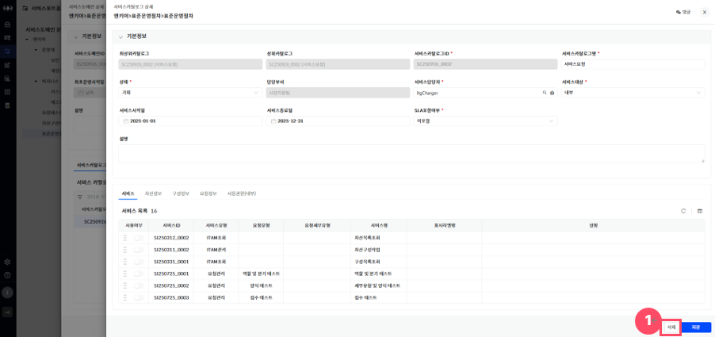

> ▶ \[그림23\] 서비스카탈로그 상세화면(드로어)
> 
> 상세 정보

<table>
<tbody>
<tr class="odd">
<td>[그림 23].“1” 
삭제</td>
<td>버튼 클릭을 통해 서비스도메인을 삭제할 수 있습니다.</td>
</tr>
</tbody>
</table>

서비스포트폴리오 – 서비스 관리

서비스카탈로그 상세화면(드로어)에서 \[서비스 탭\]을 선택하면, 해당 서비스카탈로그에 연결된 서비스 목록을 조회 및 수정할 수 있습니다.

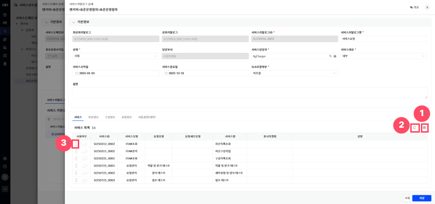

> ▶ \[그림24\] 서비스카탈로그 상세화면(드로어) – 서비스카탈로그(탭)
> 
> 화면 지표(서비스 목록)

<table>
<thead>
<tr class="header">
<th>사용여부</th>
<th>서비스를 실제 서비스카탈로그에 포함시킬지 여부를 표시합니다.. 
스위치 형식으로 제공되며, 활성화 시 서비스가 적용됩니다.</th>
</tr>
</thead>
<tbody>
<tr class="odd">
<td>서비스ID</td>
<td>서비스 고유식별을 위한 ID 값입니다.</td>
</tr>
<tr class="even">
<td>서비스유형</td>
<td>
서비스 관리 카테고리입니다.

- ITAM관리 : 자산/구성 관리 카테고리

- 요청관리 : 서비스요청 관리 카테고리
</td>
</tr>
<tr class="odd">
<td>요청유형</td>
<td>서비스유형의 요청관리 상위 분류입니다.</td>
</tr>
<tr class="even">
<td>요청세부유형</td>
<td>
요청유형의 하위 분류입니다.

* 상위분류에 따른 하위분류가 다름
</td>
</tr>
<tr class="odd">
<td>서비스명</td>
<td>실제 서비스의 이름입니다.</td>
</tr>
<tr class="even">
<td>표시라벨명</td>
<td>사용자에게 실제로 표시되는 서비스명입니다.</td>
</tr>
<tr class="odd">
<td>설명</td>
<td>서비스항목의 구체적인 용도 및 설명입니다.</td>
</tr>
</tbody>
</table>

> 상세 정보

<table>
<thead>
<tr class="header">
<th>[그림 24].“1” 
컬럼수정</th>
<th>표시할 컬럼을 선택하거나 숨길 수 있는 설정 기능을 제공합니다.</th>
</tr>
</thead>
<tbody>
<tr class="odd">
<td>[그림 24].“2” 
순서초기화</td>
<td>드래그 앤 드랍(Drag&amp;Drop)으로 변경된 정렬 순서를 초기 상태로 되돌리는 기능을 제공합니다.</td>
</tr>
<tr class="even">
<td>[그림 24].“3” 
순서 변경</td>
<td>서비스카탈로그에 연결된 서비스 목록은 드래그 앤 드랍(Drag&amp;Drop)으로 순서를 변경할 수 있으며, 이는 서비스카탈로그 카드의 버튼 리스트 표시 순서에 반영됩니다. 
단, 사용여부가 “예”인 서비스만 순서 정렬에 반영되며, 항상 상단에 지정한 순서대로 표시됩니다. 
사용여부가 “아니오”인 서비스는 정렬 대상에서 제외되어 목록의 뒤쪽에 표시됩니다. 
(순서 변경 후 저장 버튼([그림 14].“1”)을 클릭해야 적용됩니다.)</td>
</tr>
</tbody>
</table>

서비스 상세 및 수정

서비스 목록에서 “서비스ID”를 클릭하면 수정이 가능한 상세화면(드로어)가 열립니다.

서비스 카탈로그가 어떤 요청 항목과 자산 데이터, 업무 처리 로직과 연결될지를 정의하는 서비스 실행의 핵심 연결 지점입니다.

<table>
<tbody>
<tr class="odd">
<td>
 노트

서비스 상세 등록 시, 서비스ID는 자동 채번되며, 사용여부는 “아니오”로 고정됩니다.

요청세부유형 관리 기능은 권한이 부여된 사용자만 관리 가능합니다.
</td>
</tr>
</tbody>
</table>

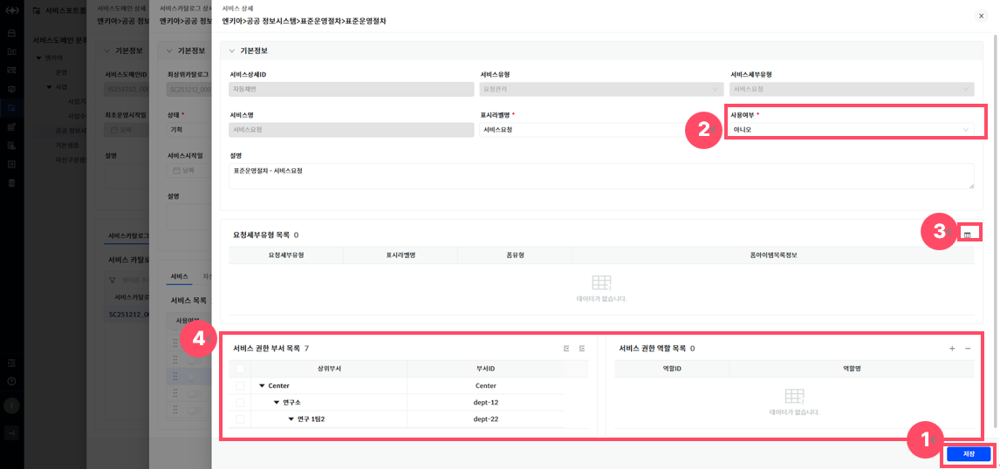

▶ \[그림25\] 서비스 상세화면(드로어)

> 화면 지표(기본정보)

<table>
<thead>
<tr class="header">
<th>서비스상세ID</th>
<th>서비스 상세 고유식별을 위한 ID 값입니다.</th>
</tr>
</thead>
<tbody>
<tr class="odd">
<td>서비스유형</td>
<td>
서비스 관리 카테고리입니다.

- ITAM관리 : 자산/구성 관리 카테고리

- 요청관리 : 서비스요청 관리 카테고리
</td>
</tr>
<tr class="even">
<td>서비스세부유형</td>
<td>서비스 요청 상위 분류입니다.</td>
</tr>
<tr class="odd">
<td>서비스명</td>
<td>실제 서비스의 이름입니다.</td>
</tr>
<tr class="even">
<td>표시라벨명</td>
<td>사용자에게 실제로 표시되는 서비스명입니다.</td>
</tr>
<tr class="odd">
<td>사용여부</td>
<td>
서비스를 실제 서비스카탈로그에 포함시킬지 여부를 선택합니다.

- 예 : 서비스목록 사용여부가 활성화되며, 서비스카탈로그에서 해당 서비스를 이용할 수 있습니다.

- 아니오 : 서비스목록 사용여부가 비활성화가 되며, 서비스카탈로그에서 해당 서비스를 이용할 수 없습니다.
</td>
</tr>
<tr class="even">
<td>설명</td>
<td>서비스항목의 구체적인 용도 및 설명입니다.</td>
</tr>
</tbody>
</table>

> 화면 지표(요청세부유형 목록)

<table>
<thead>
<tr class="header">
<th>요청세부유형</th>
<th>
해당 서비스 상세와 연동되는 요청 세부 유형입니다.

* 서비스유형이 요청관리 일 때만 가능합니다.
</th>
</tr>
</thead>
<tbody>
<tr class="odd">
<td>표시라벨명</td>
<td>사용자 화면에 보여지는 요청유형 명칭입니다.</td>
</tr>
<tr class="even">
<td>폼 유형</td>
<td>해당 요청세부유형에 연결된 폼 분류입니다.</td>
</tr>
<tr class="odd">
<td>폼아이템목록정보</td>
<td>해당 요청 유형에 연결된 입력 폼 항목정보들을 설정합니다.</td>
</tr>
</tbody>
</table>

> 상세 정보

<table>
<thead>
<tr class="header">
<th>[그림 25].“1” 
저장</th>
<th>저장 버튼 클릭 시 서비스 상세가 저장됩니다.</th>
</tr>
</thead>
<tbody>
<tr class="odd">
<td>[그림 25].“2” 
사용여부</td>
<td>사용여부가 ‘예’일 경우, 서비스카탈로그에 해당 서비스 목록이 연결되어 표시됩니다.</td>
</tr>
<tr class="even">
<td>[그림 25].“3” 
컬럼수정</td>
<td>표시할 컬럼을 선택하거나 숨길 수 있는 설정 기능을 제공합니다.</td>
</tr>
<tr class="odd">
<td>[그림 25].“4” 사용권한</td>
<td>
해당 서비스의 사용권한을 설정할 수 있는 기능을 제공합니다.

이 기능을 통해 서비스에 접근할 수 있는 사용자를 부서 또는 역할 기준으로 세부적으로 관리할 수 있습니다.
</td>
</tr>
</tbody>
</table>

> 서비스 등록 절차

1.  서비스 목록의 “서비스ID”(\[그림 22\])을 클릭합니다.

2.  사용여부 “예” 로 변경합니다.

3.  화면(\[그림25\])의 필수 항목(\[ \* \] 모양의 표식이 되어있는 항목)을 입력합니다.

4.  화면 우측 하단의 \[저장\]버튼 클릭

