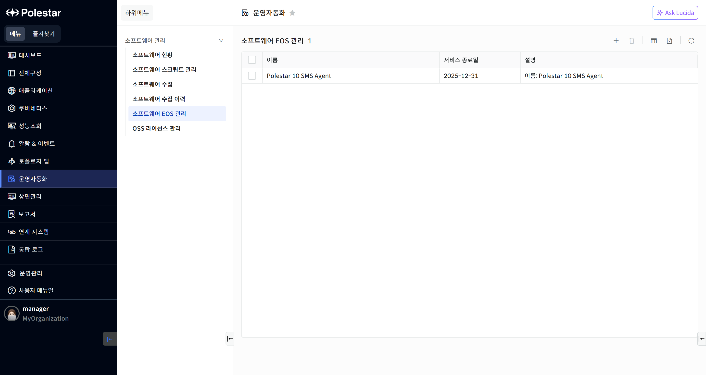
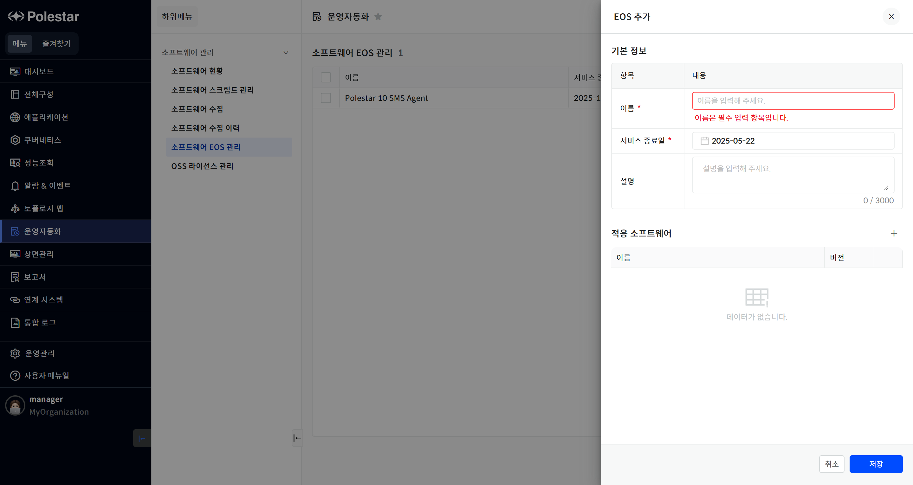
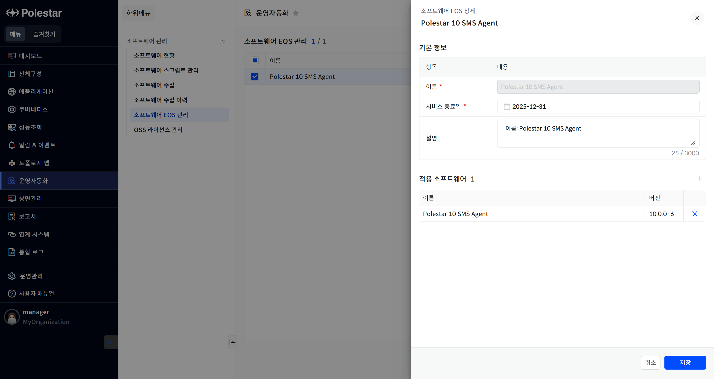
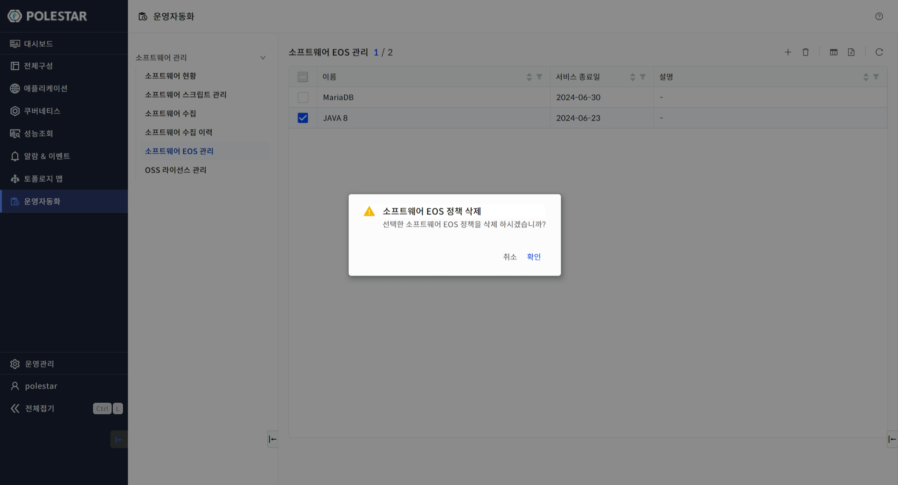

소프트웨어 EOS 관리

EOS기준이 되는 정책 목록을 조회할 수 있습니다.

서비스 종료일 7일전 정책들 중에서 가장 가까운 종료일에 해당하는 정책 1개를 목록 상단에 메시지 형태로 확인할 수 있습니다.

<table>
<tbody>
<tr class="odd">
<td>
노트

: [소프트웨어 현황] 메뉴에서 정책이 반영된 소프트웨어 정보를 확인할 수 있습니다.
</td>
</tr>
</tbody>
</table>

▶ \[그림1\] EOS 정책 목록

화면 지표

| 이름      | 사용자가 입력한 정책의 이름을 표시합니다. |
| ------- | ----------------------- |
| 서비스 종료일 | 서비스가 종료되는 날짜를 표시합니다.    |
| 설명      | 정책의 부가적인 설명을 표시합니다.     |

EOS(End Of Service) 정책 등록

등록 아이콘을 클릭하여 신규 EOS정책을 등록할 수 있습니다.

▶ \[그림2\] EOS 정책 등록

화면 지표

<table>
<thead>
<tr class="header">
<th>이름</th>
<th>
사용자가 입력한 정책의 이름을 입력합니다.

반드시 입력해야 하는 값이며, 기존에 등록된 이름은 사용할 수 없습니다.
</th>
</tr>
</thead>
<tbody>
<tr class="odd">
<td>서비스 종료일</td>
<td>서비스가 종료되는 날짜를 선택합니다.</td>
</tr>
<tr class="even">
<td>설명</td>
<td>
정책의 부가적인 설명을 입력합니다.

필수 값은 아니며 3000자 이내의 문자열을 허용합니다.
</td>
</tr>
<tr class="odd">
<td>적용 소프트웨어</td>
<td>등록 아이콘을 클릭하여 사전에 수집된 소프트웨어별 버전 정보를 선택합니다.</td>
</tr>
</tbody>
</table>

EOS정책 등록 절차

1.  테이블 우측 상단의 (+) 아이콘 클릭

2.  기본 정보 항목 입력

3.  적용 소프트웨어 선택

4.  \[저장\] 버튼 클릭

EOS(End Of Service) 정책 상세 및 수정

목록에서 이름을 클릭하면 EOS정책의 상세 정보를 확인 및 변경할 수 있습니다.

▶ \[그림3\] EOS 정책 상세

화면 지표

\[EOS 정책 등록\]에서의 화면 지표와 동일한 내용입니다.

EOS정책 수정 절차

1.  테이블에서 수정할 EOS 정책 클릭

2.  기본 정보 항목 입력

3.  적용 소프트웨어 선택

4.  \[저장\] 버튼 클릭

EOS(End Of Service) 정책 삭제

삭제 아이콘을 클릭하여 선택된 EOS 정책을 삭제할 수 있습니다.

▶ \[그림4\] EOS 정책 삭제

EOS 정책 삭제 절차

1.  삭제하고자 하는 EOS 정책 선택 (다중 선택 가능)

2.  테이블 우측 상단의 \[삭제\] 아이콘 클릭

3.  메시지창에서 \[확인\] 클릭

