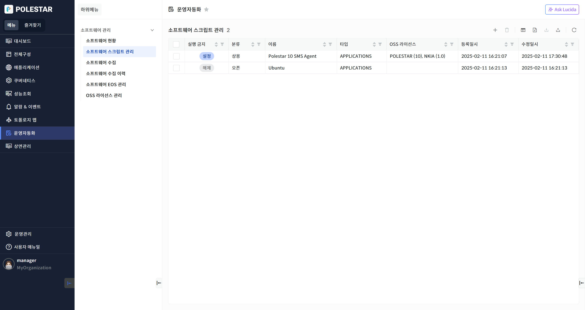
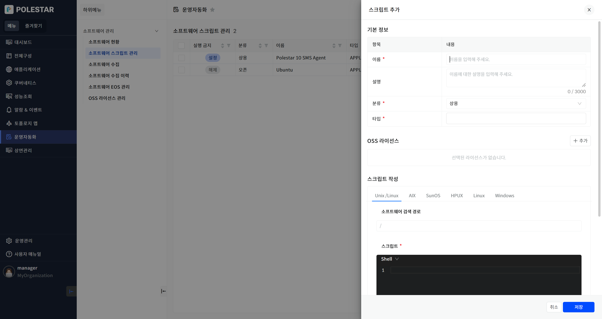
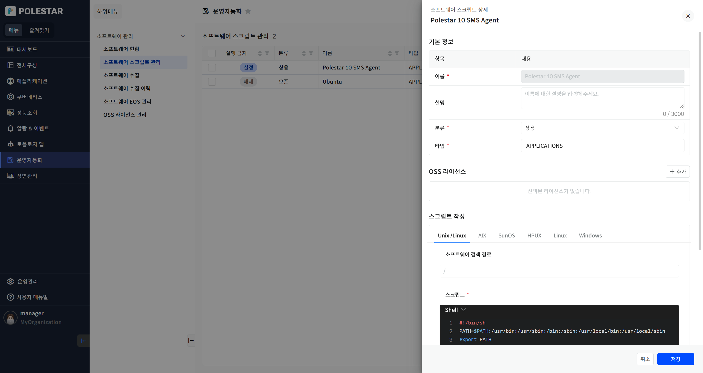
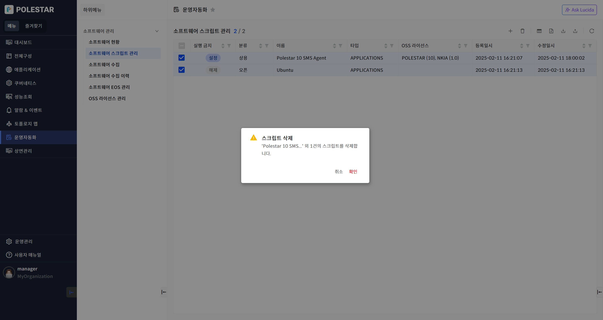

소프트웨어 스크립트 관리

수집에 필요한 스크립트 목록을 조회할 수 있습니다.

<table>
<tbody>
<tr class="odd">
<td>
노트

[소프트웨어 수집] 메뉴에서 스케줄을 등록 및 변경할 때 사용됩니다.
</td>
</tr>
</tbody>
</table>

▶ \[그림1\] 스크립트 목록

화면 지표

<table>
<thead>
<tr class="header">
<th>실행 금지</th>
<th>
수집할 때 해당 스크립트의 실행 여부를 결정하는 값을 표시합니다.

클릭하여 설정 또는 해제로 값을 변경할 수 있으며, [소프트웨어 스크립트 관리] 메뉴에서도 설정합니다.
</th>
</tr>
</thead>
<tbody>
<tr class="odd">
<td>분류</td>
<td>
수집에 사용된 스크립트에 설정된 분류를 표시합니다.

[소프트웨어 스크립트 관리] 메뉴에서 설정합니다.

항목: 상용, 오픈
</td>
</tr>
<tr class="even">
<td>이름</td>
<td>
수집에 사용된 스크립트 이름을 표시합니다.

클릭하여 스크립트의 정보를 확인 또는 변경할 수 있습니다.
</td>
</tr>
<tr class="odd">
<td>타입</td>
<td>
수집에 사용된 스크립트에 설정된 타입을 표시합니다.

[소프트웨어 스크립트 관리] 메뉴에서 설정합니다.

항목: WAS, RDBMS, APPLICATIONS, ETC, 사용자가 직접 입력
</td>
</tr>
<tr class="even">
<td>OSS 라이선스</td>
<td>
Open Source Software 라이선스의 약자로 해당 소프트웨어의 라이선스를 표시합니다.

[소프트웨어 스크립트 관리] 메뉴에서 설정합니다.
</td>
</tr>
<tr class="odd">
<td>등록일시</td>
<td>스크립트가 신규로 등록된 날짜를 표시합니다.</td>
</tr>
<tr class="even">
<td>수정일시</td>
<td>스크립트가 사용자에 의해 변경된 날짜를 표시합니다.</td>
</tr>
</tbody>
</table>

스크립트 등록

등록 아이콘을 클릭하여 신규 스크립트를 등록할 수 있습니다.

<table>
<tbody>
<tr class="odd">
<td>
노트

라이선스 추가 버튼을 통해 표시되는 목록은 [OSS 라이선스 관리] 메뉴에서 동일하게 확인할 수 있습니다.
</td>
</tr>
</tbody>
</table>

▶ \[그림2\] 스크립트 등록

화면 지표

<table>
<thead>
<tr class="header">
<th>이름</th>
<th>
수집에 사용될 스크립트 이름을 입력합니다.

반드시 입력해야 하는 값이며 3 ~ 50자리의 문자, 숫자만 허용합니다.

기존에 등록된 이름은 사용할 수 없습니다.
</th>
</tr>
</thead>
<tbody>
<tr class="odd">
<td>설명</td>
<td>
스크립트에 대한 설명을 입력합니다.

필수 값은 아니며 3000자 이내의 문자열을 허용합니다.
</td>
</tr>
<tr class="even">
<td>분류</td>
<td>상용 또는 오픈 선택합니다.</td>
</tr>
<tr class="odd">
<td>타입</td>
<td>
수집에 사용된 스크립트에 설정된 타입을 선택 또는 입력합니다.

항목: WAS, RDBMS, APPLICATIONS, ETC, 사용자가 직접 입력
</td>
</tr>
<tr class="even">
<td>OSS 라이선스</td>
<td>라이선스 추가 버튼을 통해 목록에서 선택합니다.</td>
</tr>
<tr class="odd">
<td>소프트웨어 검색 경로</td>
<td>
예상되는 소프트웨어의 설치 위치 경로를 입력합니다.

필수 값은 아니며, 디렉토리 경로 형태의 문자열만 허용합니다.
</td>
</tr>
<tr class="even">
<td>스크립트</td>
<td>
OS 종류 별로 탭을 클릭하여 스크립트를 입력합니다.

필수 값이며, Windows는 VBScript, 그 외 OS는 Shell이 기본 타입입니다.
</td>
</tr>
<tr class="odd">
<td>배포금지</td>
<td>
서버에 해당 스크립트를 배포할지 여부를 결정합니다.

스크립트가 배포되어야 소프트웨어 정보를 수집할 수 있습니다.
</td>
</tr>
</tbody>
</table>

스크립트 등록 절차

1.  테이블 우측 상단의 (+) 아이콘 클릭

2.  기본 정보 항목 입력

3.  OSS 라이선스 항목 선택

4.  스크립트 작성 입력

5.  금지 항목 선택

6.  \[저장\] 버튼 클릭

스크립트 상세 및 수정

목록에서 이름을 클릭하면 수집에 사용된 스크립트 상세 정보를 확인 및 변경할 수 있습니다.

<table>
<tbody>
<tr class="odd">
<td>
노트

[소프트웨어 현황] 메뉴에서 이름을 클릭했을 때 표시되는 정보와 동일합니다.
</td>
</tr>
</tbody>
</table>

▶ \[그림3\] 스크립트 상세

화면 지표

\[스크립트 등록\]에서의 화면 지표와 동일한 내용입니다.

스크립트 수정 절차

1.  테이블에서 수정할 스크립트 클릭

2.  기본 정보 항목 입력

3.  OSS 라이선스 항목 선택

4.  스크립트 작성 입력

5.  금지 항목 선택

6.  \[저장\] 버튼 클릭

스크립트 삭제

삭제 아이콘을 클릭하여 선택된 스크립트를 삭제할 수 있습니다.

▶ \[그림4\] 스크립트 삭제

스크립트 삭제 절차

1.  삭제하고자 하는 스크립트 선택(다중 선택 가능)

2.  테이블 우측 상단의 \[삭제\] 아이콘 클릭

3.  메시지창에서 \[확인\] 클릭

