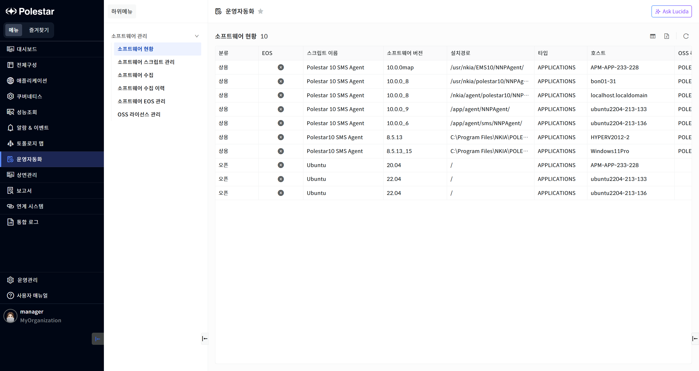
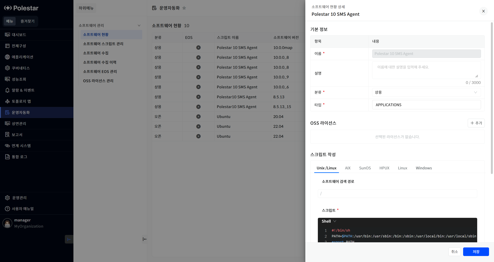
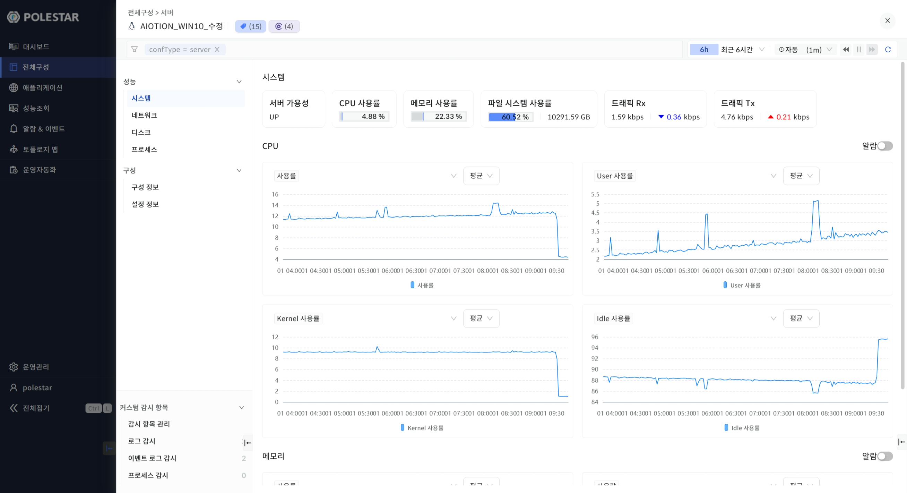

소프트웨어 현황

수집된 소프트웨어의 정보를 조회할 수 있습니다.

<table>
<tbody>
<tr class="odd">
<td>
노트

[소프트웨어 수집] 메뉴에서 등록된 스케줄 또는, 즉시 실행 기능을 통해 수집할 수 있습니다.
</td>
</tr>
</tbody>
</table>

▶ \[그림1\] 소프트웨어 현황

화면 지표

<table>
<thead>
<tr class="header">
<th>분류</th>
<th>
수집에 사용된 스크립트에 설정된 분류를 표시합니다.

[소프트웨어 스크립트 관리] 메뉴에서 설정합니다.

항목: 상용, 오픈
</th>
</tr>
</thead>
<tbody>
<tr class="odd">
<td>EOS</td>
<td>
End of Service의 약자로 해당 소프트웨어를 사용함에 있어 제조사의 서비스 지원 여부를 표시합니다.

[소프트웨어 EOS] 메뉴에서 설정합니다.

항목: EOS 일 경우  , EOS가 아닐 경우 
</td>
</tr>
<tr class="even">
<td>스크립트 이름</td>
<td>
수집에 사용된 스크립트 이름을 표시합니다.

클릭하여 스크립트의 정보를 확인 또는 변경할 수 있습니다.
</td>
</tr>
<tr class="odd">
<td>소프트웨어 버전</td>
<td>수집된 소프트웨어 버전을 표시합니다.</td>
</tr>
<tr class="even">
<td>설치 경로</td>
<td>수집된 소프트웨어가 설치된 디렉토리 경로를 표시합니다.</td>
</tr>
<tr class="odd">
<td>타입</td>
<td>
수집에 사용된 스크립트에 설정된 타입을 표시합니다.

[소프트웨어 스크립트 관리] 메뉴에서 설정합니다.

항목: WAS, RDBMS, APPLICATIONS, ETC, 사용자가 직접 입력
</td>
</tr>
<tr class="even">
<td>호스트</td>
<td>
수집의 대상이 되는 서버의 이름을 표시합니다.

클릭하여 서버의 상세정보를 확인할 수 있습니다.
</td>
</tr>
<tr class="odd">
<td>OSS 라이선스</td>
<td>
Open Source Software 라이선스의 약자로 해당 소프트웨어의 라이선스를 표시합니다.

[소프트웨어 스크립트 관리] 메뉴에서 설정합니다.
</td>
</tr>
<tr class="even">
<td>수집일시</td>
<td>해당 소프트웨어의 정보가 수집된 날짜를 표시합니다.</td>
</tr>
<tr class="odd">
<td>설치일시</td>
<td>해당 소프트웨어가 서버에 설치된 날짜를 표시합니다.</td>
</tr>
<tr class="even">
<td>추가정보</td>
<td>
추가적으로 수집된 정보를 표시합니다.

예시: RDBMS의 인스턴스(DB) 정보
</td>
</tr>
</tbody>
</table>

스크립트 상세

스크립트의 이름을 클릭하여 수집에 사용된 스크립트의 상세 정보를 확인 및 변경할 수 있습니다.

<table>
<tbody>
<tr class="odd">
<td>
노트

[소프트웨어 스크립트 관리] 메뉴에서 동일하게 확인할 수 있습니다.
</td>
</tr>
</tbody>
</table>

▶ \[그림2\] 스크립트 상세

서버 상세

호스트를 클릭하여 수집의 대상이 되는 서버의 상세 정보를 확인 및 변경할 수 있습니다.

<table>
<tbody>
<tr class="odd">
<td>
노트

전체 구성에서 [서버] 메뉴에서 동일하게 확인할 수 있습니다.
</td>
</tr>
</tbody>
</table>

▶ \[그림3\] 서버 상세

