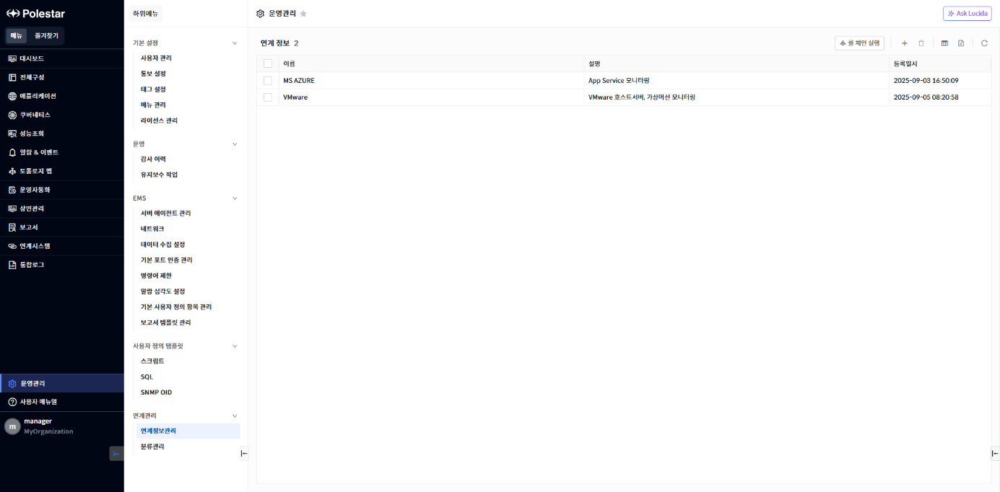
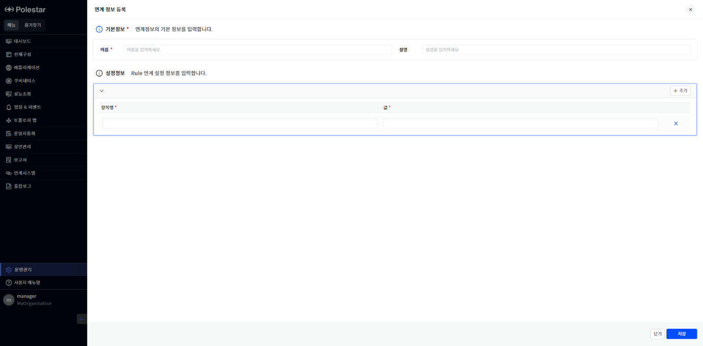
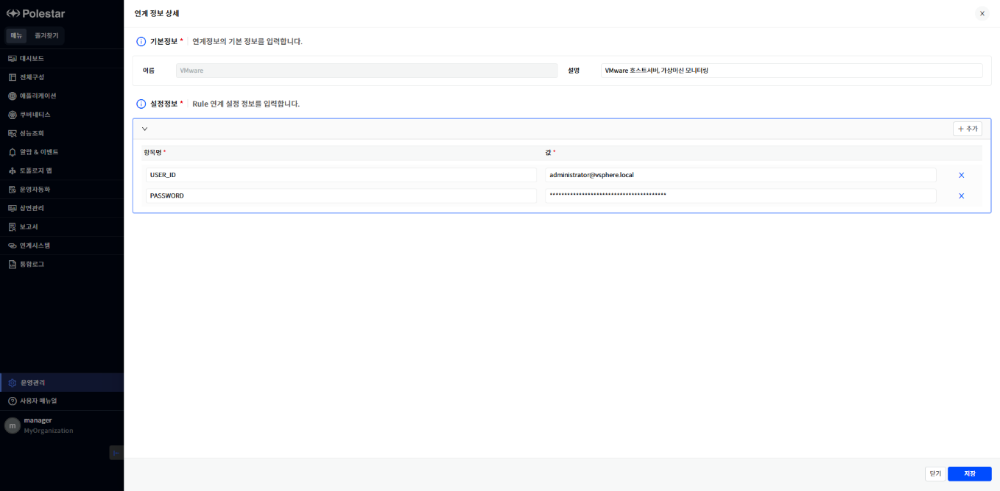
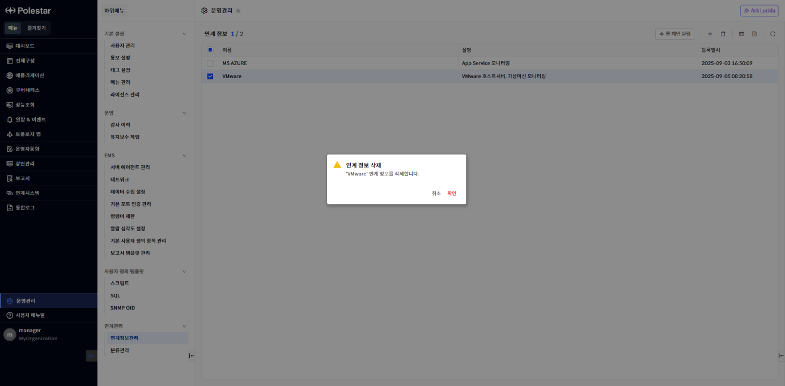
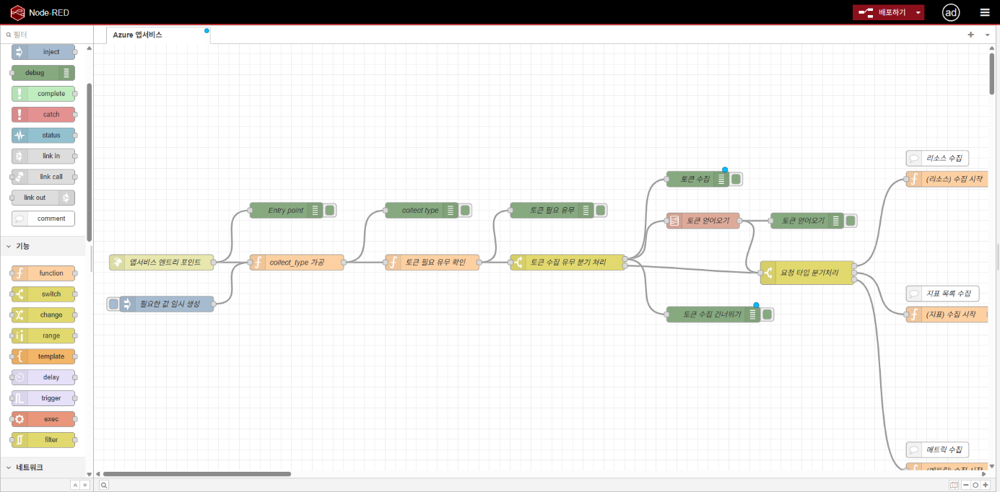

연계정보관리

\[운영관리\] 메뉴를 선택하면 \[연계관리\] \> \[연계정보관리\] 화면을 확인할 수 있습니다.

연계시스템 모니터링을 위한 접속 정보 등 필요한 정보를 설정할 수 있는 화면입니다.

▶ \[그림1\] 연계정보관리 목록 화면

화면 지표

| 이름   | 연계정보의 이름을 표시합니다.   |
| ---- | ------------------ |
| 설명   | 연계정보의 설명을 표시합니다.   |
| 등록일시 | 연계정보의 등록일시를 표시합니다. |

연계정보 등록

연계정보관리 화면에서 \[+\] 버튼을 클릭하여 드로어되는 연계정보 등록 화면에서 연계정보를 등록합니다.

▶ \[그림2\] 관리대상 등록화면

화면 지표

<table>
<thead>
<tr class="header">
<th>이름</th>
<th>연계정보의 이름을 입력합니다.</th>
</tr>
</thead>
<tbody>
<tr class="odd">
<td>설명</td>
<td>연계정보에 대한 설명을 입력합니다.</td>
</tr>
<tr class="even">
<td>설정정보</td>
<td>
연계시스템을 모니터링하기 위하여 룰체인 툴로 전달될 설정을 입력합니다.

항목명은 룰체인 툴의 설정과 같아야 합니다.
</td>
</tr>
</tbody>
</table>

연계정보 등록 절차

1.  테이블 우측 상단의 (+) 아이콘을 클릭합니다.

2.  이름을 입력합니다.

3.  설명을 입력합니다.

4.  설정 정보의 \[+추가\] 버튼을 클릭합니다.

5.  항목명과 값을 입력합니다.

6.  \[저장\] 버튼을 클릭합니다.

연계정보 수정

연계정보관리 화면에서 연계정보 이름을 클릭하여 드로어되는 연계정보 상세 화면에서 연계정보를 수정합니다.

▶ \[그림3\] 연계정보 상세화면

화면 지표

<table>
<thead>
<tr class="header">
<th>이름</th>
<th>
연계정보의 이름이 표시됩니다.

수정 시에는 비활성화되어 표시됩니다..
</th>
</tr>
</thead>
<tbody>
<tr class="odd">
<td>설명</td>
<td>연계정보에 대한 설명을 입력합니다.</td>
</tr>
<tr class="even">
<td>설정정보</td>
<td>
연계시스템을 모니터링하기 위하여 룰체인 툴로 전달될 설정을 변경합니다.

항목명은 룰체인 툴의 설정과 같아야 합니다.
</td>
</tr>
</tbody>
</table>

연계정보 수정 절차

1.  테이블에서 수정할 연계정보 이름을 클릭합니다.

2.  설명을 입력합니다.

3.  설정 정보를 추가할 경우에 설정 정보의 \[+추가\] 버튼을 클릭합니다.

4.  항목명과 값을 입력합니다.

5.  설정 정보를 삭제할 경우에 항목 우측의 \[X\] 버튼을 클릭합니다.

6.  \[저장\] 버튼을 클릭합니다.

연계정보 삭제

등록된 연계정보를 삭제할 수 있습니다.

<table>
<tbody>
<tr class="odd">
<td>
주의

연계시스템에 등록된 연계정보를 삭제하려면 연계정보가 등록된 연계시스템을 먼저 삭제해야 합니다.
</td>
</tr>
</tbody>
</table>

▶ \[그림4\] 연계정보 삭제

연계정보 삭제 절차

1.  > 삭제하고자 하는 연계정보를 선택합니다. (다중 선택 가능)

2.  > 테이블 우측 상단의 \[삭제\] 아이콘을 클릭합니다.

3.  > 삭제 확인 메시지창에서 \[확인\] 버튼을 클릭합니다.

룰체인 실행

룰체인 툴을 실행할 수 있습니다.

<table>
<tbody>
<tr class="odd">
<td>
주의

룰체인 설정은 연계시스템 모니터링을 위한 연계 툴로써 관리자 기능입니다. 일반 사용자는 기존 설정 정보를 편집할 수 없으며 편집 시에는 연계시스템 모니터링 기능이 비정상동작 할 수 있습니다.
</td>
</tr>
</tbody>
</table>

▶ \[그림5\] 룰체인 실행

룰체인 실행 절차

1.  연계정보 관리 화면에서 \[룰체인 실행\] 버튼을 클릭합니다.

