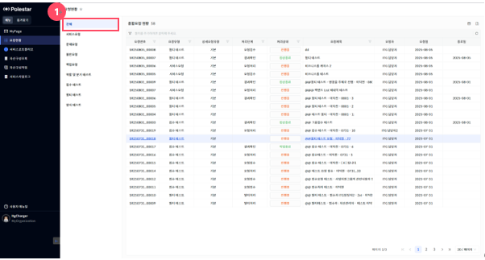
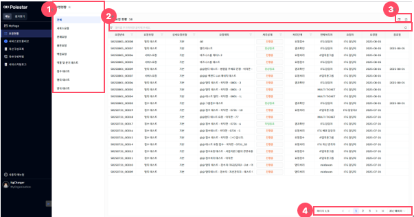
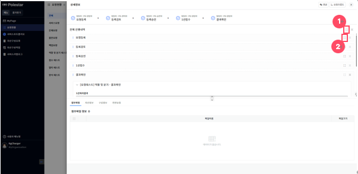

요청현황

\[요청현황\] 메뉴는 사용자가 요청하거나 요청 받아 참여한 모든 요청 데이터를 한눈에 확인할 수 있는 화면으로,

단 사용자가 보유한 서비스 카탈로그 권한에 따라 접근 가능한 요청만 분류하여 조회할 수 있습니다.

<table>
<tbody>
<tr class="odd">
<td>
노트

사용자가 요청하거나 요청 받은 모든 요청 건을 요청유형별로 집계하여 표시합니다.

아이콘( [그림1].“1” ) 과 같이 요청유형을 클릭하면 해당 유형에 속한 요청목록을 확인할 수 있습니다.
</td>
</tr>
</tbody>
</table>

> ▶ \[그림1\] 요청현황 목록
> 
> 화면 지표

| 요청번호   | 각 요청 건에 부여된 고유 식별 번호입니다. 요청을 조회하거나 추적할 때 사용됩니다. |
| ------ | ----------------------------------------------- |
| 요청유형   | 요청의 전체적인 분류를 나타냅니다.                             |
| 상세요청유형 | 요청유형 내에서 보다 구체적인 요청 항목을 의미합니다.                  |
| 요청제목   | 사용자가 입력한 요청 건의 제목입니다. 요청의 주요 내용을 간략히 나타냅니다.     |
| 처리상태   | 해당 요청의 현재 처리 상태를 나타냅니다.                         |
| 처리단계   | 요청이 현재 어떤 단계에 있는지를 나타냅니다.                       |
| 현재처리자  | 현재 요청을 처리하고 있는 담당자 이름 또는 부서를 나타냅니다.             |
| 요청자    | 해당 요청을 최초로 작성하여 등록한 사용자입니다.                     |
| 요청일    | 요청자가 지정한 요청이 생성된 날짜입니다.                         |
| 종료일    | 요청 처리가 완료된 날짜입니다.                               |

> ▶ \[그림2\] 요청현황 목록 상세 기능
> 
> 상세 정보

<table>
<thead>
<tr class="header">
<th>
[그림2].”1”

요청유형 선택
</th>
<th>요청유형을 클릭하면 해당 유형에 속한 요청현황을 확인할 수 있습니다.</th>
</tr>
</thead>
<tbody>
<tr class="odd">
<td>
[그림 2].”2”

그리드 필터
</td>
<td>그리드 필터는 상단 행(필터 행)을 통해 각 컬럼 단위로 상세한 조건 검색이 가능한 기능입니다.</td>
</tr>
<tr class="even">
<td>
[그림2].”3”

컬럼수정 &amp; 엑셀저장 버튼
</td>
<td>표시할 컬럼을 선택하거나 숨길 수 있는 설정 기능을 제공하는 컬럼수정 버튼과, 현재 화면에 표시된 데이터를 엑셀파일로 다운로드 하는 기능을 제공하는 엑셀저장 버튼입니다.</td>
</tr>
<tr class="odd">
<td>
[그림2].”4”

페이징
</td>
<td>목록 데이터를 구간별로 나누어 페이지 단위로 조회할 수 있도록 도와주는 기능입니다.</td>
</tr>
</tbody>
</table>

요청상세 조회

요청현황 목록 내 요청번호, 요청유형, 요청제목을 클릭하여 드로어를 열어서 해당 요청의 상세정보를 조회할 수 있습니다.

<table>
<tbody>
<tr class="odd">
<td>
노트

요청의 내용은 모두 ‘읽기’모드로 보이게 됩니다. 
아이콘([그림 3].”1”) 을 클릭하여 모든 TASK 의 내용을 조회할 수 있으며, 아이콘([그림 3].“2”)를 클릭하여 각 TASK 별 내용을 조회할 수 있습니다.
</td>
</tr>
</tbody>
</table>

> ▶ \[그림3\] 요청 상세화면

