ITAM 기준정보 관리 – 자산분류체계

\[운영관리 \> ITAM 기준정보 관리\]메뉴에서 \[자산분류체계\] 탭을 선택하면, 자산분류체계 항목을 조회할 수 있는 화면으로 이동되며, 목록 조회 및 정보 수정이 가능합니다.

<table>
<tbody>
<tr class="odd">
<td>
노트

ITAM 기준정보 관리는 사용권한이 있는 경우에만 진입 가능한 메뉴입니다.

자산분류체계 최초 진입 시, 화면 지표 및 데이터 조회가 가능합니다.
</td>
</tr>
</tbody>
</table>

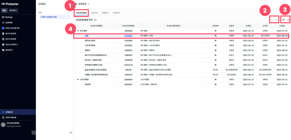

> ▶ \[그림1\] 자산분류체계 목록
> 
> 화면 지표

<table>
<thead>
<tr class="header">
<th>자산분류체계명</th>
<th>자산분류체계를 식별할 수 있는 명칭입니다.</th>
</tr>
</thead>
<tbody>
<tr class="odd">
<td>자산분류체계ID</td>
<td>자산분류체계 고유식별을 위한 ID 값입니다.</td>
</tr>
<tr class="even">
<td>자산분류체계경로</td>
<td>자산의 분류 체계이며 다단계 계층 구조로 정의되어 있습니다.</td>
</tr>
<tr class="odd">
<td>사용여부</td>
<td>
자산분류체계의 사용여부를 표시합니다.

- 예 : 모델이나 자산 등록에 사용합니다.

- 아니오 : 모델이나 자산 등록에 사용하지 않습니다.
</td>
</tr>
<tr class="even">
<td>등록자/등록일</td>
<td>자산분류체계를 최초로 등록한 사용자와 그 일자 정보입니다.</td>
</tr>
<tr class="odd">
<td>수정자/수정일</td>
<td>자산분류체계를 마지막으로 수정한 사용자와 그 일자 정보입니다.</td>
</tr>
</tbody>
</table>

> 상세 정보

<table>
<thead>
<tr class="header">
<th>[그림1].”1” 
자산분류체계 탭</th>
<th>자산분류체계 목록 화면을 조회할 수 있는 탭입니다.</th>
</tr>
</thead>
<tbody>
<tr class="odd">
<td>[그림1].”2” 
모두 펼치기 &amp; 
모두 접기 버튼</td>
<td>트리 그리드의 모든 행을 펼칠 수 있는 기능을 제공하는 모두 펼치기 버튼과, 트리 그리드의 모든 행을 접을 수 있는 기능을 제공하는 모두 접기 버튼입니다.</td>
</tr>
<tr class="even">
<td>[그림1].”3” 
컬럼수정 &amp; 엑셀저장 버튼</td>
<td>표시할 컬럼을 선택하거나 숨길 수 있는 설정 기능을 제공하는 컬럼수정 버튼과, 현재 화면에 표시된 데이터를 엑셀파일로 다운로드 하는 기능을 제공하는 엑셀저장 버튼입니다.</td>
</tr>
<tr class="odd">
<td>[그림1].”4” 
셀 선택</td>
<td>목록에서 자산분류체계(자산분류체계명, 자산분류체계ID) 클릭 시 자산분류체계 상세조회가 가능하며, 그 외 다른 셀 클릭 시 행 선택 고정 기능을 제공합니다.</td>
</tr>
</tbody>
</table>

자산분류체계 수정

목록에서 자산분류체계(자산분류체계명, 자산분류체계ID)를 클릭하면, 수정이 가능한 상세화면(드로어)이 열립니다.

<table>
<tbody>
<tr class="odd">
<td>
노트

라벨이나 순서, 추가정보(탭)만 수정 가능합니다.

하위자산분류체계는 최하위 자산분류체계가 아닌 경우에만 표시되며, 추가정보(탭)은 최하위 자산분류체계가 아니거나, 필수여부가 “예”인 항목은 수정이 불가합니다.
</td>
</tr>
</tbody>
</table>

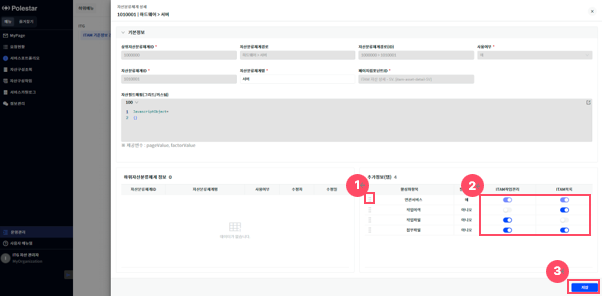

▶ \[그림2\] 자산분류체계 상세 화면(드로어) – 최하위 자산분류체계

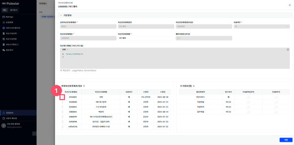

▶ \[그림3\] 자산분류체계 상세 화면(드로어) – 최하위가 아닌 자산분류체계

> 화면 지표(기본정보)

<table>
<thead>
<tr class="header">
<th>상위자산분류체계ID</th>
<th>상위자산분류체계ID 값을 표시합니다.</th>
</tr>
</thead>
<tbody>
<tr class="odd">
<td>자산분류체계경로</td>
<td>자산분류체계명을 계층적으로 표시합니다.</td>
</tr>
<tr class="even">
<td>자산분류체계경로(ID)</td>
<td>자산분류체계ID를 계층적으로 표시합니다.</td>
</tr>
<tr class="odd">
<td>사용여부</td>
<td>
자산분류체계의 사용여부를 표시합니다.

- 예 : 모델이나 자산 등록에 사용합니다.

- 아니오 : 모델이나 자산 등록에 사용하지 않습니다.
</td>
</tr>
<tr class="even">
<td>자산분류체계ID</td>
<td>자산분류체계 고유식별을 위한 ID 값을 표시합니다.</td>
</tr>
<tr class="odd">
<td>자산분류체계명</td>
<td>
자산분류체계를 식별할 수 있는 명칭을 입력합니다.

반드시 입력해야 하는 값입니다.
</td>
</tr>
<tr class="even">
<td>페이지컴포넌트ID</td>
<td>자산정보 상세화면(드로어)에서 사용하는 페이지 컴포넌트를 표시합니다.</td>
</tr>
<tr class="odd">
<td>자산필드매핑(그리드/커스텀)</td>
<td>페이지 컴포넌트에 포함되는 그리드나 커스텀 요소의 값과 자산정보 데이터 항목에 대한 매핑 정의를 표시합니다.</td>
</tr>
</tbody>
</table>

> 화면 지표(하위자산분류체계 정보)

<table>
<thead>
<tr class="header">
<th>자산분류체계ID</th>
<th>하위에 등록된 자산분류체계ID입니다.</th>
</tr>
</thead>
<tbody>
<tr class="odd">
<td>자산분류체계명</td>
<td>하위에 등록된 자산분류체계명을 계층적으로 표시합니다.</td>
</tr>
<tr class="even">
<td>사용여부</td>
<td>
하위에 등록된 자산분류체계의 사용여부를 표시합니다.

- 예 : 모델이나 자산 등록에 사용합니다.

- 아니오 : 모델이나 자산 등록에 사용하지 않습니다.
</td>
</tr>
<tr class="odd">
<td>수정자/수정일</td>
<td>하위에 등록된 자산분류체계를 마지막으로 수정한 사용자와 그 일자 정보입니다.</td>
</tr>
</tbody>
</table>

> 화면 지표(추가정보(탭))

<table>
<thead>
<tr class="header">
<th>활성화항목</th>
<th>자산 상세화면(드로어) 우측에 추가정보 탭으로 관리되는 항목의 명칭입니다.</th>
</tr>
</thead>
<tbody>
<tr class="odd">
<td>필수여부</td>
<td>
추가정보 항목의 필수여부를 표시합니다.

- 예 : 시스템에서 필요한 필수항목입니다.

- 아니오 : 선택적으로 사용가능한 항목입니다.
</td>
</tr>
<tr class="even">
<td>ITAM 작업관리</td>
<td>
[자산구성작업]메뉴의 자산 상세화면(드로어)에 항목 표시여부를 선택합니다.

- ON : 항목을 표시합니다.

- OFF : 항목을 표시하지 않습니다.
</td>
</tr>
<tr class="odd">
<td>ITAM 목록</td>
<td>
[자산구성조회]메뉴의 자산 상세화면(드로어)에 항목 표시여부를 선택합니다.

- ON : 항목을 표시합니다.

- OFF : 항목을 표시하지 않습니다.
</td>
</tr>
</tbody>
</table>

> 상세 정보

<table>
<thead>
<tr class="header">
<th>[그림2].”1” 
추가정보(탭) 순서변경</th>
<th>아이콘 드래그 앤 드롭(Drag &amp; Drop) 방식으로 추가정보(탭) 표시 순서 변경이 가능합니다.</th>
</tr>
</thead>
<tbody>
<tr class="odd">
<td>[그림2].”2” 
추가정보(탭) 사용여부</td>
<td>스위치 클릭을 통해 사용 여부를 ON/OFF가능합니다.</td>
</tr>
<tr class="even">
<td>[그림2].”3” 
저장버튼</td>
<td>저장 버튼 클릭 시 자산분류체계 저장이 가능합니다.</td>
</tr>
<tr class="odd">
<td>
[그림3].“1”

하위자산분류 순서변경
</td>
<td>아이콘 드래그 앤 드롭(Drag &amp; Drop) 방식으로 하위에 등록된 자산분류체계의 표시 순서 변경이 가능합니다.</td>
</tr>
</tbody>
</table>

ITAM 기준정보 관리 – 구성분류

\[ITAM 기준정보 관리\]메뉴에서 \[구성분류\] 탭을 선택하면, 구성분류 항목들을 조회할 수 있는 화면으로 이동되며, 목록 조회 및 정보 수정이 가능합니다.

<table>
<tbody>
<tr class="odd">
<td>
노트

ITAM 기준정보 관리는 사용권한이 있는 경우에만 진입 가능한 메뉴입니다.

구성분류 최초 진입 시, 화면 지표 및 데이터를 조회할 수 있습니다.
</td>
</tr>
</tbody>
</table>

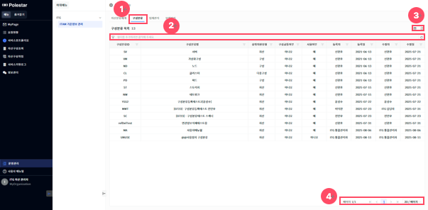

> ▶ \[그림4\] 구성분류 목록
> 
> 화면 지표

<table>
<thead>
<tr class="header">
<th>구성분류ID</th>
<th>구성분류 고유식별을 위한 ID 값입니다.</th>
</tr>
</thead>
<tbody>
<tr class="odd">
<td>구성분류명</td>
<td>구성분류를 식별할 수 있는 명칭입니다.</td>
</tr>
<tr class="even">
<td>상위자원유형</td>
<td>
구성을 할당할 수 있는 자원의 유형을 표시합니다.

- 자산 : 자산으로부터 할당합니다. (예 : 서버)

- 구성 : 다른 구성으로부터 할당합니다. (예 : 서버-노드)

- 다중구성 : 여러 개의 구성으로부터 할당합니다. (예 : 노드-클러스터)
</td>
</tr>
<tr class="odd">
<td>구성공통여부</td>
<td>
구성분류 공통 관리 여부를 표시합니다.

- 예 : 자원 유형을 구분하지 않고, 공통된 하나의 분류로 관리합니다.

- 아니오 : 자원 유형별로 분류하여 관리합니다.
</td>
</tr>
<tr class="even">
<td>사용여부</td>
<td>
구성분류의 사용여부를 표시합니다.

- 예 : 구성 등록에 사용합니다.

- 아니오 : 구성 등록에 사용하지 않습니다.
</td>
</tr>
<tr class="odd">
<td>등록자/등록일</td>
<td>구성분류를 최초로 등록한 사용자와 그 일자 정보입니다.</td>
</tr>
<tr class="even">
<td>수정자/수정일</td>
<td>구성분류를 마지막으로 수정한 사용자와 그 일자 정보입니다.</td>
</tr>
</tbody>
</table>

> 상세 정보

<table>
<thead>
<tr class="header">
<th>[그림4].”1” 
구성분류 탭</th>
<th>구성분류 목록 화면을 조회할 수 있는 탭입니다.</th>
</tr>
</thead>
<tbody>
<tr class="odd">
<td>[그림4].”2” 
그리드 필터</td>
<td>그리드 필터는 상단 행(필터 행)을 통해 각 컬럼 단위로 상세한 조건 검색이 가능한 기능입니다.</td>
</tr>
<tr class="even">
<td>[그림4].”3” 
컬럼수정 &amp; 엑셀저장 버튼</td>
<td>표시할 컬럼을 선택하거나 숨길 수 있는 설정 기능을 제공하는 컬럼수정 버튼과, 현재 화면에 표시된 데이터를 엑셀파일로 다운로드 하는 기능을 제공하는 엑셀저장 버튼입니다.</td>
</tr>
<tr class="odd">
<td>
[그림4].”4”

페이징
</td>
<td>목록 데이터를 구간별로 나누어 페이지 단위로 조회할 수 있도록 도와주는 기능입니다.</td>
</tr>
</tbody>
</table>

구성분류 수정

목록에서 구성분류(구성분류ID, 구성분류명)를 클릭하면, 수정이 가능한 상세화면(드로어)이 열립니다.

<table>
<tbody>
<tr class="odd">
<td>
노트

라벨이나 순서, 추가정보(탭)만 수정 가능합니다.

추가정보(탭)은 필수여부가 “예”인 경우, 수정이 불가합니다.
</td>
</tr>
</tbody>
</table>

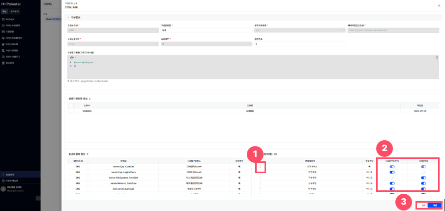

▶ \[그림5\] 구성분류 상세 화면(드로어)

> 화면 지표(기본정보)

<table>
<thead>
<tr class="header">
<th>구성분류ID</th>
<th>구성분류 고유식별을 위한 ID 값을 표시합니다.</th>
</tr>
</thead>
<tbody>
<tr class="odd">
<td>구성분류명</td>
<td>
구성분류를 식별할 수 있는 명칭을 입력합니다.

반드시 입력해야 하는 값입니다.
</td>
</tr>
<tr class="even">
<td>상위자원유형</td>
<td>
구성을 할당할 수 있는 자원의 유형을 표시합니다.

- 자산 : 자산으로부터 할당합니다. (예 : 서버)

- 구성 : 다른 구성으로부터 할당합니다. (예 : 서버-노드)

- 다중구성 : 여러 개의 구성으로부터 할당합니다. (예 : 노드-클러스터)
</td>
</tr>
<tr class="odd">
<td>페이지컴포넌트ID</td>
<td>구성정보 상세화면(드로어)에서 사용하는 페이지 컴포넌트를 표시합니다.</td>
</tr>
<tr class="even">
<td>구성공통여부</td>
<td>
구성분류 공통 관리 여부를 표시합니다.

- 예 : 자원 유형을 구분하지 않고, 공통된 하나의 분류로 관리합니다.

- 아니오 : 자원 유형별로 분류하여 관리합니다.
</td>
</tr>
<tr class="odd">
<td>사용여부</td>
<td>
구성분류의 사용여부를 표시합니다.

- 예 : 구성 등록에 사용합니다.

- 아니오 : 구성 등록에 사용하지 않습니다.
</td>
</tr>
<tr class="even">
<td>정렬번호</td>
<td>구성분류가 화면에 표시될 순서를 번호로 입력합니다.</td>
</tr>
<tr class="odd">
<td>구성필드매핑(그리드/커스텀)</td>
<td>페이지 컴포넌트에 포함되는 그리드나 커스텀 요소의 값과 구성정보 데이터 항목에 대한 매핑 정의를 표시합니다.</td>
</tr>
</tbody>
</table>

> 화면 지표(상위자원분류 정보)

구성을 할당할 수 있는 자원에 대한 상세분류로, 상위자원유형에 따라 자산분류체계 또는 구성분류를 표시합니다.

| 분류ID | 상위자원분류 정보의 고유식별을 위한 ID 값입니다. |
| ---- | ---------------------------- |
| 분류명  | 상위자원분류 정보의 명칭입니다.            |
| 적용일  | 상위자원분류 정보가 적용(추가)된 날짜입니다.    |

> 화면 지표(동기화항목 정보)

<table>
<thead>
<tr class="header">
<th>대상시스템</th>
<th>동기화대상 출발지 시스템을 표시합니다.</th>
</tr>
</thead>
<tbody>
<tr class="odd">
<td>항목ID</td>
<td>대상시스템에서 가져올 항목ID를 표시합니다.</td>
</tr>
<tr class="even">
<td>ITAM구성필드</td>
<td>동기화할 ITAM 구성항목을 표시합니다.</td>
</tr>
<tr class="odd">
<td>사용여부</td>
<td>
동기화항목 사용여부를 표시합니다.

- 예 : 대상시스템의 구성 항목과 동기화 합니다.

- 아니오 : 동기화를 사용하지 않습니다.
</td>
</tr>
</tbody>
</table>

> 화면 지표(추가정보(탭))

<table>
<thead>
<tr class="header">
<th>활성화항목</th>
<th>구성 상세화면(드로어) 우측에 추가정보 탭으로 관리되는 항목의 명칭입니다.</th>
</tr>
</thead>
<tbody>
<tr class="odd">
<td>필수여부</td>
<td>
추가정보 항목의 필수여부를 표시합니다.

- 예 : 시스템에서 필요한 필수항목입니다.

- 아니오 : 선택적으로 사용가능한 항목입니다.
</td>
</tr>
<tr class="even">
<td>ITAM 작업관리</td>
<td>
[자산구성작업]메뉴의 구성 상세화면(드로어)에 항목 표시여부를 선택합니다.

- ON : 항목을 표시합니다.

- OFF : 항목을 표시하지 않습니다.
</td>
</tr>
<tr class="odd">
<td>ITAM 목록</td>
<td>
[자산구성조회]메뉴의 구성 상세화면(드로어)에 항목 표시여부를 선택합니다.

- ON : 항목을 표시합니다.

- OFF : 항목을 표시하지 않습니다.
</td>
</tr>
</tbody>
</table>

> 상세 정보

<table>
<thead>
<tr class="header">
<th>[그림5].”1” 
추가정보(탭) 순서변경</th>
<th>아이콘 드래그 앤 드롭(Drag &amp; Drop) 방식으로 추가정보(탭) 표시 순서를 변경할 수 있습니다.</th>
</tr>
</thead>
<tbody>
<tr class="odd">
<td>[그림5].”2” 
추가정보(탭) 사용여부</td>
<td>스위치 클릭을 통해 사용 여부를 ON/OFF할 수 있습니다.</td>
</tr>
<tr class="even">
<td>[그림5].”3” 
검증 &amp; 저장버튼</td>
<td>검증 버튼 클릭 후, 검증이 완료되면 저장이 가능합니다.</td>
</tr>
</tbody>
</table>

ITAM 기준정보 관리 – 업체관리

\[ITAM 기준정보 관리\]메뉴에서 \[업체관리\] 탭을 선택하면, 업체 항목들을 조회할 수 있는 화면으로 이동되며, 목록 조회, 신규 등록, 정보 수정이 가능합니다.

<table>
<tbody>
<tr class="odd">
<td>
노트

ITAM 기준정보 관리는 사용권한이 있는 경우에만 진입 가능한 메뉴입니다.

업체관리 최초 진입 시, 화면 지표 및 데이터를 조회할 수 있습니다.
</td>
</tr>
</tbody>
</table>

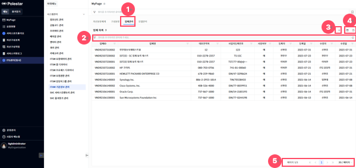

> ▶ \[그림6\] 업체 목록
> 
> 화면 지표

<table>
<thead>
<tr class="header">
<th>업체ID</th>
<th>업체 고유식별을 위한 ID 값입니다.</th>
</tr>
</thead>
<tbody>
<tr class="odd">
<td>업체명</td>
<td>업체를 식별할 수 있는 명칭입니다.</td>
</tr>
<tr class="even">
<td>대표연락처</td>
<td>업체의 대표연락처를 표시합니다.</td>
</tr>
<tr class="odd">
<td>사업자등록번호</td>
<td>업체의 고유번호(사업자등록번호)를 표시합니다.</td>
</tr>
<tr class="even">
<td>사용여부</td>
<td>
업체의 사용여부를 표시합니다.

- 예 : 모델 등록에 사용합니다.

- 아니오 : 모델 등록에 사용하지 않습니다.
</td>
</tr>
<tr class="odd">
<td>등록자/등록일</td>
<td>업체를 최초로 등록한 사용자와 그 일자 정보입니다.</td>
</tr>
<tr class="even">
<td>수정자/수정일</td>
<td>업체를 마지막으로 수정한 사용자와 그 일자 정보입니다.</td>
</tr>
</tbody>
</table>

> 상세 정보

<table>
<thead>
<tr class="header">
<th>[그림6].”1” 
업체관리 탭</th>
<th>업체 목록 화면을 조회할 수 있는 탭입니다.</th>
</tr>
</thead>
<tbody>
<tr class="odd">
<td>[그림6].”2” 
그리드 필터</td>
<td>그리드 필터는 상단 행(필터 행)을 통해 각 컬럼 단위로 상세한 조건 검색이 가능한 기능입니다.</td>
</tr>
<tr class="even">
<td>[그림6].”3” 
신규등록 버튼</td>
<td>업체 항목을 신규등록 할 수 있는 버튼입니다.</td>
</tr>
<tr class="odd">
<td>[그림6].”4” 
컬럼수정 &amp; 엑셀저장 버튼</td>
<td>표시할 컬럼을 선택하거나 숨길 수 있는 설정 기능을 제공하는 컬럼수정 버튼과, 현재 화면에 표시된 데이터를 엑셀파일로 다운로드 하는 기능을 제공하는 엑셀저장 버튼입니다.</td>
</tr>
<tr class="even">
<td>[그림6].”5” 
페이징</td>
<td>목록 데이터를 구간별로 나누어 페이지 단위로 조회할 수 있도록 도와주는 기능입니다.</td>
</tr>
</tbody>
</table>

업체 등록

목록에서 등록 버튼(\[그림6\].”3”)을 클릭하면, 등록화면(드로어)이 열립니다.

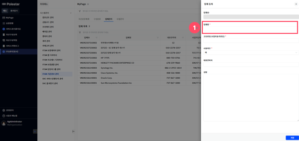

▶ \[그림7\] 업체 등록 화면(드로어)

> 화면 지표

<table>
<thead>
<tr class="header">
<th>업체ID</th>
<th>업체의 고유식별을 위한 ID 값입니다.</th>
</tr>
</thead>
<tbody>
<tr class="odd">
<td>업체명</td>
<td>
업체를 식별할 수 있는 명칭을 입력합니다.

반드시 입력해야 하는 값입니다.
</td>
</tr>
<tr class="even">
<td>고유번호(사업자등록번호)</td>
<td>업체 고유식별을 위해, 국가나 단체에서 부여한 고유번호(사업자등록번호)를 입력합니다.</td>
</tr>
<tr class="odd">
<td>사용여부</td>
<td>
업체의 사용여부를 선택합니다.

- 예 : 모델 등록에 사용합니다.

- 아니오 : 모델 등록에 사용하지 않습니다.
</td>
</tr>
<tr class="even">
<td>대표연락처</td>
<td>업체의 대표연락처를 입력합니다.</td>
</tr>
<tr class="odd">
<td>설명</td>
<td>업체에 대한 비고사항이나 설명을 입력합니다.</td>
</tr>
</tbody>
</table>

> 업체 등록 절차

1.  목록에서 등록 버튼(\[그림6\].”3”)을 클릭합니다.

2.  필수 항목(\[그림7\].”1”와 같이 \[  \]모양의 표식이 되어있는 항목)을 입력합니다.

3.  화면 우측 하단의 \[저장\] 버튼을 클릭합니다.

업체 수정

목록에서 업체(업체ID, 업체명)를 클릭하면, 수정이 가능한 상세화면(드로어)이 열립니다.

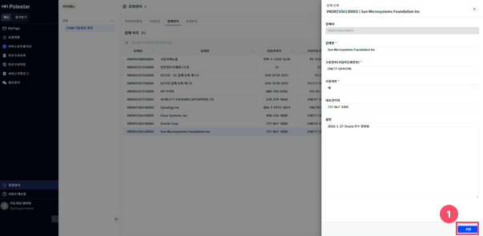

▶ \[그림8\] 업체 상세 화면(드로어)

> 상세 정보

<table>
<tbody>
<tr class="odd">
<td>[그림8].“1” 
저장 버튼</td>
<td>저장 버튼 클릭을 통해 업체를 저장할 수 있습니다.</td>
</tr>
</tbody>
</table>

ITAM 기준정보 관리 – 모델관리

\[ITAM 기준정보 관리\]메뉴에서 \[모델관리\] 탭을 선택하면, 모델 항목들을 조회할 수 있는 화면으로 이동되며, 목록 조회, 신규 등록, 정보 수정이 가능합니다.

<table>
<tbody>
<tr class="odd">
<td>
노트

ITAM 기준정보 관리는 사용권한이 있는 경우에만 진입 가능한 메뉴입니다.

모델관리 최초 진입 시, 화면 지표 및 데이터를 조회할 수 있습니다.
</td>
</tr>
</tbody>
</table>

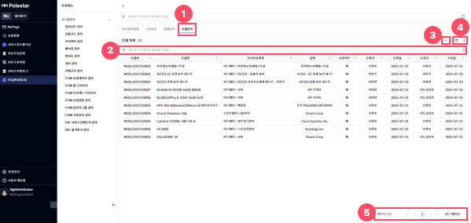

> ▶ \[그림9\] 모델 목록
> 
> 화면 지표

<table>
<thead>
<tr class="header">
<th>모델ID</th>
<th>모델 고유식별을 위한 ID 값입니다.</th>
</tr>
</thead>
<tbody>
<tr class="odd">
<td>모델명</td>
<td>모델을 식별할 수 있는 명칭입니다.</td>
</tr>
<tr class="even">
<td>자산분류체계</td>
<td>모델이 속한 자산분류체계로, 분류명을 계층적으로 표시합니다.</td>
</tr>
<tr class="odd">
<td>업체</td>
<td>모델의 제조사 또는 공급사 업체명을 표시합니다.</td>
</tr>
<tr class="even">
<td>사용여부</td>
<td>
모델의 사용여부를 표시합니다.

- 예 : 자산 등록에 사용합니다.

- 아니오 : 자산 등록에 사용하지 않습니다.
</td>
</tr>
<tr class="odd">
<td>등록자/등록일</td>
<td>모델을 최초로 등록한 사용자와 그 일자 정보입니다.</td>
</tr>
<tr class="even">
<td>수정자/수정일</td>
<td>모델을 마지막으로 수정한 사용자와 그 일자 정보입니다.</td>
</tr>
</tbody>
</table>

> 상세 정보

<table>
<thead>
<tr class="header">
<th>[그림9].”1” 
모델관리 탭</th>
<th>모델관리 목록 화면을 조회할 수 있는 탭입니다.</th>
</tr>
</thead>
<tbody>
<tr class="odd">
<td>[그림9].”2” 
그리드 필터</td>
<td>그리드 필터는 상단 행(필터 행)을 통해 각 컬럼 단위로 상세한 조건 검색이 가능한 기능입니다.</td>
</tr>
<tr class="even">
<td>[그림9].”3” 
신규등록 버튼</td>
<td>신규등록 버튼을 클릭하면, 모델 등록 화면(드로어)이 열립니다.</td>
</tr>
<tr class="odd">
<td>[그림9].”4” 
컬럼수정 &amp; 엑셀저장 버튼</td>
<td>표시할 컬럼을 선택하거나 숨길 수 있는 설정 기능을 제공하는 컬럼수정 버튼과, 현재 화면에 표시된 데이터를 엑셀파일로 다운로드 하는 기능을 제공하는 엑셀저장 버튼입니다.</td>
</tr>
<tr class="even">
<td>[그림9].”5” 
페이징</td>
<td>목록 데이터를 구간별로 나누어 페이지 단위로 조회할 수 있도록 도와주는 기능입니다.</td>
</tr>
</tbody>
</table>

모델 등록

목록에서 등록 버튼(\[그림9\].”3”)을 클릭하면, 등록화면(드로어)이 열립니다.

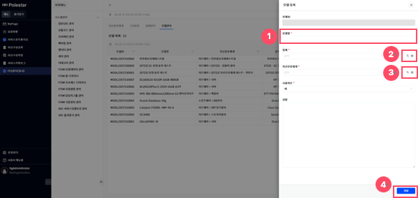

▶ \[그림10\] 모델 등록 화면(드로어)

> 화면 지표

<table>
<thead>
<tr class="header">
<th>모델ID</th>
<th>모델 고유식별을 위한 ID 값입니다.</th>
</tr>
</thead>
<tbody>
<tr class="odd">
<td>모델명</td>
<td>
모델을 식별할 수 있는 명칭을 입력합니다.

반드시 입력해야 하는 항목입니다.
</td>
</tr>
<tr class="even">
<td>업체</td>
<td>
모델의 제조사 또는 공급사를 입력합니다.

반드시 입력해야 하는 항목입니다.

 : 업체 선택 팝업 호출 
 : 선택된 업체 삭제
</td>
</tr>
<tr class="odd">
<td>자산분류체계</td>
<td>
모델의 자산분류체계를 입력합니다.

반드시 입력해야 하는 항목입니다.

 : 자산분류체계 선택 팝업 호출 
 : 선택된 자산분류체계 삭제
</td>
</tr>
<tr class="even">
<td>사용여부</td>
<td>
모델의 사용여부를 선택합니다.

- 예 : 자산 등록에 사용합니다.

- 아니오 : 자산 등록에 사용하지 않습니다.
</td>
</tr>
<tr class="odd">
<td>설명</td>
<td>모델에 대한 비고사항이나 설명을 입력합니다.</td>
</tr>
</tbody>
</table>

> 모델 등록 절차

1.  목록에서 등록 버튼(\[그림9\].”3”)을 클릭합니다.

2.  필수 항목(\[그림10\].”1”와 같이 \[  \]모양의 표식이 되어있는 항목)을 입력합니다.

3.  화면 우측 하단의 \[저장\] 버튼을 클릭합니다.

모델 수정

목록에서 모델(모델ID, 모델명)을 클릭하면, 수정이 가능한 상세화면(드로어)이 열립니다.

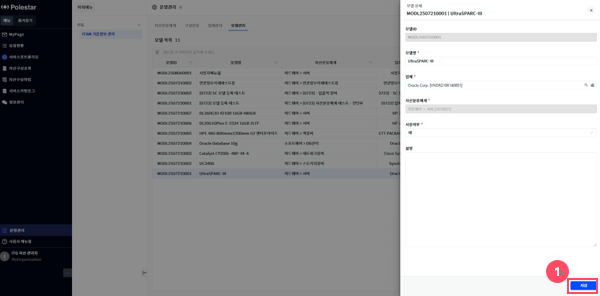

▶ \[그림11\] 모델 상세 화면(드로어)

> 상세 정보

<table>
<tbody>
<tr class="odd">
<td>[그림11].“1” 
저장 버튼</td>
<td>저장 버튼 클릭을 통해 모델을 저장할 수 있습니다.</td>
</tr>
</tbody>
</table>

