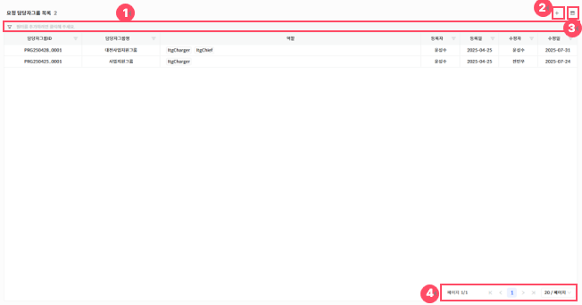
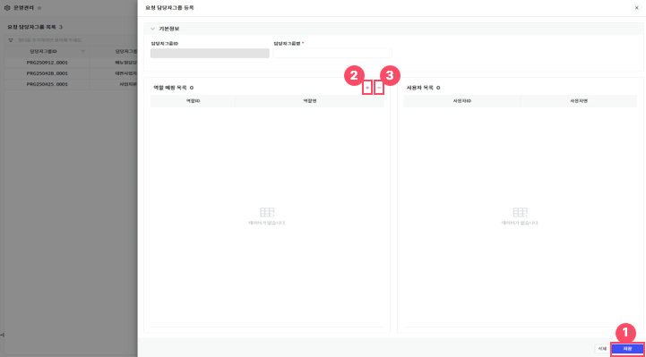
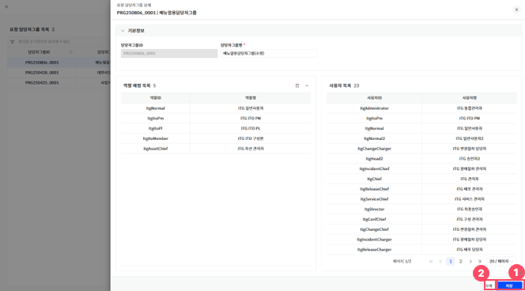
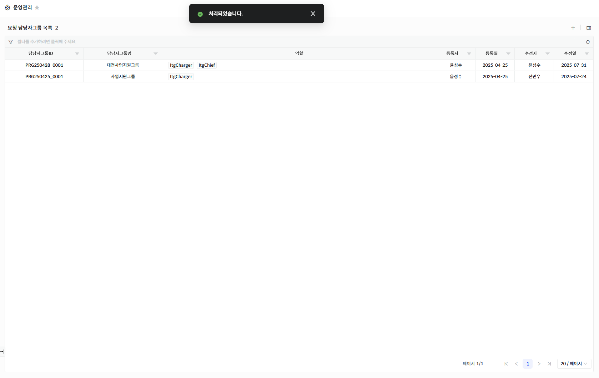

요청 담당자그룹 목록

메뉴에서 \[운영관리\> ITSM 담당자그룹 관리\]를 선택하면 요청 내 담당자에 지정할 수 있는 담당자 그룹 항목들을 조회할 수 있는 화면으로 이동되며 목록 조회, 신규 등록, 정보 수정을 할 수 있습니다.

<table>
<tbody>
<tr class="odd">
<td>
노트

요청 담당자그룹 관리는 사용권한이 있는 경우에만 진입 가능한 메뉴입니다.

요청 담당자그룹 관리 최초 진입 시, 화면 지표 및 데이터를 조회할 수 있습니다.
</td>
</tr>
</tbody>
</table>

▶ \[그림1\] 요청 담당자그룹 목록

> 화면 지표

| 담당자그룹ID | 요청 담당자그룹 고유식별을 위한 ID 값입니다.           |
| ------- | ------------------------------------ |
| 담당자그룹명  | 요청 담당자그룹을 식별할 수 있는 명칭입니다.            |
| 역할      | 요청 담당자그룹에 매핑 된 역할 목록을 나타냅니다.         |
| 등록자/등록일 | 요청 담당자그룹을 최초로 등록한 사용자와 그 일자 정보입니다.   |
| 수정자/수정일 | 요청 담당자그룹을 마지막으로 수정한 사용자와 그 일자 정보입니다. |

> 상세 정보

<table>
<thead>
<tr class="header">
<th>
[그림1].”1”

그리드 필터
</th>
<th>그리드 필터는 상단 행(필터 행)을 통해 각 컬럼 단위로 상세한 조건 검색이 가능한 기능입니다.</th>
</tr>
</thead>
<tbody>
<tr class="odd">
<td>[그림1].”2” 
신규등록 버튼</td>
<td>요청 담당자그룹 항목을 신규등록 할 수 있는 버튼입니다.</td>
</tr>
<tr class="even">
<td>
[그림1].”3”

컬럼수정 &amp; 엑셀저장 버튼
</td>
<td>표시할 컬럼을 선택하거나 숨길 수 있는 설정 기능을 제공하는 컬럼수정 버튼과, 현재 화면에 표시된 데이터를 엑셀파일로 다운로드 하는 기능을 제공하는 엑셀저장 버튼입니다.</td>
</tr>
<tr class="odd">
<td>
[그림1].”4”

페이징
</td>
<td>목록 데이터를 구간별로 나누어 페이지 단위로 조회할 수 있도록 도와주는 기능입니다.</td>
</tr>
</tbody>
</table>

요청 담당자그룹 등록

신규 등록을 위해서는 신규등록 아이콘(\[그림1\]. “2” )을 클릭하면 등록화면(드로어)가 생성됩니다.

▶ \[그림2\] 요청 담당자그룹 상세 화면 - 등록(드로어)

> 화면 지표

<table>
<thead>
<tr class="header">
<th>담당자그룹ID</th>
<th>요청 담당자그룹 식별을 위한 ID 값이며, 등록 시 시스템에 의해 자동으로 입력됩니다.</th>
</tr>
</thead>
<tbody>
<tr class="odd">
<td>담당자그룹명</td>
<td>요청 담당자그룹을 식별할 수 있는 명칭입니다.</td>
</tr>
<tr class="even">
<td>역할 매핑 목록</td>
<td>
해당 담당자그룹에 역할을 매핑 할 수 있는 그리드입니다.

<blockquote>

- 추가 아이콘([그림2]. “2” )을 클릭하여 역할 팝업을 생성 후 목록을 선택하여 팝업 내 우측 하단의 ‘확인’ 버튼을 클릭하여 역할 추가

- 역할 목록 클릭하여 선택 후 삭제 아이콘([그림2].”3”)을 클릭하여 선택된 역할 목록을 삭제

</blockquote></td>
</tr>
<tr class="odd">
<td>사용자 목록</td>
<td>역할 매핑 목록의 내용이 수정(역할 매핑 목록 추가/삭제)될 때마다 해당 역할을 가지고 있는 사용자 목록을 나타냅니다.</td>
</tr>
</tbody>
</table>

> 요청 담당자그룹 등록 절차

1.  필수 항목을 입력합니다. (담당자그룹명)

2.  역할 매핑 목록 그리드의 추가 아이콘(\[그림2\]. “2” )을 클릭하여 역할 팝업을 생성합니다.

3.  팝업 내 체크박스 체크를 통해 매핑할 역할 목록을 선택합니다.

4.  팝업 우측 하단의 \[확인\]버튼 클릭하여 역할 매핑 목록을 추가합니다.

5.  요청 담당자그룹 상세 화면 우측 하단의 저장 버튼(\[그림2\]. “1”)을 클릭합니다.

<table>
<tbody>
<tr class="odd">
<td>
노트

요청 담당자그룹 등록 시, 목록의 최상위에 표시되며 등록자/수정자, 등록일/수정일은 같은 값으로 입력됩니다.
</td>
</tr>
</tbody>
</table>

▶ \[그림3\] 요청 담당자그룹 등록 – 등록 완료

요청 담당자그룹 수정

요청 담당자그룹을 수정하기 위해서는, 요청 담당자그룹 목록에서 ‘담당자그룹ID’ 또는 ‘담당자그룹명’을 클릭하여 상세 화면(드로어)을 연 후,

필요한 항목을 수정 후, 우측 하단의 저장 버튼(\[그림4\]. “1” )을 클릭 시 저장 여부를 확인하는 팝업이 표시되며,

‘확인’을 클릭하면 해당 공통코드(일반) 항목의 수정한 내용이 반영됩니다.

▶ \[그림4\] 요청 담당자그룹 상세 화면 – 수정(드로어)

요청 담당자그룹 삭제

요청 담당자그룹을 삭제하기 위해서는, 요청 담당자그룹 목록에서 ‘담당자그룹ID’ 또는 ‘담당자그룹명’을 클릭하여 상세 화면(드로어)을 연 후,

우측 하단의 삭제 버튼(\[그림4\].”2”) 클릭 시 삭제 여부를 확인하는 팝업이 표시되며, ‘확인’을 클릭하면 해당 요청 담당자그룹 항목이 삭제됩니다.

▶ \[그림5\] 요청 담당자그룹 삭제 – 삭제 완료

