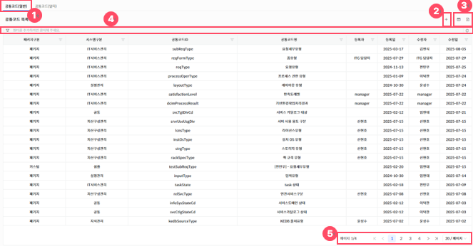
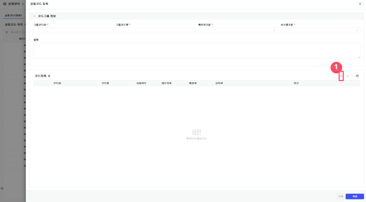
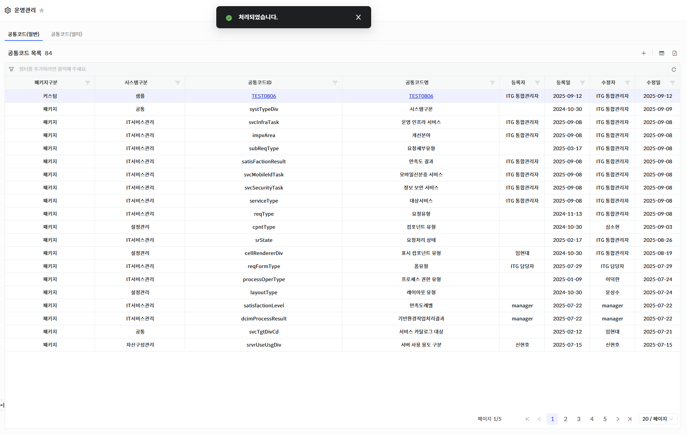
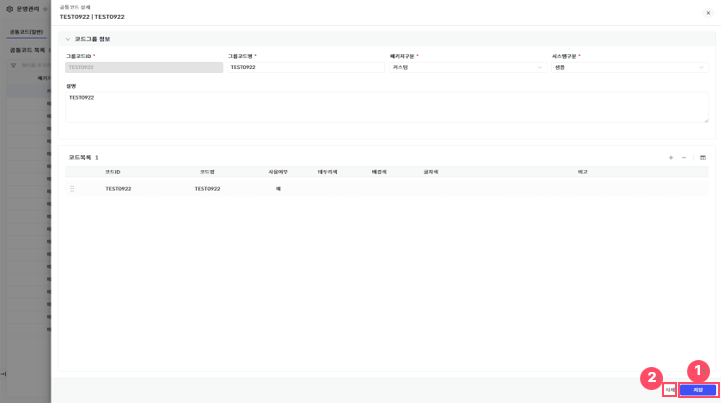
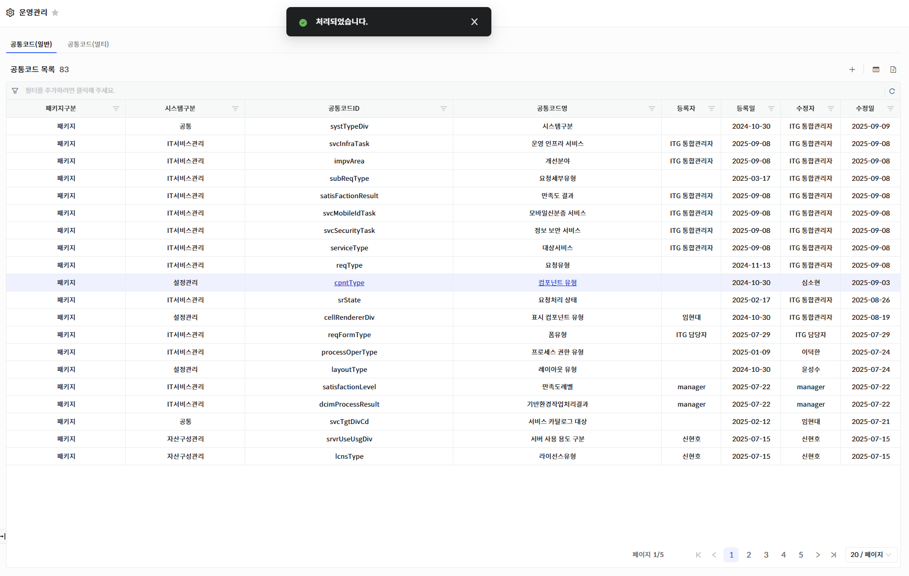
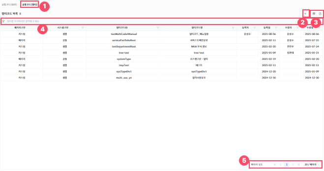
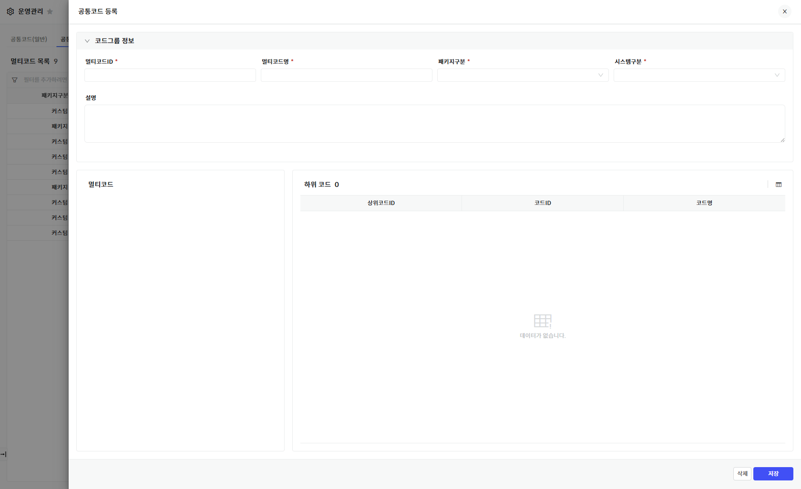
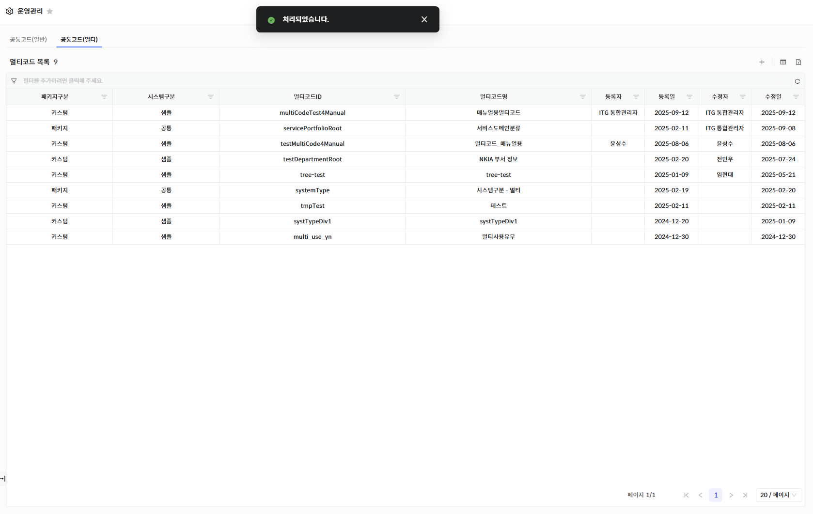
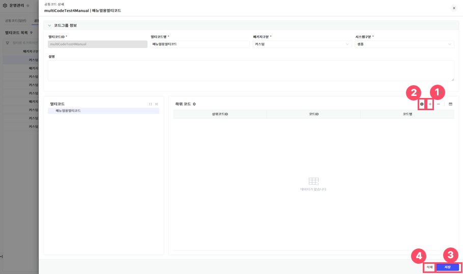
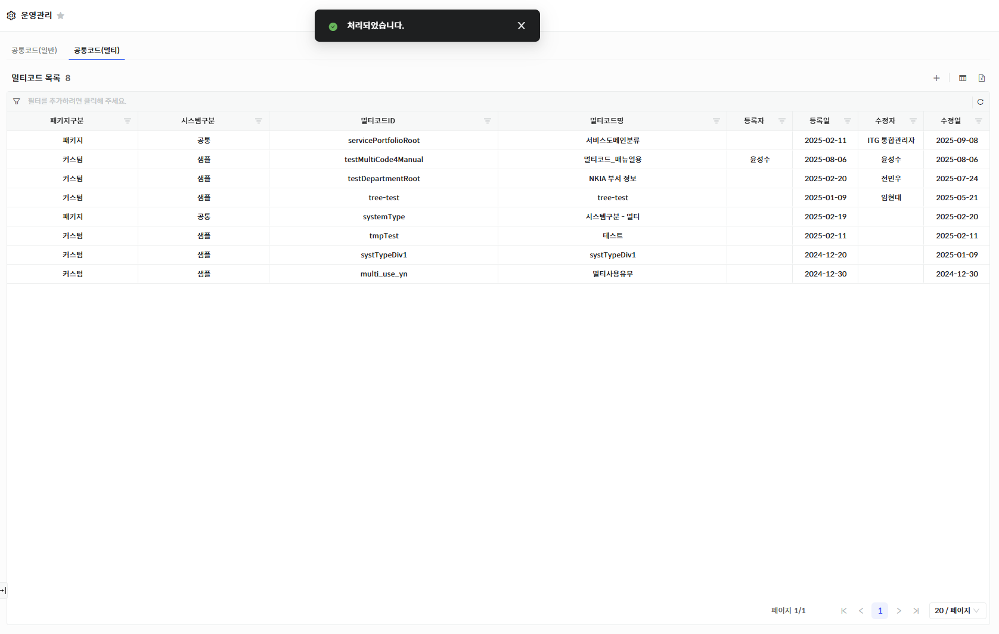

공통코드(일반)

메뉴에서 \[운영관리\> 공통코드 관리\]를 선택하면 시스템 내에서 사용되는 공통코드(일반), 공통코드(멀티) 항목들을 조회할 수 있는 화면으로 이동되며, 공통코드(일반), 공통코드(멀티) 목록 조회, 신규 등록, 정보 수정을 할 수 있습니다.

<table>
<tbody>
<tr class="odd">
<td>
노트

공통코드는 사용권한이 있는 경우에만 가능합니다. 공통코드 최초 진입 시, 혹은 아이콘([그림1].”1”)을 클릭하여 공통코드(일반)에 해당하는 화면 지표 및 데이터를 조회할 수 있습니다.
</td>
</tr>
</tbody>
</table>

▶ \[그림1\] 공통코드(일반) 목록

> 화면 지표

<table>
<thead>
<tr class="header">
<th>패키지구분</th>
<th>
시스템 내 패키지구분에 대한 분류를 나타냅니다.

- 패키지: 시스템 내 필수적으로 필요한 항목임을 나타내는 분류입니다.

<blockquote>

- 커스텀: 사용자가 개별적으로 공통코드를 추가하는 경우 지정하는 분류입니다.

</blockquote></th>
</tr>
</thead>
<tbody>
<tr class="odd">
<td>시스템구분</td>
<td>
시스템 내 어떤 시스템에 사용되는지에 대한 분류를 나타냅니다.

- IT서비스관리: IT 서비스 관련 메뉴에 사용됨을 나타내는 분류입니다.

- 자산구성관리: 자산구성 관련 메뉴에 사용됨을 나타내는 분류입니다.

- 서비스관리: 서비스 관련 메뉴에 사용됨을 나타내는 분류입니다.

- 지식관리: 지식관리 관련 메뉴에 사용됨을 나타내는 분류입니다.

- 설정관리: 시스템 설정 관련 메뉴에 사용됨을 나타내는 분류입니다.

- 공통: 모든 시스템에 사용될 수 있음을 나타내는 분류입니다.

- 샘플: 샘플용 데이터임을 나타내는 분류입니다.
</td>
</tr>
<tr class="even">
<td>공통코드ID</td>
<td>각 공통코드 항목에 부여된 그룹 식별 ID입니다.</td>
</tr>
<tr class="odd">
<td>공통코드명</td>
<td>각 공통코드 항목에 부여된 그룹 식별 명칭입니다.</td>
</tr>
<tr class="even">
<td>등록자/등록일</td>
<td>공통코드를 최초로 등록한 사용자와 그 일자 정보입니다.</td>
</tr>
<tr class="odd">
<td>수정자/수정일</td>
<td>공통코드를 마지막으로 수정한 사용자와 그 일자 정보입니다.</td>
</tr>
</tbody>
</table>

> 상세 정보

<table>
<thead>
<tr class="header">
<th>
[그림1].”1”

공통코드(일반) 탭
</th>
<th>([그림1].”1”)을 클릭하여 공통코드(일반) 목록 화면을 조회할 수 있습니다.</th>
</tr>
</thead>
<tbody>
<tr class="odd">
<td>
[그림1].”2”

신규등록 아이콘
</td>
<td>신규등록 아이콘([그림1].”2”)을 클릭하여 공통코드(일반) 항목을 추가할 수 있는 등록화면(드로우)가 생성됩니다.</td>
</tr>
<tr class="even">
<td>
[그림1].”3”

컬럼수정 &amp; 엑셀저장 버튼
</td>
<td>표시할 컬럼을 선택하거나 숨길 수 있는 설정 기능을 제공하는 컬럼수정 버튼과, 현재 화면에 표시된 데이터를 엑셀파일로 다운로드 하는 기능을 제공하는 엑셀저장 버튼입니다.</td>
</tr>
<tr class="odd">
<td>
[그림1].”4”

그리드 필터
</td>
<td>그리드 필터는 상단 행(필터 행)을 통해 각 컬럼 단위로 상세한 조건 검색이 가능한 기능입니다.</td>
</tr>
<tr class="even">
<td>
[그림1].”5”

페이징
</td>
<td>목록 데이터를 구간별로 나누어 페이지 단위로 조회할 수 있도록 도와주는 기능입니다.</td>
</tr>
</tbody>
</table>

공통코드(일반) 등록

신규 등록을 하기 위해서는 등록 아이콘(\[그림1\]. “2” )을 클릭하면 등록화면(드로우)가 생성됩니다.

▶ \[그림2\] 공통코드(일반) 상세 화면 - 등록(드로어)

> 화면 지표

<table>
<thead>
<tr class="header">
<th>그룹코드ID</th>
<th>공통코드 그룹 식별을 위한 ID 값입니다.</th>
</tr>
</thead>
<tbody>
<tr class="odd">
<td>그룹코드명</td>
<td>공통코드 그룹을 식별할 수 있는 명칭입니다.</td>
</tr>
<tr class="even">
<td>패키지구분</td>
<td>
시스템 내 패키지구분에 대한 분류를 나타냅니다.

- 패키지: 시스템 내 필수적으로 필요한 항목임을 나타내는 분류입니다.

<blockquote>

- 커스텀: 사용자가 개별적으로 공통코드를 추가하는 경우 지정하는 분류입니다.

</blockquote></td>
</tr>
<tr class="odd">
<td>시스템구분</td>
<td>
시스템 내 어떤 시스템에 사용되는지에 대한 분류를 나타냅니다.

- IT서비스관리: IT 서비스 관련 메뉴에 사용됨을 나타내는 분류입니다.

- 자산구성관리: 자산구성 관련 메뉴에 사용됨을 나타내는 분류입니다.

- 서비스관리: 서비스 관련 메뉴에 사용됨을 나타내는 분류입니다.

- 지식관리: 지식관리 관련 메뉴에 사용됨을 나타내는 분류입니다.

- 설정관리: 시스템 설정 관련 메뉴에 사용됨을 나타내는 분류입니다.

- 공통: 모든 시스템에 사용될 수 있음을 나타내는 분류입니다.

- 샘플: 샘플용 데이터임을 나타내는 분류입니다.
</td>
</tr>
<tr class="even">
<td>설명</td>
<td>공통코드의 구체적인 용도 및 설명입니다.</td>
</tr>
<tr class="odd">
<td>코드목록</td>
<td>같은 그룹코드ID를 가진 코드들의 목록을 나타냅니다.</td>
</tr>
</tbody>
</table>

> 공통코드(일반) 등록 절차

1.  필수 항목 입력(\[ \* \] 모양의 표식이 되어있는 항목)

2.  코드목록 그리드의 추가 아이콘(\[그림2\]. “1” )을 클릭하여 목록 추가

3.  코드ID, 코드명, 사용여부, 테두리색, 배경색, 글자색, 비고 등 데이터 입력

4.  화면 우측 하단의 \[저장\]버튼 클릭

5.  저장 팝업의 ‘확인’ 클릭하여 등록 완료

<table>
<tbody>
<tr class="odd">
<td>
노트

공통코드(일반) 등록 시, 목록의 최상위에 표시되며 등록자/수정자, 등록일/수정일은 같은 값으로 입력됩니다.
</td>
</tr>
</tbody>
</table>

▶ \[그림3\] 공통코드(일반) 등록 – 등록 완료

공통코드(일반) 수정

공통코드(일반)을 수정하기 위해서는, 해당 공통코드(일반) 목록에서 ‘공통코드 ID’ 또는 ‘공통코드명’을 클릭하여 상세 화면(드로어)을 연 후, 필요한 항목을 수정 후, 우측 하단의 저장(\[그림4\].”1”) 버튼을 클릭하면 수정한 내용이 반영됩니다.  
저장 버튼 클릭 시 저장 여부를 확인하는 팝업이 표시되며, ‘확인’을 클릭하면 해당 공통코드(일반) 항목이 수정됩니다.

▶ \[그림4\] 공통코드(일반) 상세 화면 – 수정(드로어)

공통코드(일반) 삭제

공통코드(일반)을 삭제하기 위해서는, 해당 공통코드(일반) 목록에서 ‘공통코드ID’ 또는 ‘공통코드명’을 클릭하여 상세 화면(드로어)을 연 후, 우측 하단의 삭제 버튼(\[그림4\].”2”) 클릭 시 삭제 여부를 확인하는 팝업이 표시되며, ‘확인’을 클릭하면 해당 공통코드(일반) 항목이 삭제됩니다.

▶ \[그림5\] 공통코드(일반) 삭제 – 삭제 완료

공통코드(멀티)

메뉴에서 \[시스템관리\> 공통코드\]를 선택하면 시스템 내에서 사용되는 공통코드(일반), 공통코드(멀티) 항목들을 조회할 수 있는 화면으로 이동되며, 공통코드(일반), 공통코드(멀티) 목록 조회, 신규 등록, 정보 수정을 할 수 있습니다.

<table>
<tbody>
<tr class="odd">
<td>
노트

공통코드는 사용권한이 있는 경우에만 가능합니다. 공통코드 진입 후, 아이콘([그림6].”1”) 클릭 시, 공통코드(멀티)에 해당되는 화면 지표 및 데이터를 조회할 수 있습니다.
</td>
</tr>
</tbody>
</table>

▶ \[그림6\] 공통코드(멀티) 목록

> 화면 지표

<table>
<thead>
<tr class="header">
<th>패키지구분</th>
<th>
시스템 내 패키지구분에 대한 분류를 나타냅니다.

- 패키지: 시스템 내 필수적으로 필요한 항목임을 나타내는 분류입니다.

<blockquote>

- 커스텀: 사용자가 개별적으로 공통코드를 추가하는 경우 지정하는 분류입니다.

</blockquote></th>
</tr>
</thead>
<tbody>
<tr class="odd">
<td>시스템구분</td>
<td>
시스템 내 어떤 시스템에 사용되는지에 대한 분류를 나타냅니다.

- IT서비스관리: IT 서비스 관련 메뉴에 사용됨을 나타내는 분류입니다.

- 자산구성관리: 자산구성 관련 메뉴에 사용됨을 나타내는 분류입니다.

- 서비스관리: 서비스 관련 메뉴에 사용됨을 나타내는 분류입니다.

- 지식관리: 지식관리 관련 메뉴에 사용됨을 나타내는 분류입니다.

- 설정관리: 시스템 설정 관련 메뉴에 사용됨을 나타내는 분류입니다.

- 공통: 모든 시스템에 사용될 수 있음을 나타내는 분류입니다.

- 샘플: 샘플용 데이터임을 나타내는 분류입니다.
</td>
</tr>
<tr class="even">
<td>멀티코드ID</td>
<td>각 멀티코드 항목에 부여된 그룹 식별 ID입니다.</td>
</tr>
<tr class="odd">
<td>멀티코드명</td>
<td>각 멀티코드 항목에 부여된 그룹 식별 명칭입니다.</td>
</tr>
<tr class="even">
<td>등록자/등록일</td>
<td>멀티코드를 최초로 등록한 사용자와 그 일자 정보입니다.</td>
</tr>
<tr class="odd">
<td>수정자/수정일</td>
<td>멀티코드를 마지막으로 수정한 사용자와 그 일자 정보입니다.</td>
</tr>
</tbody>
</table>

> 상세 정보

<table>
<thead>
<tr class="header">
<th>
[그림6].”1”

공통코드(멀티) 탭
</th>
<th>([그림6].”1”)을 클릭하여 공통코드(멀티) 목록 화면을 조회할 수 있습니다.</th>
</tr>
</thead>
<tbody>
<tr class="odd">
<td>
[그림6].”2”

신규등록 아이콘
</td>
<td>신규등록 아이콘([그림6].”2”)을 클릭하여 공통코드(멀티) 항목을 추가할 수 있는 등록화면(드로우)가 생성됩니다.</td>
</tr>
<tr class="even">
<td>
[그림6].”3”

컬럼수정 &amp; 엑셀저장 버튼
</td>
<td>표시할 컬럼을 선택하거나 숨길 수 있는 설정 기능을 제공하는 컬럼수정 버튼과, 현재 화면에 표시된 데이터를 엑셀파일로 다운로드 하는 기능을 제공하는 엑셀저장 버튼입니다.</td>
</tr>
<tr class="odd">
<td>
[그림6].”4”

그리드 필터
</td>
<td>그리드 필터는 상단 행(필터 행)을 통해 각 컬럼 단위로 상세한 조건 검색이 가능한 기능입니다.</td>
</tr>
<tr class="even">
<td>
[그림6].”5”

페이징
</td>
<td>목록 데이터를 구간별로 나누어 페이지 단위로 조회할 수 있도록 도와주는 기능입니다.</td>
</tr>
</tbody>
</table>

공통코드(멀티) 등록

신규 등록을 하기 위해서는 등록 아이콘(\[그림6\]. “2” )을 클릭하면 등록화면(드로어)가 생성됩니다.

▶ \[그림7\] 공통코드(멀티) 상세 화면 - 등록(드로어)

> 화면 지표

<table>
<thead>
<tr class="header">
<th>멀티코드ID</th>
<th>공통코드 그룹 식별을 위한 ID 값입니다.</th>
</tr>
</thead>
<tbody>
<tr class="odd">
<td>멀티코드명</td>
<td>공통코드 그룹을 식별할 수 있는 명칭입니다.</td>
</tr>
<tr class="even">
<td>패키지구분</td>
<td>
시스템 내 패키지구분에 대한 분류를 나타냅니다.

- 패키지: 시스템 내 필수적으로 필요한 항목임을 나타내는 분류입니다.

- 커스텀: 사용자가 개별적으로 공통코드를 추가하는 경우 지정하는 분류입니다.
</td>
</tr>
<tr class="odd">
<td>시스템구분</td>
<td>
시스템 내 어떤 시스템에 사용되는지에 대한 분류를 나타냅니다.

- IT서비스관리: IT 서비스 관련 메뉴에 사용됨을 나타내는 분류입니다.

- 자산구성관리: 자산구성 관련 메뉴에 사용됨을 나타내는 분류입니다.

- 서비스관리: 서비스 관련 메뉴에 사용됨을 나타내는 분류입니다.

- 지식관리: 지식관리 관련 메뉴에 사용됨을 나타내는 분류입니다.

- 설정관리: 시스템 설정 관련 메뉴에 사용됨을 나타내는 분류입니다.

- 공통: 모든 시스템에 사용될 수 있음을 나타내는 분류입니다.

- 샘플: 샘플용 데이터임을 나타내는 분류입니다.
</td>
</tr>
<tr class="even">
<td>설명</td>
<td>공통코드의 구체적인 용도 및 설명입니다.</td>
</tr>
<tr class="odd">
<td>멀티코드</td>
<td>멀티코드들의 계층관계를 식별하여 트리 모양으로 나타냅니다.</td>
</tr>
<tr class="even">
<td>하위코드</td>
<td>각 멀티코드별 하위 멀티코드들을 나타내는 목록입니다.</td>
</tr>
</tbody>
</table>

> 공통코드(멀티) 등록 절차

1.  필수 항목 입력(그룹코드ID, 그룹코드명, 패키지구분, 시스템구분)

2.  화면 우측 하단의 \[저장\]버튼 클릭

<table>
<tbody>
<tr class="odd">
<td>
노트

공통코드(멀티) 등록 시, 목록의 최상위에 표시되며 등록자/수정자, 등록일/수정일은 같은 값으로 입력됩니다.
</td>
</tr>
</tbody>
</table>

▶ \[그림8\] 공통코드(일반) 등록 – 등록 완료

공통코드(멀티) 수정

> 공통코드(멀티) 수정 절차

1.  코드그룹 정보 내 수정 필요 항목 데이터 수정

2.  좌측 하단 멀티코드 트리의 상위 노드 클릭 후 아이콘(\[그림 9\]. “1”)을 클릭하여 하위 코드 목록 추가

3.  하위코드 데이터 입력 후 아이콘(\[그림9\]. “2”) 버튼을 클릭

4.  적용 팝업 내 ‘확인’ 클릭하여 멀티코드 트리 내 데이터 적용

5.  우측 하단의 저장(\[그림9\].”3”) 버튼을 클릭

6.  저장 팝업 내 ‘확인’ 클릭하여 공통코드(멀티) 항목 데이터 수정

▶ \[그림9\] 공통코드(멀티) 상세 화면 – 수정(드로어)

공통코드(멀티) 삭제

공통코드(멀티)를 삭제하기 위해서는, 해당 공통코드(멀티) 목록에서 ‘멀티코드ID’ 또는 ‘멀티코드명’을 클릭하여 상세 화면(드로어)을 연 후, 우측 하단의 삭제 버튼(\[그림9\].”4”) 클릭 시 삭제 여부를 확인하는 팝업이 표시되며, ‘확인’을 클릭하면 해당 공통코드(멀티) 항목이 삭제됩니다.

▶ \[그림10\] 공통코드(멀티) 삭제 – 삭제 완료

