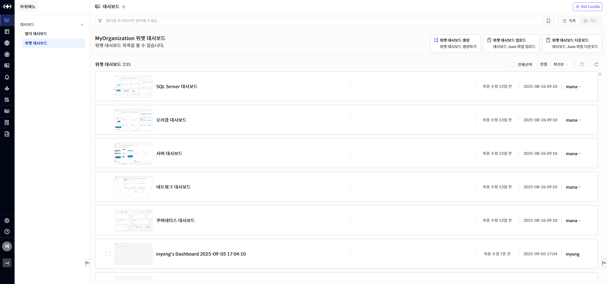
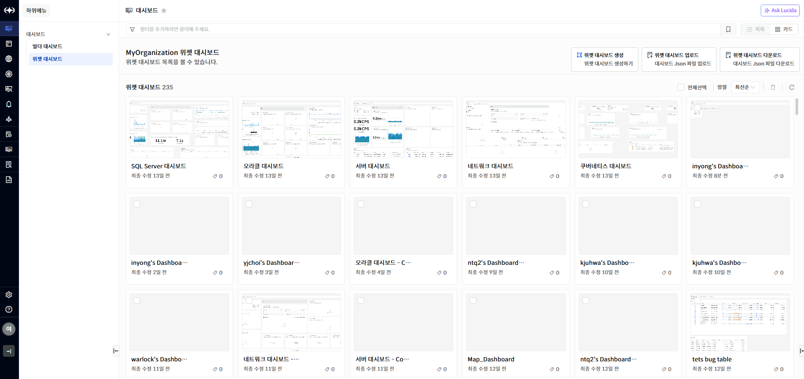
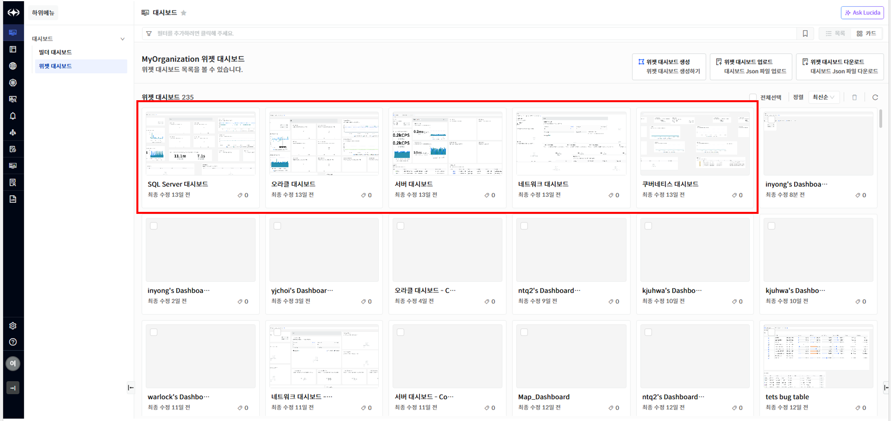
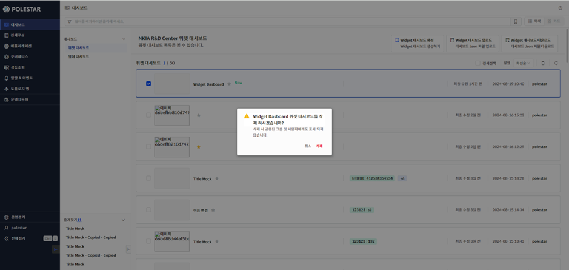
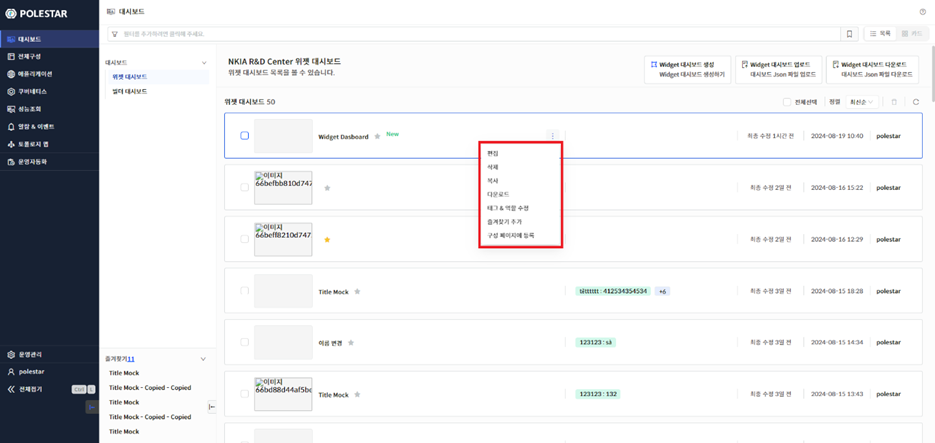
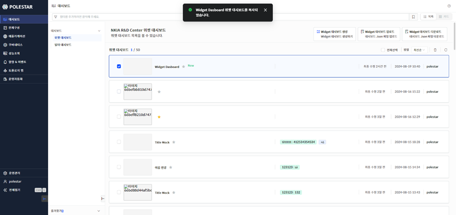
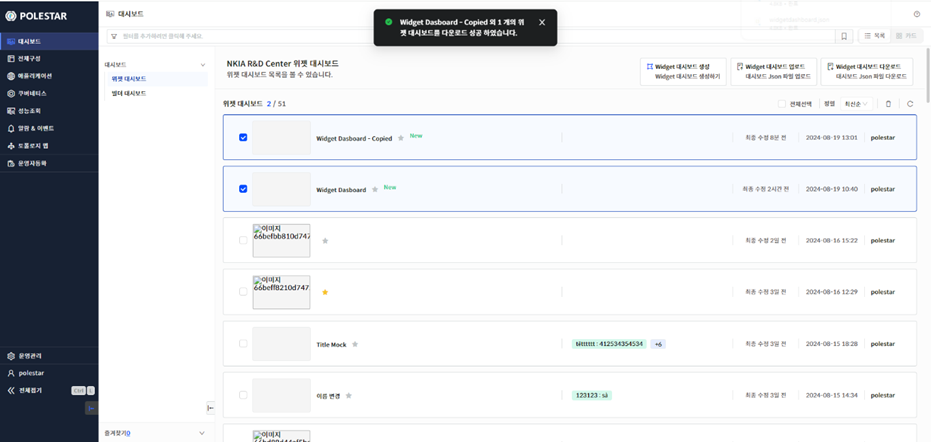
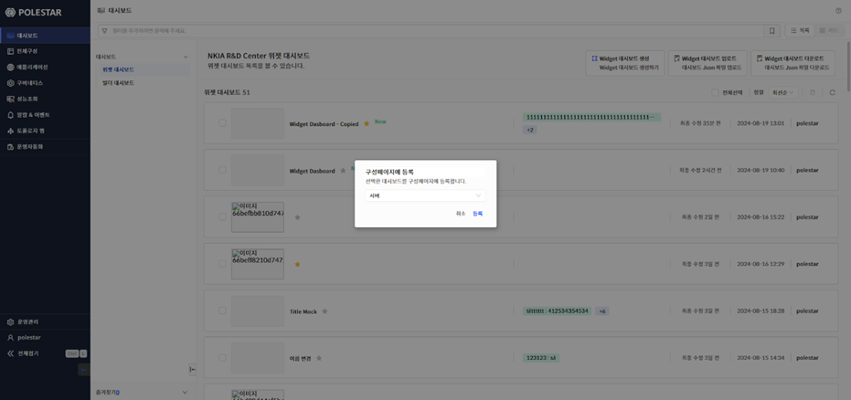

위젯 대시보드 목록

위젯 대시보드를 조회하기 위해서는 화면 왼쪽 메인 메뉴 영역에서 \[대시보드\]\>\[위젯 대시보드\] 메뉴를 선택합니다. 위젯 대시보드는 목록 형식과 썸네일 형식 두가지로 조회가 가능합니다.

<table>
<tbody>
<tr class="odd">
<td>
노트

위젯 대시보드를 구성하기 위해서는 [관리 대상]이 미리 등록되어 있어야 합니다.
</td>
</tr>
</tbody>
</table>

> ▶ \[그림1\] 위젯 대시보드 목록

> ▶ \[그림2\] 위젯 대시보드 썸네일 목록

위젯 대시보드 템플릿

> 위젯 대시보드 기본 템플릿을 제공하며 최상단에 위치에 있습니다. 삭제, 편집이 불가능하며 복사 후 사용할 수 있습니다.

> ▶ \[그림3\] 위젯 대시보드 템플릿

위젯 대시보드 삭제

삭제할 위젯 대시보드를 선택하고 \[삭제\] 버튼을 클릭하면 위젯 대시보드를 삭제할 수 있습니다.

\[전체선택\] 버튼을 클릭하면 모든 위젯 대시보드를 선택할 수 있으며 \[삭제\] 버튼을 클릭하면 모든 위젯 대시보드를 삭제할 수 있습니다.

<table>
<tbody>
<tr class="odd">
<td>
노트

위젯 대시보드를 삭제하면 해당 디비에서 완전히 삭제가 되기 때문에 한번 더 확인을 해야 합니다.
</td>
</tr>
</tbody>
</table>

▶ \[그림4\] 위젯 대시보드 삭제

> 위젯 대시보드 삭제 절차

1.  삭제하고자 하는 위젯 대시보드 선택 (다중 선택 가능)

2.  테이블 우측 상단의 삭제 아이콘 클릭

3.  메시지창에서 확인 클릭

위젯 대시보드 개별 메뉴

위젯 대시보드에서 마우스 오버시 개별 메뉴가 표시됩니다. 대시보드 템플릿과 위젯 대시보드 별로 메뉴가 다르며 대시보드 템플릿의 경우에는 \[편집\], \[삭제\]를 제외한 메뉴만 가능합니다. 위젯 대시보드의 개별 메뉴에는 \[편집\], \[삭제\], \[복사\], \[다운로드\], \[대시보드 상세\], \[구성페이지에 등록\] 등 기능을 이용할 수 있습니다

► \[그림5\] 위젯 대시보드 개별 메뉴

개별 메뉴

| 편집        | 선택된 위젯 대시보드를 편집할 수 있는 화면을 팝업합니다. 대시보드 템플릿에서는 지원하지 않습니다.              |
| --------- | -------------------------------------------------------------------- |
| 삭제        | 선택된 위젯 대시보드를 삭제합니다. 대시보드 템플릿에서는 지원하지 않습니다.                           |
| 복사        | 선택된 위젯 대시보드를 복사합니다.                                                  |
| 다운로드      | 선택된 위젯 대시보드를 JSON 파일로 다운로드 합니다.                                      |
| 대시보드 상세   | 선택된 위젯 대시보드의 제목을 변경하고 태그를 추가/삭제할 수 있습니다. 접근 제어를 설정하여 역할를 변경할 수 있습니다. |
| 구성 페이지 등록 | 선택된 위젯 대시보드를 구성 페이지의 대시보드에 등록합니다.                                    |

<table>
<tbody>
<tr class="odd">
<td>
노트

Administrators 역할은 가지고 있는 사용자는 해당 역할의 권한을 수정할 수 없습니다
</td>
</tr>
</tbody>
</table>

위젯 대시보드 복사

위젯 대시보드 개별 메뉴에서 \[복사\] 기능을 이용할 수 있습니다. 위젯 대시보드를 복사할 경우 원본의 모든 데이터를 복사하며 이름 뒤에 \[-Copied\] 를 추가하여 생성합니다.

► \[그림6\] 위젯 대시보드 복사

위젯 대시보드 업로드/다운로드

위젯 대시보드 개별 혹은 목록의 메뉴에서 \[업로드\], \[다운로드\] 기능을 이용할 수 있습니다. 위젯 대시보드를 \[다운로드\]할 경우 선택된 위젯 대시보드를 JSON 파일로 다운로드합니다. 여러 개의 위젯 대시보드를 선택할 수 있습니다. \[다운로드\]로 받은 JSON 파일을 \[업로드\]를 이용하여 새로운 위젯 대시보드를 생성할 수 있습니다. 생성된 위젯 대시보드는 이름 뒤에 \[-Upload\]를 추가하여 생성합니다.

► \[그림7\] 위젯 대시보드 다운로드

위젯 대시보드 구성페이지에 등록

위젯 대시보드 개별 메뉴에서 \[구성페이지에 등록\] 기능을 이용할 수 있습니다. \[구성페이지에 등록\]은 \[전체구성\] 화면에서 \[대시보드\]에 표시할 위젯 대시보드를 설정합니다.

► \[그림8\] 위젯 대시보드 구성페이지 등록

