위젯 대시보드 편집

위젯 대시보드를 맵을 신규 혹은 기존의 위젯 대시보드를 편집할 수 있습니다. 생성시 기본으로 제공되는 레이아웃을 선택할 수 있으며. 자유롭게 변경할 수 있습니다.

<table>
<tbody>
<tr class="odd">
<td>
노트

썸네일은 편집화면에서 주기적으로 생성하기 때문에 단기간 화면에 있을 경우 생성이 되지 않을 수 있습니다.
</td>
</tr>
</tbody>
</table>

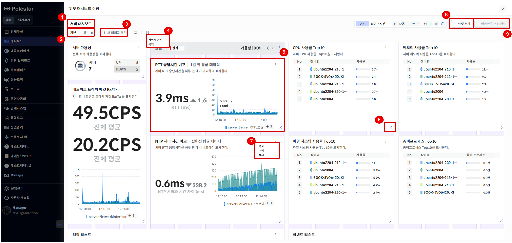

> ▶ \[그림1\] 위젯 대시보드 편집

상세 정보

| 1\. 대시보드 타이틀 | 대시보드의 타이틀을 표시합니다. 더블 클릭 시 타이틀을 변경할 수 있습니다. |
| ------------ | ------------------------------------------ |
| 2\. 페이지 이름   | 페이지 이름을 표시합니다. 더블 클릭 시 이름을 변경할 수 있습니다.     |
| 3\. 페이지 추가   | 신규 페이지를 추가할 수 있습니다.                        |
| 4\. 페이지 메뉴   | 페이지를 복사하거나 관리 메뉴를 팝업 할 수 있습니다.             |
| 5\. 위젯       | 위젯을 표시합니다.                                 |
| 6\. 위젯 크기 변경 | 클릭 후 드레그 하여 위젯의 크기를 변경할 수 있습니다.            |
| 7\. 위젯 개별 메뉴 | 위젯을 복사/수정/삭제할 수 있습니다.                      |
| 8\. 위젯 추가    | 신규 위젯을 추가할 수 있습니다.                         |
| 9\. 레이아웃 저장  | 변경된 레이아웃을 저장합니다.                           |

위젯 대시보드 레이아웃

위젯 대시보드의 구성을 손쉽게 하기위해 레이아웃을 선택할 수 있습니다. 4가지의 시각화 레이아웃과 자유형태의 레이아웃이 있습니다. 사용자는 선택한 레이아웃을 이용하여 다양한 위젯 대시보드를 생성할 수 있습니다.

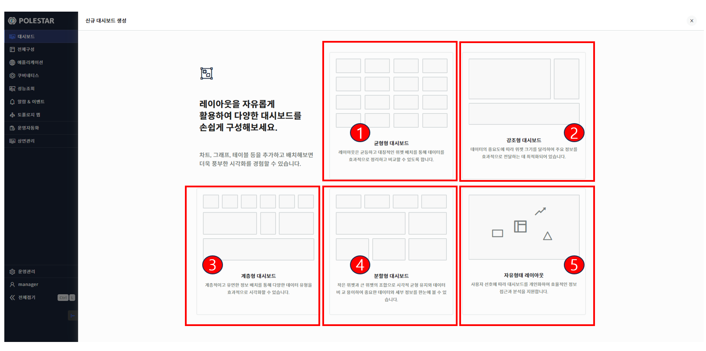

▶ \[그림2\] 위젯 대시보드 레이아웃

개별 메뉴

| 1\. 균형형 대시보드  | 레이아웃은 균등하고 대칭적인 위젯 배치를 통해 데이터를 효과적으로 정리하고 비교할 수 있도록 합니다.               |
| ------------- | ---------------------------------------------------------------------- |
| 2\. 강조형 대시보드  | 데이터의 중요도에 따라 위젯 크기를 달리하여 주요 정보를 효과적으로 전달하는 데 최적화되어 있습니다.               |
| 3\. 계층형 대시보드  | 계층적이고 유연한 정보 배치를 통해 다양한 데이터 유형을 효과적으로 시각화할 수 있습니다.                     |
| 4\. 분할형 대시보드  | 작은 위젯과 큰 위젯의 조합으로 시각적 균형 유지와 데이터 비교 용이하여 중요한 데이터의 세부 정보를 한눈에 볼 수 있습니다. |
| 5\. 지유형태 레이아웃 | 사용자 선호에 따라 대시보드를 개인화하여 효율적인 정보 접근과 분석을 지원합니다.                          |

위젯 대시보드 편집

위젯 대시보드는 여러 페이지로 구성되며 각 페이지에 위젯을 추가하여 최종적인 대시보드가 완성됩니다.

<table>
<tbody>
<tr class="odd">
<td>
노트

위젯 대시보드의 레이아웃 변경은 [레이아웃 수정완료] 버튼을 눌러야 설정된 내용이 적용됩니다
</td>
</tr>
</tbody>
</table>

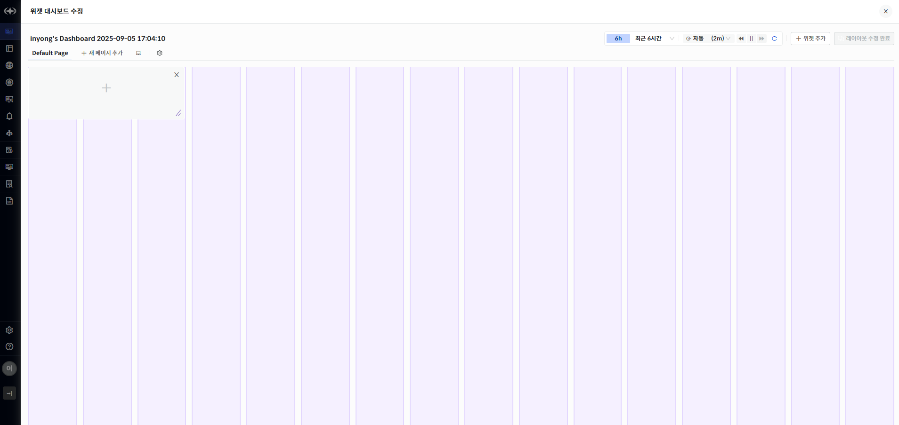

► \[그림3\] 위젯 대시보드 편집

대상 선택

위젯 대시보드의 데이터를 특정 대상을 선택할 수 있는 기능을 제공합니다.

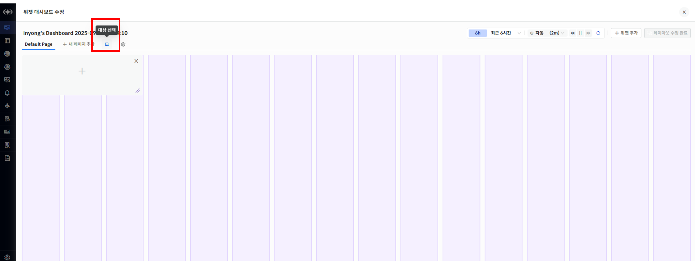

► \[그림4\] 대상 선택 기능 사용

대상 선택 설정

대상 선택 버튼을 클릭하면 기능을 활성화할 수 있습니다. 그 후 추가 버튼을 눌러 필터 혹은 리소스를 추가하여 대상을 선택합니다.

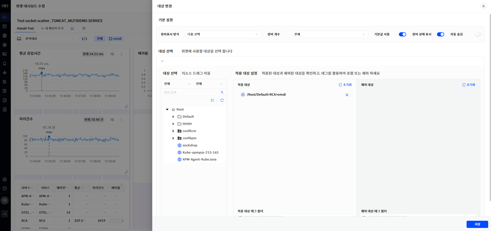

► \[그림5\] 대상 선택 설정

대상 선택 적용

대상 선택 버튼을 클릭하면 기능을 활성화할 수 있습니다. 그 후 추가 버튼을 눌러 필터 혹은 리소스를 추가하여 대상을 선택합니다.

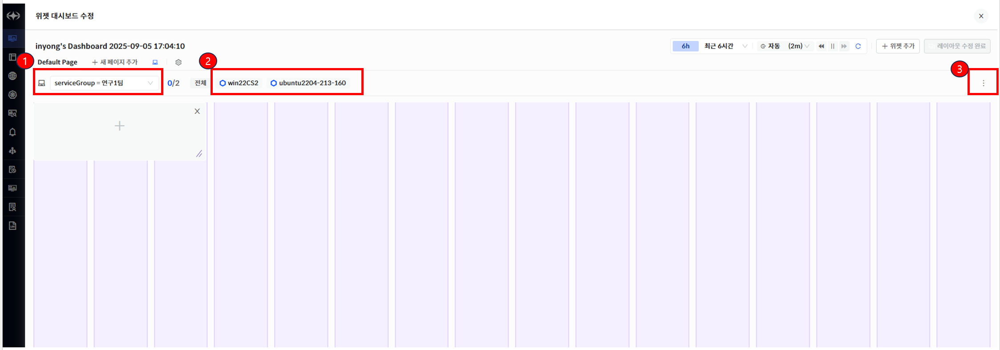

► \[그림6\] 대상 선택 설정

화면 설명

| 1\. 필터    | 대상 선택에서 선택한 필터를 표시합니다. 리소스를 선택할 경우 관리대상 필터가 추가됩니다.              |
| --------- | --------------------------------------------------------------- |
| 2\. 관리 대상 | 필터에 포함된 관리 대상을 표시합니다. 관리 대상을 클릭하면 선택할 수 있으며 다시 클릭하면 해제할 수 있습니다. |
| 3\. 대상 변경 | 현재 설정된 대상 정보를 변경합니다.                                            |

페이지 추가

위젯 대시보드의 페이지는 \[새 페이지 추가\]를 눌러 신규 페이지를 추가할 수 있습니다.

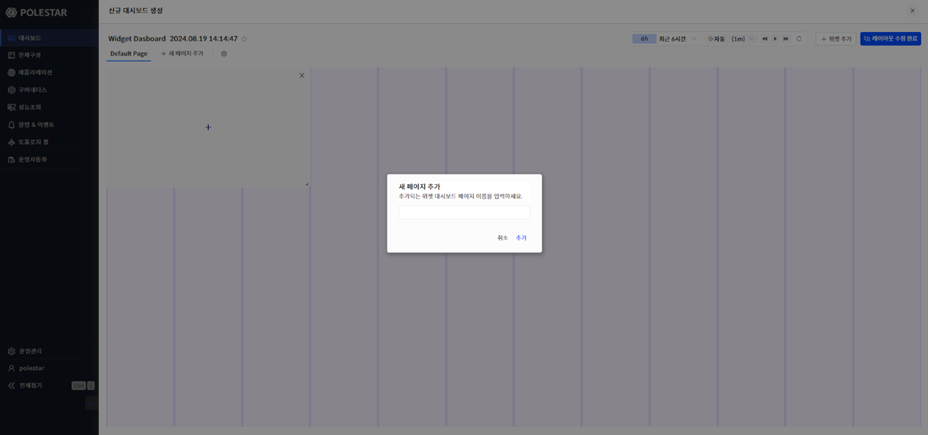

► \[그림7\] 페이지 추가

페이지 관리

설정 메뉴에서 \[페이지 관리\]를 팝업 할 수 있습니다. \[페이지 관리\] 화면에서는 페이지의 리스트를 확인할 수 있으며 이름을 수정할 수 있습니다. 슬라이드 설정을 통하여 슬라이드 쇼를 지원합니다.

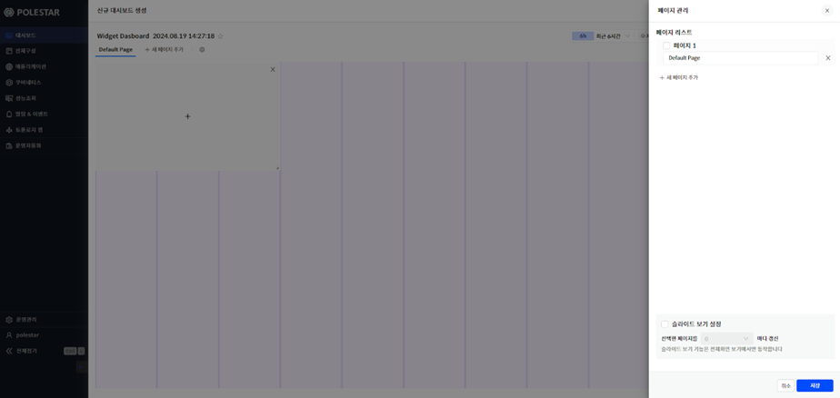

► \[그림8\] 페이지 관리

페이지 복제

설정 메뉴에서 \[복제\]를 선택하여 선택 중인 페이지를 복제할 수 있습니다. 선택 된 페이지의 모든 구성요소를 복제합니다. 복제된 페이지는 이름 뒤에 -Copied 가 붙습니다.

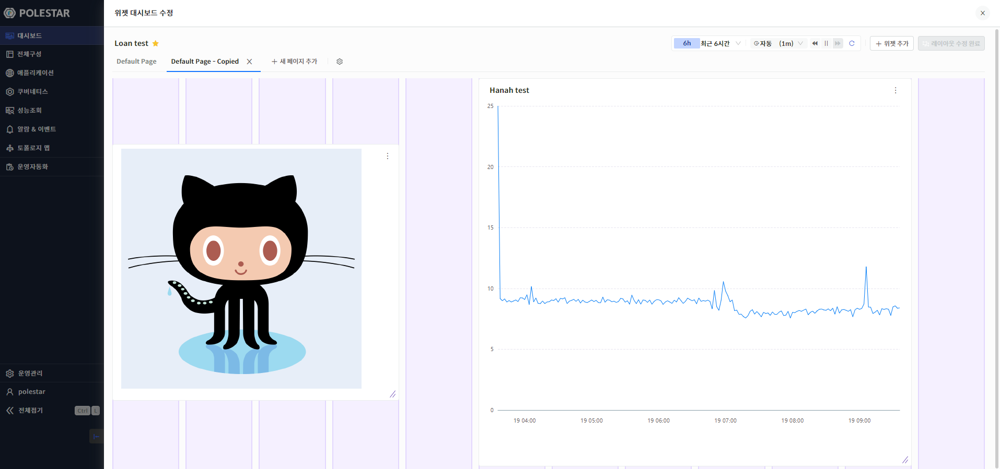

► \[그림9\] 페이지 복제

위젯 추가

\[위젯 추가\] 클릭할 경우 새로운 위젯을 추가할 수 있습니다. 위젯은 \[차트 위젯\]과 \[마크다운 위젯\]으로 구성되어 있습니다.

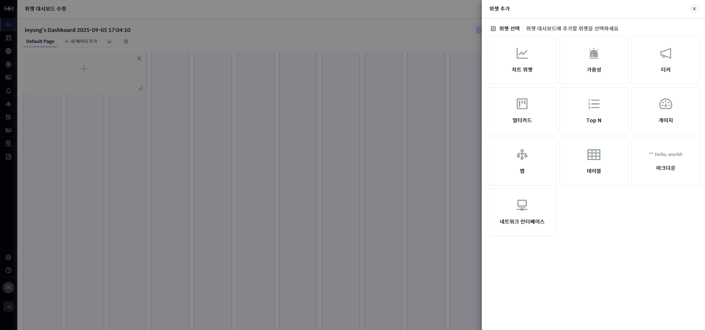

► \[그림10\] 위젯 추가

차트 위젯

지표를 선택하여 데이터를 확인하고 다양한 시각화 도구를 이용하여 중요한 정보를 표현할 수 있는 위젯 기능을 제공합니다.

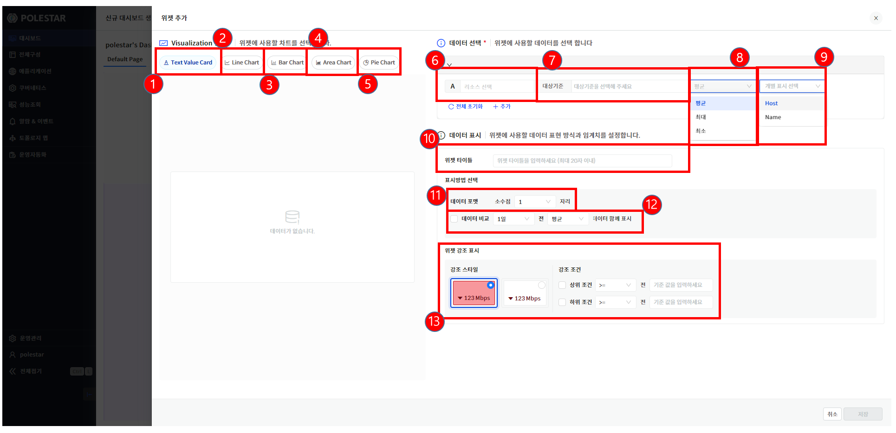

► \[그림11\] 차트 위젯

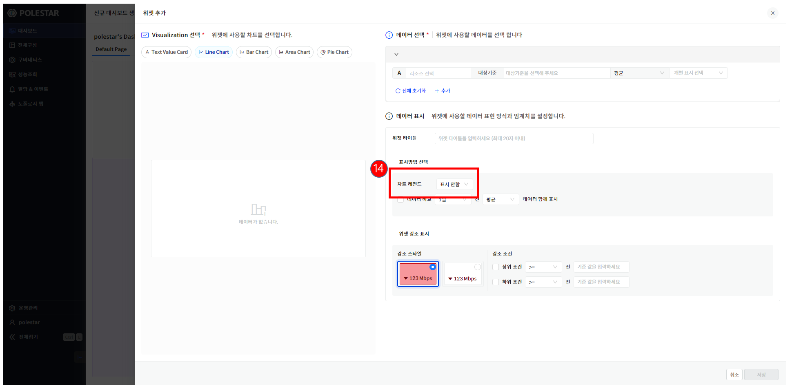

► \[그림12\] 차트 위젯

Visualization 선택

| 1\. Text Value Card | 선택된 데이터의 최근 데이터를 표시합니다.     |
| ------------------- | --------------------------- |
| 2\. Line Chart      | 선택된 데이터를 Line Chart로 표시합니다. |
| 3\. Bar Chart       | 선택된 데이터를 Bar Chart로 표시합니다.  |
| 4\. Area Chart      | 선택된 데이터를 Area Chart로 표시합니다. |
| 5\. Pie Chart       | 선택된 데이터를 Pie Chart로 표시합니다.  |

데이터 선택

| 6\. 대상 타입     | 대상 타입을 선택합니다. \[대상 선택 데이터\] 와 \[개별 선택 데이터\] 가 있으며 \[대상 선택 데이터\]는 대상 선택 기능을 사용할 경우 적용되며, \[개별 선택 데이터\]가 선택되면 대상 선택은 무시됩니다. |
| ------------- | ------------------------------------------------------------------------------------------------------------------------- |
| 7\. 지표        | 표시할 지표를 선택합니다.                                                                                                            |
| 8\. 대상기준      | 대상 기준을 선택합니다.                                                                                                             |
| 9\. 표시기준      | 표시 기준을 선택합니다. 기본은 \[평균\]이며 \[최소\], \[최대\]로 변경할 수 있습니다.                                                                    |
| 10\. 개별 표시 선택 | 개별 표시 선택을 할 수 있으며 \[Host\], \[Name\]으로 표시할 수 있습니다.                                                                        |

데이터 표시

| 11\. 위젯 타이틀   | 위젯 타이틀을 표시합니다.                                            |
| ------------- | --------------------------------------------------------- |
| 12\. 위젯 설명    | 위젯 설정을 표시합니다.                                             |
| 13\. 폰트 크기    | Text Value Card 선택시 표시되며 폰트 크기를 설정할 수 있습니다.               |
| 14\. 정렬       | Text Value Card 선택시 표시되며 폰트 정렬을 설정할 수 있습니다.               |
| 15\. 데이터 포멧   | Text Value Card 선택시 표시되며 소수점을 선택할 수 있습니다.                 |
| 16\. 데이터 비교   | 선택된 지표에 해당하는 이전 데이트를 함께 표시할 수 있습니다.                       |
| 17\. 위젯 강조 표시 | \[상위 조건\]과 \[하위 조건\]을 이용하여 위젯 강조 표시를 선택할 수 있습니다.          |
| 18\. 차트 레전드   | Text Value Card 이외의 Chart 선택시 표시되며 레전드 표시여부를 선택할 수 있습니다.. |

지표 연산

차트 위젯에서 지표가 두개 이상일 일 경우 지표 연산을 제공합니다. 지표 연산은 선택된 모든 지표를 평균/합산/최대/최소 로 연산을 할 수 있습니다. 개별 지표로 사칙연산을 지원합니다.

<table>
<tbody>
<tr class="odd">
<td>
노트

사칙연산은 +, -, *, / 와 개별 지표 (A, B, C …) 만 사용할 수 있으며 숫자 형식은 사용할 수 없습니다.
</td>
</tr>
</tbody>
</table>

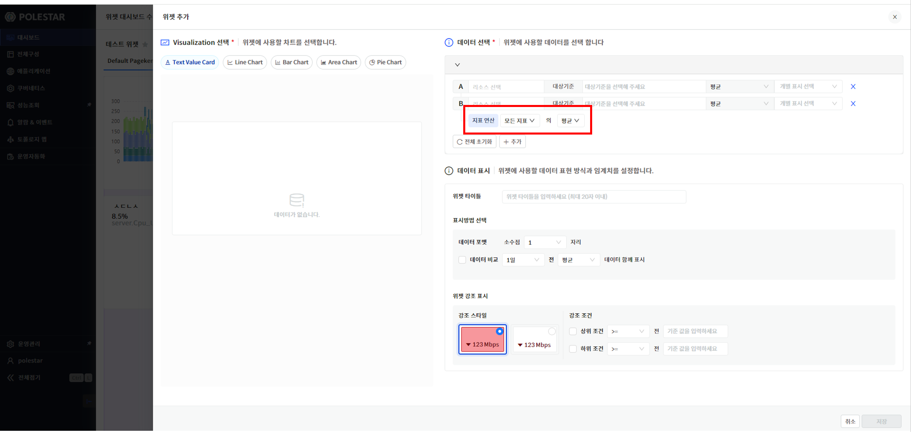

► \[그림13\] 지표 연산

마크다운 위젯

마크다운을 이용하여 공지사항, 제목, 중요한 내용을 작성하거나 이미지를 추가하거나 링크를 표현할 수 있는 위젯 기능을 제공합니다. Sync Scroll 기능을 사용하면 마크다운과 미리보기가 연동되어 표시됩니다.

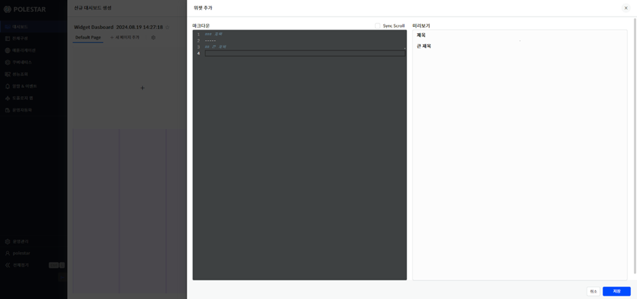

► \[그림14\] 마크다운 위젯

티커 위젯

현재 발생된 알람이나 공지사항을 티커 형식으로 표현할 수 있는 위젯 기능을 제공합니다.

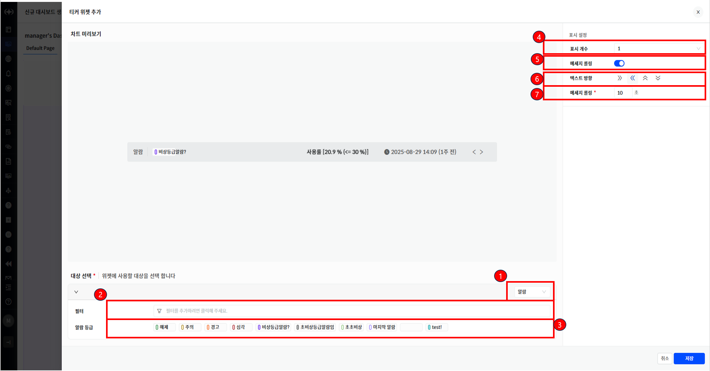

► \[그림15\] 티커 위젯

대상 선택

| 1\. 위젯 타입 | 위젯 타입을 선택합니다. \[알람\]과 \[공지\] 중에 선택할 수 있습니다..      |
| --------- | ------------------------------------------------- |
| 2\. 필터    | 대상의 필터를 설정합니다.                                    |
| 3\. 알람 등급 | 위젯 타입이 \[알람\]일 경우에만 표시가 되며 표시를 원하는 알람 등급을 토글 합니다. |

표시 설정

| 4\. 표시 개수  | 화면에 표시할 개수를 설정합니다. 최대 5개까지 표시가 가능합니다. |
| ---------- | ------------------------------------- |
| 5\. 메시지 롤링 | 메시지 롤링 여부를 설정합니다.                     |
| 6 텍스트 방향   | 메시지 롤링시 텍스트의 방향을 설정합니다.               |
| 7\. 메시지 롤링 | 메시지 롤링 시간을 설정합니다.                     |

가용성 위젯

선택된 대상의 가용성을 그룹화 하고 강조 효과를 이용하여 사용자가 인지하기 쉽게 할 수 있는 위젯 기능을 제공합니다.

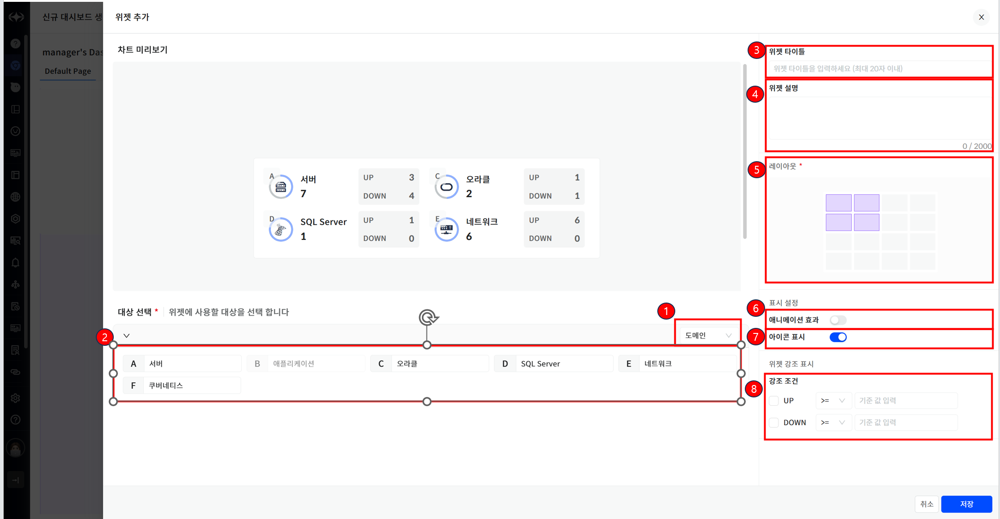

► \[그림16\] 가용성 위젯

대상 선택

| 1\. 위젯 타입 | 위젯 타입을 선택합니다. \[도메인\]과 \[태그\] 중에 선택할 수 있습니다.. |
| --------- | --------------------------------------------- |
| 2\. 도메인   | 대상의 도메인을 선택합니다.                               |

기본 설정

| 3\. 위젯 타이틀 | 위젯 타이틀을 설정합니다.                                        |
| ---------- | ----------------------------------------------------- |
| 4\. 위젯 설명  | 위젯 설명을 설정합니다.                                         |
| 5\. 레이아웃   | 가용성 위젯을 표현할 레이아웃을 설정합니다. 원하는 곳을 클릭하면 해당 레이아웃으로 설정됩니다. |

표시 설정

| 6\. 애니메이션 효과 | 강조 조건에 맞을 경우 애니메이션 효과 여부를 설정합니다. |
| ------------ | -------------------------------- |
| 7\. 아이콘 표시   | 대상의 아이콘의 표시 여부를 설정합니다.           |

위젯 강조 표시

|           |               |
| --------- | ------------- |
| 8\. 강조 조건 | 강조 조건을 설정합니다. |

멀티 카드 위젯

선택된 대상의 성능 정보를 카드 형식으로 볼 수 있으며 차트와 동시에 볼 수 있는 위젯 기능을 제공합니다.

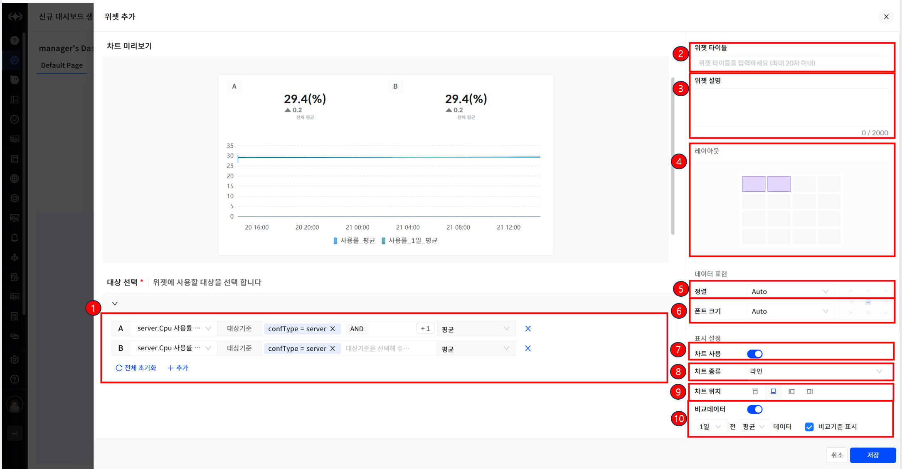

► \[그림17\] 멀티 카드 위젯

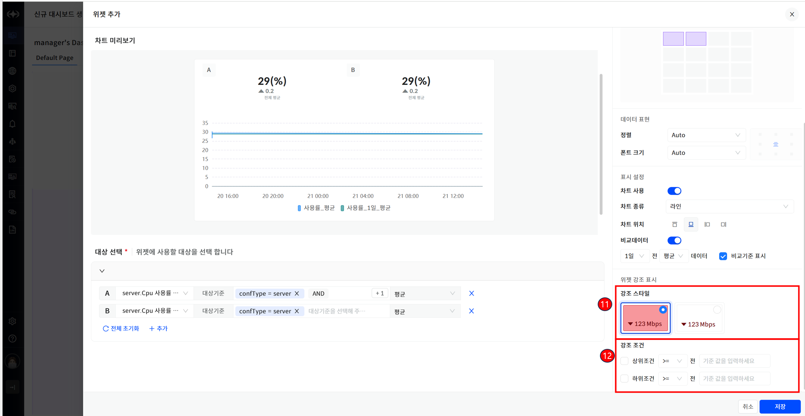

► \[그림18\] 멀티 카드 위젯

대상 선택

|           |                                                    |
| --------- | -------------------------------------------------- |
| 1\. 지표 선택 | 카드에 표시할 지표를 선택합니다. \[추가\] 버튼을 클릭하여 다중으로 추가가 가능합니다. |

기본 설정

| 2\. 위젯 타이틀 | 위젯 타이틀을 설정합니다.                                          |
| ---------- | ------------------------------------------------------- |
| 3\. 위젯 설명  | 위젯 설명을 설정합니다.                                           |
| 4\. 레이아웃   | 멀티 카드 위젯을 표현할 레이아웃을 설정합니다. 원하는 곳을 클릭하면 해당 레이아웃으로 설정됩니다. |

데이터 표현

| 5\. 정렬    | 카드에 표시되는 텍스트 정렬합니다.         |
| --------- | --------------------------- |
| 6\. 폰트 크기 | 카드에 표시되는 텍스트의 폰트 크기를 설정합니다. |

표시 설정

| 7\. 차트 사용   | 멀티 카드에 추가적으로 차트를 표시할지 여부를 설정합니다. |
| ----------- | -------------------------------- |
| 8\. 차트 종류   | 차트의 종류를 설정합니다.                   |
| 9\. 차트 위치   | 차트를 표시할 위치를 설정합니다.               |
| 10\. 비교 데이터 | 카드에 표시할 비교 데이터를 설정합니다.           |

위젯 강조 표시

| 11\. 강조 스타일 | 강조 스타일을 설정합니다. |
| ----------- | -------------- |
| 12\. 강조 조건  | 강조 조건을 설정합니다.  |

TopN 위젯

선택된 대상의 성능 정보를 TopN으로 볼 수 있으며 TopN에 표시된 지표의 이력정보를 차트로 볼 수 있는 위젯 기능을 제공합니다.

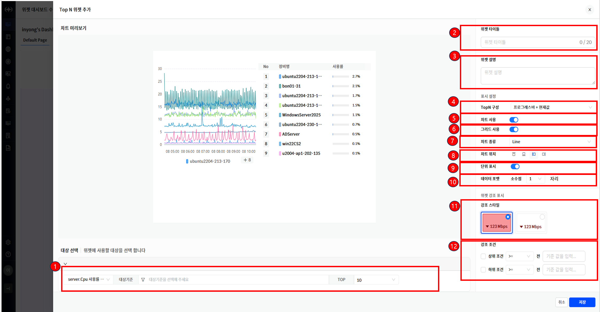

► \[그림19\] TopN 위젯

대상 선택

|           |                       |
| --------- | --------------------- |
| 1\. 지표 선택 | TopN으로 표시할 지표를 선택합니다. |

기본 설정

| 2\. 위젯 타이틀 | 위젯 타이틀을 설정합니다. |
| ---------- | -------------- |
| 3\. 위젯 설명  | 위젯 설명을 설정합니다.  |

표시 설정

| 4\. TopN 구성 | TopN으로 표시할 정보를 설정합니다.           |
| ----------- | ------------------------------- |
| 5\. 차트 사용   | TopN에 추가적으로 차트를 표시할지 여부를 설정합니다. |
| 6\. 그리드 사용  | TopN테이블을 표시할지 여부를 설정합니다.        |
| 7\. 차트 종류   | 차트의 종류를 설정합니다.                  |
| 8\. 차트 위치   | 차트를 표시할 위치를 설정합니다.              |
| 9\. 단위 표시   | 단위 표시여부를 설정합니다.                 |
| 10\. 데이터 포멧 | 표시할 성능 정보의 데이터 포멧을 설정합니다.       |

위젯 강조 표시

| 11\. 강조 스타일 | 강조 스타일을 설정합니다. |
| ----------- | -------------- |
| 12\. 강조 조건  | 강조 조건을 설정합니다.  |

게이지 차트 위젯

선택된 대상의 성능 정보를 게이지 차트로 볼 수 있는 위젯 기능을 제공합니다.

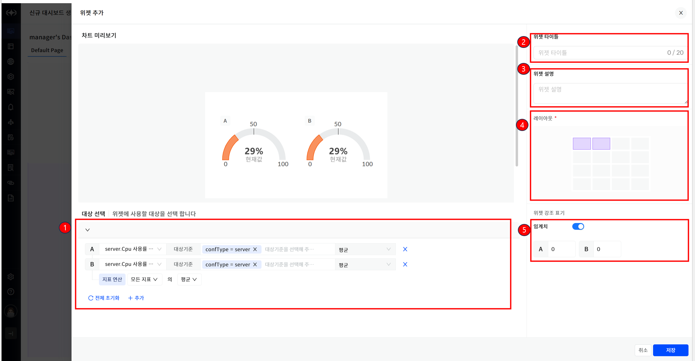

► \[그림20\] 게이지 차트 위젯

대상 선택

|           |                                                        |
| --------- | ------------------------------------------------------ |
| 1\. 지표 선택 | 게이지 차트로 표시할 지표를 선택합니다. \[추가\] 버튼을 클릭하여 다중으로 추가가 가능합니다. |

기본 설정

| 2\. 위젯 타이틀 | 위젯 타이틀을 설정합니다.                                           |
| ---------- | -------------------------------------------------------- |
| 3\. 위젯 설명  | 위젯 설명을 설정합니다.                                            |
| 4\. 레이아웃   | 게이지 차트 위젯을 표현할 레이아웃을 설정합니다. 원하는 곳을 클릭하면 해당 레이아웃으로 설정됩니다. |

위젯 강조 표기

|         |                                                               |
| ------- | ------------------------------------------------------------- |
| 5\. 임계치 | 게이지 차트의 임계치 여부를 설정합니다. 임계치 여부 설정을 True 하면 각 게이지별로 임계치를 설정합니다. |

맵 위젯

선택된 토폴로지 정보를 볼 수 있는 위젯 기능을 제공합니다.

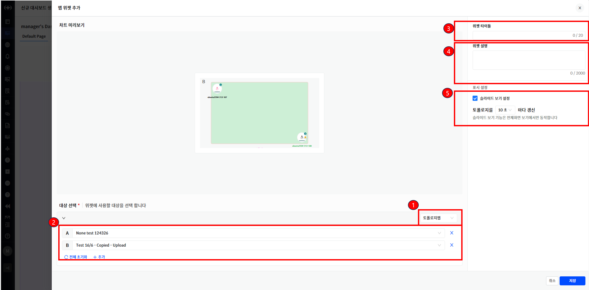

► \[그림21\] 맵 위젯

대상 선택

<table>
<thead>
<tr class="header">
<th>1. 위젯 타입</th>
<th>
위젯 타입을 선택합니다. [토폴로지맵], [네트워크 자동맵], [태그맵], [파드맵], [파드뷰], [서비스맵] 중에 선택할 수 있습니다.

위젯 타입에 따라 선택되는 항목이 다르며 기본 값은 [토폴로지맵] 으로 이미 생성된 토폴로지맵을 선택할 수 있는 대상 선택이 표시됩니다.
</th>
</tr>
</thead>
<tbody>
<tr class="odd">
<td>2. 대상 선택</td>
<td>
초기 화면은 토폴로지맵을 선택할 수 있는 대상 선택이 표시됩니다.

위젯 타입에 따라 선택할 수 있는 대상 선택이 다릅니다.

[토폴로지맵] : 이미 생성된 토폴로지 목록에서 표시합니다. [추가] 버튼을 클릭하여 다중으로 추가가 가능하며 슬라이드 보기가 활성화됩니다.

[서비스맵] : 서비스 맵 타입을 표시합니다. 현재는 [서비스 목록] 만 있으며 생성된 APM의 서비스맵을 왼쪽에 목록으로 표시합니다. 체크 버튼을 이용하여 다중 선택이 가능합니다.

[나머지] : 필터링 할 수 있는 화면이 표시됩니다.
</td>
</tr>
</tbody>
</table>

기본 설정

| 3\. 위젯 타이틀 | 위젯 타이틀을 설정합니다. |
| ---------- | -------------- |
| 4\. 위젯 설명  | 위젯 설명을 설정합니다.  |

표시 설정

|             |                                                                    |
| ----------- | ------------------------------------------------------------------ |
| 5\. 슬라이드 설정 | 슬라이드 보기를 설정합니다. 슬라이드 보기를 설정하지 않고 다중 토폴로지를 선택하면 선택된 토폴로지가 전부 표시됩니다. |

테이블 위젯

테이블 형태의 데이터를 쉽게 확인할 수 있는 위젯 기능을 제공합니다.

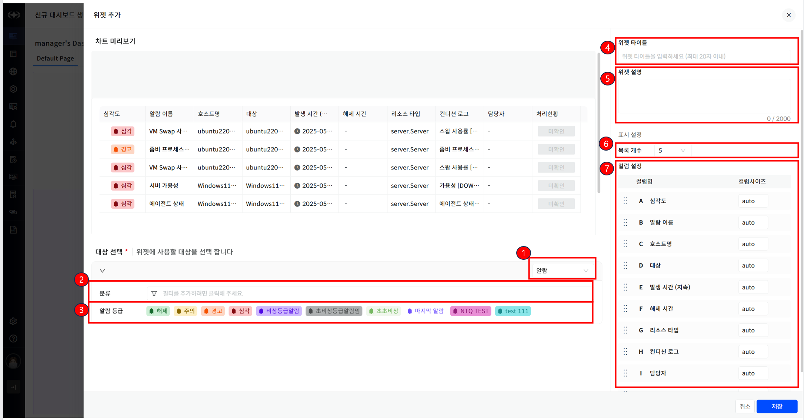

► \[그림22\] 테이블 위젯

대상 선택

| 1\. 위젯 타입 | 위젯 타입을 선택합니다. \[알람\], \[이벤트\], \[관리항목\], \[사용자 정의 항목\] 중에 선택할 수 있습니다. \[관리항목\]과 \[사용자 정의 항목\]을 선택하면 하위 메뉴를 선택할 수 있습니다. |
| --------- | ---------------------------------------------------------------------------------------------------------------------- |
| 2\. 분류    | 대상의 필터를 선택합니다.                                                                                                         |
| 3\. 알람 등급 | 위젯 타입이 \[알람\]일 경우에만 표시가 되며 표시를 원하는 알람 등급을 토글 합니다.                                                                      |

기본 설정

| 4\. 위젯 타이틀 | 위젯 타이틀을 설정합니다. |
| ---------- | -------------- |
| 5\. 위젯 설명  | 위젯 설명을 설정합니다.  |

표시 설정

| 6\. 목록 개수 | 목록에 표시할 개수를 설정합니다.       |
| --------- | ------------------------ |
| 7\. 컬럼 설정 | 컬럼의 위치, 넓이, 표시여부를 설정합니다. |

네트워크 인터페이스 위젯

선택된 네트워크 대상의 인터페이스 정보를 분류별로 볼 수 있는 위젯 기능을 제공합니다. 인터페이스 차트를 제공하여 각각의 정보를 확인할 수 있습니다.

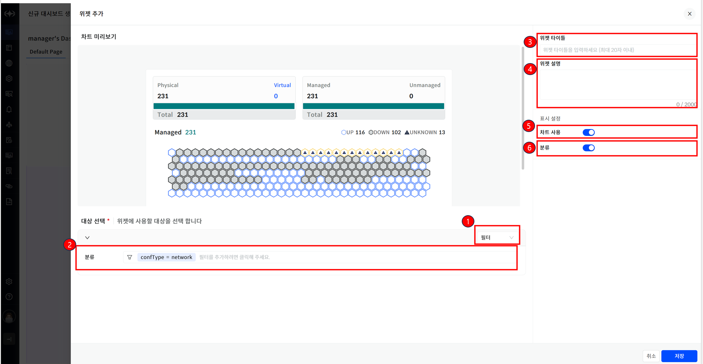

► \[그림23\] 네트워크 인터페이스 위젯

대상 선택

| 1\. 위젯 타입 | 위젯 타입을 선택합니다. \[필터\], \[태그\] 중에 선택할 수 있습니다. |
| --------- | ------------------------------------------- |
| 2\. 분류    | 대상의 필터를 선택합니다.                              |

기본 설정

| 3\. 위젯 타이틀 | 위젯 타이틀을 설정합니다. |
| ---------- | -------------- |
| 4\. 위젯 설명  | 위젯 설명을 설정합니다.  |

표시 설정

| 5\. 차트 사용 | 차트 사용여부를 설정합니다. |
| --------- | --------------- |
| 6\. 분류    | 분류 표시여부를 설정합니다. |

산점도 차트 위젯

지원되는 서비스 선택하여 특정 데이터를 산점도 차트에 표시합니다. 표시되는 데이터는 선택된 서비스에 종속되어 있으며 산점도 차트로 표시하려면 데이터를 소켓 정보로 보내는 기능을 추가해야 합니다.

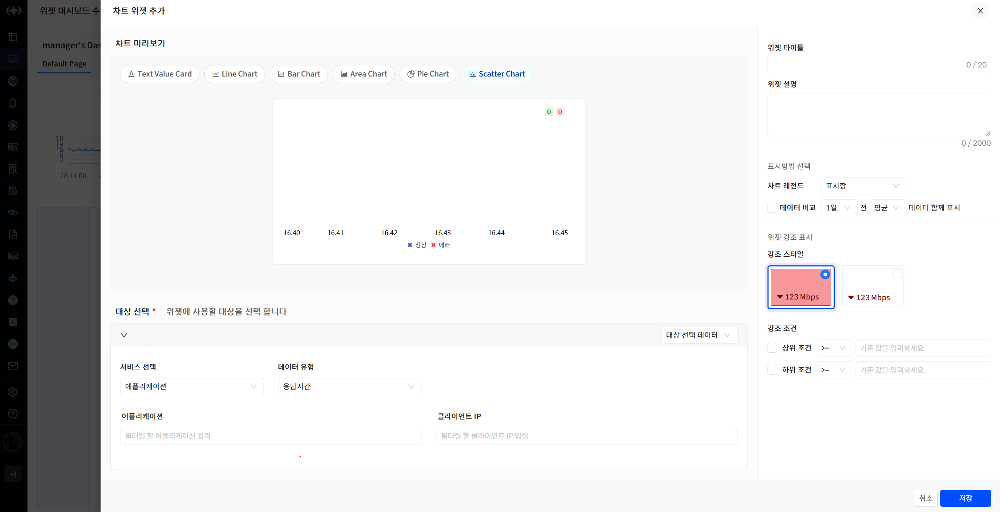

► \[그림24\] 산점도 차트 위젯

대상 선택

| 1\. 대상 타입    | 대상 타입을 선택합니다. \[대상 선택 데이터\] 와 \[개별 선택 데이터\] 가 있으며 \[대상 선택 데이터\]는 대상 선택 기능을 사용할 경우 적용되며, \[개별 선택 데이터\]가 선택되면 대상 선택은 무시됩니다. |
| ------------ | ------------------------------------------------------------------------------------------------------------------------- |
| 2\. 서비스 선택   | 산점도 차트로 표시할 데이터 유형을 선택합니다. 현재는 \[애플리케이션\] 만 지원합니다.                                                                        |
| 3\. 데이터 유형   | 차트에 표시할 데이터를 선택합니다.                                                                                                       |
| 4\. 서비스      | \[애플리케이션\]의 서비스를 선택합니다. \[개별 선택 데이터\]를 선택할 경우에만 표시됩니다.                                                                    |
| 5\. 에이전트     | \[애플리케이션\]의 에이전트를 선택합니다. \[개별 선택 데이터\]를 선택할 경우에만 표시됩니다.                                                                   |
| 6\. 어플리케이션   | 필터링할 어플리케이션을 입력합니다.                                                                                                       |
| 7\. 클라이언트 IP | 필터링할 클라이언트 IP를 입력합니다.                                                                                                     |

기본 설정

| 8\. 위젯 타이틀 | 위젯 타이틀을 설정합니다. |
| ---------- | -------------- |
| 9\. 위젯 설명  | 위젯 설명을 설정합니다.  |

데이터 표시

| 10\. 최소값        | 차트에 표시할 최소값을 설정합니다.             |
| --------------- | ------------------------------- |
| 11\. 최대값        | 차트에 표시할 최대값을 설정합니다.             |
| 12\. 초과 트랜잭션 표시 | 최대값을 초과하는 트랜잭션을 표시할지 여부를 선택합니다. |
| 15\. 에러 표시      | 에러 범례를 표시할지 여부를 선택합니다.          |
| 16\. 툴팁 표시      | 툴팁을 표시할지 여부를 선택합니다.             |
| 17\. 트랜잭션 건수 표시 | 트랜잭션 건수를 표시할지 여부를 선택합니다.        |
| 18\. 표시 기간      | 산점도 차트에 표시할 기간을 선택합니다.          |
| 19\. Y축 시간 간격   | 산점도 차트의 Y축의 간격을 선택합니다.          |
| 20\. 최대 표시 개수   | 산점도 차트에 표시할 최대 개수를 선택합니다.       |
| 21\. 지표 시작 단위   | 산점도 차트에 표시되는 지표의 시작 단위를 선택합니다.  |

스피드 차트 위젯

여러가지 지표를 선택하여 스피드 차트로 데이터를 표시합니다. 각 지표마다 색상을 선택할 수 있으며 OUT에서는 중앙에 선택된 지표의 색상을 표시하여 마치 데이터가 흘러가는 것처럼 표현합니다.

► \[그림25\] 스피드 차트 위젯

대상 선택

| 1\. 대상 타입  | 대상 타입을 선택합니다. \[대상 선택 데이터\] 와 \[개별 선택 데이터\] 가 있으며 \[대상 선택 데이터\]는 대상 선택 기능을 사용할 경우 적용되며, \[개별 선택 데이터\]가 선택되면 대상 선택은 무시됩니다. |
| ---------- | ------------------------------------------------------------------------------------------------------------------------- |
| 2\. 필터     | 대상의 필터를 설정합니다.                                                                                                            |
| 3\. IN 지표  | 스피드 차트에 IN 데이터 지표를 선택합니다.                                                                                                 |
| 4\. 실린더 지표 | 중앙에 표시되는 실린더에 표시할 데이터를 선택합니다.                                                                                             |
| 5\. OUT 지표 | 스피드 차트에 OUT 데이터 지표를 선택합니다.                                                                                                |

기본 설정

| 6\. 위젯 타이틀 | 위젯 타이틀을 설정합니다. |
| ---------- | -------------- |
| 7\. 위젯 설명  | 위젯 설명을 설정합니다.  |

실린더 차트 위젯

여러가지 지표를 선택하여 실린더 차트로 데이터를 표시합니다. 각 지표마다 색상을 선택할 수 있으며 OUT에서는 중앙에 선택된 지표의 색상을 표시하여 마치 데이터가 흘러가는 것처럼 표현합니다.

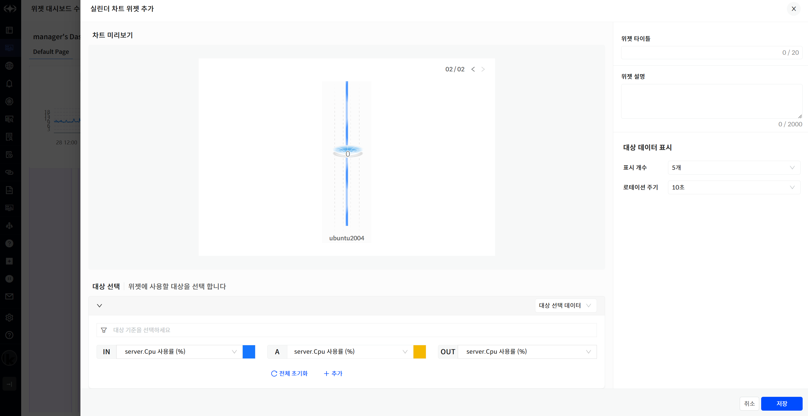

► \[그림26\] 실린더 차트 위젯

대상 선택

| 1\. 대상 타입  | 대상 타입을 선택합니다. \[대상 선택 데이터\] 와 \[개별 선택 데이터\] 가 있으며 \[대상 선택 데이터\]는 대상 선택 기능을 사용할 경우 적용되며, \[개별 선택 데이터\]가 선택되면 대상 선택은 무시됩니다. |
| ---------- | ------------------------------------------------------------------------------------------------------------------------- |
| 2\. 필터     | 대상의 필터를 설정합니다.                                                                                                            |
| 3\. IN 지표  | 실린더 차트에 IN 데이터 지표를 선택합니다.                                                                                                 |
| 4\. 실린더 지표 | 중앙에 표시되는 실린더에 표시할 데이터를 선택합니다.                                                                                             |
| 5\. OUT 지표 | 실린더 차트에 OUT 데이터 지표를 선택합니다.                                                                                                |

기본 설정

| 6\. 위젯 타이틀 | 위젯 타이틀을 설정합니다. |
| ---------- | -------------- |
| 7\. 위젯 설명  | 위젯 설명을 설정합니다.  |

데이터 표시

| 8\. 표시 개수   | 화면에 표시할 실린더 차트 개수를 선택합니다.                              |
| ----------- | ------------------------------------------------------ |
| 9\. 로테이션 주기 | 만약 표시 개수보다 실린더 개수가 많을 경우 자동으로 로테이션 주기에 맞게 로테이션을 실행합니다. |

이퀄라이져 차트 위젯

여러가지 지표를 선택하여 실린더 차트로 데이터를 표시합니다. 각 지표마다 색상을 선택할 수 있으며 OUT에서는 중앙에 선택된 지표의 색상을 표시하여 마치 데이터가 흘러가는 것처럼 표현합니다.

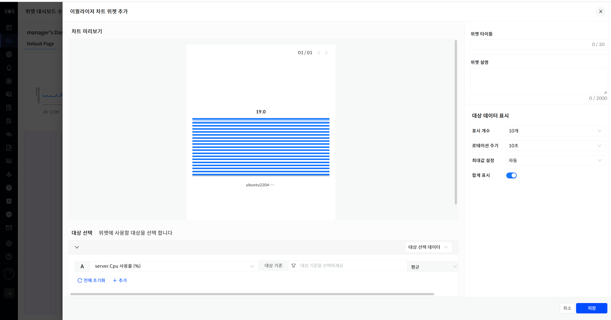

► \[그림27\] 이퀄라이져 차트 위젯

대상 선택

| 1\. 대상 타입 | 대상 타입을 선택합니다. \[대상 선택 데이터\] 와 \[개별 선택 데이터\] 가 있으며 \[대상 선택 데이터\]는 대상 선택 기능을 사용할 경우 적용되며, \[개별 선택 데이터\]가 선택되면 대상 선택은 무시됩니다. |
| --------- | ------------------------------------------------------------------------------------------------------------------------- |
| 2\. 지표 선택 | 이퀄라이져 차트에 표시할 지표를 선택합니다. \[추가\] 버튼을 클릭하여 다중으로 추가가 가능합니다.                                                                  |

기본 설정

| 3\. 위젯 타이틀 | 위젯 타이틀을 설정합니다. |
| ---------- | -------------- |
| 4\. 위젯 설명  | 위젯 설명을 설정합니다.  |

데이터 표시

| 5\. 표시 개수   | 화면에 표시할 이퀄라이져 차트 개수를 선택합니다.                           |
| ----------- | ----------------------------------------------------- |
| 6\. 로테이션 주기 | 만약 표시 개수보다 대상 개수가 많을 경우 자동으로 로테이션 주기에 맞게 로테이션을 실행합니다. |
| 7\. 최대값 설정  | 이퀄라이져가 표시할 최대값을 설정합니다.                                |
| 8\. 합계 표시   | 선택된 지표의 합계를 표시할지 여부를 선택합니다.                           |

완성형 대시보드 생성 방법

템플릿 대시보드를 이용하여 간단한 조작만으로 완성형 대시보드를 생성할 수 있습니다. 완성형 대시보드를 생성할 수 있는 방법은 여러가지가 있으며 \[신규 대시보드 생성\], 템플릿 대시보드 상세에서 \[템플릿 사용\], 템플릿 개별 메뉴에서 \[템플릿으로 대시보드 생성\] 총 3가지의 방법을 제공합니다.

<table>
<tbody>
<tr class="odd">
<td>
노트

[신규 대시보드 생성], [템플릿 사용], [템플릿으로 대시보드 생성] 모두 같은 방법으로 대시보드를 생성하며 3가지 방법마다 차이점은 존재하지 않습니다.
</td>
</tr>
</tbody>
</table>

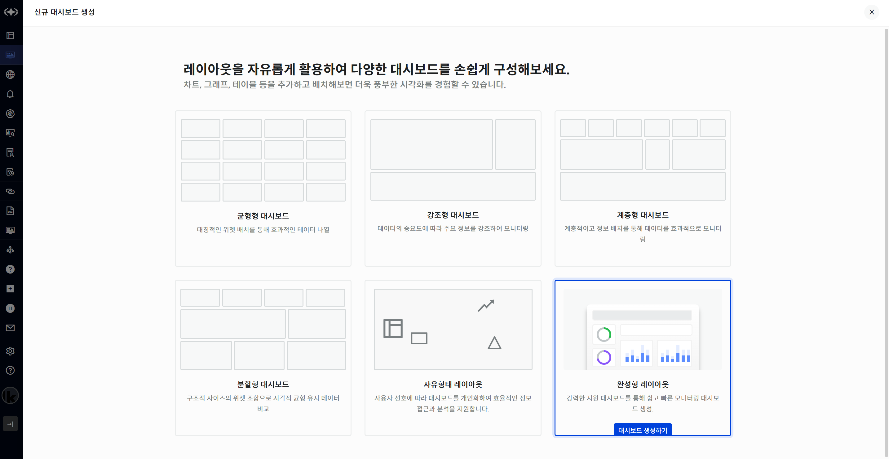

► \[그림28\] 신규 대시보드 생성에서의 완성형 레이아웃

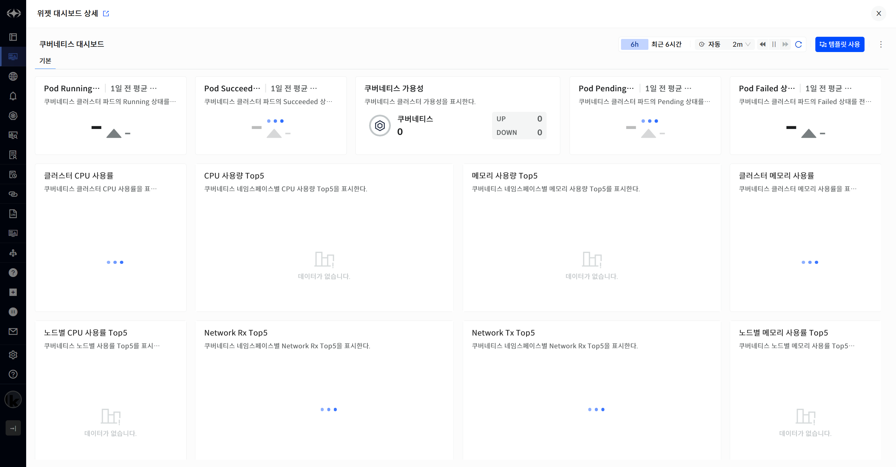

► \[그림29\] 템플릿 상세의 템플릿 사용

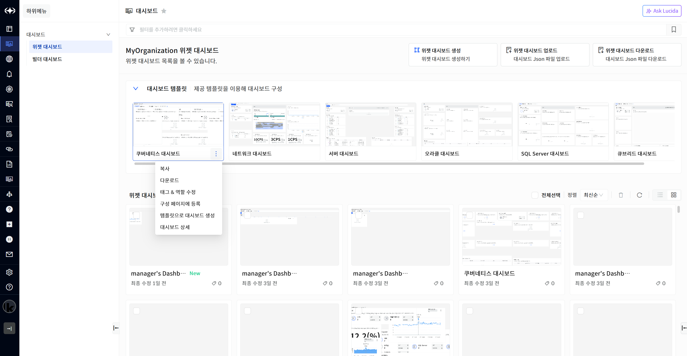

► \[그림30\] 템플릿 개별 메뉴의 템플릿으로 대시보드 생성

완성형 대시보드 생성

완성형 대시보드의 생성은 3개의 STEP로 진행되며 각 STEP 은 간단한 클릭과 확인으로 진행됩니다. STEP 1은 템플릿 선택이며 등록된 템플릿에서 원하는 위젯 대시보드를 선택합니다. STEP 2은 대상 선택이며 특정 대상을 위한 대시보드를 설정할 경우 원하는 대상을 설정하고 다음으로 넘어갑니다. 만약 전체 대상으로 할 경우 대상을 선택하지 않고 다음으로 넘어갑니다. STEP3 은 설정 완료이며 최종적으로 확인할 정보를 표시하며 간단한 스켈레톤 형식의 미리보기를 지원합니다. 이후 \[대시보드 생성\] 을 클릭하면 완성된 위젯 대시보드가 팝업됩니다.

<table>
<tbody>
<tr class="odd">
<td>
노트

템플릿 등록은 시스템으로 등록이 되며 계속적으로 개수를 늘리며 사용자에게 다양성을 제공할 예정입니다.
</td>
</tr>
</tbody>
</table>

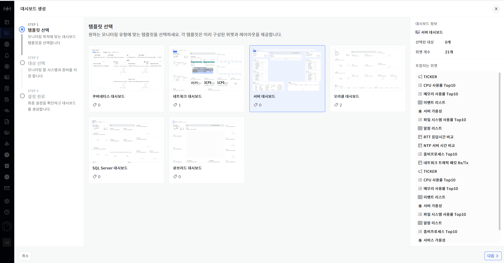

► \[그림31\] 탬플릿 선택

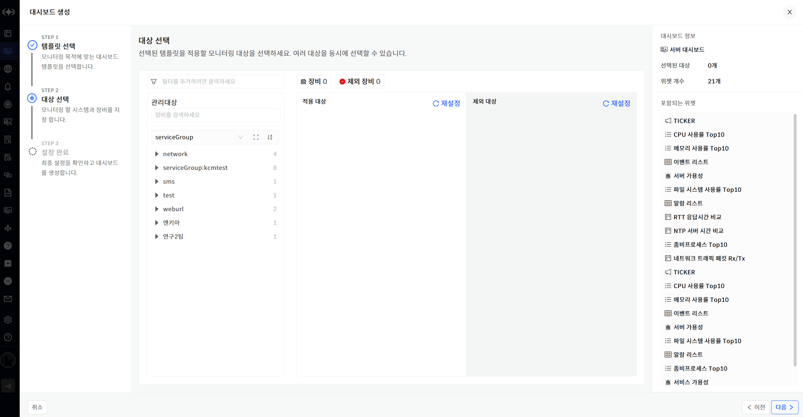

► \[그림32\] 대상 선택

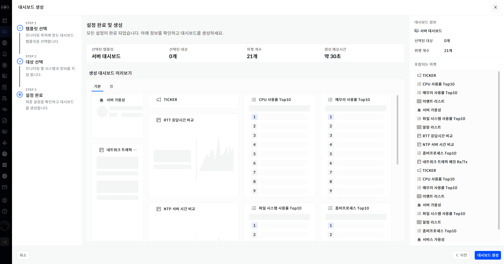

► \[그림33\] 설정 완료

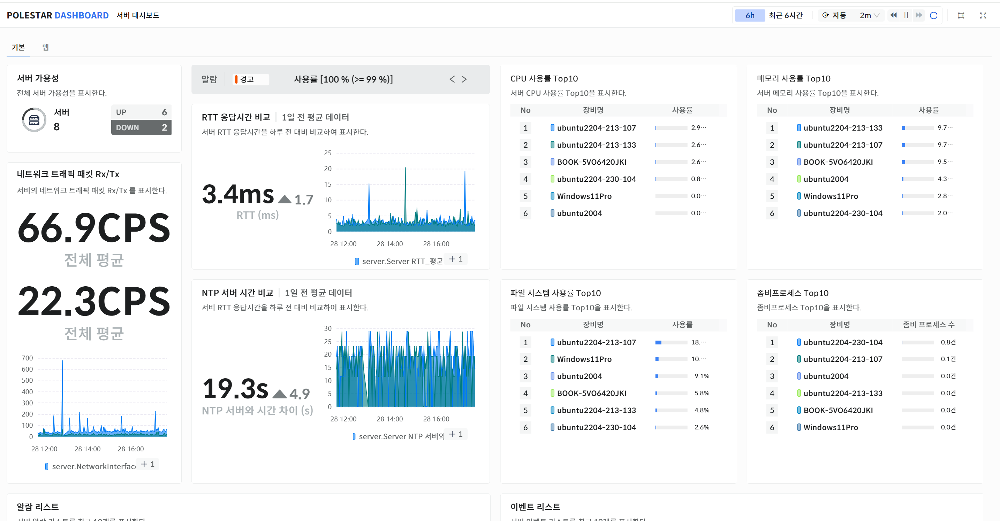

► \[그림34\] 생성된 위젯 대시보드

