자산구성작업 – 자산구성작업 목록

메뉴에서 \[자산구성작업\]을 선택하면, 자산구성작업 항목들을 조회할 수 있는 화면으로 이동되며, 목록 조회 및 신규 등록 또는 정보 수정이 가능합니다.

또한, 선택한 작업분류에 따라 자산이나 구성을 신규 등록하거나 정보 수정이 가능합니다.

<table>
<tbody>
<tr class="odd">
<td>
노트

서비스 카탈로그 분류 트리와 작업목록은, 본인 부서에서 담당하는 카탈로그와 사용권한이 지정된 카탈로그가 적용된 정보만 조회됩니다.

신규등록은 서비스 카탈로그 분류 트리에서 활성화(진한 글자로 표시)된 최하위 항목을 선택한 경우에만 등록 가능하며, [작업상태]가 “저장”이 아닌 작업은, 수정 불가합니다.
</td>
</tr>
</tbody>
</table>

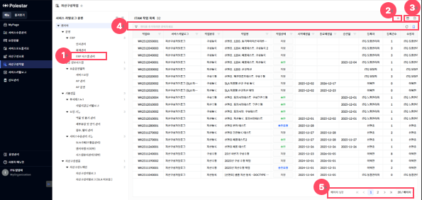

> ▶ \[그림1\] 자산구성작업 목록
> 
> 화면 지표

<table>
<thead>
<tr class="header">
<th>작업ID</th>
<th>자산구성작업의 고유식별 ID 값입니다.</th>
</tr>
</thead>
<tbody>
<tr class="odd">
<td>서비스카탈로그</td>
<td>작업이 등록된 서비스 카탈로그를 표시합니다.</td>
</tr>
<tr class="even">
<td>작업분류</td>
<td>
작업의 분류를 표시합니다.

- 자산등록 : 신규 자산을 등록합니다.

- 자산수정 : 운영 중인 자산을 수정합니다.

- 구성등록 : 신규 구성을 등록합니다.

- 구성수정 : 운영 중인 구성을 수정합니다.
</td>
</tr>
<tr class="odd">
<td>작업명</td>
<td>작업을 식별할 수 있는 명칭입니다.</td>
</tr>
<tr class="even">
<td>작업상태</td>
<td>
작업의 상태를 표시합니다.

각 상태를 변경하는 과정은 후속 내용(자산구성작업 확정, 자산구성작업 승인요청, 자산구성작업 승인, 자산구성작업 반려)을 참고하시기 바랍니다.

- 저장 : 작업정보 수정이 가능하며, 확정 가능한 상태입니다.

- 확정 : 조회만 가능하며, 저장 상태로 되돌리거나, 승인요청 가능한 상태입니다.

- 승인요청 : 조회만 가능하며, 승인/반려 가능한 상태입니다.

- 승인 : 조회만 가능하며, 작업정보가 운영정보에 적용된 상태입니다.

- 반려 : 조회만 가능하며, 저장 상태로 변경 가능한 상태입니다.
</td>
</tr>
<tr class="odd">
<td>시작예정일</td>
<td>
작업을 시작할 계획일자입니다.

표기 : YYYY-MM-DD
</td>
</tr>
<tr class="even">
<td>종료예정일</td>
<td>
작업을 종료할 계획일자입니다.

표기 : YYYY-MM-DD
</td>
</tr>
<tr class="odd">
<td>승인일</td>
<td>
작업이 승인된 일자입니다.

표기 : YYYY-MM-DD
</td>
</tr>
<tr class="even">
<td>등록자</td>
<td>작업을 최초 등록한 사용자 정보입니다.</td>
</tr>
<tr class="odd">
<td>등록건수</td>
<td>작업에 등록된 대상자원(자산 또는 구성)건수를 표시합니다.</td>
</tr>
<tr class="even">
<td>수정자/수정일</td>
<td>작업정보를 마지막으로 수정한 사용자와 그 일자입니다.</td>
</tr>
</tbody>
</table>

> 상세 정보

<table>
<thead>
<tr class="header">
<th>[그림1].”1” 
서비스 카탈로그 분류 트리</th>
<th>화면 좌측의 [서비스 카탈로그 분류] 트리의 항목을 클릭하면, 선택한 분류에 해당되는 서비스 카탈로그의 작업 목록을 조회할 수 있습니다.</th>
</tr>
</thead>
<tbody>
<tr class="odd">
<td>[그림1].”2” 
등록 버튼</td>
<td>화면 좌측의 [서비스 카탈로그 분류] 트리에서 최하위 항목을 선택한 후, 화면 우측 상단의 등록 버튼을 클릭하면, 작업을 등록할 수 있는 등록 화면(드로어)이 열립니다.</td>
</tr>
<tr class="even">
<td>[그림1].”3” 
컬럼수정 &amp; 엑셀저장 버튼</td>
<td>표시할 컬럼을 선택하거나 숨길 수 있는 설정 기능을 제공하는 컬럼수정 버튼과, 현재 화면에 표시된 데이터를 엑셀파일로 다운로드 하는 기능을 제공하는 엑셀저장 버튼입니다.</td>
</tr>
<tr class="odd">
<td>[그림1].”4” 
그리드 필터</td>
<td>그리드 필터는 상단 행(필터 행)을 통해 각 컬럼 단위로 상세한 조건 검색이 가능하며, 자주 사용하는 필터 조건을 즐겨 찾기로 저장하여 빠르게 적용할 수 있습니다.</td>
</tr>
<tr class="even">
<td>[그림1].”5” 
페이징</td>
<td>목록 데이터를 구간별로 나누어 페이지 단위로 조회할 수 있도록 도와주는 기능입니다.</td>
</tr>
</tbody>
</table>

자산구성작업 등록

화면 좌측의 \[서비스 카탈로그 분류\] 트리에서, 자산구성작업을 등록하고자 하는 최하위 항목(서비스 카탈로그)을 선택한 후, 등록 버튼(\[그림1\].”2”)을 클릭하면, 등록 화면(드로어)이 열립니다.

<table>
<tbody>
<tr class="odd">
<td>
노트

작업의 경우 등록 시 작업ID가 자동으로 채번되며, 상태는 ‘저장’ 상태로 고정됩니다.

서비스 카탈로그 분류 트리에서 글자색이 옅게 표시된 항목은, 신규등록이 불가한 항목입니다.

작업이 등록될 카탈로그의 상태가 “사용”, ”일시정지” 상태만 저장이 가능합니다.
</td>
</tr>
</tbody>
</table>

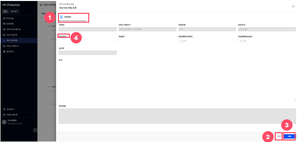

▶ \[그림2\] 자산구성작업 등록 화면(드로어)

> 화면 지표

<table>
<thead>
<tr class="header">
<th>작업ID</th>
<th>자산구성작업의 고유식별 ID 값입니다. 최초 저장 시 자동으로 채번됩니다.</th>
</tr>
</thead>
<tbody>
<tr class="odd">
<td>서비스카탈로그</td>
<td>자산구성작업이 등록되는 서비스카탈로그 정보로, 목록 화면에서 선택한 [서비스 카탈로그 트리]의 항목이 자동으로 입력됩니다.</td>
</tr>
<tr class="even">
<td>작업상태</td>
<td>
작업의 상태를 표시합니다.

각 상태를 변경하는 과정은 후속 내용(자산구성작업 확정, 자산구성작업 승인요청, 자산구성작업 승인, 자산구성작업 반려)을 참고하시기 바랍니다.

- 저장 : 작업정보 수정이 가능하며, 확정 가능한 상태입니다.

- 확정 : 조회만 가능하며, 저장 상태로 되돌리거나, 승인요청 가능한 상태입니다.

- 승인요청 : 조회만 가능하며, 승인 또는 반려 가능한 상태입니다.

- 승인 : 조회만 가능하며, 작업정보가 운영정보에 적용된 상태입니다.

- 반려 : 조회만 가능하며, 저장 상태로 변경 가능한 상태입니다.
</td>
</tr>
<tr class="odd">
<td>담당부서</td>
<td>작업을 등록한 사용자의 부서입니다. 최초 저장 시 자동으로 입력됩니다.</td>
</tr>
<tr class="even">
<td>작업분류</td>
<td>
작업의 분류를 표시합니다.

- 자산등록 : 신규 자산을 등록합니다.

- 자산수정 : 운영 중인 자산을 수정합니다.

- 구성등록 : 신규 구성을 등록합니다.

- 구성수정 : 운영 중인 구성을 수정합니다.
</td>
</tr>
<tr class="odd">
<td>작업명</td>
<td>작업을 식별할 수 있는 명칭입니다.</td>
</tr>
<tr class="even">
<td>작업계획시작일자</td>
<td>
작업을 시작할 계획일자입니다.

종료일자보다 늦을 수 없습니다.
</td>
</tr>
<tr class="odd">
<td>작업계획종료일자</td>
<td>
작업을 종료할 계획일자입니다.

시작일자보다 빠를 수 없습니다.
</td>
</tr>
<tr class="even">
<td>승인자</td>
<td>
작업을 승인한 사용자입니다.

자산 또는 구성 작업 승인 시, 승인한 사용자의 정보가 자동으로 입력됩니다.
</td>
</tr>
<tr class="odd">
<td>비고</td>
<td>작업의 비고사항입니다. 작업에 대한 특이사항이나 메모를 남길 수 있습니다.</td>
</tr>
<tr class="even">
<td>반려내용</td>
<td>작업 승인요청단계에서 작업 반려 시 입력한 사유가 표시됩니다.</td>
</tr>
</tbody>
</table>

> 상세 정보

<table>
<tbody>
<tr class="odd">
<td>
노트

작업정보 탭 영역의 [작업자산] 탭은 작업분류가 자산등록, 자산수정인 경우에만 표시하며, [작업구성] 탭은 구성등록, 구성수정인 경우에만 표시합니다.

취소 버튼으로 상세 화면(드로어)을 닫을 때, 이미 작업분류를 선택하여 저장한 경우, 해당 작업정보는 자동으로 삭제하지 않습니다.
</td>
</tr>
</tbody>
</table>

<table>
<thead>
<tr class="header">
<th>[그림2].”1” 
작업정보 탭</th>
<th>
작업분류에 따라, 작업정보 탭을 표시합니다. 
- 작업정보 : 작업에 대한 상세정보를 표시합니다.

- 작업자산 : 신규 자산이나 수정할 운영 자산을 표시합니다.

- 작업구성 : 신규 구성이나 수정할 운영 구성을 표시합니다.
</th>
</tr>
</thead>
<tbody>
<tr class="odd">
<td>[그림2].”2” 
취소 버튼</td>
<td>변경된 사항을 저장하지 않고, 상세 화면(드로어)을 닫습니다.</td>
</tr>
<tr class="even">
<td>[그림2].”3” 
저장 버튼</td>
<td>저장 버튼 클릭을 통해 자산구성작업 저장이 가능합니다.</td>
</tr>
</tbody>
</table>

> 자산구성작업 등록 절차

1.  목록 화면의 \[서비스 카탈로그 분류\]트리(\[그림1\].”1”\])에서 등록하고자 하는 최하위 항목(서비스 카탈로그)을 선택합니다.

2.  목록에서 등록 버튼(\[그림1\].“2”)을 클릭합니다.

3.  작업정보의 필수 항목(\[그림2\].”4”와 같이 \[  \]모양의 표식이 되어있는 항목)을 입력합니다.

4.  화면 우측 하단의 \[저장\]버튼을 클릭합니다.

자산구성작업 수정

목록에서 \[저장\] 상태의 작업(작업ID, 작업분류, 작업명)을 클릭하면, 수정이 가능한 상세화면(드로어)이 열립니다.

<table>
<tbody>
<tr class="odd">
<td>
노트

작업 상태가 “저장”, “반려”인 경우에만 수정 가능하며, “확정” 상태에서 저장 버튼을 클릭하면, “저장” 상태로 변경 가능합니다.

작업이 등록된 카탈로그의 상태가 “사용”, ”일시정지” 상태만 저장이 가능합니다.
</td>
</tr>
</tbody>
</table>

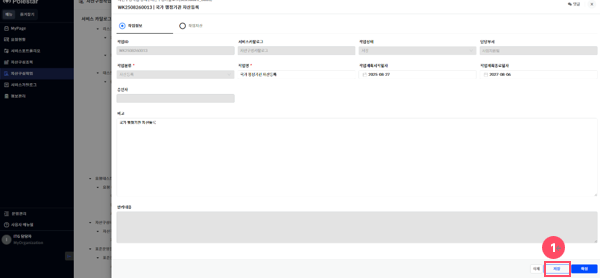

▶ \[그림3\] 자산구성작업 상세화면(드로어)

> 화면 지표

\[그림2\]의 화면지표와 동일한 내용입니다.

> 상세 정보

<table>
<tbody>
<tr class="odd">
<td>[그림3].”1” 
저장 버튼</td>
<td>저장 버튼 클릭을 통해 자산구성작업 저장이 가능합니다.</td>
</tr>
</tbody>
</table>

자산구성작업 삭제

목록에서 \[저장\] 상태의 작업(작업ID, 작업분류, 작업명)을 클릭하면, 삭제 가능한 상세화면(드로어)이 열립니다.

<table>
<tbody>
<tr class="odd">
<td>
노트

작업 상태가 “저장”인 경우에만 삭제 가능하며, 작업 삭제 시 해당 작업정보와 작업자산/구성이 모두 삭제됩니다.
</td>
</tr>
</tbody>
</table>

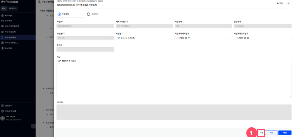

▶ \[그림4\] 자산구성작업 상세화면(드로어)

> 화면 지표

\[그림2\]의 화면지표와 동일한 내용입니다.

> 상세 정보

<table>
<tbody>
<tr class="odd">
<td>[그림4].”1” 
삭제 버튼</td>
<td>삭제 버튼 클릭을 통해 자산구성작업 삭제가 가능합니다.</td>
</tr>
</tbody>
</table>

자산구성작업 확정

목록에서 \[저장\] 상태의 작업(작업ID, 작업분류, 작업명)을 클릭하면, 확정 가능한 상세화면(드로어)이 열립니다.

<table>
<tbody>
<tr class="odd">
<td>
노트

구성 등록과, 구성 수정 작업의 경우, 확정 버튼 클릭 시, 작업구성과 연관된 자원(상위자산, 상위구성, 연관구성, 클러스터상위구성)이 작업 중이 아닌 운영자원인지 여부를 판별하는 검증을 진행합니다.

검증에 통과하지 못한 경우, 검증 실패 메시지를 표시하며, 확정불가사유화면(드로어)이 열립니다.

확정 버튼을 클릭하면, 작업상태가 [확정]으로 변경되며, 작업정보 수정, 자산/구성 신규 등록, 정보 수정, 정보 삭제 불가합니다.

작업이 등록된 카탈로그의 상태가 “사용”, ”일시정지” 상태만 확정이 가능합니다.
</td>
</tr>
</tbody>
</table>

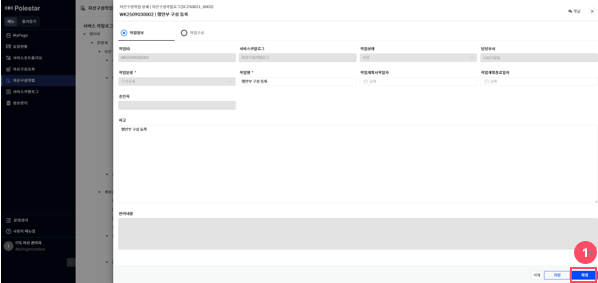

▶ \[그림5\] 자산구성작업 상세화면(드로어)

> 화면 지표(자산구성작업 상세)

\[그림2\]의 화면지표와 동일한 내용입니다.

> 상세 정보

<table>
<tbody>
<tr class="odd">
<td>[그림5].”1” 
확정 버튼</td>
<td>작업 상태를 [확정]으로 변경합니다.</td>
</tr>
</tbody>
</table>

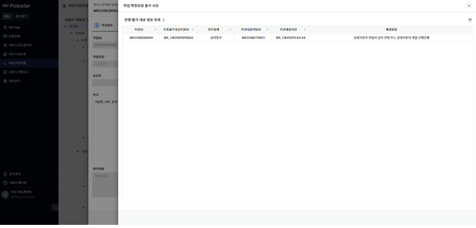

▶ \[그림6\] 자산구성작업 확정불가사유 화면(드로어)

> 화면 지표(확정불가사유)

<table>
<thead>
<tr class="header">
<th>작업ID</th>
<th>자산구성작업의 고유식별 ID 값입니다.</th>
</tr>
</thead>
<tbody>
<tr class="odd">
<td>진행불가대상자원ID</td>
<td>확정이 불가한 작업자산/구성 고유식별 ID 값을 표시합니다.</td>
</tr>
<tr class="even">
<td>연관형태</td>
<td>
확정이 불가한 사유 항목을 표시합니다.

- 상위정보 : 상위정보(상위자산, 상위구성, 클러스터상위정보)가 작업 중, 관련 작업의 카탈로그 상태가 조건에 만족하지 않거나, 운영자원으로 아직 이관되지 않은 경우입니다.

- 연계정보 : 연관구성이 작업 중, 관련 작업의 카탈로그 상태가 조건에 만족하지 않거나, 운영자원으로 아직 이관되지 않은 경우입니다.
</td>
</tr>
<tr class="odd">
<td>연관대상작업ID</td>
<td>확정이 불가한 자산구성작업의 고유식별 ID 값을 표시합니다.</td>
</tr>
<tr class="even">
<td>연관대상자원</td>
<td>확정 불가 원인이 되는 자원(상위자산, 상위구성, 클러스터상위정보, 연관구성)의 고유식별 ID 값을 표시합니다.</td>
</tr>
<tr class="odd">
<td>해결방법</td>
<td>확정 불가 사유를 해결 가능한 방법을 표시합니다.</td>
</tr>
</tbody>
</table>

<table>
<tbody>
<tr class="odd">
<td>
노트

작업정보 등록은 "자산구성작업 등록" 내용 참고바라며, 작업자산/구성 신규등록, 정보수정은 다음 내용을 참고바랍니다.

- 작업자산 등록 : 작업분류가 [자산등록]인 경우, “자산구성작업 자산 단건등록”, “자산구성작업 자산 일괄등록”을, [자산수정]인 경우, “자산구성작업 자산수정 대상추가”를 참고하시기 바랍니다.

- 작업자산 수정 : “자산구성작업 자산 일괄수정”을 참고하시기 바랍니다.

- 작업구성 등록 : 작업분류가 [구성등록]인 경우, “자산구성작업 구성 단건등록”, “자산구성작업 구성 일괄등록”을, [구성수정]인 경우, “자산구성작업 구성수정 대상추가”를 참고하시기 바랍니다.

- 작업구성 수정 : “자산구성작업 구성 일괄수정”을 참고하시기 바랍니다.
</td>
</tr>
</tbody>
</table>

> 자산구성작업 확정 절차

1.  작업정보 등록 및 작업자산/구성 신규등록, 정보 수정 후 \[저장\]합니다.

2.  확정 버튼(\[그림5\].”1”)을 클릭합니다.

3.  작업분류에 따라 검증이 진행됩니다.

4.  검증에 통과한 경우, 작업상태가 \[확정\]으로 변경됩니다.

5.  검증을 통과하지 못한 경우, 실패메시지 또는 확정불가사유 화면(드로어)이 표시됩니다.

6.  확정 불가 사유를 해결한 후, 자산구성작업 확정 절차 “2.”부터 다시 진행합니다.

자산구성작업 승인요청

목록에서 \[확정\] 상태의 작업(작업ID, 작업분류, 작업명)을 클릭하면, 승인요청 가능한 상세화면(드로어)이 열립니다.

<table>
<tbody>
<tr class="odd">
<td>
노트

[확정] 상태인 작업만 승인요청이 가능하며, 작업정보나 작업자산/구성은 조회만 가능합니다.

저장 버튼을 클릭하여, [저장] 상태로 되돌리면, 작업정보 수정, 작업자산/구성 신규등록, 정보 수정, 정보 삭제가 가능합니다.

작업이 등록된 카탈로그의 상태가 “사용”, ”일시정지” 상태만 승인요청이 가능합니다.
</td>
</tr>
</tbody>
</table>

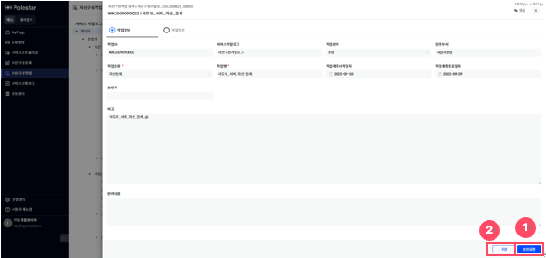

▶ \[그림7\] 자산구성작업 확정상태 화면(드로어)

> 화면 지표

\[그림2\]의 화면지표와 동일한 내용입니다.

> 상세 정보

<table>
<thead>
<tr class="header">
<th>[그림7].”1” 
승인요청 버튼</th>
<th>작업상태를 [승인요청]으로 변경합니다.</th>
</tr>
</thead>
<tbody>
<tr class="odd">
<td>[그림7].”2” 
저장 버튼</td>
<td>작업상태를 [저장]으로 변경합니다.</td>
</tr>
</tbody>
</table>

> 자산구성작업 승인요청 절차

1.  승인 요청할 작업 정보와 작업자산/구성을 검토합니다.

2.  승인요청 버튼(\[그림7\].“1” )을 클릭합니다.

자산구성작업 승인

목록에서 \[승인요청\] 상태의 작업(작업ID, 작업분류, 작업명)을 클릭하면, 승인 가능한 상세화면(드로어)이 열립니다.

<table>
<tbody>
<tr class="odd">
<td>
노트

작업이 승인된 후, [자산구성조회] 메뉴에서, 작업을 통해 신규 등록하거나 정보를 수정한 자산/구성 항목들에 대한 조회가 가능합니다.

수정 작업(자산수정, 구성수정)을 승인하는 경우, 작업이 등록된 서비스카탈로그 정보를 자산/구성 연관서비스(추가정보)에 추가합니다.

작업이 등록된 카탈로그의 상태가 “사용”, ”일시정지” 상태만 승인이 가능합니다.
</td>
</tr>
</tbody>
</table>

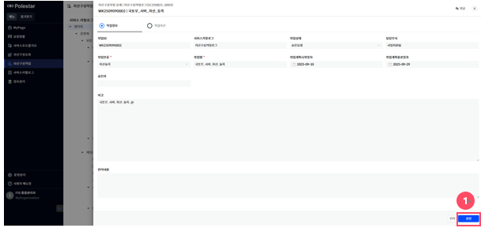

▶ \[그림8\] 자산구성작업 승인요청상태 화면(드로어)

> 화면 지표

\[그림2\]의 화면지표와 동일한 내용입니다.

> 상세 정보

<table>
<tbody>
<tr class="odd">
<td>[그림8].”1” 
승인 버튼</td>
<td>작업상태를 [승인]으로 변경합니다.</td>
</tr>
</tbody>
</table>

> 자산구성작업 승인 절차

1.  승인할 작업 정보와 작업자산/구성을 검토합니다.

2.  승인 버튼(\[그림8\].“1” )을 클릭합니다.

자산구성작업 반려

자산구성작업 승인요청상태 화면(\[그림8\])에서, 작업상태를 \[반려\]로 변경 가능합니다.

<table>
<tbody>
<tr class="odd">
<td>
노트

작업이 등록된 카탈로그의 상태가 “사용”, ”일시정지” 상태만 반려가 가능합니다.
</td>
</tr>
</tbody>
</table>

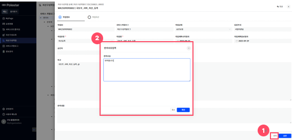

▶ \[그림9\] 자산구성작업 반려사유입력 화면(팝업)

> 화면 지표(반려사유입력)

|      |                 |
| ---- | --------------- |
| 반려사유 | 작업이 반려되는 사유입니다. |

> 상세 정보(반려사유입력)

<table>
<thead>
<tr class="header">
<th>[그림9].”1” 
반려 버튼</th>
<th>반려 버튼 클릭 시 반려내용을 입력하는 화면(팝업)이 열립니다.</th>
</tr>
</thead>
<tbody>
<tr class="odd">
<td>[그림9].”2” 
반려사유 입력</td>
<td>[반려사유] 작성 후, 반려사유입력 화면 하단의 [확인] 버튼 클릭을 클릭하면, 작업상태를 [반려]로 변경합니다.</td>
</tr>
</tbody>
</table>

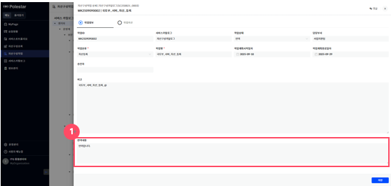

▶ \[그림10\] 자산구성작업 반려상태 화면(드로어)

> 화면 지표(자산구성작업 상세)

\[그림2\]의 화면지표와 동일한 내용입니다.

> 상세 정보 (자산구성작업 상세)

<table>
<tbody>
<tr class="odd">
<td>[그림10].”1” 
반려 내용</td>
<td>작업의 반려사유를 표시합니다.</td>
</tr>
</tbody>
</table>

> 자산구성작업 반려 절차

1.  반려 버튼(\[그림9\].”1”)을 클릭합니다

2.  반려사유(\[그림9\].“2“)를 작성합니다.

3.  화면(팝업) 우측 하단의 \[확인\]버튼을 클릭합니다.

자산구성작업등록 댓글&히스토리

댓글기능을 통하여 자산구성작업의 댓글&히스토리 내역을 확인할 수 있습니다.

<table>
<tbody>
<tr class="odd">
<td>
노트

사용자가 등록한 댓글은 대 댓글, 수정, 삭제가 가능합니다.

히스토리 댓글은 대 댓글, 이력상세보기가 가능합니다.

[저장]단계 이후 댓글 입력 및 확인할 수 있습니다.

[댓글] 기능 사용법은 [서비스 포트폴리오 &gt; 그림 8 &gt; 댓글 &amp; 히스토리] 매뉴얼을 참조하시기 바랍니다.
</td>
</tr>
</tbody>
</table>

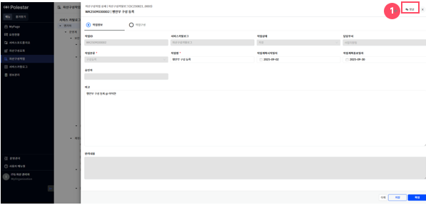

> ▶ \[그림11\] 자산구성작업 상세화면(드로어)

자산구성작업 - 작업자산

목록에서 작업분류가 \[자산등록\], \[자산수정\]인 작업(작업ID, 작업분류, 작업명)을 클릭하면, \[작업자산\] 탭(목록 조회 및 신규등록, 정보수정, 정보삭제 가능)을 표시하는 상세화면(드로어)이 열립니다.

<table>
<tbody>
<tr class="odd">
<td>
노트

작업자산 신규등록, 정보수정, 정보삭제는 작업상태가 [저장]인 경우에만 가능합니다.

작업자산 단건등록([그림12].“3“), 일괄등록([그림12].“4“), 일괄수정([그림12].“5“) 버튼은, 자산분류체계 트리([그림12].“1“)에서 최하위 항목을 선택한 경우에만 표시합니다.

단건등록([그림12].“3“), 일괄등록([그림12].“4“) 버튼은, 작업분류가 [자산등록]인 경우에만 표시하며, 대상추가([그림18].“1“) 버튼은, 작업분류가 [자산수정]인 경우에만 표시합니다.
</td>
</tr>
</tbody>
</table>

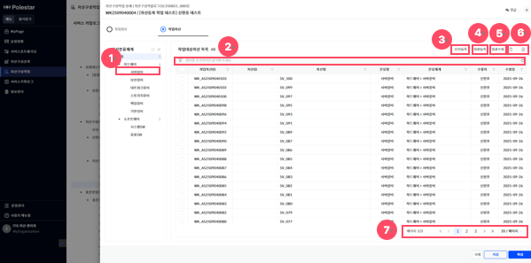

> ▶ \[그림12\] 자산구성작업 상세화면 – 자산등록 작업자산(탭)
> 
> 화면 지표

<table>
<thead>
<tr class="header">
<th>작업자산ID</th>
<th>작업자산의 고유식별 ID 값입니다.</th>
</tr>
</thead>
<tbody>
<tr class="odd">
<td>자산ID</td>
<td>
운영자산의 고유식별ID 값입니다.

[자산등록] 작업은 [승인] 상태일 경우에만 값을 표시하며, [자산수정] 작업은 항상 값을 표시합니다.
</td>
</tr>
<tr class="even">
<td>자산명</td>
<td>자산을 식별할 수 있는 명칭입니다.</td>
</tr>
<tr class="odd">
<td>분류명</td>
<td>자산의 분류를 식별할 수 있는 명칭입니다.</td>
</tr>
<tr class="even">
<td>분류체계</td>
<td>자산의 분류 체계명을 계층적으로 표시합니다.</td>
</tr>
<tr class="odd">
<td>수정자/수정일</td>
<td>작업자산을 마지막으로 수정한 사용자와 그 일자입니다.</td>
</tr>
</tbody>
</table>

> 상세 정보

<table>
<thead>
<tr class="header">
<th>[그림12].”1” 
자산분류체계 트리</th>
<th>자산분류체계 트리의 항목을 클릭하면, 분류에 해당되는 작업자산 목록 조회가 가능합니다.</th>
</tr>
</thead>
<tbody>
<tr class="odd">
<td>[그림12].”2” 
그리드 필터</td>
<td>그리드 필터는 상단 행(필터 행)을 통해 각 컬럼 단위로 상세한 조건 검색이 가능한 기능입니다.</td>
</tr>
<tr class="even">
<td>[그림12].”3” 
단건등록 버튼</td>
<td>작업자산 개별 등록 기능을 제공하며, 버튼을 클릭하면, 자산 등록화면(드로어)이 열립니다.</td>
</tr>
<tr class="odd">
<td>[그림12].”4” 
일괄등록 버튼</td>
<td>엑셀 업로드를 통한 작업자산 일괄 등록 기능을 제공하며, 버튼을 클릭하면, 템플릿 일괄등록 화면(드로어)이 열립니다.</td>
</tr>
<tr class="even">
<td>[그림12].”5” 
일괄수정 버튼</td>
<td>엑셀 업로드를 통한 작업자산 일괄 수정 기능을 제공하며, 버튼을 클릭하면, 템플릿 일괄수정 화면(드로어)이 열립니다.</td>
</tr>
<tr class="odd">
<td>[그림12].”6” 
삭제 버튼 &amp; 엑셀저장 버튼</td>
<td>[작업자산 목록]의 선택된 대상을 삭제하는 버튼과, 현재 화면에 표시된 데이터를 엑셀파일로 다운로드 하는 기능을 제공하는 엑셀저장 버튼입니다.</td>
</tr>
<tr class="even">
<td>[그림12].”7” 
페이징</td>
<td>목록 데이터를 구간별로 나누어 페이지 단위로 조회할 수 있도록 도와주는 기능입니다.</td>
</tr>
</tbody>
</table>

자산구성작업 - 자산 단건등록

작업자산(탭)(\[그림12\])에서, 단건등록 버튼(\[그림12\].“3“)을 클릭하면, 자산 등록화면(드로어)이 열립니다.

<table>
<tbody>
<tr class="odd">
<td>
노트

등록화면(드로어)에 표시되는 항목은, 자산분류체계별로 다를 수 있습니다.
</td>
</tr>
</tbody>
</table>

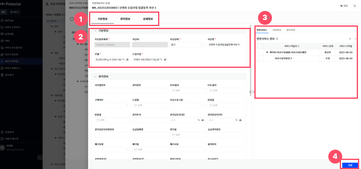

> ▶ \[그림13\] 자산구성작업 자산등록 단건등록 화면(드로어)
> 
> 화면 지표(기본정보)

자산을 관리하기 위한 최소한의 기본정보를 표시합니다.

<table>
<thead>
<tr class="header">
<th>자산분류체계</th>
<th>자산이 속한 자산분류체계로, 분류명을 계층적으로 표시합니다.</th>
</tr>
</thead>
<tbody>
<tr class="odd">
<td>자산ID</td>
<td>자산 고유식별을 위한 ID 값입니다.</td>
</tr>
<tr class="even">
<td>자산상태</td>
<td>
자산의 관리 상태를 표시합니다.

- 입고 : 사용 준비 중인 상태입니다.

- 운영 : 시스템에 할당하여 사용 중인 상태입니다.

- 보류 : 일시적으로 사용하지 않는 상태입니다.

- 폐기 : 불필요하여 처분을 완료한 상태입니다.
</td>
</tr>
<tr class="odd">
<td>자산명</td>
<td>자산을 식별할 수 있는 명칭입니다.</td>
</tr>
<tr class="even">
<td>모델</td>
<td>자산의 모델명을 표시합니다.</td>
</tr>
<tr class="odd">
<td>도입사업</td>
<td>자산의 도입사업을 표시합니다.</td>
</tr>
</tbody>
</table>

> 화면 지표(관리정보, 상세정보)

자산분류체계별로 정의한 관리정보, 상세정보를 표시합니다.

> 화면 지표(추가정보(탭))

자산분류체계별로 정의한 추가정보(탭)를 표시합니다.

| 연관서비스 | 자산이 과거에 사용되었거나, 현재 사용되고 있는 서비스도메인과 서비스카탈로그 목록을 계층적을 표시합니다. |
| ----- | ---------------------------------------------------------- |
| 작업파일  | 자산 등록, 수정 등의 작업에 대한 이력을 표시합니다.                             |
| 첨부파일  | 자산정보에 등록된 첨부파일을 표시합니다.                                     |
| 연관요청  | 자산과 연관된 요청 목록을 표시합니다.                                      |

> 상세 정보

<table>
<thead>
<tr class="header">
<th>[그림13].”1” 
기본정보 버튼</th>
<th>클릭을 통해 기본정보가 위치한 부분([그림13].”2”)으로 이동합니다.</th>
</tr>
</thead>
<tbody>
<tr class="odd">
<td>[그림13].”2” 
자산정보</td>
<td>자산분류체계별로 정의한 관리정보, 상세정보를 표시합니다.</td>
</tr>
<tr class="even">
<td>[그림13].”3” 
추가정보</td>
<td>자산분류체계별로 정의한 추가정보(탭)를 표시합니다. 탭을 클릭하여, 각 추가정보 조회, 입력, 수정이 가능합니다.</td>
</tr>
<tr class="odd">
<td>[그림13].”4” 
저장 버튼</td>
<td>입력한 자산정보를 저장합니다.</td>
</tr>
</tbody>
</table>

> 자산구성작업 자산 단건등록 진행 절차

1.  작업자산(탭)(\[그림12\])에서 단건등록 버튼(\[그림12\].”3”)을 클릭합니다.

2.  등록화면(\[그림13\])의 필수 항목(\[그림13\].”5”와 같이 \[  \]모양의 표식이 되어있는 항목)을 입력합니다

3.  화면 우측 하단의 \[저장\]버튼을 클릭합니다.

자산구성작업 - 자산 일괄등록

작업자산(탭)(\[그림12\])에서, 일괄등록 버튼(\[그림12\].“4“)을 클릭하면, 자산 일괄등록이 가능한 상세화면(드로어)이 열립니다.

<table>
<tbody>
<tr class="odd">
<td>
노트

자산분류별로 제공하는 엑셀 템플릿을 업로드하여, 자산 일괄 등록이 가능하며, [검증]버튼을 클릭하여, 업로드한 자산 정보 검증이 가능합니다.
</td>
</tr>
</tbody>
</table>

<table>
<tbody>
<tr class="odd">
<td>
주의

다운로드 받은 템플릿은 재활용 가능하나, 특정사유(정책 및 관리항목 정보 변경)에 의해 자산 항목들이 변경될 수 있으므로, 템플릿 최신화에 주의가 필요합니다.
</td>
</tr>
</tbody>
</table>

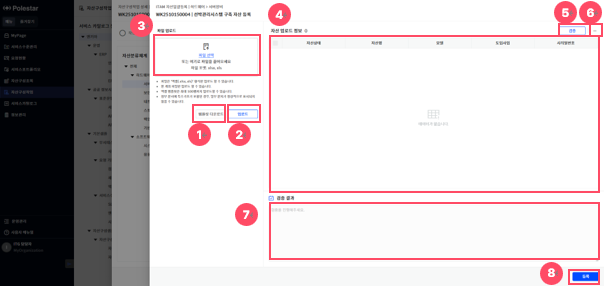

> ▶ \[그림14\] 자산구성작업 자산 일괄등록 화면(드로어)
> 
> 상세 정보(자산 일괄등록 화면)

<table>
<thead>
<tr class="header">
<th>[그림14].”1” 
템플릿 다운로드</th>
<th>엑셀 템플릿 파일 다운로드 기능을 제공하는 버튼입니다.</th>
</tr>
</thead>
<tbody>
<tr class="odd">
<td>[그림14].”2” 
업로드</td>
<td>선택한 파일을 업로드하여, 읽어 들인 내용을 자산 업로드 정보([그림14].“4“)에 표시하는 기능을 제공하는 버튼입니다.</td>
</tr>
<tr class="even">
<td>[그림14].”3” 
파일 선택</td>
<td>파일을 드래그&amp;드롭 또는, 링크를 클릭하여, 업로드할 엑셀 템플릿 파일 선택 기능을 제공하는 영역입니다.</td>
</tr>
<tr class="odd">
<td>[그림14].”4” 
자산 업로드 정보</td>
<td>업로드 버튼([그림14].“2“)을 통해, 읽어 들인 엑셀 템플릿의 내용을 목록으로 표시합니다.</td>
</tr>
<tr class="even">
<td>[그림14].”5” 
검증</td>
<td>자산 업로드 정보([그림14].“4“)를 검증하여, 검증 결과([그림14].“8“)에 검증 통과여부, 실패 사유 표시 기능을 제공하는 버튼입니다.</td>
</tr>
<tr class="odd">
<td>[그림14].”6” 
삭제</td>
<td>자산 업로드 정보([그림14].“4“)에서 선택한 자산 삭제 기능을 제공하는 버튼입니다.</td>
</tr>
<tr class="even">
<td>[그림14].”7” 
검증 결과</td>
<td>검증 버튼([그림14].“5“)을 통해 검증 통과여부와 실패 사유를 표시합니다.</td>
</tr>
<tr class="odd">
<td>[그림14].”8” 
등록</td>
<td>검증에 통과한 자산 업로드 정보([그림14].“4“)를 작업자산 목록으로 등록하는 기능을 제공하는 버튼입니다.</td>
</tr>
</tbody>
</table>

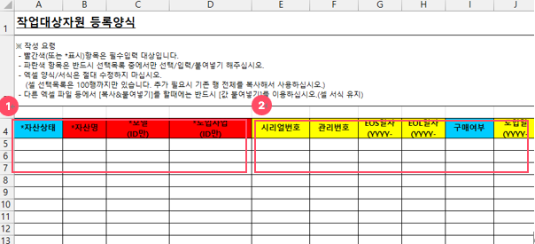

> ▶ \[그림15\] 자산구성작업 자산 일괄등록 화면(엑셀 템플릿)
> 
> 상세 정보(자산 일괄등록 템플릿)

<table>
<thead>
<tr class="header">
<th>[그림15].”1” 
필수입력 항목</th>
<th>필수로 입력해야 하는 항목으로, 열제목에 [ * ]모양의 표식을 표시합니다.</th>
</tr>
</thead>
<tbody>
<tr class="odd">
<td>[그림15].”2” 
선택입력 항목</td>
<td>선택적으로 입력하는 항목입니다.</td>
</tr>
</tbody>
</table>

> 자산구성작업 자산 일괄등록 절차

1.  작업자산(탭)(\[그림12\])에서 일괄등록 버튼(\[그림12\].”4”)을 클릭합니다.

2.  일괄등록 화면(\[그림14\])에서 템플릿 다운로드 버튼(\[그림14\].“1“)을 클릭하여, 엑셀 템플릿을 다운로드합니다.

3.  다운로드 받은 템플릿에 자산 정보를 입력합니다.

4.  파일 선택 영역(\[그림14\].“3“)에서 작성한 파일을 선택하고, 업로드 버튼(\[그림14\].“2“)을 클릭합니다.

5.  자산 업로드 정보(\[그림14\].“4“)에 표시되는 업로드 내용을 검토합니다.

6.  검증 버튼(\[그림14\].“5“)을 클릭합니다.

7.  검증결과(\[그림14\].“7“)에 표시된 검증 성공여부와 실패 사유를 검토합니다.

8.  검증 실패 시, 템플릿 내용 수정 또는 삭제 버튼(\[그림14\].“6“)으로 대상제외 후 재시도 합니다.

9.  검증결과(\[그림14\].“7“)에 검증 통과여부가 성공으로 표시되는지 확인합니다.

10. 등록 버튼(\[그림14\].“8“)을 클릭합니다.

자산구성작업 - 자산 일괄수정

작업자산(탭)(\[그림12\])에서, 일괄수정 버튼(\[그림12\].“5“)을 클릭하면, 자산 일괄수정이 가능한 상세화면(드로어)이 열립니다.

<table>
<tbody>
<tr class="odd">
<td>
노트

자산분류별로 제공하는 엑셀 템플릿을 업로드하여, 자산 일괄 수정이 가능하며, [검증]버튼을 클릭하여, 업로드한 자산 정보 검증이 가능합니다.
</td>
</tr>
</tbody>
</table>

<table>
<tbody>
<tr class="odd">
<td>
주의

일괄 수정은 단건등록, 일괄등록, 대상추가 기능을 통해, 작업자산 목록에 등록한 자산만 수정 가능하며, 템플릿은 작업자산 정보가 변경될 수 있으므로, 항상 새로운 템플릿을 다운로드 받아야 합니다.
</td>
</tr>
</tbody>
</table>

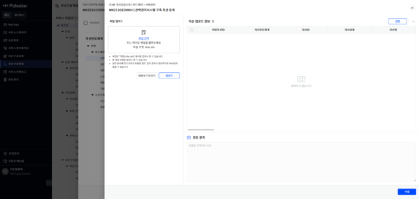

> ▶ \[그림16\] 자산구성작업 자산 일괄수정 화면(드로어)
> 
> 상세 정보(자산 일괄수정 화면)

\[그림14\]의 상세 정보와 동일한 내용입니다.

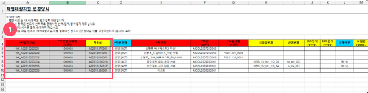

> ▶ \[그림17\] 자산구성작업 자산 일괄수정 화면(엑셀 템플릿)
> 
> 상세 정보(자산 일괄수정 템플릿)

<table>
<tbody>
<tr class="odd">
<td>[그림17].”1” 
수정불가 항목</td>
<td>셀 배경색을 음영으로 표시한 부분은, 수정 대상 확인을 위한 용도로, 수정 불가합니다.</td>
</tr>
</tbody>
</table>

> 자산구성작업 자산 일괄수정 절차

1.  작업자산(탭)(\[그림12\])에서 일괄수정 버튼(\[그림12\].”5”)을 클릭합니다.

2.  일괄수정 화면(\[그림16\]) 좌측 상단의 \[템플릿 다운로드\] 버튼을 클릭하여, 엑셀 템플릿을 다운로드합니다.

3.  다운로드 받은 템플릿의 자산의 정보를 수정합니다.

4.  화면 좌측 상단의 \[파일 선택 영역\]에서 작성한 파일을 선택하고, 하단의 \[업로드\] 버튼을 클릭합니다.

5.  \[자산 업로드 정보\]에 표시되는 업로드 내용을 검토합니다.

6.  목록 우측 상단의 \[검증\] 버튼을 클릭합니다.

7.  화단 우측 하단의 \[검증결과\]에 표시된 검증 성공여부와 실패 사유를 검토합니다.

8.  검증 실패 시, 템플릿 내용 수정 또는 목록 우측 상단의 \[삭제\] 버튼으로 대상 제외 후, 재시도 합니다.

9.  \[검증결과\]에 검증 통과여부가 성공으로 표시되는지 확인합니다.

10. 화면 우측 하단의 \[수정\] 버튼을 클릭합니다.

자산구성작업 - 자산수정 대상추가

작업자산(탭)(\[그림18\])에서, 대상추가 버튼(\[그림18\].“1“)을 클릭하면, 자산수정 대상추가가 가능한 화면(팝업)이 열립니다.

<table>
<tbody>
<tr class="odd">
<td>
 노트

대상추가로 등록가능한 자산은, 진행 중인 작업이 없는 운영자산만 등록 가능합니다.
</td>
</tr>
</tbody>
</table>

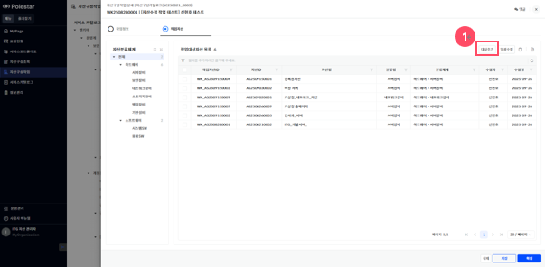

> ▶ \[그림18\] 자산구성작업 상세화면 - 자산수정 작업자산(탭)
> 
> 화면 지표(작업자산 목록)

\[그림12\]의 화면 지표와 동일한 내용입니다.

> 상세 정보(작업자산)

<table>
<tbody>
<tr class="odd">
<td>[그림18].”1” 
대상추가 버튼</td>
<td>작업자산 대상추가 기능을 제공하며, 버튼을 클릭하면, 대상추가 가능한 상세화면(팝업)이 열립니다.</td>
</tr>
</tbody>
</table>

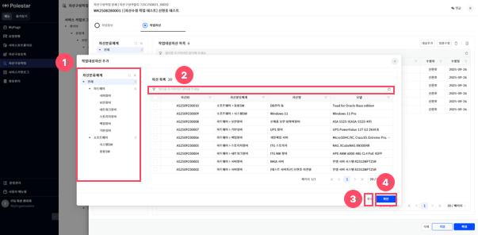

> ▶ \[그림19\] 자산구성작업 - 자산수정 대상추가 화면(팝업)
> 
> 화면 지표(자산수정 대상추가 목록)

| 자산ID   | 자산의 고유식별ID 값입니다.                  |
| ------ | --------------------------------- |
| 자산분류체계 | 자산이 속한 자산분류체계로, 분류명을 계층적으로 표시합니다. |
| 자산명    | 자산을 식별할 수 있는 명칭입니다.               |
| 모델     | 자산의 모델명을 정보입니다.                   |

> 상세 정보(자산수정 대상추가)

<table>
<thead>
<tr class="header">
<th>[그림19].”1” 
자산분류체계 트리</th>
<th>자산분류체계 계층적 정보가 표시되는 트리로, 트리에 표현된 항목(노드)을 클릭하면 해당 항목에 포함된 자산 목록을 조회하는 기능을 제공합니다.</th>
</tr>
</thead>
<tbody>
<tr class="odd">
<td>[그림19].”2” 
그리드 필터</td>
<td>그리드 필터는 상단 행(필터 행)을 통해 각 컬럼 단위로 상세한 조건 검색이 가능한 기능입니다.</td>
</tr>
<tr class="even">
<td>[그림19].”3” 
취소 버튼</td>
<td>대상추가 화면(팝업)을 닫는 기능을 제공하는 버튼입니다.</td>
</tr>
<tr class="odd">
<td>[그림19].”4” 
확인 버튼</td>
<td>선택한 대상추가 목록을 작업자산 목록으로 등록합니다.</td>
</tr>
</tbody>
</table>

> 자산구성작업 자산 대상추가 절차

1.  작업자산(탭)(\[그림18\])에서, 대상추가 버튼(\[그림18\].”1”)을 클릭합니다.

2.  대상추가 화면(\[그림19\])의 자산분류체계 트리(\[그림19\].“1“)에서, 필요한 정보를 클릭합니다

3.  대상추가 목록에서 수정할 자산을 선택합니다.

4.  확인 버튼(\[그림19\].“4“)을 클릭합니다.

자산구성작업등록 자산정보 댓글&히스토리

댓글기능을 통하여 작업대상자산의 댓글&히스토리 내역을 확인할 수 있습니다.

<table>
<tbody>
<tr class="odd">
<td>
노트

사용자가 등록한 댓글은 대 댓글, 수정, 삭제가 가능합니다.

히스토리 댓글은 대 댓글, 이력상세보기가 가능합니다.

카탈로그([그림 22].”3”) 선택하지 않은 상태로 댓글을 등록, 수정할 수 없습니다.

작업자산의 댓글정보는 승인처리 진행 시 운영정보에 반영되지 않습니다.

[댓글] 기능 사용법은 [서비스 포트폴리오 &gt; 그림 8 &gt; 댓글 &amp; 히스토리] 매뉴얼을 참조하시기 바랍니다.
</td>
</tr>
</tbody>
</table>

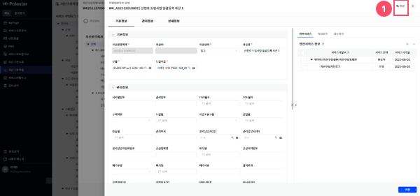

> ▶ \[그림20\] 자산구성작업 작업자산상세화면(드로어)

자산구성작업 - 작업구성

목록에서 작업분류가 \[구성등록\], \[구성수정\]인 작업(작업ID, 작업분류, 작업명)을 클릭하면, \[작업구성\] 탭(목록 조회 및 신규등록, 정보수정, 정보삭제 가능)을 표시하는 상세화면(드로어)이 열립니다.

<table>
<tbody>
<tr class="odd">
<td>
노트

작업구성 신규등록, 정보수정, 정보삭제는 작업상태가 [저장]인 경우에만 가능합니다.

작업구성 단건등록([그림21].“3“), 일괄등록([그림21].“4“), 일괄수정([그림21].“5“) 버튼은, 구성분류 트리([그림21].“1“)에서 최하위 항목을 선택한 경우에만 표시합니다.

단건등록([그림21].“3“), 일괄등록([그림21].“4“) 버튼은, 작업분류가 [구성등록]인 경우에만 표시하며, 대상추가([그림29].“1“) 버튼은, 작업분류가 [구성수정]인 경우에만 표시합니다.
</td>
</tr>
</tbody>
</table>

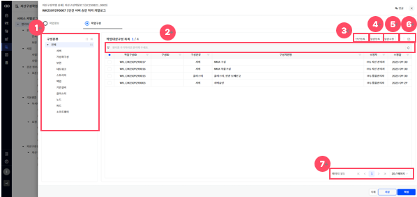

> ▶ \[그림21\] 자산구성작업 구성등록 작업구성(탭)
> 
> 화면 지표

<table>
<thead>
<tr class="header">
<th>작업구성ID</th>
<th>작업구성의 고유식별 ID 값입니다.</th>
</tr>
</thead>
<tbody>
<tr class="odd">
<td>구성분류</td>
<td>구성이 속한 구성분류를 표시합니다.</td>
</tr>
<tr class="even">
<td>구성ID</td>
<td>
운영구성의 고유식별ID 값입니다.

[구성등록] 작업은 [승인] 상태일 경우에만 값을 표시하며, [구성수정] 작업은 항상 값을 표시합니다.
</td>
</tr>
<tr class="odd">
<td>구성자원명</td>
<td>구성을 식별할 수 있는 명칭입니다.</td>
</tr>
<tr class="even">
<td>수정자/수정일</td>
<td>작업구성을 마지막으로 수정한 사용자와 그 일자입니다.</td>
</tr>
</tbody>
</table>

> 상세 정보

<table>
<thead>
<tr class="header">
<th>[그림21].”1” 
구성분류 트리</th>
<th>구성분류 트리의 항목을 클릭하면, 분류에 해당되는 작업구성 목록 조회가 가능합니다.</th>
</tr>
</thead>
<tbody>
<tr class="odd">
<td>[그림21].”2” 
그리드 필터</td>
<td>그리드 필터는 상단 행(필터 행)을 통해 각 컬럼 단위로 상세한 조건 검색이 가능한 기능입니다.</td>
</tr>
<tr class="even">
<td>[그림21].”3” 
단건등록 버튼</td>
<td>작업구성 개별 등록 기능을 제공하며, 버튼을 클릭하면, 구성 등록화면(드로어)이 열립니다.</td>
</tr>
<tr class="odd">
<td>[그림21].”4” 
일괄등록 버튼</td>
<td>엑셀 업로드를 통한 작업구성 일괄 등록 기능을 제공하며, 버튼을 클릭하면, 템플릿 일괄등록 화면(드로어)이 열립니다.</td>
</tr>
<tr class="even">
<td>[그림21].”5” 
일괄수정 버튼</td>
<td>엑셀 업로드를 통한 작업구성 일괄 수정 기능을 제공하며, 버튼을 클릭하면, 템플릿 일괄수정 화면(드로어)이 열립니다.</td>
</tr>
<tr class="odd">
<td>[그림21].”6” 
삭제 버튼 &amp; 엑셀저장 버튼</td>
<td>[작업구성 목록]의 선택된 대상을 삭제하는 버튼과, 현재 화면에 표시된 데이터를 엑셀파일로 다운로드 하는 기능을 제공하는 엑셀저장 버튼입니다.</td>
</tr>
<tr class="even">
<td>[그림21].”7” 
페이징</td>
<td>목록 데이터를 구간별로 나누어 페이지 단위로 조회할 수 있도록 도와주는 기능입니다.</td>
</tr>
</tbody>
</table>

자산구성작업 - 구성 단건등록

작업구성(탭)(\[그림21\])에서, 단건등록 버튼(\[그림21\].“3“)을 클릭하면, 구성 등록화면(드로어)이 열립니다.

<table>
<tbody>
<tr class="odd">
<td>
노트

등록화면(드로어)에 표시되는 항목은, 구성분류별로 다를 수 있습니다.

[상위자산]은 서버, 보안, 네트워크, 스토리지, 백업, 기반설비, 소프트웨어 구성인 경우에만 표시하며, 각 구성은 다음과 같은 자산으로부터 할당할 수 있습니다.

- 서버(CFSV): 서버장비

- 보안(CFSC): 보안장비

- 네트워크(CFNW) : 네트워크장비

- 스토리지(CFST) : 스토리지장비

- 백업(CFBK) : 백업장비

- 기반설비(CFFA) : 기반설비

- 소프트웨어(CFSW) : 시스템SW, 응용SW

[상위구성]은 가상화구성, 노드, 파드 구성인 경우에만 표시하며, 각 구성은 다음과 같은 구성으로부터 할당할 수 있습니다.

- 가상화구성(CFSL) : 서버

- 노드(ND) : 서버, 가상화구성

- 파드(CFRB) : 클러스터

[클러스터상위정보]는 클러스터 구성인 경우에만 표시하며, 복수의 노드(ND) 구성으로부터 할당할 수 있습니다.

상위정보에 대하여 작업중인 대상의 자원정보를 가져올 경우 해당 작업의 카탈로그의 상태가 운영 또는 일시정지 인 경우에만 선택대상으로 확인할 수 있습니다.
</td>
</tr>
</tbody>
</table>

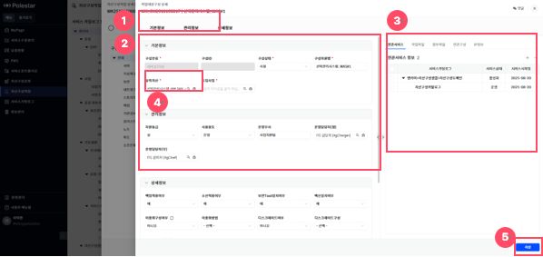

> ▶ \[그림22\] 자산구성작업 구성 단건등록 화면(드로어) - 상위자산 표시

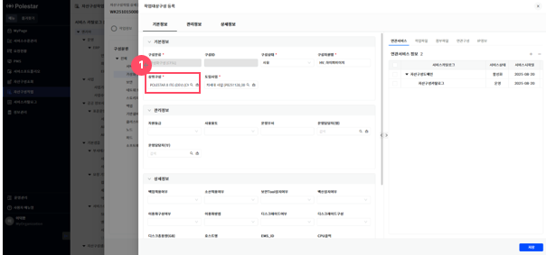

> ▶ \[그림23\] 자산구성작업 구성 단건등록 화면(드로어) - 상위구성 표시

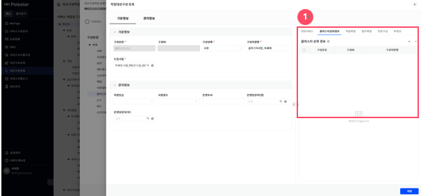

> ▶ \[그림24\] 자산구성작업 구성 단건등록 화면(드로어) - 클러스터상위정보 표시
> 
> 화면 지표(기본정보)

구성을 관리하기 위한 최소한의 기본정보를 표시합니다.

<table>
<thead>
<tr class="header">
<th>구성분류</th>
<th>구성이 속한 구성분류를 표시합니다.</th>
</tr>
</thead>
<tbody>
<tr class="odd">
<td>구성ID</td>
<td>구성 고유식별을 위한 ID 값입니다.</td>
</tr>
<tr class="even">
<td>구성상태</td>
<td>
구성의 운영 상태를 표시합니다.

- 사용 : 자원을 할당하여, 사용 중인 상태입니다.

- 정지 : 자원을 반납하여, 사용을 중단한 상태입니다.
</td>
</tr>
<tr class="odd">
<td>구성자원명</td>
<td>구성을 식별할 수 있는 명칭입니다.</td>
</tr>
<tr class="even">
<td>상위자산</td>
<td>구성을 할당한 상위자산을 표시합니다.</td>
</tr>
<tr class="odd">
<td>상위구성</td>
<td>구성을 할당한 상위구성을 표시합니다.</td>
</tr>
<tr class="even">
<td>도입사업</td>
<td>구성의 도입사업을 표시합니다.</td>
</tr>
</tbody>
</table>

> 화면 지표(관리정보, 상세정보)

구성분류별로 정의한 관리정보, 상세정보를 표시합니다.

> 화면 지표(추가정보(탭))

구성분류별로 정의한 추가정보(탭)를 표시합니다.

<table>
<tbody>
<tr class="odd">
<td>
노트

클러스터 관련 추가정보(클러스터상위정보, 클러스터하위정보)는, 클러스터 구성인 경우에만 표시하며, 이외에는 상하위정보로 표시합니다.

연관구성에 대하여 작업중인 대상의 자원정보를 가져올 경우 해당 작업의 카탈로그의 상태가 운영 또는 일시정지 인 경우에만 선택대상으로 확인할 수 있습니다.
</td>
</tr>
</tbody>
</table>

| 연관서비스    | 구성이 과거에 사용되었거나, 현재 사용되고 있는 서비스도메인과 서비스카탈로그 목록을 계층적을 표시합니다. |
| -------- | ---------------------------------------------------------- |
| 작업이력     | 구성 등록, 수정 등의 작업에 대한 이력을 표시합니다.                             |
| 작업파일     | 작업에 필요한 첨부파일을 표시합니다.                                       |
| 첨부파일     | 구성정보에 등록된 첨부파일을 표시합니다.                                     |
| 연관구성     | 네트워크, 스토리지 등 연관되어 있는 구성 목록을 표시합니다.                         |
| IP정보     | 구성에서 사용하는 IP 목록을 표시합니다.                                    |
| 상하위정보    | 구성이 속한 자산과 구성을 계층적 목록으로 표시합니다.                             |
| 클러스터상위정보 | 클러스터를 구성하는 상위구성(노드) 목록을 표시합니다.                             |
| 클러스터하위정보 | 클러스터에서 할당한 하위구성(파드) 목록을 표시합니다.                             |
| 연관요청     | 구성과 연관된 요청 목록을 표시합니다.                                      |

> 상세 정보

<table>
<thead>
<tr class="header">
<th>[그림22].”1” 
기본정보 버튼</th>
<th>클릭을 통해 기본정보가 위치한 부분([그림22].”2”)으로 이동합니다.</th>
</tr>
</thead>
<tbody>
<tr class="odd">
<td>[그림22].”2” 
구성정보</td>
<td>구성분류별로 정의한 관리정보, 상세정보를 표시합니다.</td>
</tr>
<tr class="even">
<td>[그림22].”3” 
추가정보</td>
<td>구성분류별로 정의한 추가정보(탭)를 표시합니다. 탭을 클릭하여, 각 추가정보 조회 및 등록, 수정이 가능합니다.</td>
</tr>
<tr class="odd">
<td>[그림22].”4” 
상위자산 입력</td>
<td>구성의 상위가 자산일 경우 상위자산을 입력합니다.</td>
</tr>
<tr class="even">
<td>[그림 26].”5” 
저장 버튼</td>
<td>입력된 정보를 등록합니다.</td>
</tr>
<tr class="odd">
<td>[그림23].”1” 
상위구성 입력</td>
<td>구성의 상위가 구성일 경우 상위구성을 입력합니다.</td>
</tr>
<tr class="even">
<td>[그림24].”1” 
클러스터상위정보 입력</td>
<td>클러스터 구성의 상위구성(노드)을 입력합니다. (복수 입력 가능)</td>
</tr>
</tbody>
</table>

> 자산구성작업 구성 단건등록 진행 절차

1.  작업구성(탭)(\[그림21\])에서 단건등록 버튼(\[그림21\].”3”)을 클릭합니다.

2.  등록화면(\[그림22\])의 필수 항목(\[그림22\].”4”와 같이 \[  \]모양의 표식이 되어있는 항목)을 입력합니다.

3.  조건부 필수 항목(상위자산, 상위구성) 또는 조건부 필수 추가정보(클러스터상위구성)를 입력합니다.

> \- 상위자산 : 구성분류가 서버, 네트워크, 스토리지, 백업, 기반설비, 소프트웨어인 경우
> 
> \- 상위구성 : 구성분류가 가상화구성, 노드, 파드인 경우
> 
> \- 클러스터상위정보 : 구성분류가 클러스터인 경우

4.  화면 우측 하단의 \[저장\]버튼을 클릭합니다.

자산구성작업 - 구성 일괄등록

작업구성(탭)(\[그림21\])에서, 일괄등록 버튼(\[그림21\].“4“)을 클릭하면, 구성 일괄등록이 가능한 상세화면(드로어)이 열립니다.

<table>
<tbody>
<tr class="odd">
<td>
노트

구성분류별로 제공하는 엑셀 템플릿을 업로드하여, 구성 일괄 등록이 가능하며, [검증]버튼을 클릭하여, 업로드한 구성 정보 검증이 가능합니다.
</td>
</tr>
</tbody>
</table>

<table>
<tbody>
<tr class="odd">
<td>
주의

다운로드 받은 템플릿은 재활용 가능하나, 특정사유(정책 및 관리항목 정보 변경)에 의해 구성 항목들이 변경될 수 있으므로, 템플릿 최신화에 주의가 필요합니다.
</td>
</tr>
</tbody>
</table>

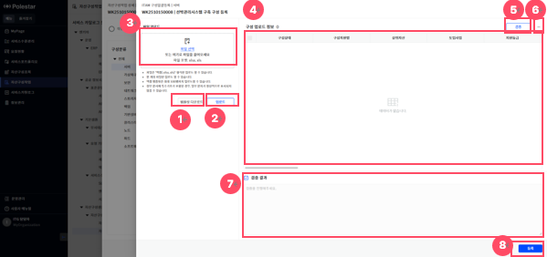

> ▶ \[그림25\] 자산구성작업 구성 일괄등록 화면(드로어)
> 
> 상세 정보(구성 일괄등록)

<table>
<thead>
<tr class="header">
<th>[그림25].”1” 
템플릿 다운로드</th>
<th>엑셀 템플릿 파일 다운로드 기능을 제공하는 버튼입니다.</th>
</tr>
</thead>
<tbody>
<tr class="odd">
<td>[그림25].”2” 
업로드</td>
<td>선택한 파일을 업로드하여, 읽어 들인 내용을 구성 업로드 정보([그림25].“4“)에 표시하는 기능을 제공하는 버튼입니다.</td>
</tr>
<tr class="even">
<td>[그림25].”3” 
파일 선택</td>
<td>파일을 드래그&amp;드롭 또는 링크를 클릭하여, 업로드할 엑셀 템플릿 파일 선택 기능을 제공하는 영역입니다.</td>
</tr>
<tr class="odd">
<td>[그림25].”4” 
구성 업로드 정보</td>
<td>업로드 버튼([그림25].“2“)을 통해, 읽어 들인 엑셀 템플릿의 내용을 목록으로 표시합니다.</td>
</tr>
<tr class="even">
<td>[그림25].”5” 
검증</td>
<td>구성 업로드 정보([그림25].“4“)를 검증하여, 검증 결과([그림25].“8“)에 검증 통과여부, 실패 사유 표시 기능을 제공하는 버튼입니다.</td>
</tr>
<tr class="odd">
<td>[그림25].”6” 
삭제</td>
<td>구성 업로드 정보([그림25].“4“)에서 선택한 구성 삭제 기능을 제공하는 버튼입니다.</td>
</tr>
<tr class="even">
<td>[그림25].”7” 
검증 결과</td>
<td>검증 버튼([그림25].“5“)을 통해 검증 통과여부와 실패 사유를 표시합니다.</td>
</tr>
<tr class="odd">
<td>[그림25].”8” 
등록</td>
<td>검증에 통과한 구성 업로드 정보([그림25].“4“)를 등록합니다.</td>
</tr>
</tbody>
</table>

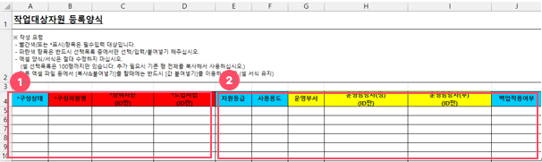

> ▶ \[그림26\] 자산구성작업 구성 일괄등록 화면(엑셀 템플릿)
> 
> 상세 정보

<table>
<thead>
<tr class="header">
<th>[그림26].”1” 
필수입력 항목</th>
<th>필수로 입력해야 하는 항목으로, 열제목에 [ * ]모양의 표식을 표시합니다.</th>
</tr>
</thead>
<tbody>
<tr class="odd">
<td>[그림26].”2” 
선택입력 항목</td>
<td>선택적으로 입력하는 항목입니다.</td>
</tr>
</tbody>
</table>

> 자산구성작업 구성 일괄등록 절차

1.  작업구성(탭)(\[그림21\])에서 일괄등록 버튼(\[그림21\].”4”)을 클릭합니다.

2.  일괄등록 화면(\[그림25\])에서 템플릿 다운로드 버튼(\[그림25\].“1“)을 클릭하여, 엑셀 템플릿을 다운로드합니다.

3.  다운로드 받은 템플릿에 구성의 정보를 입력합니다.

4.  파일 선택 영역(\[그림25\].“3“)에서 작성한 파일을 선택하고, 파일 업로드 버튼(\[그림25\].“2“)을 클릭합니다.

5.  구성 업로드 정보(\[그림25\].“4“)에 표시되는 업로드 내용을 검토합니다.

6.  검증 버튼(\[그림25\].“5“)을 클릭합니다.

7.  검증결과(\[그림25\].“7“)에 표시된 검증 성공여부와 실패 사유를 검토합니다.

8.  검증 실패 시, 템플릿 내용 수정 또는 삭제 버튼(\[그림25\].“6“)으로 대상제외 후 재시도 합니다.

9.  검증결과(\[그림25\].“7“)에 검증 통과여부가 성공으로 표시되는지 확인합니다.

10. 등록 버튼(\[그림25\].“8“)을 클릭합니다.

자산구성작업 - 구성 일괄수정

작업자산(탭)(\[그림21\])에서, 일괄수정 버튼(\[그림21\].“5“)을 클릭하면, 구성 일괄수정이 가능한 상세화면(드로어)이 열립니다.

<table>
<tbody>
<tr class="odd">
<td>
노트

구성분류별로 제공하는 엑셀 템플릿을 업로드하여, 구성 일괄 수정이 가능하며, [검증]버튼을 클릭하여, 업로드한 구성 정보 검증이 가능합니다.
</td>
</tr>
</tbody>
</table>

<table>
<tbody>
<tr class="odd">
<td>
주의

일괄 수정은 단건등록, 일괄등록, 대상추가 기능을 통해, 작업구성 목록에 등록한 구성만 수정 가능하며, 템플릿은 작업구성 정보가 변경될 수 있으므로, 항상 새로운 템플릿을 다운로드 받아야 합니다.
</td>
</tr>
</tbody>
</table>

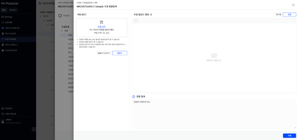

> ▶ \[그림27\] 자산구성작업 구성 일괄수정 화면(드로어)
> 
> 상세 정보(구성 일괄수정)

\[그림25\]의 상세정보와 동일한 내용입니다.

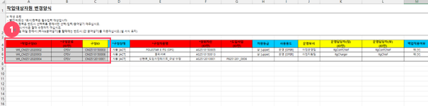

> ▶ \[그림28\] 자산구성작업 구성 일괄수정 화면(엑셀 템플릿)
> 
> 상세 정보(구성 일괄수정 템플릿)

<table>
<tbody>
<tr class="odd">
<td>[그림28].”1” 
수정불가 항목</td>
<td>셀 배경색을 음영으로 표시한 부분은, 수정 대상 확인을 위한 용도로, 수정 불가합니다.</td>
</tr>
</tbody>
</table>

> 자산구성작업 구성 일괄수정 절차

1.  작업구성(탭)(\[그림21\])에서 일괄수정 버튼(\[그림21\].”5”)을 클릭합니다.

2.  일괄수정 화면(\[그림27\]) 좌측 상단의 \[템플릿 다운로드\] 버튼을 클릭하여, 엑셀 템플릿을 다운로드합니다.

3.  다운로드 받은 템플릿에 표시된 구성의 정보를 수정합니다.

4.  화면 좌측 상단의 \[파일 선택 영역\]에서 작성한 파일을 선택하고, 하단의 \[업로드\] 버튼을 클릭합니다.

5.  \[구성 업로드 정보\]에 표시되는 업로드 내용을 검토합니다.

6.  목록 우측 상단의 \[검증\] 버튼을 클릭합니다.

7.  화단 우측 하단의 \[검증결과\]에 표시된 검증 성공여부와 실패 사유를 검토합니다.

8.  검증 실패 시, 템플릿 내용 수정 또는 목록 우측 상단의 \[삭제\] 버튼으로 대상 제외 후, 재시도 합니다.

9.  \[검증결과\]에 검증 통과여부가 성공으로 표시되는지 확인합니다.

10. 화면 우측 하단의 \[수정\] 버튼을 클릭합니다.

자산구성작업 - 구성수정 대상추가

작업구성(탭)(\[그림29\])에서, 대상추가 버튼(\[그림29\].“1“)을 클릭하면, 구성 대상추가가 가능한 화면(팝업)이 열립니다.

<table>
<tbody>
<tr class="odd">
<td>
 노트

대상추가로 등록가능한 구성은, 진행 중인 작업이 없는 운영구성만 등록 가능합니다.
</td>
</tr>
</tbody>
</table>

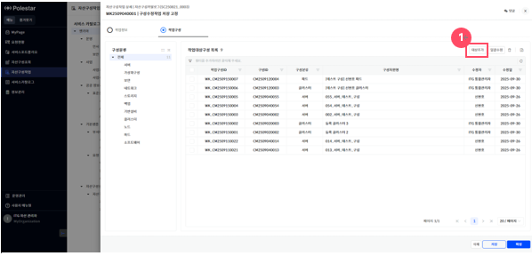

> ▶ \[그림29\] 자산구성작업 상세화면 – 구성수정 작업구성(탭)
> 
> 화면 지표(작업구성 목록)

\[그림21\]의 화면 지표와 동일한 내용입니다.

> 상세 정보(작업구성)

<table>
<tbody>
<tr class="odd">
<td>
[그림29].”1”

대상추가 버튼
</td>
<td>작업구성 대상추가 기능을 제공하며, 버튼을 클릭하면, 대상추가 가능한 상세화면(팝업)이 열립니다.</td>
</tr>
</tbody>
</table>

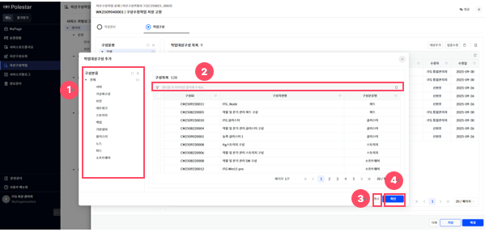

> ▶ \[그림30\] 자산구성작업 구성수정 대상추가 화면(팝업)
> 
> 화면 지표(구성 대상추가 목록)

| 구성ID  | 구성의 고유식별ID 값입니다.        |
| ----- | ----------------------- |
| 구성자원명 | 구성을 식별할 수 있는 명칭입니다.     |
| 구성분류명 | 구성의 분류를 식별할 수 있는 명칭입니다. |

> 상세 정보(구성 대상추가)

<table>
<thead>
<tr class="header">
<th>[그림30].”1” 
구성분류 트리</th>
<th>화면 좌측에 [구성분류] 트리 클릭 시 해당 분류만 조회할 수 있습니다.</th>
</tr>
</thead>
<tbody>
<tr class="odd">
<td>[그림30].”2” 
그리드 필터</td>
<td>그리드 필터는 상단 행(필터 행)을 통해 각 컬럼 단위로 상세한 조건 검색이 가능한 기능입니다.</td>
</tr>
<tr class="even">
<td>[그림30].”3” 
취소 버튼</td>
<td>대상추가 화면(팝업)을 닫는 기능을 제공하는 버튼입니다.</td>
</tr>
<tr class="odd">
<td>[그림30].”4” 
확인 버튼</td>
<td>선택한 대상추가 목록을 작업구성 목록으로 등록합니다.</td>
</tr>
</tbody>
</table>

> 자산구성작업 구성 대상추가 절차

1.  작업구성(탭)(\[그림29\])에서, 대상추가 버튼(\[그림29\].”1”)을 클릭합니다.

2.  대상추가 화면(\[그림30\])의 구성분류 트리(\[그림30\].“1“)에서, 필요한 정보를 클릭합니다.

3.  대상추가 목록에서 수정할 구성을 선택합니다.

4.  확인 버튼(\[그림30\].“4“)을 클릭합니다.

자산구성작업등록 구성정보 댓글&히스토리

댓글기능을 통하여 작업구성의 댓글&히스토리 내역을 확인할 수 있습니다.

<table>
<tbody>
<tr class="odd">
<td>
노트

사용자가 등록한 댓글은 대 댓글, 수정, 삭제가 가능합니다.

히스토리 댓글은 대 댓글, 이력상세보기가 가능합니다.

카탈로그([그림 36].”3”)를 선택하지 않으면 댓글을 등록하거나 수정할 수 없습니다.

작업구성의 댓글정보는 승인처리 진행 시 운영정보에 반영되지 않습니다.

[댓글] 기능 사용법은 [서비스 포트폴리오 &gt; 그림 8 &gt; 댓글 &amp; 히스토리] 매뉴얼을 참조하시기 바랍니다.
</td>
</tr>
</tbody>
</table>

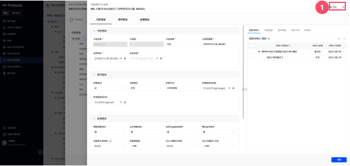

> ▶ \[그림31\] 자산구성작업 구성상세화면(드로어)

