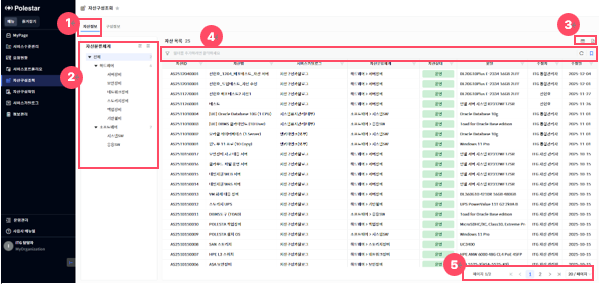
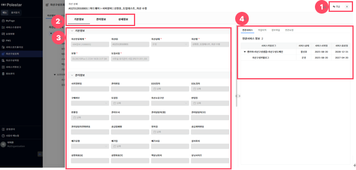
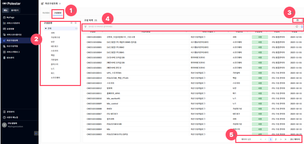
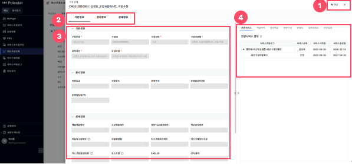

자산구성조회 – 자산정보

\[자산구성조회\] 메뉴에서 \[자산정보\] 탭을 선택하면, 자산 항목들을 조회할 수 있는 화면으로 이동되며, 목록 조회, 상세 조회가 가능합니다.

<table>
<tbody>
<tr class="odd">
<td>
노트

자산 목록은 본인 부서에서 담당하는 카탈로그와 사용권한 지정된 카탈로그가 적용된 정보만 조회됩니다.
</td>
</tr>
</tbody>
</table>

> ▶ \[그림1\] 자산 목록
> 
> 화면 지표

<table>
<thead>
<tr class="header">
<th>자산ID</th>
<th>자산 고유식별을 위한 ID 값입니다.</th>
</tr>
</thead>
<tbody>
<tr class="odd">
<td>자산명</td>
<td>자산을 식별할 수 있는 명칭입니다.</td>
</tr>
<tr class="even">
<td>서비스카탈로그</td>
<td>자산이 과거에 사용되었거나, 현재 사용되고 있는 서비스 카탈로그를 표시합니다. 여러 개인 경우 요약하여 표시합니다.</td>
</tr>
<tr class="odd">
<td>자산분류체계</td>
<td>자산이 속한 자산분류체계로, 분류명을 계층적으로 표시합니다.</td>
</tr>
<tr class="even">
<td>자산상태</td>
<td>
자산의 관리 상태를 표시합니다.

- 입고 : 사용 준비 중인 상태입니다.

- 운영 : 시스템에 할당하여 사용 중인 상태입니다.

- 보류 : 일시적으로 사용하지 않는 상태입니다.

- 폐기 : 불필요하여 처분을 완료한 상태입니다.
</td>
</tr>
<tr class="odd">
<td>모델</td>
<td>자산의 모델명을 표시합니다.</td>
</tr>
<tr class="even">
<td>수정자/수정일</td>
<td>자산을 마지막으로 수정한 사용자와 그 일자 정보입니다.</td>
</tr>
</tbody>
</table>

> 상세 정보

<table>
<thead>
<tr class="header">
<th>[그림1].”1” 
자산정보 탭</th>
<th>자산 목록 화면을 조회할 수 있는 탭입니다.</th>
</tr>
</thead>
<tbody>
<tr class="odd">
<td>[그림1].”2” 
자산분류체계 트리</td>
<td>자산분류체계 계층적 정보가 표시되는 트리로, 트리에 표현된 항목(노드)을 클릭하면 해당 항목에 포함된 자산 목록을 조회하는 기능을 제공합니다.</td>
</tr>
<tr class="even">
<td>[그림1].”3” 
컬럼수정 &amp; 엑셀저장 버튼</td>
<td>표시할 컬럼을 선택하거나 숨길 수 있는 설정 기능을 제공하는 컬럼수정 버튼과, 현재 화면에 표시된 데이터를 엑셀파일로 다운로드 하는 기능을 제공하는 엑셀저장 버튼입니다.</td>
</tr>
<tr class="odd">
<td>[그림1].”4” 
그리드 필터</td>
<td>그리드 필터는 상단 행(필터 행)을 통해 각 컬럼 단위로 상세한 조건 검색이 가능하며, 자주 사용하는 필터 조건을 즐겨 찾기로 저장하여 빠르게 적용할 수 있습니다.</td>
</tr>
<tr class="even">
<td>[그림1].”5” 
페이징</td>
<td>목록 데이터를 구간별로 나누어 페이지 단위로 조회할 수 있도록 도와주는 기능입니다.</td>
</tr>
</tbody>
</table>

자산 상세

목록에서 자산(자산ID, 자산명, 자산분류체계)을 클릭하면, 상세화면(드로어)이 열립니다.

<table>
<tbody>
<tr class="odd">
<td>
노트

상세화면(드로어)에 표시되는 항목은, 자산분류체계별로 다를 수 있습니다.

[댓글] 기능 사용법은 [서비스 포트폴리오 &gt; 그림 8 &gt; 댓글 &amp; 히스토리] 매뉴얼을 참조하시기 바랍니다.
</td>
</tr>
</tbody>
</table>

▶ \[그림2\] 자산 상세 화면(드로어)

> 화면 지표(기본정보)

자산을 관리하기 위한 최소한의 기본정보를 표시합니다.

<table>
<thead>
<tr class="header">
<th>자산분류체계</th>
<th>자산이 속한 자산분류체계로, 분류명을 계층적으로 표시합니다.</th>
</tr>
</thead>
<tbody>
<tr class="odd">
<td>자산ID</td>
<td>자산 고유식별을 위한 ID 값입니다.</td>
</tr>
<tr class="even">
<td>자산상태</td>
<td>
자산의 관리 상태를 표시합니다.

- 입고 : 사용 준비 중인 상태입니다.

- 운영 : 시스템에 할당하여 사용 중인 상태입니다.

- 보류 : 일시적으로 사용하지 않는 상태입니다.

- 폐기 : 불필요하여 처분을 완료한 상태입니다.
</td>
</tr>
<tr class="odd">
<td>자산명</td>
<td>자산을 식별할 수 있는 명칭입니다.</td>
</tr>
<tr class="even">
<td>모델</td>
<td>자산의 모델명을 표시합니다.</td>
</tr>
<tr class="odd">
<td>도입사업</td>
<td>자산의 도입사업을 표시합니다.</td>
</tr>
</tbody>
</table>

> 화면 지표(관리정보, 상세정보)

자산분류체계별로 정의한 관리정보, 상세정보를 표시합니다.

> 화면 지표(추가정보(탭))

자산분류체계별로 정의한 추가정보(탭)를 표시합니다.

| 연관서비스 | 자산이 과거에 사용되었거나, 현재 사용되고 있는 서비스도메인과 서비스카탈로그 목록을 계층적을 표시합니다. |
| ----- | ---------------------------------------------------------- |
| 작업이력  | 자산 등록, 수정 등의 작업에 대한 이력을 표시합니다.                             |
| 첨부파일  | 자산정보에 등록된 첨부파일을 표시합니다.                                     |
| 연관요청  | 자산과 연관된 요청 목록을 표시합니다.                                      |

> 상세 정보

<table>
<thead>
<tr class="header">
<th>[그림2].”1” 
댓글 버튼</th>
<th>버튼 클릭을 통해 자산정보에 대한 댓글을 조회하거나 작성할 수 있습니다.</th>
</tr>
</thead>
<tbody>
<tr class="odd">
<td>[그림2].”2” 
기본정보 버튼</td>
<td>클릭을 통해 기본정보가 위치한 부분([그림2.”3”])으로 이동합니다.</td>
</tr>
<tr class="even">
<td>[그림2].”3” 
자산정보</td>
<td>자산분류체계별로 정의한 관리정보, 상세정보를 표시합니다..</td>
</tr>
<tr class="odd">
<td>[그림2].”4” 
추가정보</td>
<td>자산분류체계별로 정의한 추가정보(탭)를 표시합니다. 탭을 클릭하여, 각 추가정보 조회가 가능합니다.</td>
</tr>
</tbody>
</table>

자산구성조회 – 구성정보

\[자산구성조회\] 메뉴에서 \[구성정보\] 탭을 선택하면, 구성의 항목들을 조회할 수 있는 화면으로 이동되며, 목록 조회, 상세 조회가 가능합니다.

<table>
<tbody>
<tr class="odd">
<td>
노트

구성 목록은 본인 부서에서 담당하는 카탈로그와 사용권한 지정된 카탈로그가 적용된 정보만 조회됩니다.
</td>
</tr>
</tbody>
</table>

> ▶ \[그림3\] 구성 목록
> 
> 화면 지표

<table>
<thead>
<tr class="header">
<th>구성ID</th>
<th>구성 고유식별을 위한 ID 값입니다.</th>
</tr>
</thead>
<tbody>
<tr class="odd">
<td>구성자원명</td>
<td>구성을 식별할 수 있는 명칭입니다.</td>
</tr>
<tr class="even">
<td>서비스카탈로그</td>
<td>구성이 과거에 사용되었거나, 현재 사용되고 있는 서비스 카탈로그를 표시합니다. 여러 개인 경우 요약하여 표시합니다.</td>
</tr>
<tr class="odd">
<td>구성분류</td>
<td>구성이 속한 구성분류로, 분류명을 표시합니다.</td>
</tr>
<tr class="even">
<td>구성상태</td>
<td>
구성의 운영 상태를 표시합니다.

- 사용 : 자원을 할당하여, 사용 중인 상태입니다.

- 정지 : 자원을 반납하여, 사용을 중단한 상태입니다.
</td>
</tr>
<tr class="odd">
<td>수정자/수정일</td>
<td>구성을 마지막으로 수정한 사용자와 그 일자 정보입니다.</td>
</tr>
</tbody>
</table>

> 상세 정보

<table>
<thead>
<tr class="header">
<th>[그림3].”1” 
구성정보 탭</th>
<th>구성 목록 화면을 조회할 수 있는 탭입니다.</th>
</tr>
</thead>
<tbody>
<tr class="odd">
<td>[그림3].”2” 
구성분류 트리</td>
<td>구성분류 정보가 표시되는 트리로, 트리에 표현된 항목(노드)을 클릭하면 해당 항목에 포함된 구성 목록을 조회하는 기능을 제공합니다.</td>
</tr>
<tr class="even">
<td>[그림3].”3” 
컬럼수정 &amp; 엑셀저장 버튼</td>
<td>표시할 컬럼을 선택하거나 숨길 수 있는 설정 기능을 제공하는 컬럼수정 버튼과, 현재 화면에 표시된 데이터를 엑셀파일로 다운로드 하는 기능을 제공하는 엑셀저장 버튼입니다.</td>
</tr>
<tr class="odd">
<td>[그림3].”4” 
그리드 필터</td>
<td>그리드 필터는 상단 행(필터 행)을 통해 각 컬럼 단위로 상세한 조건 검색이 가능하며, 자주 사용하는 필터 조건을 즐겨 찾기로 저장하여 빠르게 적용할 수 있습니다.</td>
</tr>
<tr class="even">
<td>[그림3].”5” 
페이징</td>
<td>목록 데이터를 구간별로 나누어 페이지 단위로 조회할 수 있도록 도와주는 기능입니다.</td>
</tr>
</tbody>
</table>

구성 상세

목록에서 구성(구성ID, 구성자원명, 구성분류)을 클릭하면, 상세화면(드로어)이 열립니다.

<table>
<tbody>
<tr class="odd">
<td>
노트

상세화면(드로어)에 표시되는 항목은, 구성분류별로 다를 수 있습니다.

[댓글] 기능 사용법은 [서비스 포트폴리오 &gt; 그림 8 &gt; 댓글 &amp; 히스토리] 매뉴얼을 참조하시기 바랍니다.
</td>
</tr>
</tbody>
</table>

▶ \[그림4\] 구성 상세 화면(드로어)

> 화면 지표(기본정보)

구성을 관리하기 위한 최소한의 기본정보를 표시합니다.

<table>
<thead>
<tr class="header">
<th>구성분류</th>
<th>구성이 속한 구성분류를 표시합니다.</th>
</tr>
</thead>
<tbody>
<tr class="odd">
<td>구성ID</td>
<td>구성 고유식별을 위한 ID 값입니다.</td>
</tr>
<tr class="even">
<td>구성상태</td>
<td>
구성의 운영 상태를 표시합니다.

- 사용 : 자원을 할당하여, 사용 중인 상태입니다.

- 정지 : 자원을 반납하여, 사용을 중단한 상태입니다.
</td>
</tr>
<tr class="odd">
<td>구성자원명</td>
<td>구성을 식별할 수 있는 명칭입니다.</td>
</tr>
<tr class="even">
<td>상위자산</td>
<td>
구성을 할당한 상위자산을 표시합니다.

서버, 보안, 네트워크, 스토리지, 기반설비, 소프트웨어 구성인 경우에만 항목을 표시합니다.

각 구성은 다음과 같은 자산으로부터 할당할 수 있습니다.

- 서버(CFSV): 서버장비

- 보안(CFST) : 보안장비

- 네트워크(CFNW) : 네트워크장비

- 스토리지(CFST) : 스토리지장비

- 백업(CFBK) : 백업장비

- 기반설비(CFFA) : 기반설비

- 소프트웨어(CFSW) : 시스템SW, 응용SW
</td>
</tr>
<tr class="odd">
<td>상위구성</td>
<td>
구성을 할당한 상위구성을 표시합니다.

가상화구성, 노드, 파드 구성인 경우에만 항목을 표시합니다.

각 구성은 다음과 같은 구성으로부터 할당할 수 있습니다.

- 가상화구성(VM): 서버

- 노드(ND) : 서버, 가상화구성

- 파드(CFRB) : 클러스터
</td>
</tr>
<tr class="even">
<td>도입사업</td>
<td>구성의 도입사업을 표시합니다.</td>
</tr>
</tbody>
</table>

> 화면 지표(관리정보, 상세정보)

구성분류별로 정의한 관리정보, 상세정보를 표시합니다.

> 화면 지표(추가정보(탭))

구성분류별로 정의한 추가정보(탭)를 표시합니다.

<table>
<tbody>
<tr class="odd">
<td>
노트

클러스터 관련 추가정보(클러스터상위정보, 클러스터하위정보)는, 클러스터 구성인 경우에만 표시하며, 이외에는 상하위정보로 표시합니다.
</td>
</tr>
</tbody>
</table>

| 연관서비스    | 구성이 과거에 사용되었거나, 현재 사용되고 있는 서비스도메인과 서비스카탈로그 목록을 계층적을 표시합니다. |
| -------- | ---------------------------------------------------------- |
| 작업이력     | 서비스 도메인이나 서비스 카탈로그에 대한 상태를 표시합니다.                          |
| 첨부파일     | 구성정보에 등록된 첨부파일을 표시합니다.                                     |
| 연관구성     | 네트워크, 스토리지 등 연관되어 있는 구성 목록을 표시합니다.                         |
| IP정보     | 구성에서 사용하는 IP 목록을 표시합니다.                                    |
| 상하위정보    | 구성이 속한 자산과 구성을 계층적 목록으로 표시합니다.                             |
| 클러스터상위정보 | 클러스터를 구성하는 상위구성(노드) 목록을 표시합니다.                             |
| 클러스터하위정보 | 클러스터에서 할당한 하위구성(파드) 목록을 표시합니다.                             |
| 연관요청     | 구성과 연관된 요청 목록을 표시합니다.                                      |

> 상세 정보

<table>
<thead>
<tr class="header">
<th>[그림4].”1” 
댓글 버튼</th>
<th>버튼 클릭을 통해 구성정보에 대한 댓글을 조회하거나 작성할 수 있습니다.</th>
</tr>
</thead>
<tbody>
<tr class="odd">
<td>[그림4].”2” 
기본정보 버튼</td>
<td>클릭을 통해 기본정보가 위치한 부분([그림4.”3”])으로 이동합니다.</td>
</tr>
<tr class="even">
<td>[그림4].”3” 
구성정보</td>
<td>구성분류별로 정의한 관리정보, 상세정보를 표시합니다.</td>
</tr>
<tr class="odd">
<td>[그림4].”4” 
추가정보</td>
<td>구성분류별로 정의한 추가정보(탭)를 표시합니다. 탭을 클릭하여, 각 추가정보 조회가 가능합니다.</td>
</tr>
</tbody>
</table>

