자산정보관리

상면관리를 위해 자산정보를 관리할수 있는 기능을 제공합니다. 첫 접속시 자산정보관리의 빈화면이 출력되며 좌측 그룹명을 선택하면 해당 그룹의 데이터가 출력됩니다.

<table>
<tbody>
<tr class="odd">
<td>
노트

사전에 제작된 상면목록에 따라 자산정보관리도 1:1 맵핑되어 관리됩니다.(1개의 상면에 1개의 자산정보가 관리)
</td>
</tr>
</tbody>
</table>

주요 화면 구성

자산정보관리를 위한 화면 레이아웃은 다음과 같습니다.

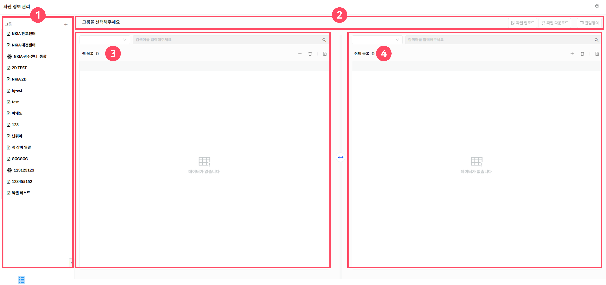

▶ \[그림1\] 자산정보관리 화면 레이아웃

> 레이아웃 설명

| 1\. 그룹관리                        | 제공될 상면의 그룹의 기본정보를 설정할 수 있으며 편집이 가능합니다.                                                                                                 |
| ------------------------------- | -------------------------------------------------------------------------------------------------------------------------------------- |
| 2\. 선택그룹명 및 파일업로드, 파일다운로드, 컬럼정의 | 선택된 그룹명을 제공하고 우측 그룹 파일업로드, 파일다운로드, 컬럼정의 아이콘 선택시 선택한 그룹의 자산정보를 업로드, 다운로드 받을수 있으며 컬럼정의 선택 시 랙/장비 속성에 대한 컬럼을 조회하고 편집할수 있는 화면으로 이동이 가능합니다. |
| 3\. 랙 목록                        | 선택한 그룹의 랙 목록 및 랙 목록을 편집이 가능합니다                                                                                                         |
| 4\. 장비 목록                       | 랙 목록에서 특정 랙을 선택하면 해당 랙에 탑재된 장비 목록을 제공하고 장비 목록 편집이 가능합니다.                                                                               |

그룹관리

여러 자산을 논리적으로 묶어 관리하는 단위인 그룹을 생성하는 기능입니다. 일반적으로 그룹은 부서, 프로젝트, 또는 물리적 위치로 나눌 수 있습니다.

보통 관리하고 있는 상면명과 동일한 경우가 대부분입니다.

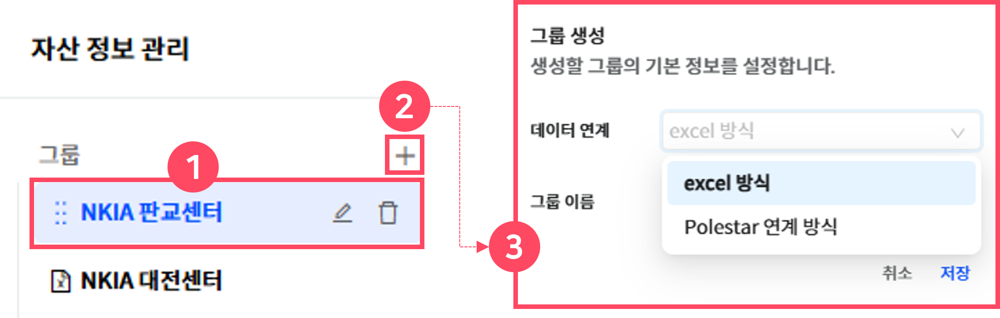

▶ \[그림2\] 그룹관리

> 그룹관리 설명

<table>
<thead>
<tr class="header">
<th>1. 그룹명</th>
<th>
사전에 정의된 그룹목록을 제공합니다.

마우스 호버시 그룹을 삭제하거나 그룹명을 수정할 수 있습니다.
</th>
</tr>
</thead>
<tbody>
<tr class="odd">
<td>2. 그룹생성버튼</td>
<td>신규로 그룹을 생성할 수 있으며 선택시 그룹생성 팝업창이 생성됩니다.</td>
</tr>
<tr class="even">
<td>3. 그룹생성 팝업창</td>
<td>
신규로 생성할 그룹의 기본정보를 설정할 수 있으며 데이터연계방식과 그룹이름을 생성할 수 있습니다.

데이터연계방식은 상면에 맵핑할 데이터 생성방법을 지정할수 있으며 두가지 방식을 제공합니다.

excel 방식 : 상면 데이터를 엑셀파일로 자체 생성 관리할 수 있습니다.

Polestar 연계방식 : Polestar DB와 연계하여 상면 데이터를 연계하여 자동으로 생성 관리할 수 있습니다.
</td>
</tr>
</tbody>
</table>

선택그룹명 및 파일업로드, 다운로드, 컬럼 정의 버튼

선택된 그룹명을 제공하고 해당 그룹의 자산정보를 엑셀파일로 파일업로드, 다운로드받을수 있습니다. 컬럼정의 선택시 선택한 그룹의 랙/장비 속성에 대한 컬럼을 조회하고 편집할수 있는 화면으로 이동이 가능합니다.

<table>
<tbody>
<tr class="odd">
<td>
노트

파일 업로드 버튼은 excel 방식 시에만 활성화됩니다. (연계방식 시 버튼 비활성화)
</td>
</tr>
</tbody>
</table>

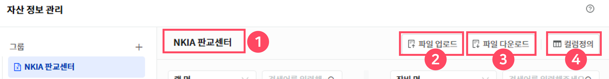

▶ \[그림3\] 선택 그룹명 및 컬럼 정의 버튼

> 좌측 메뉴 설명

| 1\. 선택그룹명   | 그룹을 선택하면 선택된 그룹명이 상단에 출력됩니다.          |
| ----------- | ------------------------------------- |
| 2\. 파일 업로드  | 그룹의 자산정보를 엑셀파일로 업로드 할 수 있습니다.         |
| 3\. 파일 다운로드 | 그룹의 자산정보를 엑셀파일로 다운로드 할 수 있습니다.        |
| 4\. 컬럼정의 버튼 | 컬럼 정의 버튼 선택시 컬럼을 정의할 수 있는 드로워가 생성됩니다. |

컬럼 정의

선택된 그룹의 랙 및 장비속성정보의 컬럼을 정의하고 편집할 수 있는 기능을 제공합니다. 해당 컬럼 정의에 따라 상면에서 제공하는 랙 및 장비의 속성정보 및 검색정보가 연동됩니다.

<table>
<tbody>
<tr class="odd">
<td>
노트

상면을 구현하기 위한 필수컬럼(속성정보)항목은 수정 및 삭제가 불가능하며 랙과 장비 컬럼에 대한 정의는 동일합니다.

* excel방식/plestar연계방식 랙 컬럼 필수항목 동일

- 6개 항목 : 랙명, 랙ID, 랙유닛수, 랙종류, X축, Y축

* excel방식 장비 컬럼 필수 항목

- 6개 항목 : 랙 ID, 장비명, 장비 ID, 홀 위치, 가상, 사이즈

* plestar연계방식 장비 컬럼 필수 항목

- 9개 항목 : 랙 ID, 장비명, 장비 ID, 홀 위치, 가상, 사이즈, IP주소, OS Type, 분류
</td>
</tr>
</tbody>
</table>

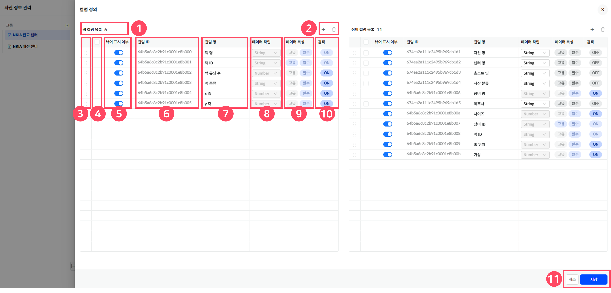

▶ \[그림4\] 컬럼 정의

> 컬럼정의 설명

<table>
<thead>
<tr class="header">
<th>1. 컬럼목록</th>
<th>정의된 컬럼의 목록수를 제공합니다.</th>
</tr>
</thead>
<tbody>
<tr class="odd">
<td>2. 컬럼추가/삭제</td>
<td>
컬럼을 추가하거나 삭제할수 있는 기능을 제공합니다.

컬럼추가 : 필수항목 외 필요한 컬럼을 추가할 수 있습니다.

컬럼삭제 : 필수항목 외 추가한 컬럼을 선택하여 삭제할 수 있습니다.
</td>
</tr>
<tr class="even">
<td>3. 순서변경</td>
<td>
사용자가 해당 아이콘을 드래그&amp;드롭하여 컬럼의 순서를 변경할 수 있습니다.

해당 컬럼의 순서는 상면에서 제공하는 랙/장비 속성정보의 순서와 연동됩니다.
</td>
</tr>
<tr class="odd">
<td>4. 체크박스</td>
<td>
신규로 생성된 컬럼을 체크하여 삭제할 수 있습니다.

* 상단 타이틀 체크박스 선택 시 전체선택하여 삭제가 가능합니다.
</td>
</tr>
<tr class="even">
<td>5. 뷰어 표시여부</td>
<td>토글버튼을 통해 상면 뷰어에서 해당 컬럼명 출력여부를 정의할 수 있습니다.</td>
</tr>
<tr class="odd">
<td>6. 컬럼ID</td>
<td>컬럼 생성 시 컬럼ID는 자동으로 생성 부여됩니다.</td>
</tr>
<tr class="even">
<td>7. 컬럼명</td>
<td>컬럼명을 제공하며 신규 생성된 컬럼명을 정의할 수 있습니다.</td>
</tr>
<tr class="odd">
<td>8. 데이터 타입</td>
<td>해당 컬럼의 데이터 타입을 제공하며 String, Number타입으로 정의할 수 있습니다.</td>
</tr>
<tr class="even">
<td>9. 데이터 특성</td>
<td>
데이터의 특성을 고유 및 필수로 정의할 것인가를 선택할 수 있습니다.

* 비활성화된 컬럼은 필수항목으로 데이터 특성을 사용자가 변경할수 없습니다.
</td>
</tr>
<tr class="odd">
<td>10. 검색</td>
<td>상면뷰어 및 자산정보관리에서 해당 컬럼으로 검색할 수 있는 여부를 정의할 수 있습니다.</td>
</tr>
<tr class="even">
<td>11. 취소/저장</td>
<td>정의된 컬럼을 취소하거나 저장해야 변경된 컬럼정의가 완료됩니다.</td>
</tr>
</tbody>
</table>

랙 목록

그룹(상면)의 랙 목록을 제공하며 랙의 검색, 추가, 삭제, 랙목록 엑셀 다운로드 기능을 제공합니다.

<table>
<tbody>
<tr class="odd">
<td>
노트

랙 목록에 출력되는 데이터는 컬럼정의에서 편집된 내용과 연동되어 출력됩니다.
</td>
</tr>
</tbody>
</table>

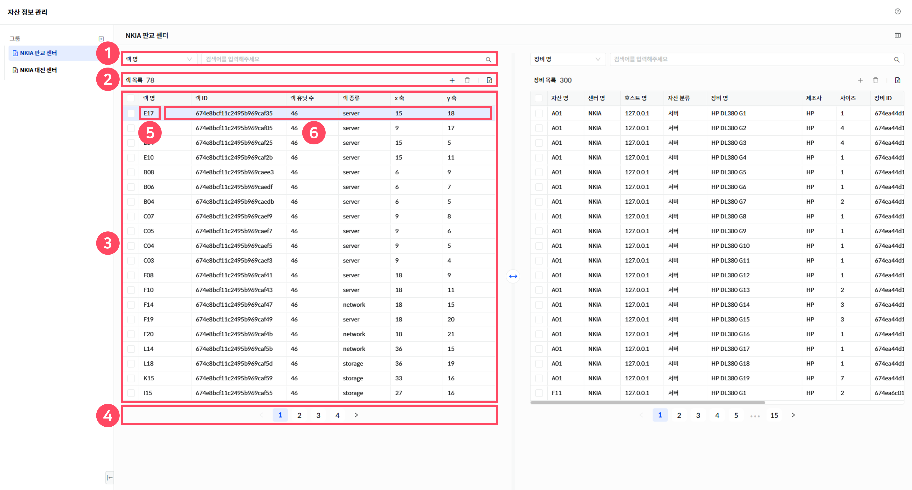

▶ \[그림5\] 랙 목록

> 랙 목록 설명

<table>
<thead>
<tr class="header">
<th>1. 검색</th>
<th>
검색조건을 선택하고 검색어를 입력하여 랙 검색이 가능합니다.

* 검색조건은 컬럼정의에서 “검색” 여부 설정값과 연동됩니다.
</th>
</tr>
</thead>
<tbody>
<tr class="odd">
<td>2. 랙 수량 
추가/삭제/다운로드</td>
<td>
랙 목록에 대한 수량정보를 상단에 제공합니다.

랙 추가, 삭제, 엑셀파일로 다운로드 받을 수 있습니다.
</td>
</tr>
<tr class="even">
<td>3. 랙 목록</td>
<td>랙 전체 목록을 제공하며 컬럼정의에서 정의한 컬럼과 연동됩니다.</td>
</tr>
<tr class="odd">
<td>4. 페이지네이션</td>
<td>랙 목록을 페이징처리하여 제공합니다.</td>
</tr>
<tr class="even">
<td>5. 랙명</td>
<td>랙명 선택 시 해당 랙에 탑재되어 있는 장비목록이 우측에 출력됩니다</td>
</tr>
<tr class="odd">
<td>6. 랙수정</td>
<td>해당 랙의 컬럼 영역 더블클릭 시 랙수정 화면이 드로워로 생성됩니다.</td>
</tr>
</tbody>
</table>

장비 목록

선택된 랙에 탑재된 장비목록을 제공하며 장비의 검색, 추가, 삭제, 장비목록 엑셀 다운로드 기능을 제공합니다.

<table>
<tbody>
<tr class="odd">
<td>
노트

장비 목록에 출력되는 데이터는 컬럼정의에서 편집된 내용과 연동되어 출력됩니다.
</td>
</tr>
</tbody>
</table>

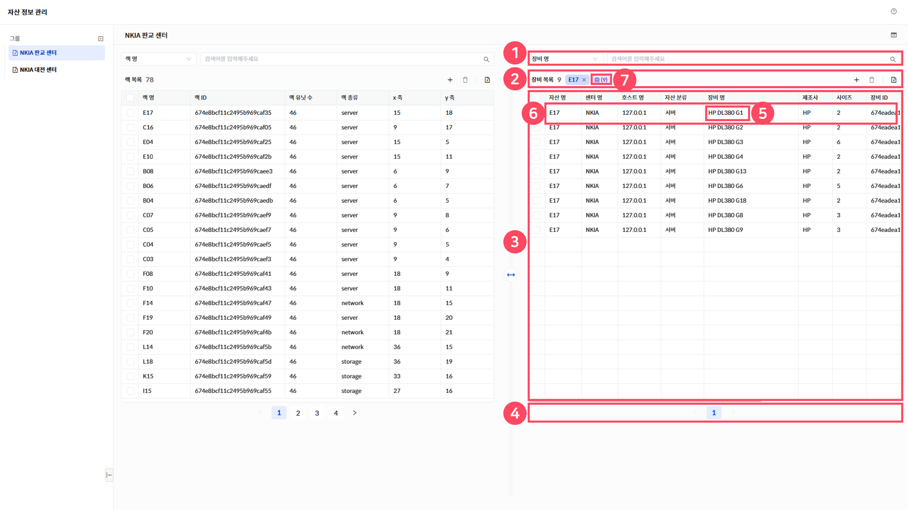

▶ \[그림6\] 장비 목록

> 장비 목록 설명

<table>
<thead>
<tr class="header">
<th>1. 검색</th>
<th>
검색조건을 선택하고 검색어를 입력하여 장비 검색이 가능합니다.

* 검색조건은 컬럼정의에서 “검색” 여부 설정값과 연동됩니다.
</th>
</tr>
</thead>
<tbody>
<tr class="odd">
<td>2. 장비 수량 
추가/삭제/다운로드</td>
<td>
장비 목록에 대한 수량정보를 상단에 제공합니다.

선택된 랙명을 상단에 제공합니다.

랙 추가, 삭제, 엑셀파일로 다운로드 받을 수 있습니다.
</td>
</tr>
<tr class="even">
<td>3. 장비 목록</td>
<td>장비 전체 목록을 제공하며 컬럼정의에서 정의한 컬럼과 연동됩니다.</td>
</tr>
<tr class="odd">
<td>4. 페이지네이션</td>
<td>장비 목록을 페이징처리하여 제공합니다.</td>
</tr>
<tr class="even">
<td>5. 장비명</td>
<td>장비 선택 시 해당 장비의 랙정보가 좌측 랙목록에 출력됩니다</td>
</tr>
<tr class="odd">
<td>6. 개별장비수정</td>
<td>해당 장비의 컬럼 영역 더블클릭 시 장비수정 화면이 드로워로 생성됩니다.</td>
</tr>
<tr class="even">
<td>7. 전체장비수정</td>
<td>해당 랙에 탑재되어 있는 장비의 목록이 출력되고 해당 아이콘 선택시 전체장비 수정 화면이 드로워로 생성됩니다.</td>
</tr>
</tbody>
</table>

랙 수정

자동생성되는 랙ID를 제외한 랙정보를 수정할 수 있습니다.

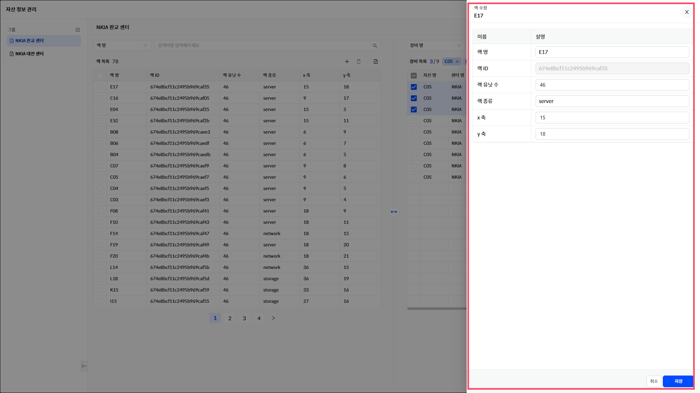

▶ \[그림7\] 랙 수정

개별 장비 수정

자동생성되는 장비ID, 랙ID를 제외한 개별 장비정보를 수정할 수 있습니다.

<table>
<tbody>
<tr class="odd">
<td>
노트

장비속성 중 가상 컬럼의 입력방법은 다음과 같습니다. 가상장비일때는 “1”, 가상장비가 아닐때는 “0”을 입력합니다.
</td>
</tr>
</tbody>
</table>

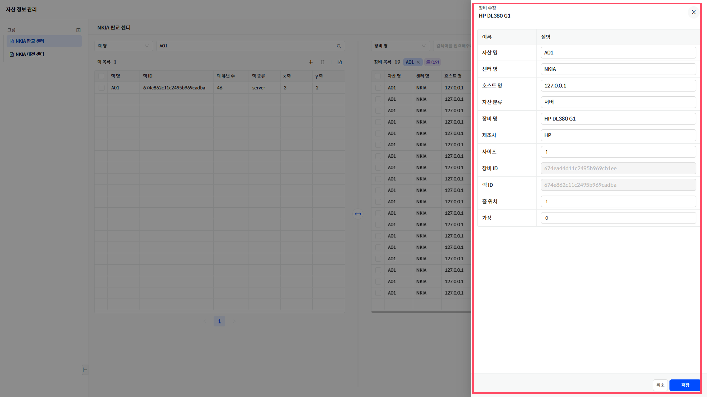

▶ \[그림8\] 개별 장비 수정

전체 장비 수정

장비 목록 우측 보라색 아이콘 선택 시 선택된 랙에 탑재된 전체 장비목록을 제공하며 전체 장비정보를 미리보기를 통해 수정할 수 있습니다.

<table>
<tbody>
<tr class="odd">
<td>
노트

전체장비 수정시 수정할수 있는 항목은 홀위치, 사이즈, 가상여부 3가지입니다.
</td>
</tr>
</tbody>
</table>

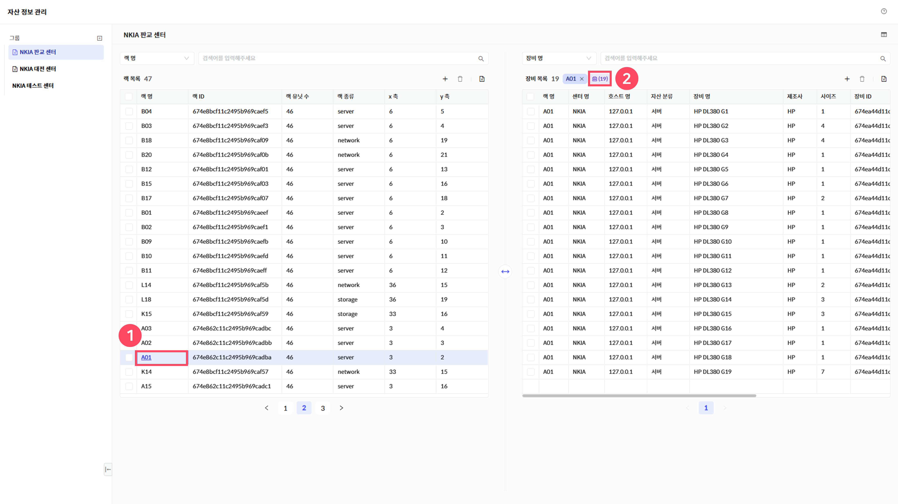

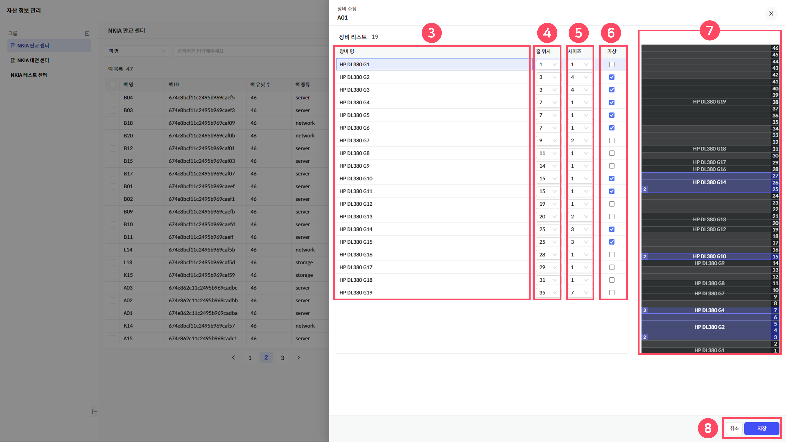

▶ \[그림9\] 전체 장비 수정

> 전체 장비 수정 설명

<table>
<thead>
<tr class="header">
<th>1. 랙명</th>
<th>랙명을 선택합니다.</th>
</tr>
</thead>
<tbody>
<tr class="odd">
<td>2. 장비목록수정 아이콘</td>
<td>장비목록 수정 아이콘을 선택합니다.</td>
</tr>
<tr class="even">
<td>3. 장비 리스트</td>
<td>현재 선택 된 랙에 탑재된 장비 리스트를 제공합니다.</td>
</tr>
<tr class="odd">
<td>4. 홀 위치</td>
<td>해당 장비가 탑재되어 있는 홀 위치를 제공하며 홀 위치를 수정할 수 있습니다.</td>
</tr>
<tr class="even">
<td>5. 사이즈</td>
<td>해당 장비의 사이즈를 제공하며 사이즈를 수정할 수 있습니다.</td>
</tr>
<tr class="odd">
<td>6. 가상</td>
<td>해당 장비의 가상장비 여부를 제공하며 체크박스를 통해 수정할 수 있습니다.</td>
</tr>
<tr class="even">
<td>7. 미리보기</td>
<td>
장비명, 홀위치, 사이즈, 가상여부를 실시간으로 미리보기 영역에서 볼수 있으며 사용자는 미리보기 화면을 통해 현황을 볼 수 있습니다.

가상장비의 경우 미리보기에 파란색으로 출력되며 좌측에 가상장비의 숫자를 표시합니다.
</td>
</tr>
<tr class="odd">
<td>취소/저장</td>
<td>수정된 내용을 취소하거나 저장버튼을 통해서 최종 저장됩니다.</td>
</tr>
</tbody>
</table>

<table>
<tbody>
<tr class="odd">
<td>
주의

주의: 장비의 홀위치, 사이즈 수정 후 해당 홀위치 및 사이즈가 타 장비와 중복되면 저장버튼 클릭 시 에러 메시지가 발생합니다.

단, 가상장비일 때는 홀 위치의 중복을 허용합니다.
</td>
</tr>
</tbody>
</table>

랙 추가 (excel 방식)

랙 목록 상단 “+” 아이콘을 선택하여 랙을 추가할수 있습니다. 랙 추가 방법은 “수동”과 “엑셀” 2가지 중 하나를 선택할 수 있습니다.

<table>
<tbody>
<tr class="odd">
<td>
노트

수동 : 사용자가 랙 하나씩 수동으로 추가하고 정보를 입력할 수 있습니다. 추후 개별 랙이 추가되었을 때 사용하면 편리합니다.

엑셀 : 대량의 랙을 등록할 때 사용합니다. 최초 구축 시 사용하면 편리합니다.

* 제공되는 문서 포멧은 랙 목록을 엑셀파일로 다운로드 받아 해당 문서에 랙 정보를 추가하여 사용합니다.
</td>
</tr>
</tbody>
</table>

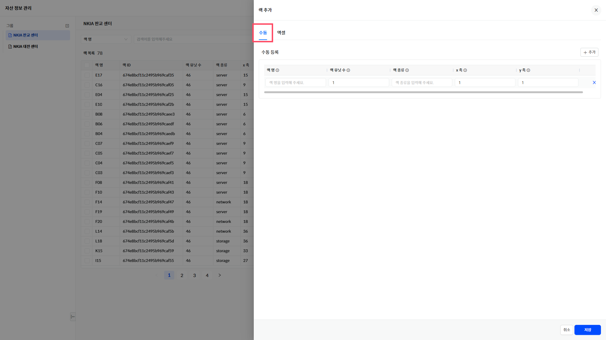

▶ \[그림10\] 랙 추가 (excel 방식) : 수동

▶ \[그림11\] 랙 추가 (excel 방식) : 엑셀

장비 추가 (excel 방식)

장비 목록 상단 “+” 아이콘을 선택하여 장비를 추가할수 있습니다. 장비 추가 방법은 “수동”과 “엑셀” 2가지 중 하나를 선택할 수 있습니다.

<table>
<tbody>
<tr class="odd">
<td>
노트

수동 : 사용자가 장비 하나씩 수동으로 추가하고 정보를 입력할 수 있습니다. 추후 개별 장비가 추가되었을 때 사용하면 편리합니다.

엑셀 : 대량의 장비를 등록할 때 사용합니다. 최초 구축 시 사용하면 편리합니다.

* 제공되는 문서 포멧은 장비 목록을 엑셀파일로 다운로드 받아 해당 문서에 장비 정보를 추가하여 사용합니다.
</td>
</tr>
</tbody>
</table>

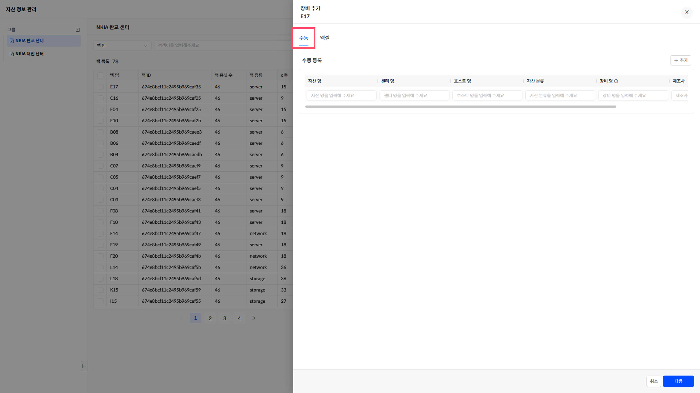

▶ \[그림12\] 장비 추가 (excel 방식) : 수동

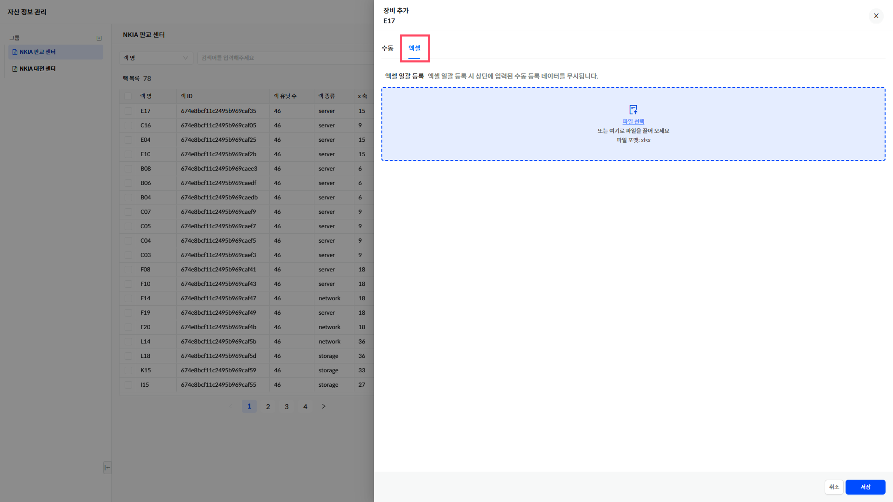

▶ \[그림13\] 장비 추가 (excel 방식) : 엑셀

<table>
<tbody>
<tr class="odd">
<td>
주의

주의: 그룹 생성 시 데이터연계를 “excel방식”을 선택했을 때만 해당 방식이 적용됩니다.

특정랙을 선택해야만 장비 추가 아이콘 “+”이 활성화 됩니다. 랙명을 선택하지 않으면 비활성화 됩니다.
</td>
</tr>
</tbody>
</table>

장비 추가 (polestar 연계 방식)

장비 목록 상단 “+” 아이콘을 선택하여 장비를 추가할수 있습니다. 추가 아이콘 선택 시 polestar에서 제공하는 장비목록이 자동으로 화면에 출력됩니다.

장비목록 중 해당 랙에 탑재해야할 장비를 추가선택하여 홀 위치와 사이즈, 가상장비 여부를 체크하여 저장하면 추가가 완료됩니다.

<table>
<tbody>
<tr class="odd">
<td>
노트

랙에 탑재된 장비는 장비목록에서 제외됩니다. 또한 신규로 등록된 장비는 자동으로 장비목록에 추가됩니다.
</td>
</tr>
</tbody>
</table>

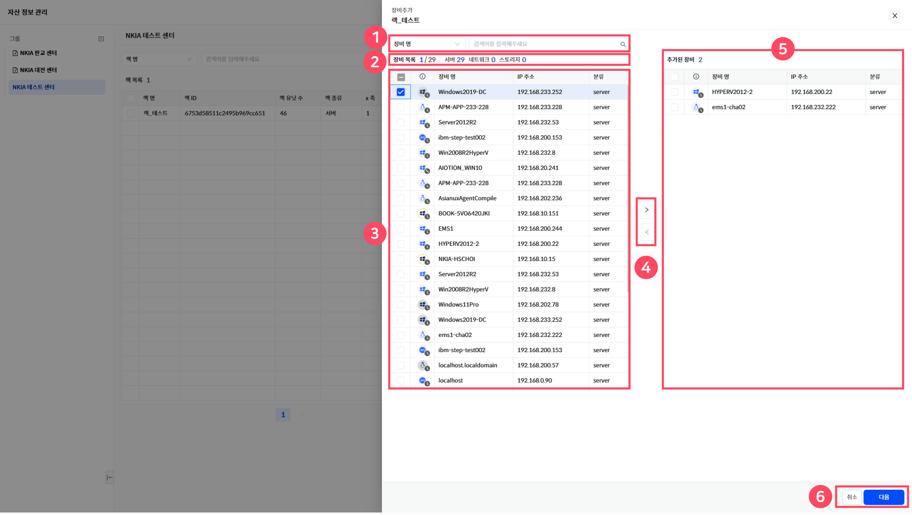

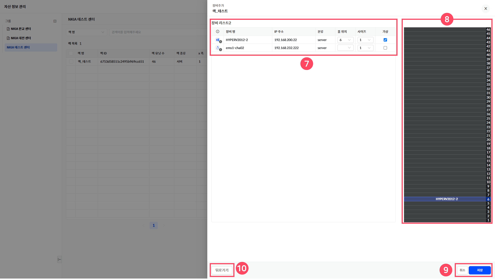

▶ \[그림14\] 장비 추가 (polestar연계 방식)

> 장비 추가 화면 설명

<table>
<thead>
<tr class="header">
<th>1. 장비검색</th>
<th>검색조건을 선택하고 검색어를 입력하여 장비 검색이 가능합니다..</th>
</tr>
</thead>
<tbody>
<tr class="odd">
<td>2. 장비 목록 및 장비 타입 수량</td>
<td>
랙에 추가할수 있는 장비 목록 수량 및 장비 타입별 수량이 출력됩니다.

* 해당 데이터는 polestar와 연계되어 자동으로 출력됩니다.
</td>
</tr>
<tr class="even">
<td>3. 장비 목록</td>
<td>
장비 전체 목록을 제공을 제공합니다.

* 해당 데이터는 polestar와 연계되어 자동으로 출력됩니다.
</td>
</tr>
<tr class="odd">
<td>4. 추가버튼</td>
<td>랙에 탑재할 장비를 선택하여 추가장비 영역으로 이동할수 있습니다.</td>
</tr>
<tr class="even">
<td>5. 추가장비목록</td>
<td>랙에 탑재할 추가장비 수량과 목록을 제공합니다.</td>
</tr>
<tr class="odd">
<td>6. 취소/다음</td>
<td>장비 추가 행위를 취소하거나 다음버튼을 클릭하여 추가작업을 진행할 수 있습니다.</td>
</tr>
<tr class="even">
<td>7. 추가장비 정보입력</td>
<td>추가된 장비의 홀위치와 사이즈, 가상장비 여부를 체크하여 상면에 필요한 정보 입력을 기재합니다.</td>
</tr>
<tr class="odd">
<td>8. 장비 탑재 미리보기</td>
<td>7번 추가장비 정보입력 시 랙에 장비가 어떻게 탑재되는지 실시간으로 화면으로 제공합니다.</td>
</tr>
<tr class="even">
<td>9. 취소/저장</td>
<td>장비 탑재를 취소하거나 최종 저장합니다.</td>
</tr>
<tr class="odd">
<td>10. 뒤로가기</td>
<td>추가로 탑재할 장비가 필요하거나 이전 작업화면으로 이동합니다.</td>
</tr>
</tbody>
</table>

<table>
<tbody>
<tr class="odd">
<td>
주의

주의 : 장비를 모두 랙에 탑재한 경우 장비목록은 보이지않습니다.
</td>
</tr>
</tbody>
</table>

