KMS(공지사항) 목록

<table>
<tbody>
<tr class="odd">
<td>
노트

공지사항은 시스템 운영과 관련된 주요 공지, 정책 안내, 업데이트 정보 등을 사용자에게 전달하기 위한 게시판입니다. 해당 메뉴는 지정된 권한이 있는 사용자만 등록 및 수정이 가능하며 일반 사용자는 조회 만할 수 있습니다.
</td>
</tr>
</tbody>
</table>

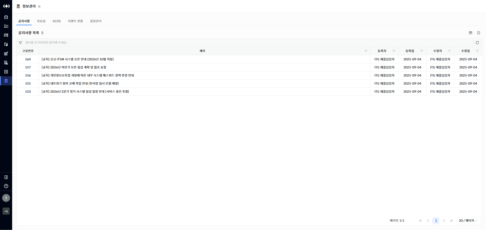

> ▶ \[그림1\] 공지사항 목록
> 
> 화면 지표

| 고유번호 | 공지사항의 고유번호를 나타내며 신규 등록 시, 자동으로 채번 됩니다. |
| ---- | -------------------------------------- |
| 제목   | 공지사항의 제목을 나타냅니다.                       |
| 등록자  | 공지사항을 최초로 등록한 사용자명입니다.                 |
| 등록일  | 공지사항이 최초로 등록된 날짜입니다.                   |
| 수정자  | 공지사항을 마지막으로 수정한 사용자명입니다.               |
| 수정일  | 공지사항이 마지막으로 수정된 날짜입니다.                 |

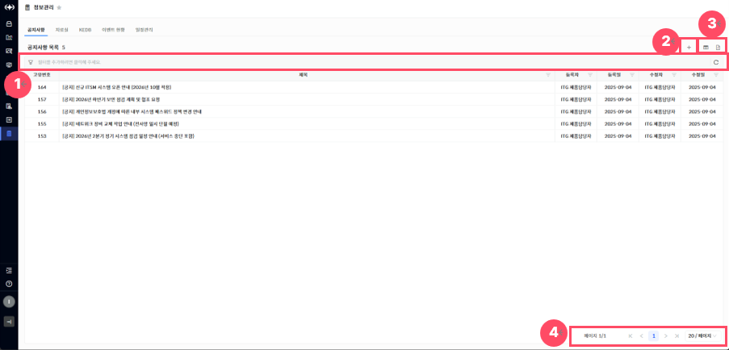

> ▶ \[그림2\] 공지사항 목록 상세 기능
> 
> 상세 정보

<table>
<thead>
<tr class="header">
<th>
[그림2].”1”

그리드 필터
</th>
<th>그리드 필터는 상단 행(필터 행)을 통해 각 컬럼 단위로 상세한 조건 검색이 가능한 기능입니다.</th>
</tr>
</thead>
<tbody>
<tr class="odd">
<td>
[그림2].”2”

신규등록 버튼
</td>
<td>클릭 시, 신규 공지사항을 등록할 수 있는 드로어가 열립니다.</td>
</tr>
<tr class="even">
<td>
[그림2].”3”

컬럼수정 &amp; 엑셀저장 버튼
</td>
<td>표시할 컬럼을 선택하거나 숨길 수 있는 설정 기능을 제공하는 컬럼수정 버튼과, 현재 화면에 표시된 데이터를 엑셀파일로 다운로드 하는 기능을 제공하는 엑셀저장 버튼입니다.</td>
</tr>
<tr class="odd">
<td>
[그림2].”4”

페이징
</td>
<td>목록 데이터를 구간별로 나누어 페이지 단위로 조회할 수 있도록 도와주는 기능입니다.</td>
</tr>
</tbody>
</table>

KMS(공지사항) 등록

<table>
<tbody>
<tr class="odd">
<td>
노트

공지사항을 등록할 수 있는 권한을 가진 사용자가 공지사항의 제목, 내용, 첨부파일 등을 입력하여 등록할 수 있습니다.
</td>
</tr>
</tbody>
</table>

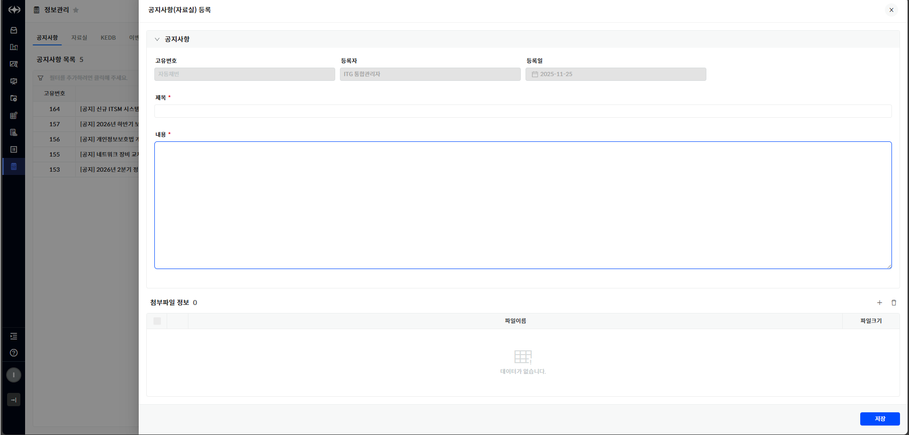

> ▶ \[그림3\] 공지사항 상세(등록)
> 
> 화면 지표

| 고유번호 | 공지사항의 고유번호를 나타내며 신규 등록 시, 자동으로 채번 됩니다. |
| ---- | -------------------------------------- |
| 등록자  | 공지사항을 등록한 사용자명입니다.                     |
| 등록일  | 공지사항이 최초 등록된 날짜입니다.                    |
| 제목   | 공지사항의 제목입니다.                           |
| 내용   | 공지사항의 세부내용입니다.                         |

> KMS(공지사항) 등록 절차

1.  공지사항 목록 우측 상단의 등록 버튼(\[그림2\].”2”)을 클릭합니다.

2.  화면(\[그림3\])의 필수 항목(\[ \* \] 모양의 표식이 되어있는 항목)을 입력합니다.

3.  화면 우측 하단의 \[저장\]버튼을 클릭합니다.

KMS(공지사항) 수정

<table>
<tbody>
<tr class="odd">
<td>
노트

공지사항을 수정할 수 있는 권한을 가진 사용자가 공지사항의 제목, 내용, 첨부파일 등을 수정하여 공지사항을 수정할 수 있습니다.
</td>
</tr>
</tbody>
</table>

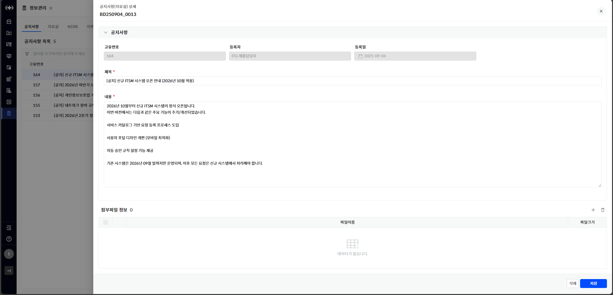

> ▶ \[그림4\] 공지사항 상세(수정)
> 
> KMS(공지사항) 수정 절차

1.  공지사항 목록 내 제목을 클릭합니다.

2.  화면(\[그림4\])의 필수 항목(\[ \* \] 모양의 표식이 되어있는 항목)을 입력합니다.

3.  화면 우측 하단의 \[저장\]버튼을 클릭합니다.

KMS(공지사항) 삭제

<table>
<tbody>
<tr class="odd">
<td>
노트

공지사항을 삭제할 수 있는 권한을 가진 사용자만 공지사항을 삭제할 수 있습니다.
</td>
</tr>
</tbody>
</table>

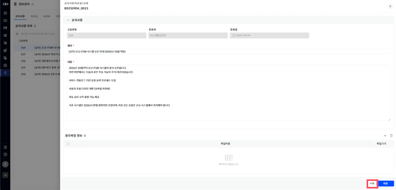

> ▶ \[그림5\] 공지사항 상세(삭제)
> 
> KMS(공지사항) 삭제 절차

1.  공지사항 목록 내 제목을 클릭합니다.

2.  화면 우측 하단의 \[삭제\]버튼 클릭합니다.

KMS(자료실) 목록

<table>
<tbody>
<tr class="odd">
<td>
노트

자료실은 업무에 필요한 문서, 양식, 매뉴얼 가이드 등을 사용자 간 공유할 수 있도록 구성된 게시판입니다. 모든 사용자는 자료 생성, 열람, 자료 다운로드를 할 수 있습니다.
</td>
</tr>
</tbody>
</table>

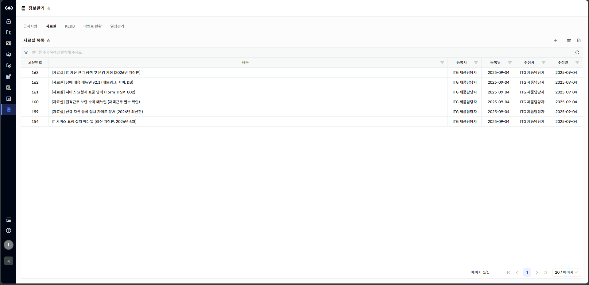

> ▶ \[그림6\] 자료실 목록
> 
> 화면 지표

| 고유번호 | 자료실의 고유번호를 나타내며 신규 등록 시, 자동으로 채번 됩니다. |
| ---- | ------------------------------------- |
| 제목   | 자료실의 제목을 나타냅니다.                       |
| 등록자  | 자료실을 최초로 등록한 사용자명입니다.                 |
| 등록일  | 자료실이 최초로 등록된 날짜입니다.                   |
| 수정자  | 자료실을 마지막으로 수정한 사용자명입니다.               |
| 수정일  | 자료실이 마지막으로 수정된 날짜입니다.                 |

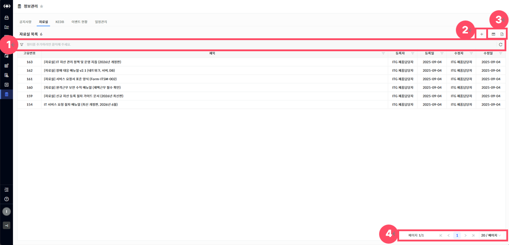

> ▶ \[그림7\] 자료실 목록 상세 기능
> 
> 상세 정보

<table>
<thead>
<tr class="header">
<th>
[그림7].”1”

그리드 필터
</th>
<th>그리드 필터는 상단 행(필터 행)을 통해 각 컬럼 단위로 상세한 조건 검색이 가능한 기능입니다.</th>
</tr>
</thead>
<tbody>
<tr class="odd">
<td>
[그림7].”2”

신규등록 버튼
</td>
<td>클릭 시, 신규 자료실을 등록할 수 있는 드로어가 열립니다.</td>
</tr>
<tr class="even">
<td>
[그림7].”3”

컬럼수정 &amp; 엑셀저장 버튼
</td>
<td>표시할 컬럼을 선택하거나 숨길 수 있는 설정 기능을 제공하는 컬럼수정 버튼과, 현재 화면에 표시된 데이터를 엑셀파일로 다운로드 하는 기능을 제공하는 엑셀저장 버튼입니다.</td>
</tr>
<tr class="odd">
<td>
[그림7].”4”

페이징
</td>
<td>목록 데이터를 구간별로 나누어 페이지 단위로 조회할 수 있도록 도와주는 기능입니다.</td>
</tr>
</tbody>
</table>

KMS(자료실) 등록

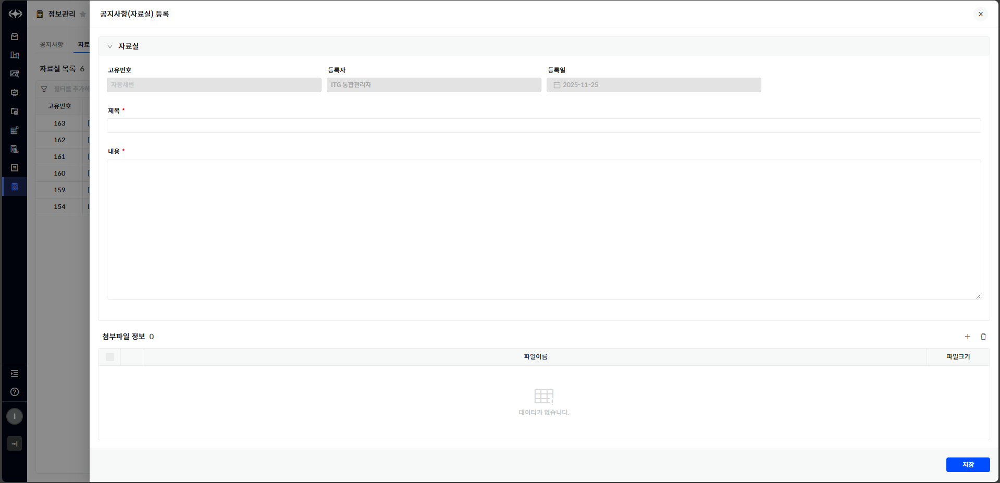

> ▶ \[그림8\] 자료실 상세(등록)
> 
> 화면 지표

| 고유번호 | 자료실의 고유번호를 나타내며 신규 등록 시, 자동으로 채번 됩니다. |
| ---- | ------------------------------------- |
| 등록자  | 자료실을 등록한 사용자명입니다.                     |
| 등록일  | 자료실이 최초로 등록된 날짜입니다.                   |
| 제목   | 자료실의 제목입니다.                           |
| 내용   | 자료실의 세부 내용입니다.                        |

> KMS(자료실) 등록 절차

1.  자료실 목록 우측 상단의 등록 버튼(\[그림7\].”2”)을 클릭합니다.

2.  화면(\[그림8\])의 필수 항목(\[ \* \] 모양의 표식이 되어있는 항목)을 입력합니다.

3.  화면 우측 하단의 \[저장\]버튼을 클릭합니다.

KMS(자료실) 수정

<table>
<tbody>
<tr class="odd">
<td>
노트

자료실 수정은 작성자 본인 혹은 관리자 권한을 가진 사용자만 할 수 있습니다.
</td>
</tr>
</tbody>
</table>

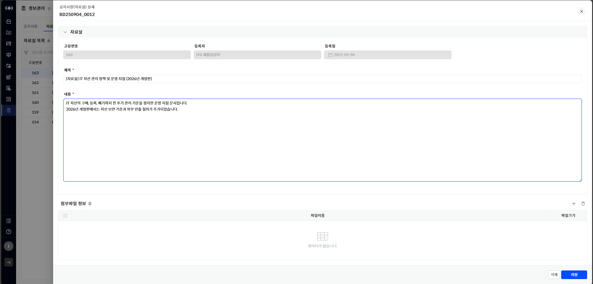

> ▶ \[그림9\] 자료실 상세(수정)
> 
> KMS(자료실) 수정 절차

1.  자료실 목록 내 제목을 클릭합니다.

2.  화면(\[그림8\])의 필수 항목(\[ \* \] 모양의 표식이 되어있는 항목)을 입력합니다.

3.  화면 우측 하단의 \[저장\]버튼을 클릭합니다.

KMS(자료실) 삭제

<table>
<tbody>
<tr class="odd">
<td>
노트

자료 삭제 작성자 본인 혹은 관리자 권한을 가진 사용자만 할 수 있습니다.
</td>
</tr>
</tbody>
</table>

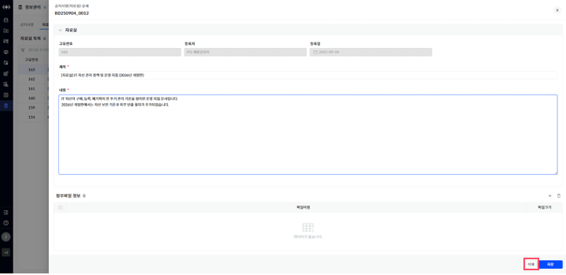

> ▶ \[그림10\] 자료실 상세(삭제)
> 
> KMS(공지사항) 삭제 절차

1.  자료실 목록 내 제목을 클릭합니다.

2.  화면 우측 하단의 \[삭제\]버튼 클릭합니다.

KMS(KEDB) 목록

<table>
<tbody>
<tr class="odd">
<td>
노트

KEDB(Known Error Database)는 시스템 운영 중 발생했던 자주 발생하는 오류와 그에 대한 해결 방안을 정리하여 모든 사용자가 쉽게 검색하고 참조할 수 있도록 구성된 지식 공유형 게시판입니다.
</td>
</tr>
</tbody>
</table>

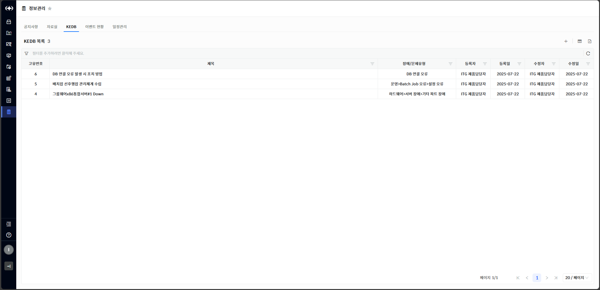

> ▶ \[그림11\] KEDB목록
> 
> 화면 지표

| 고유번호    | KEDB 항목의 고유번호를 나타냅니다.       |
| ------- | --------------------------- |
| 제목      | 해당 오류 사례의 제목을 나타냅니다.        |
| 장애/문제유형 | 오류가 발생한 영역 또는 사례 유형을 나타냅니다. |
| 등록자     | KEDB 항목을 최초로 등록한 사용자명입니다.   |
| 등록일     | KEDB가 최초로 등록된 날짜입니다.        |
| 수정자     | KEDB 항목을 마지막으로 수정한 사용자명입니다. |
| 수정일     | KEDB가 마지막으로 수정된 날짜입니다.      |

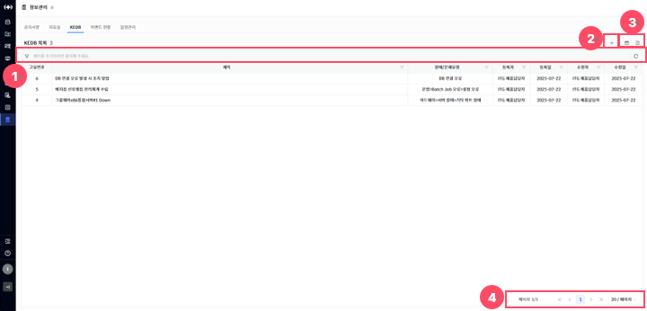

> ▶ \[그림12\] KEDB 목록 상세 기능
> 
> 상세 정보

<table>
<thead>
<tr class="header">
<th>
[그림12].”1”

그리드 필터
</th>
<th>그리드 필터는 상단 행(필터 행)을 통해 각 컬럼 단위로 상세한 조건 검색이 가능한 기능입니다.</th>
</tr>
</thead>
<tbody>
<tr class="odd">
<td>
[그림12].”2”

신규등록 버튼
</td>
<td>KEDB를 신규등록 할 수 있는 등록화면(드로어)를 여는 기능을 제공하는 신규등록 버튼입니다.</td>
</tr>
<tr class="even">
<td>
[그림12].”3”

컬럼수정 &amp; 엑셀저장 버튼
</td>
<td>표시할 컬럼을 선택하거나 숨길 수 있는 설정 기능을 제공하는 컬럼수정 버튼과, 현재 화면에 표시된 데이터를 엑셀파일로 다운로드 하는 기능을 제공하는 엑셀저장 버튼입니다.</td>
</tr>
<tr class="odd">
<td>
[그림12].”4”

페이징
</td>
<td>목록 데이터를 구간별로 나누어 페이지 단위로 조회할 수 있도록 도와주는 기능입니다.</td>
</tr>
</tbody>
</table>

KMS(KEDB) 등록

<table>
<tbody>
<tr class="odd">
<td>
노트

KEDB의 장애/문제유형, 출처, 제목, 내용, 응급처리내용, 원인내용, 재발방지 대책방안, 첨부파일 등을 입력하여 KEDB를 등록할 수 있습니다.
</td>
</tr>
</tbody>
</table>

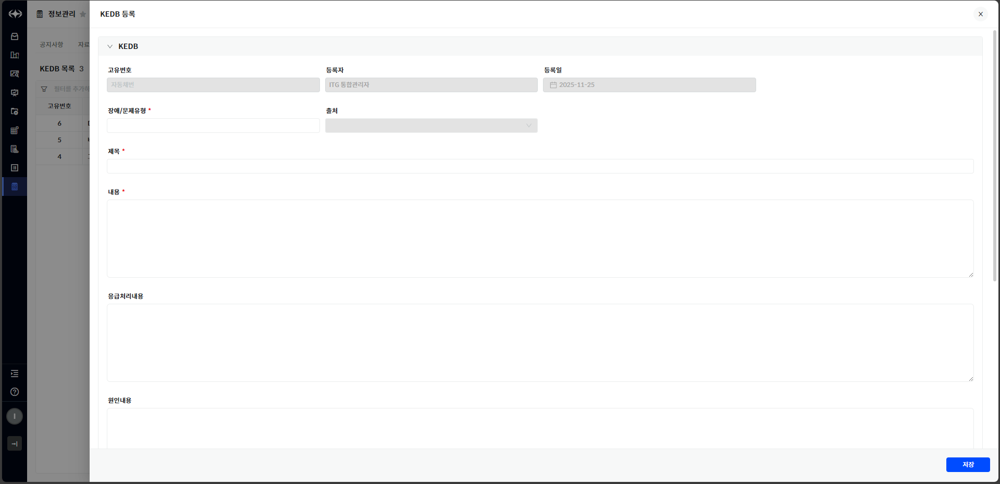

> ▶ \[그림13\] KEDB 상세(등록)
> 
> 화면 지표

| 고유번호      | KEDB의 고유번호를 나타내며 신규 등록 시, 자동으로 채번됩니다.         |
| --------- | --------------------------------------------- |
| 등록자       | KEDB를 등록한 사용자명입니다.                            |
| 등록일       | KEDB를 최초로 등록한 날짜입니다.                          |
| 장애/문제유형   | 오류가 발생한 영역 또는 사례 유형을 나타냅니다.                   |
| 출처        | 사례 발생의 출처 또는 참조 시스템, 사용자 요청 등을 나타냅니다.         |
| 제목        | 장애 또는 문제 사례의 핵심 요지를 나타내는 제목입니다.               |
| 내용        | 문제의 상황 및 전반적인 설명 내용입니다.                       |
| 응급처리내용    | 문제 발생 시 즉각적으로 수행한 응급조치 내역입니다.                 |
| 원인내용      | 기술적 또는 운영적인 원인 분석 내용입니다.                      |
| 재발방지 대책방안 | 동일한 문제가 발생하지 않도록 하기 위한 사전 조치 및 프로세스 개선 방안입니다. |

> KMS(KEDB) 등록 절차

1.  KEDB 목록 우측 상단의 등록 버튼(\[그림12\].”2”)을 클릭합니다.

2.  화면(\[그림13\])의 필수 항목(\[ \* \] 모양의 표식이 되어있는 항목)을 입력합니다.

3.  화면 우측 하단의 \[저장\]버튼을 클릭합니다.

KMS(KEDB) 수정

<table>
<tbody>
<tr class="odd">
<td>
노트

KEDB는 등록 방식에 따라 출처가 “요청” 또는 “직접등록”으로 구분됩니다.

<ul>
<li>
요청: [ITSM 요청]을 통해 자동 등록된 경우(수정불가)
</li>
<li>
직접등록: [정보관리&gt; KEDB 등록] 메뉴를 통해 직접 등록한 경우(수정가능)
</li>
</ul></td>
</tr>
</tbody>
</table>

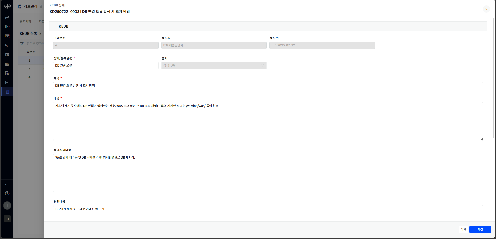

> ▶ \[그림14\] KEDB 상세(수정)
> 
> KMS(KEDB) 수정 절차

1.  KEDB 목록 내 제목을 클릭합니다.

2.  화면(\[그림14\])의 필수 항목(\[ \* \] 모양의 표식이 되어있는 항목)을 입력합니다.

3.  화면 우측 하단의 \[저장\]버튼을 클릭합니다.

KMS(KEDB) 삭제

<table>
<tbody>
<tr class="odd">
<td>
노트

KEDB를 삭제할 수 있는 권한을 가진 사용자만 KEDB 항목을 삭제할 수 있습니다.
</td>
</tr>
</tbody>
</table>

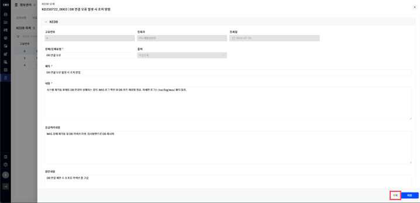

> ▶ \[그림15\] KEDB 상세(삭제)
> 
> KMS(KEDB) 삭제 절차

1.  KEDB 목록 내 제목을 클릭합니다.

2.  화면 우측 하단의 \[삭제\]버튼을 클릭합니다.

KMS(이벤트 현황) 목록

<table>
<tbody>
<tr class="odd">
<td>
노트

KEDB(Known Error Database)는 시스템 운영 중 발생했던 자주 발생하는 오류와 그에 대한 해결 방안을 정리하여 모든 사용자가 쉽게 검색하고 참조할 수 있도록 구성된 지식 공유형 게시판입니다.
</td>
</tr>
</tbody>
</table>

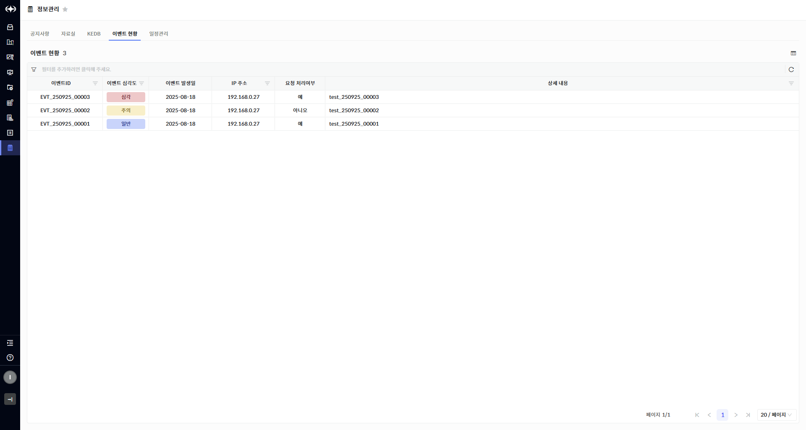

> ▶ \[그림16\] 이벤트 현황 목록
> 
> 화면 지표

| 이벤트ID   | 이벤트 항목의 고유번호를 나타냅니다.              |
| ------- | --------------------------------- |
| 이벤트 심각도 | 이벤트 항목의 심각도를 나타냅니다.               |
| 이벤트 발생일 | 이벤트가 발생한 날짜입니다.                   |
| IP주소    | 이벤트가 발생한 IP 주소를 나타냅니다.            |
| 요청 처리여부 | 이벤트가 장애요청 등 요청에 등록 처리되었는지를 나타냅니다. |
| 상세내용    | 이벤트의 세부사항 및 내용을 나타냅니다.            |

KMS(일정관리) 목록

<table>
<tbody>
<tr class="odd">
<td>
노트

KEDB(Known Error Database)는 시스템 운영 중 발생했던 자주 발생하는 오류와 그에 대한 해결 방안을 정리하여 모든 사용자가 쉽게 검색하고 참조할 수 있도록 구성된 지식 공유형 게시판입니다.
</td>
</tr>
</tbody>
</table>

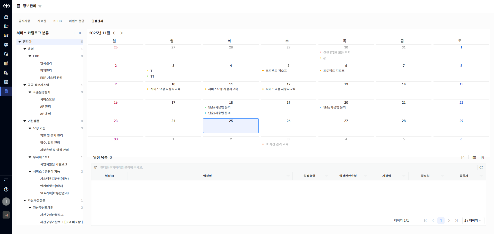

> ▶ \[그림17\] 일정관리 목록
> 
> 화면 지표

<table>
<thead>
<tr class="header">
<th>일정ID</th>
<th>해당 일정의 고유 식별번호입니다.</th>
</tr>
</thead>
<tbody>
<tr class="odd">
<td>일정 명</td>
<td>등록된 일정의 제목입니다.</td>
</tr>
<tr class="even">
<td>일정유형</td>
<td>
일정이 생성된 방식을 구분합니다.

- 직접등록 : 사용자가 직접 등록한 일정

- 요청 : 관련 요청이 생성된 일정

- 기타 : 위 유형 외 다른 방식으로 등록된 일정
</td>
</tr>
<tr class="odd">
<td>일정권한유형</td>
<td>
해당 일정을 어떤 범위의 사용자에게 표시할지 결정하는 권한 유형입니다.

- 개인 : 일정 등록자 본인만 확인할 수 있습니다.

- 부서 : 해당 부서에 속한 사용자들이 일정을 확인할 수 있습니다.

- 서비스카탈로그 : 지정된 서비스카탈로그를 보유한 사용자들이 일정을 확인할 수 있습니다.
</td>
</tr>
<tr class="even">
<td>시작일</td>
<td>일정이 시작되는 날짜입니다.</td>
</tr>
<tr class="odd">
<td>종료일</td>
<td>일정이 종료되는 날짜입니다.</td>
</tr>
<tr class="even">
<td>등록자</td>
<td>해당 일정을 등록한 사용자 정보가 표시됩니다.</td>
</tr>
</tbody>
</table>

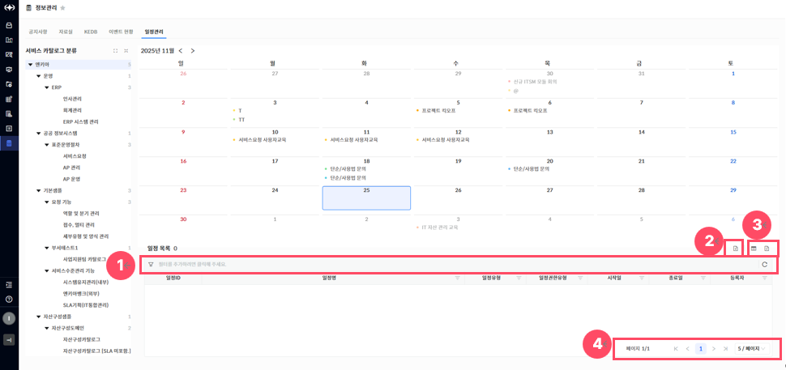

> ▶ \[그림18\] 일정관리 목록 상세 기능
> 
> 상세 정보

<table>
<thead>
<tr class="header">
<th>
[그림18].”1”

그리드 필터
</th>
<th>그리드 필터는 상단 행(필터 행)을 통해 각 컬럼 단위로 상세한 조건 검색이 가능한 기능입니다.</th>
</tr>
</thead>
<tbody>
<tr class="odd">
<td>
[그림18].”2”

신규등록 버튼
</td>
<td>클릭 시, 신규 일정을 등록할 수 있는 드로어가 열립니다.</td>
</tr>
<tr class="even">
<td>
[그림18].”3”

컬럼수정 &amp; 엑셀저장 버튼
</td>
<td>표시할 컬럼을 선택하거나 숨길 수 있는 설정 기능을 제공하는 컬럼수정 버튼과, 현재 화면에 표시된 데이터를 엑셀파일로 다운로드 하는 기능을 제공하는 엑셀저장 버튼입니다.</td>
</tr>
<tr class="odd">
<td>
[그림18].”4”

페이징
</td>
<td>목록 데이터를 구간별로 나누어 페이지 단위로 조회할 수 있도록 도와주는 기능입니다.</td>
</tr>
</tbody>
</table>

KMS(일정관리) 등록

<table>
<tbody>
<tr class="odd">
<td>
노트

서비스 카탈로그 분류 트리에서 하위 노드를 선택해야 일정 등록이 가능합니다.
</td>
</tr>
</tbody>
</table>

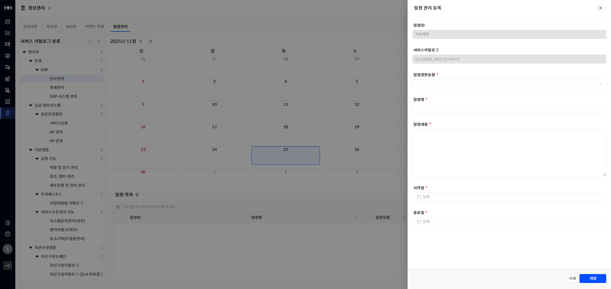

> ▶ \[그림19\] 일정관리 상세(등록)
> 
> 화면 지표

<table>
<thead>
<tr class="header">
<th>일정ID</th>
<th>일정의 고유번호를 나타내며 신규 등록 시, 자동으로 채번됩니다.</th>
</tr>
</thead>
<tbody>
<tr class="odd">
<td><strong>서비스카탈로그</strong></td>
<td>선택한 서비스카탈로그ID, 서비스카탈로그명입니다.</td>
</tr>
<tr class="even">
<td>일정권한유형</td>
<td>
해당 일정을 어떤 범위의 사용자에게 표시할지 결정하는 권한 유형입니다.

- 개인 : 일정 등록자 본인만 확인할 수 있습니다.

- 부서 : 해당 부서에 속한 사용자들이 일정을 확인할 수 있습니다.

- 서비스카탈로그 : 지정된 서비스카탈로그를 보유한 사용자들이 일정을 확인할 수 있습니다.
</td>
</tr>
<tr class="odd">
<td>일정 명</td>
<td>일정의 제목입니다.</td>
</tr>
<tr class="even">
<td>일정내용</td>
<td>일정의 내용입니다.</td>
</tr>
<tr class="odd">
<td>시작일</td>
<td>일정이 시작되는 날짜입니다.</td>
</tr>
<tr class="even">
<td>종료일</td>
<td>일정이 종료되는 날짜입니다.</td>
</tr>
</tbody>
</table>

> KMS(일정관리) 등록 절차

1.  일정관리 목록 우측 상단의 등록 버튼(\[그림18\].”2”)을 클릭합니다.

2.  화면(\[그림19\])의 필수 항목(\[ \* \] 모양의 표식이 되어있는 항목)을 입력합니다.

3.  화면 우측 하단의 \[저장\]버튼을 클릭합니다.

KMS(일정관리) 수정

<table>
<tbody>
<tr class="odd">
<td>
노트

일정관리를 수정할 수 있는 권한을 가진 사용자와 해당 일정을 등록한 사용자만 수정할 수 있습니다.
</td>
</tr>
</tbody>
</table>

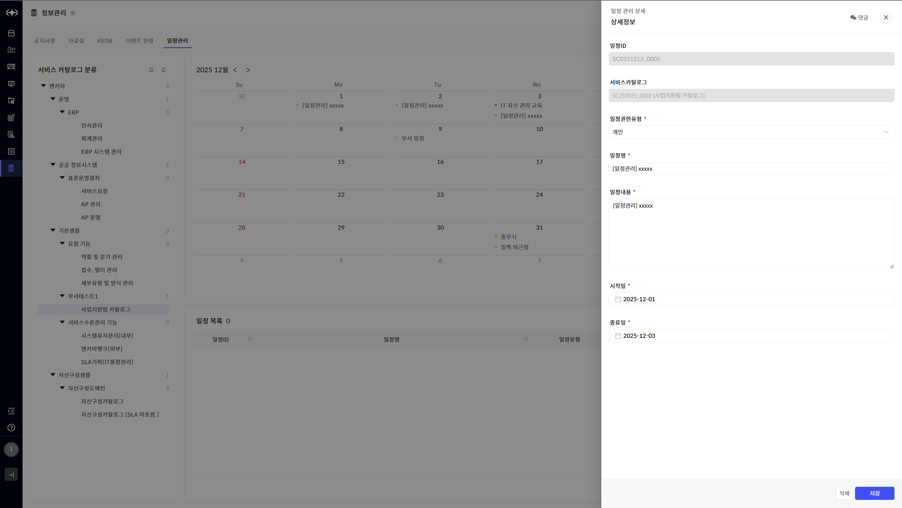

> ▶ \[그림20\] 일정관리 상세(수정)
> 
> KMS(일정관리) 수정 절차

1.  공지사항 목록 내 제목을 클릭합니다.

2.  화면(\[그림4\])의 필수 항목(\[ \* \] 모양의 표식이 되어있는 항목)을 입력합니다.

3.  화면 우측 하단의 \[저장\]버튼을 클릭합니다.

KMS(일정관리) 삭제

<table>
<tbody>
<tr class="odd">
<td>
노트

일정관리를 삭제할 수 있는 권한을 가진 사용자와 해당 일정을 등록한 사용자만 삭제할 수 있습니다.
</td>
</tr>
</tbody>
</table>

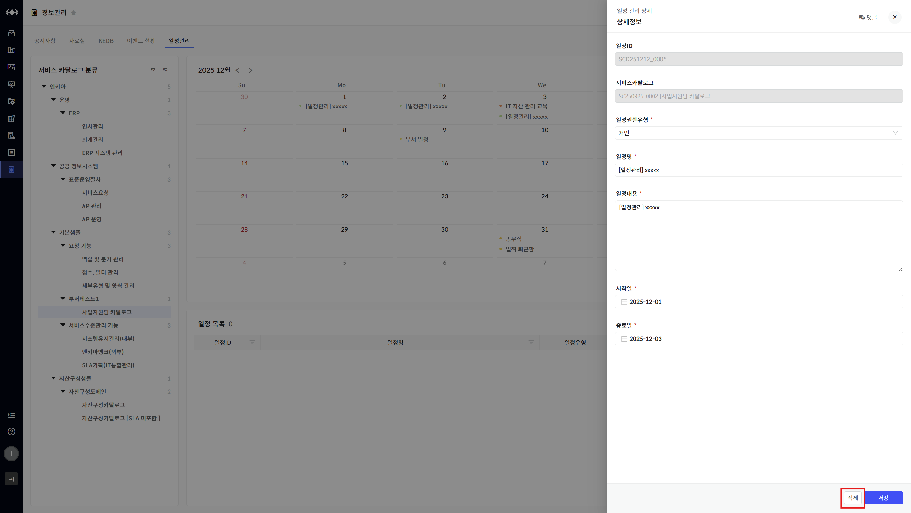

> ▶ \[그림21\] 일정관리 상세(삭제)
> 
> KMS(일정관리) 삭제 절차

1.  일정관리 목록 내 제목을 클릭합니다.

2.  화면 우측 하단의 \[삭제\]버튼 클릭합니다.

