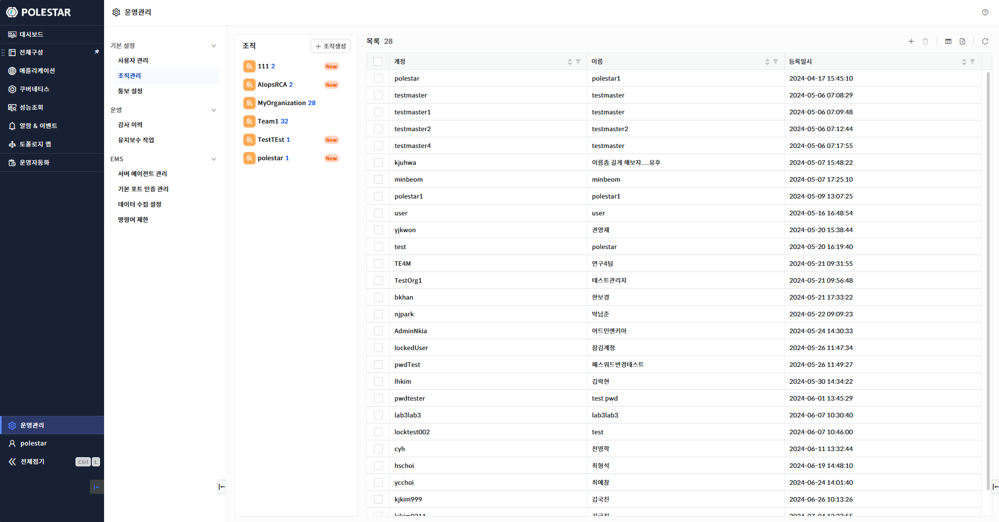
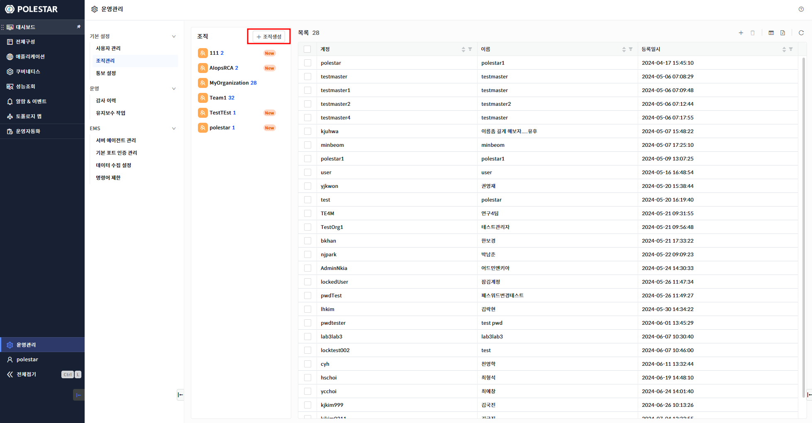
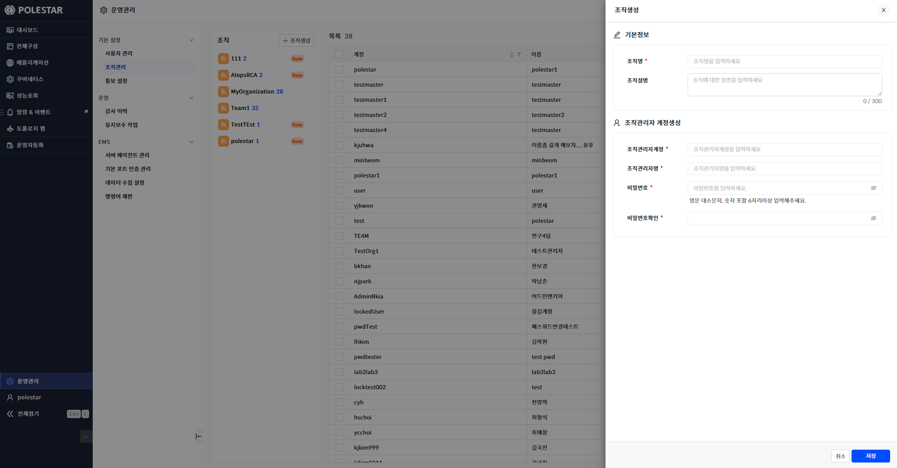
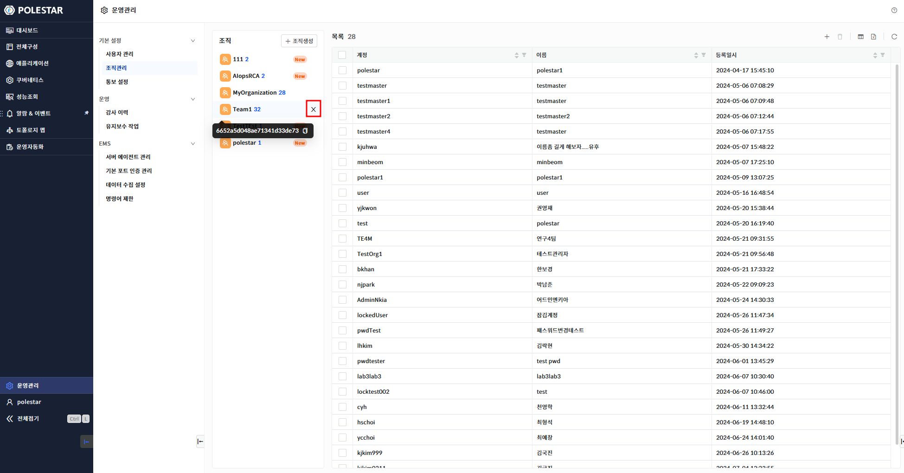
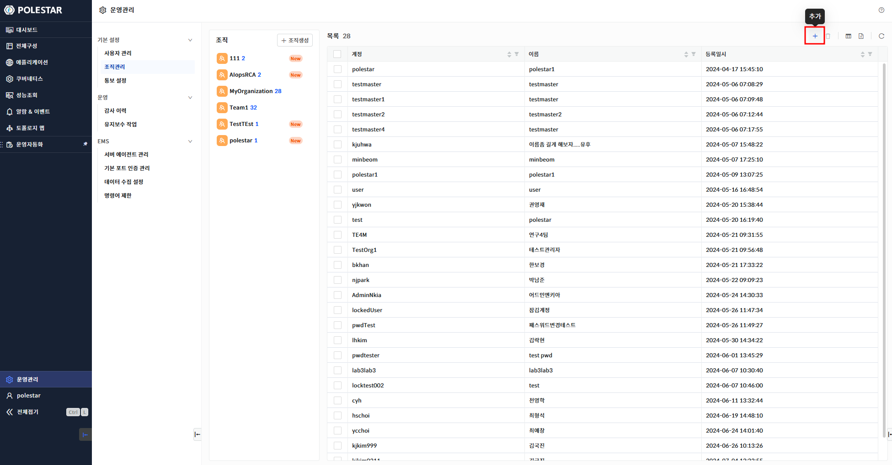
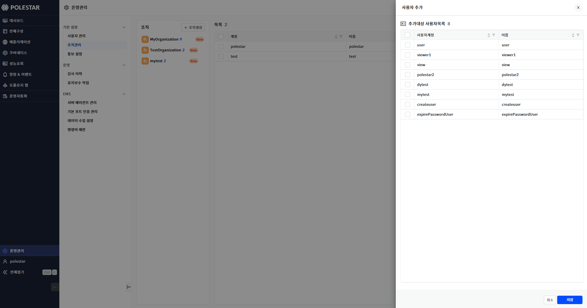
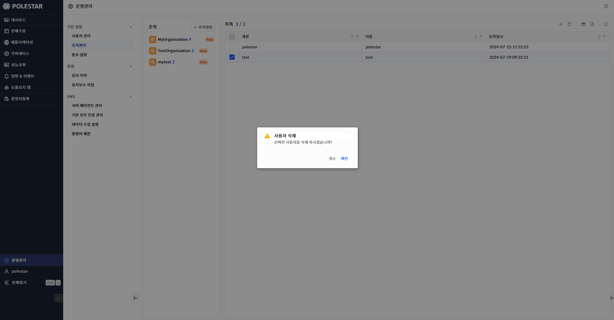
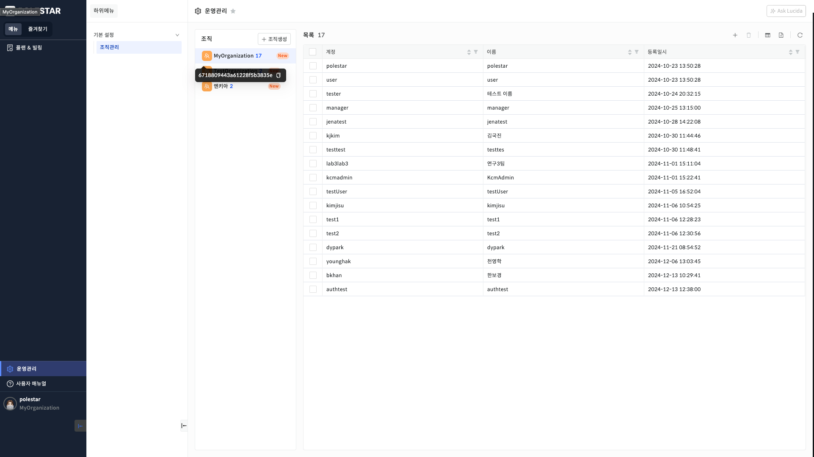

조직 관리

운영관리에서 \[조직관리\]를 선택하면 조직 관리 화면을 확인할 수 있습니다.

\[그림 1 조직 관리\] 표시 영역의 좌측에서 조직을 생성하거나 삭제할 수 있습니다.

좌측에서 조직 정보를 선택한 후, 우측에서 해당 조직에 할당된 계정을 확인할 수 있습니다.

▶ \[그림1\] 조직 관리

<table>
<tbody>
<tr class="odd">
<td>
노트

조직관리 메뉴는 polestar 계정일때만 표시됩니다.
</td>
</tr>
</tbody>
</table>

조직 생성

\[그림 1 조직 관리\] 표시 영역의 좌측에서 조직생성 버튼을 클릭하면 조직을 생성할 수 있습니다.

▶ \[그림2\] 조직 생성 버튼

▶ \[그림3\] 조직 생성 드로어

화면 지표

<table>
<thead>
<tr class="header">
<th>조직명</th>
<th>
조직의 이름을 입력합니다.

작성규칙 : 2 ~ 20 자리의 문자, 숫자만 입력
</th>
</tr>
</thead>
<tbody>
<tr class="odd">
<td>조직설명</td>
<td>조직에 대한 설명을 입력합니다.</td>
</tr>
<tr class="even">
<td>조직관리자계정</td>
<td>
조직의 관리자 계정을 입력합니다.

조직이 생성될 때 자동으로 할당되는 admin 계정과 동일한 이름은 등록할 수 없습니다.

작성규칙 : 1 ~ 50 자리의 문자, 숫자만 입력
</td>
</tr>
<tr class="odd">
<td>조직관리자명</td>
<td>
조직 관리자의 이름을 입력합니다.

작성규칙 : 1 ~ 50 자리의 문자, 숫자만 입력
</td>
</tr>
<tr class="even">
<td>비밀번호</td>
<td>
조직 관리자의 비밀번호를 입력합니다.

작성규칙 : 6 ~ 20 자리 영문, 대소문자, 숫자만 입력
</td>
</tr>
<tr class="odd">
<td>비밀번호확인</td>
<td>입력한 비밀번호와 동일한 비밀번호를 입력합니다.</td>
</tr>
</tbody>
</table>

조직 생성 절차

1.  좌측 영역 상단의 \[조직생성\] 버튼 클릭

2.  기본 정보 입력

3.  조직 관리자 계정 정보 입력

4.  \[저장\] 버튼 클릭

<table>
<tbody>
<tr class="odd">
<td>
노트

조직이 생성될 때, admin 계정은 자동으로 할당됩니다.
</td>
</tr>
</tbody>
</table>

조직 삭제

조직을 삭제할 수 있습니다.

▶ \[그림4\] 조직 삭제

조직 삭제 절차

1.  좌측 영역 조직에 마우스 커서 올리기(Mouse hover)

2.  커서를 올렸을 때 나타나는 \[X\] 버튼 클릭

3.  메시지창에서 \[확인\] 클릭

<table>
<tbody>
<tr class="odd">
<td>
노트

관리자 조직은 삭제할 수 없습니다. 또한, 조직에 할당된 사용자 계정이 있다면, 할당된 계정을 모두 제거한 후에 삭제할 수 있습니다.
</td>
</tr>
</tbody>
</table>

사용자 추가

조직에 사용자의 계정을 추가할 수 있습니다.

▶ \[그림5\] 사용자 추가 버튼

사용자 목록에는 현재 조직에 할당된 계정 외의 계정이 표시됩니다.

▶ \[그림6\] 사용자 추가 드로어

화면 지표

| 사용자계정 | 현재 조직에 할당된 사용자 계정 외의 계정이 표시됩니다. |
| ----- | ------------------------------- |
| 이름    | 사용자의 이름이 표시됩니다.                 |

사용자 추가 절차

1.  테이블 우측 상단의 \[+\] 아이콘 클릭

2.  추가할 계정의 체크 박스 클릭

3.  \[저장\] 버튼 클릭

사용자 삭제

조직에 할당된 사용자를 삭제할 수 있습니다.

▶ \[그림7\] 사용자 삭제

> 사용자 삭제 절차

1.  계정 목록에서 삭제할 계정의 체크 박스 클릭

2.  테이블 우측 상단의 삭제 아이콘 클릭

3.  메시지창에서 \[확인\] 클릭

조직 키 확인

조직 리스트에 마우스 커서를 호버 시, 조직의 키를 툴팁으로 표시합니다.

▶ \[그림8\] 조직 키 확인

