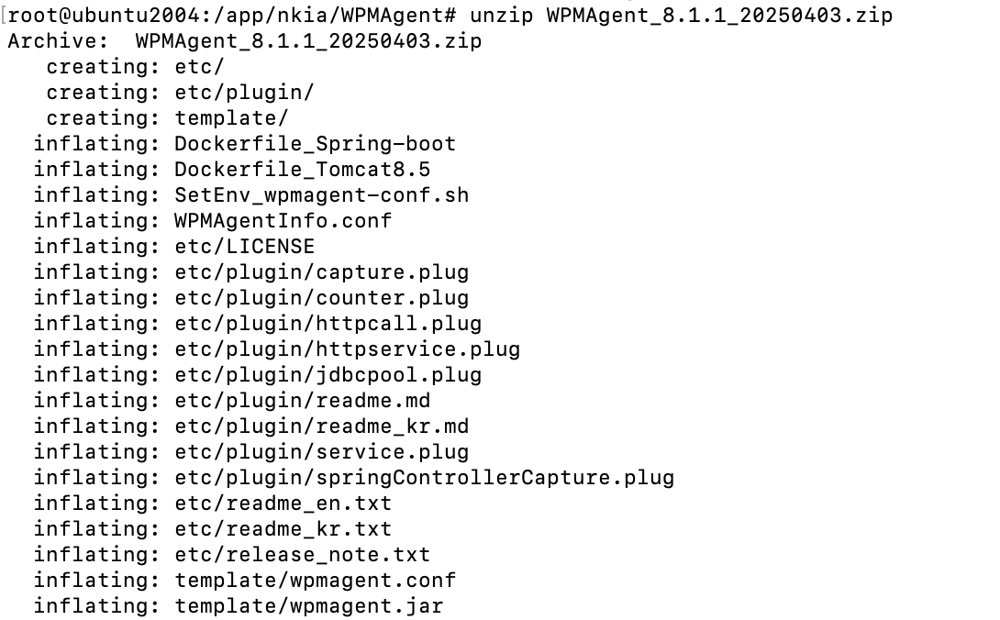
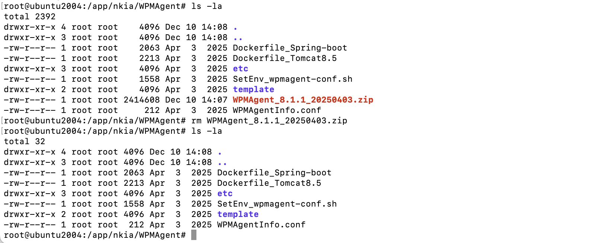
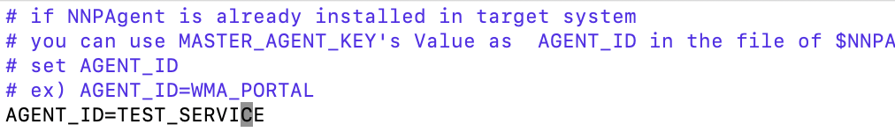
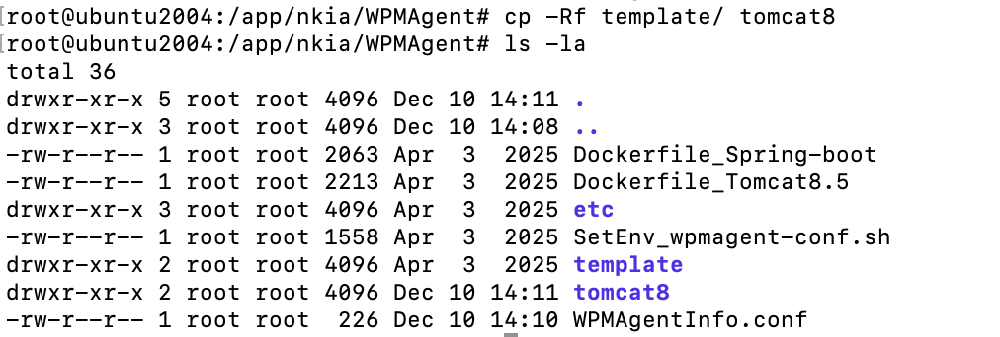
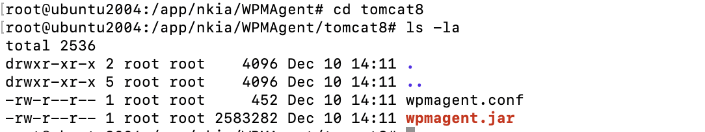
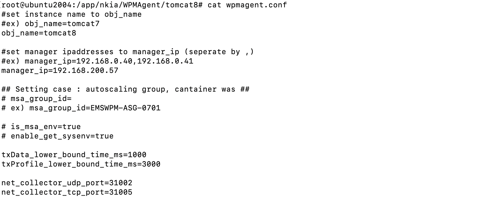
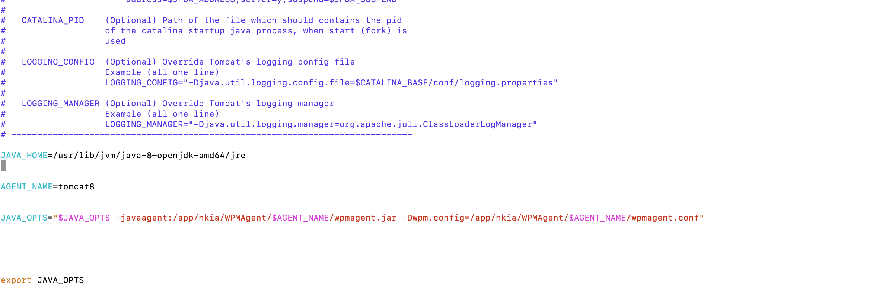

WPM Java Agent 설치

Java 애플리케이션 관제를 위해서는 WPM Java Agent를 다운 받고 관제 대상인 Java 애플리케이션의 설정 파일에 옵션을 설정하여 설치합니다.

설치 전 사전 준비 사항 확인 및 준비하여 설치 절차로 수행하면 WPM Java Agent를 설치 할 수 있습니다.

사전 준비 사항

WPM java Agent를 설치 전에 미리 준비 할 내용을 확인하고 준비를 해야 합니다.

> 사전 준비 항목

| 전송주소    | WPM Java Agent가 데이터 수신할 Polestar10에 전송할 URL 주소      |
| ------- | --------------------------------------------------- |
| 접근권한    | WPM Java Agent가 설치할 디렉토리에 대한 애플리케이션에서 읽기 권한이 있는지 확인 |
| 서비스 이름  | 애플리케이션이 등록될 서비스 이름                                  |
| 에이전트 이름 | 애플리케이션의 에이전트 이름                                     |

WPM Agent 설치

사전 준비 사항을 확인 하셨다면 아래의 절차대로 수행하여 WPM Agent를 설치 할 수 있습니다.

> 설치 디렉토리 생성 및 업로드

1.  WPM Agent 설치 할 디렉토리 생성합니다.

> Java 애플리케이션 기동 아이디로 접근권한과 에이전트 로그 파일 등을 위한 쓰기 권한이 있어야 합니다.

2.  WPM 에이전트 설차 파일을 생성한 디렉토리에 업로드합니다.

> WPMAgent 설치

1.  WPM 에이전트의 압축을 풀어줍니다.

|                                      |
| ------------------------------------ |
| unzip WPMAgent\_8\_X.X\_YYYYMMDD.zip |

2.  WPM 에이전트의 간단한 설치 가이드는 etc 아래의 readme파일을 참고하실 수 있습니다.

3.  WPMAgent 디렉토리 아래의 WPMAgentInfo.conf 파일을 열어 서비스 이름을 설정해줍니다.

|                      |
| -------------------- |
| vi WPMAgentInfo.conf |

|                |
| -------------- |
| AGENT\_ID=서비스명 |

4.  WPMAgent디렉토리 아래의 template 디렉토리를 복사하여 에이전트별 디렉토리를 생성해줍니다.

> 예를 들어 에이전트 이름을 tomcat8로 생성하고자 할 경우 아래와 같은 명령어를 입력합니다.

|                        |
| ---------------------- |
| cp -Rf template 에이전트이름 |

5.  에이전트별 디렉토리가 생성되었다면 해당 디렉토리로 이동 후 wpmagent.conf파일을 편집합니다.

<table>
<tbody>
<tr class="odd">
<td>
obj_name=에이전트이름

manager_ip=수집서버IP
</td>
</tr>
</tbody>
</table>

OS별 WPM Agent 구성 설정 템플릿

WPM Agent 설치 시 OS별 구성 템플릿을 복사 후 환경에 맞게 변경하여 사용 할 수 있습니다.

> Linux 환경

<table>
<tbody>
<tr class="odd">
<td>
AGENT_NAME=&lt;에이전트명&gt;

JAVA_OPTS="$JAVA_OPTS -javaagent: &lt;WPMAgent경로&gt;

/$AGENT_NAME/wpmagent.jar"

JAVA_OPTS="$JAVA_OPTS -Dwpm.config=/$WPMAGENT_PATH/$AGENT_NAME/wpmagent.conf"
</td>
</tr>
</tbody>
</table>

간단한 옵션 설치는

|                                                                                                                             |
| --------------------------------------------------------------------------------------------------------------------------- |
| JAVA\_OPTS="$JAVA\_OPTS -javaagent:\<애플리케이션별 에이전트 설치경로\>/wpmagent.jar" -Dwpm.config=\<애플리케이션별 에이전트 설치경로\>/wpmagent.conf" |

> 
> 
> Window 환경

<table>
<tbody>
<tr class="odd">
<td>
set AGENT_NAME=&lt;에이전트명&gt;

set JAVA_OPTS="%JAVA_OPTS% -javaagent:&lt;WPMAgent 경로&gt;\%AGENT_NAME%\wpmagent.jar"

set JAVA_OPTS="%JAVA_OPTS% -Dwpm.config=&lt;WPMAgent 경로&gt;\%AGENT_NAME%wpmagent.conf"
</td>
</tr>
</tbody>
</table>

간단한 옵션 설치는

|                                                                                                                                  |
| -------------------------------------------------------------------------------------------------------------------------------- |
| set JAVA\_OPTS="%JAVA\_OPTS% -javaagent: \<애플리케이션별 에이전트 설치경로\>/wpmagent.jar -Dwpm.config=\<애플리케이션별 에이전트 설치경로\>/wpmagent.conf" |

> WPMAgent 실행 및 적용 확인

1.  Java 애플리케이션 재시작을 한다.

2.  각 에이전트별 에이전트의 logs 디렉토리에 로그가 생성되는지 확인합니다.

3.  애플리케이션이 정상적으로 동작하는지 확인합니다

설치 예 : Tomcat (on Linux)

1.  에이전트 수집 환경 설정 파일에 수집서버IP(Polestar EMS IP와 포트)와 APM 수집포트 조직ID, 에이전트 이름, 서비스 이름은 설치환경에 맞게 수정해주세요.

2.  파일명 : $(TOMCAT\_HOME)/bin/catalina.sh

> Tomcat디렉토리/bin의 catalina.sh 파일을 vi와 같은 편집기로 열어 옵션을 설정합니다.

3.  샘플 예시

<!-- end list -->

  - 에이전트 파일 위치 : /app/nkia/WPMAgent/tomcat8

  - 에이전트 이름 : tomcat8

  - 서비스 이름 : nkia\_groupware

<!-- end list -->

4.  WPMAgentInfo.conf 파일에 서비스명을 설정합니다.

<table>
<tbody>
<tr class="odd">
<td>
# if NNPAgent is already installed in target system

# you can use MASTER_AGENT_KEY's Value as AGENT_ID in the file of $NNPAgentHome$/conf/MasterAgent.conf

# set AGENT_ID

# ex) AGENT_ID=WMA_PORTAL

AGENT_ID=TEST_SERVICE 서비스 이름을 설정합니다.
</td>
</tr>
</tbody>
</table>

5.  에이전트별 wpmagent.conf파일

<table>
<tbody>
<tr class="odd">
<td>
#set instance name to obj_name

#ex) obj_name=tomcat7

obj_name=tomcat8_5 에이전트 이름을 설정합니다.

#set manager ipaddresses to manager_ip (seperate by ,)

#ex) manager_ip=192.168.0.40,192.168.0.41

manager_ip=192.168.200.57 수집 서버를 설정합니다.

## Setting case : autoscaling group, cantainer was ##

# msa_group_id=

# ex) msa_group_id=EMSWPM-ASG-0701

# is_msa_env=true

# enable_get_sysenv=true

txData_lower_bound_time_ms=1000

txProfile_lower_bound_time_ms=3000

net_collector_udp_port=31002

net_collector_tcp_port=31005

master_manager_ipaddress=192.168.200.57
</td>
</tr>
</tbody>
</table>

6.  Tomcat의 catalina.sh 파일 예시

<table>
<tbody>
<tr class="odd">
<td>
#!/bin/sh

# Licensed to the Apache Software Foundation (ASF) under one or more

# contributor license agreements. See the NOTICE file distributed with

# this work for additional information regarding copyright ownership.

…. 중략 ….

#

# LOGGING_MANAGER (Optional) Override Tomcat's logging manager

# Example (all one line)

# LOGGING_MANAGER="-Djava.util.logging.manager=org.apache.juli.ClassLoaderLogManager"

# -----------------------------------------------------------------------------

JAVA_HOME=/usr/lib/jvm/java-8-openjdk-amd64/jre

AGENT_NAME=tomcat8

JAVA_OPTS="$JAVA_OPTS -javaagent:/app/nkia/WPMAgent/$AGENT_NAME/wpmagent.jar -Dwpm.config=/app/nkia/WPMAgent/$AGENT_NAME/wpmagent.conf"

export JAVA_OPTS
</td>
</tr>
</tbody>
</table>

