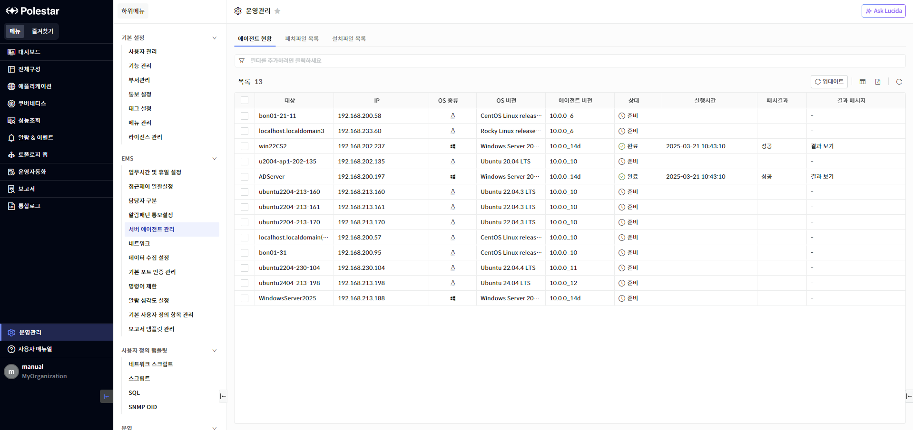
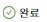
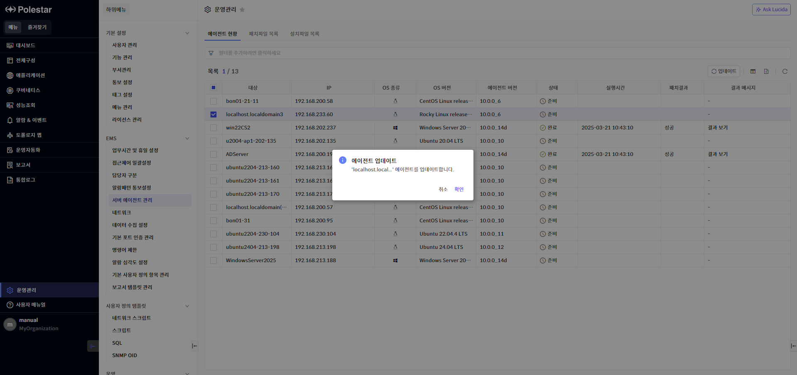
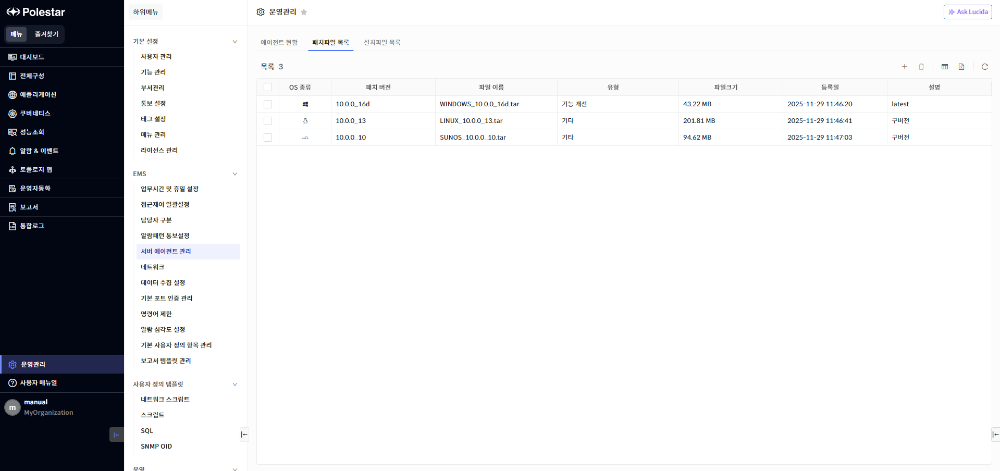
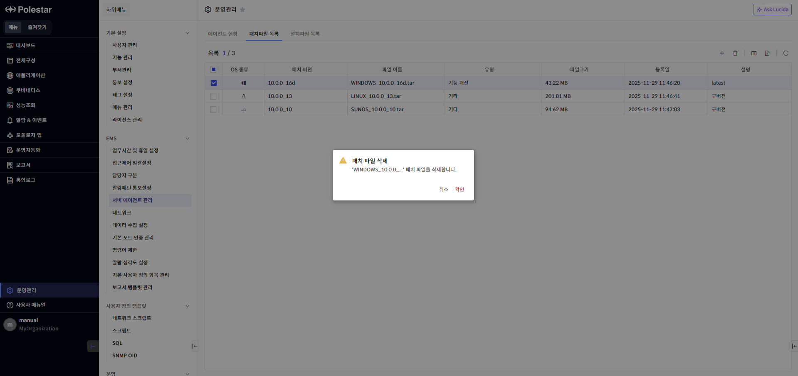
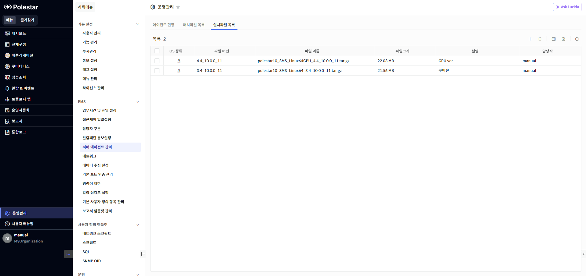
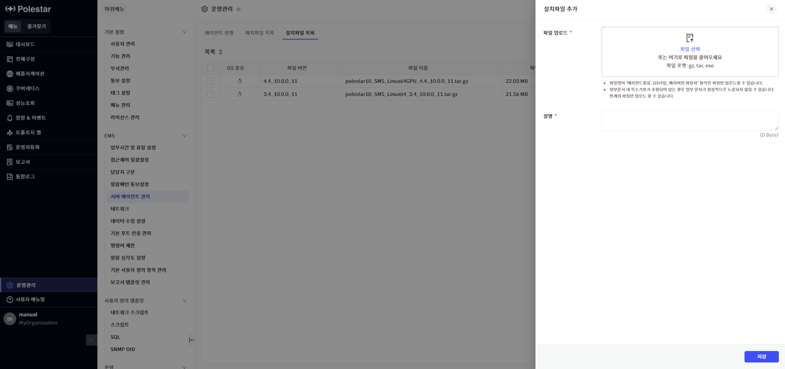
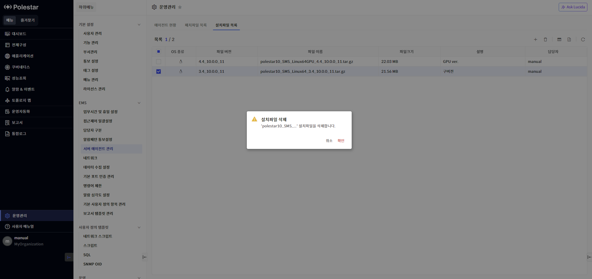

서버 에이전트 관리

운영관리에서 \[서버 에이전트 관리\]를 선택하여 POLESTAR에 등록된 서버 장비의 에이전트 정보 확인 및 에이전트 업데이트를 진행할 수 있습니다.

에이전트 현황

\[에이전트 현황\] 탭을 선택하여 POLESTAR에 등록된 에이전트 목록을 확인할 수 있습니다.

▶ \[그림1\] 에이전트 현황 목록

> 화면 지표

<table>
<thead>
<tr class="header">
<th>대상</th>
<th>에이전트가 설치된 서버의 시스템 명을 표시합니다.</th>
</tr>
</thead>
<tbody>
<tr class="odd">
<td>IP</td>
<td>에이전트가 설치된 서버의 IP 주소를 표시합니다.</td>
</tr>
<tr class="even">
<td>OS 종류</td>
<td>에이전트가 설치된 서버의 운영체제를 대표 로고 아이콘으로 표시합니다.</td>
</tr>
<tr class="odd">
<td>OS 버전</td>
<td>에이전트가 설치된 서버의 운영체제 버전을 표시합니다.</td>
</tr>
<tr class="even">
<td>에이전트 버전</td>
<td>에이전트 버전을 표시합니다.</td>
</tr>
<tr class="odd">
<td>상태</td>
<td>
패치 작업 상태를 표시합니다.

: 패치 작업 이력이 없는 에이전트

: 패치 작업 진행 중인 에이전트

: 패치 작업 이력이 있는 에이전트
</td>
</tr>
<tr class="even">
<td>실행시간</td>
<td>패치 작업 시작 시간을 표시합니다.</td>
</tr>
<tr class="odd">
<td>패치결과</td>
<td>패치 작업의 성공 여부를 표시합니다. 패치 작업 이력이 없는 에이전트는 패치결과가 공란입니다.</td>
</tr>
<tr class="even">
<td>결과 메시지</td>
<td>패치 작업의 결과 메시지를 표시합니다. 메시지를 클릭하여 자세한 패치 로그를 확인할 수 있습니다.</td>
</tr>
</tbody>
</table>

에이전트 업데이트

서버에 설치된 에이전트에 대해 일괄 업데이트 기능을 지원합니다. 에이전트 업데이트에 사용할 패치 파일이 \[패치파일 목록\]에 저장되어 있어야 합니다.

▶ \[그림2\] 에이전트 업데이트

> 에이전트 업데이트 절차

1.  업데이트할 에이전트 선택 (다중 선택 가능)

2.  에이전트 현황 목록 우측 상단의 \[업데이트\] 버튼 클릭

3.  업데이트 확인 메시지창에서 \[업데이트\] 버튼 클릭

패치파일 목록

\[패치파일 목록\] 탭을 선택하여 에이전트 업데이트 시 사용할 패치파일을 관리할 수 있습니다.

▶ \[그림3\] 패치파일 목록

> 화면 지표

| OS 종류 | 패치파일이 지원하는 운영체제 종류를 대표 로고 아이콘으로 표시합니다                                           |
| ----- | ------------------------------------------------------------------------------- |
| 패치 버전 | 패치 버전을 표시합니다.                                                                   |
| 파일 이름 | 패치파일 이름을 표시합니다. 파일명 포맷은 ‘OS타입\_패치버전.tar’ 입니다. 파일 이름을 클릭하여 패치파일을 다운로드 받을 수 있습니다. |
| 유형    | 패치파일의 용도를 표시합니다.                                                                |
| 파일크기  | 패치파일의 크기를 표시합니다.                                                                |
| 등록일   | 패치파일 등록일시를 표시합니다.                                                               |
| 설명    | 패치파일에 대한 설명을 표시합니다.                                                             |

패치파일 저장

패치파일은 파일 명명규칙을 준수한 경우만 저장할 수 있으며, OS별로 1개의 패치파일만 저장됩니다.

<table>
<tbody>
<tr class="odd">
<td>
노트

패치파일은 tar 포맷만 지원합니다. 파일명은 ‘OS종류_패치버전.tar’ 양식을 충족해야 합니다.
</td>
</tr>
</tbody>
</table>

▶ \[그림4\] 패치파일 저장

> 패치파일 저장 절차

1.  패치파일 목록 우측 상단의 \[추가\] 버튼 클릭

2.  추가할 패치파일을 선택하고 \[저장\] 버튼 클릭

패치파일 삭제

등록된 패치파일을 삭제할 수 있습니다.

<table>
<tbody>
<tr class="odd">
<td>
주의

패치파일이 저장되어 있지 않으면 에이전트 업데이트 기능을 사용할 수 없습니다.
</td>
</tr>
</tbody>
</table>

▶ \[그림5\] 패치파일 삭제

> 패치파일 삭제 절차

1.  패치파일 목록에서 삭제할 패치 파일 선택 (다수 선택 가능)

2.  패치파일 목록 우측 상단의 \[삭제\] 버튼 클릭

3.  삭제 확인 메시지창에서 \[확인\] 버튼 클릭

설치파일 목록

\[설치파일 목록\] 탭을 선택하여 에이전트 설치 파일을 관리할 수 있습니다.

▶ \[그림6\] 설치파일 목록

> 화면 지표

| OS 종류 | 설치파일이 지원하는 운영체제 종류를 대표 로고 아이콘으로 표시합니다                                                 |
| ----- | ------------------------------------------------------------------------------------- |
| 파일 버전 | 설치파일 버전을 표시합니다.                                                                       |
| 파일 이름 | 설치파일 이름을 표시합니다. 파일명 포맷은 ‘에이전트종류\_OS타입\_패치버전.확장자’ 입니다. 파일명을 클릭하여 설치파일을 다운로드 받을 수 있습니다. |
| 파일크기  | 설치파일의 크기를 표시합니다.                                                                      |
| 설명    | 설치파일에 대한 설명을 표시합니다.                                                                   |
| 담당자   | 설치파일을 등록한 사용자 ID를 표시합니다.                                                              |

설치파일 저장

설치파일은 파일 명명규칙을 준수한 경우만 저장할 수 있으며, 파일명이 같은 파일을 저장할 경우 기존 파일을 덮어씁니다.

<table>
<tbody>
<tr class="odd">
<td>
노트

설치파일은 tar.gz, tar, exe 포맷만 지원합니다. 파일명은 ‘에이전트종류_OS타입_패치버전.확장자’ 양식을 충족해야 합니다.
</td>
</tr>
</tbody>
</table>

▶ \[그림7\] 설치파일 저장

> 설치파일 저장 절차

1.  설치파일 목록 우측 상단의 \[추가\] 버튼 클릭

2.  추가할 설치파일을 선택하고 \[저장\] 버튼 클릭

설치파일 삭제

등록된 설치파일을 삭제할 수 있습니다.

▶ \[그림8\] 설치파일 삭제

> 설치파일 삭제 절차

1.  설치파일 목록에서 삭제할 설치 파일 선택 (다수 선택 가능)

2.  설치파일 목록 우측 상단의 \[삭제\] 버튼 클릭

3.  삭제 확인 메시지창에서 \[확인\] 버튼 클릭

